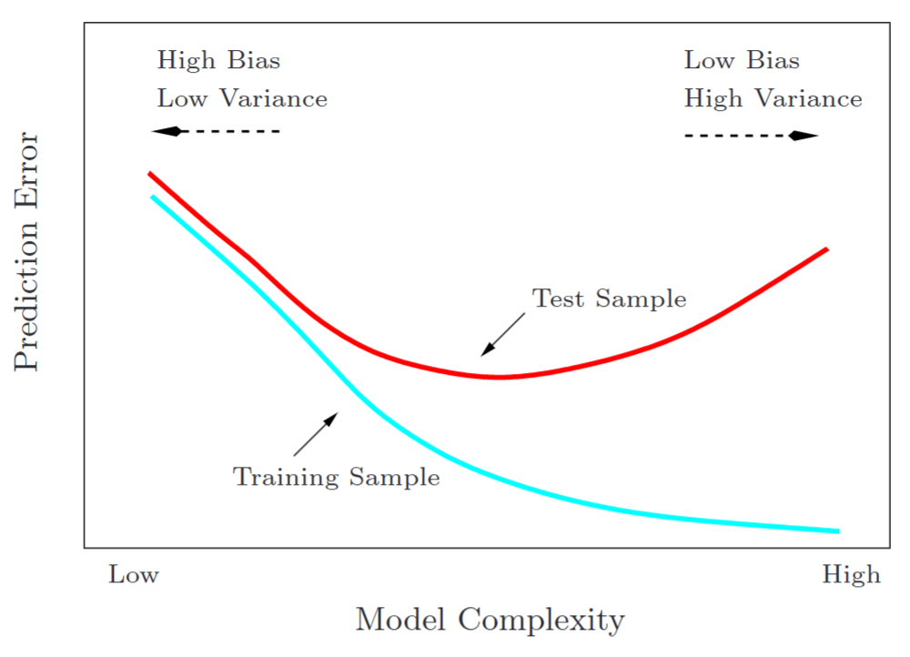
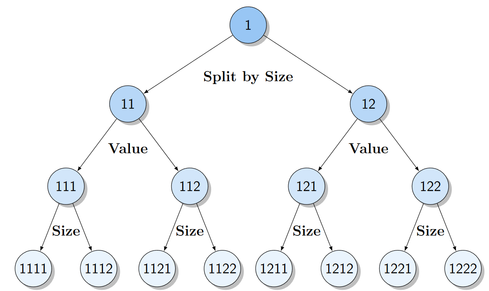

# Bias-Variance Trade-Off

## 设定

- 真实：目标 $t$ 由因素 $x$ 决定，$t$ 与 $x$ 都是随机变量，我们看到的数据是 $t$ 与 $x$ 的采样。
- 目标：通过数据集 $\mathcal{D}$，估计模型 $y$ 的参数 $w$，输出 $y(x,\ w;\ \mathcal{D})$，预测 $t$。
- 误差度量：平方误差函数。

## Bias-Variance 分解

（样本外）期望误差为

$$
\begin{equation}
    \E(L) = \int \int [y(x) - t]^{2} \cdot p(x,\ t) ~ \mathrm{d}x ~ \mathrm{d}t
\end{equation}
$$

选择能最小化期望误差的 y(x)：令变分

$$
\frac{\mathop{\delta} \E(L)}{\mathop{\delta} y(x)} = 2 \int [y(x) - t] \cdot p(x,\ t) ~ \mathrm{d}t = 0
$$

$$
\begin{align}
    \implies \int y(x) \cdot p(x,\ t) ~ \mathrm{d}t &= \int t \cdot p(x,\ t) ~ \mathrm{d}t \notag \\
    y(x) \cdot p(x) &= \int t \cdot p(x,\ t) ~ \mathrm{d}t \notag\\
    y(x) &= \int t \cdot p(t \mid x) ~ \mathrm{d}t \notag \\
    y(x) &= \E_{t}(t \mid x) \\
\end{align}
$$

鉴于我们知道了 $y(x)$ 的最优解为 $\E_{t}(t \mid x)$，平方误差 $L$ 可以拆分为

$$
\begin{aligned}
    [y(x) - t]^{2} &= [y(x) - \E_{t}(t \mid x) + \E_{t}(t \mid x) - t]^{2} \\
    &= [y(x) - \E_{t}(t \mid x)]^{2} + 2 [y(x) - \E_{t}(t \mid x)][\E_{t}(t \mid x) - t]\\ 
    &\phantom{=} + [\E_{t}(t \mid x) - t]^{2}
\end{aligned}
$$

取期望之后中间的交互项会消失（$\E_{t}[\E_{t}(t \mid x) - t \mid x] = 0$），则期望误差为

$$
\begin{align}
    \E(L) &= \int \int [y(x) - \E_{t}(t \mid x)]^{2} \cdot p(x,\ t) ~ \mathrm{d}t ~ \mathrm{d}x + \int \int [\E_{t}(t\mid x) - t]^{2} \cdot p(x,\ t) ~ \mathrm{d}t ~ \mathrm{d}x\notag \\
    &= \int [y(x) - \E_{t}(t \mid x)]^{2} \cdot p(x) ~ \mathrm{d}x + \int \underbrace{\Var(t \mid x)}_{\text{Noise}} \cdot p(x) ~ \mathrm{d}x
\end{align}
$$

考虑 parametric 的模型 $y(x,\ w)$，其中 $w$ 为参数。假设我们能获取的数据是 $N$ 个从 $p(x,\ t)$ 中独立抽样得到的样本，这些数据构成数据集合 $\mathcal{D}$，则我们可以根据 $\mathcal{D}$ 训练得到 $y(x,\ w;\ \mathcal{D})$，简写为 $y(x;\ \mathcal{D})$。不同的数据集 $\mathcal{D}$ 可能会得到不同的 $y$，因此评判算法好坏时应该去看平均情况下 $y$ 的表现，即期望误差需要对 $\mathcal{D}$ 再取个期望。

于是 $\eqref{3}$ 式变成

$$
\begin{equation}
    \E(L) = \E_{\mathcal{D}}\left[\int [y(x;\ \mathcal{D}) - \E_{t}(t \mid x)]^{2} \cdot p(x) ~ \mathrm{d}x \right] + \int \Var(t \mid x) \cdot p(x) ~ \mathrm{d}x
\end{equation}
$$

第一项可以拆成

$$
\begin{aligned}
    [y(x;\ \mathcal{D}) - \E_{t}(t \mid x)]^{2} &= [y(x;\ \mathcal{D}) - \E_{\mathcal{D}}[y(x;\ \mathcal{D})] + \E_{\mathcal{D}}[y(x;\ \mathcal{D})] - \E_{t}(t \mid x)]^{2} \\
    &= [y(x;\ \mathcal{D}) - \E_{\mathcal{D}}[y(x;\ \mathcal{D})]]^{2} + 2 [y(x;\ \mathcal{D}) - \E_{\mathcal{D}}[y(x;\ \mathcal{D})]] [\E_{\mathcal{D}}[y(x;\ \mathcal{D})] - \E_{t}(t \mid x)]\\
    &\phantom{=} + [\E_{\mathcal{D}}[y(x;\ \mathcal{D})] - \E_{t}(t \mid x)]^{2}
\end{aligned}
$$

取期望后中间的交互项会消失（$\E_{\mathcal{D}}[y(x;\ \mathcal{D}) - \E_{\mathcal{D}}[y(x;\ \mathcal{D})]] = 0$），则期望误差为

$$
\begin{align}
    \E(L) &= \E_{\mathcal{D}}\left[\int [\E_{\mathcal{D}}[y(x;\ \mathcal{D})] - \E_{t}(t \mid x)]^{2} ~ \mathrm{d}x + \int [y(x;\ \mathcal{D}) - \E_{\mathcal{D}}[y(x;\ \mathcal{D})]]^{2} \cdot p(x) ~ \mathrm{d}x \right] \notag\\
    &\phantom{=} + \int \Var(t \mid x) \cdot p(x) ~ \mathrm{d}x \notag\\
    &= \int [\underbrace{\E_{\mathcal{D}}[y(x;\ \mathcal{D})] - \E_{t}(t \mid x)}_{\text{Bias}}]^{2} ~ \mathrm{d}x + \int \underbrace{\Var[y(x;\ \mathcal{D})]}_{\text{Variance}} \cdot p(x) ~ \mathrm{d}x \notag\\
    &\phantom{=} + \int \underbrace{\Var(t \mid x)}_{\text{Noise}} \cdot p(x) ~ \mathrm{d}x \\
    &= (\text{Bias})^{2} + \text{Variance} + \text{Noise}
\end{align}
$$

## Bias-Variance Trade-Off

模型的选择存在 Bias 和 Variance 的 trade-off，通常

- High Bias $\iff$ Low Variance
- Low Bias $\iff$ High Variance

图源：ESL（Hastie 等，2009）

如上图，模型越简单越容易出现 High Bias Low Variance，即不同的数据集 $\mathcal{D}$ 效果都差不多，但都比较差；模型越复杂越容易出现 Low Bias High Variance，即不同的数据集 $\mathcal{D}$ 效果差别很大（过拟合），但平均下来比较好。

## AP Tree 中的 Bias-Variance Trade-Off

AP Tree（Bryzgalova 等，2021）的结构如下：

其中每个节点都代表一个 portfolio。在进行 pruning 的时候，选择高层节点（父节点）代表 High Bias Low Variance，选择低层节点（子节点）代表 Low Bias High Variance。

原因探讨：

- 由数据量决定
- 由模型复杂度决定

> *AP-Pruning achieves an optimal bias-variance trade-off by properly weighting the tree portfolios. **Tree portfolios at higher nodes are more diversified, resulting in a smaller variance**, while lower nodes capture a more complex structure in the returns at the cost of higher variance. **To mitigate this trade-off, we use the weighting scheme** inspired by the properties of the GLS estimator. &mdash; Bryzgalova et al. (2021)*

似乎是模型复杂度引起数据量的不同，而数据量的不同又直接导致了 trade-off。

## 参考文献

Bishop, C. M., & Nasrabadi, N. M. (2006). Pattern recognition and machine learning (Vol. 4, No. 4, p. 738). New York: springer.

Bryzgalova, S., Pelger, M., & Zhu, J. (2021). Forest Through the Trees: Building Cross-Sections of Stock Returns. SSRN Electronic Journal. https://doi.org/10.2139/ssrn.3493458

Hastie, T., Tibshirani, R., Friedman, J. H., & Friedman, J. H. (2009). The elements of statistical learning: data mining, inference, and prediction (Vol. 2, pp. 1-758). New York: springer.
