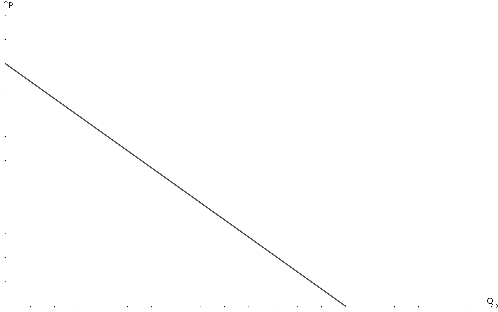
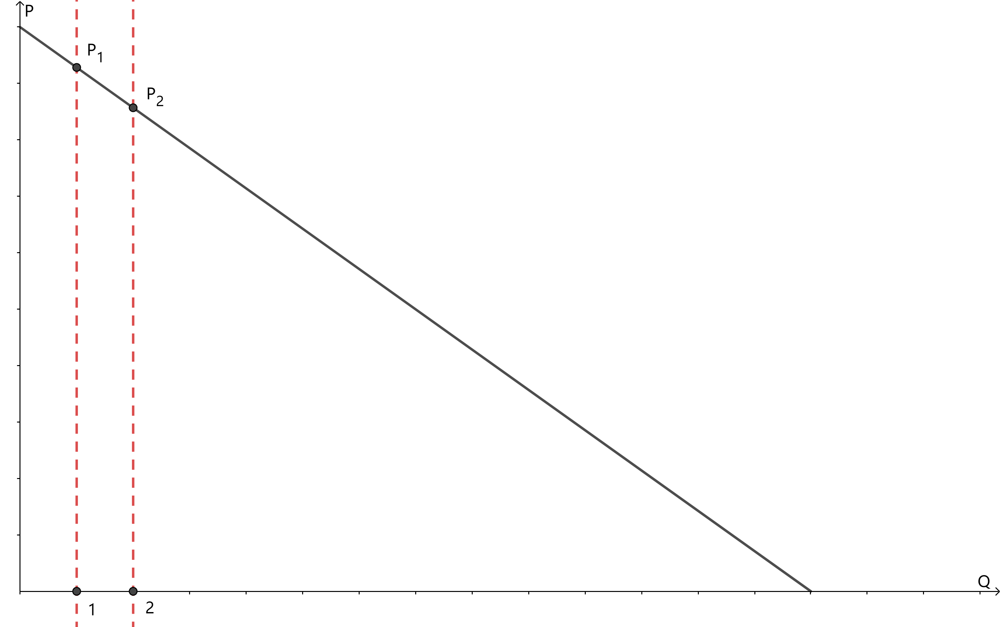
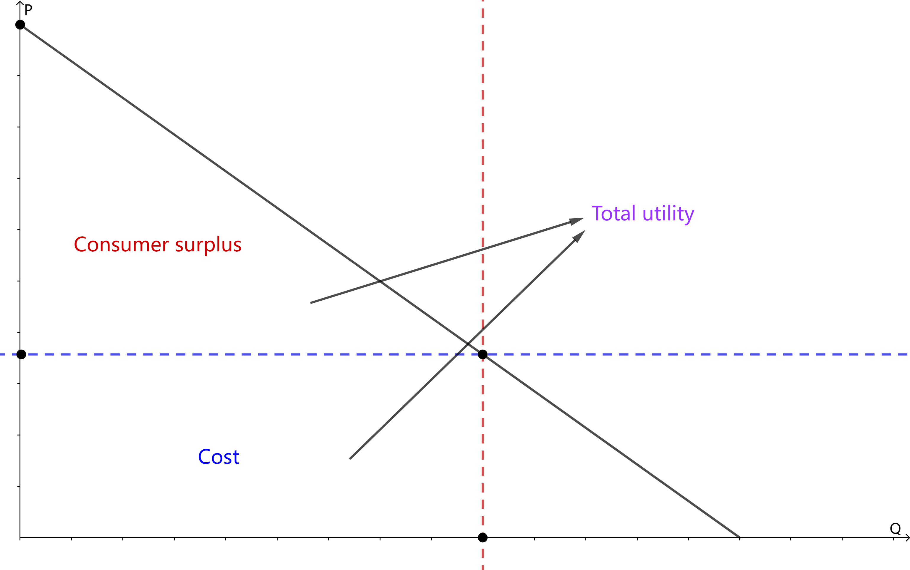
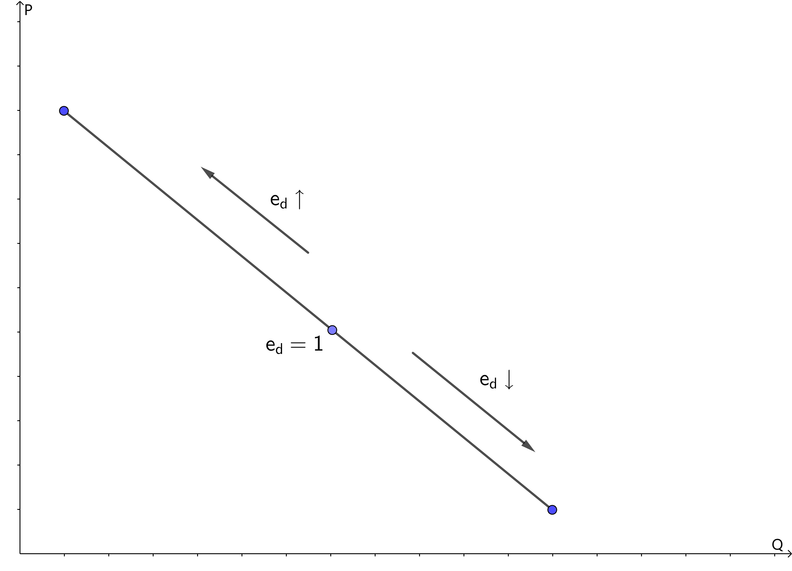

# Economics

## Demand and Supply

### Demand

#### What Affect Demand?

- Price of product
- Income of consumer
- Price of other products
  - Price of subsititutes
  - Price of complements
- ...

#### Demand Function

We simply fix all other factors except price of product, to get a simple linear function to describe the relationship between price and quantity: 

$$
Q_d = c_d - k_d P
$$

where $c_d$ is a constant and $k_d$ is usually bigger than $0$.

The <mark>inverse demand function</mark> is given by 

$$
P = \frac{c_d}{k_d} - \frac{1}{k_d}Q_d
$$

<mark>Since we draw the demand curve with price on the y-axis by default, we actually draw the inverse demand function.</mark>

### Supply

#### What Affect Supply?

- Cost
  - Price of materials
  - Wage
- Price of product
- ...

#### Supply Function

Similar to demand function, the supply function can be simplified to be a linear function: 

$$
Q_s = c_s + k_s P
$$

where $c_s$ is a constant and $k_s$ is usually bigger than $0$.

To draw the supply curve, we also need to get the inverse supply function.

### Analysis of Demand and Supply Curves

#### Movement of Curves

- Move along the line: Price changes
- Shift: Other factors change

#### Market Equilibrium

Intersection of demand and supply curves.

#### Consumer Surplus

We can see the demand curve as an <mark>margin utility</mark> curve for consumers since any point on the curve represents the highest price that consumers would pay for the corresponding quantity.

For example, when consumers consume a unit of product, the value of utility is the same as the price $P_1$. When consumers consume an additional unit of product, the increase of utility is just $P_2$. Thus, we have a decreasing margin utility.

<mark>Total utility is the integral of margin utility curve, i.e., the area under the curve</mark>, while the cost of the utility is the price you buy at times the quantity you buy. Therefore, we have 

$$
\text{Consumer surplus} = \text{Total utility} - \text{Cost}
$$

## Elasticity

### Price Elasticity

Price elasticity is the percentage of change of quantity if price changes 1\%. We take the price elasticity of demand as an example since that of supply is similar.

$$
e_d  = \frac{\Delta Q_d / Q_d}{\Delta P / P}
$$

Two types of elasticity: 

- arc elasticity: $e_d  = \frac{(Q_2 - Q_1) / \overline{Q}}{(P_2 - P_1) / \overline{P}}$ where $\overline{Q} = \frac{Q_1 + Q_2}{2}$ and $\overline{P} = \frac{P_1 + P_2}{2}$;
- **point elasticity**: $e_d = \frac{\Delta Q_d}{\Delta P}\cdot \frac{P}{Q_d} = \frac{\mathrm{d}Q_d}{\mathrm{d}P}\cdot \frac{P}{Q_d}$.

> [!NOTE]
> Although the numeric results of price elasticity are generally negative, sometimes we only consider the absolute value.

- $e_d < 1$: demand is inelastic, if $e_d = 0$, demand is perfectly inelastic;
- $e_d = 1$: demand is unit/unitary elastic;
- $e_d > 1$: demand is elastic, if $e_d = \infty$, demand is perfectly elastic.

#### How to Find the Maximal Revenue Point

Since demand function is linear, $\frac{\mathrm{d}Q_d}{\mathrm{d}P}$ is a constant and we can change $\frac{P}{Q_d}$ to get any elasticity, there must be a point at which the elasticity is unitary.

This point is the maximal revenue point.

#### Factors that Influence the Elasticity of Demand

- **Availability of substitutes**: If good substitutes are available, elasticity $\uparrow$.
- **The relative amount of income spent on the good**: amount $\downarrow$, elasticity $\downarrow$.
- **Time period since the price change**: shorter period means people cannot find good substitutes and hence elasticity $\downarrow$.

### Cross Elasticity

Cross elasticity is the percentage of change of quantity if the other goods' price changes 1\%.

$$
e_c = \frac{\Delta Q_d^{x} / Q_d^{x}}{\Delta P_y / P_y} = \frac{\Delta Q_d^{x}}{\Delta P_y}\cdot \frac{P_y}{Q_d^{x}} = \frac{\mathrm{d}Q_d^{x}}{\mathrm{d}P_y}\cdot \frac{P_y}{Q_d^{x}}
$$

for goods $x$ and $y$.

- $e_c > 0$: $x$ and $y$ are substitutes;
- $e_c < 0$: $x$ and $y$ are complements.

### Income Elasticity

Income elasticity is the percentage of change of quantity if the income changes 1\%.

$$
e_i = \frac{\Delta Q_d / Q_d}{\Delta I / I} = \frac{\Delta Q_d}{\Delta I}\cdot \frac{I}{Q_d} = \frac{\mathrm{d}Q_d}{\mathrm{d}I}\cdot \frac{I}{Q_d}
$$

- $e_i > 0$: normal goods;
  - $0 < e_i \leqslant 1$: necessities;
  - $e_i > 1$: luxuries;
- $e_i < 0$: inferior goods.

### Substitution and Income Effects

Generally, the price elasticity of demand is negative, resulted by substitution effect and income effect.

$$
\text{Total effect} = \text{Substitution effect} + \text{Income effect}
$$

Assume customers buy only 2 subtitutes $x$ and $y$. Since $x$ is a substitute for $y$, when $P_x \downarrow$, $Q_x \uparrow$. This is called **substitution effect**.

- If $x$ is normal goods, $e_i^{x} > 0$, when $P_x \downarrow$, with $P_y$ unchanged, $I$ relatively increases and hence $Q_d^{x} \uparrow$. This means the income effect of normal goods has the same direction as the substitution effect and thus the total effect is $P_x \downarrow$, $Q_d^{x} \uparrow$;
- If $x$ is inferior goods, $e_i^{x} < 0$, when $P_x \downarrow$, with $P_y$ unchanged, $I$ relatively increases and hence $Q_d^{x} \downarrow$. This means the income effect of inferior goods has the opposite direction as the substitution effect. If substitution effect dominates, then the total effect is still $P_x \downarrow$, $Q_d^{x} \uparrow$; however, if income effect dominates, then the total effect will be $P_x \downarrow$, $Q_d^{x} \downarrow$. This kind of inferior goods is called **Giffen goods**.

