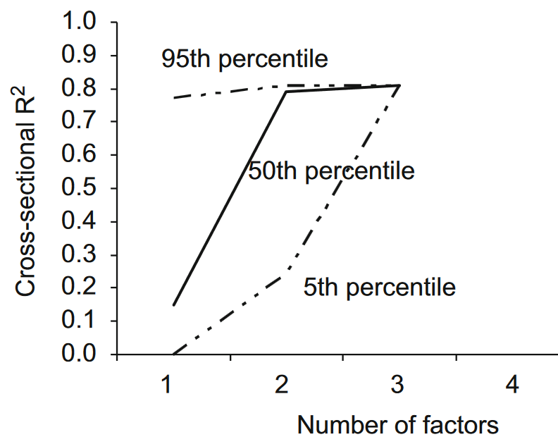

# 测试/比较因子定价模型

## 因子定价模型

因子定价模型是用因子对资产的总收益率（或超额收益率）建模，以解释资产的期望收益率在截面上的差异。比如最广为人知的 CAPM 模型，它假设

$$
\E[\tilde{R}] - R_f = \frac{\Cov(\tilde{R}_{m},\ \tilde{R})}{\Var(\tilde{R}_{m})} (\E[\tilde{R}_{m}] - R_f), \tag{1}
$$

其中 $\tilde{R}$ 是任意资产的总收益率，$\tilde{R}_{m}$ 是市场组合的总收益率，$R_f$ 是无风险资产的总收益率。总收益率（gross return）就是投资 $1$ 块钱能带来多少的回报。带波浪线表示是一个随机变量，不带的则是一个常数。$\frac{\Cov(\tilde{R}_{m},\ \tilde{R})}{\Var(\tilde{R}_{m})}$ 就是我们常说的 $\beta$。

> [!NOTE|label:注意]
> 这里使用总收益率而不是收益率，是为了更好地将超额收益率区分开来，即超额收益率是 zero investment 的回报。

通常真正的市场组合是不为人知的，我们只能找到一个 proxy 来代替，比如市场指数。而如果不存在无风险资产的话，上式的 $R_f$ 还可以用 zero-beta rate $R_z$ 来代替：

$$
\E[\tilde{R}] - R_z= \frac{\Cov(\tilde{R}_{m},\ \tilde{R})}{\Var(\tilde{R}_{m})} (\E[\tilde{R}_{m}] - R_z),
$$

意思是如果存在和市场组合无关的资产（协方差为 $0$），那么它的期望总收益率就是 $R_z$。通过将资产总收益率投影到市场组合的总收益率上，我们可以得到

$$
\tilde{R} = \alpha + \beta \tilde{R}_{m} + \tilde{\varepsilon},
$$

其中 $\alpha = (1 - \beta) R_z$，$\tilde{\varepsilon}$ 是与市场组合总收益率无关且均值为 $0$ 的误差项。如果我们认为存在无风险资产，那么还可以将投影写成超额收益率的形式：

$$
\tilde{R} - R_f = \alpha + \beta (\tilde{R}_{m} - R_f) + \tilde{\varepsilon}, \tag{2}
$$

其中 $\tilde{R}_{m} - R_f$ 就是后来大家常用的市场因子。CAPM 告诉我们，对于任意资产，上式中的 $\alpha$ 应该为 $0$。因为如果 $\alpha \neq 0$，$(1)$ 式应该写成

$$
\E[\tilde{R}] - R_f = \alpha + \beta (\E[\tilde{R}_{m}] - R_f) \tag{3}
$$

因此 CAPM 提出后，人们就通过不同的方法来检验 CAPM 的 $\alpha$ 是否为 $0$。后来更多的因子定价模型被提出来，大家也同样会去检验这些模型的 $\alpha$ 是否为 $0$。而当因子定价模型多了之后，人们就开始考虑如何选择因子，或者如何比较不同的因子定价模型。

## 可交易因子与不可交易因子

一般地，一个单因子定价模型可以写成

$$
\E[\tilde{R}] - R_f = \beta \lambda, \tag{4}
$$

其中 $\beta := \frac{\Cov(\tilde{F},\ \tilde{R})}{\Var(\tilde{F})}$ 是因子载荷（因子暴露），$\tilde{F}$ 是因子值，$\lambda$ 是因子的风险溢价（风险价格），也就是投资 $1$ 块钱，在 $1$ 单位的风险（$\beta = 1$）下可以带来多少回报。我们通常将因子 $\tilde{F}$ 分为可交易因子和不可交易因子。可交易因子又分为两种：总收益率和超额收益率。不可交易因子大多是一些宏观指标（例如 GDP），或者大宗商品指数（例如原油指数）。我们来看看它们的区别。

当因子是总收益率时，它同样可以作为 $(4)$ 中的资产总收益率 $\tilde{R}$，这时候 $\beta = \frac{\Cov(\tilde{F},\ \tilde{F})}{\Var(\tilde{F})} = 1$，则 $\lambda = \E[\tilde{F}] - R_f$；当因子是超额收益率时，我们可以将它写成 $\tilde{F} = \tilde{R}_{L} - \tilde{R}_{S}$，其中 $\tilde{R}_{L}$ 和 $\tilde{R}_{S}$ 都是资产总收益率，因此也可以出现在 $(4)$ 式的左边：

$$
\begin{cases}
    \E[\tilde{R}_{L}] - R_f = \beta_{L} \lambda, \\
    \E[\tilde{R}_{S}] - R_f = \beta_{S} \lambda,
\end{cases} \implies
\E[\tilde{R}_{L}] - \E[\tilde{R}_{S}] = (\beta_{L} - \beta_{S}) \lambda
$$

根据定义，$\beta_{L} - \beta_{S} = \frac{\Cov(\tilde{F},\ \tilde{R}_{L}) - \Cov(\tilde{F},\ \tilde{R}_{S})}{\Var(\tilde{F})} = \frac{\Cov(\tilde{F},\ \tilde{R}_{L} - \tilde{R}_{S})}{\Var(\tilde{F})} = 1$，因此 $\lambda = \E[\tilde{R}_{L}] - \E[\tilde{R}_{S}] = \E[\tilde{F}]$。

对于可交易因子来说，风险溢价 $\lambda$ 是有定义的，是可以只通过因子值 $\tilde{F}$ 估计出来的。但对于不可交易因子来说，由于它既不是总收益率也不是超额收益率，因此它没法写到 $(4)$ 式的左边，也就没法直接写出对应的风险溢价 $\lambda$。因此对于不可交易因子来说，我们需要用其他的方式来估计它的风险溢价，比如使用截面回归。如果我们能够估计出每个资产的 $\beta$，那么我们可以将 $\E[\tilde{R}] - R_f$ 回归到 $\beta$ 上，从而得到 $\lambda$。但这就涉及到一个问题：如何选择 test assets $\tilde{R}$。选择不同的 test assets 会得到不同的结果，因此理论中我们更多地是讨论可交易因子，但实际中不可交易因子也是很重要的。

如果定价模型中有多个因子，我们可以将 $(4)$ 式拓展成

$$
\E[\tilde{R}] - R_f = \bm{\beta}^{\top} \bm{\lambda}, \tag{5}
$$

其中 $\bm{\beta} := \Var(\tilde{\bm{F}})^{-1} \Cov(\tilde{\bm{F}},\ \tilde{R})$ 是因子载荷向量，$\bm{\lambda}$ 是因子的风险溢价向量。你可能会注意到，当因子之间有相关性时，即使某一个因子 $\tilde{F}_{1}$ 是可交易因子，我们也不能直接用它自身的期望来估计它的风险溢价，但我们仍然可以只用 $\tilde{\bm{F}}$ 就将它的风险溢价表示出来。或者我们可以通过将因子做正交化处理，从而让因子之间失去相关性，那么就可以直接用因子的期望来估计它的风险溢价。

当然，以上都是我们假设模型正确的情况。在检验模型是否正确的时候，我们需要先假设一个更一般的模型：

$$
\E[\tilde{R}] - R_f = \alpha + \bm{\beta}^{\top} \bm{\lambda}, \tag{6}
$$

通过检验多出来的 $\alpha$ 是否等于 $0$ 来判断定价模型是否正确。当 $\alpha \neq 0$ 时，因子的风险溢价不能简单地写成因子期望的形式，这时我们会有其他方法来估计，后面会再仔细介绍。

## 检验因子定价模型会遇到的问题

在多因子的框架下，检验因子定价模型是否正确，就是检验 $(6)$ 式中的 $\alpha$ 是否为 $0$。对于可交易因子，我们可以直接写成投影形式：

$$
\tilde{R} - R_f = \alpha + \bm{\beta}^{\top} \tilde{\bm{F}} + \tilde{\varepsilon}, \tag{7}
$$

通过时序回归来检验每一个资产的 $\alpha$ 是否为 $0$。但这会遇到以下两个问题：

1. 投影只能保证 $\tilde{\varepsilon}$ 的均值为 $0$，但不能保证时序上没有相关性，也不能保证同方差，因此回归得到的标准误可能是不准确的；
2. 单独检验每个资产的 $\alpha$ 是否为 $0$，会遇到多重检验问题。

> [!TIP|label:多重检验问题]
> 假设我们对每个资产都做独立的检验，原假设为 $\alpha = 0$，假设检验的 level 是 $5\%$，即错误拒绝原假设的概率是 $5\%$，那么当我们检验 $100$ 个资产时，即使每一个都通过了检验，平均我们也会有 $5$ 个资产是错误拒绝了原假设的，至少有一个资产错误拒绝了原假设的概率是 $1 - (95\%)^{100} \approx 99.4\%$。这就是多重检验问题。

对于问题 1，我们可以通过使用考虑残差时序相关性以及异方差的标准误来解决，比如 Newey-West ([1987](#NW1987)) 标准误；还可以使用 GMM ([1982](#H1982)) 来替代 OLS。对于问题 2，我们有两种办法解决，一种是使用 Fama-Macbeth ([1973](#FM1973)) 两步法将多重检验转化为单一检验，另一种是使用一些多重检验的统计量，比如 GRS ([1989](#GRS1989)) 检验。

对于不可交易因子来说，由于不能写成投影形式 $(7)$ 来检验，我们需要多做一步截面回归，也就是将 $(6)$ 式的 LHS 回归到时序回归估计出来的 $\bm{\beta}$ 上，此时 $\alpha$ 是误差而不是截距。然而截面回归又会遇到以下两个问题：

1. 截面回归的残差 $\widehat{\alpha}$ 存在明显的相关性（且异方差）；
2. $\bm{\beta}$ 是由时序回归估计出来的，回归到一个估计值上存在 EIV (Errors-In-Variables) 问题。

对于问题 1，我们依旧可以使用 GMM ([1982](#H1982)) 来替代 OLS。对于问题 2，可以使用 Shanken ([1992](#S1992)) 修正来解决。Fama-Macbeth ([1973](#FM1973)) 两步法中也有一步是截面回归，但它通过取平均的方式缓解了问题 1，而问题 2 则没有解决。

然而不管是截面回归还是多重检验，我们还要面临一个更加实际的问题：test assets 应该如何选择。如果选择所有个股，则个股的高波动会导致估计误差的增加，个股的数量多会导致需要估计的参数多，而且个股的 panel 是不平衡的。一般大家会选择使用组合作为 test assets，这样就能一次性解决这三个问题，但选择什么样的组合仍然是我们需要决定的。过去大量的实证文章会提出各种各样的因子，然后 test assets 选择 Fama & French ([1992](#FF1992)) 中对市值和账面市值比进行 conditional sort 的 $5 \times 5 = 25$ 个组合（下称 FF25），说自己的因子能定价 FF25，证明自己的模型是正确的定价模型。这显然有悖直觉，于是 Lewellen et al. ([2010](#LNS2010)) 对这种实证方法进行了批判。

## A Skeptical Appraisal of Asset Pricing Tests

首先 Lewellen et al. ([2010](#LNS2010)) 证明了检验因子定价模型是否正确等价于检验因子 candidates 与真实模型中误差项的相关性是否为 $0$。假设真实模型可以写成如下投影形式：

$$
\tilde{R} - R_f = \bm{\beta}^{\top} \tilde{\bm{F}} + \tilde{\varepsilon}, \tag{8}
$$

即令 $(7)$ 式中的 $\alpha = 0$。那么当我们在检验一些因子 candidates $\tilde{\bm{G}}$ 的时候，通常会做如下截面回归

$$
\E[\tilde{R}] - R_f = \gamma_0 + \bm{\gamma}^{\top} \bm{\lambda} + \alpha, \tag{9}
$$

其中 $\bm{\gamma} := \Var(\tilde{\bm{G}})^{-1} \Cov(\tilde{\bm{G}},\ \tilde{R})$，$\bm{\lambda}$ 是 LHS 回归到 $\bm{\gamma}$ 上的回归系数，即风险溢价。$\gamma_0$ 是截距项，$\alpha$ 是误差项，我们希望它们都为 $0$。

假设因子 candidates $\tilde{\bm{G}}$ 的维度和真实因子 $\tilde{\bm{F}}$ 的维度相同（因子数量相同），当 $\Cov(\tilde{\varepsilon},\ \tilde{\bm{G}}) = \bm{0}$，我们有

$$
\begin{aligned}
    \bm{\gamma} &= \Var(\tilde{\bm{G}})^{-1} \Cov(\tilde{\bm{G}},\ \tilde{R}) \\
    &= \Var(\tilde{\bm{G}})^{-1} \Cov(\tilde{\bm{G}},\ \bm{\beta}^{\top}\tilde{\bm{F}}) \\
    &= \Var(\tilde{\bm{G}})^{-1} \Cov(\tilde{\bm{G}},\ \tilde{\bm{F}}) \bm{\beta} \\
    &=: \bm{P} \bm{\beta},
\end{aligned}
$$

即因子 candidates $\tilde{\bm{G}}$ 的载荷 $\bm{\gamma}$ 可以由真实因子 $\tilde{\bm{F}}$ 的载荷 $\bm{\beta}$ 进行线性变换 $\bm{P}$ 得到。假设 $\Cov(\tilde{\bm{G}},\ \tilde{\bm{F}})$ 是非奇异的（可逆的），根据 $(8)$ 式我们有

$$
\E[\tilde{R}] - R_f = \bm{\beta}^{\top} \E[\tilde{\bm{F}}] = (\bm{P}^{-1} \bm{\gamma})^{\top} \E[\tilde{\bm{F}}] = \bm{\gamma}^{\top} \bm{\lambda}
$$

其中 $\bm{\lambda} = (\bm{P}^{-1})^{\top} \E[\tilde{\bm{F}}]$。也就是说，当因子 candidates 的数量和真实因子数量一致，且它们之间的相关性非零，我们只需要因子 candidates 与真实模型中的误差项正交就可以完全解释资产的期望收益率。

那么对于 FF25 来说，它们是有很强的因子结构的，换句话说，它们所对应的真实模型基本就可以认为是 Fama & French ([1992](#FF1992)) 三因子模型（下称 FF3）。因此我们只需要找到与 FF3 误差项相关性小，且与 FF3 因子本身有一定相关性的因子就可以很好地解释 FF25。

当因子 candidates 的数量小于真实因子数量时，比方说 $\text{len}(\tilde{\bm{G}}) = J < K = \text{len}(\tilde{\bm{F}})$，Lewellen et al. ([2010](#LNS2010)) 证明了当因子 candidates 与真实模型中的误差项正交，且 $\text{rank}(\Cov(\tilde{\bm{F}},\ \tilde{\bm{G}})) = J$ 时，截面回归的 $R^{2}$ 的期望值是 $\frac{J}{K}$。FF25 的市场 beta 差不多都是 $1$，因此 Lewellen et al. ([2010](#LNS2010)) 认为 FF25 所对应的真实模型可以看作只有市值和账面市值比两个因子。这也就能解释为什么单看截面回归的 $R^{2}$，某些单因子或者两因子模型就能很好地解释 FF25。

根据这些假设，Lewellen et al. ([2010](#LNS2010)) 人为构造了一些因子：

$$
\tilde{G}_i = \bm{w}^{\top} \tilde{\bm{F}} + \tilde{\nu}_{i},\quad i = 1,\ 2,\ 3
$$

其中 $\bm{w}$ 是从标准正态分布中抽样得到的随机权重，$\tilde{\bm{F}}$ 就是 FF3 因子，$\tilde{\nu}_{i}$ 是与 FF25 无关的任意随机变量。抽样 $5,000$ 次，得到的截面 $R^{2}$ 分布如下：

可以看到，只用 $2$ 个因子就可以很容易地得到比较高的截面 $R^{2}$，只有 $1$ 个因子的时候也有机会得到比较高的截面 $R^{2}$。

除此之外，由于金融数据样本量少，回归的时候还存在抽样问题：即使真实的 $R^{2}$ 很小，在我们现有的样本中也有可能得到比较高的（调整）$R^{2}$，尤其是因子数量多的时候。根据这些问题，Lewellen et al. ([2010](#LNS2010)) 提出了几种解决方案：

1. 囊括更多的 test assets；
2. 对回归加一些有金融意义的限制，比如回归得到的 zero-beta rate 需要接近 risk-free rate，或者可交易因子的风险溢价需要接近它的均值等等；
3. 使用 GLS 的 $R^{2}$ 而不是 OLS（但 GLS 需要估计误差的协方差矩阵，引入了更多的参数，所以也不是一个很好的解决方案）；
4. 报告统计量的置信区间，而不是只看点估计和 $p$ 值。

当因子越来越多，很多模型都能够通过一些简单的 asset pricing test，但使用的 test assets 都不太一样，那么究竟哪个模型更正确？Barillas & Shanken ([2017](#BS2017)) 认为对于可交易因子来说，比较因子模型的正确性与 test assets 无关。

## Which Alpha?

过去人们比较不同因子定价模型的时候，可能会去看一些 test $\bm{\alpha} = \bm{0}$ 的统计量的大小，比如 GRS ([1989](#GRS1989)) 统计量。这种做法给大家一种印象 &mdash; test assets 在定价模型下所能获取的 $\bm{\alpha}$ 越接近于 $\bm{0}$ 越好。然而 Barillas & Shanken ([2017](#BS2017)) 通过简单的推导证明了并非如此。在比较不同因子定价模型时，如果因子都是可交易因子，我们更应该关注的是因子之间互相定价的 $\bm{\alpha}$ 大小，而非 test assets 的 $\bm{\alpha}$ 大小。

Barillas & Shanken ([2017](#BS2017)) 从两个角度去解释了为什么 test assets 的 $\bm{\alpha}$ 大小并不重要。

### GRS Test 角度

对于可交易因子，我们可以将因子定价模型写成投影形式，将式 $(7)$ 扩展成向量形式，我们有

$$
\tilde{\bm{R}} - R_f \bm{e} = \bm{\alpha} + \bm{\beta} \tilde{\bm{F}} + \tilde{\bm{\varepsilon}}, \tag{10}
$$

其中 $\tilde{\bm{R}}$ 是 $N \times 1$ 的资产总收益率随机向量，$\bm{e}$ 是 $N \times 1$ 的元素都是 $1$ 的向量，$\bm{\alpha}$ 是 $N \times 1$ 的截距项，$\bm{\beta}$ 是 $N \times K$ 的因子载荷矩阵，$\tilde{\bm{F}}$ 是 $K \times 1$ 的可交易因子随机向量，$\tilde{\bm{\varepsilon}}$ 是 $N \times 1$ 的与因子无关的误差项，均值为 $\bm{0}$，协方差矩阵为 $\bm{\Sigma}_{\varepsilon}$。Gibbons et al. ([1989](#GRS1989)) 告诉我们：

$$
\bm{\alpha}^{\top} \bm{\Sigma}_{\varepsilon}^{-1} \bm{\alpha} = \text{Sh}^{2}(\tilde{\bm{F}},\ \tilde{\bm{R}}) - \text{Sh}^{2}(\tilde{\bm{F}}), \tag{11}
$$

其中 $\text{Sh}(\cdot)$ 代表资产所能达到的最大夏普比，也就是切点组合 $\tau(\cdot)$ 的夏普比（默认包括无风险资产）。$\bm{\alpha} = \bm{0}$ 当且仅当 $\text{Sh}^{2}(\tilde{\bm{F}},\ \tilde{\bm{R}}) = \text{Sh}^{2}(\tilde{\bm{F}})$。

首先因子应当解释尽可能多的 test assets，假设我们要比较两组可交易因子 $\tilde{\bm{F}}_1$ 和 $\tilde{\bm{F}}_2$，我们要求 $\tilde{\bm{F}}_1$ 要定价 $\tilde{\bm{F}}_2$，$\tilde{\bm{F}}_2$ 要定价 $\tilde{\bm{F}}_1$。则对于 $\tilde{\bm{F}}_1$ 来说，它的 GRS 统计量为

$$
\text{Sh}^{2}(\tilde{\bm{F}}_1,\ \tilde{\bm{F}}_2,\ \tilde{\bm{R}}) - \text{Sh}^{2}(\tilde{\bm{F}}_1) \tag{12}
$$

而对于 $\tilde{\bm{F}}_2$ 来说，它的 GRS 统计量为

$$
\text{Sh}^{2}(\tilde{\bm{F}}_2,\ \tilde{\bm{F}}_1,\ \tilde{\bm{R}}) - \text{Sh}^{2}(\tilde{\bm{F}}_2) \tag{13}
$$

那么如果 $(12) < (13)$，我们说在 GRS test 上 $\tilde{\bm{F}}_1$ 优于 $\tilde{\bm{F}}_2$，那么这说明 $\text{Sh}^{2}(\tilde{\bm{F}}_1) > \text{Sh}^{2}(\tilde{\bm{F}}_2)$。可以看到在使用 GRS test 来比较因子定价模型时，我们只需要比较因子之间能得到的最大夏普比，而不用关心 test assets 到底是什么。

上面我们是将要比较的因子也加入了 test assets，而如果不这么做，只看原先 test assets 的 $\bm{\alpha}$ 大小来比较模型会有误导性。假设用 $\tilde{\bm{F}}_1$ 和 $\tilde{\bm{F}}_2$ 一起定价 test assets $\tilde{\bm{R}}$，投影形式为

$$
\tilde{\bm{R}} = \bm{\alpha}_{R,12} + \bm{\beta}_{R,1} \tilde{\bm{F}}_1 + \bm{\beta}_{R,2} \tilde{\bm{F}}_2 + \tilde{\bm{\varepsilon}}_{R,12} \tag{14}
$$

如果用 $\tilde{\bm{F}}_1$ 定价 $\tilde{\bm{F}}_2$，投影形式为

$$
\tilde{\bm{F}}_2 = \bm{\alpha}_{2,1} + \bm{\beta}_{2,1} \tilde{\bm{F}}_1 + \tilde{\bm{\varepsilon}}_{2,1} \tag{15}
$$

将 $(15)$ 式代入 $(14)$ 式，得到

$$
\tilde{\bm{R}} = (\bm{\alpha}_{R,12} + \bm{\beta}_{R,2} \bm{\alpha}_{2,1}) + (\bm{\beta}_{R,1} + \bm{\beta}_{R,2} \bm{\beta}_{2,1}) \tilde{\bm{F}}_1 + (\tilde{\bm{\varepsilon}}_{R,12} + \bm{\beta}_{R,2} \tilde{\bm{\varepsilon}}_{2,1}) \tag{16}
$$

如果 $\tilde{\bm{F}}_1$ 能完美定价 $\tilde{\bm{F}}_2$，即 $\bm{\alpha}_{2,1} = \bm{0}$，那么只用 $\tilde{\bm{F}}_1$ 定价 $\tilde{\bm{R}}$ 得到的 $\bm{\alpha}$ 和用 $\tilde{\bm{F}}_1$、$\tilde{\bm{F}}_2$ 一起定价 $\tilde{\bm{R}}$ 得到的 $\bm{\alpha}$ 是一样的。而当 $\bm{\alpha}_{2,1} \neq \bm{0}$，我们会发现，使用 $\tilde{\bm{F}}_1$、$\tilde{\bm{F}}_2$ 一起定价 $\tilde{\bm{R}}$ 得到的 $\bm{\alpha}$ 甚至有可能会大于只用 $\tilde{\bm{F}}_1$ 定价 $\tilde{\bm{R}}$ 得到的 $\bm{\alpha}$。

> Thus, the larger model can perform worse as judged by the magnitude of test-asset alphas, even when it is the better model. &mdash; Barillas & Shanken ([2017](#BS2017))

### Likelihood 角度

---

待解决：

- Fama-Macbeth 两步回归具体实现
- Shanken 修正具体实现
- GMM 具体实现
- GRS Test 具体实现
- GLS 残差协方差为什么可以用因变量协方差替代 

问题：

- $\alpha$ 的截面相关性
    - GRS
- test assets 如何选择
    - A Skeptical Appraisal of Asset Pricing Tests
    - Which Alpha、Choosing Factors
    - 不需要选择（贝叶斯）：Comparing Asset Pricing Models、On Comparing Asset Pricing Models
- 因子动物园
    - Taming the Factor Zoo
- EIV 问题
    - Optimal Cross-Sectional Regression
- 遗漏变量

## 时序回归

## 截面回归

## Fama-MacBeth 两步回归

## GMM

## Shanken’s T^2^ Test

## GRS Test

## HJ Bound

## ... and the Cross-Section of Expected Returns

## Which Alpha

## Choosing Factors

## Comparing Asset Pricing Models

## Taming the Factor Zoo

## Omitted Factors

## Optimal Cross-Sectional Regression

## 参考文献

Back, K. (Kerry). (2017). *Asset pricing and portfolio choice theory* (Second edition). Oxford University Press.

Barillas, F., & Shanken, J. (2017). Which Alpha? The Review of Financial Studies, 30(4), 1316–1338. https://doi.org/10.1093/rfs/hhw101

Fama, E. F., & MacBeth, J. D. (1973). Risk, Return, and Equilibrium: Empirical Tests. *Journal of Political Economy*, 81(3), 607–636. https://doi.org/10.1086/260061

Fama, E. F., & French, K. R. (1992). The Cross-Section of Expected Stock Returns. *The Journal of Finance*, 47(2), 427–465. https://doi.org/10.1111/j.1540-6261.1992.tb04398.x

Gibbons, M. R., Ross, S. A., & Shanken, J. (1989). A Test of the Efficiency of a Given Portfolio. *Econometrica*, 57(5), 1121. https://doi.org/10.2307/1913625

Hansen, L. P. (1982). Large Sample Properties of Generalized Method of Moments Estimators. *Econometrica*, 50(4), 1029. https://doi.org/10.2307/1912775

Lewellen, J., Nagel, S., & Shanken, J. (2010). A skeptical appraisal of asset pricing tests. *Journal of Financial Economics*, 96(2), 175–194. https://doi.org/10.1016/j.jfineco.2009.09.001

Newey, W. K., & West, K. D. (1987). A Simple, Positive Semi-Definite, Heteroskedasticity and Autocorrelation Consistent Covariance Matrix. *Econometrica*, 55(3), 703–708. JSTOR. https://doi.org/10.2307/1913610

Shanken, J. (1992). On the Estimation of Beta-Pricing Models. *The Review of Financial Studies*, 5(1), 1–33. https://doi.org/10.1093/rfs/5.1.1
