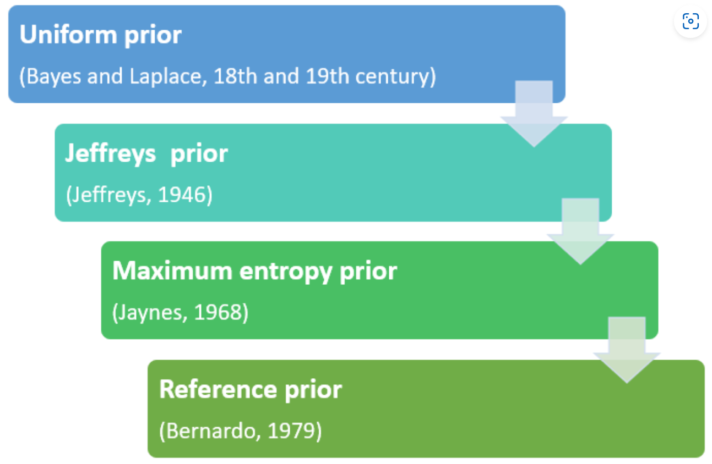

# 1. 贝叶斯简介

## 1.1 基石：贝叶斯定理

假设 $A$ 和 $B$ 是两个事件，且事件 $B$ 不是不可能事件，即 $P(B) > 0$。那么我们有

$$
P(A \mid B) = \frac{P(A)P(B \mid A)}{P(B)}.
$$

## 1.2 区别：频率派和贝叶斯派

**频率派**假设样本是足够多的，认为**概率等同于（相对）频率**，根据样本得到不同状态的频率后，频率派也就得到了不同状态的概率，那么分布其实已经确定下来了。因此也可以说频率派认为**分布的参数是一个固定值**，从这个角度来看，频率派更像是一个从**上帝**视角出发的学派。

**贝叶斯派**则是从**观察者**的角度出发，假设观察者的知识并不完备（样本不够多），分布就是不确定的，但如果连分布形式都不知道，那问题就比较难办。因此一般是先假设一个分布的形式，认为这个分布的参数是不确定的，**参数本身也服从一个分布**（来描述参数的不确定性）。贝叶斯派在做推断的时候，会首先根据观察者的先验知识假设一个参数的**先验分布（prior）**，把观测到的样本看成是支持或反对先验的**证据（evidence）**，并根据证据通过贝叶斯定理得到参数的**后验分布（posterior）**，这个过程其实也就是观察者自身的认知迭代。因此贝叶斯派认为<strong>（后验）概率是一种基于先验和证据的合理预期</strong>。

> [!EXAMPLE|label:举个例子]
> 假设一枚硬币只有两个状态：正面朝上（$1$）和反面朝上（$0$）。则这枚硬币的状态 $X$ 服从一个 $\text{Bernoulli}(p)$ 的分布，其中 $p = P(X=1)$。我们扔 10 次硬币，得到样本为 
> 
> $$1,\ 0,\ 1,\ 1,\ 1,\ 0,\ 1,\ 1,\ 0,\ 0,$$
>
> 其中有 6 次是正面朝上的。记这些样本为 $x_1,\ x_2,\ \cdots,\ x_{10}$。
> 
> 对于频率派来说，对 $p$ 的最佳估计就是样本中硬币正面朝上的相对频率，即 $\widehat{p} = \frac{6}{10} = 0.6$。但对于贝叶斯派来说，我们需要先假设一个 $p$ 的先验分布，比如我们如果认为 $p$ 可能均匀地等于任何一个 0 到 1 之间的数，就可以假设 $p \sim \text{Uniform}(0,\ 1)$。根据贝叶斯定理，我们有
>
> $$P(p \mid \bm{X}) = \frac{P(\bm{X} \mid p) P(p)}{P(\bm{X})} \propto \prod_{i=1}^{10} p^{x_i} (1 - p)^{1 - x_i} \cdot 1 = p^{6} (1 - p)^{4}$$
> 
> 这个密度函数的形式是 $\text{Beta}$ 分布，即 $p$ 的后验分布为 $p \mid X \sim \text{Beta}(7,\ 5)$。如果我们想要用一个确切的值来描述贝叶斯估计的结果，可以用这个后验分布的期望，即 $\E[p \mid X] = \frac{7}{7 + 5} \approx 0.583$。这个数字比起频率派的估计值 $0.6$ 要更接近 $0.5$ 一些。
>
> 实际上 $\text{Uniform}(0,\ 1) \sim \text{Beta}(1,\ 1)$，即先验分布是 $\text{Beta}$ 分布的时候，后验分布也是 $\text{Beta}$ 分布，这是一个很好的性质，这在后面会有更详细的介绍。
>
>  <iframe height=850 width=90% src="https://eurekastatistics.com/beta-distribution-pdf-grapher/" frameborder=0 allowfullscreen></iframe>

## 1.3 历史：从没落到复兴

人们常说频率派是古典学派，但其实频率派的体系最早是在 20 世纪初期由 Ronald Fisher，Jerzy Neyman 和 Egon Pearson 共同发展起来的，而贝叶斯派的基石——贝叶斯定理反而早在 18 世纪就由 Thomas Bayes 提出来并经由 Pierre-Simon Laplace 发展成相对成熟的体系了。换句话说，**贝叶斯派其实早于频率派**。

早期的贝叶斯派在 Laplace 的带领下，**通通使用均匀分布作为先验**，因为那时候大家认为均匀分布把概率均匀地分配所有可能的状态，应该是最客观的选择，而使用其他的主观先验则有可能后验分布没有解析形式（当时没有计算机）。但后来大家就发现了，**均匀先验并不客观**。假设数据的分布是正态分布 $N(\mu,\ \sigma^{2})$，我们是认为 $\sigma$ 服从均匀分布呢，还是认为 $\sigma^{2}$ 服从均匀分布呢？这两者显然得到的结果是不同的。更一般地，我们对参数做任意变换，他们不可能先验都是均匀分布，因此均匀分布在很多情况下其实是一个主观选择。于是贝叶斯派逐渐没落。

直到 1946 年，Harold Jeffreys 提出 Jeffereys prior，客观贝叶斯才渐渐有点起色。**Jeffereys prior 并不是某个特定的分布，而是根据参数的不同会给出不同的分布**，但**如果有多个参数时，多元的 Jeffereys prior 在收敛上会有问题**。

1968 年，Edwin Thompson Jaynes 提出了最大熵先验，他本人也是最大熵原理的提出者。最大熵先验的思想是：**给定先验分布的一些限制（比如矩条件），找到一个熵最大的分布，因为先验应该具有最大的不确定性**。如果没有任何限制，那么使用最大熵原理就会得到均匀先验。最大熵先验的问题在于**它给出的先验全都是指数族的**，先验形式并不广泛。

1979 年，Jose Bernardo 提出了 reference prior，想**让先验和后验的距离尽可能地远，即让证据提供尽可能多的信息**，使用任意形式的散度来衡量分布间的距离都可以，比如 KL 散度、Hellinger 距离等。**在只有一个参数的情况下，reference prior 等价于 Jeffereys prior**。Reference prior 的提出也被称作是**客观贝叶斯的复兴**。

[source](https://www.statlect.com/fundamentals-of-statistics/uninformative-prior)

## 1.4 为什么要用贝叶斯

1. 在 [1.2](#_12-区别：频率派和贝叶斯派) 中我们已经介绍了频率派和贝叶斯派的不同假设：频率派认为样本量足够多，贝叶斯派认为样本量不够。在现实生活中，尤其是金融领域，样本量往往是有限的，因此**贝叶斯派的假设更符合实际**；
2. 金融领域非常**注重不确定性（风险）**，而贝叶斯派就是用参数的分布来描述数据分布的不确定性，因此在金融领域使用贝叶斯派的方法很有必要；
3. 后续我们会介绍到，贝叶斯派的方法在回归问题中可以实现一些特殊的效果，比如**对回归参数做正态的先验假设等价于岭回归**，可以有效地解决多重共线性的问题，也可以很好地平衡 bias 和 variance；**对回归参数做拉普拉斯的先验假设等价于 Lasso 回归**，可以实现变量选择的效果。而金融领域又是做回归最多的领域，因此贝叶斯派的方法很适用。

<!-- 当样本的分布形式是二项分布 $\text{Binomial}(n,\ p)$ 时，对二项分布的概率参数 $p$ 使用均匀先验得到的后验是 $\text{Beta}$ 分布，我们在 [1.2](#_12-区别：频率派和贝叶斯派) 中已经用一个特例验证过了。当样本的分布形式是正态分布 $N(\mu,\ \sigma^{2})$ 时，对正态分布的均值参数 $\mu$ 使用均匀先验得到的后验是正态分布。对于这两种情况，均匀分布都是 $\text{Beta}$ 分布或者正态分布的特例， -->