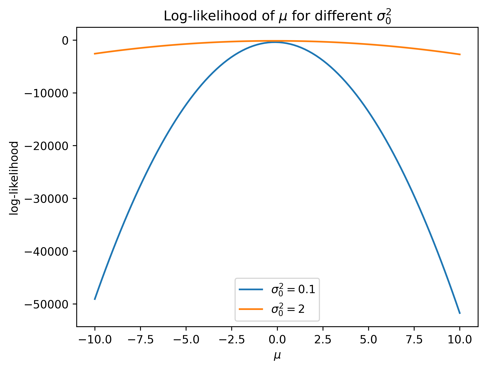
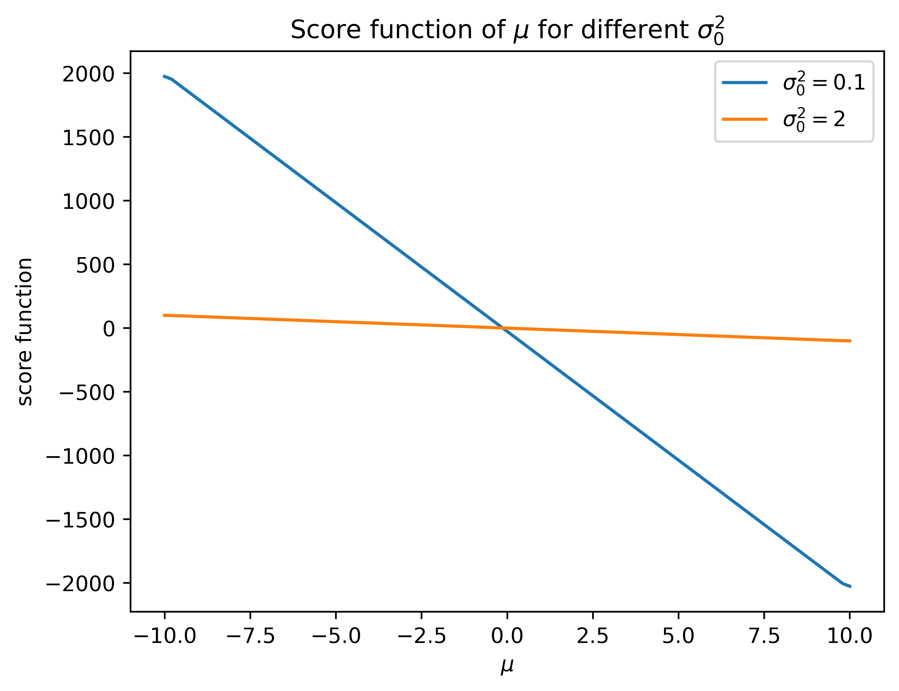
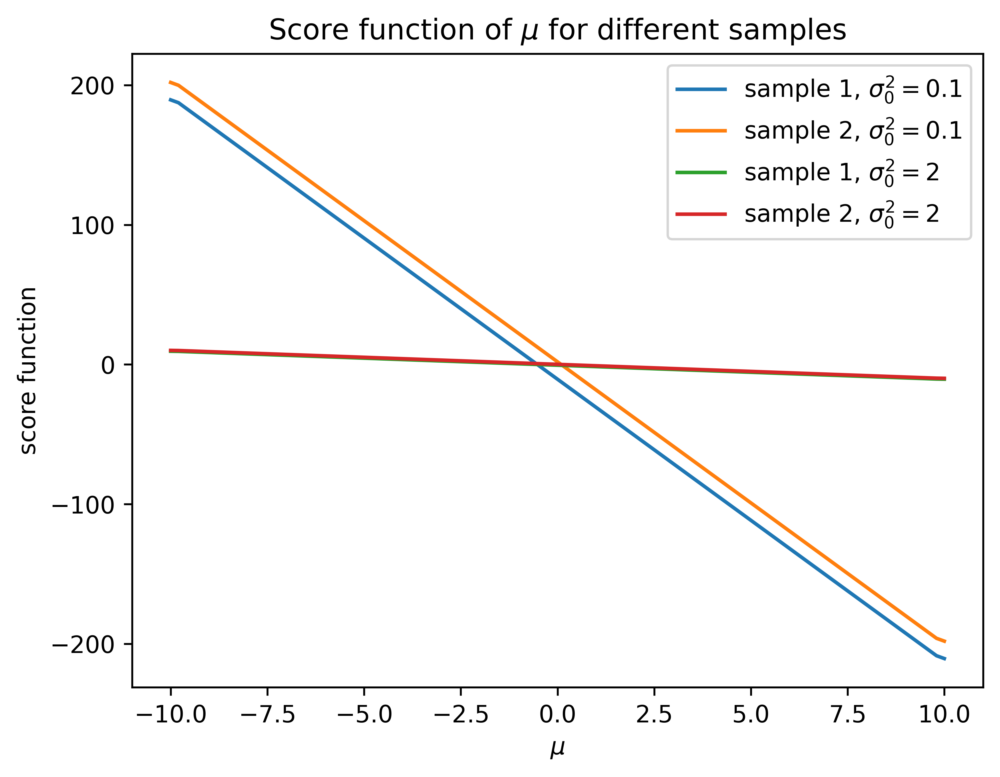

# 2. 先验分布

> [!ATTENTION|label:注意]
> 首先明确一点，当我们提到先验分布时，我们在讨论的是数据分布中**参数的分布**，这意味着我们已经假设了数据分布的形式。

## 2.1 共轭先验

如果先验分布和后验分布是同一个分布形式，比如都是正态分布，那我们称这样的先验为**共轭先验（conjugate prior）**。通常的表述是一个分布是数据分布关于某参数的共轭分布。比如“正态分布是正态分布关于均值的共轭先验”的意思是：如果数据服从正态分布 $N(\mu,\ \sigma^{2})$，那么对均值 $\mu$ 这个参数做正态分布的先验，得到的后验同样也是正态分布。前一个“正态分布”指的是先验分布，后一个“正态分布”指的是数据分布。鉴于先验和后验都是针对数据分布的参数，对于不同的数据分布，**一个先验分布可能在一种数据分布下是共轭的，但在另一种数据分布下就不是共轭的了。**

**使用共轭先验的好处在于后验分布有解析形式**，这样可以方便地计算后验分布的期望、方差等统计量。**但共轭先验并不是必须的**，只要后验分布有解析形式，我们就可以使用后验分布的统计量来描述后验分布。

> [!EXAMPLE|label:常见的共轭先验]
> 分布中已知的参数用下标 $0$ 表示，比如 $N(\mu,\ \sigma_0^{2})$ 代表方差已知的正态分布。
> 
> 

> 
> |                 数据分布                  |           参数           |                       共轭先验                       |
> | :---------------------------------------: | :----------------------: | :--------------------------------------------------: |
> |           $\text{Bernoulli}(p)$           |           $p$            |                    $\text{Beta}$                     |
> |        $\text{Binomial}(n_0,\ p)$         |           $p$            |                    $\text{Beta}$                     |
> |           $\text{NB}(r_0,\ p)$            |           $p$            |                    $\text{Beta}$                     |
> |         $\text{Poisson}(\lambda)$         |        $\lambda$         |                    $\text{Gamma}$                    |
> |   $\text{Multinomial}(n,\ k,\ \bm{p})$    |       $k,\ \bm{p}$       |                  $\text{Dirichlet}$                  |
> |          $N(\mu,\ \sigma_0^{2})$          |          $\mu$           |                   $\text{Normal}$                    |
> |          $N(\mu_0,\ \sigma^{2})$          |       $\sigma^{2}$       | $\text{Inverse Gamma or Scaled Inverse Chi-Squared}$ |
> |           $N(\mu,\ \sigma^{2})$           |    $\mu,\ \sigma^{2}$    |            $\text{Normal-Inverse Gamma}$             |
> | $\mathcal{N}(\bm{\mu},\ \bm{\Sigma}_{0})$ |        $\bm{\mu}$        |             $\text{Multivariate Normal}$             |
> | $\mathcal{N}(\bm{\mu}_{0},\ \bm{\Sigma})$ |      $\bm{\Sigma}$       |               $\text{Inverse-Wishart}$               |
> |   $\mathcal{N}(\bm{\mu},\ \bm{\Sigma})$   | $\bm{\mu},\ \bm{\Sigma}$ |           $\text{Normal-Inverse-Wishart}$            |
> |       $\text{Exponential}(\lambda)$       |        $\lambda$         |                    $\text{Gamma}$                    |
> |     $\text{Gamma}(\alpha_0,\ \beta)$      |         $\beta$          |                    $\text{Gamma}$                    |
> |       $\text{IG}(\alpha_0,\ \beta)$       |         $\beta$          |                    $\text{Gamma}$                    |
> 

> [!NOTE|label:尚未清楚]
> 在网上看到两种说法：
> 
> 1. 所有分布都可以是共轭先验。
> 2. 所有指数族分布都有共轭分布。
> 
> 但没有人说所有分布都有共轭分布。

## 2.2 Jeffreys prior

Jeffreys prior 的定义是

$$
\pi(\bm{\theta}) \propto \sqrt{\left\vert I(\bm{\theta}) \right\vert },
$$

其中 $I(\bm{\theta})$ 是 Fisher information。Fisher information 与 score function 有关，而 score function 又与 likelihood 有关，因此想要更好地理解 Jeffreys prior 需要从 likelihood 讲起。

### 2.2.1 Likelihood

<strong>Likelihood（似然）</strong>形式上和数据的联合分布是一样的，但**自变量是参数而不是数据**。比如数据 $\bm{x}$ 的联合分布是 $f(\bm{x} \mid \bm{\theta})$，其中 $\bm{\theta}$ 为参数，而 likelihood 则是 $L(\bm{\theta} \mid \bm{x})$。Likelihood 描述的是**在观测到数据 $\bm{x}$ 的情况下，参数 $\bm{\theta}$ 的可能性**。那么频率派想要找到一个最优的参数 $\bm{\theta}$，就是要找到一个使得 likelihood 最大的 $\bm{\theta}$，也就是我们常说的**极大似然估计（MLE）**。在最大化 likelihood 的时候，我们需要对它求导，但通常 likelihood 的形式比较复杂，求导比较困难，因此我们通常对 likelihood 取对数得到 log-likelihood，这样可以把乘法变成加法，简化计算。

> [!EXAMPLE|label:举个例子]
> 假设数据 $\bm{x}$ 服从方差已知的正态分布 $N(\mu,\ \sigma_0^{2})$，那么数据的联合分布是
>
> $$f(\bm{x} \mid \mu) = (2 \pi \sigma_0^{2})^{-\frac{n}{2}} \exp \left( -\frac{1}{2 \sigma_0^{2}} \sum_{i=1}^{n} (x_i - \mu)^{2} \right).$$
>
> 参数 $\mu$ 的 likelihood 是
>
> $$L(\mu \mid \bm{x}) = (2 \pi \sigma_0^{2})^{-\frac{n}{2}} \exp \left( -\frac{1}{2 \sigma_0^{2}} \sum_{i=1}^{n} (x_i - \mu)^{2} \right).$$
>
> 对 likelihood 取对数得到 log-likelihood：
>
> $$\ell(\mu \mid \bm{x}) = -\frac{n}{2} \log (2 \pi \sigma_0^{2}) - \frac{1}{2 \sigma_0^{2}} \sum_{i=1}^{n} (x_i - \mu)^{2}.$$
>
> 对 $\mu$ 求导并令导数为 0，可以得到
>
> $$\frac{\mathrm{d} \ell}{\mathrm{d} \mu} = \frac{1}{\sigma_0^{2}} \sum_{i=1}^{n} (x_i - \mu) = 0 \Rightarrow \widehat{\mu}_{\text{MLE}} = \frac{1}{n} \sum_{i=1}^{n} x_i,$$
>
> 即样本均值是 $\mu$ 的极大似然估计。

### 2.2.2 Score function

使用极大似然估计的时候，我们通常只取 likelihood 最大的那个点作为估计，却忽略了它的其他信息。考虑 [2.2.1](#_221-likelihood) 中正态分布的例子，$\mu$ 的 log-likelihood 为

$$
\ell(\mu \mid \bm{x}) = -\frac{n}{2} \log (2 \pi \sigma_0^{2}) - \frac{1}{2 \sigma_0^{2}} \sum_{i=1}^{n} (x_i - \mu)^{2},
$$

是一个开口向下的二次函数。对于同样的数据观测 $\bm{x}$，不同的 $\sigma_0^{2}$ 会让这个二次函数有不一样的形状：

可以看到，

- 当 $\sigma_0^{2}$ 比较小的时候（蓝线），log-likelihood 随 $\mu$ 的变化比较大，这说明我们在极大似然估计的基础上变化一点点，都会让 log-likelihood 变小很多，而极大似然估计是根据样本得到的，这说明**样本提供了大量的信息**（如果不按样本给的极大似然估计去随便取 $\mu$，会得到糟糕的结果）；
- 而当 $\sigma_0^{2}$ 比较大的时候（橙线），log-likelihood 随 $\mu$ 的变化比较小，这说明即使我们在极大似然估计的基础上变化很多，log-likelihood 也变小不了多少，这说明**样本提供的信息很少**（如果不按样本给的极大似然估计去随便取 $\mu$，结果也不会太差）。

这意味着 log-likelihood 的变化幅度跟样本的信息量有关。因此定义出 **score function**，即 log-likelihood 的偏导：

$$
S(\bm{\theta}) = \frac{\partial \ell(\bm{\theta})}{\partial \bm{\theta}}.
$$

大多情况下，score function 为 0 的点就是最大似然估计。

score function 本身并不是信息量，但通过它能得到 Fisher information，即它能告诉我们信息量有多少，因此 score function 也被称为 **informant（信息提供者）**。

> [!TIP|label:其他应用]
> - 有一种求极大似然估计的方法叫 scoring algorithm，就是利用 score function 去迭代求解；
> - 在生成模型中，比如 diffusion model，也有用 score matching 去估计参数的。

### 2.2.3 Fisher information

在上述例子中，对于不同的样本，score function 会进行一个平移：

可以看到 $\sigma_0^{2}$ 比较大的时候，不同样本得到的 score function 会有一些差别，但 $\sigma_0^{2}$ 比较小时，不同样本得到的 score function 几乎一样。因此我们很自然地有两个定义信息量（**样本携带的关于参数的信息**）的方式：

1. Score function 的平均导数越小，信息量越大；
2. Score function 关于样本的方差越大，信息量越大。

下面我们会看到，**这两者其实是一样的**。

首先 score function 有着很好的性质，即**关于样本的期望为 0**：

$$
\begin{aligned}
    \E_{f(\bm{x} \mid \bm{\theta})}[S(\bm{\theta})] &= \int_{\mathcal{X}} S(\bm{\theta}) f(\bm{x} \mid \bm{\theta}) ~\mathrm{d} \bm{x} \\
    &= \int_{\mathcal{X}} \frac{\partial \log L(\bm{\theta} \mid \bm{x})}{\partial \bm{\theta}} f(\bm{x} \mid \bm{\theta}) ~\mathrm{d} \bm{x} \\
    &= \int_{\mathcal{X}} \frac{\partial L(\bm{\theta} \mid \bm{x})}{\partial \bm{\theta}} \frac{1}{L(\bm{\theta} \mid \bm{x})} f(\bm{x} \mid \bm{\theta}) ~\mathrm{d} \bm{x} \\
    &= \int_{\mathcal{X}} \frac{\partial f(\bm{x} \mid \bm{\theta})}{\partial \bm{\theta}} ~\mathrm{d} \bm{x} \\
    &= \frac{\partial}{\partial \bm{\theta}} \int_{\mathcal{X}} f(\bm{x} \mid \bm{\theta}) ~\mathrm{d} \bm{x} \\
    &= \frac{\partial}{\partial \bm{\theta}} 1 \\
    &= 0.
\end{aligned}
$$

而对这个期望关于 $\bm{\theta}$ 求导，我们可以得到

$$
\begin{aligned}
    0 = \frac{\partial}{\partial \bm{\theta}^{\top}} \E_{f(\bm{x} \mid \bm{\theta})}[S(\bm{\theta})] &= \frac{\partial}{\partial \bm{\theta}^{\top}} \int_{\mathcal{X}} S(\bm{\theta}) f(\bm{x} \mid \bm{\theta}) ~\mathrm{d} \bm{x} \\
    &= \int_{\mathcal{X}} \frac{\partial S(\bm{\theta})}{\partial \bm{\theta}^{\top}} f(\bm{x} \mid \bm{\theta}) + S(\bm{\theta}) \frac{\partial f(\bm{x} \mid \bm{\theta})}{\partial \bm{\theta}^{\top}} ~\mathrm{d} \bm{x} \\
    &= \E_{f(\bm{x} \mid \bm{\theta})}\left[\frac{\partial S(\bm{\theta})}{\partial \bm{\theta}^{\top}} \right] + \int_{\mathcal{X}} S(\bm{\theta}) \frac{\partial \log L(\bm{x} \mid \bm{\theta})}{\partial \bm{\theta}^{\top}} f(\bm{x} \mid \bm{\theta}) ~\mathrm{d}\bm{x} \\
    &= \E_{f(\bm{x} \mid \bm{\theta})}\left[\frac{\partial S(\bm{\theta})}{\partial \bm{\theta}^{\top}} \right] + \E_{f(\bm{x} \mid \bm{\theta})}\left[S(\bm{\theta}) S^{\top}(\bm{\theta}) \right] \\
    \implies \E_{f(\bm{x} \mid \bm{\theta})}\left[S(\bm{\theta}) S^{\top}(\bm{\theta}) \right] &= -\E_{f(\bm{x} \mid \bm{\theta})}\left[\frac{\partial S(\bm{\theta})}{\partial \bm{\theta}^{\top}} \right].
\end{aligned}
$$

而由于 score function 的期望为 0，它的方差就是它的二阶矩，即

$$
\Var_{f(\bm{x} \mid \bm{\theta})}[S(\bm{\theta})] = -\E_{f(\bm{x} \mid \bm{\theta})}\left[\frac{\partial S(\bm{\theta})}{\partial \bm{\theta}^{\top}} \right] =: I(\bm{\theta}),
$$

其中 $I(\bm{\theta})$ 就是我们定义的 **Fisher information**。

### 2.2.4 Jeffreys prior 的性质

现在我们终于可以回到 Jeffreys prior 了。回顾它的定义：

$$
\pi(\bm{\theta}) \propto \sqrt{\left\vert I(\bm{\theta}) \right\vert },
$$

表达的是：对于参数 $\bm{\theta}$，样本提供的信息越多，我们越应该取它。这是因为（客观）贝叶斯**希望样本（证据）对后验的影响大，先验对后验的影响小**。

回顾 Laplace 使用的均匀先验所存在的问题：参数的变换会导致先验的不一致性，即变换后的参数不服从均匀分布。而 Jeffreys prior 是具有 **invariant property** 的。假设对一维参数 $\theta$ 变换得到 $g(\theta)$，$g(\theta)$ 的 score function 为

$$
S(g(\theta)) = \frac{\mathrm{d}\log L(g(\theta) \mid \bm{x})}{\mathrm{d}g(\theta)} = \frac{\mathrm{d}\log L(\theta \mid \bm{x})}{\mathrm{d}\theta} \frac{\mathrm{d}\theta}{\mathrm{d}g(\theta)} = S(\theta) \frac{\mathrm{d}\theta}{\mathrm{d}g(\theta)}.
$$

$g(\theta)$ 的 Fisher information 为

$$
I(g(\theta)) = \Var_{f(\bm{x} \mid \bm{\theta})}[S(g(\theta))] = \Var_{f(\bm{x} \mid \bm{\theta})}\left[S(\theta) \frac{\mathrm{d}\theta}{\mathrm{d}g(\theta)} \right] = I(\theta) \left(\frac{\mathrm{d}\theta}{\mathrm{d}g(\theta)} \right)^{2}.
$$

假设我们令 $\theta$ 的先验为 Jeffreys prior：$\pi(\theta) \propto \sqrt{\left\vert I(\theta) \right\vert}$，那么 $g(\theta)$ 的分布为

$$
\begin{aligned}
    \pi(g(\theta)) &= \pi(\theta) \left\vert \frac{\mathrm{d}\theta}{\mathrm{d}g(\theta)} \right\vert \\
    &\propto \sqrt{\left\vert I(\theta) \right\vert } \left\vert \frac{\mathrm{d}\theta}{\mathrm{d}g(\theta)} \right\vert \\
    &= \sqrt{\left\vert I(g(\theta)) \right\vert },
\end{aligned}
$$

即 $g(\theta)$ 的先验也是 Jeffreys prior。这说明 Jeffreys prior 具有 invariant property。

同时 Jeffreys prior 还具有**极限意义上共轭**的性质。比如对于正态分布的均值参数 $\mu$，Jeffreys prior 是均匀分布，相当于方差趋于无穷大的正态分布，因此 Jeffreys prior 在极限意义上是正态分布关于均值的共轭先验。

### 2.2.5 Jeffreys prior 的问题

Jeffreys prior 在多元的情况下会有问题，我们通过一个例子来理解。

> [!EXAMPLE|label:举个例子]
> 假设数据 $\bm{X}$ 服从协方差矩阵为单位矩阵的 $p$-维正态分布 $\mathcal{N}(\bm{\mu},\ \bm{I})$，其中 $\bm{\mu} = (\mu_1,\ \mu_2,\ \cdots,\ \mu_p)^{\top}$，$p \geqslant 2$。$\bm{\mu}$ 的 Jeffreys prior 是多元均匀分布，则 $\bm{\mu}$ 的后验分布为
>
> $$\begin{aligned} p(\bm{\mu} \mid \bm{x}) \propto f(\bm{x} \mid \bm{\mu}) \pi(\bm{\mu}) &\propto \exp \left(-\frac{1}{2} \sum_{\bm{x}} (\bm{x} - \bm{\mu})^{\top} (\bm{x} - \bm{\mu}) \right) \\ &\propto \exp \left(-\frac{1}{2} \sum_{\bm{x}} (\bm{x} - \overline{\bm{x}} + \overline{\bm{x}} - \bm{\mu})^{\top} (\bm{x}- \overline{\bm{x}} + \overline{\bm{x}} - \bm{\mu}) \right) \\ &= \exp \left(-\frac{1}{2} \sum_{\bm{x}} (\bm{x} - \overline{\bm{x}})^{\top} (\bm{x} - \overline{\bm{x}}) - \frac{1}{2} \sum_{\bm{x}} (\overline{\bm{x}} - \bm{\mu})^{\top} (\overline{\bm{x}} - \bm{\mu}) \right) \\ &\propto \exp \left(- \frac{1}{2} \sum_{\bm{x}} (\overline{\bm{x}} - \bm{\mu})^{\top} (\overline{\bm{x}} - \bm{\mu}) \right), \end{aligned}$$
>
> 是一个均值为 $\overline{\bm{x}}$ 的多元正态分布，如果 $\bm{x}$ 有 $N$ 个观测值，那么这个分布为 $\mathcal{N}(\overline{\bm{x}},\ \frac{1}{N} \bm{I})$。目前为止还是没问题的，但如果我们关注的变量不是 $\bm{\mu}$，而是 $\left\| \bm{\mu} \right\|_{2}^{2}$，即 $\mu_1^{2} + \mu_2^{2} + \cdots + \mu_p^{2}$，那么它的后验分布是一个非中心化的 $\chi^{2}$ 分布，后验均值为 $\left\| \bm{\overline{x}} \right\|_{2}^{2} + p$。但这个后验均值并不是 $\left\| \bm{\mu} \right\|_{2}^{2}$ 的一个好的估计，因为正常来说客观贝叶斯的先验应该让正态分布的均值在样本均值的基础上向 $0$ 收缩（或者不收缩），在这个情况下 Jeffreys prior 有点扩张的意思了。相反，频率派对 $\left\| \bm{\mu} \right\|_{2}^{2}$ 的最小方差估计是 $\left\| \overline{\bm{x}} \right\|_{2}^{2} - p$。

## 2.3 最大熵先验

### 2.3.1 自信息与熵

在信息论中，<strong>自信息（self-information）</strong>由于它的三个性质

1. **单调性**：发生概率越高的事件携带的信息量越小
2. **非负性**：概率为 $1$ 的事件携带的信息量为 $0$，即信息量非负
3. **累加性**：两个独立事件共同的信息量等于它们各自的信息量之和

而被定义为

$$
I(x) = -\log p(x).
$$

**熵度量一个随机变量所携带的信息量**，因此被定义为所有状态自信息的期望，即

$$
H(X) = \E_{p(x)}[-\log p(X)].
$$

### 2.3.2 最大熵原理

最大熵原理阐述的是，**当我们对一个随机变量的分布一无所知的时候，我们应该选择熵最大的分布作为它的先验分布。这是因为熵最大的分布是最不确定的分布。**

考虑离散随机变量，在只有概率求和为 $1$ 的限制下，最大熵问题为

$$
\begin{aligned}
    \max_{p} \quad &-\sum_{x} p(x) \log p(x) \\
    \text{s.t.} \quad &\sum_{x} p(x) = 1.
\end{aligned}
$$

使用拉格朗日乘子法，我们可以得到

$$
\begin{aligned}
    \mathcal{L}(p, \lambda) &= -\sum_{x} p(x) \log p(x) + \lambda \left( \sum_{x} p(x) - 1 \right) \\
    \frac{\partial \mathcal{L}}{\partial p(x)} &= -\log p(x) - 1 + \lambda = 0 \\
    \implies p(x) &= e^{\lambda - 1} \propto 1.
\end{aligned}
$$

这意味着**在只有概率求和为 $1$ 的限制下，最大熵先验是均匀分布**。

### 2.3.3 矩条件限制

如果加入一些其他限制，比如矩条件限制，最大熵先验就不再是均匀分布了。比如我们希望它的均值为 $\mu$，那么最大熵问题为

$$
\begin{aligned}
    \max_{p} \quad &-\sum_{x} p(x) \log p(x) \\
    \text{s.t.} \quad &\sum_{x} p(x) = 1, \\
    &\sum_{x} x p(x) = \mu.
\end{aligned}
$$

使用拉格朗日乘子法，我们可以得到

$$
\begin{aligned}
    \mathcal{L}(p, \lambda, \gamma) &= -\sum_{x} p(x) \log p(x) + \lambda \left( \sum_{x} p(x) - 1 \right) + \gamma \left( \sum_{x} x p(x) - \mu \right) \\
    \frac{\partial \mathcal{L}}{\partial p(x)} &= -\log p(x) - 1 + \lambda + \gamma x = 0 \\
    \implies p(x) &= e^{\lambda - 1 + \gamma x} \propto e^{\gamma x}.
\end{aligned}
$$

这意味着**限制均值的情况下最大熵先验是一个指数分布**。不难看出，**不管加入什么限制，最大熵先验都会是一个指数族分布**，这也是它的问题所在：形式不够广泛。但其实在现实生活中，指数族分布是用到最多的了，常见的像正态分布、$\text{Beta}$ 分布、$\text{Gamma}$ 分布、泊松分布、二项分布等都是指数族分布。所以个人认为这个问题其实不大。

## 2.3 Reference prior

Reference prior 的 idea 是**希望先验分布与后验分布之间的距离或者散度（divergence）越大越好，本质上是希望样本（证据）能提供更多的信息。**

### 2.3.1 KL 散度与互信息

KL 散度是衡量两个分布之间差异的一种方法，它的另外一个名字叫做**相对熵（relative entropy）**，因此衡量的其实是信息量之间的差异。KL 散度的定义为

$$
\begin{aligned}
    D_{\text{KL}}(p \parallel q) &= \E_{p(x)} \left[\log \frac{p(X)}{q(X)} \right].
\end{aligned}
$$

我们可以把它写成

$$
\begin{aligned}
    D_{\text{KL}}(p \parallel q) &= \E_{p(x)} \left[-(\log q(X) - \log p(X)) \right] \\
    &= \E_{p(x)} \left[-\log q(X) \right] - \E_{p(x)} \left[-\log p(X) \right],
\end{aligned}
$$

前者是**交叉熵（cross entropy）**，后者是熵。

> [!TIP|label:交叉熵]
> 交叉熵可以理解为，我们使用分布 $q$ 来编码分布 $p$，那么平均来说我们需要多少个比特来编码一个样本。假设小明的编码是根据自己的词频分布 $p$ 来设计的，因此他用这套编码传递信息拥有最小的平均编码长度 $H(X)$，这时候小红懒得自己设计编码，用小明的编码来传递信息，但她的词频分布是 $q$，因此传递相同信息 $X$ 时需要更长的编码长度，这个长度就是交叉熵。

因此 KL 散度可以理解为**分布 $q$ 传递信息 $X$ 时比分布 $p$ 多用了多少个比特**。

**互信息（mutual information）描述的是已知信息 $Y$ 的情况下传递信息 $X$ 比直接传递 $X$ 平均能少用多少比特**，即

$$
I(X;\ Y) = H(X) - H(X \mid Y).
$$

它同样可以写成

$$
\begin{aligned}
    I(X;\ Y) &= H(X) - H(X \mid Y) \\
    &= \E_{f(x)}[-\log f(X)] - \E_{f(x)}[-\log f(X \mid Y)] \\
    &= \E_{f(x)}[\E_{f(x \mid y)}[-\log f(X)] - \E_{f(x \mid y)}[-\log f(X \mid Y)]] \\
    &= \E_{f(x)}[D_{\text{KL}}(f(x \mid y) \parallel f(x))],
\end{aligned}
$$

即 $X \mid Y$ 的分布与 $X$ 的分布之间的平均 KL 散度。

### 2.3.2 Reference prior 的定义

前面提到我们想要让样本 $\bm{X}$ 对参数 $\bm{\theta}$ 的影响最大（最好是知道了样本就知道了参数），那其实就等价于让互信息 $I(\bm{\theta};\ \bm{X}) = H(\bm{\theta}) - H(\bm{\theta} \mid \bm{X})$ 最大，代入上面的式子得到：

$$
\text{Reference prior} = \argmax_{\pi} ~ \E_{\pi}[D_{\text{KL}}(p(\bm{\theta} \mid \bm{x}) \parallel \pi(\bm{\theta}))]. 
$$

则 **reference prior 就是在最大化先验和后验之间的平均 KL 散度，同时等价于最大化样本 $\bm{X}$ 和参数 $\bm{\theta}$ 之间的互信息。**