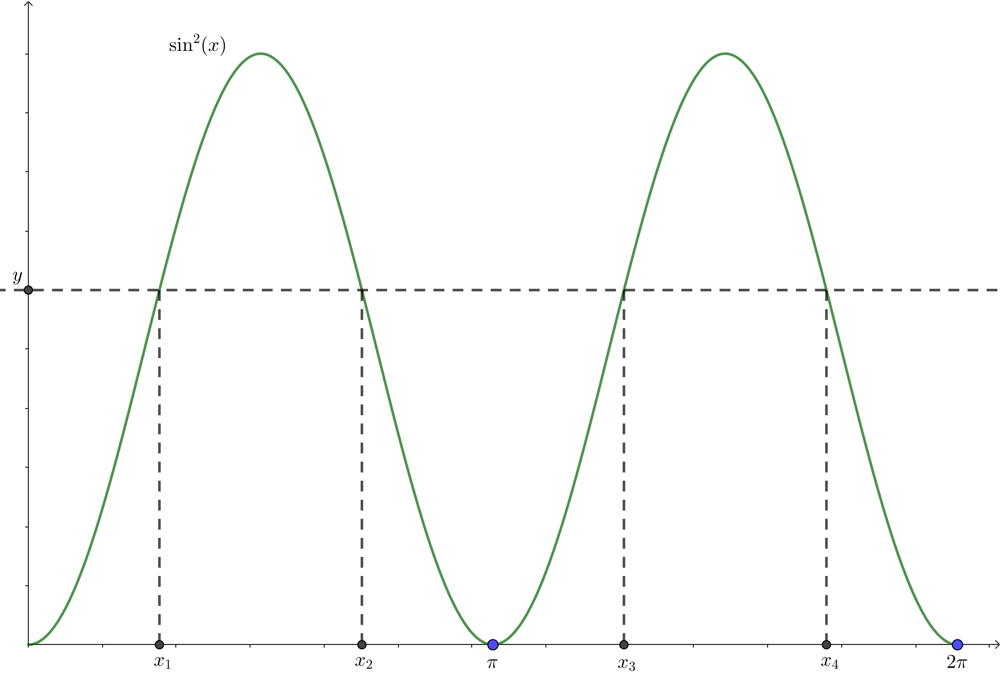
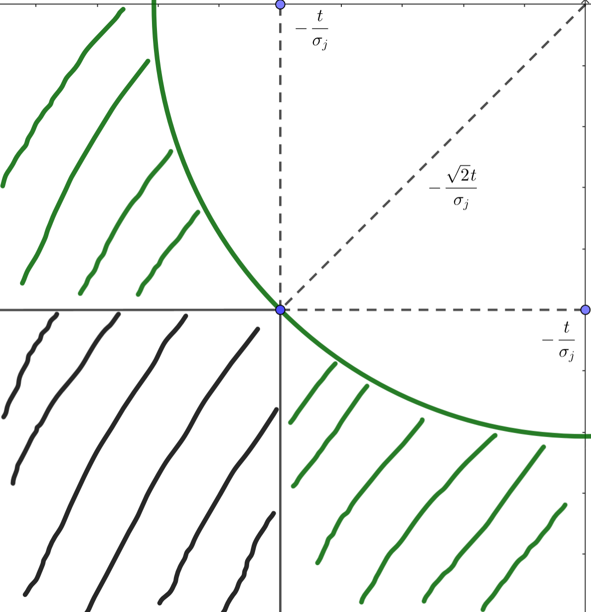

# 2 Transformations and Expectations

## 2.0 Measurability

> [!DEFINITION]
> A **measurable space** $(\mathcal{X},\ \mathcal{A})$ is a non-empty set $\mathcal{X}$ equipped with a sigma algebra $\mathcal{A}$ on $\mathcal{X}$.

> [!DEFINITION]
> Let $(\mathcal{X},\ \mathcal{A})$ and $(\mathcal{Y},\ \mathcal{B})$ be measurable spaces. A function $f : \mathcal{X} \to \mathcal{Y}$ is **measurable** if $f ^{-1}(B) \in \mathcal{A},\ \forall B \in \mathcal{B}$.

> [!NOTE]
> We only care about real-valued functions here, so $\mathcal{Y} = \mathbb{R}$ and $\mathcal{B}$ is the Borel sigma algebra (see [previous example](/courses/advanced_statistics/1_probability_theory.md#example)). Thus, when we say a function is measurable, we would only specify the sigma algebra of $\mathcal{X}$, i.e., we would say a function is $\mathcal{A}$-measurable.

> [!DEFINITION]
> A function $f : \mathbb{R}^{n} \to \mathbb{R}$ is **Borel measurable** if $f ^{-1}(B) \in \mathcal{B}(\mathbb{R}^{n}),\ \forall B \in \mathcal{B}(\mathbb{R})$.

## 2.1 Distributions of Functions of a Random Variable

> [!THEOREM]
> Let $X$ be a random variable (r.v.) with cdf $F_{X}(x)$. Denote $g : \mathbb{R} \to \mathbb{R}$ be a *Borel measurable* function. Then $g(X)$ is also a r.v..

Let $Y = g(X)$. The function $g(X)$ defines a mapping from the original sample space $\mathcal{X}$ (the sample space of $X$), to a new sample space $\mathcal{Y}$ (the sample space of $Y$), i.e., $g(X): \mathcal{X} \to \mathcal{Y}$. Then, 

$$
P(Y \in \mathcal{A}) = P(g(X) \in \mathcal{A}) = P(X \in g ^{-1}(\mathcal{A})),
$$

where $g^{-1}(\mathcal{A}) = \left\{x \in \mathbb{R}: g(x) \in \mathcal{A} \right\}$.

In particular, 

$$
F_{Y}(y) = P(Y \leqslant y) = P(X \in g ^{-1}(-\infty,\ y]).
$$

> [!NOTE]
> Here the inverse map $g ^{-1}(\cdot)$ is defined on sets, i.e., the outcome is a set instead of a number. Thus, we would not meet the existence problem.

> [!EXAMPLE]
> Suppose $X$ has a uniform distribution on the interval $(0,\ 2 \pi)$, i.e. 
> 
> $$f_{X}(x) = \begin{cases}\frac{1}{2 \pi},\ &0 < x < 2 \pi, \\ 0,\ &\text{otherwise}.\end{cases}$$
> 
> Consider $Y = \sin^{2}(X)$, then the cdf of $Y$ would be
> 
> $$P(Y \leqslant y) = P(X \leqslant x_1) + P(x_2\leqslant X \leqslant x_3) + P(X \geqslant x_4),$$
> 
> where $x_1,\ x_2,\ x_3$ and $x_4$ are shown below: 
> 
> 

> 
> 
> 

> 
> From the symmetry of the function $\sin^{2}(x)$ and the fact that $X$ has a uniform distribution, we have 
> 
> $$P(X \leqslant x_1) = P(X \geqslant x_4),\quad P(x_2 \leqslant X \leqslant x_3) = 2 P(x_2 \leqslant X \leqslant \pi),$$
> 
> so 
> 
> $$P(Y \leqslant y) = 2 P(X \leqslant x_1) + 2 P(x_2 \leqslant X \leqslant \pi),$$
> 
> where $x_1$ and $x_2$ are 2 solutions to 
> 
> $$\sin^{2}(x) = y,\quad 0 < x < \pi.$$

> [!DEFINITION]
> Let $X$ has pdf $f_{X}(x)$, a set $\mathcal{X}:= \left\{x: f_{X}(x) > 0 \right\}$ is called the **support set** of the distribution. This terminology can also apply to a pmf or, in general, to any nonnegative function.

> [!THEOREM]
> Let $X$ has cdf $F_{X}(x)$, let $Y = g(X)$, and let $\mathcal{X}$ and $\mathcal{Y}$ be their support sets.
> 
> - If $g$ is an *increasing* function on $\mathcal{X}$, $F_{Y}(y) = F_{X}(g ^{-1}(y)),\ \forall y \in \mathcal{Y}$;
> - If $g$ is a *decreasing* function on $\mathcal{X}$ and $X$ is a continuous random variable, $F_{Y}(y) = 1 - F_{X}(g ^{-1}(y)),\ \forall y \in \mathcal{Y}$.

Proof: 

If $g$ is an increasing function, so is $g^{-1}$, and this implies 

$$
\begin{aligned}
    \left\{x \in \mathcal{X}: g(x)\leqslant y \right\} &= \left\{x \in \mathcal{X}: g ^{-1}(g(x)) \leqslant g ^{-1}(y) \right\} \\
    &= \left\{x \in \mathcal{X}: x \leqslant g ^{-1}(y) \right\}.
\end{aligned}
$$

Thus, we have 

$$
F_{Y}(y) = \int_{x \leqslant g ^{-1}(y)} f_{X}(x) ~\mathrm{d}x = \int_{-\infty}^{g ^{-1}(y)} f_{X}(x) ~\mathrm{d}x = F_{X}(g ^{-1}(y)).
$$

Similarly, decreasing $g$ implies 

$$
\begin{aligned}
    \left\{x \in \mathcal{X}: g(x)\leqslant y \right\} &= \left\{x \in \mathcal{X}: g ^{-1}(g(x)) \geqslant g ^{-1}(y) \right\} \\
    &= \left\{x \in \mathcal{X}: x \geqslant g ^{-1}(y) \right\},
\end{aligned}
$$

which means 

$$
F_{Y}(y) = \int_{\left\{x \in \mathcal{X}: x \geqslant g ^{-1}(y) \right\}} f_{X}(x) ~\mathrm{d}x = \int_{g ^{-1}(y)}^{\infty} f_{X}(x) ~\mathrm{d}x = 1 - F_{X}(g ^{-1}(y)).
$$

The continuity of $X$ is used to obtain the last equality, because we need to switch the limits of integration here.

 

> [!THEOREM]
> Let $X$ have pdf $f_{X}(x)$ and let $Y = g(X)$, where $g$ is a *monotone* function. Let $\mathcal{X}$ and $\mathcal{Y}$ be their support sets. Suppose that $f_{X}(x)$ is *continuous* on $\mathcal{X}$ and that $g ^{-1}(y)$ has a *continuous derivative* on $\mathcal{Y}$. Then the pdf of $Y$ is given by 
> 
> $$f_{Y}(y) = \begin{cases} f_{X}(g ^{-1}(y)) \left\vert \frac{\mathrm{d}}{\mathrm{d}y}g ^{-1}(y) \right\vert,\ &y\in \mathcal{Y}, \\ 0,\ &\text{otherwise}. \end{cases}$$

The theorem above can be proved by using the chain rule on the conclusions of previous theorem.

> [!EXAMPLE]
> Let $f_{X}(x)$ be the *Gamma pdf*: 
> 
> $$f(x) = \frac{1}{(n-1)! \beta^{n}} x^{n-1} e^{-x / \beta},\quad 0 < x < \infty, $$
> 
> where $\beta$ is a positive constant and $n$ is a positive integer.
> 
> Suppose we want to find the pdf of $Y = g(X) = \frac{1}{X}$. Note that here the support sets $\mathcal{X}$ and $\mathcal{Y}$ are both $(0,\ \infty)$. If we let $y = g(x)$, then $g ^{-1}(y) = \frac{1}{y}$ and $\frac{\mathrm{d}}{\mathrm{d}y}g ^{-1}(y) = - \frac{1}{y^{2}}$. Applying the theorem above, we have 
> 
> $$\begin{aligned} f_{Y}(y) &= \frac{1}{(n-1)! \beta^{n}} \left(\frac{1}{y} \right)^{n-1} e^{- 1 / (\beta y)} \frac{1}{y^{2}} \\ &= \frac{1}{(n-1)! \beta^{n}} \left(\frac{1}{y} \right)^{n+1} e^{- 1 / (\beta y)},\quad 0 < y < \infty, \end{aligned}$$
> 
> which is a special case of a pdf known as the *inverted Gamma pdf*.

> [!THEOREM]
> Let $X$ have pdf $f_{X}(x)$, let $Y = g(X)$, let $\mathcal{X}$ and $\mathcal{Y}$ be their support sets. Suppose $\exists$ a partition, $\mathcal{A}_0,\ \mathcal{A}_1,\ \cdots \mathcal{A}_k$, of $\mathcal{X}$ s.t. $P(X \in \mathcal{A}_0) = 0$ and $f_{X}(x)$ is *continuous* on each $\mathcal{A}_i,\ i=1,\ 2,\ \cdots,\ k$. Further, suppose $g(\cdot)$ is *monotone* if restricted to each $\mathcal{A}_i$, we define 
> 
> $$g_i ^{-1}(y) = \left\{x \in \mathcal{A}_{i}: g(x) = y \right\}$$
> 
> and assume $g_i ^{-1}(y)$ has a *continuous derivative* on $\mathcal{Y}$ for each $i=1,\ 2,\ \cdots,\ k$. Then, 
> 
> $$f_{Y}(y) = \begin{cases} \sum\limits_{i=1}^{k} f_{X}(g_i ^{-1}(y)) \left\vert \frac{\mathrm{d}}{\mathrm{d}y}g_i ^{-1}(y) \right\vert,\ &y\in \mathcal{Y}, \\ 0,\ &\text{otherwise}. \end{cases}$$

This theorem deals with cases that $g(\cdot)$ is not continuous or monotone on the whole support set. We only require *piece-wise* continuity and monotonicity for the nice conclusion.

> [!EXAMPLE]
> Let $X$ have the *standard normal distribution*, 
> 
> $$f_{X}(x) = \frac{1}{\sqrt{2 \pi}} e^{- x^{2} / 2},\quad -\infty < x < \infty. $$
> 
> Consider $Y = X^{2}$. The function $g(x) = x^{2}$ is monotone on $(-\infty,\ 0)$ and $(0,\ \infty)$. The support set $\mathcal{Y} = (0,\ \infty)$. Applying the theorem above, we take $\mathcal{A}_0 = \left\{0 \right\} $, $\mathcal{A}_1 = (-\infty,\ 0)$ and $\mathcal{A}_2 = (0,\ \infty)$. The corresponding inverse transformations are $g_1 ^{-1}(y) = -\sqrt{y}$ and $g_2 ^{-1}(y) = \sqrt{y}$. Thus, the pdf of $Y$ is 
> 
> $$\begin{aligned} f_{Y}(y) &= \frac{1}{\sqrt{2 \pi}} e^{-(-\sqrt{y})^{2} / 2}\left\vert - \frac{1}{2\sqrt{y}} \right\vert + \frac{1}{\sqrt{2 \pi}} e^{-(\sqrt{y})^{2} / 2} \left\vert \frac{1}{2\sqrt{y}} \right\vert \\ &= \frac{1}{\sqrt{2 \pi y}} e^{-y / 2},\quad 0 < y < \infty, \\ \end{aligned}$$
> 
> which is the pdf of a *chi squared* random variable with 1 degree of freedom.

> [!THEOREM]
> Let $X$ have continuous cdf $F_{X}(x)$ and define the random variable $Y$ as $Y = F_{X}(x)$. Then $Y$ is uniformly distributed on $(0,\ 1)$, i.e., $P(Y \leqslant y) = y,\ 0 < y < 1$.

Proof: 

During the proof, we would use $F_{X}^{-1}(\cdot)$, which is not well defined since $F_{X}$ can be not strictly increasing. So we define the inverse cdf as follow: 

$$
F_{X}^{-1}(y) = \inf \left\{x: F_{X}(x) \geqslant y \right\}.
$$

Now for $0 < y < 1$ we have 

$$
\begin{aligned}
    P(Y \leqslant y) &= P(F_{X}(x) \leqslant y) \\
    &= P(F_{X}^{-1}(F_{X}(x)) \leqslant F_{X}^{-1}(y)) \\
    &= P(X \leqslant F_{X}^{-1}(y)) \\
    &= F_{X}(F_{X}^{-1}(y)) \\
    &= y.
\end{aligned}
$$

 

> [!TIP]
> From the theorem above, if $F(\cdot)$ is a distribution function, then $F ^{-1}(U)$, where $U$ is uniformly distributed on $(0,\ 1)$, is a r.v. with $F(\cdot)$ as its cdf. Then we can generate a random variable using this method, called *the inversion method*, which will be further discussed in Chapter 5.

### Exercises

1. Assume $\frac{1}{\sqrt{n}} w_{j} \to N(0,\ \sigma_{j}^{2})$, prove that 

    $$
    P\left(\left\vert \frac{1}{\sqrt{n}} w_{j} \right\vert > t \right) \leqslant e^{- \frac{t^{2}}{2 \sigma_{j}^{2}}}.
    $$

    > [!TIP]
    > Note that $\frac{1}{\sqrt{n} \sigma_{j}} w_j \to N(0,\ 1)$, and according to the symmetry of standard normal, we have $P\left(\left\vert \frac{1}{\sqrt{n}} w_{j} \right\vert > t \right) = 2 \phi(- \frac{t}{\sigma_j})$, where $\phi(\cdot)$ is the cdf of standard normal. To calculate $\phi(- \frac{t}{\sigma_j})$, we can find 
    > 
    > $$\phi^{2}\left(-\frac{t}{\sigma_j} \right) = \frac{1}{2\pi} \int_{-\infty}^{-\frac{t}{\sigma_j}} \int_{-\infty}^{-\frac{t}{\sigma_j}} e^{-\frac{x^{2} + y^{2}}{2}} ~\mathrm{d}x  ~\mathrm{d}y$$
    > 
    > and calculate it by polar coordinate transformation.

    

    
Proof: 

    Since $\frac{1}{\sqrt{n} \sigma_{j}} w_j \to N(0,\ 1)$, we can transform the left side of the inequality to be 

    $$\begin{aligned}
        P\left(\left\vert \frac{1}{\sqrt{n}\sigma_j} w_j \right\vert > \frac{t}{\sigma_j} \right) &= P\left(\frac{1}{\sqrt{n}\sigma_j} w_j > \frac{t}{\sigma_j} \right) + P\left(\frac{1}{\sqrt{n}\sigma_j} w_j < -\frac{t}{\sigma_j} \right) \\
        &= 2 \phi\left(-\frac{t}{\sigma_j} \right),
    \end{aligned}$$

    where $\phi(\cdot)$ is the cdf of standard normal.

    Then, we find that 

    $$
    \begin{aligned}
        \phi^{2}\left(-\frac{t}{\sigma_j} \right) &= \frac{1}{2\pi} \int_{-\infty}^{-\frac{t}{\sigma_j}} \int_{-\infty}^{-\frac{t}{\sigma_j}} e^{-\frac{x^{2} + y^{2}}{2}} ~\mathrm{d}x  ~\mathrm{d}y \\
        &= \frac{1}{2\pi} \int_{-\infty}^{-\frac{t}{\sigma_j}} \int_{-\infty}^{-\frac{t}{\sigma_j}} e^{-\frac{r^{2}}{2}} ~\mathrm{d}(r \cos\theta)  ~\mathrm{d}(r \sin\theta) \\
        &\leqslant \frac{1}{2\pi} \int_{\pi}^{\frac{3\pi}{2}} \int_{\sqrt{2}\frac{t}{\sigma_j}}^{\infty} r e^{-\frac{r^{2}}{2}} ~\mathrm{d}r  ~\mathrm{d}\theta \\
        &= \frac{1}{2\pi} \int_{\pi}^{\frac{3\pi}{2}} e^{-\frac{t^{2}}{\sigma_j^{2}}} ~\mathrm{d}\theta \\
        &= \frac{1}{4} e^{-\frac{t^{2}}{\sigma_j^{2}}},
    \end{aligned}
    $$

    which means $\phi(-\frac{t}{\sigma_j}) \leqslant \frac{1}{2} e^{-\frac{t^{2}}{2\sigma_j^{2}}}$ and thus $P\left(\left\vert \frac{1}{\sqrt{n}} w_{j} \right\vert > t \right) \leqslant e^{- \frac{t^{2}}{2 \sigma_{j}^{2}}}$.

    > [!TIP]
    > If you have forgotten the formula of polar coordinate tranformation of double integral, you can directly calculate 
    > 
    > $$\begin{aligned} \mathrm{d}(r \cos\theta) \otimes \mathrm{d}(r \sin\theta) &= [\cos\theta ~ \mathrm{d}r + r (-\sin\theta) ~ \mathrm{d}\theta] \otimes \\ &\qquad(\sin\theta ~ \mathrm{d}r + r \cos\theta ~ \mathrm{d}\theta) \\ &= \begin{vmatrix} \cos \theta ~ \mathrm{d}r & -r \sin \theta ~ \mathrm{d}\theta \\	\sin \theta ~ \mathrm{d}r & r \cos \theta ~ \mathrm{d}\theta \\\end{vmatrix} \\ &= r ~ \mathrm{d}r ~ \mathrm{d}\theta \end{aligned}$$
    > 
    > where $\otimes $ denotes outer product.
    > 
    > And the inequality above occurs because we expand the integral area: 
    > 
    > 

    > 
    > 
    > 

    

## 2.2 Expected Values

> [!DEFINITION]
> The **expected value**, **expectation** or **mean** of a random variable $g(X)$, denoted by $\E[g(X)]$, is 
> 
> $$\E[g(X)] = \begin{cases} \int_{-\infty}^{\infty} g(x) f_{X}(x) ~\mathrm{d}x,\ &X \text{ is continuous}, \\ \sum\limits_{x \in \mathcal{X}} g(x) P(X = x),\ &X \text{ is discrete}, \\ \end{cases}$$
> 
> provided that the integral or sum exists. If $\E[\left\vert g(X) \right\vert ] = \infty$, we say that $\E[g(X)]$ does not exist.

Since expectation is just an integral or a sum, the properties of it is similar to an integral or a sum. But there is one property that explains why $\E[X]$ is a good guess at a value of a r.v. $X$.

Suppose we measure the distance between $X$ and a constant $b$ by $(X - b)^{2}$. We can now determine the value of $b$ that minimizes $\E[(X - b)^{2}]$: 

$$
\begin{aligned}
    \E[(X - b)^{2}] &= \E[(X - \E[X] + \E[X] - b)^{2}] \\
    &= \E[(X - E[X])^{2} + 2 \E[(X - \E[X])(\E[X] - b)] + (\E[X] - b)^{2}] \\
    &= \E[(X - \E[X])^{2}] + (\E[X] - b)^{2},
\end{aligned}
$$

which means when $b = \E[X]$, $\E[(X - b)^{2}]$ would reach the minimum, and thus $\E[X]$ is a good guess at a value of $X$.

## 2.3 Moments and Moment Generating Functions

> [!DEFINITION]
> Let $X$ be a r.v., define 
> 
> - the $n$-th **moment (around the origin)**: $\mu_n' = \E[X^{n}]$;
> - the $n$-th **central moment**: $\mu_n = \E[(X - \mu)^{n}]$ with $\mu = \mu_1' = \E[X]$;
> - **variance**: $\Var(X) = \mu_2 = \E[(X - \mu)^{2}]$.

> [!EXAMPLE]
> The mean and variance of some common distributions: 
> 
> - If $X \sim \exp(\lambda)$ with $f_{X}(x) = \frac{1}{\lambda} e^{-\frac{x}{\lambda}}$, then $\E[X] = \lambda$ and $\Var(X) = \lambda^{2}$;
> - if $X \sim \text{Binomial}(n,\ p)$, then $\E[X] = np$ and $\Var(X) = np(1-p)$;
> - if $X \sim \text{Cauchy}(0,\ 1)$ with $f_{X}(x) = \frac{1}{\pi} \frac{1}{1 + x^{2}},\ -\infty < x < \infty$, then both $\E[X]$ and $\Var(X)$ do not exist;
> - if $X \sim \text{Poisson}(\lambda)$ with $P(X = k) = \frac{\lambda^{k}}{k!} e^{-\lambda},\ k=0,\ 1,\ \cdots,\ \infty$, then $\E[X] = \Var(X) = \lambda$.

> [!DEFINITION]
> Let $X$ be a r.v. with cdf $F_{X}$. The **moment generating function (mgf)** of $X$, denoted by $M_{X}(t)$, is 
> 
> $$M_{X}(t) = \E[e^{tX}],$$
> 
> provided that the expectation exists for $t$ in some neighborhood of $0$.

> [!THEOREM]
> If a r.v. $X$ has mgf $M_{X}(t)$, then the $n$-th moment
> 
> $$\E[X^{n}] = M_{X}^{(n)}(0) = \frac{\mathrm{d}^{n}}{\mathrm{d}t^{n}}M_{X}(t) \bigg\vert_{t=0}.$$

> [!EXAMPLE]
> Consider a r.v. $X \sim \text{Binomial}(n,\ p)$, we have 
> 
> $$P(X = x) = C_n^{x} p^{x} (1 - p)^{n-x},\quad x=0,\ 2,\ \cdots,\ n. $$
> 
> Then, the mgf can be written as 
> 
> $$\begin{aligned} M_{X}(t) &= \sum\limits_{x=0}^{n} e^{tx} C_n^{x} p^{x} (1-p)^{n-x} \\ &= \sum\limits_{x=0}^{n} C_n^{x} (p e^{t})^{x} (1-p)^{n-x} \\ &= [p e^{t} + (1 - p)]^{n}, \end{aligned}$$
> 
> where the last equality holds by the binomial formula.

The major usefulness of the mgf is not in its ability to generate moments. Rather, its usefulness stems from the fact that, in many cases, the mgf function can *characterize a distribution*. *However*, there are still some cases that different distributions have the same moments. 

> [!EXAMPLE]
> Consider 2 pdfs given by 
> 
> $$f_1(x) = \frac{1}{\sqrt{2 \pi} x}e^{-(\log x)^{2} / 2},\quad 0\leqslant x \leqslant \infty,$$
> 
> $$f_2(x) = f_1(x)[1 + \sin(2 \pi \log x)],\quad 0 \leqslant x < \infty. $$
> 
> It can be shown that if $X_1 \sim f_1(x)$, then 
> 
> $$\E[X_1^{r}] = e^{r^{2} / 2},\quad r = 0,\ 1,\ \cdots. $$
> 
> Suppose $X_2 \sim f_2(x)$, then we have 
> 
> $$\begin{aligned} \E[X_2^{r}] &= \int_{0}^{\infty} x^{r}f_1(x)[1 + \sin(2\pi \log x)] ~\mathrm{d}x \\ &= \E[X_1^{r}] + \int_{0}^{\infty} x^{r}f_1(x)\sin(2\pi \log x) ~\mathrm{d}x.  \end{aligned}$$
> 
> Let $y = \log x$, the second term of the RHS becomes 
> 
> $$\begin{aligned} \text{Second term of RHS} &= \int_{-\infty}^{\infty} e^{ry} \frac{1}{\sqrt{2\pi}e^{y}} e^{-\frac{y^{2}}{2}} \sin(2\pi y) e^{y} ~\mathrm{d}y \\ &= \frac{1}{\sqrt{2\pi}} e^{\frac{r^{2}}{2}} \int_{-\infty}^{\infty} e^{- \frac{(y - r)^{2}}{2}} \sin(2\pi y) ~\mathrm{d}y \\ &= \frac{1}{\sqrt{2\pi}} e^{\frac{r^{2}}{2}} \int_{-\infty}^{\infty} e^{- \frac{(y - r)^{2}}{2}} \sin[2\pi (y - r)] ~\mathrm{d}(y - r) \\ &= 0, \end{aligned}$$
> 
> which means $\E[X_2^{r}] = \E[X_1^{r}],\ r = 1,\ 2,\ \cdots$.

Under some conditions, we can guarantee that an mgf can give a unique distribution.

> [!THEOREM]
> Let $F_{X}(x)$ and $F_{Y}(y)$ be 2 cdfs all of whose moments exist.
> 
> - If $X$ and $Y$ have *bounded support*, then $F_{X}(u) = F_{Y}(u),\ \forall u$ *iff* $\E[X^{r}] = \E[Y^{r}],\ \forall r = 0,\ 1,\ \cdots$.
> - If the mgf exist and $M_{X}(t) = M_{Y}(t),\ \forall t$ in some neighborhood of $0$, then $F_{X}(u) = F_{Y}(u),\ \forall u$.

Now we want to give the convergence of mgf, which we want to use to prove the CLT (Central Limit Theorem).

> [!THEOREM]
> Suppose $\left\{X_{i},\ i = 1,\ 2,\ \cdots \right\} $ is a sequence of random variables, each with mgf $M_{X_{i}}(t)$. Futhermore, suppose the sequence of mgfs is *convergent for $t$ in a neighborhood of $0$*, i.e., $\exists \delta > 0$ s.t. 
> 
> $$\lim\limits_{i \to \infty} M_{X_{i}}(t) = M_{X}(t),\quad \forall t \in (-\delta,\ \delta),$$
> 
> where $M_{X}(t)$ is an mgf. Then there is a *unique* cdf $F_{X}$ whose moments are determined by $M_{X}(t)$ and, $\forall x$ where $F_{X}(x)$ is continuous, we have 
> 
> $$\lim\limits_{i \to \infty} F_{X_{i}}(x) = F_{X}(x),$$
> 
> i.e., *convergence of mgfs in a neighborhood of 0 implies convergence of cdfs*.

> [!EXAMPLE]
> Binomial distribution with large $n$ but small $np$ can be approximated by $\text{Poisson}(\lambda)$ with $\lambda = np$.
> 
> Suppose $X_n \sim \text{Binomial}(n,\ p)$ and $Y \sim \text{Poisson}(\lambda)$ where $\lambda = np$. Recall that in [previous example](#example) we get $M_{X_n(t)} = [p e^{t} + (1 - p)]^{n}$. For the Poisson one, we know that 
> 
> $$P(Y = y) = e^{-\lambda}\frac{\lambda^{y}}{y!},\quad y = 0,\ 1,\ \cdots,$$
> 
> which means 
> 
> $$\begin{aligned} M_{Y}(t) = \E[e^{tY}] &= \sum\limits_{y=0}^{\infty} e^{ty} e^{-\lambda}\frac{\lambda^{y}}{y!} \\ &= e^{\lambda e^{t} - \lambda} \sum\limits_{y=0}^{\infty} e^{-\lambda e^{t}}\frac{(\lambda e^{t})^{y}}{y!} \\ &= e^{\lambda (e^{t} - 1)}. \end{aligned}$$
> 
> Note that 
> 
> $$\begin{aligned} \lim\limits_{n \to \infty} M_{X_n}(t) &= \lim\limits_{n \to \infty} [p e^{t} + (1 - p)]^{n} \\ &= \lim\limits_{n \to \infty} \left[\frac{1}{n} \cdot np (e^{t} - 1) + 1 \right] ^{n} \\ &= e^{np(e^{t} - 1)} \\ &= e^{\lambda(e^{t} - 1)}. \end{aligned}$$

> [!THEOREM]
> For any constants $a$ and $b$, the mgf of the r.v. $a X + b$ is given by 
> 
> $$M_{a X + b}(t) = e^{bt} M_{X}(at). $$

Now we start to prove the CLT.

> [!THEOREM]
> Let $X_1,\ X_2,\ \cdots$ be a sequence of i.i.d. random variables whose mgf exists in a neighborhood of $0$, say, $M_{X}(t)$ exists for $\left\vert t \right\vert < \delta$. Let 
> - $\E[X_1] = \mu$,
> - $\Var(X_1) = \sigma^{2} > 0$,
> - $\overline{X}_{n} = \frac{1}{n}\sum\limits_{i=1}^{n} X_{i}$,
> - and $G_n(x)$ denote the cdf of $\frac{\sqrt{n}(\overline{X}_{n} - \mu)}{\sigma}$.
> 
> Then, $\forall x$, we have 
> 
> $$\lim\limits_{n \to \infty} G_n(x) = \int_{-\infty}^{x} \frac{1}{\sqrt{2\pi}} e^{-\frac{y^{2}}{2}} ~\mathrm{d}y,$$
> 
> i.e., *$\frac{\sqrt{n}(\overline{X}_{n} - \mu)}{\sigma}$ has a limiting standard normal distribution*.

Proof: 

We want to prove the convergence of $G_n(x)$ by proving the convergence of the corresponding mgfs in a neighborhood of $0$. So first we calculate the mgf of a standard normal r.v. $Z$: 

$$
\begin{aligned}
    M_{Z}(t) = \E[e^{t Z}] &= \int_{-\infty}^{\infty} e^{tz} \frac{1}{\sqrt{2\pi}} e^{-\frac{z^{2}}{2}} ~\mathrm{d}z \\
    &= \int_{-\infty}^{\infty} \frac{1}{\sqrt{2\pi}} e^{-\frac{z^{2} - 2tz + t^{2}}{2}} e^{\frac{t^{2}}{2}} ~\mathrm{d}z \\
    &= e^{\frac{t^{2}}{2}} \int_{-\infty}^{\infty} \frac{1}{\sqrt{2\pi}} e^{-\frac{(z - t)^{2}}{2}} ~\mathrm{d}z \\
    &= e^{\frac{t^{2}}{2}}.
\end{aligned}
$$

Define $Y_i := \frac{X_{i} - \mu}{\sigma}$ (also i.i.d.), and let $M_{Y}(t)$ denote the common mgf of $Y_i$, which exists when $\left\vert t \right\vert < \sigma \delta$ since $M_{Y}(t) = e^{-\frac{\mu}{\sigma}t} M_{X}(\frac{t}{\sigma})$. Then, we find 

$$
\frac{\sqrt{n}(\overline{X}_{n} - \mu)}{\sigma} = \frac{\sqrt{n}(\frac{1}{n}\sum_{i=1}^{n} X_{i} - \mu)}{\sigma} = \frac{1}{\sqrt{n}} \sum\limits_{i=1}^{n} Y_i,
$$

whose mgf can be written as 

$$
\begin{aligned}
    M_{\frac{1}{\sqrt{n}} \sum_{i=1}^{n} Y_i}(t) &= M_{\sum_{i=1}^{n} Y_i}\left(\frac{t}{\sqrt{n}} \right)  \\
    &= \E\left[e^{(t / \sqrt{n}) \sum_{i=1}^{n} Y_i} \right]  \\
    &= \prod_{i=1}^{n} \E\left[e^{(t / \sqrt{n}) Y_i} \right]  \\
    &= \left(M_{Y}\left(\frac{t}{\sqrt{n}} \right) \right)^{n}.
\end{aligned}
$$

Now we can expand $M_{Y}(\frac{t}{\sqrt{n}})$ in a Taylor series around $0$: 

$$
M_{Y}\left(\frac{t}{\sqrt{n}}\right) = \sum\limits_{k=0}^{\infty} M_{Y}^{(k)}(0) \frac{(t / \sqrt{n})^{k}}{k!}.
$$

Since $M_{Y}(t)$ exists for $\left\vert t \right\vert < \sigma\delta$, the Taylor expansion above is valid if $t < \sqrt{n} \sigma \delta$.

By the definition of mgf, we have $M_{Y}^{0}(0) = \E[e^{0}] = 1$. And note that by construction we have $\E[Y_i] = 0$ and $\Var(Y_i) = 1$, which means $M_{Y}^{(1)}(0) = 0$ and $M_{Y}^{(2)}(0) = 1$. Thus, we have 

$$
M_{Y}\left(\frac{t}{\sqrt{n}} \right) = 1 + \frac{(t / \sqrt{n})^{2}}{2!} + \omicron\left(\frac{1}{n} \right).
$$

Then, we can write

$$
\begin{aligned}
    \lim\limits_{n \to \infty} \left(M_{Y}\left(\frac{t}{\sqrt{n}} \right) \right)^{n} &= \lim\limits_{n \to \infty} \left[1 + \frac{(t / \sqrt{n})^{2}}{2!} + \omicron\left(\frac{1}{n} \right) \right]^{n} \\
    &= \lim\limits_{n \to \infty} \left[1 + \frac{1}{n} \left(\frac{t^{2}}{2} + \omicron(1) \right) \right]^{n} \\
    &= e^{\frac{t^{2}}{2}} \\
    &= M_{Z}(t),
\end{aligned}
$$

which means $G_n(x)$ converges to the cdf of standard normal distribution.

### Exercises

1. Let $X$ be a r.v. with finite mgf $M_{X}(t),\ -h < t < h$. Prove the following limitation: 

    $$
    \lim\limits_{n \to \infty} \left[M_{X}\left(\frac{t}{n} \right) \right]^{n} = e^{t \E[X]}.
    $$

    > [!TIP]
    > How can we get $\E[X]$ from $M_{X}(\frac{t}{n})$? Differentiate, i.e., $M_{X}'(0) = \E[X]$. When do derivatives appear? Taylor expansion.

    

    
Proof: 

    By Taylor expansion we have 

    $$
    \begin{aligned}
        M_{X} \left(\frac{t}{n} \right) &= \sum\limits_{k=0}^{\infty} M_{X}^{(k)}(0) \frac{(t / n)^{k}}{k!} \\
        &= 1 + M_{X}^{(1)}(0) \frac{t}{n} + \omicron\left(\frac{1}{n} \right) \\
        &= 1 + \frac{t \E[X]}{n} + \omicron\left(\frac{1}{n} \right),
    \end{aligned}
    $$

    which means 

    $$
    \begin{aligned}
        \lim\limits_{n \to \infty} \left[M_{X}\left(\frac{t}{n} \right) \right]^{n} &= \lim\limits_{n \to \infty} \left[1 + \frac{t \E[X]}{n} + \omicron\left(\frac{1}{n} \right) \right]^{n} \\
        &= \lim\limits_{n \to \infty} \left[1 + \frac{1}{n} \left(t \E[X] + \omicron(1) \right) \right]^{n} \\
        &= e^{t \E[X]}.
    \end{aligned}
    $$
    

## 2.3' Characteristic Functions

## 2.4 Differentiating Under an Integral Sign

## Assignments

### Textbook Exercises

*2.2* (p.76) In each of the following find the pdf of $Y$.

(a) $Y = X^{2}$ and $f_{X}(x) = 1,\ 0 < x < 1$

Solution: 

(b) $Y = -\log X$ and X has pdf

$$
f_{X}(x) = \frac{(n + m + 1)!}{n! m!} x^{n}(1 - x)^{m},\quad 0 < x < 1,\quad m,\ n \text{ positive integers}
$$

(c) $Y = e^{X}$ and X has pdf 

$$
f_{X}(x) = \frac{1}{\sigma^{2}} x e^{-(x / \sigma)^{2} / 2},\quad 0 < x < \infty,\quad \sigma^{2} \text{ a positive constant}
$$

*2.14* (p.78)

(a) Let $X$ be a continuous, nonnegative random variable $[f(x) = 0 \text{ for } x < 0]$. Show that 

$$
\E X = \int_{0}^{\infty} [1 - F_{X}(x)] ~\mathrm{d}x,
$$

where $F_{X}(x)$ is the cdf of $X$.

(b) Let $X$ be a discrete random variable whose range is the nonnegative integers. Show that 

$$
\E X = \sum\limits_{k=0}^{\infty} (1 - F_{X}(k)),
$$

where $F_{X}(k) = P(X \leqslant k)$. Compare this with part (a).

*2.15* (p.78) Betteley (1977) provides an interesting addition law for expectations. Let $X$ and $Y$ be any two random variables and define 

$$
X \wedge Y = \min(X,\ Y) \quad \text{and} \quad X \vee Y = \max(X,\ Y).
$$

Analogous to the probability law $P(A \cup B) = P(A) + P(B) - P(A \cap B)$, show that 

$$
\E(X \vee Y) = \E X + \E Y - \E(X \wedge Y).
$$

(*Hint*: Establish that $X + Y = (X \vee Y) + (X \wedge Y)$.)

*2.32* (p.80) Let $M_{X}(t)$ be the moment generating function of $X$, and define $S(t) = \log(M_{X}(t))$. Show that 

$$
\frac{\mathrm{d}}{\mathrm{d}t}S(t) \bigg\vert_{t=0} = \E X \quad \text{and} \quad \frac{\mathrm{d}^{2}}{\mathrm{d}t^{2}}S(t)\bigg\vert_{t=0} = \Var X.
$$

*2.33* (p.80-81) In each of the following cases verify the expression given for the moment generating function, and in each case use the mgf to calculate $\E X$ and $\Var X$.

(a) $P(X = x) = \frac{e^{-\lambda} \lambda^{x}}{x!},\ M_{X}(t) = e^{\lambda (e^{t} - 1)},\ x = 0,\ 1,\ \cdots;\ \lambda > 0$

(b) $P(X = x) = p (1 - p)^{x},\ M_{X}(t) = \frac{p}{1 - (1 - p) e^{t}},\ x = 0,\ 1,\ \cdots;\ 0 < p < 1$

(c) $f_{X}(x) = \frac{e^{-(x - \mu)^{2} / (2 \sigma^{2})}}{\sqrt{2 \pi} \sigma},\ M_{X}(t) = e^{\mu t + \sigma^{2} t^{2} / 2},\ -\infty < x < \infty;\ -\infty < \mu < \infty,\ \sigma > 0$

*2.38* (p.82) Let $X$ have the negative binomial distribution with pmf 

$$
f(x) = \tbinom{r + x - 1}{x} p^{r} (1 - p)^{x},\quad x = 0,\ 1,\ 2,\ \cdots,
$$

where $0 < p < 1$ and $r > 0$ is an integer.

(a) Calculate the mgf of $X$.

(b) Define a new random variable by $Y = 2pX$. Show that, as $p \downarrow 0$, the mgf of $Y$ converges to that of a chi squared random variable with $2r$ degrees of freedom by showing that 

$$
\lim\limits_{p \to \infty} M_{Y}(t) = \left(\frac{1}{1 - 2t} \right)^{r},\quad \left\vert t \right\vert < \frac{1}{2}.
$$

*2.40* (p.82) Prove 

$$
\sum\limits_{k=0}^{x} \tbinom{n}{k} p^{k} (1 - p)^{n-k} = (n - x) \tbinom{n}{x} \int_{0}^{1 - p} t^{n - x - 1}(1 - t)^{x} ~\mathrm{d}t.
$$

(*Hint*: Integrate by parts or differentiate both sides with respect to $p$.)

### Additional Exercises

1. Let $X$ have pdf $f_{X}(x) = \frac{2}{9}(x + 1),\ -1 \leqslant x \leqslant 2$.

   (a) Find the pdf of $Y = X^{2}$ by proper partition using Theorem 2.1.8.

   (b) Find a monotone function $u(y)$ such that random variable $Z = u(Y)$ has a $\text{uniform}(0,\ 1)$ distribution.

2. A median of a distribution is a value $m$ such that $P(X \leqslant m) \geqslant \frac{1}{2}$ and $P(X \geqslant m) \geqslant \frac{1}{2}$ (If $X$ is continuous, $m$ satisfies $\int_{-\infty}^{m} f(x) ~\mathrm{d}x = \int_{m}^{\infty} f(x) ~\mathrm{d}x = \frac{1}{2}$).

    (a) Find the median for following distributions respectively.

    &emsp;&emsp;(i) $f(x) = a x^{a - 1} (0 < x < 1,\ a > 0)$

    &emsp;&emsp;(ii) $f(x) = \frac{1}{\pi\sigma} \frac{\sigma^{2}}{\sigma^{2} + (x - \theta)^{2}} (-\infty < x < \infty,\ -\infty < \theta < \infty,\ \sigma > 0)$

    (b) Show that if $X$ is a continuous random variable, then 

    $$
    \underset{a}{\min} ~ \E\left\vert X - a \right\vert = \E\left\vert X - m \right\vert 
    $$

    &emsp;&emsp;where $m$ is the median of $X$.

    