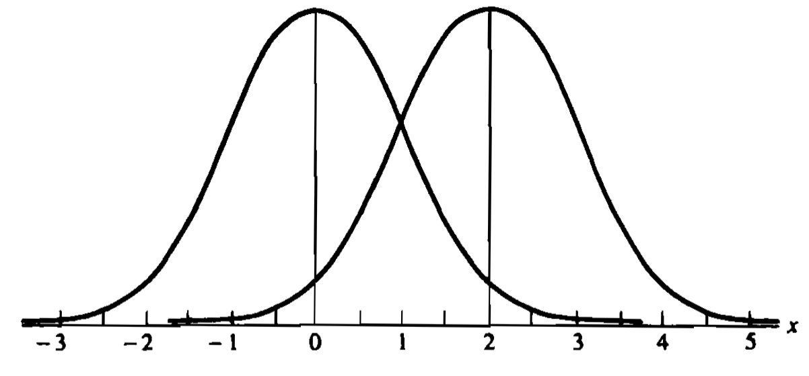
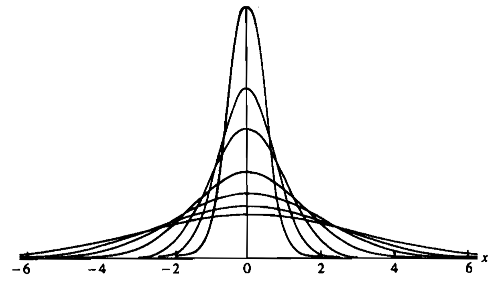

# 3 Common Families of Distributions

## 3.4 Exponential Families

> [!DEFINITION]
> A family of pdfs or pmfs is called an **exponential family** if it can be be expressed as 
> 
> $$f(x \mid \bm{\theta}) = h(x) c(\bm{\theta}) \exp \left(\sum\limits_{i=1}^{k} w_i(\bm{\theta}) t_i(x) \right),$$
> 
> where 
> 
> - $h(x) \geqslant 0$,
> - $t_i(x)$ are real-valued functions of $x$ only,
> - $c(\bm{\theta}) \geqslant 0$,
> - and $w_i(\bm{\theta})$ are real-valued functions of $\bm{\theta}$ only.

> [!EXAMPLE|label:Example：Binomial Family]
> Let $n$ be a positive integer and consider the $\text{Binomial}(n,\ p)$ family with $0 < p < 1$. Then the pmf of this family is 
> 
> $$\begin{aligned} f(x \mid p) &= \binom{n}{x} p^{x} (1 - p)^{n - x} \\ &= \binom{n}{x} (1 - p)^{n} \left(\frac{p}{1 - p} \right)^{x} \\ &= \binom{n}{x} (1 - p)^{n} \exp \left(\log \left(\frac{p}{1 - p} \right) x \right),\quad x=0,\ 1,\ \cdots.\end{aligned}$$
> 
> Since $\binom{n}{x} \geqslant 0$ and $(1 - p)^{n} \geqslant 0$, by definition we observe that the $\text{Binomial}(n,\ p)$ family with parameter $p \in (0,\ 1)$ is also an exponential family.

> [!EXAMPLE|label:Example：Normal Family]
> Consider the $\text{Normal}(\mu,\ \sigma^{2})$ family, where $\bm{\theta} = (\mu,\ \sigma),\ -\infty < \mu < \infty,\ \sigma > 0$. Then the pdf of this family is 
>
> $$\begin{aligned} f(x \mid \mu,\ \sigma^{2}) &= \frac{1}{\sqrt{2\pi} \sigma} \exp \left[-\frac{(x - \mu)^{2}}{2 \sigma^{2}} \right] \\ &= 1 \cdot \frac{1}{\sqrt{2\pi} \sigma} \exp \left(- \frac{\mu^{2}}{2 \sigma^{2}} \right) \exp \left(-\frac{x^{2}}{2 \sigma^{2}} + \frac{\mu x}{\sigma^{2}} \right). \\ \end{aligned}$$
> 
> Since $1 \geqslant 0$ and $\frac{1}{\sqrt{2\pi} \sigma} \exp \left(- \frac{\mu^{2}}{2 \sigma^{2}} \right) \geqslant 0$, by definition we observe that the $\text{Normal}(\mu,\ \sigma^{2})$ family with parameters $\mu \in (-\infty,\ \infty)$ and $\sigma \in (0,\ \infty)$ is also an exponential family.

> [!ATTENTION]
> Sometimes we may meet some distribution family that resembles an exponential family but actually not! For example, the $\text{Uniform}(0,\ \theta)$ family where parameter $\theta > 0$. Although the pdf can be written as 
> 
> $$f(x \mid \theta) = 1 \cdot \frac{1}{\theta},$$
> 
> where $1 > 0$ and $\frac{1}{\theta} \geqslant 0$. You should pay attention that the it is valid for $0 \leqslant x \leqslant \theta$, which means $h(x)$ or $t_i(x)$ would depend on $\theta$. Thus, this kind of distribution family is not an exponential family!
> 
> A good method to avoid this kind of misjudgement is to add an indicator function for $x$, e.g., $I_{[0,\ \theta]}(x)$ for the case above. If the indicator function depends on $x$ only, then it can be incorporated in $h(x)$.

> [!THEOREM]
> If $X$ is a r.v. with pdf or pmf of the form of an *exponential family*, then 
> 
> $$\begin{aligned} \E \left[\sum\limits_{i=1}^{k} \frac{\partial w_i(\bm{\theta})}{\partial \theta_j} t_i(X) \right] &= - \frac{\partial }{\partial \theta_j} \log c(\bm{\theta}); \\ \Var \left(\sum\limits_{i=1}^{k} \frac{\partial w_i(\bm{\theta})}{\partial \theta_j} t_i(X) \right) &= - \frac{\partial^{2}}{\partial \theta_j^{2}} \log c(\bm{\theta}) - \E \left[\sum\limits_{i=1}^{k} \frac{\partial^{2} w_i(\bm{\theta})}{\partial \theta_j^{2}} t_i(X) \right]. \end{aligned}$$

It seems like the theorem above is complicated and confusing. However, we will see that this theorem, which can *replace integration or summation by differentiation*, is often more straightforward in the following example.

> [!EXAMPLE]
> From the [Binomial example](#binomial) above we know that the pmf can be written as 
> 
> $$f(x \mid p) = \binom{n}{x} (1 - p)^{n} \exp \left(\log \left(\frac{p}{1 - p} \right) x \right),\quad x=0,\ 1,\ \cdots.$$
> 
> By the definition of an exponential family, we can set $k = 1$ and define 
> 
> - $h(x) := \binom{n}{x}$,
> - $c(p) := (1 - p)^{n}$,
> - $w_1(p) := \log \left(\frac{p}{1 - p} \right)$,
> - and $t_1(x) := x$.
> 
> Applying the theorem above we have 
> 
> $$\begin{aligned} \E\left[\frac{\mathrm{d} w_1(p)}{\mathrm{d} p} t_1(X) \right] &= - \frac{\mathrm{d} }{\mathrm{d} p}\log c(p) \\ \E \left[\frac{\mathrm{d} }{\mathrm{d} p}\log \left(\frac{p}{1 - p} \right) X \right] &= - \frac{\mathrm{d} }{\mathrm{d} p}[n \log (1 - p)] \\ \frac{1}{p (1 - p)} \E[X] &= \frac{n}{1 - p} \\ \E[X] = n p, \end{aligned}$$
> 
> and 
> 
> $$\begin{aligned} \Var \left(\frac{\mathrm{d} w_1(p)}{\mathrm{d} p} t_1(X) \right) &= - \frac{\mathrm{d}^{2}}{\mathrm{d} p^{2}}\log c(p) - \E \left[\frac{\mathrm{d}^{2} w_1(p)}{\mathrm{d} p^{2}} t_1(X) \right] \\ \Var \left[\frac{1}{p (1 - p)} X \right] &= - \frac{\mathrm{d} }{\mathrm{d} p}\left(- \frac{n}{1 - p} \right) - \E \left[\frac{\mathrm{d}}{\mathrm{d}p}\frac{1}{p (1 - p)} X \right]  \\ \frac{1}{p^{2} (1 - p)^{2}} \Var(X) &= \frac{n}{(1 - p)^{2}} + \left[\frac{1}{p^{2}} - \frac{1}{(1 - p)^{2}} \right] n p \\ \Var(X) &= n p^{2} + \left[(1 - p)^{2} - p^{2} \right] n p \\ \Var(X) &= n p (1 - p). \end{aligned}$$

> [!TIP]
> Here we introduce a more efficient form of an exponential family, which have better properties (but **not for this course**): 
> 
> $$f(x;\ \theta,\ \phi) = e^{(x \theta - b(\theta)) / a(\phi) + c(x,\ \phi)},$$
> 
> where $\phi$ is called the dispersion parameter and $\theta$ is called the natural parameter.
> 
> Two properties of this form: 
> 
> - $\mu = \E[x] = b'(\theta)$;
> - $\Var(y) = b''(\theta) a(\phi)$.

### Exercises

1. Gamma distribution has the following pdf 

    $$
    f(x \mid \alpha,\ \beta) = \frac{1}{\Gamma(\alpha) \beta^{\alpha}} x^{\alpha - 1} e^{-\frac{x}{\beta}},\quad x \in (0,\ \infty)
    $$

    with shape parameter $\alpha > 0$ and scale parameter $\beta > 0$, where $\Gamma(\alpha) = \int_{0}^{\infty} x^{\alpha - 1}e^{-x} ~\mathrm{d}x$ is the Gamma function. To prove that Gamma family is an exponential family.

    

    
Proof: 

    The pdf can be written as 

    $$
    f(x \mid \alpha,\ \beta) = I_{(0,\ \infty)}(x) \frac{1}{\Gamma(\alpha) \beta^{\alpha}} e^{(\alpha - 1) \log x - \frac{1}{\beta} x}.
    $$

    By definition we can set $k = 2$ and define 

    - $h(x) := I_{(0,\ \infty)}(x)$, 
    - $c(\alpha,\ \beta) := \frac{1}{\Gamma(\alpha) \beta^{\alpha}}$, 
    - $w_1(\alpha,\ \beta) := \alpha - 1$, 
    - $t_1(x) := \log x$, 
    - $w_2(\alpha,\ \beta) := -\frac{1}{\beta}$, 
    - and $t_2(x) := x$.

    Since $h(x) = I_{(0,\ \infty)}(x) \geqslant 0$ and $c(\alpha,\ \beta) = \frac{1}{\Gamma(\alpha) \beta^{\alpha}} \geqslant 0$ for $\alpha > 0,\ \beta > 0$, the Gamma family is an exponential family.
    

2. In a sequence of independent $\text{Bernoulli}(p)$ trials, let the r.v. $X$ denote the trial at which the $r$-th success occurs, where $r$ is a fixed integer. Then $X$ is distributed as the following $\text{Negative Binomial}(r,\ p)$ distribution 

    $$
    P(X = x \mid r,\ p) = \binom{x - 1}{r - 1} p^{r} (1 - p)^{x - r},\quad x = r,\ r+1,\ \cdots .
    $$

    To prove the $\text{Negative Binomial}(r,\ p)$ distribution is an exponential family.

    

    
Proof: 

    Fix $r$, the pmf can be written as 

    $$
    \begin{aligned}
        P(X = x \mid p) &= \binom{x - 1}{r - 1} I_{\left\{r,\ r + 1,\ \cdots \right\}}(x) \left(\frac{p}{1 - p} \right)^{r} (1 - p)^{x} \\
        &= \binom{x - 1}{r - 1} I_{\left\{r,\ r + 1,\ \cdots \right\}}(x) \left(\frac{p}{1 - p} \right)^{r} \exp(\log (1 - p) x).
    \end{aligned}
    $$

    By definition we can set $k = 1$ and define 

    - $h(x) := \binom{x - 1}{r - 1} I_{\left\{r,\ r + 1,\ \cdots \right\}}(x)$, 
    - $c(p) := \left(\frac{p}{1 - p} \right)^{r}$, 
    - $w_1(p) := \log (1 - p)$, 
    - and $t_1(x) := x$.

    Since $h(x) = \binom{x - 1}{r - 1} I_{\left\{r,\ r + 1,\ \cdots \right\}}(x) \geqslant 0$ and $c(p) = \left(\frac{p}{1 - p} \right)^{r} \geqslant 0$ for $p \in (0,\ 1)$, the $\text{Negative Binomial}(r,\ p)$ family is an exponential family.
    

## 3.5 Location and Scale Familes

> [!THEOREM]
> Let $f(x)$ be any pdf and let $\mu$ and $\sigma > 0$ be any given constants. Then the function 
> 
> $$g(x \mid \mu,\ \sigma) = \frac{1}{\sigma} f\left(\frac{x - \mu}{\sigma} \right)$$
> 
> is a pdf.

> [!DEFINITION]
> Let $f(x)$ be any pdf. Then the family of pdfs $f(x - \mu)$, indexed by the parameter $\mu,\ -\infty < \mu < \infty$, is called the **location family** with standard pdf $f(x)$ and $\mu$ is called the **location parameter** for the family.

The effect of introducing the location parameter $\mu$ is to shift the graph of $f(x)$, like this: 

> [!DEFINITION]
> Let $f(x)$ be any pdf. Then for any $\sigma > 0$, the family of pdfs $\frac{1}{\sigma}f\left(\frac{x}{\sigma} \right)$, indexed by the parameter $\sigma$, is called the **scale family** with standard pdf $f(x)$ and $\sigma$ is called the **scale parameter** of the family.

The effect of introducing the scale parameter $\sigma$ is either to stretch ($\sigma > 1$) or to contract ($\sigma < 1$) the graph of $f(x)$, like this: 

> [!DEFINITION]
> Let $f(x)$ be any pdf. Then for any $\mu,\ -\infty < \mu < \infty$, and any $\sigma > 0$, the family of pdfs $\frac{1}{\sigma}f\left(\frac{x - \mu}{\sigma} \right)$, indexed by the parameter $(\mu,\ \sigma)$, is called the **location-scale family** with standard pdf $f(x)$.

> [!THEOREM]
> Let $f(\cdot)$ be any pdf. Let $\mu$ be any *real number*, and let $\sigma$ be any *positive real number*. Then $X$ is a r.v. with pdf $\frac{1}{\sigma}f\left(\frac{x - \mu}{\sigma} \right)$ *iff* $\exists $ a r.v. $Z$ with pdf $f(z)$ and $X = \mu + \sigma Z$.

### Exercises

*3.39* (p.134) Consider the Cauchy family defined in Section 3.3. This family can be extended to a location-scale family yielding pdfs of the form 

$$
f(x \mid \mu,\ \sigma) = \frac{1}{\sigma \pi \left(1 + \left(\frac{x - \mu}{\sigma} \right)^{2} \right)},\quad -\infty < x < \infty.
$$

The mean and variance do not exist for the Cauchy distribution. So the parameters $\mu$ and $\sigma^{2}$ are not the mean and variance. But they do have important meaning. Show that if $X$ is a random variable with a Cauchy distribution with parameters $\mu$ and $\sigma$, then: 

(a) $\mu$ is the median of the distribution of $X$, that is, $P(X \geqslant \mu) = P(X \leqslant \mu) = \frac{1}{2}$.

Proof: 

$$
\begin{aligned}
    P(X \leqslant \mu) &= \int_{-\infty}^{\mu} \frac{1}{\sigma \pi \left(1 + \left(\frac{x - \mu}{\sigma} \right)^{2} \right)} ~\mathrm{d}x \\
    &= \frac{1}{\pi} \int_{-\infty}^{0} \frac{1}{1 + \left(\frac{x - \mu}{\sigma} \right)^{2}} ~\mathrm{d}\left(\frac{x - \mu}{\sigma} \right) \\
    &= \frac{1}{\pi} \arctan \left(\frac{x - \mu}{\sigma} \right) \bigg\vert_{\frac{x - \mu}{\sigma} = -\infty}^{0} \\
    &= \frac{1}{\pi} \left[0 - \left(- \frac{\pi}{2} \right)  \right]  \\
    &= \frac{1}{2},
\end{aligned}
$$

which means $\mu$ is the median of the distribution of $X$.

(b) $\mu + \sigma$ and $\mu - \sigma$ are the quartiles of the distribution of $X$, that is, $P(X \geqslant \mu + \sigma) = P(X \leqslant \mu - \sigma) = \frac{1}{4}$. (*Hint*: Prove this first for $\mu = 0$ and $\sigma = 1$ and then use Exercise 3.38.)

Proof: 

Note that the pdf is symmetric about $x = \mu$, so we only need to show that $P(X \leqslant \mu - \sigma) = \frac{1}{4}$.

$$
\begin{aligned}
    P(X \leqslant \mu - \sigma) &= \int_{-\infty}^{\mu - \sigma} \frac{1}{\sigma \pi \left(1 + \left(\frac{x - \mu}{\sigma} \right)^{2} \right)} ~\mathrm{d}x \\
    &= \frac{1}{\pi} \int_{-\infty}^{-1} \frac{1}{1 + \left(\frac{x - \mu}{\sigma} \right)^{2}} ~\mathrm{d}\left(\frac{x - \mu}{\sigma} \right) \\
    &= \frac{1}{\pi} \arctan \left(\frac{x - \mu}{\sigma} \right) \bigg\vert_{\frac{x - \mu}{\sigma} = -\infty}^{-1} \\
    &= \frac{1}{\pi} \left[-\frac{\pi}{4} - \left(- \frac{\pi}{2} \right)  \right]  \\
    &= \frac{1}{4}.
\end{aligned}
$$

Thus, $\mu + \sigma$ and $\mu - \sigma$ are the quartiles of the distribution of $X$.

## 3.6 Inequalities and Identities

### 3.6.1 Probability Inequalities

> [!THEOREM|label:Chebychev’s Inequality]
> Let $X$ be a r.v. and let $g(x)$ be a *nonnegative function*. Then, for any $r > 0$, 
> 
> $$P(g(X) \geqslant r) \leqslant \frac{\E[g(X)]}{r}.$$

Proof:

$$
\begin{aligned}
    \E[g(X)] &= \int_{-\infty}^{\infty} g(x) f_{X}(x) ~\mathrm{d}x \\
    &\geqslant \int_{\left\{x: g(x) \geqslant r \right\}} g(x) f_{X}(x) ~\mathrm{d}x \\
    &\geqslant r \int_{\left\{x: g(x) \geqslant r \right\}} f_{X}(x) ~\mathrm{d}x \\
    &= r P(g(X) \geqslant r).
\end{aligned}
$$

> [!EXAMPLE]
> The most widespread use of Chebychev’s Inequality involves means and variances. Let $g(x) = \frac{(x - \mu)^{2}}{\sigma^{2}}$, where $\mu = \E[X]$ and $\sigma^{2} = \Var(X)$. For convenience write $r = t^{2}$. Then 
> 
> $$P\left[\frac{\left(X - \mu \right)^{2}}{\sigma^{2}} \geqslant t^{2} \right] \leqslant \frac{1}{t^{2}} \E\left[\frac{\left(X - \mu \right)^{2}}{\sigma^{2}} \right] = \frac{1}{t^{2}}.$$
> 
> Doing some obvious algebra, we get the inequality 
> 
> $$P(\left\vert X - \mu \right\vert \geqslant t \sigma) \leqslant \frac{1}{t^{2}}$$
> 
> and its companion 
> 
> $$P(\left\vert X - \mu \right\vert < t \sigma) \geqslant 1 - \frac{1}{t^{2}},$$
> 
> which gives a universal bound on the deviation $\left\vert X - \mu \right\vert$ in terms of $\sigma$. For example, taking $t = 2$, we get 
> 
> $$P(\left\vert X - \mu \right\vert < 2 \sigma) \geqslant 1 - \frac{1}{4} = \frac{3}{4},$$
> 
> which means there is at least 75\% chance that a r.v. will be with $2 \sigma$ of its mean (no matter what the distribution of $X$ is).

> [!NOTE]
> Note that in the example above, we square the function $g(x)$ to avoid integration with an unknown pdf, but this causes different bounds, say, $\frac{\E[\left\vert g(X) \right\vert]}{r}$ and $\frac{\E[g^{2}(X)]}{r^{2}}$. We cannot say which bound is tighter (see [exercises](#exercises-2)).

Chebychev’s Inequality does not always give a tight bound. See the following example.

> [!EXAMPLE|label:Example：Normal Probability Inequality]
> Let $Z$ be a standard normal r.v., then from Chebychev’s Inequality we have 
> 
> $$P(\left\vert Z \right\vert \geqslant t) = P(Z^{2} \geqslant t^{2}) \leqslant \frac{\E[Z^{2}]}{t^{2}} = \frac{1}{t^{2}}.$$
> 
> Now we try to find a tighter bound. First, we have 
> 
> $$\begin{aligned} P(Z \geqslant t) &= \frac{1}{\sqrt{2 \pi}} \int_{t}^{\infty} e^{-\frac{z^{2}}{2}} ~\mathrm{d}z \\ &\leqslant \frac{1}{\sqrt{2 \pi}} \int_{t}^{\infty} \frac{z}{t} e^{-\frac{z^{2}}{2}} ~\mathrm{d}z \\ &= \frac{1}{\sqrt{2 \pi} t} \int_{\frac{t^{2}}{2}}^{\infty} e^{-\frac{z^{2}}{2}} ~\mathrm{d}\left(\frac{z^{2}}{2} \right) \\ &= -\frac{1}{\sqrt{2 \pi} t} e^{-\frac{z^{2}}{2}}\bigg\vert_{z=t}^{\infty} \\ &= \frac{1}{\sqrt{2 \pi} t} e^{-\frac{t^{2}}{2}}. \end{aligned}$$
> 
> By symmetry of standard normal we have 
> 
> $$P(\left\vert Z \right\vert \geqslant t) = 2 P(Z \geqslant t) \leqslant \sqrt{\frac{2}{\pi}} \frac{e^{-\frac{t^{2}}{2}}}{t}.$$
> 
> When $t = 2$, the Chebychev’s bound is $0.25$, while the bound we find above is $0.054$, which is a vast improvement.

### 3.6.2 Identities

> [!THEOREM|label:Stein’s Lemma]
> Let $X \sim N(\mu,\ \sigma^{2})$, and let $g$ be a differentiable function satisfying $\E[\left\vert g'(X) \right\vert] < \infty$. Then 
> 
> $$\E [g(X)(X - \mu)] = \sigma^{2} \E[g'(X)].$$

Stein’s Lemma makes calculation of higher-order moments quite easy. See the following example.

> [!EXAMPLE]
> If $X \sim N(\mu,\ \sigma^{2})$, then 
> 
> $$\begin{aligned} \E[X^{3}] &= \E[X^{2}(X - \mu + \mu)] \\ &= \E[X^{2}(X - \mu)] + \mu \E[X^{2}] \\ &= \sigma^{2} \E[2 X] + \mu (\sigma^{2} + \mu^{2}) \\ &= \mu^{3} + 3 \mu \sigma^{2}. \end{aligned}$$

> [!THEOREM|label:Hwang’s Identity]
> Let $g(x)$ be a function with $-\infty < \E[g(X)] < \infty$ and $-\infty < g(-1) < \infty$. Then: 
> 
> - If $X \sim \text{Poisson}(\lambda)$, 
> 
>     $$\E[\lambda g(X)] = \E[X g(X - 1)].$$
> 
> - If $X \sim \text{Negative Binomial}(r,\ p)$, 
> 
>     $$\E[(1 - p)g(X)] = \E\left[\frac{X}{r + X - 1} g(X - 1) \right].$$

Proof: 

We only prove the first one because the second one is similar. Since 

$$
\E[\lambda g(X)] = \sum\limits_{x=0}^{\infty} \lambda g(x) \frac{e^{-\lambda} \lambda^{x}}{x!} = \sum\limits_{x=0}^{\infty} g(x) (x + 1) \frac{e^{-\lambda} \lambda^{x + 1}}{(x + 1)!},
$$

we can transform the summation index to be $y = x + 1$: 

$$
\E[\lambda g(X)] = \sum\limits_{y=1}^{\infty} g(y - 1) y \frac{e^{-\lambda} \lambda^{y}}{y!} = \sum\limits_{y=0}^{\infty} g(y - 1) y \frac{e^{-\lambda} \lambda^{y}}{y!} = \E[X g(X - 1)].
$$

Similar to Stein’s Lemma, Hwang’s Identity is also useful for calculating higher-order moments. See the following example.

> [!EXAMPLE]
> - For $X \sim \text{Poisson}(\lambda)$, if we want to calculate the third moment, we need to set $g(x) = x^{2}$. Then by Hwang’s Identity, we have 
> 
>     $$\begin{aligned} \E[\lambda X^{2}] &= \E[X (X - 1)^{2}] \\ \lambda \E[X^{2}] &= \E[X^{3} - 2 X^{2} + X] \\ \E[X^{3}] &= (\lambda + 2) \E[X^{2}] - \E[X] \\ \E[X^{3}] &= (\lambda + 2) (\lambda + \lambda^{2}) - \lambda \\ \E[X^{3}] &= \lambda^{3} + 3 \lambda^{2} + \lambda. \end{aligned}$$
> 
> - For $X \sim \text{Negative Binomial}(r,\ p)$, if we want to calculate the mean, we need to set $g(x) = r + x$. Then by Hwang’s Identity, we have 
> 
>     $$\begin{aligned} \E[(1 - p)(r + X)] &= \E\left[\frac{X}{r + X - 1}(r + X - 1)\right] \\ (1 - p) r + (1 - p) \E[X] &= \E[X] \\ \E[X] &= \frac{(1 - p) r}{1 - (1 - p)} \\ \E[X] &= r \frac{1 - p}{p}. \end{aligned}$$

### Exercises

*3.44* (p.134) For any random variable $X$ for which $\E[X^{2}]$ and $\E[\left\vert X \right\vert]$ exist, show that $P(\left\vert X \right\vert \geqslant b)$ does not exceed either $\E[X^{2}] / b^{2}$ or $\E[\left\vert X \right\vert] / b$, where $b$ is a positive constant. If $f(x) = e^{-x}$ for $x > 0$, show that one bound is better when $b = 3$ and the other when $b = \sqrt{2}$. (Notice Markov’s Inequality in Miscellanea 3.8.2.)

Proof: 

From Chebychev’s Inequality we know that 

$$
P(\left\vert X \right\vert \geqslant b) \leqslant \frac{\E[\left\vert X \right\vert]}{b},
$$

and 

$$
P(\left\vert X \right\vert \geqslant b) = P(X^{2} \geqslant b) \leqslant \frac{\E[X^{2}]}{b^{2}}.
$$

If $f(x) = e^{-x}$ for $x > 0$, we have 

$$
\begin{aligned}
    \frac{\E[\left\vert X \right\vert]}{b} &= \frac{\int_{0}^{\infty} \left\vert x \right\vert f(x) ~\mathrm{d}x}{b} \\
    &= \frac{\int_{0}^{\infty} x e^{-x} ~\mathrm{d}x}{b} \\
    &= \frac{-\int_{0}^{\infty} x ~\mathrm{d}e^{-x}}{b} \\
    &= \frac{-\left(x e^{-x} - \int e^{-x} ~\mathrm{d}x\right)\big\vert_{x=0}^{\infty} }{b} \\
    &= \frac{-(x + 1)e^{-x}\big\vert_{x=0}^{\infty}}{b} \\
    &= \frac{1}{b}
\end{aligned}
$$

and 

$$
\begin{aligned}
    \frac{\E[X^{2}]}{b^{2}} &= \frac{\int_{0}^{\infty} x^{2} f(x) ~\mathrm{d}x}{b^{2}} \\
    &= \frac{\int_{0}^{\infty} x^{2} e^{-x} ~\mathrm{d}x}{b^{2}} \\
    &= \frac{-\int_{0}^{\infty} x^{2} ~\mathrm{d}e^{-x}}{b^{2}} \\
    &= \frac{-\left(x^{2}e^{-x} - \int e^{-x} ~\mathrm{d}x^{2}  \right)\big\vert_{0}^{\infty}}{b^{2}} \\
    &= \frac{-\left(x^{2}e^{-x} - 2 \int x e^{-x} ~\mathrm{d}x \right)\big\vert_{0}^{\infty}}{b^{2}} \\
    &= \frac{-\left[x^{2}e^{-x} + 2(x + 1) e^{-x} \right]\big\vert_{0}^{\infty}}{b^{2}} \\
    &= \frac{2}{b^{2}}.
\end{aligned}
$$

Thus, when $b = 3$, 

$$
\frac{\E[\left\vert X \right\vert]}{b} = \frac{1}{3} > \frac{2}{9} = \frac{\E[X^{2}]}{b^{2}},
$$

which means the latter is better. When $b = \sqrt{2}$, 

$$
\frac{\E[\left\vert X \right\vert]}{b} = \frac{\sqrt{2}}{2} < \frac{2}{2} = \frac{\E[X^{2}]}{b^{2}},
$$

which means the former is better.

> [!TIP]
> Actually, if you are familiar with the pdf $f(x) = e^{-x}$, you would find that this means $X \sim \text{Exponential}(1)$. Then you can easily get $\E[X] = 1$ and $\Var(X) = 1^{2} = 1$.

## Assignments

### Additional Exercises

1. If $X$ is a random variable with pdf or pmf of the form 

    $$
    f(x \mid \bm{\theta}) = h(x) c(\bm{\theta}) \exp \left(\sum\limits_{i=1}^{k} w_i(\bm{\theta}) t_i(x) \right),
    $$

    the exponential family. Show that 

    (a) $\E\left[\sum\limits_{i=1}^{k} \frac{\partial w_i(\bm{\theta})}{\partial \theta_j} t_i(X) \right] = -\frac{\partial }{\partial \theta_j}\log c(\bm{\theta})$.

    > [!TIP]
    > Taking exponential for both sides, you may find that the identity can be rearranged to the derivative of $f(x \mid \bm{\theta})$ w.r.t. $\theta_j$, so a good choice is to start from the identity $\int_{-\infty}^{\infty} f(x \mid \bm{\theta}) ~\mathrm{d}x = 1$ and differentiate both sides w.r.t. $\theta_j$.

    

    
Proof: 

    Differentiate both sides of 

    $$
    \int_{-\infty}^{\infty} f(x \mid \bm{\theta}) ~\mathrm{d}x = 1
    $$

    w.r.t. $\theta_j$, we get 

    $$
    \begin{aligned}
        0 &= \frac{\partial }{\partial \theta_j}\int_{-\infty}^{\infty} f(x \mid \bm{\theta}) ~\mathrm{d}x \\
        &= \int_{-\infty}^{\infty} \Bigg[h(x) \frac{\partial c(\bm{\theta})}{\partial \theta_j} \exp \left(\sum\limits_{i=1}^{k} w_i(\bm{\theta}) t_i(x) \right) \\ &\qquad+ h(x) c(\bm{\theta}) \left(\sum\limits_{i=1}^{k} \frac{\partial w_i(\bm{\theta})}{\partial \theta_j} t_i(x) \right) \exp \left(\sum\limits_{i=1}^{k} w_i(\bm{\theta}) t_i(x) \right)\Bigg] ~\mathrm{d}x \\
        &= \frac{\partial c(\bm{\theta})}{\partial \theta_j} \frac{1}{c(\bm{\theta})} + \E\left[\sum\limits_{i=1}^{k} \frac{\partial w_i(\bm{\theta})}{\partial \theta_j} t_i(X) \right] \\
        &= \frac{\partial }{\partial \theta_j}\log c(\bm{\theta}) + \E\left[\sum\limits_{i=1}^{k} \frac{\partial w_i(\bm{\theta})}{\partial \theta_j} t_i(X) \right],
    \end{aligned}
    $$

    which means 

    $$
    \E\left[\sum\limits_{i=1}^{k} \frac{\partial w_i(\bm{\theta})}{\partial \theta_j} t_i(X) \right] = -\frac{\partial }{\partial \theta_j}\log c(\bm{\theta}).
    $$
    

    (b) $\Var \left(\sum\limits_{i=1}^{k} \frac{\partial w_i(\bm{\theta})}{\partial \theta_j} t_i(X) \right) = - \frac{\partial^{2}}{\partial \theta_j^{2}} \log c(\bm{\theta}) - \E \left[\sum\limits_{i=1}^{k} \frac{\partial^{2} w_i(\bm{\theta})}{\partial \theta_j^{2}} t_i(X) \right].$

    

    
Proof: 

    From (a) we know that 

    $$
    -\frac{\partial }{\partial \theta_j}\log c(\bm{\theta}) = \E\left[\sum\limits_{i=1}^{k} \frac{\partial w_i(\bm{\theta})}{\partial \theta_j} t_i(X) \right].
    $$

    Differentiate both sides w.r.t. $\theta_j$ and we get 

    $$
    \begin{aligned}
        -\frac{\partial^{2}}{\partial \theta_j^{2}}\log c(\bm{\theta}) &= \frac{\partial }{\partial \theta_j}\int_{-\infty}^{\infty} \Bigg[h(x) c(\bm{\theta}) \left(\sum\limits_{i=1}^{k} \frac{\partial w_i(\bm{\theta})}{\partial \theta_j} t_i(x) \right) \\ &\qquad \cdot \exp \left(\sum\limits_{i=1}^{k} w_i(\bm{\theta}) t_i(x) \right) \Bigg] ~\mathrm{d}x \\
        &= \frac{\partial c(\bm{\theta})}{\partial \theta_j} \frac{1}{c(\bm{\theta})} \E\left[\sum\limits_{i=1}^{k} \frac{\partial w_i(\bm{\theta})}{\partial \theta_j} t_i(X) \right] \\ &\qquad + \E \left[\sum\limits_{i=1}^{k} \frac{\partial^{2} w_i(\bm{\theta})}{\partial \theta_j^{2}} t_i(X) \right] \\ &\qquad+ \E\left[\left(\sum\limits_{i=1}^{k} \frac{\partial w_i(\bm{\theta})}{\partial \theta_j} t_i(X) \right)^{2} \right] \\
        &= \E\left[\left(\sum\limits_{i=1}^{k} \frac{\partial w_i(\bm{\theta})}{\partial \theta_j} t_i(X) \right)^{2} \right] \\ &\qquad- \left[\E\left[\sum\limits_{i=1}^{k} \frac{\partial w_i(\bm{\theta})}{\partial \theta_j} t_i(X) \right] \right]^{2} \\ &\qquad + \E \left[\sum\limits_{i=1}^{k} \frac{\partial^{2} w_i(\bm{\theta})}{\partial \theta_j^{2}} t_i(X) \right] \\
        &= \Var\left(\sum\limits_{i=1}^{k} \frac{\partial w_i(\bm{\theta})}{\partial \theta_j} t_i(X) \right) + \E \left[\sum\limits_{i=1}^{k} \frac{\partial^{2} w_i(\bm{\theta})}{\partial \theta_j^{2}} t_i(X) \right],
    \end{aligned}
    $$

    which means 

    $$
    \Var \left(\sum\limits_{i=1}^{k} \frac{\partial w_i(\bm{\theta})}{\partial \theta_j} t_i(X) \right) = - \frac{\partial^{2}}{\partial \theta_j^{2}} \log c(\bm{\theta}) - \E \left[\sum\limits_{i=1}^{k} \frac{\partial^{2} w_i(\bm{\theta})}{\partial \theta_j^{2}} t_i(X) \right].
    $$
    

2. Suppose the random variable $T$ is the length of life of an object. The hazard function $h_{T}(t)$ associated with the random variable $T$ is defined by 

    $$
    h_{T}(t) = \lim\limits_{\delta \to 0} \frac{P(t \leqslant T \leqslant t + \delta \mid T \geqslant t)}{\delta}.
    $$
    
    Thus, we can interpret $h_{T}(t)$ as the rate of change of the probability that the object survives a little past time $\delta$, given that the object survives to time $t$. Show that if $T$ is a continuous random variable, then 
    
    $$
    h_{T}(t) = \frac{f_{T}(t)}{1 - F_{T}(t)} = - \frac{\mathrm{d}}{\mathrm{d}t} \log (1 - F_{T}(t)).
    $$

    

    
Proof: 

    $$
    \begin{aligned}
        h_{T}(t) &= \lim\limits_{\delta \to 0} \frac{P(T \leqslant t + \delta) - P(T < t)}{\delta P(T \geqslant t)} \\
        &= \lim\limits_{\delta \to 0} \frac{F_{T}(t + \delta) - F_{T}(t)}{\delta (1 - F_{T}(t))} \\
        &= \frac{f_{T}(t)}{1 - F_{T}(t)} \\
        &= \frac{-\frac{\mathrm{d}}{\mathrm{d}t}(1 - F_{T}(t))}{1 - F_{T}(t)} \\
        &= - \frac{\mathrm{d}}{\mathrm{d}t}\log (1 - F_{T}(t)).
    \end{aligned}
    $$
    

3. Let $f(x)$ be a pdf and let $a$ be a number such that, for all $\epsilon > 0$, $f(a + \epsilon) = f(a - \epsilon)$. Such a pdf is said to be symmetric about the point $a$. If $X \sim f(x)$, symmetric about $a$, show the following 

    (a) If $\E[X]$ exists, then $\E[X] = a$.

    

    
Proof: 

    Note that $f(a + \epsilon) = f(a - \epsilon)$ is also true for all $\epsilon < 0$ and $\epsilon = 0$ obviously. So if $\E[X]$ exists, we have 

    $$
    \begin{aligned}
        \E[X] &= \int_{-\infty}^{\infty} (a - x) f(a - x) ~\mathrm{d}(a - x) \\
        &= \frac{1}{2} \left[\int_{-\infty}^{\infty} (a - x) f(a - x) ~\mathrm{d}(a - x) + \int_{-\infty}^{\infty} (a - x) f(a + x) ~\mathrm{d}(a - x) \right] \\
        &= \frac{1}{2} \cdot 2 a \int_{-\infty}^{\infty} f(a - x) ~\mathrm{d}(a - x) \\
        &= a.
    \end{aligned}
    $$
    

    (b) The median of $X$ is the number $a$.

    

    
Proof: 

    Since 

    $$
    \begin{aligned}
        \int_{-\infty}^{a} f(x) ~\mathrm{d}x &= \int_{-\infty}^{a} f(a - y) ~\mathrm{d}(a - y) \\
        &= \int_{0}^{\infty} f(a - y) ~\mathrm{d}y \\
        &= \int_{0}^{\infty} f(a + y) ~\mathrm{d}y \\
        &= \int_{a}^{\infty} f(a + y) ~\mathrm{d}(a + y) \\
        &= \frac{1}{2}\left[\int_{-\infty}^{a} f(x) ~\mathrm{d}x + \int_{a}^{\infty} f(x) ~\mathrm{d}x\right] \\
        &= \frac{1}{2},
    \end{aligned}
    $$

    the median of $X$ is the number $a$.
    

    (c) If $a = 0$, then $\mu$ is the median of the location-scale pdf $\frac{1}{\sigma}f(\frac{x - \mu}{\sigma})$, $-\infty < x < \infty$.

    

    
Proof: 

    From (b) we know that the median of $X$ is $a = 0$, then we have 

    $$
    \int_{-\infty}^{\mu} \frac{1}{\sigma} f\left(\frac{x - \mu}{\sigma} \right) ~\mathrm{d}x = \int_{-\infty}^{0} f\left(\frac{x - \mu}{\sigma} \right) ~\mathrm{d}\left(\frac{x - \mu}{\sigma} \right) = \frac{1}{2},
    $$

    which means $\mu$ is the median of $\frac{1}{\sigma} f(\frac{x - \mu}{\sigma})$.
    

4. Let $X$ be a random variable with mgf $M_{X}(t)$, $-h < t < h$.

    (a) Prove that 

    $$
    P(X \geqslant a) \leqslant e^{-at} M_{X}(t),\quad 0 < t < h,
    $$
    
    $$
    P(X \leqslant a) \leqslant e^{-at} M_{X}(t),\quad -h < t < 0.
    $$

    

    
Proof: 

    When $0 < t < h$, by Chebychev’s Inequality we have 

    $$
    P(X \geqslant a) = P(t X \geqslant a t) = P(e^{t X} \geqslant e^{a t}) \leqslant \frac{\E[e^{t X}]}{e^{a t}} = e^{-a t} M_{X}(t).
    $$

    Similarly, when $-h < t < 0$, we have  \geqslant 0

    $$
    P(X \leqslant a) = P(t X \geqslant a t) = P(e^{t X} \geqslant e^{a t}) \leqslant \frac{\E[e^{t X}]}{e^{a t}} = e^{-a t} M_{X}(t).
    $$
    

    (b) By question (a) we have $P(X \geqslant 0) \leqslant \E[e^{tX}]$ for all $t \geqslant 0$. What are general conditions on a function $h(t,\ x)$ such that $P(X \geqslant 0) \leqslant \E[h(t,\ X)]$ for all $t \geqslant 0$ for which $\E[h(t,\ X)]$ exists?

    Solution:

    Suppose $h(t,\ x)$ is nonnegative for all $t \geqslant 0$, then we have 

    $$
    \E[h(t,\ X)] = \int_{-\infty}^{\infty} h(t,\ x) f(x) ~\mathrm{d}x \geqslant \int_{0}^{\infty} h(t,\ x) f(x) ~\mathrm{d}x.
    $$

    Then, if $h(t,\ x) \geqslant 1$ for all $t \geqslant 0$ and $x \geqslant 0$, we have 

    $$
    \E[h(t,\ X)] \geqslant \int_{0}^{\infty} h(t,\ x) f(x) ~\mathrm{d}x \geqslant \int_{0}^{\infty} f(x) ~\mathrm{d}x = P(X \geqslant 0).
    $$

    Thus, the general conditions are 

    1. $h(t,\ x) \geqslant 0,\ \forall t \geqslant 0,\ \forall x$;
    2. $h(t,\ x) \geqslant 1,\ \forall t \geqslant 0,\ \forall x \geqslant 0$.

5. Stein’s Lemma applications and analogs.

    (a) If $X \sim N(\mu,\ \sigma^{2})$, calculate the $\E[X^{4}]$.

    

    
Solution: 

    Let $g(x) = x^{2}$, by Stein’s Lemma we have 

    $$
    \begin{aligned}
        \E[X^{2} (X - \mu)] &= \sigma^{2} \E[2 X] \\
        \E[X^{3} - \mu X^{2}] &= 2 \mu \sigma^{2} \\
        \E[X^{3}] &= \mu (\sigma^{2} + \mu^{2}) + 2 \mu \sigma^{2} \\
        \E[X^{3}] &= \mu^{3} + 3 \mu \sigma^{2}.
    \end{aligned}
    $$

    Then, let $g(x) = x^{3}$, also by Stein’s Lemma we have 

    $$
    \begin{aligned}
        \E[X^{3} (X - \mu)] &= \sigma^{2} \E[3 X^{2}] \\
        \E[X^{4} - \mu X^{3}] &= 3 \sigma^{2} (\sigma^{2} + \mu^{2}) \\
        \E[X^{4}] &= \mu (\mu^{3} + 3 \mu \sigma^{2}) + 3 \sigma^{2} (\sigma^{2} + \mu^{2}) \\
        \E[X^{4}] &= \mu^{4} + 6 \mu^{2} \sigma^{2} + 3 \sigma^{4}.
    \end{aligned}
    $$
    

    (b) Prove that if $X \sim \text{Beta}(\alpha,\ \beta)$, then 

    $$
    \E\left[g(X) \left[\beta - (\alpha - 1) \frac{1 - X}{X} \right]  \right] = \E\left[(1 - X) g'(X) \right].
    $$

    > [!TIP]
    > The pdf of $\text{Beta}(\alpha,\ \beta)$ is given by 
    > 
    > $$f(x \mid \alpha,\ \beta) = \frac{1}{B(\alpha,\ \beta)} x^{\alpha - 1} (1 - x)^{\beta - 1},\quad 0 < x < 1,\ \alpha > 0,\ \beta > 0,$$
    > 
    > where $B(\alpha,\ \beta) := \int_{0}^{1} x^{\alpha - 1} (1 - x)^{\beta - 1} ~\mathrm{d}x$ denotes the Beta function. The beta function is related to the Gamma function through the following identity: 
    > 
    > $$B(\alpha,\ \beta) = \frac{\Gamma(\alpha) \Gamma(\beta)}{\Gamma(\alpha + \beta)}.$$
    > 
    > To get the relationship between $\E[g(X)]$ and $\E[g'(X)]$, we should quickly think of *integrating by part*, which means we need to find whose derivative is $\left[\beta - (\alpha - 1) \frac{1 - x}{x} \right] f(x \mid \alpha,\ \beta)$.

    

    
Proof: 

    First, we can write 

    $$
    \begin{aligned}
        \text{LHS} &= \int_{0}^{1} g(x) \left[\beta - (\alpha - 1) \frac{1 - x}{x} \right] \frac{1}{B(\alpha,\ \beta)} x^{\alpha - 1} (1 - x)^{\beta - 1} ~\mathrm{d}x \\
        &= \frac{1}{B(\alpha,\ \beta)} \int_{0}^{1} g(x) \left[\beta - (\alpha - 1) \frac{1 - x}{x} \right] x^{\alpha - 1} (1 - x)^{\beta - 1} ~\mathrm{d}x,
    \end{aligned}
    $$
    
    where $B(\alpha,\ \beta)$ denotes the Beta function.

    Note that 

    $$
    \begin{aligned}
        \frac{\mathrm{d}}{\mathrm{d}x}[- x^{\alpha - 1}(1 - x)^{\beta}] &= (\alpha - 1) x^{\alpha - 2} (1 - x)^{\beta - 1} + x^{\alpha - 1} [-\beta (1 - x)^{\beta - 1}] \\
        &= \left[\beta - (\alpha - 1)\frac{1 - x}{x} \right] x^{\alpha - 1} (1 - x)^{\beta - 1},
    \end{aligned}
    $$

    which means we can further write 

    $$
    \begin{aligned}
        \text{LHS} &= \frac{1}{B(\alpha,\ \beta)} \left[- g(x) x^{\alpha - 1}(1 - x)^{\beta} \big\vert_{x=0}^{1} + \int_{0}^{1} g'(x) x^{\alpha - 1}(1 - x)^{\beta} ~\mathrm{d}x \right] \\
        &= \int_{0}^{1} (1 - x) g'(x) \frac{1}{B(\alpha,\ \beta)} x^{\alpha - 1}(1 - x)^{\beta - 1} ~\mathrm{d}x \\
        &= \E[(1 - X) g'(X)] \\
        &= \text{RHS}.
    \end{aligned}
    $$
    
