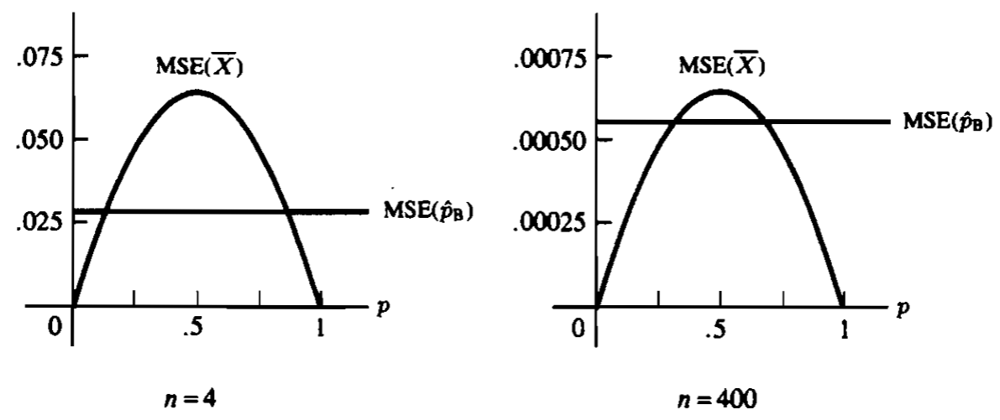

# 7 Point Estimation

## 7.1 Introduction

> [!DEFINITION]
> A **point estimator** is any function $W(X_1,\ \cdots,\ X_n)$ of a sample, i.e., *any statistic is a point estimator.*

## 7.2 Methods of Finding Estimators

### 7.2.1 Method of Moments

Let $X_1,\ \cdots,\ X_n$ be a population with pdf or pmf $f(x \mid \theta_1,\ \cdots,\ \theta_k)$. *Method of moments estimators* are found by equating the first $k$ sample moments to the corresponding $k$ population moments, and solving the resulting system of simultaneous equations.

> [!EXAMPLE|label:Normal method of moments]
> Suppose $X_1,\ \cdots,\ X_n$ are i.i.d. $N(\mu,\ \sigma^{2})$. The system to solve is 
>
> $$\begin{aligned} \overline{X} := \frac{1}{n}\sum_{i=1}^{n} X_{i} &= \mu \\ \frac{1}{n}\sum_{i=1}^{n}X_{i}^{2} &= \mu^{2} + \sigma^{2}. \end{aligned}$$
>
> Solve it and we get the method of moments estimators: 
>
> $$\begin{aligned} \widehat{\mu} &= \overline{X} \\ \widehat{\sigma}^{2} &= \frac{1}{n}\sum_{i=1}^{n} (X_{i} - \overline{X})^{2}. \end{aligned}$$

### 7.2.2 Maximum Likelihood Estimators

> [!DEFINITION]
> For each sample point $\bm{x}$, let $\widehat{\theta}(\bm{x})$ be a parameter value at which $L(\theta \mid \bm{x})$ attains its maximum as a function of $\theta$, with $\bm{x}$ held fixed. A **maximum likelihood estimator (MLE)** of the parameter $\theta$ based on a sample $\bm{X}$ is $\widehat{\theta}(\bm{X})$.
>
> Sometimes maximizing the log-likelihood function $\ell(\theta \mid \bm{x}) := \log L(\theta \mid \bm{x})$ is much more easier.

> [!EXAMPLE|label:Normal MLE]
> Let $X_1,\ \cdots,\ X_n$ be i.i.d. $N(\theta,\ 1)$. The likelihood function is 
>
> $$\begin{aligned} L(\theta \mid \bm{x}) &= \prod_{i=1}^{n} (2 \pi)^{-1/2} \exp\left[\frac{(x_i - \theta)^{2}}{2} \right] \\ &= (2 \pi)^{-n/2} \exp\left[-\frac{1}{2}\sum_{i=1}^{n} (x_i - \theta)^{2} \right].  \end{aligned}$$
>
> The log-likelihood function is 
>
> $$\ell(\theta \mid \bm{x}) = -\frac{n}{2} \log(2 \pi) - \frac{1}{2}\sum_{i=1}^{n} (x_i - \theta)^{2}.$$
>
> Take derivative w.r.t. $\mu$ and set it to zero, we have 
>
> $$\begin{aligned} \frac{\mathrm{d} \ell(\theta \mid \bm{x})}{\mathrm{d} \theta} &= \sum_{i=1}^{n} (x_i - \theta) = 0, \end{aligned}$$
> 
> which means $\widehat{\theta} = \frac{1}{n}\sum_{i=1}^{n} X_i = \overline{X}$ is a candidate for MLE. To verify it, we can check the second derivative: 
>
> $$\begin{aligned} \frac{\mathrm{d}^{2} \ell(\theta \mid \bm{x})}{\mathrm{d} \theta^{2}} &= -n < 0.\end{aligned}$$
>
> Therefore, the MLE estimator of $\theta$ is $\widehat{\theta} = \overline{X}$.

> [!EXAMPLE|label:Bernoulli MLE]
> Let $X_1,\ \cdots,\ X_n$ be i.i.d. $\text{Bernoulli}(p)$. Then the likelihood function is 
>
> $$L(p \mid \bm{x}) = \prod_{i=1}^{n} p^{x_i} (1 - p)^{1 - x_i} = p^{y} (1 - p)^{n - y},$$
> 
> where $y = \sum_{i=1}^{n} x_i$. The log-likelihood function is 
>
> $$\ell(p \mid \bm{x}) = y \log p + (n - y) \log(1 - p).$$
>
> Take derivative w.r.t. $p$ and set it to zero, we have
>
> $$\begin{aligned} \frac{\mathrm{d} \ell(p \mid \bm{x})}{\mathrm{d} p} &= \frac{y}{p} - \frac{n - y}{1 - p} = 0, \end{aligned}$$
>
> which means $\widehat{p} = \frac{1}{n} \sum_{i=1}^{n} X_{i}$ is a candidate for MLE. We can easily see that second derivative is positive, which means $\widehat{p}$ is the MLE estimator of $p$.

> [!THEOREM|label:Invariance property of MLEs]
> If $\widehat{\theta}$ is the MLE of $\theta$, then for any function $\tau(\theta)$, the MLE of $\tau(\theta)$ is $\tau(\widehat{\theta})$.

### 7.2.3 Bayes Estimators

In the classical approach the parameter, $\theta$, is thought to be an unknown constant, whereas in the Bayesian approach $\theta$ is considered to be a random variable that has a distribution. Before the data are observed, we say that $\theta$ has a *prior distribution* denoted by $\pi(\theta)$. Denote the *sampling distribution* (likelihood) by $f(\bm{x} \mid \theta)$, then the *posterior distribution* after observing $\bm{x}$ can be written from Bayes’ theorem as

$$
\pi(\theta \mid \bm{x}) = \frac{f(\bm{x} \mid \theta) \pi(\theta)}{m(\bm{x})},
$$

where $m(\bm{x}) = \int f(\bm{x} \mid \theta) \pi(\theta) ~ \mathrm{d} \theta$ is the marginal distribution of $\bm{X}$.

> [!EXAMPLE|label:Binomial Bayes estimation]
> Let $X_1,\ \cdots,\ X_n$ be i.i.d. $\text{Bernoulli}(p)$. Then $Y = \sum_{i=1}^{n} X_{i}$ is $\text{Binomial}(n,\ p)$. We assume the prior distribution on $p$ is $\text{Beta}(\alpha,\ \beta)$. The joint distribution of $Y$ and $p$ is 
>
> $$\begin{aligned} f(y,\ p) &= \left[\binom{n}{y} p^{y} (1 - p)^{n - y} \right] \left[\frac{\Gamma(\alpha + \beta)}{\Gamma(\alpha) \Gamma(\beta)} p^{\alpha-1} (1 - p)^{\beta-1} \right] \\ &= \binom{n}{y} \frac{\Gamma(\alpha + \beta)}{\Gamma(\alpha) \Gamma(\beta)} p^{y + \alpha - 1} (1 - p)^{n - y + \beta - 1}. \end{aligned}$$
>
> The marginal pdf of $Y$ is 
>
> $$\begin{aligned} f(y) &= \int_{0}^{1} f(y,\ p) ~\mathrm{d}p \\ &= \binom{n}{y} \frac{\Gamma(\alpha + \beta)}{\Gamma(\alpha) \Gamma(\beta)} \int_{0}^{1} p^{y + \alpha - 1} (1 - p)^{n - y + \beta - 1} ~\mathrm{d}p \\ &= \binom{n}{y} \frac{\Gamma(\alpha + \beta)}{\Gamma(\alpha) \Gamma(\beta)} \frac{\Gamma(y + \alpha) \Gamma(n - y + \beta)}{\Gamma(n + \alpha + \beta)}, \end{aligned}$$
>
> a distribution known as the *Beta-Binomial distribution*. Then, the posterior distribution of $p$ is 
>
> $$f(p \mid y) = \frac{f(y,\ p)}{f(y)} = \frac{\Gamma(n + \alpha + \beta)}{\Gamma(y + \alpha) \Gamma(n - y + \beta)} p^{y + \alpha - 1} (1 - p)^{n - y + \beta - 1},$$
>
> which is just $\text{Beta}(y + \alpha,\ n - y + \beta)$. A natural estimate for $p$ is the mean of the posterior distribution, which would give us as the Bayes estimator of $p$, 
>
> $$\widehat{p}_{\text{B}} = \frac{Y + \alpha}{n + \alpha + \beta}.$$

> [!NOTE]
> Actually, using the *posterior mean* to estimate a parameter $\theta$ is under an assumption that the *Bayes risk* is of the form $\E_{\theta}(\widehat{\theta} - \theta)^{2}$, which is just the *mean square error (MSE)*. In other words, when we choose MSE as the risk function, the Bayes estimator is the *posterior mean*.
> 
> There are also other risk functions. If we choose mean absolute error (MAE) as the risk function, the Bayes estimator is the *posterior median* (we can also modify the MAE to be piecewise to let the Bayes estimator be other quantiles); if we let the risk function be zero when small mistakes are made, i.e., $\left\vert \theta - \widehat{\theta} \right\vert < K$ for some constant $K > 0$, and let the risk function be another constant $L > 0$ when large mistakes are made, i.e., $\left\vert \theta - \widehat{\theta} \right\vert \geq K$, then the Bayes estimator is the *posterior mode*.

We can see from the example above that, the posterior distribution is of the same form as the prior distribution, which makes things easier by obtaining a closed-form expression for the estimator. In general, for any sampling distribution, there is a natural family of prior distributions, called the *conjugate family*.

> [!DEFINITION]
> Let $\mathcal{F}$ denote the class of pdfs or pmfs $f(x \mid \theta)$ (indexed by $\theta$). A class $\Pi$ of prior distributions is a **conjugate family** for $\mathcal{F}$ if the posterior distribution is in the class $\Pi$, $\forall f \in \mathcal{F}$, $\forall$ priors $\pi \in \Pi$, and $\forall x \in \mathcal{X}$.

### Exercises

1. Let $X_1,\ \cdots,\ X_n$ be a random sample from $N(\theta,\ \sigma^{2})$ population, and suppose that the prior distribution on $\theta$ is $N(\mu,\ \tau^{2})$. Here we assume that $\sigma^{2}$, $\mu$, and $\tau^{2}$ are all known.

    (a) Find the joint pdf of $\overline{X} = \frac{1}{n}\sum_{i=1}^{n} X_{i}$ and $\theta$;

    (b) Show that the marginal distribution of $\overline{X}$ is $N(\mu,\ (\sigma^{2}/n) + \tau^{2})$;

    (c) Show that the posterior distribution of $\theta$ is $N((\tau^{2} \overline{x} + (\sigma^{2} / n) \mu) / ((\sigma^{2} / n) + \tau^{2}),\ (\sigma^{2} \tau^{2} / n) / ((\sigma^{2} / n) + \tau^{2}))$ where $\overline{x}$ is the observation mean.

## 7.3 Methods of Evaluating Estimators

### 7.3.1 Mean Square Error

> [!DEFINITION]
> The **mean square error (MSE)** of an estimator $\widehat{\theta}$ of a parameter $\theta$ is the function of $\theta$ defined by $\E_{\theta}[(\widehat{\theta} - \theta)^{2}]$, which can be decomposed as 
> 
> $$\E_{\theta}[(\widehat{\theta} - \theta)^{2}] = \Var_{\theta}(\widehat{\theta}) + (\E_{\theta}[\widehat{\theta}] - \theta)^{2},$$
> 
> where the term $\E_{\theta}[\widehat{\theta}] - \theta$ is called the **bias** of the estimator $\widehat{\theta}$. An estimator whose bias is identically (w.r.t. $\theta$) zero is called **unbiased**.

> [!EXAMPLE|label:Normal MSE]
> Let $X_1,\ \cdots,\ X_n$ be i.i.d. $N(\mu,\ \sigma^{2})$. The statistics $\overline{X}$ and $S^{2}$ are both unbiased estimators since 
>
> $$\E[\overline{X}] = \mu,\quad \E[S^{2}] = \sigma^{2},\quad \forall \mu,\ \sigma^{2}.$$
>
> Then the MSEs of these estimators are given by 
>
> $$\begin{aligned} \E[(\overline{X} - \mu)^{2}] &= \Var(\overline{X}) = \frac{\sigma^{2}}{n}, \\ \E[(S^{2} - \sigma^{2})^{2}] &= \Var(S^{2}) = \frac{2 \sigma^{4}}{n - 1} \end{aligned}$$
>
> since $\overline{X} \sim N(\mu,\ \sigma^{2} / n)$ and $(n - 1) S^{2} / \sigma^{2} \sim \chi_{n - 1}^{2}$ whose variance is $2 (n - 1)$.
>
> An alternative estimator of $\sigma^{2}$ is the MLE estimator $\widehat{\sigma}^{2} = \frac{1}{n}\sum_{i=1}^{n} (X_{i} - \overline{X})^{2} = \frac{n - 1}{n} S^{2}$, which is biased. The MSE of it is given by 
>
> $$\E[(\widehat{\sigma}^{2} - \sigma^{2})^{2}] = \frac{(n - 1)^{2}}{n^{2}} \frac{2 \sigma^{4}}{n - 1} + \left(\frac{n - 1}{n} \sigma^{2} - \sigma^{2} \right)^{2} = \frac{2 n - 1}{n^{2}} \sigma^{4}.$$
>
> Since 
>
> $$\frac{2 n - 1}{n^{2}} - \frac{2}{n - 1} = \frac{(2 n - 1)(n - 1) - 2 n^{2}}{n^{2} (n - 1)} = \frac{-3 n + 1}{n^{2} (n - 1)} < 0,$$
>
> the MSE of the MLE estimator is smaller than the unbiased estimator $S^{2}$. This means we can improve the MSE by trading off variance for bias.

> [!EXAMPLE|label:Binomial MSE]
> Let $X_1,\ \cdots,\ X_n$ be i.i.d. $\text{Bernoulli}(p)$. From the [Bernoulli MLE example](#Bernoulli_MLE) we know that the MLE estimator of $p$ is $\widehat{p} = \frac{1}{n} \sum_{i=1}^{n} X_{i}$, which is also unbiased. Then the MSE of it is 
>
> $$\E_{p}[(\widehat{p} - p)^{2}] = \Var_{p}(\widehat{p}) = \frac{n p (1 - p)}{n^{2}} = \frac{p (1 - p)}{n}.$$
>
> From the [Binomial Bayes estimation example](#Binomial_Bayes_estimation) we know that the Bayes estimator of $p$ is $\widehat{p}_{\text{B}} = \frac{Y + \alpha}{n + \alpha + \beta}$, then the MSE of it is
>
> $$\begin{aligned} \E_{p}[(\widehat{p}_{\text{B}} - p)^{2}] &= \Var_{p}(\widehat{p}_{\text{B}}) + (\E_{p}[\widehat{p}_{\text{B}}] - p)^{2} \\ &= \frac{n p (1 - p)}{(n + \alpha + \beta)^{2}} + \left(\frac{n p + \alpha}{n + \alpha + \beta} - p \right)^{2}. \end{aligned}$$
>
> In the absence of good prior information about $p$, we might try to choose $\alpha$ and $\beta$ to make the MSE of $\widehat{p}_{\text{B}}$ constant (w.r.t. $p$). Thus, we choose $\alpha = \beta = \sqrt{n / 4}$, which yields 
>
> $$\widehat{p}_{\text{B}} = \frac{Y + \sqrt{n / 4}}{n + \sqrt{n}} \quad \text{and} \quad \E_{p}[(\widehat{p}_{\text{B}} - p)^{2}] = \frac{n}{4 (n + \sqrt{n})^{2}}.$$
>
> We show the MSEs of the MLE estimator and the Bayes estimator in the following figure.
>
> 

> 
> 
> 

>
> From the figure on the left we can see that, unless we have a strong belief that $p$ is near $0$ or $1$, the Bayes estimator is the better choice when the sample size $n$ is small; from the figure on the right we can see that, when the sample size is large, the MLE estimator is better unless we have a strong belief that $p$ is close to $\frac{1}{2}$.

### 7.3.2 Best Unbiased Estimators

> [!DEFINITION]
> An estimator $\widehat{\theta}^{*}$ is a **best unbiased estimator** of $\tau(\theta)$ if it is an unbiased estimator and, for any other unbiased estimator $\widehat{\theta}$, we have $\Var_{\theta}(\widehat{\theta}^{*}) \leqslant \Var_{\theta}(\widehat{\theta}),\ \forall \theta$. $\widehat{\theta}^{*}$ is also called a **uniformly minimum variance unbiased estimator (UMVUE)** of $\tau(\theta)$.

> [!THEOREM|label:Cramér-Rao Inequality]
> Let $X_1,\ \cdots,\ X_n$ be a sample with pdf $f(\bm{x} \mid \theta)$, and let $\widehat{\theta}(\bm{X})$ be any estimator satisfying 
>
> $$\frac{\mathrm{d}}{\mathrm{d}\theta}\E_{\theta}[\widehat{\theta}(\bm{X})] = \int_{\mathcal{X}} \frac{\partial }{\partial \theta} [\widehat{\theta}(\bm{x}) f(\bm{x} \mid \theta)] ~\mathrm{d}\bm{x}$$
>
> and 
>
> $$\Var_{\theta}(\widehat{\theta}(\bm{X})) < \infty.$$
>
> Then 
>
> $$\Var_{\theta}(\widehat{\theta}(\bm{X})) \geqslant \frac{\left(\frac{\mathrm{d}}{\mathrm{d}\theta} \E_{\theta}[\widehat{\theta}(\bm{X})] \right)^{2}}{\E_{\theta}\left[\left(\frac{\partial }{\partial \theta} \log f(\bm{X} \mid \theta) \right)^{2} \right]}.$$
>
> If additionally, $X_1,\ \cdots,\ X_n$ are i.i.d. with pdf $f(x \mid \theta)$, then 
>
> $$\Var_{\theta}(\widehat{\theta}(\bm{X})) \geqslant \frac{\left(\frac{\mathrm{d}}{\mathrm{d}\theta} \E_{\theta}[\widehat{\theta}(\bm{X})] \right)^{2}}{n I(\theta)}.$$
>
> where $I(\theta) := \E_{\theta}\left[\left(\frac{\partial }{\partial \theta} \log f(X \mid \theta) \right)^{2} \right] > 0$ is called the *Fisher information*.

Intuitively, if we have more information about $\theta$, then the Fisher information would be larger and the variance bound would be smaller, which means we would be more confident about the estimation.

> [!THEOREM]
> 