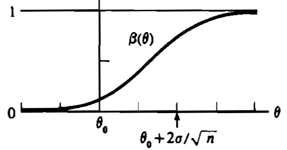
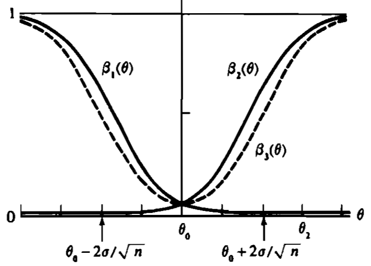

# 8 Hypothesis Testing

## 8.1 Introduction

> [!DEFINITION]
> A **hypothesis** is a statement about a population parameter.

> [!DEFINITION]
> The 2 complementary hypotheses in a hypothesis testing problem are called the **null hypothesis** and the **alternative hypothesis**. They are denoted by $H_0$ and $H_1$, respectively.

> [!DEFINITION]
> A **hypothesis testing procedure** or **hypothesis test** is a rule that specifies: 
> 
> 1. For which sample values the decision is made to accept $H_0$ as true.
> 2. For which sample values $H_0$ is rejected and $H_1$ is accepted as true.
>
> The subset of the sample space for which $H_0$ will be rejected is called the **rejection region** or **critical region**. The complement of the rejection region is called the **acceptance region**.

## 8.2 Methods of Finding Tests

### 8.2.1 Likelihood Ratio Tests

> [!DEFINITION]
> The **likelihood ratio test statistic** for testing $H_0: \theta \in \Theta_0$ versus $H_1: \theta \in \Theta_0^{c}$ is 
>
> $$\lambda(\bm{x}) = \frac{\sup_{\Theta_0} L(\theta \mid \bm{x})}{\sup_{\Theta} L(\theta \mid \bm{x})},$$
>
> where $\Theta$ is the whole parameter space and $L(\theta \mid \bm{x})$ is the likelihood function. A **likelihood ratio test (LRT)** is any test that has a rejection region of the form $\left\{\bm{x}: \lambda(\bm{x}) \leqslant c \right\}$, where $c$ is any number satisfying $0 \leqslant c \leqslant 1$.

> [!EXAMPLE|label:Normal LRT]
> Let $X_1,\ \cdots,\ X_n$ be a random sample from a $N(\theta,\ 1)$ population. Consider testing $H_0: \theta = \theta_0$ versus $H_1: \theta \neq \theta_0$. Here $\theta_0$ is a number fixed by the experimenter prior to the experiment. Since there is only one value of $\theta$ specified by $H_0$, the numerator of $\lambda(\bm{x})$ is $L(\theta_0 \mid \bm{x})$. Since the MLE of $\theta$ is $\overline{X}$, the denominator of $\lambda(\bm{x})$ is $L(\overline{x})$. So the LRT statistic is 
>
> $$\begin{aligned} \lambda(\bm{x}) &= \frac{(2 \pi)^{-n / 2} \exp[-\sum_{i=1}^{n} (x_i - \theta_0)^{2} / 2]}{(2 \pi)^{-n / 2} \exp[-\sum_{i=1}^{n} (x_i - \overline{x})^{2} / 2]} \\ &= \exp\left[\frac{1}{2} \left(\sum_{i=1}^{n}\left(x_{i}-\overline{x}\right)^{2} - \sum_{i=1}^{n}\left(x_{i}-\theta_{0}\right)^{2} \right) \right]. \end{aligned}$$
>
> Note that $\sum_{i=1}^{n} (x_i - \theta_0)^{2} = \sum_{i=1}^{n} (x_i - \overline{x})^{2} + n(\overline{x} - \theta_0)^{2}$, the LRT statistic can be written as 
>
> $$\lambda(\bm{x}) = \exp\left[-\frac{n}{2}(\overline{x} - \theta_0)^{2} \right].$$
>
> An LRT is a test that rejects $H_0$ for small values of $\lambda(\bm{x})$. The rejection region, $\left\{\bm{x}: \lambda(\bm{x}) \leqslant c \right\}$, can be written as 
>
> $$\left\{\bm{x}: \left\vert \overline{x} - \theta_0 \right\vert \geqslant \sqrt{-2 (\log c) / n} \right\}.$$
>
> As $c$ ranges between $0$ and $1$, $\sqrt{-2 (\log c) / n}$ ranges between $0$ and $\infty$. Thus the LRTs are just those tests that reject $H_0: \theta = \theta_0$ if the sample mean differs from the hypothesized value $\theta_0$ by more than a specified amount.

> [!EXAMPLE|label:Exponential LRT]
> Let $X_1,\ \cdots,\ X_n$ be a random sample from an exponential population with pdf 
>
> $$f(x \mid \theta) = \begin{cases} e^{-(x - \theta)},\ &x\geqslant \theta \\ 0,\ &x < \theta, \end{cases}$$
>
> where $-\infty < \theta < \infty$. The likelihood function is 
>
> $$L(\theta \mid \bm{x}) = \begin{cases} e^{-\sum_{i=1}^{n} x_i + n \theta},\ & \theta \leqslant x_{(1)} \\ 0,\ & \theta > x_{(1)},  \end{cases}$$
>
> where $x_{(1)} = \min_{i} x_i$. Consider testing $H_0: \theta \leqslant \theta_0$ versus $H_1: \theta > \theta_0$, where $\theta_0$ is a value specified by the experimenter. Clearly $L(\theta \mid \bm{x})$ is an increasing function of $\theta$ on $-\infty < \theta \leqslant x_{(1)}$. Thus, the denominator of $\lambda(\bm{x})$, the unrestricted maximum of $L(\theta \mid \bm{x})$, is 
>
> $$L(x_{(1)} \mid \bm{x}) = e^{-\sum_{i=1}^{n} x_i + n x_{(1)}}.$$
>
> If $x_{(1)} \leqslant \theta_0$, the numerator of $\lambda(\bm{x})$ is also $L(x_{(1)} \mid \bm{x})$. But since we are maximizing $L(\theta \mid \bm{x})$ over $\theta \leqslant \theta_0$, the numerator of $\lambda(\bm{x})$ is $L(\theta_0 \mid \bm{x})$ if $x_{(1)} > \theta_0$. Therefore, the likelihood ratio test statistic is 
>
> $$\lambda(\bm{x}) = \begin{cases} 1,\ & x_{(1)} \leqslant \theta_0 \\ e^{n(\theta_0 - x_{(1)})},\ & x_{(1)} > \theta_0. \end{cases}$$
>
> Therefore, an LRT, a test that rejects $H_0$ if $\lambda(\bm{x}) \leqslant c$, is a test with rejection region $\left\{\bm{x}: x_{(1)} \geqslant \theta_0 - \frac{\log c}{n} \right\}$. Note that the rejection region depends on the sample *only through the sufficient statistic* $X_{(1)}$.

> [!THEOREM]
> If $T(\bm{X})$ is a *sufficient statistic* for $\theta$ and $\lambda^{*}(t)$ and $\lambda(\bm{x})$ are the *LRT statistics* based on $T$ and $\bm{X}$, respectively, then $\lambda^{*}(T(\bm{x})) = \lambda(\bm{x})$ for every $\bm{x}$ in the sample space.

> [!EXAMPLE|label:LRT and sufficiency]
> From the [Normal LRT](#normal_lrt) example, we can recognize that $\overline{X}$ is a sufficient statistic for $\theta$. We could use the likelihood function associated with $\overline{X} \sim N(\theta,\ \frac{1}{n})$ to more easily get the LRT statistic: 
>
> $$\lambda(\bm{x}) = \lambda^{*}(\overline{x}) = \frac{(2 \pi)^{-n / 2} \exp[-n (\overline{x} - \theta_0)^{2} / 2]}{(2 \pi)^{-n / 2} \exp[-n (\overline{x} - \overline{x})^{2} / 2]} = \exp\left[-\frac{n}{2}(\overline{x} - \theta_0)^{2} \right].$$
>
> Similarly, from the [Exponential LRT](#exponential_lrt) example, we can recognize that $X_{(1)}$ is a sufficient statistic for $\theta$. The likelihood function of it is 
>
> $$L^{*}(\theta \mid x_{(1)}) = \begin{cases} n e^{-n (x_{(1)} - \theta)},\ & \theta \leqslant x_{(1)} \\ 0,\ & \theta > x_{(1)}, \end{cases}$$
>
> which means the LRT statistic is
>
> $$\lambda(\bm{x}) = \lambda^{*}(x_{(1)}) = \begin{cases} 1,\ & x_{(1)} \leqslant \theta_0 \\ e^{n(\theta_0 - x_{(1)})},\ & x_{(1)} > \theta_0. \end{cases}$$

> [!EXAMPLE|label:Normal LRT with unknown variance]
> Suppose $X_1,\ \cdots,\ X_n$ is a random sample from a $N(\mu,\ \sigma^{2})$, and an experimenter is interested only in inferences about $\mu$, such as testing $H_0: \mu \leqslant \mu_0$ versus $H_1: \mu > \mu_0$. Then the parameter $\sigma^{2}$ is a *nuisance parameter*. The LRT statistic is 
>
> $$\begin{aligned} \lambda(\bm{x}) &= \frac{\max_{\left\{\mu,\ \sigma^{2}: \mu \leqslant \mu_0,\ \sigma^{2} \geqslant 0 \right\}} L(\mu,\ \sigma^{2} \mid \bm{x})}{\max_{\left\{\mu,\ \sigma^{2}: -\infty < \mu < \infty,\ \sigma^{2} \geqslant 0 \right\}} L(\mu,\ \sigma^{2} \mid \bm{x})} \\ &= \frac{\max_{\left\{\mu,\ \sigma^{2}: \mu \leqslant \mu_0,\ \sigma^{2} \geqslant 0 \right\}} L(\mu,\ \sigma^{2} \mid \bm{x})}{L(\widehat{\mu},\ \widehat{\sigma}^{2} \mid \bm{x})}, \end{aligned}$$
>
> where $\widehat{\mu}$ and $\widehat{\sigma}^{2}$ are the MLEs of $\mu$ and $\sigma^{2}$. Note that if $\widehat{\mu} \leqslant \mu_0$, then the LRT statistic would be $1$; while if $\widehat{\mu} > \mu_0$, then the restricted maximum is $L(\mu_0,\ \widehat{\sigma}_{0}^{2} \mid \bm{x})$, where $\widehat{\sigma}_{0}^{2} = \sum_{i=1}^{n} (x_i - \mu_0)^{2} / n$. Thus, 
>
> $$\lambda(\bm{x}) = \begin{cases} 1,\ & \widehat{\mu} \leqslant \mu_0 \\ \frac{L(\mu_0,\ \widehat{\sigma}_{0}^{2} \mid \bm{x})}{L(\widehat{\mu},\ \widehat{\sigma}^{2} \mid \bm{x})},\ & \widehat{\mu} > \mu_0. \end{cases}$$
>
> With some algebra, it can be shown that the test based on $\lambda(\bm{x})$ is equivalent to a test based on Student’s $t$ statistic.

### 8.2.2 Bayesian Tests

With a sampling distribution $f(\bm{x} \mid \theta)$, by setting prior distribution $\pi(\theta)$ for parameter $\theta$, we can get the posterior distribution $\pi(\theta \mid \bm{x})$. All inferences about $\theta$ are now based on the posterior distribution.

One way a Bayesian hypothesis tester may choose to use the posterior distribution is to decide to accept $H_0$ as true if $P(\theta \in \Theta_0 \mid \bm{X}) \geqslant P(\theta \in \Theta_0^{c} \mid \bm{X})$ and to reject $H_0$ otherwise. This means the rejection region is $\left\{\bm{x}: P(\theta \in \Theta_0^{c} \mid \bm{x}) > \frac{1}{2} \right\}$. Alternatively, if the Bayesian hypothesis tester wishes to guard against falsely rejecting $H_0$, he may decide to reject $H_0$ only if $P(\theta \in \Theta_0^{c} \mid \bm{X})$ is greater than some large number, $0.99$ for example.

> [!EXAMPLE|label:Normal Bayesian test]
> Let $X_1,\ \cdots,\ X_n$ be i.i.d. $N(\theta,\ \sigma^{2})$ and let the prior distribution on $\theta$ be $N(\mu,\ \tau^{2})$, where $\sigma^{2}$, $\mu$, and $\tau^{2}$ are known. Consider testing $H_0: \theta \leqslant \theta_0$ versus $H_1: \theta > \theta_0$. From [exercises in 7.2](/courses/advanced_statistics/7_point_estimation.md#exercises), the posterior distribution of $\theta$ is a Normal with mean $(n \tau^{2} \overline{x} + \sigma^{2} \mu) / (n \tau^{2} + \sigma^{2})$ and the variance $\sigma^{2} \tau^{2} / (n \tau^{2} + \sigma^{2})$.
>
> Suppose we decide to accept $H_0$ iff $P(\theta \leqslant \theta_0 \mid \bm{X}) \geqslant \frac{1}{2}$. Since the posterior $\pi(\theta \mid \bm{x})$ is symmetric, this is true iff the mean of $\pi(\theta \mid \bm{x})$ is less than or equal to $\theta_0$. Therefore, $H_0$ will be accepted as true iff
>
> $$\overline{X} \leqslant \theta_0 + \frac{\sigma^{2} (\theta_0 - \mu)}{n \tau^{2}}$$
>
> and $H_1$ will be accepted as true otherwise. In particular, if $\mu = \theta_0$ so that prior to experimentation probability $\frac{1}{2}$ is assigned to both $H_0$ and $H_1$, then $H_0$ will be accepted as true iff $\overline{x} \leqslant \theta_0$.

## 8.3 Methods of Evaluating Tests

### 8.3.1 Error Probabilities and the Power Function

> [!DEFINITION]
> A hypothesis test of $H_0: \theta \in \Theta_0$ versus $H_1: \theta \in \Theta_0^{c}$ might make one of two types of errors, **Type I error** or **Type II error**. If $\theta \in \Theta_0$ but the hypothesis test incorrectly decides to reject $H_0$, then the test has made a **Type I error**. If, on the other hand, $\theta \in \Theta_0^{c}$ but the hypothesis test decides to accept $H_0$, a **Type II error** has been made.

Suppose $R$ denotes the rejection region for a test. Then for $\theta \in \Theta_0$, the test will make a Type I error if $\bm{x} \in R$, so the probability of a Type I error is $P_{\theta}(\bm{X} \in R)$. For $\theta \in \Theta_0^{c}$, the test will make a Type II error if $\bm{x} \notin R$, so the probability of a Type II error is $1 - P_{\theta}(\bm{X} \in R)$. We realize that the function of $\theta$, $P_{\theta}(\bm{X} \in R)$, contains all the information about the test with rejection region $R$. Thus, we have the following definition.

> [!DEFINITION]
> The **power function** of a hypothesis test with rejection region $R$ is the function of $\theta$ defined by $\beta(\theta) = P_{\theta}(\bm{X} \in R)$.

> [!NOTE]
> We should keep in mind that the power function is a function of $\theta$. When $\theta \in \Theta_0$, the value of power function is just the probability that the test will make a Type I error; when $\theta \in \Theta_0^{c}$, $1 - \beta(\theta)$ is the probability that the test will make a Type II error.

> [!EXAMPLE|label:Normal power function]
> Let $X_1,\ \cdots,\ X_n$ be a random sample from a $N(\theta,\ \sigma^{2})$ population with known $\sigma^{2}$. Suppose we are testing $H_0: \theta \leqslant \theta_0$ versus $H_1: \theta > \theta_0$. The LRT statistic is given by
>
> $$\lambda(\bm{x}) = \begin{cases} 1,\ & \overline{x} \leqslant \theta_0 \\ \exp\left[-\frac{n}{2 \sigma^{2}}(\overline{x} - \theta_0)^{2} \right],\ & \overline{x} > \theta_0, \end{cases}$$
>
> which means the rejection region is $\left\{\bm{x}: \overline{x} - \theta_0 \geqslant \sqrt{-\frac{2 \sigma^{2}}{n}\log c} \right\}$. For convenience we can also rewrite the rejection region as 
> 
> $$\left\{\bm{x}: \frac{\sqrt{n}(\overline{x} - \theta_0)}{\sigma} \geqslant k \right\}$$
> 
> where $k = \sqrt{-2 \log c}$ can be any positive number. Thus, the power function is 
>
> $$\begin{aligned} \beta(\theta) &= P_{\theta}\left(\frac{\sqrt{n}(\overline{X} - \theta_0)}{\sigma} \geqslant k \right) \\ &= P_{\theta}\left(\frac{\sqrt{n}(\overline{X} - \theta)}{\sigma} \geqslant k + \frac{\sqrt{n}(\theta_0 - \theta)}{\sigma} \right) \\ &= P_{\theta}\left(Z \geqslant k + \frac{\sqrt{n}(\theta_0 - \theta)}{\sigma} \right), \end{aligned}$$
>
> where $Z$ is a standard Normal r.v.. As $\theta$ increases from $-\infty$ to $\infty$, it is easy to see that the power function increases from $0$ to $1$. Therefore, it follows that $\beta(\theta)$ is an increasing function of $\theta$, with 
>
> $$\lim\limits_{\theta \to -\infty} \beta(\theta) = 0,\quad \lim\limits_{\theta \to \infty} \beta(\theta) = 1,\quad \text{and} \quad \beta(\theta_0) = \alpha \text{ if } P(Z \geqslant k) = \alpha.$$
>
> The following figure shows this power function.
>
> 

> 
>  
> 

>
> Note that we hope the value of power function is close to $0$ when $\theta \leqslant \theta_0$, and is near $1$ when $\theta > \theta_0$. Suppose the experimenter wishes to have a maximum Type I Error probability of $0.1$. Suppose, in addition, the experimenter wishes to have a maximum Type II Error probability of $0.2$ if $\theta \geqslant \theta_0 + \sigma$. Now we need to choose $k$ and $n$ to achieve these goals. Note that the requirements will met if
>
> $$\beta(\theta_0) = 0.1 \quad \text{and} \quad \beta(\theta_0 + \sigma) = 0.8.$$
>
> By searching the table of the standard Normal distribution, we can find that $k = 1.28$ meets the first requirement. Now we wish to choose $n$ so that $\beta(\theta_0 + \sigma) = P(Z \geqslant 1.28 - \sqrt{n}) = 0.8$. Since $P(Z > -0.84) = 0.8$, we can solve to get $n \approx 4.49$. Since $n$ must be an integer, we choose $n = 5$.

For a fixed sample size, it is usually impossible to make both types of error probabilities arbitrarily small. In searching for a good test, it is common to restrict consideration to tests that control the Type I Error probability at a specified level. Within this class of tests we then search for tests that have Type II Error probability that is as small as possible. The following 2 terms are useful when discussing tests that control Type I Error probabilities.

> [!DEFINITION]
> For $0 \leqslant \alpha \leqslant 1$, a test with power function $\beta(\theta)$ is a **size $\alpha$ test** if $\sup_{\theta \in \Theta_0} \beta(\theta) = \alpha$.

> [!TIP]
> This means that *the test will make a Type I Error with probability no greater than $\alpha$ for any value of $\theta$ in the null hypothesis.*

> [!DEFINITION]
> For $0 \leqslant \alpha \leqslant 1$, a test with power function $\beta(\theta)$ is a **level $\alpha$ test** if $\sup_{\theta \in \Theta_0} \beta(\theta) \leqslant \alpha$.

> [!TIP]
> The level $\alpha$ test is similar to the size $\alpha$ test, we can say *every size $\alpha$ test is a level $\alpha$ test, but a level $\alpha$ test can have its own size rather than $\alpha$.*

### 8.3.2 Most Powerful Tests

> [!DEFINITION]
> Let $\mathcal{C}$ be a class of tests (controling size or level) for testing $H_0: \theta \in \Theta_0$ versus $H_1: \theta \in \Theta_0^{c}$. A test in $\mathcal{C}$ with power function $\beta(\theta)$, is a **uniformly most powerful (UMP)** class $\mathcal{C}$ test if $\beta(\theta) \geqslant \beta'(\theta),\ \forall \theta \in \Theta_0^{c}$ and $\forall \beta'(\theta)$ that is a power function of a test in class $\mathcal{C}$.

> [!TIP]
> The definition means the most powerful test is the one that has the *smallest Type II Error probability* for every value of $\theta$ in the alternative hypothesis *when controling the Type I Error probability at a specified level.*

> [!THEOREM|label:Neyman-Pearson Lemma]
> Considering testing $H_0: \theta = \theta_0$ versus $H_1: \theta = \theta_1$, where the pdf or pmf corresponding to $\theta_i$ is $f(\bm{x} \mid \theta_i),\ i = 0,\ 1$, using a test with rejection region $R$ that satisfies 
>
> $$\begin{cases} \bm{x} \in R,\ &\text{if } f(\bm{x} \mid \theta_1) > k f(\bm{x} \mid \theta_0) \\ \bm{x} \notin R,\ &\text{if } f(\bm{x} \mid \theta_1) < k f(\bm{x} \mid \theta_0), \end{cases} \tag{1}$$
> 
> for some $k \geqslant 0$, and 
>
> $$\alpha = P_{\theta_0}(\bm{X} \in R). \tag{2}$$
>
> Then 
>
> 1. (*Sufficiency*) Any test that satisfy $(1)$ and $(2)$ is a *UMP level $\alpha$ test*.
> 2. (*Necessity*) If $\exists $ a test satisfies $(1)$ and $(2)$ with $k > 0$, then 
>     - $\forall $ *UMP level $\alpha$ test* is a *size $\alpha$ test*;
>     - $\forall $ *UMP level $\alpha$ test* satisfies $(1)$ except perhaps on a set $\mathcal{A}$ satisfying $P_{\theta_0}(\bm{X} \in \mathcal{A}) = P_{\theta_1}(\bm{X} \in \mathcal{A}) = 0$.

Proof:

We prove only for continuous cases. To ease notation, we define a *test function*, $\phi(\bm{x}) := I_{R}(\bm{x})$, which is an indicator function of the rejection region $R$. Let $\phi(\bm{x})$ be the test function satisfying $(1)$ and $(2)$. Let $\phi'(\bm{x})$ be the test function of any other level $\alpha$ test, nad let $\beta(\theta)$ and $\beta'(\theta)$ be the power functions corresponding to the tests $\phi$ and $\phi'$, respectively. Because $0 \leqslant \phi'(\bm{x}) \leqslant 1$, $(1)$ implies that $(\phi(\bm{x}) - \phi'(\bm{x})) (f(\bm{x} \mid \theta_1) - k f(\bm{x} \mid \theta_0)) \geqslant 0,\ \forall \bm{x}$. Thus we have 

$$
\begin{aligned}
    0 &\leqslant \int (\phi(\bm{x}) - \phi'(\bm{x})) (f(\bm{x} \mid \theta_1) - k f(\bm{x} \mid \theta_0)) ~\mathrm{d}\bm{x} \\
    &= \int_{R} f(\bm{x} \mid \theta_1) ~\mathrm{d}\bm{x} - k \int_{R} f(\bm{x} \mid \theta_0) ~\mathrm{d}\bm{x} - \int_{R'} f(\bm{x} \mid \theta_1) ~\mathrm{d}\bm{x} \\ &\qquad + k \int_{R'} f(\bm{x} \mid \theta_0) ~\mathrm{d}\bm{x} \\
    &= \beta(\theta_1) - \beta'(\theta_1) - k (\beta(\theta_0) - \beta'(\theta_0)),
\end{aligned}
$$

where $R'$ is the rejection region of test $\phi'$. Furthermore, since $\phi'$ is a level $\alpha$ test and $\phi$ is a size $\alpha$ test, $\beta(\theta_0) - \beta'(\theta_0) \geqslant 0$ and we have 

$$
\beta(\theta_1) - \beta'(\theta_1) \geqslant 0,
$$

which means $\phi$ has greater power (lower Type II Error) and the *sufficiency* statement is proved.

To prove the *necessity* statement, we now let $\phi'$ be the test function for any UMP level $\alpha$ test. From the *sufficiency* statement we know that $\phi$ is also a UMP level $\alpha$ test, thus $\beta(\theta_1) = \beta'(\theta_1)$. This will lead to $\beta(\theta_0) \leqslant \beta'(\theta_0)$ for $k > 0$ (from the inequality of integral above). Since $\phi$ is a size $\alpha$ test, we have $\beta'(\theta_0) \geqslant \alpha$. By definition we know that 

$$
\sup_{\theta \in \Theta_0} \beta'(\theta_0) \leqslant \alpha,
$$

which means $\phi'$ is also a size $\alpha$ test except perhaps on a set $\mathcal{A}$ satisfying $P_{\theta_0}(\bm{X} \in \mathcal{A}) = P_{\theta_1}(\bm{X} \in \mathcal{A}) = 0$.

 

> [!THEOREM|label:Neyman-Pearson Lemma（Likelihood statement）]
> For $\alpha \in (0,\ 1)$, $k \geqslant 0$, assume 
>
> $$R_0 = \left\{\bm{x}: L(\bm{x} \mid \theta_1) > k L(\bm{x} \mid \theta_0) \right\}$$
>
> satisfies
>
> $$\int_{R_0} L(\bm{x} \mid \theta_0) ~\mathrm{d}\bm{x} = \alpha,$$
>
> then $\forall R \subset \mathbb{R}^{n}$, we have $\beta_{R_0}(\theta_1) \geqslant \beta_{R}(\theta_1)$ if $\beta_{R}(\theta_0) \leqslant \alpha$. In other words, $R_0$ has the *lowest probability of making Type II Error in all level $\alpha$ tests*.

> [!TIP]
> The above theorem is also true for any *sufficient statistic* $T(\bm{X})$ for $\theta$.

> [!EXAMPLE|label:UMP Binomial test]
> Let $X \sim \text{Binomial}(2,\ \theta)$. We want to test $H_0: \theta = \frac{1}{2}$ versus $H_1: \theta = \frac{3}{4}$. Calculating the ratios of the pmfs gives
>
> $$\frac{f(0 \mid \theta=\frac{3}{4})}{f(0 \mid \theta=\frac{1}{2})} = \frac{\left(\frac{1}{4} \right)^{2}}{\left(\frac{1}{2} \right)^{2}} = \frac{1}{4},$$
>
> $$\frac{f(1 \mid \theta=\frac{3}{4})}{f(1 \mid \theta=\frac{1}{2})} = \frac{2 \frac{1}{4} \frac{3}{4}}{2 \frac{1}{2} \frac{1}{2}} = \frac{3}{4},$$
>
> $$\frac{f(2 \mid \theta=\frac{3}{4})}{f(2 \mid \theta=\frac{1}{2})} = \frac{\left(\frac{3}{4} \right)^{2}}{\left(\frac{1}{2} \right)^{2}} = \frac{9}{4}.$$
>
> If we choose $\frac{3}{4} < k < \frac{9}{4}$, the Neyman-Pearson Lemma says that the test that rejects $H_0$ if $X = 2$ is the UMP level $\alpha = P(X = 2 \mid \theta=\frac{1}{2}) = \frac{1}{4}$ test. If we choose $\frac{1}{4} < k < \frac{3}{4}$, the Neyman-Pearson Lemma says that the test that rejects $H_0$ if $X = 1$ or $2$ is the UMP level $\alpha = P(X = 1 \text{ or } 2 \mid \theta=\frac{1}{2}) = \frac{3}{4}$ test. Choosing $k < \frac{1}{4}$ or $k > \frac{9}{4}$ yields the UMP level $\alpha=1$ or $\alpha=0$ test.
>
> Note that if $k = \frac{3}{4}$, then Neyman-Pearson Lemma says we must reject $H_0$ for the sample point $x=2$ and accept $H_0$ for $x=0$ but leaves our action for $x=1$ undetermined. But once we have determined the action (as reject $H_0$ or accept $H_0$), we can know the test is a UMP level $\alpha = \frac{3}{4}$ or $\frac{1}{4}$ test.

> [!EXAMPLE|label:UMP Normal test]
> Let $X_1,\ \cdots,\ X_n$ be a random sample from a $N(\theta,\ \sigma^{2})$ population with known $\sigma^{2}$. Consider testing $H_0: \theta = \theta_0$ versus $H_1: \theta = \theta_1$, where $\theta_0 > \theta_1$. Note that $\overline{X}$ is a sufficient statistic for $\theta$, by Neyman-Pearson Lemma, the test with rejection region 
>
> $$
\begin{aligned}
    R &= \left\{\bm{x}: \exp\left[-\frac{n}{2\sigma^{2}} (\overline{x} - \theta_1)^{2} \right] > k \exp\left[-\frac{n}{2\sigma^{2}} (\overline{x} - \theta_0)^{2} \right]\right\} \\
    &= \left\{\bm{x}: (\overline{x} - \theta_1)^{2} < -\frac{2 \sigma^{2}}{n} \log k + (\overline{x} - \theta_0)^{2} \right\} \\
    &= \left\{\bm{x}: \overline{x} > \frac{\sigma^{2}}{n (\theta_0 - \theta_1)} \log k - \frac{\theta_0 + \theta_1}{2} \right\} \\
\end{aligned}
$$
>
> is a UMP size $\alpha = P_{\theta_0}(\overline{X} \in R)$ test. Suppose $\theta_0 = 0$, $\theta_1 = -2$, $\sigma^{2} = 1$, and we try to find a UMP test with size $\alpha = 0.05$. This is equivalent to solve 
>
> $$\int_{\frac{1}{2 n} \log k + 1}^{\infty} \frac{1}{\sqrt{2 \pi / n}} \exp\left(-\frac{\overline{x}^{2}}{2 / n} \right)  ~\mathrm{d}\overline{x} = 0.05,$$
>
> i.e., 
> 
> $$1 - \Phi\left[\sqrt{n} \left(\frac{1}{2n} \log k + 1 \right)  \right] = 0.05 \implies \sqrt{n} \left(\frac{1}{2n} \log k + 1 \right) = 1.65,$$
> 
> where $\Phi$ is the cdf of standard Normal distribution. Therefore, a test with rejection region $\left\{\bm{x}: \overline{x} > \frac{1.65}{\sqrt{n}} \right\}$ is a UMP test with size $\alpha = 0.05$.

Up to now, we only consider the hypotheses of the form $H_0: \theta = \theta_0$ versus $H_1: \theta = \theta_1$. However, in most realistic problems, the hypotheses of interest specify more than one value of $\theta$. For example, we might wish to test $H_0: \theta \leqslant \theta_0$ versus $H_1: \theta > \theta_0$ or the reverse, which are called *one-sided hypotheses*. Hypotheses that assert that a parameter is either large or small, for example, $H: \theta \neq \theta_0$, are called *two-sided hypotheses*. Now we want to extend the Neyman-Pearson Lemma to these cases by finding some useful properties.

> [!DEFINITION]
> A family of pdfs or pmfs $\left\{g(t \mid \theta): \theta \in \Theta \right\}$ for a univariate r.v. $T$ with real-valued parameter $\theta$ has a **monotone likelihood ratio (MLR)** if, $\forall \theta_2 > \theta_1$, $\frac{g(t \mid \theta_2)}{g(t \mid \theta_1)}$ is a *monotone (nonincreasing or nondecreasing)* function of $t$ on $\left\{t: g(t \mid \theta_1) > 0 \text{ or } g(t \mid \theta_2) > 0 \right\}$. Note that $\frac{c}{0} := \infty$ if $c > 0$.

> [!TIP]
> Any regular *exponential family* with $g(t \mid \theta) = h(t) c(\theta) e^{w(\theta) t}$ has an *MLR* if $w(\theta)$ is a *nondecreasing* function. (See [Exercises](#exercises).)

> [!THEOREM|label:Karlin-Rubin Theorem]
> Consider testing $H_0: \theta \leqslant \theta_0$ versus $H_1: \theta > \theta_0$. Suppose that $T$ is a *sufficient statistic* for $\theta$ and the family of pdfs or pmfs $\left\{g(t \mid \theta): \theta\in \Theta \right\}$ of $T$ has an *MLR*. Then $\forall t_0$, the test that rejects $H_0$ *iff* $T > t_0$ is a *UMP level $\alpha$ test*, where $\alpha = P_{\theta_0}(T > t_0)$.

> [!TIP]
> For testing $H_0: \theta \geqslant \theta_0$ versus $H_1: \theta < \theta_0$, it can be shown that under the conditions above, the test that rejects $H_0$ *iff* $T < t_0$ is a *UMP level $\alpha$ test*, where $\alpha = P_{\theta_0}(T > t_0)$.

> [!EXAMPLE|label:UMP Normal test（continued）]
> Let $X_1,\ \cdots,\ X_n$ be a random sample from a $N(\theta,\ \sigma^{2})$ population with known $\sigma^{2}$. Consider testing $H_0: \theta \geqslant \theta_0$ versus $H_1: \theta < \theta_0$ using the test that rejects $H_0$ if 
>
> $$\overline{X} < \theta_0 - \frac{\sigma z_{\alpha}}{\sqrt{n}}.$$
> 
> As $\overline{X}$ is sufficient and its distribution has an MLR, by Karlin-Rubin Theorem, this test is a UMP level $\alpha$ test.
>
> As the power function of this test, 
>
> $$\beta(\theta) = P_{\theta}\left(\overline{X} < \theta_0 - \frac{\sigma z_{\alpha}}{\sqrt{n}} \right),$$
>
> is a decreasing function of $\theta$ (imagine the pdf of $\overline{X}$ changes with $\theta$), the value of $\alpha$ is given by 
>
> $$\sup_{\theta \geqslant \theta_0} \beta(\theta) = \beta(\theta_0) = \alpha.$$

> [!EXAMPLE|label:Nonexistence of UMP test]
> Let $X_1,\ \cdots,\ X_n$ be i.i.d. $N(\theta,\ \sigma^{2})$, $\sigma^{2}$ known. Consider testing $H_0: \theta = \theta_0$ versus $H_1: \theta \neq \theta_0$. For a specified value of $\alpha$, a level $\alpha$ test in this problem is any test that satisfies 
>
> $$P_{\theta_0}(\text{reject } H_0) \leqslant \alpha.$$
>
> Consider an alternative parameter point $\theta_1 < \theta_0$. The example above tells us that the test that rejects $H_0$ if $\overline{X} < \theta_0 - \frac{\sigma z_{\alpha}}{\sqrt{n}}$ has the highest possible power at $\theta_1$. Call this Test 1. Furthermore, by the necessity statement of Neyman-Pearson Lemma, any other level $\alpha$ test that has as high a power as Test 1 at $\theta_1$ must have the same rejection region as Test 1 except possibly for a zero-measure set. Thus, if a UMP level $\alpha$ test exists for this problem, it must be Test 1 because no other test has as high a power as Test 1 at $\theta_1$.
>
> Now consider Test 2, which rejects $H_0$ if $\overline{X} > \theta_0 + \frac{\sigma z_{\alpha}}{\sqrt{n}}$. Test 2 is also a level $\alpha$ test. Let $\beta_i(\theta)$ denote the power function of Test $i,\ i = 1,\ 2$. For any $\theta_2 > \theta_0$, we have 
>
> $$\begin{aligned} \beta_2(\theta_2) &= P_{\theta_2}\left(\overline{X} > \theta_0 + \frac{\sigma z_{\alpha}}{\sqrt{n}} \right) \\ &= P_{\theta_2}\left(\frac{\overline{X} - \theta_2}{\sigma / \sqrt{n}} > z_{\alpha} + \frac{\theta_0 - \theta_2}{\sigma / \sqrt{n}} \right) \\ &> P(Z > z_{\alpha}) \\ &= P(Z < -z_{\alpha}) \\ &> P_{\theta_1}\left(\frac{\overline{X} - \theta_1}{\sigma / \sqrt{n}} < -z_{\alpha} + \frac{\theta_0 - \theta_1}{\sigma / \sqrt{n}} \right) \\ &= P_{\theta_1}\left(\overline{X} < \theta_0 - \frac{\sigma z_{\alpha}}{\sqrt{n}} \right) \\ &= \beta_1(\theta_2), \end{aligned}$$
>
> which means Test 1 is not a UMP level $\alpha$ test because Test 2 has a higher power than Test 1 at $\theta_2$. Thus, there is no UMP level $\alpha$ test for this problem.

Other than $\alpha$ levels and power, there are other features of a test that might also be of concern. For example, we would like a test to be more likely to reject $H_0$ if $\theta \in \Theta_0^{c}$ than if $\theta \in \Theta_0$. The following definition formalizes this idea.

> [!DEFINITION]
> A test with power function $\beta(\theta)$ is **unbiased** if $\beta(\theta') \geqslant \beta(\theta''),\ \forall \theta' \in \Theta_0^{c}$ and $\forall \theta'' \in \Theta_0$.

> [!EXAMPLE|label:Unbiased test]
> When no UMP level $\alpha$ test exists within the class of all tests, we might try to find a UMP level $\alpha$ test within the class of unbiased tests. The power function, $\beta_3(\theta)$, of Test 3, which rejects $H_0: \theta = \theta_0$ in favor of $H_1: \theta \neq \theta_0$ iff 
>
> $$\overline{X} > \theta_0 + \frac{\sigma z_{\alpha/2}}{\sqrt{n}} \text{ or } \overline{X} < \theta_0 - \frac{\sigma z_{\alpha/2}}{\sqrt{n}},$$
>
> as well as $\beta_1(\theta)$ and $\beta_2(\theta)$ from the example above are shown in the following figure.
>
> 

> 
> 
> 

>
> Test 3 is actually a *UMP unbiased level $\alpha$ test*, i.e., it is UMP in the class of unbiased tests. Note that although Test 1 and Test 2 have slightly higher powers than Test 3 for some parameter points, Test 3 has much higher power than Test 1 and Test 2 at other parameter points.

### 8.3.4 p-Values

After a hypothesis test is done, the conclusions must be reported in some statistically meaningful way. One method of reporting the results of a hypothesis test is to report the size, $\alpha$, of the test used and the decision to reject $H_0$ or accept $H_0$. If $\alpha$ is small, the decision to reject $H_0$ is fairly convincing. Another way of reporting the results of a hypothesis test is to report the *p-value* of the test, which is defined as follows.

> [!DEFINITION]
> A **p-value** $p(\bm{X})$ is a test statistic satisfying $0 \leqslant p(\bm{x}) \leqslant 1$ for every sample point $\bm{x}$. Small values of $p(\bm{X})$ give evidence that $H_1$ is true. A p-value is **valid** if, $\forall \theta \in \Theta_0$ and $\forall 0 \leqslant \alpha \leqslant 1$, 
>
> $$P_{\theta}(p(\bm{X}) \leqslant \alpha) \leqslant \alpha.$$

If $p(\bm{X})$ is a valid p-value, it is easy to construct a level $\alpha$ test based on $p(\bm{X})$. The test that rejects $H_0$ *iff* $p(\bm{X}) \leqslant \alpha$ is a level $\alpha$ test according to the definition. An advantage to reporting a test result via a p-value is that each reader can choose the $\alpha$ he or she considers appropriate and then can compare the reported $p(\bm{x})$ to $\alpha$ and know whether these data lead to acceptance or rejection of $H_0$. Furthermore, the smaller the p-value, the stronger the evidence for rejecting $H_0$.

> [!EXAMPLE|label:Two-sided Normal p value]
> Let $X_1,\ \cdots,\ X_n$ be a random sample from a $N(\mu,\ \sigma^{2})$ population. Consider testing $H_0: \mu = \mu_0$ versus $H_1: \mu \neq \mu_0$. The LRT rejects $H_0$ for large values of $\frac{\left\vert \overline{X} - \mu_0 \right\vert}{S / \sqrt{n}}$. If $\mu = \mu_0$, regardless of the value of $\sigma^{2}$, $\frac{\overline{X} - \mu_0}{S / \sqrt{n}}$ has a Student’s $t$ distribution with $n - 1$ degrees of freedom. Since the Student’s $t$ distribution is symmetric, the p-value of this two-sided test is 
>
> $$p(\bm{x}) = 2 P\left(T_{n-1} \geqslant \frac{\left\vert \overline{x} - \mu_0 \right\vert}{s / \sqrt{n}} \right),$$
>
> where $T_{n-1}$ has a Student’s $t$ distribution with $n - 1$ degrees of freedom.

> [!EXAMPLE|label:One-sided Normal p value]
> Let $X_1,\ \cdots,\ X_n$ be a random sample from a $N(\mu,\ \sigma^{2})$ population. Consider testing $H_0: \mu \leqslant \mu_0$ versus $H_1: \mu > \mu_0$. The LRT rejects $H_0$ for large values of $\frac{\overline{X} - \mu_0}{S / \sqrt{n}}$. If $\mu = \mu_0$, regardless of the value of $\sigma^{2}$, $\frac{\overline{X} - \mu_0}{S / \sqrt{n}}$ has a Student’s $t$ distribution with $n - 1$ degrees of freedom. Thus, the p-value of this one-sided test is
>
> $$p(\bm{x}) = P\left(T_{n-1} \geqslant \frac{\overline{x} - \mu_0}{s / \sqrt{n}} \right),$$
>
> where $T_{n-1}$ has a Student’s $t$ distribution with $n - 1$ degrees of freedom.

### Exercises

1. (p.406, 8.25) Show that each of the following families has an MLR.

    (a) $N(\theta,\ \sigma^{2})$ family with $\sigma^{2}$ known

    

    
Proof:

    $\forall \theta_2 > \theta_1$, we have 

    $$
    \begin{aligned}
        \frac{g(x \mid \theta_2)}{g(x \mid \theta_1)} &= \exp\left\{-\frac{1}{2 \sigma^{2}}\left[(x - \theta_2)^{2} - (x - \theta_1)^{2} \right] \right\} \\
        &= \exp\left\{\frac{1}{2 \sigma^{2}}\left[2 x (\theta_2 - \theta_1) - \left(\theta_2^{2} - \theta_1^{2} \right) \right] \right\}.
    \end{aligned}
    $$

    Since $\theta_2 - \theta_1 > 0$, the ratio is increasing in $x$. Thus, the family has an MLR.
    

     

    (b) $\text{Poisson}(\theta)$ family

    

    
Proof:

    $\forall \theta_2 > \theta_1$, we have

    $$
    \begin{aligned}
        \frac{g(x \mid \theta_2)}{g(x \mid \theta_1)} &= \frac{\theta_2^{x} e^{-\theta_2}}{\theta_1^{x} e^{-\theta_1}} \\
        &= \left(\frac{\theta_2}{\theta_1} \right)^{x} e^{-(\theta_2 - \theta_1)}.
    \end{aligned}
    $$
    

     

    Since $\frac{\theta_2}{\theta_1} > 1$, the ratio is increasing in $x$. Thus, the family has an MLR.

    (c) $\text{Binomial}(n,\ \theta)$ family with $n$ known

    

    
Proof:

    $\forall \theta_2 > \theta_1$, we have

    $$
    \begin{aligned}
        \frac{g(x \mid \theta_2)}{g(x \mid \theta_1)} &= \frac{\theta_2^{x} (1 - \theta_2)^{n - x}}{\theta_1^{x} (1 - \theta_1)^{n - x}} \\
        &= \left[\frac{\theta_2 (1 - \theta_1)}{\theta_1 (1 - \theta_2)} \right]^{x} \left(\frac{1 - \theta_2}{1 - \theta_1} \right)^{n}.
    \end{aligned}
    $$

    Since both $\frac{\theta_2}{\theta_1}$ and $\frac{1 - \theta_1}{1 - \theta_2}$ are greater than $1$, $\frac{\theta_2 (1 - \theta_1)}{\theta_1 (1 - \theta_2)} > 1$ and the ratio is increasing in $x$. Thus, the family has an MLR.
    

     

2. (p.405, 8.23) Suppose $X$ is one observation from a population with $\text{Beta}(\theta,\ 1)$ pdf.

    > [!TIP]
    > The pdf of $\text{Beta}(\alpha,\ \beta)$ is 
    > 
    > $$f(x \mid \alpha,\ \beta) = \frac{\Gamma(\alpha + \beta)}{\Gamma(\alpha) \Gamma(\beta)} x^{\alpha - 1} (1 - x)^{\beta - 1} I_{[0,\ 1]}(x),$$
    > 
    > with $\Gamma(\alpha + 1) = \alpha \Gamma(\alpha)$ and $\Gamma(n) = (n - 1)!$ for any positive integer $n$.

    (a) For testing $H_0: \theta \leqslant 1$ versus $H_1: \theta > 1$, find the size and sketch the power function of the test that rejects $H_0$ if $X > \frac{1}{2}$.

    

    
Solution:

    The power function of the test is

    $$
    \begin{aligned}
        \beta(\theta) &= P_{\theta}\left(X > \frac{1}{2} \right)  \\
        &= \int_{\frac{1}{2}}^{1} \frac{\Gamma(\theta + 1)}{\Gamma(\theta) \Gamma(1)} x^{\theta - 1} ~\mathrm{d}x \\
        &= \int_{\frac{1}{2}}^{1} \theta x^{\theta - 1} ~\mathrm{d}x \\
        &= 1 - 2^{-\theta},
    \end{aligned}
    $$

    which is an increasing function of $\theta$. Thus, the size of the test is given by 

    $$
    \alpha = \sup_{\theta \leqslant 1} \beta(\theta) = \beta(1) = 1 - 2^{-1} = \frac{1}{2}.
    $$
    

     

    (b) Find the most powerful level $\alpha$ test of $H_0: \theta = 1$ versus $H_1: \theta = 2$.

    

    
Solution:

    The likelihood ratio is 

    $$
    \frac{L(2 \mid x)}{L(1 \mid x)} = \frac{\frac{\Gamma(3)}{\Gamma(2) \Gamma(1)} x}{\frac{\Gamma(2)}{\Gamma(1) \Gamma(1)}} = 2 x.
    $$

    By Neyman-Pearson Lemma, the test with rejection region $\left\{x: 2 x > k \right\}$ for some $k \geqslant 0$ is the UMP level $\alpha$ test, where 

    $$
    \alpha = \int_{\frac{k}{2}}^{1} f(x \mid 1) ~\mathrm{d}x = 1 - \frac{k}{2}.
    $$

    Therefore, the UMP level $\alpha$ test is the test that rejects $H_0$ if $X > 1 - \alpha$.
    

     

    (c) Is there a UMP test of $H_0: \theta \leqslant 1$ versus $H_1: \theta > 1$? If so, find it. If not, prove so.

    

    
Solution:

    $\forall \theta_2 > \theta_1$, the likelihood ratio is

    $$
    \frac{L(\theta_2 \mid x)}{L(\theta_1 \mid x)} = \frac{\frac{\Gamma(\theta_2 + 1)}{\Gamma(\theta_2) \Gamma(1)} x^{\theta_2 - 1}}{\frac{\Gamma(\theta_1 + 1)}{\Gamma(\theta_1) \Gamma(1)} x^{\theta_1 - 1}} = \frac{\theta_2}{\theta_1} x^{\theta_2 - \theta_1},
    $$

    which is an increasing function in $x$ since $\theta_2 > \theta_1$. Thus, the family has an MLR. By Karlin-Rubin Theorem, $\forall t_0$, the test that rejects $H_0$ if $X > t_0$ is the UMP level $\alpha$ test, where

    $$
    \alpha = \sup_{\theta \leqslant 1} \int_{t_0}^{1} f(x \mid \theta) ~\mathrm{d}x = \sup_{\theta \leqslant 1} \left(1 - t_0^{\theta} \right) = 1 - t_0.
    $$

    Therefore, the UMP level $\alpha$ test is the test that rejects $H_0$ if $X > 1 - \alpha$.
    

     

3. Let $X_1,\ \cdots,\ X_n \overset{\text{i.i.d.}}{\sim} N(\mu,\ \sigma_0^{2})$, where $\sigma_0^{2}$ is known. Suppose that we want to test $H_0: \mu = \mu_0$ against $H_1: \mu = \mu_1$.

    (a) Find the value of $K$ s.t. $\mathbb{C} = \left\{\bm{x} = (x_1,\ \cdots,\ x_n)^{\top}: \overline{x} > K \right\}$ provides a critical region of the Type I error rate $\alpha = 0.05$ for sample size $n$.

    

    
Solution:

    The Type I error rate is given by

    $$
    \alpha = P_{\mu_0}(\overline{x} > K) = P_{\mu_0}\left(Z > \frac{K - \mu_0}{\sigma_0 / \sqrt{n}} \right) = 0.05,
    $$

    where $Z$ is a standard Normal r.v.. Thus, $K = \sigma_0 z_{0.05} / \sqrt{n} + \mu_0$ where $z_{0.05}$ represents the upper $0.05$ percentile of standard Normal distribution.
    

     

    (b) Determine the minimum sample size $n$ s.t. the Type II error rate $\beta = 0.06$ (*Hints*: use $z_{\alpha}$ to denote the upper $\alpha$ percentile of standard Normal distribution and $z_{1 - \beta}$ to denote the lower $\beta$ percentile of standard Normal distribution).

    

    
Solution:

    The Type II error rate is given by

    $$
    \begin{aligned}
        \beta &= P_{\mu_1}(\overline{x} \leqslant K) \\
        &= P_{\mu_1}\left(Z \leqslant \frac{K - \mu_1}{\sigma_0 / \sqrt{n}} \right) \\
        &= P_{\mu_1}\left(Z \leqslant \frac{\sigma_0 z_{0.05} / \sqrt{n} + \mu_0 - \mu_1}{\sigma_0 / \sqrt{n}} \right) \\
        &= P_{\mu_1}\left(Z \leqslant z_{0.05} + \frac{\mu_0 - \mu_1}{\sigma_0 / \sqrt{n}} \right) \\
        &= 0.06,
    \end{aligned}
    $$

    which means $n = \left(\sigma_0 \frac{z_{0.94} - z_{0.05}}{\mu_0 - \mu_1} \right)^{2}$.
    

     

    (c) Compute the specific value of $n$ for (b) when $\sigma_0 = 1$, $\mu_1 = 11$, $\mu_0 = 10$ (*Hints*: $z_{\alpha} = z_{0.05} = 1.645$ and $z_{1 - \beta} = z_{0.94} = -1.55477$).

    

    
Solution:

    Substituting the values into the formula in (b), we have 

    $$
    n = \left(1 \times \frac{-1.55477 - 1.645}{10 - 11} \right)^{2} \approx 10.24.
    $$

    Since $n$ should be an integer, we take $n = 11$.
    
