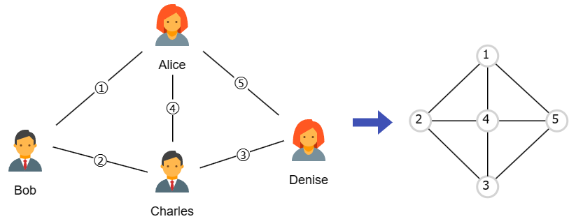

# QE Questions

2023 Fall

Overall 26 questions

1. Suppose you have done 12-fold cross validation for a task and get average RMSE is xxxxx.xxxxxx. How many digits should you report? Explain how to determine naturally. 

     
    
    **Answer**: If you want to compare our model with some other models, we may choose the same number of digits to report. If we are not doing comparison, we should calculate the standard deviation and choose digits based on the level of it.

     

2. Why training an autoencoder is a self-supervised task?

     

    **Answer**: Because the input and output are the same thing, we are doing self-supervised learning rather than providing extra labels.

     

3. Consider you are using gradient boost algorithm. Write down 2 hyperparameters that you think are the most important and explain why.

     

    **Answer**: The first one is learning rate (step-size). The learning rate controls how much we update the model in each iteration, i.e., it controls the contribution of each weak learner. A smaller learning rate allows for a more cautious and deliberate learning process, resulting in a stronger ensemble model that is less likely to overfit the training data. However, it requires more time to train.
    
    The other one is the number of weak learners (typically decision trees). The number of weak learners controls the complexity of the model. More weak learners will result in a more complex model, which can lead to good performance on the training data. But if the number is too large, the model may overfit. 

     

4. Suppose you are training a naive model (for a regression task) that output constant $c$ for all datapoints. Write down the objective function of the model and give an explicit solution of $c$.

     

    **Answer**: The objective function is $\min_{c} \frac{1}{n}\sum_{i=1}^n (y_i - c)^2$. Take derivative w.r.t. $c$ and set it to zero, we have $c = \frac{1}{n}\sum_{i=1}^n y_i$.

     

5. In what cases you will use the $k$-nearest neighbor algorithm?

     

    **Answer**: When we are dealing with numerical data with few predictors.

     

6. What is the intuition explanation of R-squared?

     

    **Answer**: How much your model is better than the naive model &mdash; average.

      

7. Consider you have $n$ datapoints and $5$ features: age, gender, whether graduated from college, height, and annual income. What is the maximum number of questions can be asked in all independent splits?

     

    **Answer**: Gender and whether graduated from college are binary features, while others are numerical features. For binary features, we can ask only one question, but for numerical features, we can ask at most $n-1$ questions. So the maximum number of questions is $2 + 3(n - 1) = 3 n - 1$.

     

8. Suppose you train a decision tree with $n$ balanced data, i.e., the numbers of “+” and “-” are the same. $n \% 4 = 0$. Now $\frac{1}{4}$-th data go to the left leaf, and $\frac{1}{4}$-th data are “+” in the left leaf. What is the sample-weighted Gini impurity?

     

    **Answer**: The left leaf has $\frac{1}{4} n$ data and $\frac{1}{4} \times \frac{1}{4} n = \frac{1}{16} n$ “+” data. So there are $\frac{1}{2} n - \frac{1}{16} n = \frac{7}{16} n$ “+” data in the right leaf. The proportion of “+” data in the right leaf is $\frac{7 / 16 n}{3 / 4 n} = \frac{7}{12}$. The Gini impurity in the left leaf is 
    
    $$
    \text{Gini}_{\text{left}} = 2 P_{+}^{\text{left}} (1 - P_{+}^{\text{left}}) = 2 \times \frac{1}{4} \left(1 - \frac{1}{4} \right) = \frac{3}{8},
    $$

    and the Gini impurity in the right leaf is

    $$
    \text{Gini}_{\text{right}} = 2 P_{+}^{\text{right}} (1 - P_{+}^{\text{right}}) = 2 \times \frac{7}{12} \left(1 - \frac{7}{12} \right) = \frac{35}{72}.
    $$

    Thus, the sample-weighted Gini impurity is

    $$
    \text{Gini} = \frac{1}{4} \text{Gini}_{\text{left}} + \frac{3}{4} \text{Gini}_{\text{right}} = \frac{3}{32} + \frac{35}{96} = \frac{11}{24} \approx 0.4583.
    $$

     

9.  Suppose you are doing muliple linear regression with one categorial feature with $K$ classes. Why do we use $K-1$ regression variables to represent the categorial feature? If we want to include all $K$ regression variables, how can we achieve that by modifying the objective function?

     

    **Answer**: If we use $K - 1$ variables to represent the categorial feature, the excluded one can be easily represented by setting all the $K - 1$ variables to zero. If we use $K$ variables, there is perfect multicollinearity. To include all $K$ variables, we can regularize the coefficients of the regressors. For example, the objective function of a ridge regression is

    $$
    \min_{\beta_0,\ \bm{\beta}} \frac{1}{n} \sum_{i=1}^n (y_i - \beta_0 - \bm{x}_i^{\top} \bm{\beta}) + \gamma \bm{\beta}^{\top} \bm{\beta}.
    $$

    where $\bm{x}_i$ is the vector of $K$ regressors for the $i$-th datapoint, $\bm{\beta}$ is the vector of $K$ coefficients (if we only consider $K$ categorial variables without other features), and $\gamma$ is the regularization parameter.

     

10. Consider a model estimate $\widehat{y} = f(X;\ \theta,\ \lambda)$. What is the difference between the model parameter $\theta$ and the hyperparameter $\lambda$?

     

    **Answer**: The model parameter $\theta$ can be updated through training, while the hyperparameter $\lambda$ is fixed during training process. The hyperparameter $\lambda$ is usually determined by cross-validation.

     

11. Consider an **undirected** friendship network. Alice is a friend of Bob, Bob is a friend of Charles, and Charles is a friend of Denise. Which **line** has the highest degree in the network? Why?

     

    **Answer**: The undirected graph is shown below (left). Note that friend of friend is still a friend. Then, to find the line with the highest degree, we can transform the undirected graph to a line graph (right).

    

    
    

    We can see from the line graph that ④, i.e., the link between Alice and Charles has the highest degree, because it has more linkage in the line graph.

     

12. Wirte down the detailed steps of training a regression tree, including the objective function.

     

    **Answer**: 

    1. Set hyperparameters for the model, e.g., depth.
    2. Split training data by asking questions at each node.
    3. Use the mean as prediction and calculate the sample-weighted SSE for each level.
    4. Change questions to minimize the SSE.

    The objective function is 

    $$
    \text{SSE} = \sum_{i} (y_i - \widehat{y}_i)^{2},
    $$

    where $y_i$ is the label and $\widehat{y}_{i}$ is the prediction.

     

13. Both Naive Bayes and Logistic Regression have inductive bias. Explain the inductive bias of each model.

     

    **Answer**: The inductive bias of Naive Bayes is independence of features (predictors) and using relative frequencies to estimate probabilities. The inductive bias of Logistic Regression is the log-odds of the label is a linear function of the features.

     

14. Consider you are analyzing texts on Weibo. You want to train a model to predict the depression level, from $0$ to $10$. Give the detailed steps of how you would do it.

     

    **Answer**: 

    1. Collect text data from Weibo.
    2. Manually label the data with depression level.
    3. Preprocess the data, e.g., remove stop words, stemming, etc.
    4. Split the data into training, validation, and testing sets.
    5. Extract features from the data, e.g., word2vec.
    6. Train a model, e.g., Transformer.
    7. Evaluate the model and tune the hyperparameters, e.g., cross-validation.
    8. Deploy the model.

     

15. Suppose you are predicting returns for $12,500$ stocks. Instead of dealing with the returns directly, you rank them into $10$ deciles, i.e., the first $10\%$ are stocks with lowest returns and the last $10\%$ are stocks with highest returns. Would you treat this as a classification or regression task? Why?

     

    **Answer**: Treat it as a regression task because the deciles are ordinal.

     

16. Describe a case of network that the node degree distribution is heavy-tailed.

     

    **Answer**: Assume a node would attach to a new node with probability proportional to its degree, i.e., $p_{i} \propto k_i$, where $p_{i}$ is the probability of node $i$ to link to others and $k_i$ is the degree of node $i$. This will make “the rich gets richer”, which can be described using a heavy-tailed degree distribution.

     

17. What is the difference between covariate drift and concept drift? Which one is more problematic?

     

    **Answer**: Covariate drift means $P(X_{t+1}) \neq P(X_t)$ and concept drift means $P(Y_{t+1} \mid X_{t+1}) \neq P(Y_t \mid X_t)$, where $X$ represents features and $Y$ represents target. Concept drift is more problematic because it will happen whether or not covariate drift happens. If there is concept drift, we have to change the model, while we don't need to change the model if there is only covariate drift.

     

18. Suppose you are predicting the number of passengers in the subway in Shenzhen using monthly data. Using an $\text{AR}(n)$ model with trend term and a monthly seasonal effect and write down the objective function.

     

    **Answer**: The $\text{AR}(n)$ model is 

    $$
    (1 - B)(1 - B^{12}) X_t = \phi_0 + \phi_1 X_{t-1} + \phi_2 X_{t-2} + \cdots + \phi_n X_{t-n} + \varepsilon_t,
    $$

    where $X_t$ is the number of passengers in the $t$-th month, $B$ is the backshift operator, and $\varepsilon_t$ is the error term satisfying $\varepsilon_t \sim N(0,\ \sigma^2)$. The objective function is 

    $$
    \min_{\phi_0,\ \phi_1,\ \cdots,\ \phi_n} \frac{1}{T} \sum_{t=1}^T \varepsilon_t^{2}.
    $$

     

19. If all-else-equal, a social network firm $A$ is twice as large as another social network firm $B$. How much more valuable is firm $A$ than firm $B$?

     

    **Answer**: By Metcalfe's law, the value of a network is proportional to the square of the number of users. So firm $A$ is $2^2 = 4$ times more valuable than firm $B$.

     

20. Suppose you are training a multi-layer perceptron to classify datapoints with $n$ features into $k$ classes. The model has 2 hidden layers, with $r$ and $s$ neurons respectively. How many trainable parameters are there in the model?

     

    **Answer**: Assume we are fully connecting the nodes and at last we will output $k$ values. Assume we use both weight and bias, then the number of trainable parameters is $2 (n r + r s + s k)$.

     

21. Express the temperature both mathematically and qualitively in the Simulated Annealing algorithm.

     

    **Answer**: In the Simulated Annealing algorithm, the update from $x_k$ to $x_{k+1}$ is accepted if $\Delta c_k = c(x_{k+1}) - c(x_k) < 0$, and accepted with probability $\exp(-\frac{1}{T_k} \frac{\Delta c_k}{\eta})$ if $\Delta c_k > 0$, where $c(\cdot)$ is the cost function, $T_k$ is the temperature, and $\eta$ is an adjusted factor. The temperature $T_k$ is a decreasing function of $k$. When the training has just started, i.e., $k$ is small, then $T_k$ is large, so the probability of accepting a worse solution is large. When the training is almost finished, i.e., $k$ is large, then $T_k$ is small, so the probability of accepting a worse solution is small. Thus, the temperature controls the probability of accepting a worse solution.

     

22. Why a model with zero training error is not overfitting?

     

    **Answer**: When the number of parameters is much larger than that of datapoints, there are many solutions and we can find one with zero training error and low validation error. This is called benign overfit.

     

23. Write down an objective function of logistic regression and explain each terms.

     

    **Answer**: The objective function is cross-entropy:

    $$
    \sum_{i=1}^{n} -[y_i \log p_{i} + (1 - y_i) \log (1 - p_{i})],
    $$

    where $y_i$ is the binary label ($0$ or $1$) of the $i$-th datapoint, 
    
    $$
    p_{i} = \frac{1}{1 + \exp(-\bm{x}_i^{\top} \bm{\beta})}
    $$
    
    is the probability of the $i$-th datapoint being positive, $\bm{x}_i$ is the vector of features (including intercept) and $\bm{\beta}$ is the vector of coefficients.

     

24. Consider you are doing $N$ bagging for a regression task. Which is/are correct in the following statements:

    1. We train $N$ models on $N$ bootstrapped samples.
    2. Using average of the $N$ predictions as the final prediction.
    3. Each model has a high variance and a low bias.
    
    For incorrect statements, explain why.

     

    **Answer**: Three statements are all correct.

     

25. Which one do you think has a higher node degree variance, a Erdos-Renyi graph or a Barabasi-Albert graph? Why?

     

    **Answer**: A Barabasi-Albert graph has a higher node degree variance. In a Erdos-Renyi graph, the node degree follows a binomial distribution, which has a small variance. In a Barabasi-Albert graph, the node degree follows a power-law distribution, which has a large variance.

     

26. Increasing $k$ in $k$-nearest neighbor algorithm will increase or decrease the bias? Why?

     

    **Answer**: Increasing $k$ will increase the bias because we are using more datapoints to average or vote, which tends to underfit. The extreme case is we use all datapoints available, which is the same as the naive model with high bias. 

     
