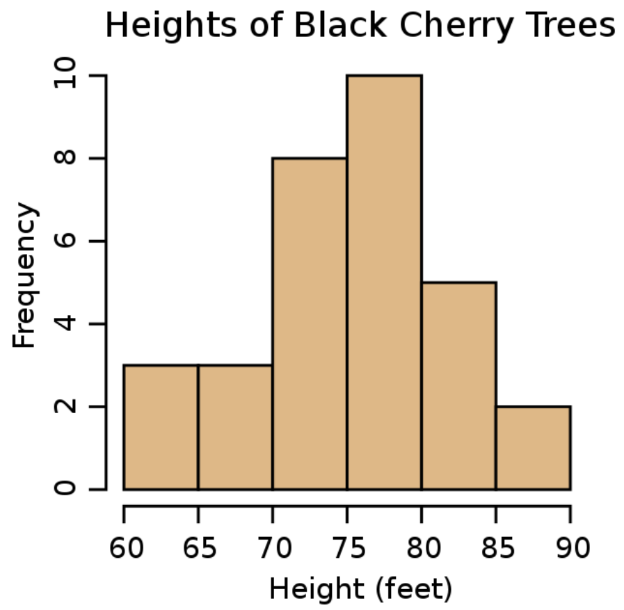

# Big Data Analytics and Application

Sandro Claudio Lera

2023 Fall

## PhD Entrance Exam Syllabus

### 1. Overview of Data Science

- Definition and characteristics of data science, big data, and statistics
    - *Data science*: an **interdisciplinary** academic **field** that uses statistics, scientific computing, scientific methods, processes, algorithms and systems to **extract** or extrapolate knowledge and **insights from** noisy, structured, and unstructured **data** (source: [WIKIPEDIA](https://en.wikipedia.org/wiki/Data_science)).
    - *Big data*
        - Helps us to **answer big questions**
            - “small” question: How many people live in Shenzhen?
                - Traditional statistics can answer this question.
            - “big” question: How is the possibility to work from home going to affect people’s decision to move to cities?
                - Traditional statistics hard to answer this question.
        - 4 V: 
            - **V**olume: Scale of data is big
            - **V**elocity: Speed of data generation is high (streaming data)
            - **V**ariety: Many different forms of data
            - **V**eracity: Much uncertainty of data
    - *Statistics*: **discipline** that concerns the **collection**, organization, **analysis**, **interpretation**, and **presentation** of **data** (source: [WIKIPEDIA](https://en.wikipedia.org/wiki/Statistics)).
- The difference between statistics and machine learning
    - **Machine learning is based on statistics**, but **not all** machine learning model **have good statistical properties**.
    - Statistics is more on **inference** and **interpretation (description)** of data, while machine learning is more on **prediction**. In other words, traditional statistical methods may be **less accurate on prediction but more interpretable**, while machine learning methods may be **more accurate on prediction but less interpretable**.
    - Machine learning can easily have **more complex models** than traditional statistical methods.
- The difference between artificial intelligence and machine learning
    - **AI includes machine learning** which is based on statistics, but also includes methods based on other fields, e.g., **biology**.
- Different categories of data

    

    
    

- Key steps in data mining
    - SEMMA: 
        - **S**ample: Take a sample from the dataset; partition into training, validation, and test datasets.
        - **E**xplore: Examine the dataset statistically and graphically.
        - **M**odify: Transform the variables and impute missing values.
        - **M**odel: Fit predictive models (e.g., regression tree, neural network).
        - **A**ssess: Compare models using a validation dataset.
- Data sampling
    - *Bootstrapping*
        - **Sampling with replacement**: We want to generate $N$ datasets from one original dataset with $K$ datapoints. For each bootstrapped dataset, we sample $K$ times with replacement from the original dataset.
        - A straightforward way to **get error bars**: We can calculate the statistics on each of the $N$ bootstrapped datasets, and use the standard deviation of the statistics as the error bars.
        - **Do not** calculate the mean of an original dataset! Bootstrap it and show the error bars (standard deviations).
        - The probability of any datapoint being selected in a bootstrapped dataset: 

            $$
            \begin{aligned}
            &1 - \text{Prob. of not being selected} = 1 - \left(1 - \frac{1}{K} \right)^{K} \\
            &\xlongequal{K \to \infty} 1 - e^{-1} \approx 63\%.
            \end{aligned}
            $$

            Actually, when $K = 2$, the probability is $75\%$ and decreases as $K$ increases.
        - The probability of any datapoint being selected in $N$ bootstrapped datasets: from above we know that the probability of any datapoint not being selected in a bootstrapped dataset is roughly $37\%$, so the probability of any datapoint being selected in $N$ bootstrapped datasets is roughly $1 - 0.37^{N}$. As $N$ increases, the probability approaches $1$.

    - *Under- and oversampling*

        - Class imbalance

            

            
            

            - *ways to solve*: 
                - copy the minority class or delete the majority class
                - SMOTE

- Opportunities and pitfalls of big data analysis
    - Opportunities
        - more data may lead to better models
        - complex systems may lead to “emergence phenomena”
    - Pitfalls
        - Interpretability
        - Ethics problems, e.g., data discrimination and privacy
        - Environmental impact, e.g., energy consumption

### 2. Data Exploration

- Data visualization
    - Different types of data require different types of visualization
        - *Qualitative data*
            - bar chart (*ordinal data*)

                

                
                

        - *Quantitative data*
            - histogram (*discrete data*)

                

                
                

            - pdf (*continuous data*)
            - cdf (or sf, survival function, i.e., 1 - cdf)

                

                
                

            - quantile function (inverse of cdf)

                

                
                

            - box plot (graphically shows min, max, mean, median, other quantiles, and inter-quantile range (IQR, e.g., 75\% quantile - 25\% quantile))
                
                

                
                

            - violin plot (box plot + pdf, the left and right sides of the violin plot can be pdfs of different classes)

                

                
                

        - *Both*
            - heatmap (easier to read than 3D-plots)

                

                
                

        - *Others*
            - visualizing networks (nodes, edges)
    - Focus on different statistics, e.g. mean or median, for data with different distributions.
    - Ranking changes data from quantitative to qualitative (ordinal).
- Dimensionality reduction
    - **Embedding via unsupervised learning**
        - PCA (linear)
        - neural networks (non-linear)

### 3. Probability Distributions

- Basics of probability distributions
- The importance of heavy-tailed distributions

### 4. Optimization

- Taylor Approximations
- Newton’s Method
    - *Intuition*: the root of a **complicated function** is hard to find, so we **approximate the function with a simpler function** (e.g., a linear function or tangent line) and find the root of it. At the approximate root, we can approximate the function again and iterate to approach the true root.
    - Since we approximate the function with a linear function, we need to use the first-order derivative. If it is hard to get, we can use a **first-order difference to approximate** it, which is called **Quasi-Newton method**.
- Gradient Descent
    - Gradient is **a vector of partial derivatives**, so it has **direction** (points into the direction of steepest ascent).
    - Hyper-parameter: step size or learning rate
    - Many extensions
        - Allow for boundary constraints
        - smart choices of the step size
        - add noise (to not get stuck)
        - add momentum (to not get stuck)
        - smart approximations of the gradient (simplifies the calculation)
        - include higher-order derivatives (to speed up convergence)
        - ...
- Non-Gradient based Metaheuristics
    - Simulated Annealing
        - *Intuition*: Accept updates in **loss-decreasing** direction while accept updates in **loss-increasing** direction with a **probability** (**higher loss-increasing, lower probability**). The probability is also related to the **temperature** (**lower temperature, lower probability**) that decreases over iterations (exploring first).
    - Genetic Algorithm
        - *Settings*: Each code is called a **chromosome**. Every binary (0 or 1) in a chromosome is called a **gene**. The set of all chromosomes is called a **population**.
        - *Steps*: 
            - Initialize the population;
            - Randomly choose **parents** in the initial population (lower loss, higher probability to be chosen);
            - **Crossover** (divide the chromosome into 2 parts and exchange) parents to get **offspring**;
            - **Mutation** (flip 0 to 1 or 1 to 0) the offspring to get **mutated offspring** in some probability;
            - The initial population, offspring, and mutated offspring consists the next generation (population), but there is an upper bound for the population, i.e., somebody will be eliminated. So the last step is to **select** the best ones (lower loss) to form the next generation;
            - Back to the second step.
    - Brute Force Optimization
        - Grid Search
        - To improve efficiency, we can start on a coarse grid and find the optimum. Then we can start on a finer grid around the optimum and find the optimum again. This iterative process is called **hierachical brute force**.

### 5. Linear Regression

- Least Squares
- Multivariate Linear Regression
    - Categorial data would be handled via **dummy** variables or **indicator** variables (but only need $n - 1$ variables for $n$ categories, or we will meet the multi-collinearity problem).
- Regression coefficient estimation
    - It is **faster** to calculate $(X^{\top} X) \beta = X^{\top} y$ than $\beta = (X^{\top} X)^{-1} X^{\top} y$ because the latter needs to calculate the **inverse** of a matrix. The former can be calculated via some numerical methods.
- Regularization
    - *Motivation*: When 2 independent variables are highly correlated, the regression coefficients are not stable. This is called **multi-collinearity**. Under this situation, small changes in the data can lead to large changes in the regression coefficients. So we need to **penalize** the regression coefficients to make them more stable.
    - Ridge, Lasso, Elastic Net (Ridge + Lasso)
    - *Single perturbation*: The analytical solution of the Ridge regression is $\widehat{\beta} = (X^{\top} X + \lambda I)^{-1} X^{\top} y$. However, the solution that $\lambda \to 0$ **does not equal to** the solution of the original least squares problem, i.e. $\lambda = 0$. Maybe the loss function is **not continuous** at $\lambda = 0$.
- Regression performance evaluation
    - Evaluation metrics
        - MSE, RMSE, MAE
        - *R-squared*
            - **Explained variance**
            - **How much better than the most naive model &mdash; the mean**: 

                $$
                R^{2}(y,\ \widehat{y}) = 1 - \frac{\sum_{i=1}^{n} (y_i - \widehat{y}_{i})^{2}}{\sum_{i=1}^{n} (y_i - \overline{y}_{i})^{2}}.
                $$

                For the mean model, $\widehat{y}_{i} = \overline{y}_{i}$, and thus $R^{2}(y,\ \widehat{y}) = 0$. Better model has smaller MSE (the nominator) and thus has higher $R^{2}$.

    - K-Fold Cross-Validation
        - Split training data into training and validation datasets. Train the model on the training dataset and evaluate the model on the validation dataset. Repeat this process for $K$ times and **average** the evaluation metrics for robustness.
        - **Do not** use the testing data!
        - *Implicit assumption*: the training data and testing data are from the **same distribution**.

### 6. Logistic Regression

- Logistic Regression estimation
    - The outcome variable, $y$, is **binary** (0 or 1).
    - The estimated results, $\widehat{y}$, are **probabilities**.
    - Using a **threshold** to classify $\widehat{y}$ into 0 or 1, e.g., larger than 0.7 is 1 and otherwise 0.
    - *Specific form*: 

        Using the **sigmoid functions** of $k$ independent variables as predictors of probability $p$, i.e.,

        $$
        p = \frac{1}{1 + \exp[-(\beta_0 + \beta_1 x_1 + \cdots + \beta_k x_k)]}.
        $$

        The **odds** of belonging to class 1 is just the ratio of the probability of belonging to class 1 to the probability of belonging to class 0, i.e., 

        $$
        \text{Odds}(y = 1) = \frac{p}{1 - p} = \exp(\beta_0 + \beta_1 x_1 + \cdots + \beta_k x_k).
        $$

        Taking the log on both sides, we get the **logistic model**: 

        $$
        \text{logit} := \log p - \log (1 - p) = \beta_0 + \beta_1 x_1 + \cdots + \beta_k x_k.
        $$

    - *Objective function*:

        The parameter $\beta_0,\ \cdots,\ \beta_k$ in the logistic model are determined s.t. they **minimize the cross-entropy** 

        $$
        \sum_{i=1}^{n} -[y_i \log p_{i} + (1 - y_i) \log (1 - p_{i})].
        $$

        Since $y_i$ is binary and $0 \leqslant p_{i} \leqslant 1$, the objective is **zero or positive**, which means the **minimum is zero**. When $y_i = 1$, we only need to consider the first term, and larger $p_{i}$ results in smaller objective; when $y_i = 0$, we only need to consider the second term, and smaller $p_{i}$ results in smaller objective.
    - In practice, we would **not** let those whose probability is lower than 0.5 to be 0 and higher than 0.5 to be 1, because that would **lose information**. Instead, we can do a **consistency check**, i.e., to see the precision on each quintile. The expected shape is **U-shape** (the precision is high on both ends and low in the middle).
- Classification performance evaluation
    - F1 Score
        - **Confusion Matrix**

            

            
            

        - **Precision** talks about how many positive predictions are correct (true).
        - **Recall** talks about how many true predictions are made among all positive labels.
        - **Accuracy** talks about how many predictions are correct (true).
        - If we care more about **false positives**, we should use **precision** rather than recall; conversely, if we care more about **false negatives**, we should use **recall** rather than precision.
        - We can also consider both. **F1 score** is the **weighted average** of precision and recall: 

            $$
            \text{F1} = 2 \times \frac{\text{precision} \times \text{recall}}{\text{precision} + \text{recall}}.
            $$

        - When classes are **imbalanced**, e.g., 

            

            |              | Positive | Negative |
            | :----------: | :------: | :------: |
            | **Positive** |    1     |    0     |
            | **Negative** |    1     |   998    |

            

            
            Although the accuracy is high, the model is bad for positive labels since there is a large recall.

    - ROC-Curves
        - **Recall** is also called **true positive rate (TPR)**: $\frac{\text{TP}}{\text{TP} + \text{FN}}$.
        - We can also define **false positive rate (FPR)** by $\frac{\text{FP}}{\text{FP} + \text{TN}}$.
        - Given **different thresholds**, we can get different TPR and FPR. Let **TPR be the y-axis** and **FPR be the x-axis**, we can get a curve called **ROC curve**.

            

            
            

            We can see that the larger the area under the ROC curve, the better the model. So we can use the **area under the curve (AUC)** to evaluate the model.

- Generalization to multiple classes
    - Just reformulate as multiple binary classification problems.

### 7. From Linear to Non-Linear Methods

- Inductive Bias
    - $f$, the algorithm, or the model, is called the <strong>inductive bias</strong>.
    - Formally, the inductive bias is a **set of assumptions** that we make about our ML algorithm to predict outputs of given input that it **has not yet encountered**.

### 8. Tree-Based Methods

- Decision Trees
    - Overfit prevention
        - Regularization: Keep the trees **shallow** (using different stopping criteria)
            - Stop when **impurity** is below a threshold
            - Stop when **next split** does not decrease impurity below a threshold
            - Stop when the **number of datapoints** in a node is below a threshold
            - Stop when the tree has reached some **maximum depth**
    - Impurity measures
        - **Gini Impurity**: $G = p_{+}(1 - p_{+})$ where $p_{+}$ is the probability of being classfied as positive. The maximum is $0.5$ when $p_{+} = 0.5$, i.e., totally impure. The minimum is $0$ when $p_{+} = 0$ or $p_{+} = 1$, i.e., totally pure. For **multiple classes**, the Gini impurity is defined as $G = 1 - \sum_{i=1}^{K} p_{i}^{2}$.
        - **Cross-Entropy**: $H = -\sum_{i\in \left\{+,\ - \right\}} p_{i} \log(p_{i})$. Similarly, the maximum is reached when $p_{+} = 0.5$, i.e., totally impure. The minimum is $0$ when $p_{+} = 0$ or $p_{+} = 1$, i.e., totally pure. For **multiple classes**, the cross-entropy is defined as $H = -\sum_{i=1}^{K} p_{i} \log(p_{i})$.
        - **SSE**: for regression problems, we need **sum of squared error (SSE)** to be small.
    - Advantages and shortcomings
        - *Advantages*
            - can handle both classification and regression problems
            - handles non-linearities
            - few parameters to tune
            - robust to noise and **outliers**
            - robust to correlated features
            - handles high-dimensional data very well
            - easy to **interpret**
            - once constructed, they are **computationally cheap** to use
        - *Shortcomings*
            - **sensitive to changes in the data**, even a slight change can cause very different splits
                - *way to solve*: **boosting** and **bagging**
- Ensembles and Bagging
    - Bagging (**B**ootstrap **Agg**regat**ing**) is an ensemble algorithm
        - *Procedure*: Fit multiple models on **bootstrapped datasets** and then aggregate them by **averaging** (regression) or **voting** (classification).
        - *Problem of bagging*: if **a few features dominate**, all trees will **always split on them**, i.e., all trees look **similar** and the averaging does not help much. So we need **random forest**.
- Random Forest: each node only gets to see a **random subset** of features
    - Hyper-parameters and K-Fold Cross-Validation
        - The size of the feature subset is a hyper-parameter. A typical choice is **square root of the total number of features**.
        - Other hyper-parameters:
            - number of trees (larger is better but slower)
            - decision criterion (Gini or cross-entropy)
            - data fraction per split (somewhat important)
            - tree depth (very important)
            - fraction of data per final leaf (very important, but correlated with tree depth)
        - Hyper-parameters would be tuned via K-Fold Cross-Validation.
- Non-Greedy Trees
    - Traditional decision trees are **greedy**. They optimize the **current** split, but not the **overall** split.

        

        
        

        In the example above, **every split is optimal** in the corresponding sub-problem, but the overall split is optimal **only if** $V_0 = V_1 = 0.5$. Thus, if we use a greedy algorithm, we may **not** find the optimal solution.
    - *Smart Trees*: **smooth** and **symmetric**.
        - Smooth: replace the **step-function** by a **sigmoid function**.
        - Symmetric: split on the **same feature at each level** (kind of **regularization** because it is an extra structure).

            

            
            

- Boosting
    - *Intuition*: train weak learners **sequentially**, each trying to **correct** its predecessor.
    - Types: 
        - **Gradient Boosting**

            

            
            

            It is just training a **regression tree** on the **residuals** of the previous tree. It is called **gradient** because the residuals are the **negative gradients of squared errors**. For other loss functions, the so-called “residuals” are generalized.

            - **XGboost and LightGBM**: 2 popular implementations of gradient boosting. **The latter is faster**.
        - AdaBoost

### 9. Overfitting

- Definition of overfitting
    - Model behaves **well** on the **training** data but **poorly** on the **validation** data.
- Bias-Variance Tradeoff

    

    
    

- Benign Overfits
    - When the number of parameters is at the **same level** as the number of datapoints, there is **only one exact solution** to fit the datapoints, so this kind of overfitting is **bad**.
    - When the number of parameters is **much larger** than the number of datapoints, there are **many solutions** to fit the datapoints and we can **find a solution to minimize the validation error**, so this kind of overfitting is **benign**.
- Generalization to real life
    - Goodhart’s Law
        - When a measure becomes a target, it ceases to be a good measure.

### 10. Classification Methods

- K-Nearest Neighbors
    - *Intuition*: Find $k$ datapoints that are **closest to the new datapoint** and let them **represent** the new datapoint.
    - For classification tasks, we can let the **majority class** of the $k$ datapoints to be the class of the new datapoint; for regression tasks, we just use the **average** of the $k$ datapoints to predict the new datapoint.
    - $k$ is a <strong>hyper-parameter</strong>. If it is too <strong>small</strong>, the model <strong>overfits the noise</strong>; if it is too <strong>large</strong>, the model is <strong>underfitting</strong>.
    - *Advantages*
        - simple
        - non-parametric
        - works for both classification and regression
    - *Shortcomings*
        - **only for** numerical data, **not for** categorical data, because we need to define a **distance**.
        - **Curse of dimensionality**: the number of datapoints required in the training set to qualify as large increases exponentially with the number of predictors (features).
- The Naïve Bayes Classifier
    - *Intuition*: Similar to KNN, find **all** the other datapoints with the **same** predictor (feature) profile (**numerical values would be binned to be categorical values**) and let them **represent** the new datapoint.
    - *Exact formula*: 

        Assume there are **independent** predictors $x_1,\ \cdots,\ x_p$ and classes $c_1,\ \cdots,\ c_k$, then by Bayes’ theorem, we have

        $$
        p(y = c_i \mid x_1, \cdots, x_p) = \frac{p(y = c_i) \prod_{j=1}^{p} p(x_j \mid c_i)}{\sum_{i=1}^{k} \left(\prod_{j=1}^{p} p(x_j \mid c_i) \right) p(c_i)}.
        $$

        Under this assumption, we only need to estimate $p(x_j \mid c_i)$ and $p(c_i)$ by the **actual data fractions** in the training set.
    - *Advantages*
        - simple
        - computationally efficient
        - good performance unless large number of predictors
        - can handle both numerical and categorical data
    - *Shortcomings*
        - require large number of datapoints to estimate the probability
        - may meet zero frequency problem (the new datapoint does not match any datapoint in the training set)
        - strong assumption needed (independent features)
        - cannot handle many features

### 11. Neural Nets

- Basics and architectures
    - Activation functions
    - Backpropagation
    - Epochs
    - Dropout
- Deep Learning
- Convolutional Neural Networks
    - *Assumptions*
        - Translation invariance
        - Rotation invariance
        - Size invariance
    - Under these assumptions, we can use a local filter to slide on the image rather than use a fully-connected layer, so the computation becomes **efficient**.
    - **Convolution**: **element-wise production** of matrices and **sum** the results
    - **Pooling**: to find **representations** of patches and **reduce the dimension**
        - max pooling (use the max value)
        - mean pooling (use the mean value)
    - **Spatial dropout**: dropout the whole **channel**
- Advantages and shortcomings
    - Structured vs unstructured data
        - **Structured data**: tabular data including numerical and categorial data
        - **Unstructured data**: text, image, vedio, ...

### 12. Autoencoders

- Generative Adversarial (neural) Network
    - **Generator**: create fake images
    - **Discriminator**: distinguish fake and true images
- Deepfakes

### 13. Feature Selection

- Regularization
    - Ridge, Lasso, Elastic-net
- Feature Selection with Random Forests
    - Mean decrease in impurity
        - *Problem*: 
            - it is derived **from the training set**, which means the importances can be high for features that are **not predictive** of the target variable, as long as the model has the capacity to use them to **overfit**.
            - the importances of numerical features would be **naturally higher** than that of categorical features because we can **ask more questions** (**more possibilities to split**) for numerical features.
- Feature Selection with Boruta
    - *Procedure*:
        - **Randomly rearrange** the features to get **shadow features**
        - Train with original features and shadow features $K$ times to see **how many times** each original feature is **better** than all shadow features.
        - Only features that better than all shadow features for **a specific number of times** would be selected.
    - The decision threshold can be determined more quantitatively by Binomial test.
- Principal Component Analysis
- Pipelines and Model Stacking

### 14. Shapley Values

- Shapley Values in Game Theory

    

    
    

    Note that in the third column, we **remove all other features to let the feature concerned at the tail**.

- Feature Selection with Shapley Values
    - Shapley values attribute a model’s predictions to its input features, i.e., it measures how much the **output changes** with the input **included or excluded**.
- Explainable AI

### 15. Text Mining

- Text preprocessing
    - **Tokenization**: divide a sentence to be words and punctuations (each is a token).
    - **Stopword**: list of **frequently occuring** terms that are often removed (and, or, thus, ...)
    - **Stemming**: reduce different variants of words to a common core (“he is running” becomes “he is run”)
    - often transform uppercase to **lowercase**.
    - **Feature abstraction replacement**: replace numbers by their meanings, e.g., phone numbers would be replaced by “PHONE”, email would be replaced by “EMAIL”. These will be **kept uppercase** to show difference.
- TF-IDF
    - We can represent the words (called **terms**) by their frequency, i.e., **term-frequency (TF)**.
    - However, some words would be **over-represented**, e.g., “the”, “he”, etc.
    - *Way to solve*: use **Term Frequency-Inverse Document Frequency (TF-IDF)** which is $\text{TF} \times \text{IDF}$ where $\text{IDF}$ is inverse document frequency of the word **across a set of documents**. If the frequency of a word across documents is high, it means we need to lower its value, so we times the inverse frequency.
- N-Grams
    - TF and TF-IDF count words only, **do not account for word-combinations**.
    - *Way to solve*: use N-grams that counts N-word-combination.

        

        
        

        It is just an **extension** of TF or TF-IDF.
- Word2vec
    - TF, TF-IDF and N-grams have the same problem: synonyms and **similar words** (e.g., “mouse” and “rat”) give rise to completely **different** features (counts).
    - *Way to solve*: text embedding using NN.
    - Limitations
        - The embedding is not **context aware**.
        - The word **ordering matters**.
    - Beyond word2vec
        - Attention and Transformer

### 16. Concept Drift

- **Concept drift**: $p_t(X,\ y) \neq p_{t+1}(X,\ y)$
- Since $p(X,\ y) = p(y \mid X) p(X)$, there are 2 **sources** of drift: 
    - **Feature drift or covariate drift**: $p_t(X) \neq p_{t+1}(X)$
    - **Real concept drift**: $p_t(y \mid X) \neq p_{t+1}(y \mid X)$

### 17. Time-Series

- Temporal data
- Descriptive vs. Predictive Modeling
    - **Descriptive** (explanatory) task: quantify the effect of inputs on an outcome. Focus on the **coefficients** ($\beta$).
    - **Predictive** task: predict the outcome value for new datapoints. Focus on the **predictions** ($\widehat{y}$).
    - ML is more focused on prediction, while statistics more about description.
- Time Series components
- Benchmark
- Stationarity
- Autocorrelation
- Smoothing Methods

### 18. Cluster Analysis

- Supervised vs. Unsupervised machine learning
- Distance metrics
    - non-negativity
    - self-proximity: $d_{ii} = 0$
    - symmetry
    - triangle inequality
- Hierarchical Clustering
    - **Agglomerative** methods: from many clusters to one cluster
        - Dendrogram: a tree-like diagram to show the linkage between clulsters
    - **Divisive** methods: from one cluster to many clusters
- Validating clusters
    - interpretability
    - stability
    - seperation: the ratio of between-cluster variation to within-cluster variation
    - number of clusters
- The K-Means Algorithm
    - heuristic to find $K$ clusters
- DBSCAN
    - density based
    - *Intuition*: randomly select datapoints to see whether there are **lots of** datapoints (**exceeds a threshold**) in their **small neighborhoods**.
    - *Advantages*
        - no need to specify the number of clusters
        - datapoints can be discarded as outliers
        - fast

### 19. Complex Networks

- Network basics
    - Nodes
    - Edges (can be directed)
    - Any network can be represented by its **adjacency matrix**
- Shortest path
    - Dijkstra’s algorithm: can give the **exact solution** but **inefficient**, **not heuristic**.
- Node-level centrality metrics
    - **Degree centrality**: **how many edges** are connected to the node.
    - **Closeness centrality**: **how close** the node is to the other nodes. **Average the shortest paths and take the reciprocal**.
    - **Betweenness centrality**: the extent to which a given node lies on the shortest path between pairs of nodes, e.g., **how many shortest paths go through** the node.
    - **Eigenvector centrality**: **a node is important if it is connected to important nodes**.
        - The above statement can be formulated as 

            $$
            c_i = \frac{1}{\lambda} \sum_{j} a_{ij} c_j,
            $$

            where $c_i$ is the centrality of node $i$, $a_{ij}$ is the element in the adjacency matrix $A$, and $\lambda > 0$ is some constant. The equation means the **centrality of node $i$ is positively related to its friends’s centrality**.

            Then, we can write the equation to be 

            $$
            A c = \lambda c,
            $$

            which is just an eigenvector problem, i.e., **centrality $c$ is the eigenvector of adjacency matrix $A$**.

    - **Graph Random Walks**: a random walker starts at a randomly chose node, and then randomly walk to other connected nodes. We **count the relative visitation frequency as centrality**.
        - If the random walk is **uniform** to each connected node, then the Graph Random Walks would **converge to eigenvector centrality**.
- Edge centrality
    - Line graphs
        - **Transform edges to nodes** and use the node centrality.
- Network metrics
    - **Degree distribution**: describe range of connectedness of the nodes.
    - **Density**: ratio of the actual number of edges to the maximum number of potential edges.
- Erdos-Renyi Graph
    - For a fixed set of $n$ nodes, connect any 2 nodes with independent probability $p$, denoted by $G(n,\ p)$.
    - The graph $G(n,\ p)$ has on average $\binom{n}{2} p$ edges.
    - The **distribution of the degree** of any particular node is **binomial** with pmf:

        $$
        f(k) = \binom{n - 1}{k} p^{k} (1 - p)^{n - 1 - k}.
        $$

- Power-Laws

    $$
    f(x) = \frac{\alpha - 1}{x_{\text{min}}}\left(\frac{x}{x_{\text{min}}} \right)^{-\alpha} \propto \frac{1}{x^{\alpha}}
    $$
    
    for some $x_{\text{min}} > 0$.

    - Power-law distributed quantities:
        - wealth and income
        - citations
        - links in the world wide web
        - size of cities
        - size of firms
        - trading volumes on the stock market
        - word frequencies
        - revenue from movies
        - ...
    - When $\alpha < 1$, the integral of pdf is **undefined**, i.e., the distribution is **improper**.
    - When $\alpha < 2$, $\E[X] = \int_{x_{\text{min}}}^{\infty} x f(x) ~\mathrm{d}x $ is **undefined**.
    - When $\alpha < 3$, the **variance is undefined**.
    - Thus, if we want to **use CLT**, we need $\alpha \geqslant 3$.
    - The power-law distribution is **scale-free** since $f(c x) \propto c^{-a} x^{-a} \propto f(x)$.

        

                
        
        Real world scale-free pictures
        

    - **Preferential attachment (The rich get richer)**: Assume a network is growing one node at the time. Each new node $j$ will connect to already an existing node $i$ with some probability that is **proportional to node $i$’s degree** $k_i$, i.e. $p_{i} \propto k_i$. In other words, the more connections a node already has, the more likely it is to attract new ones.
        - This kind of graph is called **Barabassi-Albert (BA) graphs**.
- Small-World Networks
    - The shortest path between any 2 nodes is **short**, e.g., 6 degrees of separation means the **average** shortest path is 6.
- Clustering
    - A graph is **complete** if each node is connected to **all** other nodes.
    - A **subgraph** of a graph is the graph induced by a **subset** of nodes.
    - **Clique**: complete subgraph.
        - Finding **all** cliques in a graph is **NP-hard**.
    - **Clustering coefficient**: 

        $$
        C = \frac{\text{numbers of all closed triplets}}{\text{numbers of all triplets}} = \frac{3 \times \text{numbers of triangles}}{\text{numbers of all triplets}}.
        $$

        

        
        

- Metcalfe’s Law
    - The value of a network is proportional to the **square** of the number of nodes.
    - *Intuition*: the number of **potential connections** is $\binom{n}{2} = \frac{1}{2} n (n - 1) \sim n^{2}$.

- The Friendship Paradox (FP)
    - Most people have fewer friends than their friends have, on average. (kind of power laws, few people have lots of friends)
    - Average friends: $\mu = \frac{1}{n} \sum_{i=1}^{n} d_i$ where $d_i$ is the number of friends person $i$ has.
    - **Average friends of friends**: $\sum_{i=1}^{n} d_i^{2} / \sum_{i=1}^{n} d_i = \mu + \frac{\sigma^{2}}{\mu} > \mu$ where $\sigma^{2} = \sum_{i=1}^{n} d_i^{2} / n - \mu^{2}$.
- Bipartite Graphs
    - A graph whose nodes can be divided into 2 **disjoint** and **independent** sets.
        
        

        
        

- Meaning of Complexity
    - **Complex is more than complicated**: Complex means **the whole is more than the sum of its parts**.

### 20. Machine Learning on Networks

- Node2vec
    - *Intuition*: interpret **each node as a word** and **each random walk as a sentence**.
- Generalized network embeddings
- Graph Convolutional Neural Networks
    - *Intuition*: **apply filters on the adjacency matrix**.

### 21. Applications to Finance

- Challenge of price prediction
    - If we can predict the price precisely, we can trade and make money. However, if many people can do this, the price would not be what we predict. As a consequence, the **signal-to-noise ratio is low**.
    - Non-stationarity (drift).
- Backtest and performance measures
    - **Compound annual growth rate (CAGR)**
    - Sharpe ratio
    - Maximum drawdown
- Common pitfalls
- Survivorship Bias

### Other Course-Related

- Suppose you are predicting the rating of a movie. The rating is an integer between $0$ and $5$. Would you treat this as a classification or regression task? Why?
  
    Regression because the rating has **order**.

- Causal inference
    - Statistical dependence does not imply causation (the opposite is true).
    - **Confounder**: a variable that influences **both** the dependent variable and independent variable, causing a spurious association. For example, temperature affects both ice-cream sales and crime rate and thus the correlation between ice-cream sales and crime rate is spurious.
    - To distinguish causation from correlation, we need to consider **potential outcomes**, i.e., what would happen if we change the independent variable. However, we can only observe one potential outcome (the one truly happens), which is called the **fundamental problem of causal inference**.
        - Notation: $Y_{i}(1)$ is the potential outcome under treatment, $Y_{i}(0)$ is the potential outcome without treatment.
    - **Counterfactural**: the potential outcome that does **not** happen.
    - **Causal effect (individual treatment effct, ITE)**: $Y_{i}(1) - Y_{i}(0)$.
    - **Average treatment effect (ATE)**: $\E[Y_i(1) - Y_i(0)] = \E[Y(1) - Y(0)] \neq \E[Y \mid T = 1] - \E[Y \mid T = 0]$ where $Y(t) (t = 0,\ 1)$ is the population-level potential outcome and $T$ is the observed treatment.
        - The “$\neq$” is because of confounders. If there is no confounder, then the “$\neq$” can becomes “$=$”, which is called **ignorability** or **unconfoundedness**. The mathematical representation is $(Y(1),\ Y(0)) \perp T$, which is not equivalent to $Y \perp T$.
        - Note that 2 assumptions are needed for estimation of ATE: **ignorability** and **consistency**:

            $$
            \begin{aligned}
                \E[Y(1)] - \E[Y(0)] &= \E[Y(1) \mid T = 1] - \E[Y(0) \mid T = 0]\ (\text{Ignorability}) \\
                &= \E[Y \mid T = 1] - \E[Y \mid T = 0]\ (\text{Consistency})
            \end{aligned}
            $$

        - Ignorability is a **strong** assumption, while we can have a weaker one called **conditional ignorability**, i.e., $(Y(1),\ Y(0)) \perp T \mid X$ where $X$ is the set of confounders. The **conditional ATE (CATE)** can be calculated by

            $$
            \E[Y(1) - Y(0) \mid X] = \E[Y \mid T = 1,\ X] - \E[Y \mid T = 0,\ X].
            $$

            Here we require **positivity**: $0 < P(T = 1 \mid X) < 1$ to avoid division by zero problem when calculating the conditional expectation.

        - Other assumptions:
            - No interference: one's outcome is unaffected by other's treatment (which **cannot be satisfied** in network data). This assumption ensures the linearity of expectation.
        - Estimands vs. Estimates
            - Estimands: any quantity that we want to estimate, e.g., ATE, CATE, etc.
            - Estimates: statistical approximations of estimands.

    - A way to estimate ATE is to randomly assign the treatment, which is called **Randomized Control Trial (RCT)**.
        - RCTs suffice 3 important criteria:
            1. **covariate balance**: $P(X \mid T = 1) \xlongequal{d} P(X \mid T = 0)$
            2. exhcangeability: $\E[Y(1) \mid T = 1] = \E[Y(1) \mid T = 0]$
            3. no backdoor paths (non-causal paths)

            

            
            

        - Disadvantages
            - expensive
            - time-consuming
            - sometimes unethical
    - A **natural experiment (NE)** is “the next best thing” after an RCT.
        - NE rises when comparable individuals or groups of people are sorted by “nature” into something like a control and treatment group. The difference between NE and RCT is that the former groups are **not designed by researchers**.
    - Another way is to find an **instrumental variable**, which is associated with changes in treatment $T$ while do not lead to change in outcome $Y$.

        

        
        

        If the regression of $Y$ against $Z$ is statistically significant, then $T$ is said to have a causal effect on $Y$.

        Example: 
        
        - $Y$: lung cancer
        - $T$: smoking
        - $Z$: tabacco tax
        - $U$: overall health

    - ML methods
        - Suppose $W$ and $W \cup X$ are sufficient adjustment sets. We want to estimate 
            - ATE $\tau := \E[Y(1) - Y(0)] = \E_{W}[\E[Y \mid T = 1,\ W] - \E[Y \mid T = 0,\ W]]$ and
            - CATE $\tau(x) := \E[Y(1) - Y(0) \mid X = x] = \E_{W}[\E[Y \mid T = 1,\ X = x,\ W] - \E[Y \mid T = 0,\ X = x,\ W]]$.
        - **Conditional outcome modeling (COM)**: fit an ML model to $\E[Y \mid T,\ W]$ or $\E[Y \mid T,\ W,\ X]$ and then approximate $\E_{W}$ with an empirical mean over the $n$ datapoints:
            - Estimated ATE $\widehat{\tau} = \frac{1}{n} \sum_{i=1}^{n} (\widehat{\mu}(1,\ w_i) - \widehat{\mu}(0,\ w_i))$
            - Estimated CATE $\widehat{\tau}(x) = \frac{1}{n_{x}} \sum_{i=1}^{n_{x}} (\widehat{\mu}(1,\ w_i,\ x) - \widehat{\mu}(0,\ w_i,\ x))$
            - The COM estimator is also called **S-learner** because we fit a **single model for different treatment groups**.
        - **Grouped COM (GCOM)**: fit different models for different treatment groups. It is also called **T-learner** because we fit **two** models.
        - **TARNet**: two models with **shared parameters**.
        - **X-learner**:
            - fit two models for $\mu_i(x)$,
            - calculate $\widehat{\tau}_i(x)$ for each group,
            - calculate $\widehat{\tau}(x) = g(x) \widehat{\tau}_{0}(x) + (1 - g(x)) \widehat{\tau}_{1}(x)$ using some weighting function $g(x)$, e.g., propensity score.
        - **Propensity score**: $e(W) := P(T = 1 \mid W)$, which can be estimated by running a logistic regression of $T$ on $W$.