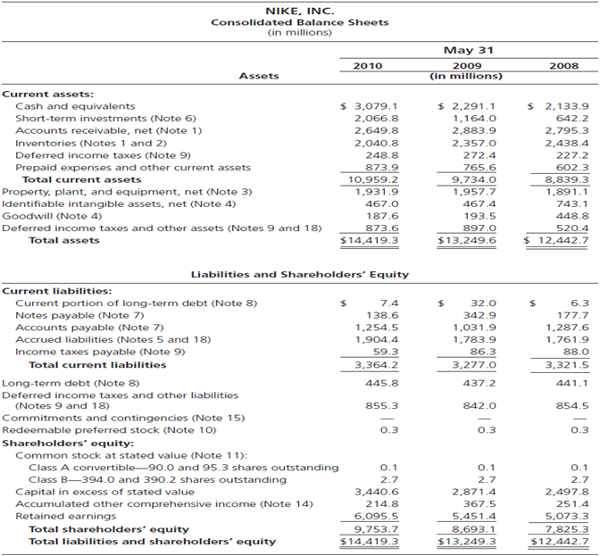
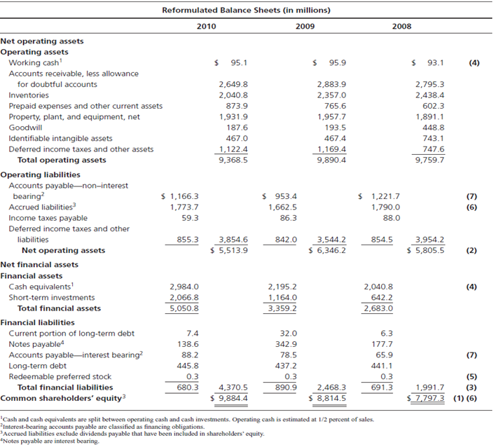
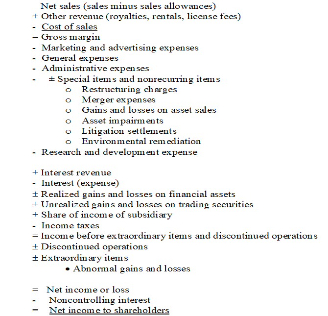
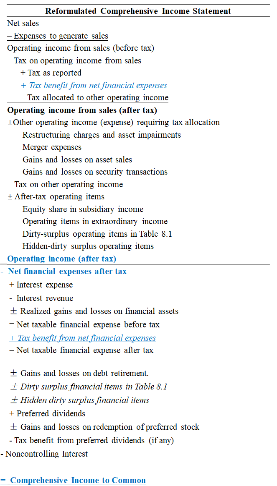
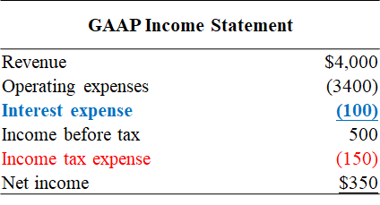
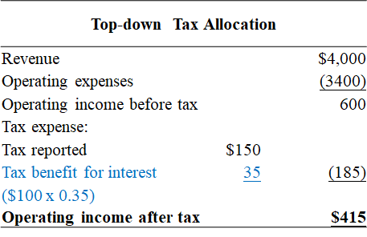
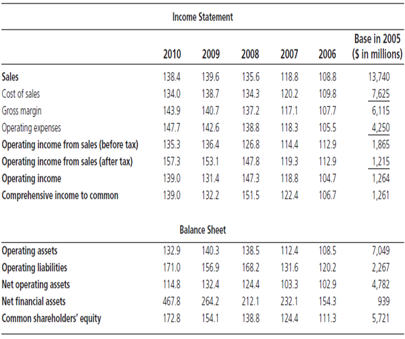

# The Analysis of the Balance Sheet and Income Statement

### Reformulating the Balance Sheet

#### Financial and Operating Items in the Balance Sheet
<mark>Financial assets</mark> are usually <mark>interest bearing</mark> assets, including
- cash equivalents
- short-term investments
- short-term notes receivable
- long-term non-marketable debt investments
- long-term marketable debt securities

Similarly, <mark>financial liabilities</mark> are usually interest bearing liabilities, including
- short-term borrowing
- short-term notes payable
- current maturities of long-term debt
- long-term borrowing (bank loans, bonds payable, notes payable)
- lease obligation
- preferred stock

Other items are operating assets or liabilities.

> [!NOTE]
> Cash is hard to classify since there is <mark>working cash</mark> that is <mark>operating</mark> asset and the remaining is <mark>excess cash</mark> that is <mark>financial</mark> asset.
> 
> Short-term notes receivable can have operating purpose. However, we usually classify it into financial assets. Similarly for short-term notes payable in financial liabilities.
> 
> Lease assets are <mark>operating</mark> assets that are included in <abbr title='Property, Plant and Equipment'>PPE</abbr> while lease liabilities are <mark>financial</mark> obligation.

#### Example: Reformulated Balance Sheet for Nike

GAAP Balance Sheet

Reformulated Balance Sheet

where working cash is splited from cash and cash equivalents and is estimated at $0.5\%$ of sales.

> [!NOTE]
> Remember that in [Chapter 9](courses/financial_statements_analysis/9_analysis_of_statement_of_shareholders_equity.md), we add back dividends payable to <abbr title="Common Shareholders' Equity">CSE</abbr>. So we need to exclude it in accrual liabilities (check the difference between <abbr title='Generally Accepted Accounting Principle'>GAAP</abbr> and reformulated balance sheet).

### Balance Sheet Leverage Ratios

#### Financial Leverage Ratios
$$
\begin{aligned}
 \text{Capitalization Ratio} &= \frac{\text{NOA}}{\text{CSE}}\\
 {}\\
 \text{Financial Leverage Ratio (FLEV)} &= \frac{\text{NFO}}{\text{CSE}}\\
\end{aligned}
$$

Since $\text{NOA}-\text{NFO}=\text{CSE}$, we have 
$$
\text{Capitalization Ratio} - \text{FLEV} = 1
$$

#### Operating Liability Leverage Ratio
$$
\text{Operating Liability Leverage Ratio (OLLEV)} = \frac{\text{OL}}{\text{NOA}}
$$

### Reformulating the Income Statement
Remember in [Chapter 8](courses/financial_statements_analysis/8_viewing_the_business_through_the_financial_statements.md#income-statement) we have seperated the income statement into <abbr title='Operating Income'>OI</abbr> and <abbr title='Net Financial Expenses'>NFE</abbr>. But there is an item that needs further consideration - <mark>income taxes</mark>.

Typical Income Statement

Reformulated Income Statement

<mark>Since net interest expense can be used for tax deduction and we would have more income taxes if we do not have net interest expense, we should move the tax benefit to income taxes.</mark>

#### Example: Tax Allocation
A company has the following income statement with tax rate $35\%$.

The operating income should be calculated as follow: 

The <abbr title='Net Financial Expenses'>NFE</abbr> would also exclude the tax benefit from interest expense.

### Residual Operating Income (ReOI)
$$
\text{ReOI}_t = \text{OI}_t - \text{NOA}_{t-1}\times \text{Required Return}
$$

show how operations add value to the book value of operations (similar idea to <abbr title='Residual Earnings'>RE</abbr>).

### Income Statement Ratios

#### Profit Margin Ratios

$$
\begin{aligned}
 \text{Operating Profit Margin} &= \frac{\text{OI (after tax)}}{\text{Sales}}\\
 {}\\
 \text{Sales Profit Margin} &= \frac{\text{OI (after tax) from Sales}}{\text{Sales}}\\
 {}\\
 \text{Other Items Profit Margin} &= \frac{\text{OI (after tax) from Other Items}}{\text{Sales}}\\
 {}\\
 \text{Net Profit Margin} &= \frac{\text{CI}}{\text{Sales}}\\
\end{aligned}
$$

#### Expense Ratios
$$
\begin{aligned}
 \text{Expense Ratio} &= \frac{\text{Expense for an Activity}}{\text{Sales}}\\
 {}\\
 1 - \text{Sales Profit Margin} &= \text{Sum of Expense Ratios}
\end{aligned}
$$

#### Operating Profitability: Return on NOA (RNOA)
$$
\text{RNOA}_t = \frac{\text{OI}_t}{1/2(\text{NOA}_{t-1}+\text{NOA}_t)}\\
$$

#### Financing Profitability: Net Borrowing Cost (NBC) or Return on NFA (RNFA)
$$
\text{NBC}_t = \frac{\text{NFE}_t}{1/2(\text{NFO}_{t-1}+\text{NFO}_t)}\\
$$

or
$$
\text{RNFA}_t = \frac{\text{NFI}_t}{1/2(\text{NFA}_{t-1}+\text{NFA}_t)}\\
$$

### Analysis Methods

#### Common Size Analysis
Common size analysis is a kind of cross-sectional analysis. We can compare 
- each item 
- total revenues

in the income statement and 
- operating items
- financing items
- total

in the balance sheet.

#### Trend Analysis
Trend analysis is a kind of time-series analysis. We set a base for a specific year and see how the following years go, e.g., 

where we set the base in 2005 to be $100$ for each item.