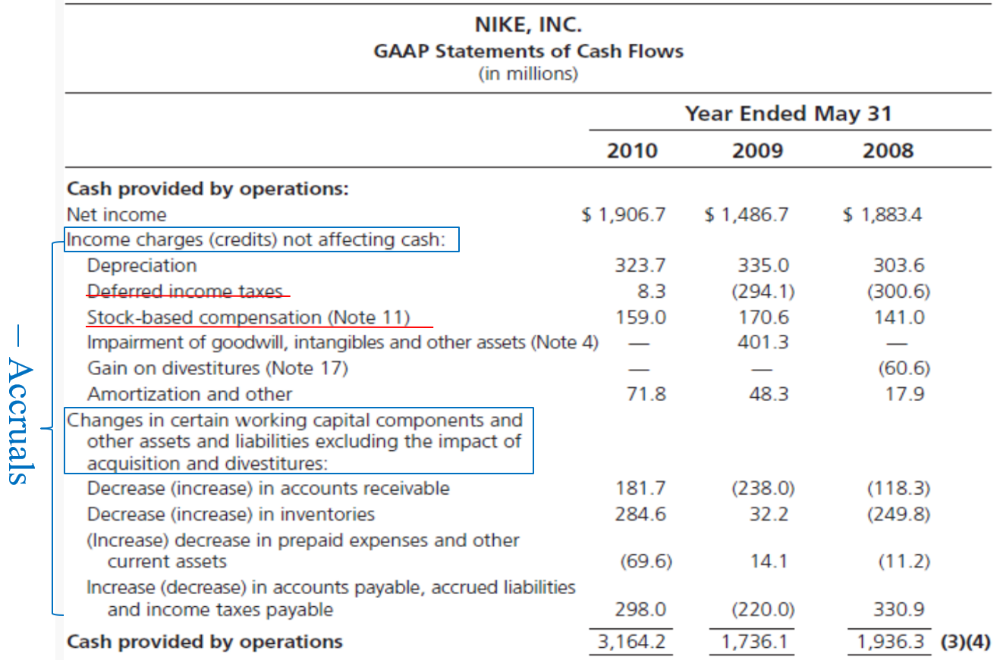
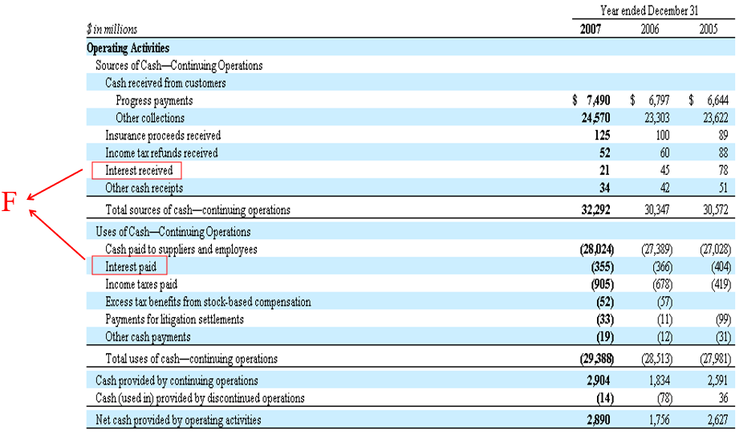
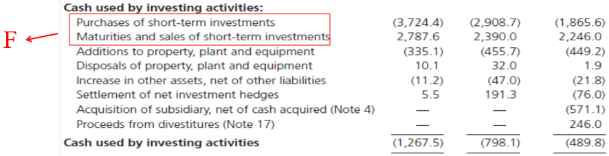
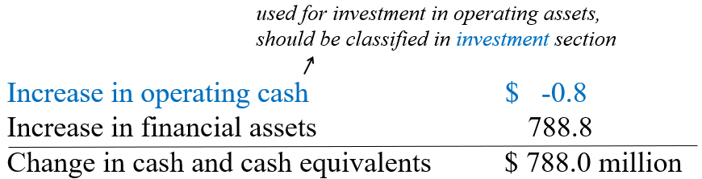
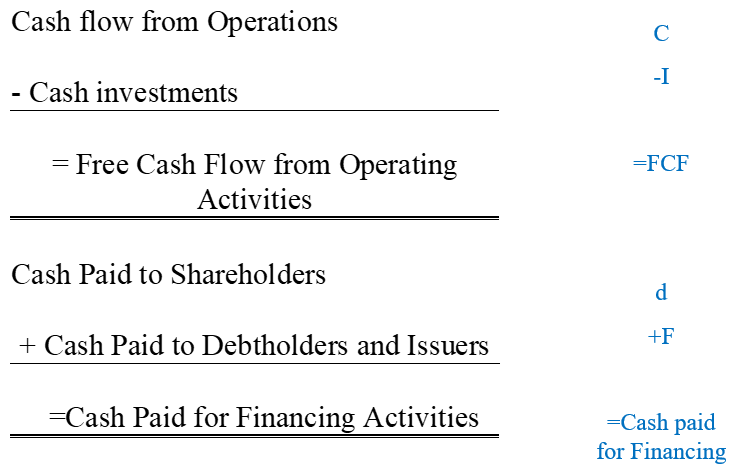

# Chapter 11: The Analysis of the Cash Flow Statement

### The Calculation of Free Cash Flow
In [Chapter 8](courses/financial_statements_analysis/8_viewing_the_business_through_the_financial_statements.md#articulation) we have introduced 2 methods to calculate <abbr title='Free Cash Flow'>FCF</abbr>: 
$$
\text{FCF} = \text{C} - \text{I} = \text{F} + \text{d}
$$

where 
$$
\begin{aligned}
 \text{C} &= \text{Cash Flow from Operations}\\
 {}\\
 \text{I} &= \text{Cash Investment in Operations}\\
 {}\\
 \text{F} &= \text{Net Cash Flow to Debtholders and Issuers}\\
 {}\\
 \text{d} &= \text{Net Cash Flow (Net Payout) to Shareholders}\\
\end{aligned}
$$

By refromulating the balance sheet, we have 
$$
\text{C} - \text{I} = \text{OI} - \Delta\text{NOA}
$$

and 
$$
\text{F} + \text{d} = \text{NFE} - \Delta\text{NFO} + \text{d} = \Delta\text{NFA} - \text{NFI} + \text{d}
$$

In this Chapter, we would introduce a new method to calculate <abbr title='Free Cash Flow'>FCF</abbr> by reformulating the cash flow statement.

### Reformulating the Cash Flow Statement
In the standard cash flow statement, there are 2 methods to derive <abbr title='Operating Cash Flow'>OCF</abbr>: 
- Indirect method
- Direct method

#### Indirect Method
Remember in [Chapter 4](courses/financial_statements_analysis/4_cash_and_accrual_accounting.md#earnings-and-cash-flows) we have shown that 
$$
\text{NI} = \text{OCF} + \text{Accruals}\\
$$

Indirect method is to put $-\text{Accruals}$ on the statement and thus we have 
$$
\text{OCF} = \text{NI} + (-\text{Accruals})
$$

#### Direct Method
Direct method is to directly put operating activities on the statement, e.g., 

where <mark>interest payments and receipts</mark> are improperly included in the operating activities (<mark>should be in the financial section</mark>). <mark>Tax cash flows</mark> are also all included in the operating activities (<mark>should be allocated to operating and financing</mark>).

Similarly, direct method directly put investing activities on the statement, e.g., 

where <mark>transactions in financial assets</mark> are imporperly included in the investing activities (shoud be in the financial section).

Remember in [Chapter 10](courses/financial_statements_analysis/10_analysis_of_balance_sheet_and_income_statement.md#example-reformulated-balance-sheet-for-nike) we have learned how to split working cash from cash and cash equivalents. So we should split *change in operating cash* from *change in cash and cash equivalents*, too.

Also, there are some non-cash transactions that should be adjusted: 
- Acquisitions with shares
- Asset exchanges
- Assets acquired with debt
- Capitalized leases
- Installment purchases
- Debt converted to equity

To sum up, we can adjust the following items to get <abbr title='Free Cash Flow'>FCF</abbr> or financing cash flow ($\text{F}$): 

Adjustments Summary

After reformulating, we have 

Reformulated Cash Flow Statement

However, the <abbr title='Free Cash Flow'>FCF</abbr> we get using the reformulating method may not reconcile to the 2 methods we have learned.

#### Reasons for Different FCF
- *Other assets* and *Other liabilities* are not identified as either operating or financing;
- *Cash dividends* in the cash flow statement differ from dividends in the equity statement;
- *Cash from share issues* in the cash flow statement may differ from share issues in the equity statement;
- Details for adjustments are not available;
- <abbr title='Generally Accepted Accounting Principle'>GAAP</abbr>'s treatment of employee stock options (see [Chapter 9](courses/financial_statements_analysis/9_analysis_of_statement_of_shareholders_equity.md#hidden-losses-in-options));
- Cash flow numbers of *foreign subsidiaries* are translated at average exchange rates whereas balance sheet numbers are translated at end-of-year exchange rates.