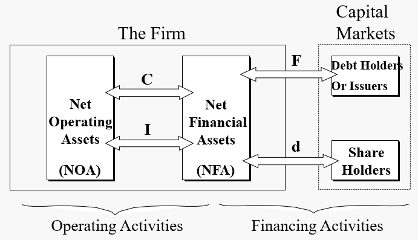
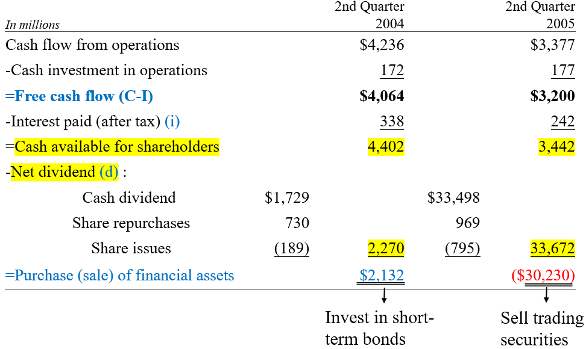
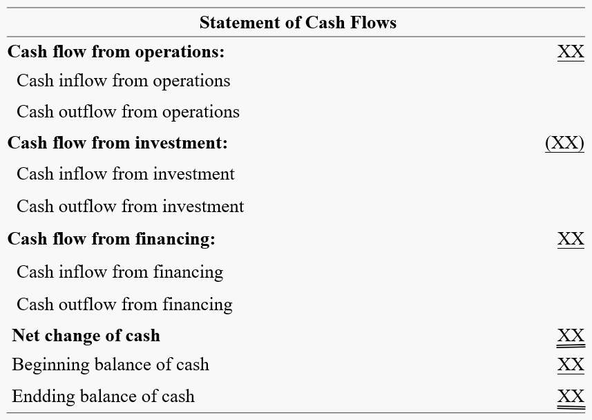
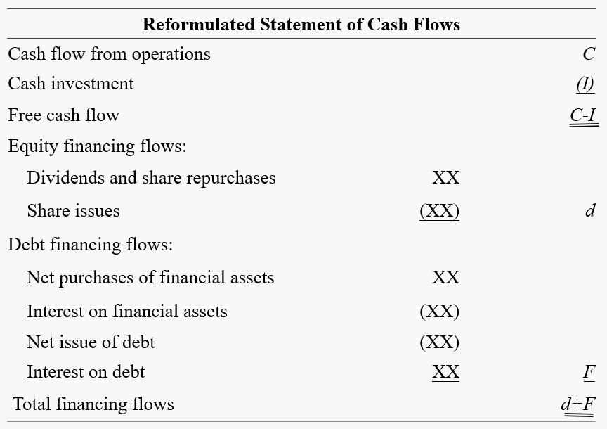
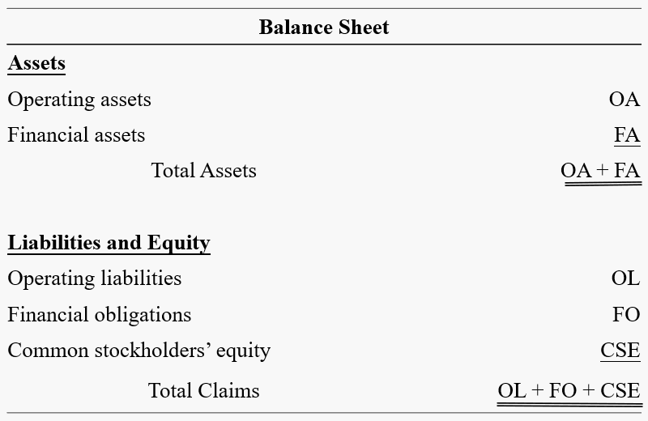
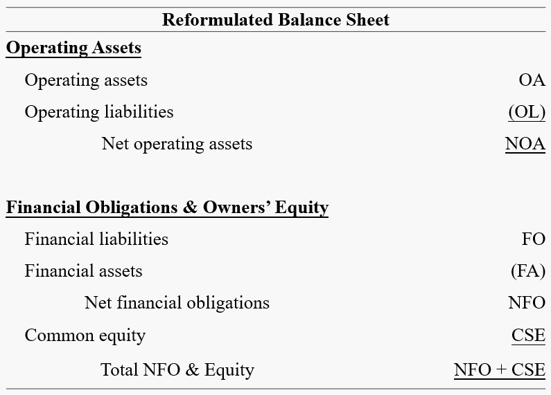
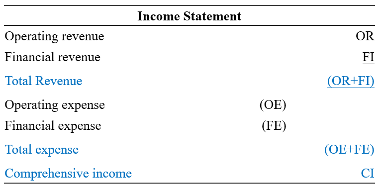
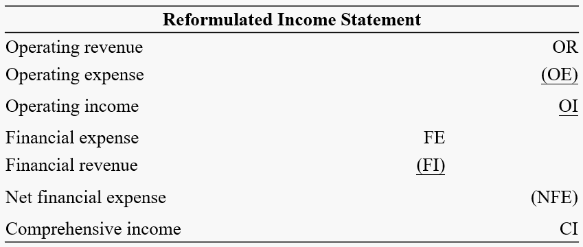
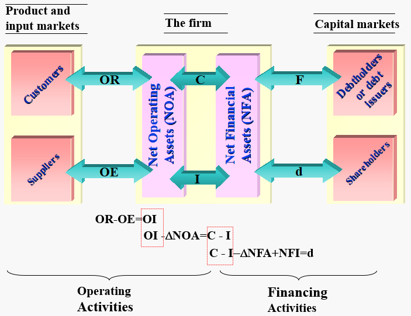
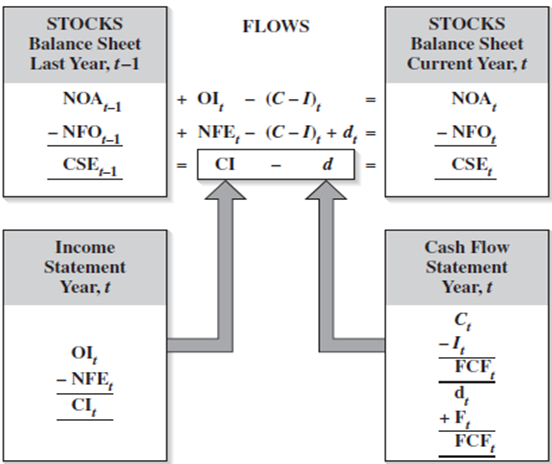

# Chapter 8: Viewing the Business through the Financial Statements

### Operating and Financing Assets

#### Articulation

where 
$$
\begin{aligned}
 \text{C} &= \text{Cash Flow from Operations}\\
 {}\\
 \text{I} &= \text{Cash Investment in Operations}\\
 {}\\
 \text{F} &= \text{Net Cash Flow to Debtholders and Issuers}\\
 {}\\
 \text{d} &= \text{Net Cash Flow (Net Payout) to Shareholders}\\
\end{aligned}
$$

Note that we have 
$$
\text{C} - \text{I} = \text{F} + \text{d}
$$

where $\text{C} - \text{I}$ is actually the <abbr title='Free Cash Flow'>FCF</abbr>, and 
$$
\begin{aligned}
 \text{F} &= \text{Net Principal Payments} + \text{Net Interest Paid (i)}\\
 \text{d} &= \text{Common Dividends} + \text{Share Repurchases} - \text{Share Issues}
\end{aligned}
$$

> [!TIP]
> For <abbr title='Free Cash Flow'>FCF</abbr>, go back to [Chapter 4](courses/financial_statements_analysis/4_cash_and_accrual_accounting.md#free-cash-flow) for a review; for net payout to shareholders, go back to [Chapter 2](courses/financial_statements_analysis/2_financial_statements.md#statement-of-shareholders39-equity) for a review.

#### The Treasurer's Rule
- If $\text{C} - \text{I} - \text{i} > \text{d}$, which means more money can be used, then we can lend money out or buy down own debt.
- If $\text{C} - \text{I} - \text{i} < \text{d}$, which means less money can be used, then we can borrow money or reduce lending.

#### Example: Actions of Microsoft's CFO

In 2004, the <abbr title='Free Cash Flow'>FCF</abbr> of Microsoft is $\text{\textdollar}4,064 \text{ million}$ and the after-tax interest paid is $\text{\textdollar}338 \text{ million}$, while net dividend is just $\text{\textdollar}2,270 \text{ million}$. Using the treasurer's rule, the CFO can invest $\text{\textdollar}2,132 \text{ million}$ in short-term bonds.

In 2005, the <abbr title='Free Cash Flow'>FCF</abbr> of Microsoft is $\text{\textdollar}3,200 \text{ million}$ and the after-tax interest paid is $\text{\textdollar}242 \text{ million}$, while net dividend is $\text{\textdollar}33,672 \text{ million}$. Using the treasurer's rule, the CFO may sell $\text{\textdollar}30,230 \text{ million}$ of trading securities.

### Reformulated Statements

#### Statement of Cash Flows

Typical Statement of Cash Flows

$$
\Big\Darr
$$

Reformulated Statement of Cash Flows

#### Statement of Balance Sheet

Typical Statement of Balance Sheet

$$
\Big\Darr
$$

Reformulated Statement of Balance Sheet

From above we have 
$$
\text{NOA} = \text{NFO} + \text{CSE}
$$

where 
$$
\begin{aligned}
 \text{NOA} &= \text{Net Operating Assets} = \text{Operating Assets} - \text{Operating Liabilities}\\
 {}\\
 \text{NFO} &= \text{Net Financial Obligations} = \text{Financial Liabilities} - \text{Financial Assets}\\
 {}\\
 \text{CSE} &= \text{Common Shareholders' Equity}
\end{aligned}
$$

#### Income Statement
We split revenue and expense to be <mark>operating revenue (OR)</mark>, <mark>financial income (revenue) (FI)</mark>, <mark>operating expense (OE)</mark> and <mark>financial expense (FE)</mark>. Typically, we have 
$$
(\text{OR} + \text{FI}) - (\text{OE} + \text{FE}) = \text{CI}
$$

where <mark>$\text{CI}$ is comprehensive income</mark>.

Typical Income Statement

$$
\Big\Darr
$$

Reformulated Income Statement

From above we can see that the reformulation just change the categorization from **revenue and expense** to **operating and financing**, i.e. 
$$
\begin{aligned}
 (\text{OR} + \text{FI}) - (\text{OE} + \text{FE}) &= \text{CI}\\
 (\text{OR} - \text{OE}) - (\text{FE} - \text{FI}) &= \text{CI}\\
 \text{OI} - \text{NFE} &= \text{CI}\\
\end{aligned}
$$

where <mark>$\text{OI}$ is operating income</mark> and <mark>$\text{NFE}$ is net financial expenses</mark>.

### Total Articulation

where <mark>$\text{NFI}=-\text{NFE}$ is net financial income</mark>.

> [!TIP]
> You may be curious about why $\text{OI} - \Delta \text{NOA} = \text{C}-\text{I}$. We write it in another way: 
> $$
> \text{NOA}_t = \text{NOA}_{t-1} + \text{OI}_t - \text{FCF}_t
> $$
> 
> i.e., <mark>we receive operating income and split it into 2 parts - free cash flow (to use) and net operating assets (to hold)</mark>.
> 
> Since $\text{CSE} = \text{NOA} - \text{NFO}$ in [reformulated statement of balance sheet](#statement-of-balance-sheet), we have 
> $$
> \begin{aligned}
>  \text{CSE}_t &= \text{CSE}_{t-1} + \text{CI}_t - \text{d}_t\\
>  \text{NOA}_t - \text{NFO}_t &= \text{NOA}_{t-1} - \text{NFO}_{t-1} + \text{CI}_t - \text{d}_t\\
>  \text{OI}_t - \text{FCF}_t - \text{NFO}_t &= -\text{NFO}_{t-1} + \text{CI}_t - \text{d}_t\\
> \end{aligned}
> $$
> 
> Note that $\text{OI}_t - \text{NFE}_t = \text{CI}_t$ in [reformulated income statement](#income-statement), we have 
> 
> $$
> \begin{aligned}
>  \text{NFO}_t &= \text{NFO}_{t-1} + \text{NFE}_t - \text{FCF}_t + \text{d}_t\\
>  \text{NFA}_t &= \text{NFA}_{t-1} + \text{NFI}_t + (\text{C}_t - \text{I}_t) - \text{d}_t\\
> \end{aligned}
> $$
> 
> which means <mark>free cash flow is used to pay net financial expenses and dividends, as well as to reduce net financial obligations</mark>.
> 
> Thus, $\text{C} - \text{I} - \Delta\text{NFA} + \text{NFI} = \text{d}$.

Finally, we have 

> [!TIP]
> $-(\text{C}-\text{I})_t + \text{d}_t$ is actually $\text{F}_t$.