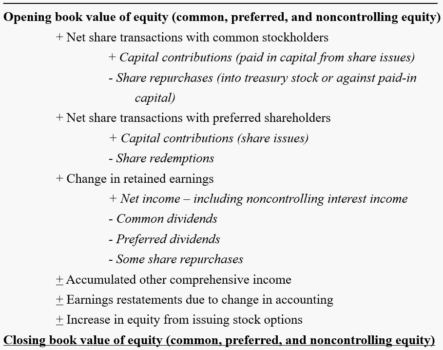
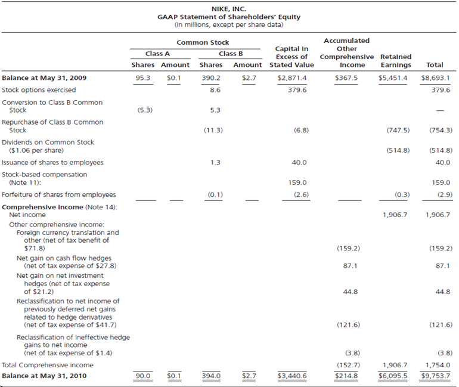
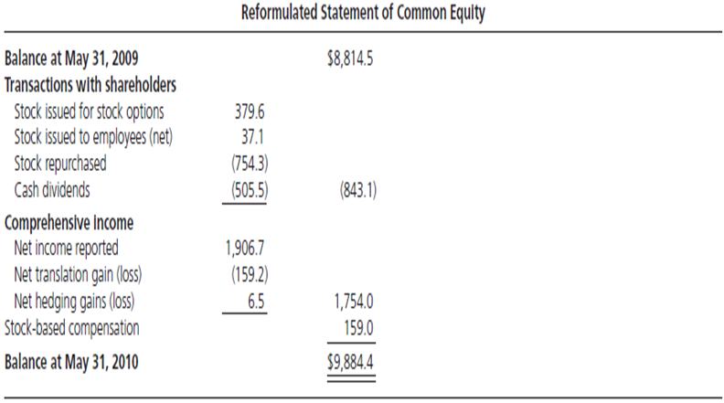
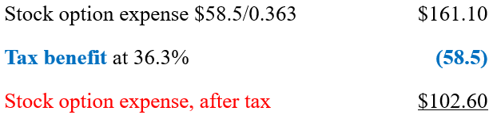
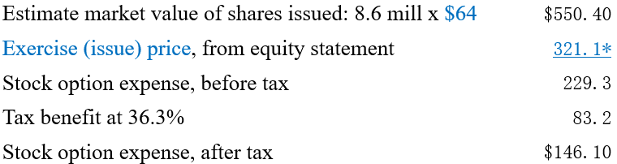
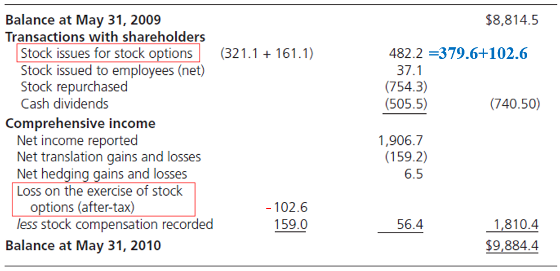

# Chapter 9: The Analysis of the Statement of Shareholders' Equity

### Reformulated Statement of Common Stockholders' Equity

GAAP Statement of Shareholders' Equity

$$
\Big\Darr
$$

Reformulated Statement of Common Stockholders' Equity

where <abbr title="Common Shareholders' Equity">CSE</abbr> is given by 
$$
\text{CSE} = \text{Total Equity} - \text{Preferred Stock} - \text{Noncontrolling Interest} + \text{Dividends Payable}
$$

and common dividends is actually <mark>cash dividends</mark> given by
$$
\text{Cash Dividends} = \text{Dividends Declared} - \text{Change in Dividends Payable}
$$

<mark>Other comprehensive income</mark> includes 
- currency <mark>translation</mark> gains and losses (caused by the change of exchange rate from the day it is realized to the day it is recognized);
- <mark>unrealized</mark> gains and losses on securities (debt and equity);
- <mark>hedging</mark> gains and losses (gains and losses on derivative instruments).

These 3 items are also called <mark>dirty surplus</mark>.

> [!TIP]
> Other comprehensive income is income that out of control, i.e., it is not about company's management.

#### Example: Reformulate Statement of Common Stockholder's Equity for Nike
The GAAP statement of shareholders' equity is shown below: 

The dividens payable at the beginning is $\text{\textdollar}121.4$ and at the end is $\text{\textdollar}130.7$.

First, <abbr title="Common Shareholders' Equity">CSE</abbr> at the beginning is $\text{\textdollar}8,693.1+\text{\textdollar}121.4=\text{\textdollar}8814.5$ and at the end is $\text{\textdollar}9,753.7+\text{\textdollar}130.7=\text{\textdollar}9884.4$.

Then, we should identify share issues. Note that <mark>stock options exercised is seen as a type of share issues</mark> and <mark>shares forfeited from employees would be treasury stock</mark>. Thus, we have
$$
\begin{aligned}
 \text{Share Issues} &= \text{Stock Options Exercised} + \text{Issuance of Shares to Employees}\\ &\quad - \text{Forfeiture of Shares from Employees}\\ 
 &= \text{\textdollar}416.7
 \\
\end{aligned}
$$

And cash dividends is given by
$$
\begin{aligned}
 \text{Cash Dividends} &= \text{Dividends Declared} - \text{Change in Dividends Payable}\\
 &= \text{\textdollar}514.8 - (\text{\textdollar}130.7-\text{\textdollar}121.4)\\
 &= \text{\textdollar}505.5
\end{aligned}
$$

Also, we can calculate that net hedging gains or losses is $\text{\textdollar}87.1 + \text{\textdollar}44.8 - \text{\textdollar}121.6 - \text{\textdollar}3.8 = \text{\textdollar}6.5$.

Note that the item <mark>*Stock-based compensation* is also a part of comprehensive income.</mark>

Finally, we have 

### Hidden Losses in Options
Shareholders lose when shares are issued at a price less than the market price, e.g., when options are exercised. This loss is not recorded as expense under <abbr title='Generally Accepted Accounting Principle'>GAAP</abbr> and <abbr title='International Financial Report Standard'>IFRS</abbr>.

There are 2 cases for this loss:
- If the loss comes from the exercise of options that are a part of a <mark>compensation package</mark>, then the loss is an <mark>employee compensation expense</mark>;
- if the loss comes from conversion of a bond, preferred stock or warrants, then the loss is a <mark>financing expense</mark>.

#### Example: Options for Employee
A company grants $100$ shares options to $10$ members of its executive management team on Jan 1, 2015. Each executive manager has the right to buy $10$ shares of the company's stock at $\text{\textdollar}13$ if he serves the company for $3$ years. Each option has a fair value $\text{\textdollar}15$ at the date of grant.

Assume the company records its financial statements every half a year. On June 30, 2015, i.e., after half a year, the company expects that all $100$ shares options will vest in the future. Therefore it records 
$$
\frac{100\times \text{\textdollar15}}{6} = \text{\textdollar}250
$$

as its option expense at <mark>debit side</mark> and as its paid in capital at <mark>credit side</mark> since the $3$-year period is divided to $6$ half-a-year periods.

> [!TIP]
> For assets, debit side is + and credit side is -; for liabilities and equity, debit side is - and credit side is +. If there is a change in debit side, then there must be a change in credit side.

One member of the executive management team leaves during the second half of 2016, therefore forfeiting $10$ options. Thus, on Dec 31, 2016, it should change the number to record. Suppose there was only $9$ members at the beginning, then the company should record 
$$
\frac{90\times \text{\textdollar}15}{6} = \text{\textdollar}225
$$

every reporting period. However, the company has recorded $\text{\textdollar}250 \times 3=\text{\textdollar}750$. Thus, the number recorded on Dec 31, 2016 should be 
$$
\text{\textdollar}225\times 4 - \text{\textdollar}750 = \text{\textdollar}150
$$

and it will record $\text{\textdollar}225$ in the following periods.

The remaining $9$ members exercise the options on Dec 31, 2017, when the company's stock price is $\text{\textdollar}18$. The company first records $\text{\textdollar}225$ at both debit and credit side. Then, it will record $90\times \text{\textdollar}13=\text{\textdollar}1170$ as cash received and $90\times \text{\textdollar}225=\text{\textdollar}1350$ as paid in capital at debit side, and record $90$ common stock with par value $\text{\textdollar}1$ and the remaining $\text{\textdollar}1170+\text{\textdollar}1350-\text{\textdollar}90=\text{\textdollar}2430$ as paid in capital in excess of par value at credit side.

However, this recording method omits the actual loss $(\text{\textdollar}18-\text{\textdollar}13)\times 90=\text{\textdollar}450$. We can use 2 different methods to do the adjustment.

According to <abbr title='Internal Revenue Service'>IRS</abbr>, this loss (from <mark>non-qualified options</mark>) can be used for tax deduction. Suppose the tax rate is $36.3\%$, then this tax benefit implies $\frac{\text{\textdollar}450}{36.3\%}=\text{\textdollar}1239.67$ of expense, which means the after-tax expense is $\text{\textdollar}1239.67-\text{\textdollar}450=\text{\textdollar}789.67$.

The other method is used when tax benefit is not reported or when the loss is from <mark>incentive options</mark> (<abbr title='Internal Revenue Service'>IRS</abbr> does not allow tax decuction). We first calculate the average stock price $\frac{\text{\textdollar15+\text{\textdollar}18}}{2} = \text{\textdollar}16.5$. Then, the after-tax expense is given by $(\text{\textdollar}16.5-\text{\textdollar}13)\times 90\times (1-36.3\%)=200.66$.

> [!TIP]
> Stock-based compensation includes non-qualified options and incentive (qualified) options. Incentive options have favorable tax treatment for employees, and thus have many restrictions for a company to grant (e.g., only available to employees, maximal issuance, etc.). The cost of non-qualified options can be deducted as an operating expense while that of incentive options cannot.

#### Example: Reformulate Statement of Common Stockholder's Equity for Nike (Continued)
Using the first method, the tax benefit and its implication are shown below.

Using the second method, we have

This after-tax expense is also called <mark>option overhang</mark> or <mark>contingent liability</mark>, which <mark> should be deducted in comprehensive income and added in shares issues</mark>: 

where stock issues for stock options can be calculated by <mark>sum of capital in excess of stated value and after-tax expense</mark> (the right side) or by <mark>sum of proceeds from exercise and before-tax expense</mark> (the left side).

### Ratio Analysis from Reformulated Common Equity Statement

#### Payout and Retention Ratios
$$
\text{Dividend Payout Ratio} = \frac{\text{Dividends}}{\text{Comprehensive Income}}\\
{}\\
\text{Total Payout Ratio} = \frac{\text{Dividends}+\text{Stock Repurchases}}{\text{Comprehensive Income}}\\
{}\\
\text{Retention Ratio} = \frac{\text{Comprehensive Income}-\text{Dividends}}{\text{Comprehensive Income}}=1-\text{Dividend Payout Ratio}\\
{}\\
\text{Dividends-to-Book Value} = \frac{\text{Dividends}}{\text{Book Value of CSE}+\text{Dividends}+\text{Stock Repurchases}}\\
{}\\
\text{Total Payout-to-Book Value} = \frac{\text{Dividends}+\text{Stock Repurchases}}{\text{Book Value of CSE}+\text{Dividends}+\text{Stock Repurchases}}\\
$$

#### Shareholder Profitability Ratio
$$
\text{ROCE}_t = \frac{\text{Comprehensive Earnings}_t}{1/2(\text{CSE}_t+\text{CSE}_{t-1})}
$$

#### Growth Ratios
$$
\text{Net Investment Rate} = \frac{\text{Transactions with Shareholders}}{\text{Beginning CSE}}\\
{}\\
\text{Growth Rate of CSE} = \frac{\text{Change in CSE}}{\text{Beginning CSE}} = \frac{\text{Net Transactions with Shareholders}+\text{Comprehensive Income}}{\text{Beginning CSE}}
$$