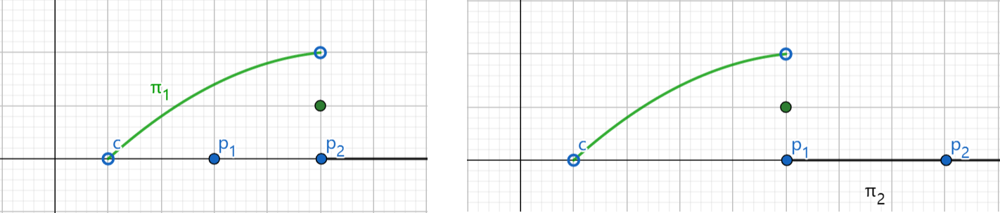

# Nash Equilibrium: Existence, Multiple Equilibria and Mixed Strategies

### Multiple Equilibria
There can be several Nash equilibria in a game, so which equilibrium would players reach?

#### Payoff Dominance (Pareto Dominance)
Payoff dominance means players would reach a equilibrium that each player gets higher payoff than in other equilibria. For example, see the following payoff table: 

|                |             Friendly              |            Aggressive             |
| :------------: | :-------------------------------: | :-------------------------------: |
|  **Friendly**  | $\underline{50},\ \underline{50}$ |             $0,\ 40$              |
| **Aggressive** |             $40,\ 0$              | $\underline{20},\ \underline{20}$ |

The payoff table above shows that there are 2 Nash equilibria. According to payoff dominance, players will reach the equilibrium $(\text{Friendly},\ \text{Friendly})$.

#### Risk Dominance
Different from payoff dominance, risk dominance means players may reach a equilibrium that each player has lower risk than in other equilibria. We consider the same game but with different payoff diagram: 

|                |            Friendly             |           Aggressive            |
| :------------: | :-----------------------------: | :-----------------------------: |
|  **Friendly**  | $\underline{9},\ \underline{9}$ |             $0,\ 8$             |
| **Aggressive** |             $8,\ 0$             | $\underline{7},\ \underline{7}$ |

In this case, Pareto dominant equilibrium may not be reached because the difference of payoffs between 2 equilibria is small and being friendly takes more risk. If players both choose to be friendly, then player 1 gets $9$. However, if player 2 chooses to be aggressive, then player 1 gets $0$, which means being friendly is riskier. Thus, the equilibrium $(\text{Aggressive},\ \text{Aggressive})$ may be reached.

### Mixed Strategies
What we have talked about in previous chapters are <mark>pure strategies</mark>, i.e., players choose their strategies definitely (without randomness). Mixed strategies consider randomness between different pure strategies.

#### Example: Matching Pennies
Consider a matching pennies game with the following payoffs: 

where $\text{H}$ represents "Head" and $\text{T}$ represents "Tail".

Player 1 gets $1$ when pennies are matched, otherwise gets $-1$. Player 2 has the reverse payoff diagram. These 2 players randomly take actions with some probabilities.
  
Given the other's strategy, their expected payoffs are 

|              |        $\text{H}$         |        $\text{T}$         |
| :----------: | :-----------------------: | :-----------------------: |
| **Player 1** | $q_2 - (1-q_2) = 2q_2-1$  | $-q_2 + (1-q_2) = 1-2q_2$ |
| **Player 2** | $-q_1 + (1-q_1) = 1-2q_1$ | $q_1 - (1-q_1) = 2q_1-1$  |

We can easily see that the best responses of these 2 players are  
$$
B_1(q_2) = \begin{cases}
  \text{T},& 0\leqslant q_2<0.5 \\
  \text{H or T},& q_2=0.5 \\
  \text{H},& q_2>0.5 \\
\end{cases}B_2(q_1) = \begin{cases}
  \text{H},& 0\leqslant q_1<0.5 \\
  \text{H or T},& q_1=0.5 \\
  \text{T},& q_1>0.5 \\
\end{cases}
$$

which means the relationship between $q_1$ and $q_2$ is 
$$
q_1(q_2) = \begin{cases}
  0,& 0\leqslant q_2<0.5 \\
  [0,\ 1],& q_2=0.5 \\
  1,& q_2>0.5 \\
\end{cases}q_2(q_1) = \begin{cases}
  1,& 0\leqslant q_1<0.5 \\
  [0,\ 1],& q_1=0.5 \\
  0,& q_1>0.5 \\
\end{cases}
$$

> [!TIP]
> The $[0,\ 1]$ comes because $\text{H}$ and $\text{T}$ are both best responses when the other player has $0.5$ probability to choose "Head" or "Tail" and taking any probability does not affect the expected payoff.
  
It can be drawn like this: 

Then the Nash equilibrium is reached at the intersection, i.e., when $q_1 = q_2 = 0.5$.

### Existence of Nash Equilibrium
A Nash equilibrium exists in game $\Gamma_{n}=\{I,\ \{S_i\},\ \{u_i(\cdot)\}\}$ if $\forall i \in I$, 
- $\forall S_i$ are nonempty, convex and compact (closed and bounded) subsets of some Euclidean space $\mathbb{R}^{M}$;
- $\forall u_i(s),\ s\in S$ are continuous and quasiconcave in $S_i$.

> [!NOTE]
> The existence conditions above are <mark>sufficient but not necessary</mark>.

Proof

Remember that a Nash equilibrium can be written as $s \in B(s)$. Thus, it suffices to prove the map $B:\ S \to S$ has a fixed point.

Consider discrete actions with mixed strategies. The pattern of continuous cases is similar.

First, $S_i$ is nonempty and compact, and $u_i(s)$ is continuous, then the best response set $B_i(s_{-i})$ is nonempty.
  
Then, if $u_i(s)$ is quasiconcave in $S_i$, i.e., any mixed strategy is at least better than one of the pure strategies, then $B_i(s_{-i})$ is convex, which means a combination of best responses of player $i$ is still a best response of it. For example, if there are 2 best responses that maximize the payoff, then the mixed strategies of them would also maximize the payoff and hence are best responses.

A function that is not quasiconcave

  
> [!NOTE]
> This is always satisfied for discrete cases because there are just straight lines between discrete points, but for continuous cases, the payoff patterns may be different, see the function above.
  
Furthermore, since $\forall u_i(s)$ are continuous, the map $B$ has a closed graph, i.e., for all sequences $\{x_n\}$ and $\{y_n\}$ s.t. $y_n \in B(x_n),\ \forall n$, $x_n \to x$, $y_n \to y$, we have $y \in B(x)$.

According to Kakutani's fixed point theorem, there exists a fixed point $s^{*} \in B(s^{*})$, which means the Nash equilibrium exists.

> [!TIP]
> **Kakutani's fixed point theorem** 
Let $X$ be a compact convex subset of $\mathbb{R}^{M}$ and let $f:\ X \to X$ be a set-valued function for which  1. $\forall x \in X$, the set $f(x)$ is nonempty and convex; 2. the graph of $f$ is closed. 
Then there exists $x^{*} \in X$ s.t. $x^{*} \in f(x^{*})$.

Thus, every game $\Gamma_{n}=\{I,\ \{S_i\},\ \{u_i(\cdot)\}\}$ in which the sets $\{S_i\}$ have a finite number of elements has a mixed strategy Nash equilibrium.

> Now let us see some examples that we can not use the proposition above to judge.

### Cournot Equilibrium and Bertrand Equilibrium

#### Cournot Equilibrium
Consider a <mark>duopoly</mark> market. The cost functions of 2 firms are $c(q_i) = c\cdot q_i$ for constant $c$ and $i=1,\ 2$. $q_i$ is the quantity of production of firm $i$. The inverse demand function (price function) is $P(Q) = 1 - Q$ (<mark>same price</mark>) where $Q = q_1 + q_2$ is the total quantity of production.

Thus, the profit of firm $1$ is 
$$
\pi_1(q_1,\ q_2) = P(Q)\cdot q_1 - c(q_i) = (1-q_1-q_2)q_1 - c\cdot q_1
$$

and similarly for firm $2$.

We can see that $\{q_i\}$ is not bounded, which means we can not directly use the proposition above to judge whether there exists a Nash equilibrium. So we check the <abbr title='First Order Condition'>FOC</abbr>: 
$$
\begin{cases}
 1 - 2q_1 - q_2 - c = 0\\
 1 - q_1 - 2q_2 - c = 0
\end{cases}\implies q_1^{*} = q_2^{*} = \frac{1-c}{3}
$$

Actually this can be generalized to $n$ firms. For a $n$-oligopolies market, the optimal quantity for firm $i$ is $q_i^{*} = \frac{1-c}{1+n}$.

> The inverse demand function here is fixed. However, the relation between demand and price can change. See [Cournot with Uncertain Demand](/courses/game_theory/5_games_of_incomplete_information.md#example-cournot-with-uncertain-demand).

#### Bertrand Equilibrium
Still consider the same duopoly market, but now the 2 firms <mark>select prices rather than quantities</mark>. Assume consumers only buy from the firm with the lowest price and split evenly between the 2 firms when the prices are equal. The profit of firm $1$ is 
$$
\pi_1(p_1,\ p_2) = 
\begin{cases}
  0,& p_1>p_2 \\
  \frac{1}{2}(1-p_1)(p_1-c),& p_1=p_2 \\
  (1-p_1)(p_1-c),& p_1<p_2 \\
\end{cases}
$$

and similarly for firm $2$.

We can easily see that the profit functions are discontinuous, which means we cannot say immediately that if there exists a Nash equilibrium. Consider cases below: 
- when $p_2>p_1>c$, 

  

  
  

  firm $2$ would lower $p_2$ to get positive profit, which means this cannot be a Nash equilibrium;
- when $p_2=p_1>c$, the 2 firms both get positive profit. However, each firm would lower its price to get higher profit, which means this also cannot be a Nash equilibrium.

Thus, the Nash equilibrium would be $(c,\ c)$.