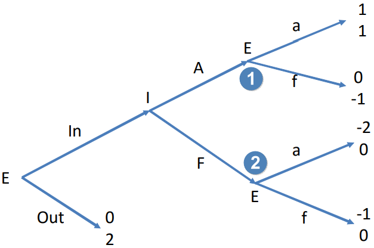
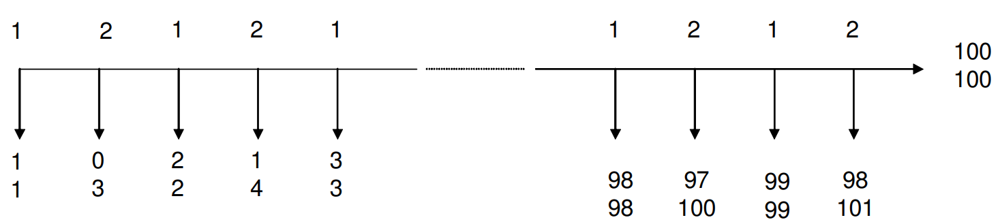

## Sequential-Move Games (Extensive Form Games)

### Easy Understanding
Players choose actions in a particular sequence instead of choosing actions simultaneously (normal form games).

#### Example: Enter in the Market
Consider an incumbent $\text{I}$ and an entrant $\text{E}$. The entrant can choose to enter in ($\text{In}$) the market or stay out ($\text{Out}$) of it. If the entrant choose to enter in, the incumbent can choose to accommodate ($\text{A}$) or fight ($\text{F}$). After the incumbent has acted, the entrant can also choose to accommodate ($\text{a}$) or fight ($\text{f}$).

We use a game tree to represent the payoff pattern where the first number is the payoff of the player who choose actions first while the second one is the payoff of the other player: 

Since the player who choose actions first is $\text{E}$, he will get $1$, $0$, $-2$, $-1$ respectively in the end (from top to bottom).

Look at the last 2 nodes for $\text{E}$. At the first one, the best response for the entrant is $\text{a}$; at the second one, the best response for him can be $\text{a}$ or $\text{f}$. The game starting at each node is called a <mark>subgame</mark>.

Then we go backward to the node $\text{I}$. The payoff of choosing $\text{A}$ is $1$ since the rational entrant would choose to accommodate ($\text{f}$ is not <mark>sequentially rational</mark>); the payoff of choosing $\text{F}$ is $0$. Thus, the best response of the incumbent is $\text{A}$. Similarly, the game starting at node $\text{I}$ is also a subgame.

At the leftmost node $\text{E}$, if the entrant choose to enter in, then the rational incumbent would choose $\text{A}$ and the entrant will finally get payoff $1$; if the entrant choose to stay out, then he will get payoff $0$. So the best response of the entrant is to enter in the market.

Hence, we obtain the equilibrium outcome $(\text{In},\ \text{A},\ \text{a})$ that is a sequence of actions. The method we have used to derive the outcome is called <mark>backward induction</mark>.

#### Perfect Information
Players have the same and full information.

### Formal Definition
An extensive form game with perfect information has the following components: 
- A set of <mark>players</mark>, $I$.

  In the game above, the set of players $I = \{\text{E},\ \text{I}\}$.
- A set of possible <mark>histories</mark> of previous events, $H$, that satisfies the following properties: 
  - The initial history $\emptyset$ is a member of $H$.
  - If a history of previous events $(a^{k})_{k=1,\ \cdots,\ K} \in H$, then $(a^{k})_{k=1,\ \cdots,\ L} \in H\ (L<K)$.
  - If an infinite sequence $(a^{k})_{k=1,\ \cdots}$ satisfies $(a^{k})_{k=1,\ \cdots,\ L} \in H$, $\forall L>0$, then $(a^{k})_{k=1,\ \cdots} \in H$.
  - Perfect information: After every history $(a^{k})_{k=1,\ \cdots,\ K}$, each player is perfectly informed of $(a^{k})_{k=1,\ \cdots,\ K}$, i.e., all the previous events of the history.

  The set of possible histories $H = \{\emptyset,\ \text{In},\ \text{Out},\ (\text{In},\ \text{A}),\ (\text{In},\ \text{F}),\ (\text{In},\ \text{A},\ \text{a}),\ (\text{In},\ \text{A},\ \text{f}),\ (\text{In},\ \text{F},\ \text{a}),\ (\text{In},\ \text{F},\ \text{f})\}$.
- A <mark>player function</mark> $P$ that assignsa a player $i\in I$ to each nonterminal history, i.e., $P(h)$ is the player who takes an action after the history $h$.

  > [!TIP]
  > A history $(a^{k})_{k=1,\ \cdots,\ K}$ is <mark>terminal</mark> if it is infinite or if there is no $(a^{k})_{k=1,\ \cdots,\ K+1}$ s.t. $(a^{k})_{k=1,\ \cdots,\ K+1} \in H$. For a set of terminal histories $Z$, $H\setminus Z$ is <mark>nonterminal</mark>. A nonterminal history also denotes a <mark>decision node</mark>.

  The set of terminal histories $Z = \{\text{Out},\ (\text{In},\ \text{A},\ \text{a}),\ (\text{In},\ \text{A},\ \text{f}),\ (\text{In},\ \text{F},\ \text{a}),\ (\text{In},\ \text{F},\ \text{f})\}$.

  Decision nodes: $\emptyset$, $\text{In}$, $(\text{In},\ \text{A})$ and $(\text{In},\ \text{F})$.

  $P(\emptyset)=\text{E}$, $P(\text{In})=\text{I}$ and $P((\text{In},\ \text{A}))=P((\text{In},\ \text{F}))=\text{E}$.
- <mark>Payoff functions</mark> $\{u_i\}$ for players.
- <mark>Strategy functions</mark> $\{s_i\}$ that assign an action $a\in A(h)$ to every nonterminal history, where $A(h)$ is the action set of player $P(h)=i$.

  $A(\emptyset)=\{\text{In},\ \text{Out}\}$, $A(\text{In})=\{\text{A},\ \text{F}\}$ and $A((\text{In},\ \text{A}))=A((\text{In},\ \text{F}))=\{\text{a},\ \text{f}\}$.

  > [!NOTE]
  > **Difference between Strategies and Actions** 
  > Recall what we have discussed in [Dominated Strategies](/courses/game_theory/2_dominated_strategies.md), a strategy is a contingent action plan. 
  > Consider the game above, for player $\text{E}$, the total action set is 
  > $$
  > \{(\text{In},\ \text{a}),\ (\text{In},\ \text{f}),\ \text{Out}\}
  > $$
  > 
  > while a strategy should consider all nonterminal histories (decision nodes), e.g., 
  > $$
  > (\text{In},\ \text{a}|(\text{In},\ \text{A}),\ \text{f}|(\text{In},\ \text{F}))
  > $$
  > 
  > is a strategy that means player $\text{E}$ would choose $\text{In}$ at first, then if player $\text{I}$ choose $\text{A}$, player $\text{E}$ would choose $\text{a}$; if player $\text{I}$ choose $\text{F}$, player $\text{E}$ would choose $\text{f}$.

#### Information Set
An information set for a player is <mark>a set of decision nodes</mark> in a game tree s.t. 
- the player concerned is making a decision;
- the player does not know which decision nodes have been reached except that there is only one decision node in the set.

If every information set in the game contains only a single decision node (unique history), we call it a game with <mark>perfect information</mark>.

#### Subgame
A subgame of a sequential-move game is a subset of the game is a subset of the game having the following properties: 
- It begins with an information set containing a single decision node.
- It only contains all the decision nodes that are successors of the starting decision node.
- Given an imperfect information set, if one of the decision nodes in the set is in the subgame, then other decision nodes should be also in the subgame.

### Subgame Perfect Nash Equilibrium (SPNE)
A strategy profile $s=(s_1,\ \cdots,\ s_{I})$ is SPNE if it induces a Nash equilibrium in every subgame of the game.

#### Difference between Equilibrium and Equilibrium Outcome
Equilibrium is a strategy profile. In the game above, the equilibrium is 
$$
\begin{aligned}
 \text{I}:&\ (\text{In},\ \text{a}|(\text{In},\ \text{A}),\ \text{f}|(\text{In},\ \text{F}))\\
 \text{E}:&\ (\text{A}|\text{In})
\end{aligned}
$$

while the equilibrium outcome is an action or payoff profile: 
$$
(\text{In},\ \text{A},\ \text{a})
$$

or 
$$
(1,\ 1)
$$

#### Example: The Centipede Game

In the payoff pattern above, 2 players start with $(1,\ 1)$. If a player choose to cease, then the game stops; if a player choose to continue, then his payoff decrease $1$ and the other's payoff increase $2$. The game stops if a player choose to cease or they reach $(100,\ 100)$.

Using backward induction, player 2 would choose to cease at the last node, thus player 1 would choose to cease to get $99$, ... Back to the starting node, the player 1 would choose to cease and the equilibrium outcome is $(1,\ 1)$.

However, if they cooperate, they will get $(100,\ 100)$ at last. This example shows that <mark>a <abbr title='Subgame Perfect Nash Equilibrium'>SPNE</abbr> may not be a perfect choice in the real world</mark>.

#### Example: Finite Horizon Bilateral Bargining
Two players are bargining to split $v$ dollars. At time $0$, player 1 first offers a split plan, if player 2 accept, then the game ends; otherwise, at time $1$, player 2 offers a split plan, ...

The value of dollars decreases with a discount factor $0<\delta<1$. Thus, at time $T\to \infty$, the value of dollars tends to $0$. Assume the terminal time is $T$, i.e. if they do not reach an agreement at time $T$, they will both get $0$.

At time $T$, the last player would offer a split plan that the other player get $ \varepsilon=\omicron \left( v \delta^{T} \right) $ and he himself get $v \delta^{T}-\varepsilon$, the other player will accept the plan because he will get nothing if he rejects.

At time $T-1$, the second player would offer a split plan that the other player get $v \delta^{T}-\varepsilon$ and he himself get $v \delta^{T-1}-v \delta^{T}+\varepsilon$ because he knows the other rational player would get $v \delta^{T}-\varepsilon$ at the next time.

...

If $T$ is odd, at time $0$, player 1 knows rational player 2 would allocate $v \delta-v \delta^{2}+v \delta^{3}-\cdots-v \delta^{T-1}+v \delta^{T}-\varepsilon$ to himself. As $T\to \infty$, the best response for player 1 at time $0$ is 
$$
v_0^{*} = \lim\limits_{T \to \infty} v-v \delta+v \delta^{2}-\cdots-v \delta^{T}+\varepsilon = \frac{v}{1-(-\delta)} = \frac{v}{1+\delta}
$$

If $T$ is even, at time $0$, player 1 knows rational player 2 would allocate $v \delta-v \delta^{2}+v \delta^{3}-\cdots-v \delta^{T}+\varepsilon$ to himself. As $T\to \infty$, the best response for player 1 at time $0$ is 
$$
v_0^{*} = \lim\limits_{T \to \infty} v-v \delta+v \delta^{2}-\cdots-v \delta^{T-1}+v \delta^{T}-\varepsilon = \frac{v}{1-(-\delta)} = \frac{v}{1+\delta}
$$

Thus, no matter $T$ is odd or even, the best response for player 1 at time $0$ is $\frac{v}{1+\delta}$ and the best response for player 2 at time $1$ is $v-\frac{v}{1+\delta}=\frac{\delta v}{1+\delta}$.