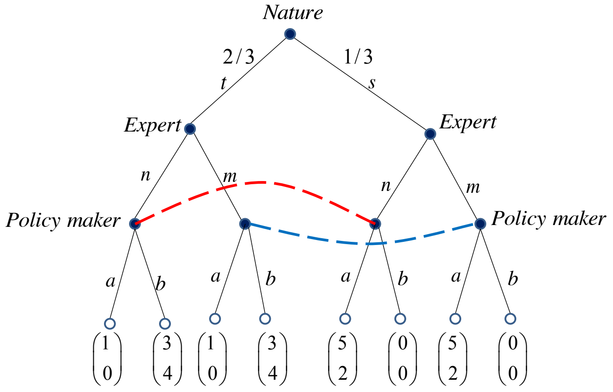

# Games of Incomplete Information

Players in a game of incomplete information have different <mark>types</mark>, i.e., they can be in different states.

The set of types of player $i$ is $\Theta_i$ and $\theta_i\in \Theta_i$ is a specific type of player $i$. The set of states of the game is $\Theta = \times_{i=1}^{n}\Theta_i$, i.e., $\Theta_1\times \Theta_2\times \cdots \times \Theta_n$, and $\theta = (\theta_1,\ \theta_2,\ \cdots,\ \theta_n)$ is a specific state of the game. For player $i$, a state of the game can be written as $(\theta_i,\ \theta_{-i})$ where $\theta_{-i}$ denotes others' types.

### Normal Form Games of Incomplete Information

#### Example: Cournot with Uncertain Demand
Recall the [Cournot Equilibrium](courses/game_theory/3_nash_equilibrium.md#cournot-equilibrium) we have discussed before. In the previous discussion, the inverse demand function is fixed. Now we assume there is uncertainty on the demand and the inverse demand function becomes 
$$
P(Q) = k - Q
$$where $k$ is a random variable that $k=1$ with probability $\mu$ and $k=2$ with probability $1-\mu$, and $Q=q_1+q_2$ is the total quantity of production.

Furthermore, we assume that firm 1 has done some market research and thus has learned the value of $k$ while firm 2 has no information about this. The strategy of firm 1 is $q_1=q_{L}$ if the demand is low, i.e., $k=1$, and would be $q_1=q_{H}$ if the demand is high, i.e., $k=2$.

We also assume that the cost is $0$ (for simplicity).

Thus, the expected profit of firm 2 is 
$$
\mathrm{E}(\pi_2(q_2)) = \mathrm{E}(P(Q)\cdot q_2) = \mu (1-q_{L}-q_2)q_2 + (1-\mu)(2-q_{H}-q_2)q_2
$$

To maximize the expected profit, we check the <abbr title='First Order Condition'>FOC</abbr>: 
$$
\begin{aligned}
 \mu (-q_2+1-q_L-q_2) + (1-\mu) (-q_2+2-q_H-q_2) &= 0\\
 q_2^{*} &= \frac{\mu(1-q_{L})+(1-\mu)(2-q_{H})}{2} \\
\end{aligned}
$$

The profit of firm 1 is 
$$
\pi_1(q_1) = (k-q_1-q_2)q_1
$$

with <abbr title='First Order Condition'>FOC</abbr>
$$
\begin{aligned}
 -q_1 + k - q_1 - q_2 &= 0\\
 q_1^{*} &= \frac{k-q_2}{2}
\end{aligned}
$$

which in turn implies 
$$
q_{L} = \frac{1-q_2}{2} \qquad q_{H} = \frac{2-q_2}{2}
$$

Substitute these 2 solutions into $q_2^{*}$, we have 
$$
\begin{aligned}
 q_2^{*} &= \frac{\mu\left( 1- \frac{1-q_2^{*}}{2} \right) + (1-\mu)\left( 2- \frac{2-q_2^{*}}{2} \right) }{2}\\
 \left(2-\frac{\mu}{2}-\frac{1-\mu}{2}\right)q_2^{*} &= \frac{\mu}{2} + (1-\mu)\\
 \frac{3}{2}q_2^{*} &= \frac{\mathrm{E}(k)}{2}\\
 q_2^{*} &= \frac{\mathrm{E}(k)}{3}
\end{aligned}
$$

Substitute this solution into $q_1^{*}$, we have 
$$
q_{L} = \frac{1}{2} - \frac{\mathrm{E}(k)}{6} \qquad q_{H} = 1 - \frac{\mathrm{E}(k)}{6}
$$

### General Cases
In a game of incomplete information, the payoff of a player $i$ depends both on the strategy chosen and the state of the game, i.e., $u_i:\ S \times \Theta \to \mathbb{R}$. Player $i$ only knows his type $\theta_i$ and thus has to take expectations over $\theta_{-i}$.

Since the types should be assigned a probability distribution, we assume that all players hold the same prior $\mu$ over $\Theta$. Thus, a player of type $\theta_i$ assigns a probability $\mu(\theta_{-i}|\theta_i)$.

To sum up, a game of incomplete information is a collection 
$$
\Gamma = \{I,\ \{S_i\},\ \{u_i\},\ \{\Theta_i\},\ \mu\}
$$

Now if a player $i$ with type $\theta_i$ choose a strategy $\hat{s}_i = s_i(\theta_i)$, then the expected payoff of this strategy is 
$$
U^{i}(\hat{s}_i,\ s_{-i}(\cdot)|\theta_i) = \sum\limits_{\theta_{-i}\in \Theta_{-i}} \mu(\theta_{-i}|\theta_i)\cdot u_i((\hat{s}_{i},\ s_{-i}(\theta_{-i})),\ (\theta_{-i},\ \theta_i))
$$

#### Incomplete Information with Mixed Strategies
If we consider mixed strategies in a game of incomplete information, i.e., let $\sigma_{-i}(s_{-i}|\theta_{-i})$ be the probability distribution of players in $I\setminus \{i\}$ to choose strategies $s_{-i}$ when their type is $\theta_{-i}$, then the expected payoff of player $i$ to choose $\hat{s}_i$ becomes 
$$
U^{i}(\hat{s}_i,\ \sigma_{-i}(\cdot)|\theta_i) = \sum\limits_{\theta_{-i}\in \Theta_{-i}} \mu(\theta_{-i}|\theta_i)\cdot \left( \sum\limits_{s_{-i}\in S_{-i}} \sigma_{-i}(s_{-i}|\theta_{-i})\cdot u_i((\hat{s}_{i},\ s_{-i}(\theta_{-i})),\ (\theta_{-i},\ \theta_i)) \right) 
$$

and the expected payoff of player $i$ with mixed strategy $\sigma_i(s_i|\theta_i)$ is 
$$
U^{i}(\sigma_i(\cdot),\ \sigma_{-i}(\cdot)|\theta_i) = \sum\limits_{s_i\in S_i} \sigma_i(s_i|\theta_i)\cdot U^{i}(s_i,\ \sigma_{-i}(\cdot)|\theta_i)
$$

#### Bayesian Nash Equilibrium (BNE) for Normal Form Games
Given a normal form game with incomplete information $\Gamma = \{I,\ \{S_i\},\ \{u_i\},\ \{\Theta_i\},\ \mu\}$, a Bayesian Nash equilibrium (BNE) is a strategy profile 
$$
\sigma^{*}(\cdot) = (\sigma_1^{*}(\cdot),\ \sigma_2^{*}(\cdot),\ \cdots,\ \sigma_n^{*}(\cdot))
$$

s.t. for each player $i$ and each type $\theta_i \in \Theta_i$, the expected payoff 
$$
U^{i}(\sigma_i^{*}(\cdot),\ \sigma_{-i}^{*}(\cdot)|\theta_i) \geqslant U^{i}(\sigma_i(\cdot),\ \sigma_{-i}^{*}(\cdot)|\theta_i)
$$

for each $\sigma_i(\cdot)\in \Sigma_i$.

### Sequential-Move Games of Incomplete Information

#### Example: Policy Advice
There are 2 possible state of the world, $\text{s}$ with probability $\frac{1}{3}$ and $\text{t}$ with probability $\frac{2}{3}$. The expert privately learns the state of the world and sends a message $\text{m}$ and $\text{n}$ to the policy maker. Having observed the expert's message, the policy maker chooses either action $\text{a}$ or $\text{b}$. The payoff diagram is shown below.

The dash lines represent incomplete information, i.e., <mark>2 policy nodes connected by a dash line should be in an information set</mark>. In this game, this means the policy maker can not identify the state of the world according to the expert's message.

Remember in the [definition of subgame](courses/game_theory/4_sequential_move_games.md#subgame), decision nodes in an information set should be included together in a subgame. Thus, the above diagram shows that there is only one subgame.

The policy maker has a <mark>prior belief</mark> that $\text{s}$ happens with probability $\frac{1}{3}$ while $\text{t}$ happens with probability $\frac{2}{3}$, i.e., $\mu(\text{s})=\frac{1}{3}$ and $\mu(\text{t})=\frac{2}{3}$. After receiving message from the expert, the policy maker will have a <mark>posterior belief</mark> denoted by $p(\text{s}|\text{m})$, $p(\text{t}|\text{m})$, $p(\text{s}|\text{n})$ and $p(\text{t}|\text{n})$. The posterior belief is given by 
$$
p(\text{s}|\text{m}) = \frac{\sigma(\text{m}|\text{s})\mu(\text{s})}{p(\text{m})} = \frac{\sigma(\text{m}|\text{s})\mu(\text{s})}{\sigma(\text{m}|\text{s})\mu(\text{s})+\sigma(\text{m}|\text{t})\mu(\text{t})}
$$

where $\sigma(\cdot|\cdot)$ is the expert's strategy.

Suppose the policy maker has a posterior belief that $p(\text{s}|\text{m})=p(\text{t}|\text{n})=1$. Based on this belief, his best response is to choose $\text{b}$ when receiving $\text{n}$ and to choose $\text{a}$ when receiving $\text{m}$. Under this strategy, the payoff of the expert to send message is 

|       |  n  |  m  |
| :---: | :-: | :-: |
| **t** | $3$ | $1$ |
| **s** | $0$ | $5$ |

which means the best response of the expert is to send $\text{n}$ when $\text{t}$ happens and to send $\text{m}$ when $\text{s}$ happens. This coincides with the policy maker's belief. Thus, these 2 pure strategies form a Bayesian Nash equilibrium.

### Adverse Selection and Signaling

#### Example: Market for Lemons
In a market of used car, good cars are called **orange** and bad cars are called **lemon**. Each owner of an orange values it at $\text{\textdollar}12,500$ and each owner of a lemon values it at $\text{\textdollar}3,000$. They are willing to sell their cars for a price higher than or equal to their valuation. Each buyer would pay $\text{\textdollar}16,000$ for an orange and $\text{\textdollar}6,000$ for a lemon.

Newspaper reports reveal that the proportion of orange cars is $\frac{1}{2}$, but no one would say his car is a lemon. Since buyers cannot distinguish the cars, they would pay a average price $\frac{\text{\textdollar}16,000+\text{\textdollar}6,000}{2}=\text{\textdollar}11,000$.

However, those who own orange cars are not willing to sell their cars for this price, thus they gradually exit the market. Then, the proportion of orange cars would be lower and lower, which results in lower price buyers would pay. Finally, the cars in this market are all lemon cars.

This phenomenon is called <mark>adverse selection</mark> caused by <mark>asymmetric information</mark>.

#### Signaling
Sometimes, it is harder for bad types to mimic the actions of good types. If others can tell the type from the action, then this action is called <mark>credible signaling</mark>.

#### Example: Market for Lemons (Continued)
Suppose there is an authority who can certificate an used car is an orange or a lemon. It takes $\text{\textdollar}3,000$ to get the certification from the authority. And it takes $\text{\textdollar}10,000$ to fix a lemon to an orange. 

If an owner of a lemon want to get a certification that his car is an orange, he would pay $\text{\textdollar}10,000+\text{\textdollar}3,000=\text{\textdollar}13,000$ while an owner of an orange only pay $\text{\textdollar}3,000$. The profit of an owner of a lemon (who tries to prove his car is an orange) is $\text{\textdollar}16,000-\text{\textdollar}13,000-\text{\textdollar}3000=\text{\textdollar}0$.

If the owner of a lemon does not do that action, his profit would be $\text{\textdollar}6000-\text{\textdollar}3000=\text{\textdollar}3,000$. Thus, he would not fix his car.

Hence, buyers can tell the type of a used car from the certification, which means the certification from the authority is a credible signaling.

#### Example: Signaling in the Labor Market
Suppose there are just 2 types of college students: $\text{A}$ (Able) and $\text{C}$ (Challenged). They differ in their tolerance for taking a tough course. An $\text{A}$ type student regard the cost of each tough course as equivalent to $\text{\textdollar}3000$ a year of salary while a $\text{C}$ type student regard it as $\text{\textdollar}15,000$ a year of salary.

Potential employers are willing to pay $\text{\textdollar}160,000$ a year to an $\text{A}$ type student and $\text{\textdollar}60,000$ a year to a $\text{C}$ type student. Other employment opportunities pay $\text{\textdollar}125,000$ to an $\text{A}$ type student and $\text{\textdollar}30,000$ to a $\text{C}$ type student. However, employers cannot directly observe any particular job applicant's type.

Consider the following hiring policy of potential employers: anyone who has taken $n$ or more of the tough courses will be regarded as an $\text{A}$ type and anyone who has taken fewer than $n$ tough courses will be regarded as a $\text{C}$ type.

To succeed, such a policy must satisfy 2 conditions: 
- Incentive-compatibility condition
- Participation condition

The first condition needs the policy to make those who are $\text{A}$ type to take tough courses while those who are $\text{C}$ type to avoid tough courses, i.e., 
$$
\begin{aligned}
 \text{\textdollar}160,000 - \text{\textdollar}3,000 n > \text{\textdollar}60,000 &\implies n < \frac{100}{3}\\
 \text{\textdollar}160,000 - \text{\textdollar}15,000 n < \text{\textdollar}60,000 &\implies n > \frac{20}{3}\\
\end{aligned}
$$

This condition ensures the potential employers to distinguish the applicants, which is called <mark>separation of types</mark> based on <mark>self-selection</mark>.

The second condition ensures that with such an incentive-compatible choice, the applicants get a better payoff than they would get in alternative oppotunities, i.e. 
$$
\text{\textdollar}16,000 - \text{\textdollar}3,000 n > \text{\textdollar}125,000 \implies n < \frac{35}{3}
$$

and $\text{\textdollar}60,000 > \text{\textdollar}30,000$ is trivially satisfied. Hence, $n\in[7,\ 11]$ since it is an integer.

Suppose we set $n$ to be $7$, the cost of an $\text{A}$ type student to take tough courses is 
$$
7\times \text{\textdollar}3,000 = \text{\textdollar}21,000
$$

which is called the <mark>cost of the infromation asymmetry</mark>.

If the 2 types are not separated, then the employers have to pay every applicant the same salary. This is called <mark>polling</mark>. Suppose that $60\%$ of the population is $\text{A}$ type and $40\%$ is $\text{C}$ type, then the common salary with polling will be 
$$
0.6 \times \text{\textdollar}160,000 + 0.4 \times \text{\textdollar}60,000 = \text{\textdollar}120,000
$$

