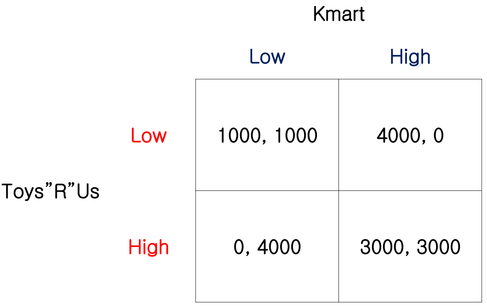

# Repeated Games

### Cooperation Outcome
In the previous example [Prisoner's Dilemma](courses/game_theory/1_introduction.md#example-prisoner39s-dilemma), the Nash equilibrium outcome is $(\text{D}, \text{D})$, i.e., 2 prisoners both choose to defect. But is there any possibility that the outcome is cooperation ($(\text{C},\ \text{C})$)?

There are several solutions to leading the outcome to cooperation: 
- Repitition
- Penalties and Rewards
- Leadership
- Asymmetric Information

We will discuss repitition in this chapter.

There are 2 kinds of repitition: 
- Finite Repitition
- Infinite Repitition: The repitition is infinite or there is a probability that the next game will happen.

### Finite Repitition

#### Notation
We denote a stage game as $G = \left\{ I,\ \left\{ A_i \right\}_{i\in I},\ \left\{ u_i \right\}_{i\in I} \right\}$ where $I$ is a set of players, and $A_i$ and $u_i$ represent the action and the state of player $i$ respectively. Then, a finite repeated game with $T$ stages and discount rate $\delta$ can be denoted by $G^{T}(\delta)$.

> [!NOTE]
> In this course we consider $\delta=\frac{1}{1+r}$ where $r$ is the risk-free rate.

#### Perfect Monitoring
In this chapter, we assume players know exactly what happened in previous stages by default.

#### Sequential-Move Games
A finite repeated game can be seen as a sequential-move game. Suppose there are only 2 stages in a finite repeated Prisoners' Dilemma.

Through backward induction, the Nash equilibrium outcome of the last stage is $(\text{D},\ \text{D})$ and thus the previous stage yields the same outcome.

Similarly, we can get the similar results for any number of stages. Thus, finite repitition cannot solve the problem.

#### Theorem for Unique SPNE
Consider a repeated game $G^{T}(\delta)$ for $T<\infty$. Suppose the stage game $G$ has a unique pure strategy equilibrium $a^{*}$, then $G^{T}$ has a unique <abbr title='Subgame Perfect Nash Equilibrium'>SPNE</abbr>: $a^{t} = a^{*}$ for each $t=1,\ 2,\ \cdots,\ T$.

However, if there are multiple equilibria in the stage game, there might be multiple <abbr title='Subgame Perfect Nash Equilibrium'>SPNE</abbr>.

#### Example: Multiple Equilibria
Consider the following stage game: 

|       |    A     |    B     |     C     |
| :---: | :------: | :------: | :-------: |
| **A** | $3,\ 3$  | $0,\ \underline{4}$  | $-2,\ 0$  |
| **B** | $\underline{4},\ 0$  | $\underline{1},\ \underline{1}$  | $-2,\ 0$  |
| **C** | $0,\ -2$ | $0,\ -2$ | $\underline{-1},\ \underline{-1}$ |

There are 2 equilibria $(\text{B},\ \text{B})$ and $(\text{C},\ \text{C})$ while the most cooperative outcome $(\text{A},\ \text{A})$ is not an equilibrium.

Since the equilibrium outcome of the last stage would be $(\text{B},\ \text{B})$ or $(\text{C},\ \text{C})$ and $(\text{B},\ \text{B})$ is better than $(\text{C},\ \text{C})$, players can respond $\text{B}$ as a reward or act $\text{C}$ as a punishment. For example, consider a 2-stage games, if we want to get the most cooperative outcome $(\text{A},\ \text{A})$ at the first stage, we can use a strategy that respond $\text{B}$ if the other choose $\text{A}$ before and respond $\text{C}$ otherwise.

Thus, in some cases, finite repitition can solve our problem.

### Infinite Repitition

#### Notation
An infinite repeated game can be denoted by $G^{\infty}$.

#### Contingent Strategy
In repeated games, the sequential nature of the relationship means that players can adopt <mark>contingent strategies</mark> that depend on behavior in preceding plays of the games.

Most contingent strategies are <mark>trigger strategies</mark>. A player using a trigger strategy plays cooperatively as long as his rival do so, but any defection on himself triggers a period of punishment, of specified length, in which he plays noncooperatively in response.

Two best-known trigger strategies are: 
- <mark>Grim Strategy</mark>: Punish the rival <mark>forever</mark> once a defection has occurred, e.g., 

    | Stage | Player 1 using some strategy | Player 2 using a grim strategy |
    | :---: | :--------------------------: | :----------------------------: |
    |   1   |          $\text{C}$          |           $\text{C}$           |
    |   2   |          $\text{C}$          |           $\text{C}$           |
    |   3   |          $\text{D}$          |           $\text{C}$           |
    |   4   |          $\text{D}$          |           $\text{D}$           |
    |   5   |          $\text{C}$          |           $\text{D}$           |
    |   6   |          $\text{C}$          |           $\text{D}$           |
    
- <mark>Tit-for-Tat (TFT)</mark>: Punish the rival if a defection occurred at last stage until the rival cooperates, e.g., 

    | Stage | Player 1 using some strategy | Player 2 using a TFT strategy |
    | :---: | :--------------------------: | :---------------------------: |
    |   1   |          $\text{C}$          |          $\text{C}$           |
    |   2   |          $\text{C}$          |          $\text{C}$           |
    |   3   |          $\text{D}$          |          $\text{C}$           |
    |   4   |          $\text{D}$          |          $\text{D}$           |
    |   5   |          $\text{C}$          |          $\text{D}$           |
    |   6   |          $\text{C}$          |          $\text{C}$           |

    which is a <mark>one-stage shift</mark> of the rival's strategy.

#### Example: Price Competition
Two firms Toys "R" Us and Kmart have only 2 possible prices that they can charge for a particular toy - $\text{Low}$ or $\text{High}$. They are the only 2 competitors in the toy market in a particular city. The payoff diagram is shown below.

Suppose they are interacting for infinitely many periods. In each month, they play the original price competition game and the outcome of each stage game is observable for both players at the end of the month. The monthly discount rate is $\delta=\frac{1}{1+r}$.

If Kmart adopts a TFT strategy, then the gain of Toys "R" Us from one-period defection is 
$$
4,000 - 3,000 = 1,000
$$

and the loss next month is 
$$
3,000-0=3,000
$$

To let the one-period defection worthwhile we need
$$
1,000>\frac{3,000}{1+r} \implies r>2
$$

However, this is very unlikely in the real world. Thus, one-period defection is not worthwhile for Toys "R" Us.

Similarly, for defecting forever, the gain is still 
$$
4,000-3,000=1,000
$$

in the first month and the present value of loss is
$$
\frac{3,000-1,000}{r}
$$

To let the forever defection worthwhile we need 
$$
1,000>\frac{2,000}{r} \implies r>2
$$

Thus, defecting forever is not worthwhile for Toys "R" Us, too.

Hence, a TFT strategy is a best response of Toys "R" Us. Conversely, if we fix Toys "R" Us with a TFT strategy, we can also derive that a TFT is a best response of Kmart. So playing TFT strategy for both players reaches a Nash equilibrium.

### Folk Theorem
There are many versions of Folk theorem. We only discuss one here.

#### Feasible Payoffs
Consider an infinitely-repeated game $G^{\infty}(\delta)$ with stage game $G = \left\{ I,\ \left\{ A_i \right\}_{i\in I},\ \left\{ u_i \right\}_{i\in I} \right\}$. The set of feasible payoffs is given by 
$$
V = \text{Conv}\left\{ v\in \mathbb{R}^{I} \big| \exists a\in A \text{ s.t. } u(a)=v \right\} 
$$

where $\text{Conv}$ means <mark>convex hull</mark>. <mark>A convex hull of a set is the smallest convex set of the set.</mark>

For example, the set of feasible payoffs of [Price Competition](#example-price-competition) is 

#### Friedman Folk Theorem
Let $a^{NE}$ be a static Nash equilibrium of the stage game $G$ with payoffs $e^{NE}$. For any feasible payoff $v=(v_i)_{i\in I}$ with $v_i > e_i^{NE}$, $\forall i\in I$, $\exists $ some $\underline{\delta}<1$ s.t. $\forall \delta > \underline{\delta}$, $\exists $ a subgame perfect equilibrium of $G^{\infty}(\delta)$ with payoffs $v$.

### Reality

#### Social Preferences
- Altruism: people receive utility from being nice to others.
- Fairness: people receive utility from being fair to others.
- Vindictiveness: people like to punish those deviating from fairness or other accepted norms of behavior.
- ...

#### Imperfect Monitoring
Player may have some probability to detect whether the other defects or not.