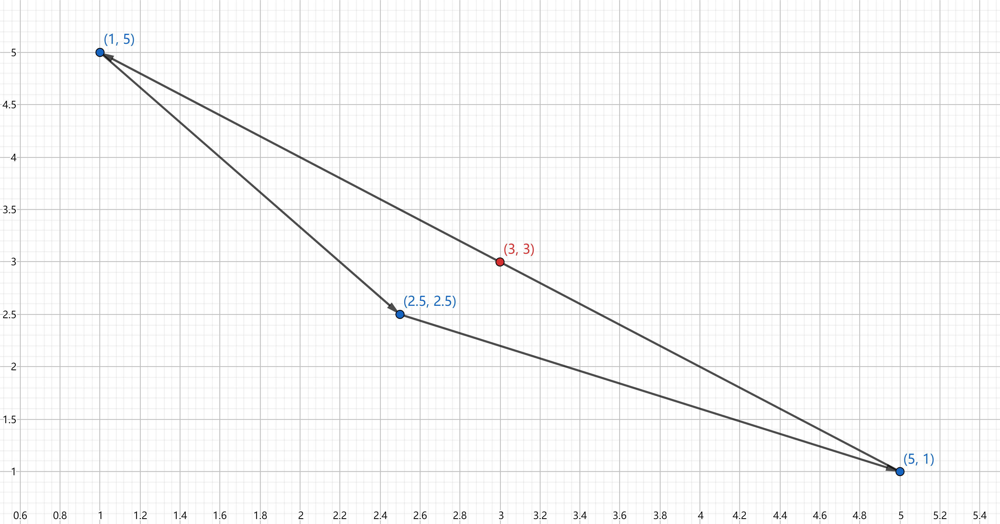
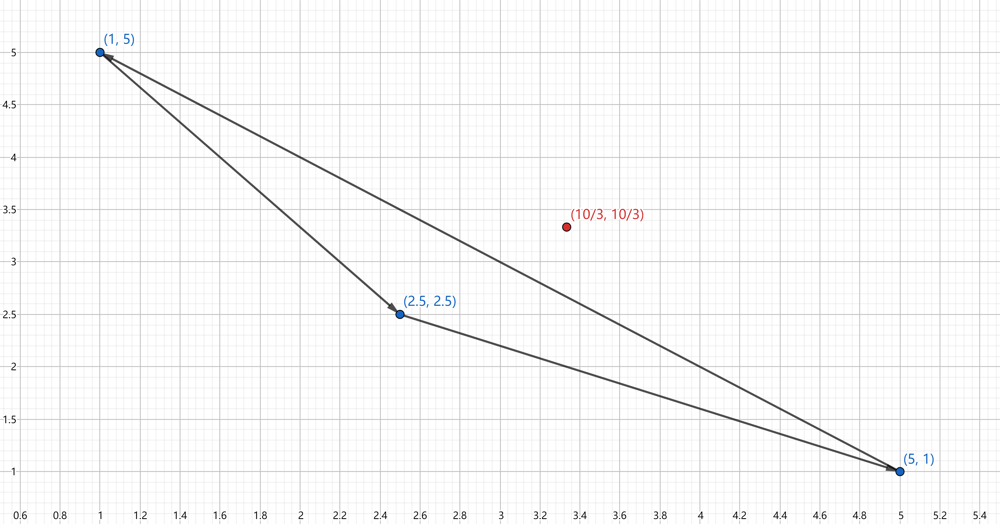

# Trembling-Hand Perfect Nash Equilibrium and Correlated Equilibrium

$$
\text{Trembling-Hand Nash Equilibrium}\subset \text{Nash Equilibrium}\subset \text{Correlated Nash Equilibrium}
$$

### Trembling-Hand Perfect Nash Equilibrium

#### Definition

A Nash equilibrium $\sigma$ of game $\Gamma_N = \left\{ I,\ \left\{ \Delta(S_i) \right\} ,\ \left\{ u_i \right\}  \right\} $ is trembling-hand perfect iff $\exists $ <mark>some</mark> sequence of <mark>totally mixed</mark> strategies $\left\{ \sigma^{k} \right\}_{k=1}^{\infty} $ s.t. $\lim\limits_{k \to \infty} \sigma^{k}$ and $\sigma_i$ is a best response to <mark>every element</mark> of sequence $\left\{ \sigma_{-i}^{k} \right\}_{k=1}^{\infty}$, $\forall i\in I$.

#### Example: Multiple Equilibria

Consider the following game: 

|       |                L                |                R                |
| :---: | :-----------------------------: | :-----------------------------: |
| **T** | $\underline{1},\ \underline{1}$ |            $0,\ -3$             |
| **B** |            $-3,\ 0$             | $\underline{0},\ \underline{0}$ |

There are 2 Nash equilibria. However, we can easily find that $\text{B}$ and $\text{R}$ are weakly dominated strategies, which means the Nash equilibrium $(\text{B},\ \text{R})$ is less likely to be reached.

We first check whether the Nash equilibrium $(\text{T},\ \text{L})$ is trembling-hand perfect. To see this, we construct a sequence of totally mixed strategies: 

$$
\begin{cases}
    \sigma_1(\text{T}) = 1 - \frac{1}{n} \\
    \sigma_1(\text{B}) = \frac{1}{n} 
\end{cases},\ 
\begin{cases}
    \sigma_2(\text{L}) = 1 - \frac{1}{n} \\
    \sigma_2(\text{R}) = \frac{1}{n} 
\end{cases},\ 
n = 2,\ 3,\ \cdots,\ \infty
$$

Given the strategy of the row player, the expected payoff of the column player is given by 

$$
\begin{cases}
    u_2(\text{L}) = \left( 1 - \frac{1}{n} \right) \cdot 1 + \frac{1}{n}\cdot 0 = 1 - \frac{1}{n}  \\
    u_2(\text{R}) = \left( 1 - \frac{1}{n} \right) \cdot (-3) + \frac{1}{n}\cdot 0 = -3 \left( 1 - \frac{1}{n} \right)   \\
\end{cases}\implies
u_2(\text{L}) > u_2(\text{R})
$$

Similarly, given the strategy of the column player, the expected payoff of the row player is given by 

$$
\begin{cases}
    u_1(\text{T}) = \left( 1 - \frac{1}{n} \right) \cdot 1 + \frac{1}{n}\cdot 0 = 1 - \frac{1}{n}  \\
    u_1(\text{B}) = \left( 1 - \frac{1}{n} \right) \cdot (-3) + \frac{1}{n}\cdot 0 = -3 \left( 1 - \frac{1}{n} \right)   \\
\end{cases}\implies
u_1(\text{T}) > u_1(\text{B})
$$

Thus, the Nash equilibrium $(\text{T},\ \text{L})$ is trembling-hand perfect.

Then, we check whether the Nash equilibrium $(\text{B},\ \text{R})$ is trembling-hand perfect. We consider an arbitrary sequence of totally mixed strategies: 

$$
\begin{cases}
    \sigma_1(\text{T}) = \sigma_1^{\epsilon} \\
    \sigma_1(\text{B}) = 1 - \sigma_1^{\epsilon} \\
\end{cases},\ 
\begin{cases}
    \sigma_2(\text{L}) = \sigma_2^{\epsilon} \\
    \sigma_2(\text{R}) = 1 - \sigma_2^{\epsilon} \\
\end{cases},\ 
n = 2,\ 3,\ \cdots,\ \infty
$$

where $\sigma_1^{\epsilon}$ and $\sigma_2^{\epsilon}$ are both positive and both converge to $0$.

Given the strategy of the row player, the expected payoff of the column player is given by 

$$
\begin{cases}
    u_2(\text{L}) = \sigma_1^{\epsilon} \cdot 1 + \left( 1 - \sigma_1^{\epsilon} \right) \cdot 0 = \sigma_1^{\epsilon}  \\
    u_2(\text{R}) = \sigma_1^{\epsilon} \cdot (-3) + \left( 1 - \sigma_1^{\epsilon} \right) \cdot 0 = -3 \sigma_1^{\epsilon}  \\
\end{cases}\implies
u_2(\text{L}) > u_2(\text{R})
$$

Similarly, given the strategy of the column player, the expected payoff of the row player is given by 

$$
\begin{cases}
    u_1(\text{T}) = \sigma_1^{\epsilon} \cdot 1 + \left( 1 - \sigma_1^{\epsilon} \right) \cdot 0 = \sigma_1^{\epsilon}  \\
    u_1(\text{B}) = \sigma_1^{\epsilon} \cdot (-3) + \left( 1 - \sigma_1^{\epsilon} \right) \cdot 0 = -3 \sigma_1^{\epsilon}  \\
\end{cases}\implies
u_1(\text{T}) > u_1(\text{B})
$$

Hence, the Nash equilibrium $(\text{B},\ \text{R})$ is not trembling-hand perfect.

#### Proposition of Weakly Dominated Strategy
If $\sigma = (\sigma_i)_{i\in I}$ is a trembling-hand perfect Nash equilibrium, then $\sigma_i$ is not a weakly dominated strategy, $\forall i\in I$.

In the [example](#example-multiple-equilibria) above, we can easily see that $(\text{B},\ \text{R})$ is not a trembling-hand perfect Nash equilibrium since $\text{B}$ and $\text{R}$ are weakly dominated strategies.

### Correlated Equilibrium
Suppose players choose actions based on a (random) signal. The equilibrium they reach is called correlated equilibrium.

There are 2 types of signal: 
- <mark>Public signal</mark>: players get the same information from the signal;
- <mark>Seperate signal</mark>: players get different information from the signal.

#### Example: Public Signal
Consider the following normal form game: 

|       |                L                |                R                |
| :---: | :-----------------------------: | :-----------------------------: |
| **U** | $\underline{5},\ \underline{1}$ |             $0,\ 0$             |
| **D** |             $4,\ 4$             | $\underline{1},\ \underline{5}$ |

which have 2 pure strategy equilibria $(\text{U},\ \text{L})$ and $(\text{D},\ \text{R})$, and a mixed strategy equilibrium that players put equal weight on each pure strategy, i.e., $q_1=q_2=0.5$ in following expected payoff diagram ($q_1$ and $q_2$ are the probabilities of player 1 choosing $\text{U}$ and player 2 choosing $\text{L}$ respectively): 

|         |   Player 1   |   Player 2   |
| :-----: | :----------: | :----------: |
| **U/L** |  $5q_2=2.5$  | $4-3q_1=2.5$ |
| **D/R** | $3q_2+1=2.5$ |  $5q_1=2.5$  |

which means each player gets payoff $2.5$ under the mixed strategy equilibrium.

Now we assume the players can coordinate using a publicly observable coin flip, then they can play the 2 pure strategy equilibria $(\text{U},\ \text{L})$ and $(\text{D},\ \text{R})$ with probability $\frac{1}{2}$, which results in a new equilibrium outcome $(3,\ 3)$.

More generally, every point on the convex hull of the payoff profiles $(1,\ 5)$, $(5,\ 1)$ and $(2.5,\ 2.5)$ is achievable by setting different probability distributions for public signal.

#### Example: Seperate Signal
We still consider the same payoff diagram in the [example](#example-public-signal) above.

Now suppose there is a signal with 3 equally likely states: $\text{A}$, $\text{B}$ and $\text{C}$. Player 1 observes $\text{A}$ perfectly but cannot distinguish between $\text{B}$ and $\text{C}$ while player 2 observes $\text{C}$ but cannot distinguish between $\text{A}$ and $\text{B}$.

Consider the following strategies: 
- player 1 plays $\text{U}$ when told $\text{A}$, and plays $\text{D}$ otherwise;
- player 2 plays $\text{R}$ when told $\text{C}$, and plays $\text{L}$ otherwise.

We want to check whether it is a correlated equilibrium: 
- when player 1 observes $\text{A}$, he knows that player 2 observes $(\text{A},\ \text{B})$ and would choose $\text{L}$, and thus $\text{U}$ is the best response of player 1;
- when player 1 observes $(\text{B},\ \text{C})$, he infers that player 2 would choose $\text{L}$ and $\text{R}$ with probability $\frac{1}{2}$ respectively, and thus $\text{D}$ is one of the best responses of player 1;
- when player 2 observes $\text{C}$, he knows that player 1 observes $(\text{B},\ \text{C})$ and would choose $\text{D}$, and thus $\text{R}$ is the best response of player 2;
- when player 2 observes $(\text{A},\ \text{B})$, he infers that player 1 would choose $\text{U}$ and $\text{D}$ with probability $\frac{1}{2}$ respectively, and thus $\text{L}$ is one of the best responses of player 2.

Hence, these 2 strategies form a correlated equilibrium. Since the 3 states each occurs with probability $\frac{1}{3}$, the expected payoff of this equilibrium is $\left( \frac{10}{3},\ \frac{10}{3} \right) $, which is outside of the convex hull.

#### Definition
Let $(\Omega,\ \pi)$ be a countable probability space. For each player $i$, let $P_i$ be his information partition, $q_i$ be his posterior and let $s_i:\ \Omega \to A_i$ assigning the same value to states in the same cell of his information partition. Then $\left( (\Omega,\ \pi),\ \left\{ P_i \right\} ,\ \left\{ s_i \right\}  \right) $ is a correlated equilibrium of game $\left\{ I,\ \left\{ A_i \right\},\ \left\{ u_i \right\}   \right\} $ if $\forall i,\ q_i,\ s_i^{\prime}$, 

$$
\sum\limits_{\omega\in \Omega} q_i(\omega) u_i\left( s_i(\omega),\ s_{-i}(\omega) \right) \geqslant \sum\limits_{\omega\in \Omega} q_i(\omega) u_i\left( s_i^{\prime}(\omega),\ s_{-i}(\omega) \right)
$$

For example, in the [example of seperate signal](#example-seperate-signal) above, $\Omega = \left\{ \text{A},\ \text{B},\ \text{C} \right\} $, information partition of player 1 is $P_1 = \left\{ \left\{ \text{A} \right\},\ \left\{ \text{B},\ \text{C} \right\}   \right\} $ and that of player 2 is $P_2 = \left\{ \left\{ \text{A},\ \text{B} \right\},\ \left\{ \text{C} \right\}   \right\} $. Player 1's strategy is $s_1(\text{A}) = \text{U}$ and $s_1(\text{B})=s_1(\text{C})=\text{D}$ while player 2's strategy is $s_2(\text{A})=s_2(\text{B})=\text{L}$ and $s_2(\text{C})=\text{R}$. Correlated equilibrium is reached when each player plays the best response at every state.