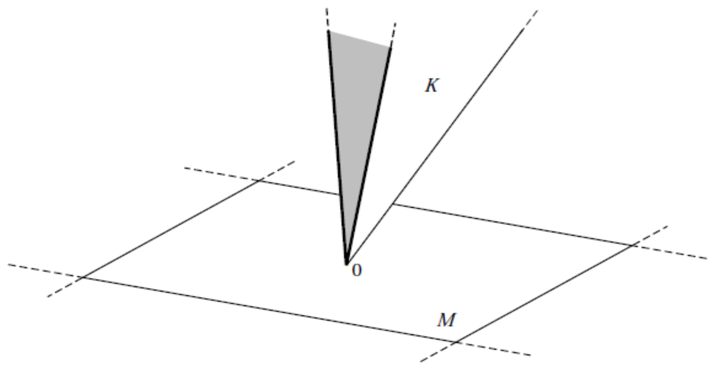

# General Single-Period Model

### Settings

Remember we have learned the [binomial model](courses/mathematical_finance/5_binomial_model.md) before. There are only 2 states in that model. Now we consider a more general case, i.e., there are $S$ states instead of 2 in the world, one of which will be revealed as true. We denote the full event set by $\Omega = \left\{ 1,\ \cdots,\ S \right\} $.

There are $N$ securities in the market, denoted by an $N \times S$ matrix $D$ with $D_{ij}$ denoting the payoff of security $i$ at state $j$. The prices of these securities are denoted by $q\in \mathbb{R}^{N}$. Thus, a portfolio $\theta\in \mathbb{R}^{N}$ has current value $q^{\mathsf{T}}\theta$ and payoff $D^{\mathsf{T}}\theta\in \mathbb{R}^{N}$.

### Notation

In this chapter, we define some notations of relationship for a $S$-dimensional vector: 
- $> 0$ means all elements of the vector $\geqslant 0$ and at least one of them $>0$, also denoted by $\in \mathbb{R}_{+}^{S}$;
- $\gg 0$ means all elements of the vector $> 0$, also denoted by $\in \mathbb{R}_{++}^{S}$.

### Arbitrage

An arbitrage is a portfolio $\theta\in \mathbb{R}^{N}$ with $q^{\mathsf{T}}\theta\leqslant 0$ and $D^{\mathsf{T}}\theta>0$, or $q^{\mathsf{T}}\theta<0$ and $D^{\mathsf{T}}\theta\geqslant 0$.

### State-Price

A state-price vector is a vector $\psi\in \mathbb{R}_{++}^{S}$ with $q = D \psi$.

### Theorem of No Arbitrage

<mark>There is no arbitrage iff there exists a state-price vector.</mark>

Proof

1. Let $\mathcal{L} = \mathbb{R}\times \mathbb{R}^{S}$, a linear space $\mathcal{M} = \left\{ \left( -q^{\mathsf{T}}\theta,\ D^{\mathsf{T}}\theta \right):\ \theta\in \mathbb{R}^{N} \right\} $ representing all possibilities of portfolio and $\mathcal{K} = \mathbb{R}_{+}\times \mathbb{R}_{+}^{S}$.

    

    
    

    If there is no arbitrage, then $\mathcal{K} \cap \mathcal{M} = \left\{ 0 \right\} $. According to Seperating Hyperplane Theorem (SHT), $\exists $ a linear functional $F:\ \mathcal{L}\to \mathbb{R}$ s.t. $F(z) < F(x)$, $\forall z\in \mathcal{M}$ and $\forall $ nonzero $x\in \mathcal{K}$. This means $F(z)=0$ and $F(x)>0$. Thus, $\exists \alpha\in \mathbb{R}_{+}$ and $\psi\in \mathbb{R}_{++}^{S}$ s.t. $F((a,\ b)) = \alpha a + \psi^{\mathsf{T}}b$ for any $(a,\ b)\in \mathcal{L}$. On the linear space $\mathcal{M}$, we have 
    $$
    F((-q^{\mathsf{T}}\theta,\ D^{\mathsf{T}}\theta)) = - \alpha q^{\mathsf{T}}\theta + \psi^{\mathsf{T}} D^{\mathsf{T}}\theta = 0,\qquad \forall \theta\in \mathbb{R}^{N}
    $$

    Hence, we have 

    $$
    \alpha q = D \psi
    $$

    and $\frac{1}{\alpha}\psi$ is a state-price vector.

2. Assume there exists a state-price vector, i.e., $\exists $ a vector $\psi\in \mathbb{R}_{++}^{S}$ with $q=D \psi$. For any porfolio $\theta\in \mathbb{R}^{N}$, if $q^{\mathsf{T}}\theta \leqslant 0$, we have 

    $$
    \psi^{\mathsf{T}} D^{\mathsf{T}} \theta \leqslant 0
    $$

    which means $D^{\mathsf{T}}\theta>0$ does not hold.

     

    If $q^{\mathsf{T}}\theta < 0$, we have 

    $$
    \psi^{\mathsf{T}} D^{\mathsf{T}} \theta < 0
    $$

    which means $D^{\mathsf{T}}\theta\geqslant 0$ does not hold.

     

    Hence, there is no arbitrage.

By 1 and 2 we finish the proof.

### Relationship between State-Price, Risk-Neutral Probabilities and SDF

#### Risk-Neutral Probabilities

Given a state-price vector $\psi = (\psi_1,\ \cdots,\ \psi_{S})^{\mathsf{T}}$, for security $i$, we have 

$$
q_i = D_i \psi = \sum\limits_{j=1}^{S} D_{ij} \psi_{j}
$$

Denote the sum of state-prices as $\psi_0$, we have 

$$
\frac{q_i}{\psi_0} = \hat{\mathrm{E}}(D_i) = \sum\limits_{j=1}^{S} D_{ij} \hat{\psi}_{j}
$$

where $\hat{\psi}_{j} = \frac{\psi_{j}}{\psi_0}$ is the risk-neutral probability for state $j$.

> [!NOTE]
> $D_i$ in the 2 equations have different forms. $D_i$ is a vector in the first equation while it is a random variable in the second one. But they have the same meanings actually.

Thus, we have 

$$
q_i = \psi_0 \hat{\mathrm{E}}(D_i),\qquad i=1,\ 2,\ \cdots,\ N
$$

which means <mark>any security's price is its discounted expected payoff under risk-neutral measure</mark>.

Actually, if $\exists $ a portfolio $\overline{\theta}$ with $D^{\mathsf{T}}\overline{\theta} = (1,\ \cdots,\ 1)^{\mathsf{T}}$, then we have 

$$
q^{\mathsf{T}}\overline{\theta} = (D \psi)^{\mathsf{T}} \overline{\theta} = \psi^{\mathsf{T}} D^{\mathsf{T}} \overline{\theta} = \psi_0
$$

which means $\psi_0$ is the discount factor on risk-free asset.

Thus, <mark>$\psi_0$ indicates the time discount and the risk-neutral probabilities describe the risk discount.</mark>

#### SDF

Also from $q_i = D_i \psi$ we have 

$$
q_i = \sum\limits_{j=1}^{S} D_{ij} \psi_{j} = \sum\limits_{j=1}^{S} D_{ij} \frac{\psi_{j}}{p_j} p_j
$$

where $p_j$ is the probability of state $j$.

Denote $\frac{\psi_{j}}{p_j}$ as $\pi_j$ and let $\pi = (\pi_1,\ \cdots,\ \pi_S)^{\mathsf{T}}$, we obtain 

$$
q_i = \sum\limits_{j=1}^{S} D_{ij} \pi_j p_j = \mathrm{E}(D_i \pi)
$$

which means $\pi$ is the <mark><abbr title='Stochastic Discounted Factor'>SDF</abbr> containing both time discount and risk discount</mark>.

### Pricing Assets by Solving a Optimal Consumption Model

Given a market $(q,\ D)$, an agent has a strictly increasing utility function $U:\ \mathbb{R}_{+}^{S}\to \mathbb{R}$ and an endowment $e\in \mathbb{R}_{+}^{S}$. Thus, his budget-feasible set (for consumption) is 

$$
X(q,\ e) = \left\{ e + D^{\mathsf{T}}\theta:\ \theta\in \mathbb{R}^{N},\ q^{\mathsf{T}}\theta \leqslant 0 \right\} 
$$

and the optimality problem is 

$$
\underset{c\in X(q,\ e)}{\sup} ~ U(c)
$$

> [!TIP]
> The agent's endowment can be understood as his apple tree yielding different amounts of apples in different states in the next period. The agent's wealth only comes from his endowment and securities, which needs $q^{\mathsf{T}}\theta \leqslant 0$ since he has no extra money at the beginning.

Obviously, <mark>if there is a solution to the optimality problem, then there is no arbitrage; if $U$ is continuous and there is no arbitrage, then there is a solution to the optimality problem.</mark>

Also, if there is no arbitrage, we can find that at the optimum $c^{*} = e + D^{\mathsf{T}}\theta^{*}$, we have $q^{\mathsf{T}}\theta^{*} = 0$. Because if $q^{\mathsf{T}}\theta < 0$, we can find a $\theta^{\prime}$ s.t. $D^{\mathsf{T}}\theta^{\prime} > 0$ and $q^{\mathsf{T}}\theta^{\prime} = - q^{\mathsf{T}}\theta > 0$, and we can combine $\theta$ and $\theta^{\prime}$ to construct a new portfolio $\theta^{\prime\prime}$ with $q^{\mathsf{T}}\theta^{\prime\prime} = 0$ and $D^{\mathsf{T}}\theta^{\prime\prime} = D^{\mathsf{T}}\theta + D^{\mathsf{T}}\theta^{\prime} > D^{\mathsf{T}}\theta$.

#### Theorem of State-Price

Suppose $c^{*}$ is a strictly positive solution to the optimality problem, $U$ is continuously differentiable at $c^{*}$ and vector $\partial U(c^{*})$ is strictly positive, then $\exists $ some $\lambda > 0$ s.t. $\lambda \partial U(c^{*})$ is a state-price vector.

Proof

Since $c^{*}$ is strictly positive, $\forall $ portfolio $\theta$, $\exists $ some $k > 0$ s.t. $c^{*} + \alpha D^{\mathsf{T}}\theta \geqslant 0$, $\forall \alpha\in [-k,\ k]$. Let $g_{\theta} :\ [-k,\ k] \to \mathbb{R}$ be defined by 

$$
g_{\theta}(\alpha) = U\left( c^{*} + \alpha D^{\mathsf{T}}\theta \right) 
$$

Suppose $q^{\mathsf{T}}\theta = 0$, then $g_{\theta}$ is maximized at $\alpha = 0$. The <abbr title='First Order Condition'>FOC</abbr> is 

$$
g^{\prime}_{\theta}(0) = \left( \partial U\left( c^{*} \right) \right)^{\mathsf{T}} D^{\mathsf{T}}\theta = 0
$$

which means $q = \lambda D \partial U\left( c^{*} \right)$ for some constant $\lambda$.

According to no-arbitrage assumption, $\lambda$ should be positive and $\lambda \partial U\left( c^{*} \right)$ is a state-price vector.

#### Expected Utility Function

If we consider a special case that $U(c) = \mathrm{E}(u(c))$ where $u:\ \mathbb{R}_{+}\to \mathbb{R}$ and expectation is defined by a given probability vector $p$, then we have 

$$
U(c) = \sum\limits_{j=1}^{S} p_j u(c_j)
$$

If $u$ is differentiable for all $c\geqslant 0$, then we have 

$$
(\partial U\left( c \right))_{j} = p_j u^{\prime}(c_j)
$$

According to the [theorem of state-price](#theorem-of-state-price), we have 

$$
q = \lambda \mathrm{E}\left( D u^{\prime}\left( c^{*} \right)  \right) 
$$

Define the risk-neutral probability as $\hat{\psi}_{j} = \frac{u^{\prime}\left( c_j^{*} \right) p_j}{\mathrm{E}\left( u^{\prime} \left( c^{*} \right)  \right) }$, we have 

$$
q_i = \lambda \mathrm{E}\left( u^{\prime}\left( c^{*} \right)  \right)  \sum\limits_{j=1}^{S} D_{ij} \hat{\psi}_j := \psi_0 \hat{\mathrm{E}}(D_i)
$$

where $\psi_0 = \lambda \mathrm{E}\left( u^{\prime}\left( c^{*} \right)  \right)$.