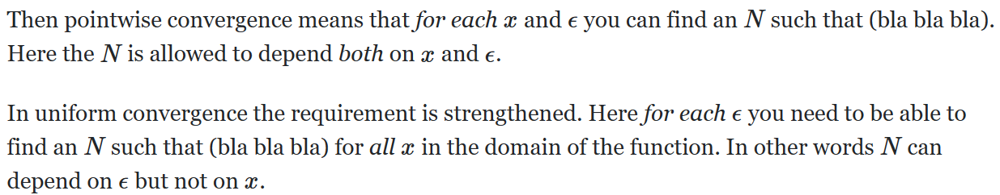

# 测度论与概率

## 一些定义

### 代数与σ-代数

考虑一个空间 $\Omega$，它的所有子集记为 $2^{\Omega}$，空集记为 $\empty$。假设有一个集合 $\mathcal{A} \sub 2^{\Omega}$，考虑以下性质：

1. $\empty \in \mathcal{A}$ 且 $\Omega \in \mathcal{A}$；
2. $\mathcal{A}$ 对补集是封闭的，即一个集合如果在 $\mathcal{A}$ 中，那么它的补集也应该在 $\mathcal{A}$ 中；
3. $\mathcal{A}$ 对有限并和有限交是封闭的，即如果 $A_1,\ A_2,\ \cdots,\ A_n$ 都在 $\mathcal{A}$ 中，那么 $\bigcup_{i = 1}^{n} A_i$ 和 $\bigcap_{i = 1}^{n} A_i$ 都在 $\mathcal{A}$ 中；
4. $\mathcal{A}$ 对可列并和可列交是封闭的，即如果 $A_1,\ A_2,\ A_3,\ \cdots$ 都在 $\mathcal{A}$ 中，那么 $\bigcup_{i = 1}^{\infty} A_i$ 和 $\bigcap_{i = 1}^{\infty} A_i$ 都在 $\mathcal{A}$ 中。

当**满足性质1、2、3**时，我们称集合 $\mathcal{A}$ 为空间 $\Omega$ 下的一个**代数（algebra）**；当**满足性质1、2、4**时，我们称集合 $\mathcal{A}$ 为空间 $\Omega$ 下的一个**σ-代数（σ-algebra）**。

> [!TIP|label:提示]
> <strong>可列（countable）</strong>指能与自然数（非负整数）一一对应。
>
> 当满足性质2时，性质3和4均可以简化为对有限（可列）并（交）是封闭的，因为交集的补集就是补集的并。

### 测度空间与概率空间

在空间 $\Omega$ 和对应的某个σ-代数 $\mathcal{F}$ 下，**测度 $\mu: \mathcal{F} \to \mathbb{R}$ 是一个函数**，它满足以下条件：

1. $\mu(A) \geqslant 0,\ \forall A \in \mathcal{F}$；
2. $\mu(\empty) = 0$；
3. **可列可加性（countable additivity）**：如果 $(A_n)_{n=1}^{\infty}$ 是互不相交的（mutually disjoint），那么 $\mu \left(\bigcup_{n = 1}^{\infty} A_n \right) = \sum_{n=1}^{\infty} \mu(A_n)$。

则三元组 $(\Omega,\ \mathcal{F},\ \mu)$ 被称作**测度空间（measure space）**，其中二元组 $(\Omega,\ \mathcal{F})$ 被称为**可测空间（measurable space）**。

> [!TIP|label:提示]
> 条件2其实可以由可列可加性推出：让 $A_n = \empty$，如果要让等式成立，$\mu(A_n)$ 只能为 $0$，不然不能收敛。

在空间 $\Omega$ 和σ-代数 $\mathcal{F}$ 下，**概率 $\mathrm{P}: \mathcal{F} \to \mathbb{R}$ 是一个特殊的测度**，我们需要一个额外的条件来限制它：$\mathrm{P}(\Omega) = 1$。相对应的，$(\Omega,\ \mathcal{F},\ \mathrm{P})$ 被称作**概率空间**。

### $\mathcal{F}$-可测与随机变量

假设有两个可测空间 $(\Omega,\ \mathcal{F})$ 和 $(\mathbb{R}^{d},\ \mathcal{B})$，**随机变量 $X: \Omega \to  \mathbb{R}^{d},\ d\in \mathbb{N}_{+}$ 是一个 $\mathcal{F}$-可测的函数，这意味着波莱尔代数 $\mathcal{B}$ 中的元素总能通过 $X$ 在 $\mathcal{F}$ 中找到原像（preimage）**，即 $X^{-1}(B) \in \mathcal{F},\ \forall B \in \mathcal{B}$，记为 $X \sim \mathcal{F}$。

> [!TIP|label:提示]
> 对于一个拓扑空间，其中的开集经过可列次交、并或补得到的集合为**波莱尔域（Borel set）**，所有的波莱尔域构成一个σ-代数，被称为**波莱尔代数（Borel σ-algebra）**。

> [!TIP|label:证明与可测函数相关的结论的标准过程]
> 1. 证明对示性函数或特征函数成立；
> 2. 证明结论在特征函数上具有线性性质，即对简单函数成立；
> 3. 证明对非负可测函数成立；
> 4. 证明结论在非负可测函数上具有线性性质，即对所有可测函数成立。

## 不同类型的收敛

### 逐点收敛与一致收敛

- **逐点收敛**（pointwise convergence）：$\forall x$ 在 $f$ 的定义域中，都有 $\lim\limits_{n \to \infty} f_n(x) = f(x)$；
- **一致收敛**（uniform convergence）：$\forall x$ 在 $f$ 和 $f_n$ 的共同定义域中，都有 $\lim\limits_{n \to \infty} \sup \left\{\left\vert f_n(x) - f(x) \right\vert \right\} = 0$。

逐点收敛与一致收敛的区别在于**收敛速率的一致性**，逐点收敛每个点的收敛速率可能大不相同，但一致收敛每个点的收敛速率都差不多。**一致收敛 ⇒ 逐点收敛**。

### 与测度有关的收敛

- **依测度收敛**，记为 $f_n \xrightarrow{\mu} f$：$\forall \epsilon > 0 \text{ s.t. } \lim\limits_{n \to \infty} \mu\left\{\left\vert f_n - f \right\vert > \epsilon \right\} = 0$；
- **几乎处处收敛**（almost everywhere convergence），记为 $f_n \xrightarrow{\text{a.e.}} f$：$\exists A \in \mathcal{F}$，$\mu(A) = 0$ 且在 $A^{c}$ 上有 $\lim\limits_{n \to \infty} f_n = f$；
- **几乎一致收敛**（almost uniform convergence），记为 $f_n \xrightarrow{\text{a.u.}} f$：$\forall \epsilon > 0$，$\exists A \in \mathcal{F}$，$\mu(A) < \epsilon \text{ s.t. } f_n$ 一致收敛于 $f$；
- **$L^{p}$-收敛**，$p \in (0,\ \infty)$，记为 $f_n \xrightarrow{L^{p}} f$：$\lim\limits_{n \to \infty} \int_{\Omega} \left\vert f_n - f \right\vert^{p} ~ \mathrm{d}\mu = 0$。

> [!TIP|label:提示]
> 几乎处处收敛与依测度收敛的区别在于测度与极限的位置。
>
> **当测度为概率时**，几乎处处收敛通常用 $\text{a.s.}$（**几乎必然收敛**，almost sure convergence / converges almost surely）表示。

收敛之间的关系：

- $L^{p}$-收敛 ⇒ 依测度收敛
- 几乎一致收敛 ⇒ 依测度收敛、几乎处处收敛
- 依测度收敛 ⇒ 存在子序列满足几乎一致收敛、几乎处处收敛
- **Egoroff 定理**：如果测度是有限的，那么几乎处处收敛 ⇔ 几乎一致收敛 ⇒ 依测度收敛 

**依测度收敛是一个比较菜的收敛**，除了几乎处处收敛都可以推出依测度收敛，所以几乎处处收敛也好不到哪去。长江后浪推前浪，**依测度收敛的孩子比几乎家族的人强**。**当测度是有限的，比如概率，那么几乎处处收敛就可以变强，变到跟几乎一致收敛等价**。

## 一些收敛定理

假设函数序列 $(f_n)_{n \in \mathbb{N}_{+}} \sim \mathcal{F}$，函数 $g \in L^{1}$。

> [!TIP|label:提示]
> 函数 $f \in L^{1}$ 表示该函数**绝对可积**，$f \in L^{2}$ 表示该函数**平方可积**，以此类推。

### 勒贝格单调收敛定理（Lebesgue Monotone Convergence Theorem，Lebesgue MCT）

如果 $g \leqslant f_n \uparrow f \text{ a.e.},\ n\geqslant 1$，那么

$$
\lim\limits_{n \to \infty} \int_{\Omega} f_n ~ \mathrm{d}\mu = \int_{\Omega} f ~ \mathrm{d}\mu
$$

即当负方向被可积函数 $g$ 控制的单调递增的 $f_n$ 几乎处处收敛到 $f$，**积分与极限可交换**。

> [!TIP|label:提示]
> 原版其实是需要 $f_n \geqslant 0$，但是在上面这版中我们可以得到 $f_n - g \geqslant 0$，而 $g$ 本身又是可积的，因此放宽了条件也是成立的。

### 法图引理（Fatou Lemma）

如果 $f_n \geqslant g \text{ a.e.},\ n \geqslant 1$，那么

$$
\varliminf\limits_{n \to \infty} \int_{\Omega} f_n ~ \mathrm{d}\mu \geqslant \int_{\Omega} \varliminf\limits_{n \to \infty} f_n ~ \mathrm{d}\mu
$$

即没有单调收敛的条件时，积分与极限交换后就不一样了。

> [!TIP|label:提示]
> 下极限为所有子列极限的下确界。

### 勒贝格控制收敛定理（Lebesgue Dominated Convergence Theorem，Lebesgue DCT）

如果 $\left\vert f_n \right\vert \leqslant g \text{ a.e.},\ n \geqslant 1$，且 $f_n \xrightarrow{\text{a.e.}} f$，那么 $f \in L^{1}$ 且

$$
\lim\limits_{n \to \infty} \int_{\Omega} f_n ~ \mathrm{d}\mu = \int_{\Omega} f ~ \mathrm{d}\mu
$$

即当 $f_n$ 正负两个方向都被可积函数 $g$ 控制，我们就不需要单调的条件。

## 一些不等式

用 $L^{p} := L^{p}(\Omega,\ \mathcal{F},\ \mu)$ 来表示所有随机变量 $X$ 构成的空间，$X$ 满足 $\left\| X \right\|_{p} := (\int_{\Omega} \left\vert X \right\vert ^{p} ~ \mathrm{d}\mu)^{\frac{1}{p}} < \infty$。特别地，$L^{2}$ 是一个希尔伯特空间，内积为 $\left<X,\ Y \right> _{2} := \int_{\Omega} XY ~ \mathrm{d}\mu$。

> [!TIP|label:提示]
> 如果一个空间是线性的，完备的，并且规定了范数、内积和距离，就被称为**希尔伯特空间（Hilbert space）**。

### Jensen 不等式

当 $X \in L^{1}$，任意 convex 函数 $\phi$ 都有

$$
\mathrm{E}[\phi(X)] \geqslant \phi[\mathrm{E}(X)]
$$

### Young 不等式

如果 $a,\ b \geqslant 0$，$p,\ q > 1$ 且 $\frac{1}{p} + \frac{1}{q} = 1$，我们有

$$
ab \leqslant \frac{a^{p}}{p} + \frac{b^{q}}{q}
$$

> [!TIP|label:提示]
> 当 $p = q = 2$，不等式就是我们所熟知的 $a^{2} + b^{2} \geqslant 2ab$。

### Hölder 不等式

如果 $f \in L^{p}$，$g \in L^{q}$，$p,\ q \in [1,\ \infty]$ 且 $\frac{1}{p} + \frac{1}{q} = 1$，我们有

$$
\left\| f g \right\|_{1} \leqslant \left\| f \right\|_{p} \left\| g \right\|_{q}
$$

当 $p = q = 2$，不等式为 **Cauchy-Schwarz 不等式**。

### Minkowski 不等式

如果 $f,\ g \in L^{p},\ p \in [1,\ \infty]$，那么

$$
\left\| f + g \right\|_{p} \leqslant \left\| f \right\|_{p} + \left\| g \right\|_{p}
$$

即 $p$-范数下的**三角不等式**。

### Chebychev 不等式

如果 $\epsilon > 0$，$f \in L^{p},\ p > 0$，我们有

$$
\mu\left\{\left\vert f \right\vert \geqslant \epsilon \right\} \leqslant \epsilon^{-p} \int_{\Omega} \left\vert f \right\vert ^{p} ~ \mathrm{d}\mu
$$

## Radon-Nikodym 定理

如果 $\mu,\ \nu$ 都是σ-有限的测度且 $\nu \ll \mu$，那么 $\exists f \geqslant 0,\ f \sim \mathcal{F} \text{ s.t. } \nu(A) = \int_{A} f ~ \mathrm{d}\mu,\ A \in \mathcal{F}$。在这种情况下，我们把 $f$ 表示为 $\frac{\mathrm{d}\nu}{\mathrm{d}\mu}$。

> [!TIP|label:提示]
> **σ-有限**意思是测度在对应的σ-代数上有限。
>
> $\nu \ll \mu$ 表示 $\mu(A) = 0 \implies \nu(A) = 0,\ \forall A \in \mathcal{F}$。

## 条件期望

条件期望 $\mathrm{E}(X|Y)$ 是 $Y$ 的一个函数，记为 $f(Y)$。如果 $\mathrm{E}(X|Y = y) < \infty,\ \forall y \text{ s.t. } \mathrm{P}(Y = y) > 0$，那么我们可以有如下 a.s. 的定义：

$$
f(y) = \begin{cases}
    \mathrm{E}(X|Y = y),\ \mathrm{P}(Y = y) > 0 \\
    \text{任意值},\ \mathrm{P}(Y = y) = 0 \\
\end{cases}
$$

### Doob-Dynkin 引理

假设两个随机变量 $X \in \mathbb{R},\ Y \in \mathbb{R}^{d}$，那么 $X \sim \sigma(Y)$ 当且仅当存在在 $\mathbb{R}^{d}$ 上波莱尔可测的 $f \text{ s.t. } X = f(Y)$，$\sigma(Y) := \left\{A \sub \Omega: Y ^{-1} (B) = A \text{ 对于某个 } B \in \mathcal{B}\left(\mathbb{R}^{d} \right)  \right\} $

### $L^{2}$ 情形

令两个随机变量 $X \in L^{2}(\Omega,\ \mathcal{F},\ \mathrm{P})$，$Y \in \mathbb{R}^{d}$，$ \widetilde{X} := \mathrm{E}(X|Y) \in L^{2}(\Omega,\ \sigma(Y),\ \mathrm{P})$ 是唯一满足

$$
\mathrm{E}(\widetilde{X} Z) = \mathrm{E}(X Z),\quad \forall Z \in L^{2}(\Omega,\ \sigma(Y),\ \mathrm{P})
$$

的元素。

$\mathrm{E}(X|Y)$ 是 $X$ 在 $L^{2}(\Omega,\ \sigma(Y),\ \mathrm{P})$ 上的希尔伯特空间投影。

Tower property：大筛子和小筛子，谁先谁后都一样，只用小筛子也一样。

## $L^{+}$ 情形

1. If $X \in L^{+} \cap L^{2}$, $Z \in L^{+}$, $Z_n = \min (Z,\ n) \in L^{+} \cap L^{2}$, obviously $Z_n \uparrow Z$, then $\mathrm{E}(X Z_n) = \mathrm{E}[\mathrm{E}(X|\mathcal{G})|Z_n]$. From MCT we know $\mathrm{E}(X Z) = \lim\limits_{n \to \infty} \mathrm{E}(X Z_n) = \mathrm{E}[\mathrm{E}(X|\mathcal{G})|Z]$.
2. If $X,\ Z \in L^{+}$, $X_n = \min (X,\ n) \in L^{+} \cap L^{2} \uparrow X$, then from MCT we know $\mathrm{E}(X Z) = \lim\limits_{n \to \infty}  \mathrm{E}(X_n Z) = \lim\limits_{n \to \infty} \mathrm{E}[\mathrm{E}(X_n|\mathcal{G})|Z] = \mathrm{E}[\mathrm{E}(X|\mathcal{G})|Z]$.
3. $X_1 \geqslant X_2 \geqslant 0$.
4. $X \in L^{+}$, suppose $U$ and $V$ are 2 versions of $\mathrm{E}(X|\mathcal{G})$. W.T.S. $\mathrm{P}(U = V) = 1 \implies $ W.T.S $\mathrm{P}(U \neq V) = 0 \implies$ W.T.S. $\mathrm{P}(U < V) = \mathrm{P}(U > V) = 0$ (symmetric, only consider one side). Let $\Lambda_n = \bigcup_{n=1}^{\infty} \left\{U < V \leqslant n \right\} $