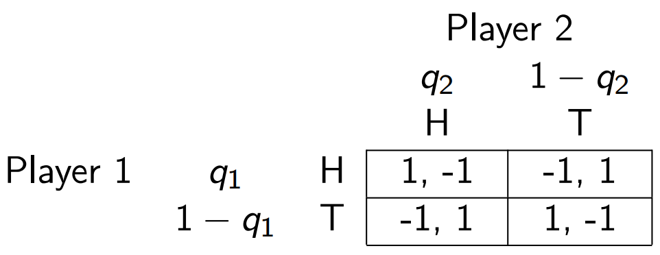
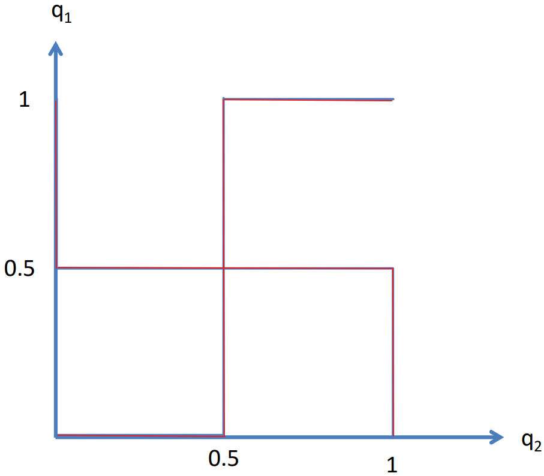

# 博弈论
2022春季 李润

<!-- pagebreak -->

## Introduction

### Guessing Game
- Everyone choose a number between $[0,\ 100]$.
- The one whose number is close to $\frac{2}{3}$ of the average win.
- If you assume all other people choose the average of the range, i.e., $50$, then you may choose $50\times \frac{2}{3}\approx 33$. If you assume all other people have thought about this, i.e., they will choose $33$, then you may choose $33\times \frac{2}{3}= 22$, and so on.
- Another prospective: the answer cannot exceed $100\times \frac{2}{3}\approx 67$, similarly we can repeat the process to get $67\times \frac{2}{3}\approx 45$, $45\times \frac{2}{3}=30$, and so on.
- <mark>Both ways of thinking will derive $0$ ultimately, but choosing $0$ must not be the optimal strategy.</mark>

### Concepts in Game Theory
- Players: $I = \{1,\ \cdots,\ n\} $
- Actions: $a = (a_1,\ \cdots,\ a_n) \in A = A_1 \times \cdots \times A_n$
- Payoff function (or utility function): $u_i:A \to \mathbb{R}$ for player $i$
- Example
  - Prisoner's Dilemma
  
  where action $C$ means "Cooperate" while $D$ means "Defect". The numbers in each cell are payoffs (the former one is the payoff of Person 1 and the latter is the payoff of Person 2).
  - There are 2 players in this example.
  - $A_1=A_2=\{C,\ D\}$, $A=A_1\times A_2=\{(C,\ C),\ (C,\ D),\ (D,\ C),\ (D,\ D)\}$
  - $u_1(a)=\begin{cases}
    2, & a=(C,\ C) \\
    0, & a=(C,\ D) \\
    3, & a=(D,\ C) \\
    1, & a=(D,\ D) \\
  \end{cases}$, $u_2(a)=\begin{cases}
    2, & a=(C,\ C) \\
    3, & a=(C,\ D) \\
    0, & a=(D,\ C) \\
    1, & a=(D,\ D) \\
  \end{cases}$

### Best Response
- Denote $a_{-i}=<a_1,\ \cdots,\ a_{i-1},\ a_{i+1},\ \cdots,\ a_n>$ which is others' actions for player $i$. Now $a=(a_i,\ a_{-i})$.
- <mark>Definition</mark>
$a_i^{*} \in B_i(a_{-i})\ \text{iff}\ \forall a_i \in A_i,\ u_i\left( \left( a_i^{*},\ a_{-i} \right)  \right)\geqslant u_i\left( \left( a_i,\ a_{-i} \right)  \right).$

### Nash Equilibrium
- <mark>Definition</mark>
  $a$ is a Nash equilibrium iff $\forall i$, $a_i \in B_i(a_{-i})$, we can write it as $a \in B(a)$.
- Discrete Example
  - Still consider the Prisoner's Dilemma described above.
  - If $a=(C,\ C)$, $a_1$ is not a best response and $a_1^{*}$ should be $D$.
  - It is similar for $a=(C,\ D)$ and for $a=(D,\ C)$.
  - If $a=(D,\ D)$, $a_1$ and $a_2$ are both best response. Hence, $(D,\ D)$ reaches Nash equilibrium.
- Continuous Example
  - Price Competition
    - 2 restaurants with prices $P_x$ and $P_y$.
    - Num of customers for each restaurant: 
    $$
    Q_x = 44 - 2P_x + P_y \\
    Q_y = 44 - 2P_y + P_x
    $$
    - Cost of serving each customer is $8$.
    - Each restaurant's goal is to maximize its profit.
    - They set prices simultaneously.
  - Since the quantity functions are the same form, 2 restaurants are <mark>substitute</mark>.
  - The profit of restaurant $x$ is 
  $$
  \Pi_x = (P_x-8)(44-2P_x+P_y)=-2P_x^2+(P_y+60)P_x-8(P_y+44)
  $$By letting $\frac{\partial \Pi_x}{\partial P_x}=0$ (first order condition), we get the best response function for $x$: 
  $$
  P_x^{*} = \frac{P_y+60}{4} = \frac{P_y}{4} + 15
  $$Similarly for $y$, the best response function is $P_y^{*} = \frac{P_x}{4} + 15$.
  - According to the definition of Nash equilibrium, the prices should satisfy 
  $$
  \begin{cases}
    P_x = \frac{P_y}{4} + 15 \\
    P_y = \frac{P_x}{4} + 15 \\
  \end{cases}
  $$which means $(P_x^{*},\ P_y^{*})=(20,\ 20)$.

### Method of Scoring
- Control $a_{-i}$ and underline the best response of $i$.
  - Example
    - Street Garden Game
    Emily, Nina and Talia have to choose simultaneously whether to contribute toward the creation of a flower garden for their small street.
    
    where numbers in each cell represent their utility respectively.
    - The Nash equilibrium is that they all choose to not contribute.

<!-- pagebreak -->

## Dominated Strategies

> [!NOTE]
> In this notes, we use $a$ to denote action and $s$ to denote strategy. Strategy is a contingent action plan, i.e., it is a plan that the player consider based on different future states (conditional). In simultaneous games, i.e., players decide their actions at the same time, strategy and action are the same thing because players only consider the fixed history states. But they will be different in [sequential games](#sequential-games).

### Dominance
- Strict Dominance
  - Strategy $\overline{s}_i \in S_i$ is strictly dominated if there is <mark>some</mark> strategy $\hat{s}_i \in S_i$ s.t. $u_i((\hat{s}_i,\ s_{-i}))>u_i((\overline{s}_i,\ s_{-i}))$ for each $s_{-i} \in S_{-i}$.
- Weak Dominance
  - Strategy $\overline{s}_i \in S_i$ is weakly dominated if there is some strategy $\hat{s}_i \in S_i$ s.t. $u_i((\hat{s}_i,\ s_{-i}))\geqslant u_i((\overline{s}_i,\ s_{-i}))$ for each $s_{-i} \in S_{-i}$ and $u_i((\hat{s}_i,\ s_{-i}))>u_i((\overline{s}_i,\ s_{-i}))$ for some $s_{-i}$.
- Example
  - Second Price Auction
    - One indivisible unit of an object for sale.
    - $n$ potential buyers with commonly known valuations $0<v_1<v_2<\cdots<v_{n}$ for the object.
    - Buyers bid simultaneously and each submits bid $s_i \in [0,\ +\infty)$.
    - The bidder with the highest bid wins the auction and pays the second highest bid (if there are several winners, then randomly choose one).
    - Bidder $i$'s payoff ($i=1,\ 2,\ \cdots,\ n$) is given by 
    $$
    u_i = \begin{cases}
      0,& s_i<\underset{j\neq i}{\mathrm{max}}\ s_j \\
      \frac{v_i-\underset{j\neq i}{\mathrm{max}}\ s_j}{k},& s_i=\underset{j\neq i}{\mathrm{max}}\ s_j \\
      v_i-\underset{j\neq i}{\mathrm{max}}\ s_j,& s_i>\underset{j\neq i}{\mathrm{max}}\ s_j
    \end{cases}
    $$where $k$ is the num of winners.
    - Let $r=\underset{j\neq i}{\mathrm{max}}\ s_j$, we can see the choice of $r$ as the actions of buyers except $i$. The game between buyer $i$ and other buyers can be written as the following payoff matrix: 
    
    Note that bidding $s_i = v_i$ is a <mark>weakly dominant</mark> strategy even if buyer $i$ does not know others' valuations.

### Method of Eliminating
- We can get Nash equilibrium by eliminating <mark>strictly dominated</mark> strategies iteratively.
- Example
  
  - We can easily find that for column player, $\text{Left}$ and $\text{Right}$ are both strictly dominated by $\text{Center}$, which means we can eliminate them. Then, the matrix becomes $3\times 1$ as follows: 
  
  - Now we can see that for row player, $\text{Up}$ and $\text{Down}$ are both strictly dominated by $\text{Middle}$. By eliminating these strategies we get the Nash equilibrium $(\text{Middle},\ \text{Center})$.
- However, by eliminating weakly dominated strategies iteratively, we do not always get the Nash equilibrium (order matters).

<!-- pagebreak -->

## Nash Equilibrium: Existence, Multiple Equilibria and Mixed Strategies

### Multiple Equilibria
There can be several Nash equilibria in a game, so which equilibrium would players reach?

- Payoff Dominance (Pareto Dominance)

  Payoff dominance means players would reach a equilibrium that each player gets higher payoff than in other equilibria. For example, see the following payoff table: 
  |                |             Friendly              |            Aggressive             |
  | :------------: | :-------------------------------: | :-------------------------------: |
  |  **Friendly**  | $\underline{50},\ \underline{50}$ |             $0,\ 40$              |
  | **Aggressive** |             $40,\ 0$              | $\underline{20},\ \underline{20}$ |

  The payoff table above shows that there are 2 Nash equilibria. According to payoff dominance, players will reach the equilibrium $(\text{Friendly},\ \text{Friendly})$.

- Risk Dominance

  Different from payoff dominance, risk dominance means players may reach a equilibrium that each player has lower risk than in other equilibria. We consider the same game but with different payoff diagram: 
  |                |            Friendly             |           Aggressive            |
  | :------------: | :-----------------------------: | :-----------------------------: |
  |  **Friendly**  | $\underline{9},\ \underline{9}$ |             $0,\ 8$             |
  | **Aggressive** |             $8,\ 0$             | $\underline{7},\ \underline{7}$ |

  In this case, Pareto dominant equilibrium may not be reached because the difference of payoffs between 2 equilibria is small and being friendly takes more risk. If players both choose to be friendly, then player 1 gets $9$. However, if player 2 chooses to be aggressive, then player 1 gets $0$, which means being friendly is riskier. Thus, the equilibrium $(\text{Aggressive},\ \text{Aggressive})$ may be reached.

### Mixed Strategies
What we have talked about before are pure strategies, i.e., players choose their strategies definitely (without randomness). Mixed strategies consider randomness between different pure strategies.

- Example

  Consider a matching penny game with the following payoffs: 
  
  where $H$ represents "Head" and $T$ represents "Tail".

  Player 1 gets $1$ when pennies are matched, otherwise gets $-1$. Player 2 has the reverse payoff diagram. These 2 players randomly take actions with some probabilities.
  
  Given the other's strategy, their expected payoffs are 
  |              |            $H$            |            $T$            |
  | :----------: | :-----------------------: | :-----------------------: |
  | **Player 1** | $q_2 - (1-q_2) = 2q_2-1$  | $-q_2 + (1-q_2) = 1-2q_2$ |
  | **Player 2** | $-q_1 + (1-q_1) = 1-2q_1$ | $q_1 - (1-q_1) = 2q_1-1$  |
  
  We can easily see that the best responses of these 2 players are  
  $$
  B_1(q_2) = \begin{cases}
    \text{Tail},& 0\leqslant q_2<0.5 \\
    \text{Head or Tail},& q_2=0.5 \\
    \text{Head},& q_2>0.5 \\
  \end{cases}B_2(q_1) = \begin{cases}
    \text{Head},& 0\leqslant q_1<0.5 \\
    \text{Head or Tail},& q_1=0.5 \\
    \text{Tail},& q_1>0.5 \\
  \end{cases}
  $$which means the relationship between $q_1$ and $q_2$ is 
  $$
  q_1(q_2) = \begin{cases}
    0,& 0\leqslant q_2<0.5 \\
    [0,\ 1],& q_2=0.5 \\
    1,& q_2>0.5 \\
  \end{cases}q_2(q_1) = \begin{cases}
    1,& 0\leqslant q_1<0.5 \\
    [0,\ 1],& q_1=0.5 \\
    0,& q_1>0.5 \\
  \end{cases}
  $$The $[0,\ 1]$ comes because $H$ and $T$ are both best responses when the other player has $0.5$ probability to choose "Head" or "Tail" and taking any probability does not affect the expected payoff.
  
  It can be drawn like this: 
  
  Then the Nash equilibrium is reached at the intersection, i.e., when $q_1 = q_2 = 0.5$.

### Existence of Nash Equilibrium
A Nash equilibrium exists in game $\Gamma_{n}=\{I,\ \{S_i\},\ \{u_i(\cdot)\}\}$ if $\forall i \in I$, 
- $\forall S_i$ are nonempty, convex and compact (closed and bounded) subsets of some Euclidean space $\mathbb{R}^{M}$;
- $\forall u_i(s),\ s\in S$ are continuous and quasiconcave in $S_i$.

  > [!NOTE]
  > The existence conditions above are sufficient but not necessary.
  

  
Proof

  Remember that a Nash equilibrium can be written as $s \in B(s)$. Thus, it suffices to prove the map $B:\ S \to S$ has a fixed point.

  Consider discrete actions with mixed strategies. The pattern of continuous cases is similar.

  First, $S_i$ is nonempty and compact, and $u_i(s)$ is continuous, then the best response set $B_i(s_{-i})$ is nonempty.
  
  Then, if $u_i(s)$ is quasiconcave in $S_i$, i.e., any mixed strategy is at least better than one of the pure strategies, then $B_i(s_{-i})$ is convex, which means a combination of best responses of player $i$ is still a best response of it. For example, if there are 2 best responses that maximize the payoff, then the mixed strategies of them would also maximize the payoff and hence are best responses.
  
  Furthermore, since $\forall u_i(s)$ are continuous, the map $B$ has a closed graph, i.e., for all sequences $\{x_n\}$ and $\{y_n\}$ s.t. $y_n \in B(x_n),\ \forall n$, $x_n \to x$, $y_n \to y$, we have $y \in B(x)$.

  According to Kakutani's fixed point theorem, there exists a fixed point $s^{*} \in B(s^{*})$, which means the Nash equilibrium exists.

  > [!TIP]
  > **Kakutani's fixed point theorem** 
  Let $X$ be a compact convex subset of $\mathbb{R}^{M}$ and let $f:\ X \to X$ be a set-valued function for which  1. $\forall x \in X$, the set $f(x)$ is nonempty and convex; 2. the graph of $f$ is closed. 
  Then there exists $x^{*} \in X$ s.t. $x^{*} \in f(x^{*})$.
  

## Sequential Games