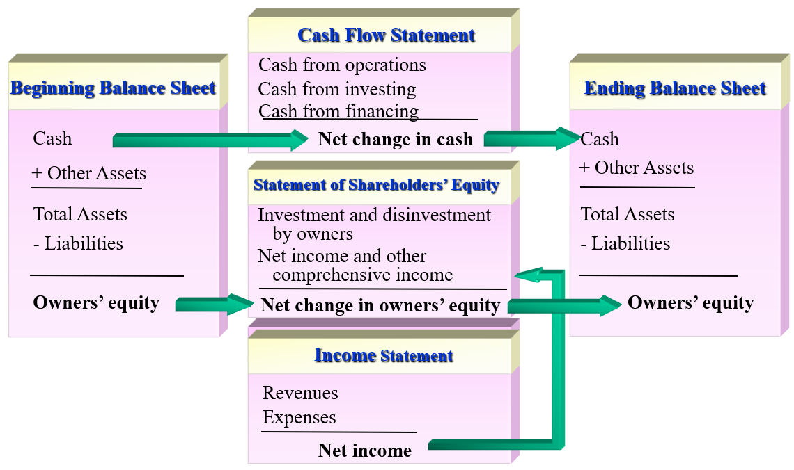
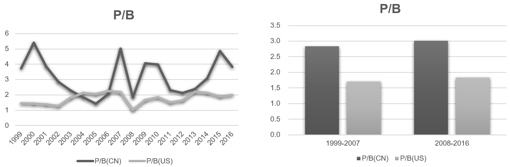

# 财务报表分析
2022春季 赖舒芳

<!-- pagebreak -->

## Chapter 1: Introduction to Investing and Valuation

### Fundamental Risk and Price Risk
- Fundamental risk
  - Risk that results from business operations.
- Price risk
  - Risk of trading at the wrong price.

### How Business Works

### Types of Activities
- Financing Activities
  - Raising cash from investors and returning cash to investors.
- Investing Activities
  - Investing cash raised from investors in operational assets. For example, 
    - <abbr title='Research and Development'>R&D</abbr> expenditures
    - Additions to <abbr title='Property, Plant and Equipment'>PPE</abbr>
    - ...
- Operating Activities
  - Utilizing investments to produce and sell products.

### Firm Valuation
- Formula
  $$
  \text{Value of the Firm} = \text{Value of Debt} + \text{Value of Equity}
  $$
- Example
  
  - You may think the answer is just the sum of the numbers listed by using the formula above. However, the value of equity does not equal to stockholder's equity which is a book value.
  - The value of debt is just $\text{\textdollar}8,406+\text{\textdollar}14,512=\text{\textdollar}22,918 \text{ million}$ while the value of equity is $\text{\textdollar}41\times 2,126 \text{ million} = \text{\textdollar}87,166 \text{ million}$
  - Thus, the enterprise market value is $\text{\textdollar}22,918+\text{\textdollar}87,166=\text{\textdollar}110,084 \text{ million}$

### Anchoring Valuation
- Formula
  $$
  \text{Value} = \text{Anchor} + \text{Extra Value}
  $$
- Example
  - A firm reports book value of shareholders' equity of $\text{\textdollar}850 \text{ million}$ with $25 \text{ million}$ shares outstanding. Those shares trade at $\text{\textdollar}45$ each in the stock market. An analyst values the equity by setting the book value as an anchor. She calculates extra value of $\text{\textdollar}675 \text{ million}$. Should she issue a buy or a sell recommendation to her clients?
  - The analyst evaluates the equity value as $\text{\textdollar}850 \text{ million} + \text{\textdollar}675 \text{ million} = \text{\textdollar}1,525 \text{ million}$. Under this valuation, the price of the stock should be $\frac{\text{\textdollar}1,525 \text{ million}}{25 \text{ million}}=\text{\textdollar}61$, which is higher than the current price. Thus, she should issue a buy recommendation.

> However, the accuracy and timeliness of the earnings forecasts are not as important as we think among the factors affecting analysts' compensation. Instead, the most important things are: your industry knowledge, your standing in analyst rankings or broker votes, your accessibility and responsiveness, and your professional integrity.

### The Analysis of Business
- Business (Firm's Products)
  - Types of products
  - Consumer demand
  - Substitutes
  - ...
- Technology
  - Production, marketing and distribution processes
  - Supplier network
  - Cost structure
  - ...
- Firm's Knowledge Base
  - Direction and pace of technological change and the firm's grasp of it
  - Research and development programs
  - Innovation ability
  - ...
- Industry Competition
  - Industry concentration and the firm's position
  - Barriers to entry the industry
  - Competitiveness of suppliers and the capacity
  - ...
- Management
  - Whether the management focus on shareholders or their own interests
  - Strength of corporate governance mechanisms
  - ...
- Political, Legal and Regulatory Environment
  - Political influence
  - Legal and regulatory constraints
  - Taxation
  - ...

<!-- pagebreak -->

## Chapter 2: Introduction to the Financial Statements

### Four Financial Statements
- <mark>Balance Statement</mark>
  - Common Structure

    $\text{Cash}$

    $+ \text{ Other Assets}$

    $\overline{\qquad \qquad \qquad \qquad \qquad}$

    $\text{Total Assets}$

    $- \text{ Liabilities}$

    $\overline{\qquad \qquad \qquad \qquad \qquad}$

    $\text{Shareholders' Equity}$
- <mark>Cash Flow Statement</mark>
  - $\text{Change in Cash} = \text{Cash from Operations} + \text{Cash from Investing} + \text{Cash from Financing}$
- <mark>Statement of Shareholders' Equity</mark>
  - $\text{Ending Equity} = \text{Beginning Equity} + \text{Comprehensive Income} - \text{Net Payout to Shareholders}$
  - $\text{Comprehensive Income} = \text{NI} + \text{Other Comprehensive Income}$
  - $\text{Net Payout to Shareholders} = \text{Dividends} + \text{Share Repurchases} - \text{Share Issues}$
- <mark>Income Statement</mark>
  - Common Structure

    $\text{Net Revenue}$

    $- \text{ Cost of Goods Sold}$

    $\overline{\qquad \qquad \qquad \qquad \qquad \qquad \qquad \qquad \qquad \qquad \ }$

    $\text{Gross Margin}$

    $- \text{ Operating Expenses}$

    $\overline{\qquad \qquad \qquad \qquad \qquad \qquad \qquad \qquad \qquad \qquad \ }$

    $\text{Operating Income (EBIT)}$

    $- \text{ Interest Expense}$

    $+ \text{ Interest Income}$

    $\overline{\qquad \qquad \qquad \qquad \qquad \qquad \qquad \qquad \qquad \qquad \ }$

    $\text{Income before Taxes}$

    $- \text{ Income Taxes}$

    $\overline{\qquad \qquad \qquad \qquad \qquad \qquad \qquad \qquad \qquad \qquad \ }$

    $\text{Income before Extraordinary Items}$

    $+ \text{ Extraordinary Items}$

    $\overline{\qquad \qquad \qquad \qquad \qquad \qquad \qquad \qquad \qquad \qquad \ }$

    $\text{Net Income (NI)}$

    $- \text{ Preferred Dividends}$

    $\overline{\qquad \qquad \qquad \qquad \qquad \qquad \qquad \qquad \qquad \qquad \ }$

    $\text{Net Income Available to Common Shareholder}$
- <mark>Articulation</mark>
  
- Example
  - From the following information for the year 2012, calculate the ending equity under <abbr title='Generally Accepted Accounting Principle'>GAAP</abbr> rules (<abbr title='Research and Development'>R&D</abbr> expenses are expensed as incurred), for a company with shareholders' equity at the beginning of 2012 of $\text{\textdollar}3,270 \text{ million}$. Amounts are in millions.
    > <abbr title='Generally Accepted Accounting Principle'>GAAP</abbr> is used in America, while <abbr title='International Financial Report Standard'>IFRS</abbr> is the international version. China uses a version closed to <abbr title='International Financial Report Standard'>IFRS</abbr>.

    
  - $\text{Gross Margin} = \text{\textdollar}4458 - \text{\textdollar}3348 = \text{\textdollar}1110$
    $\text{EBIT} = \text{Gross Margin} - \text{\textdollar}1230 - \text{\textdollar}450 = \text{\textdollar}(-570)$
  - Note that the number in the parentheses means negative number. Thus, we have $\text{NI} = \text{EBIT} - \text{\textdollar}(-200) = \text{\textdollar}(-370)$.

    > [!TIP]
    > A loss yields a tax benefit that the firm can carry forward to reduce future taxes.
  - $\text{Comprehensive Income} = \text{NI} + \text{\textdollar}76 = \text{\textdollar}(-294)$
    $\text{Net Payout} = \text{\textdollar}140 - \text{\textdollar}680 = \text{\textdollar}(-540)$
    $\text{Ending Equity} = \text{\textdollar}3270 + \text{Comprehensive Income} - \text{Net Payout} = \text{\textdollar}3516$

### Price-to-Book Ratio (P/B)
- $\text{Market Premium} = \text{Market Value of Equity} - \text{Book Value of Equity}$
  $\text{P/B} = \frac{\text{Market Value of Equity}}{\text{Book Value of Equity}}$
- $\text{Intrinsic Premium} = \text{Intrinsic Value of Equity} - \text{Book Value of Equity}$
  $\text{Intrinsic P/B} = \frac{\text{Intrinsic Value of Equity}}{\text{Book Value of Equity}}$
- Book Value Measurement
  - Historical Cost Accounting
  - Fair Value Accounting
- Median-Level Comparison between China and US
  
  The reasons that P/B in China is higher than that in US should be organized into 2 aspects: <mark>overestimated price and underestimated book value</mark>. Overestimated price may result from the <mark>short-selling constraints</mark> and underestimated book value may be related to the omitted <mark>shell value</mark>.
- Industry Comparison
  
  Price is about expectation, which means industries like Information Technology and Health Care have higher P/B due to the imagination of their development (high <abbr title='Research and Development'>R&D</abbr> expenses), while industries like Utilities and Financials have lower P/B (close to 1 in US) because of their limited development.

### Price-to-Eearnings Ratio (P/E)
- $\text{Trailing P/E} = \frac{\text{Price}}{\text{Most Recent annual EPS}}$
- $\text{Rolling P/E} = \frac{\text{Price}}{\text{Sum of EPS for most recent 4 quarters}}$
- $\text{Forward P/E} = \frac{\text{Price}}{\text{Forecast of Next Year's EPS}}$
- $\text{Dividend-Adjusted P/E} = \frac{\text{Price}+\text{Annual DPS}}{\text{EPS}}$ (Dividends affects prices but not earnings)

<!-- pagebreak -->

## Chapter 3: How Financial Statements Are Used in Valuation

### Simple Schemes for Valuation
- The Method of Comparables
  - Assume some characteristics of 2 similar firms are equal, then we can estimate a firm's value by anchoring the other one.
- Screening on Multiples
  - Multiple Sorting
- Asset-Based Valuation
  - Estimate the firm's assets and substracts the value of debt.

### Valuation Models
- Discounted cash flow (bond, NPV, etc.)
- CAPM

<!-- pagebreak -->

## Chapter 4: Cash Accounting, Accrual Accounting, and Discounted Cash Flow Valuation

### DDM (Dividend Discount Model)
Using discounted dividends forecast as valuation.
- Advantages
  - Easy concept: dividends are what shareholders get.
  - For a frim with a fixed payout ratio, dividends are predictable at least in the short run.
- Disadvantages
  - Dividends payout is not related to value. A company can borrow to pay dividends.
  - Forecast horizons should be long. For firms without a fixed payout ratio, the forecasts are unreliable.

### DCF (Discounted Cash Flow) Model
Using discounted <abbr title='Free Cash Flow'>FCF</abbr> as valuation.
$$
\text{Free Cash Flow (FCF)} = \text{Operating Cash Flow (OCF)} - \text{Capital Expenditure (CAPX)}
$$
- Advantages
  - Easy concept: cash flow are "real" and easy to think about; they are not affected by accounting rules.
  - Similar to NPV.
  - It works best when the investment pattern is such as to produce constant free cash flow or <abbr title='Free Cash Flow'>FCF</abbr> growing at a constant rate.
- Disadvantages
  - <abbr title='Free Cash Flow'>FCF</abbr> does not measure value added in the short run. It fails to recognize value generated that does not involve cash flows.
  - Investment is treated as a loss of value, so firms can increase <abbr title='Free Cash Flow'>FCF</abbr> by cutting back on investments, which does not mean value added.

### Reported Cash Flow and Cash Flow in Operations

- Cash Flow from Operations

  Reported <abbr title='Operating Cash Flow'>OCF</abbr> includes interest, which is a financing cash flow, so the actual cash flow from operations should be
  $$
  \text{Cash Flow from Operations} = \text{OCF} + \text{After-Tax Net Interest Payments}
  $$where 
  $$
  \text{After-Tax Net Interest Payments} = (\text{Interest Payments} - \text{Interest Receipts}) \times (1 - \text{Tax Rate})
  $$
- Cash Investment in Operations

  Reported cash investments include net investments in interest bearing financial assets (assets that can generate interest), which is also a financing cash flow, so cash investments in operations should be 
  $$
  \text{Cash Investment in Operations} = \text{Reported Cash Flow from Investing} - \text{Net Investment in Interest-Bearing Securities}
  $$
- Free Cash Flow

  Using the concepts above, the <abbr title='Free Cash Flow'>FCF</abbr> can be calculated by 
  $$
  \text{FCF} = \text{Cash Flow from Operations} - \text{Cash Investments in Operations}
  $$

### Earnings and Cash Flows
$$
\text{Earnings} = \text{OCF} + \text{Accruals}\\
{}\\
\begin{aligned}
 \text{Operating Earnings} &= \text{Earnings} + \text{After-Tax Net Interest Payments}\\
 &= \text{OCF} + \text{Accruals} + \text{After-Tax Net Interest Payments}\\
 &= \text{Cash Flow from Operations} + \text{Accruals}\\
 &= \text{Cash Investments in Operations} + \text{FCF} + \text{Accruals}
\end{aligned}
$$
> [!NOTE]
> OCF is reported, while cash flow from operations is interest-adjusted.

<!-- pagebreak -->

## Chapter 5: Accrual Accounting and Valuation Pricing Book Values

### Residual Earnings and Valuation
$$
\text{Residual Earnings}_{t} = \text{Earnings}_{t} - \text{Investment}_{t-1} \times \text{Required Return}
$$To valuate a firm anchoring on its book value, we see the book value of common equity as investment, i.e., 
$$
\begin{aligned}
 \text{Residual Earnings}_{t} &= \text{Earnings}_{t} - \text{Book Value of Common Equity}_{t-1} \times \text{Required Return}\\
 &= (\text{ROCE}_{t} - \text{Required Return})\times \text{Book Value of Common Equity}_{t-1}\\
\end{aligned}
$$where 
$$
\text{ROCE}_{t} = \frac{\text{Comprehensive Earnings to Common}_{t}}{\text{Book Value of Common Equity}_{t-1}}
$$is called return on common shareholders' equity.

- Example

  The following are earnings and dividend forecasts made at the end of 2012 for a firm with $\text{\textdollar 20.00}$ book value per common share at that time. The firm has a required equity return of $10\%$ per year.
  | $(\text{\textdollar})$ |  2012   |  2013  |  2014  |  2015  |
  | :--------------------: | :-----: | :----: | :----: | :----: |
  |        **EPS**         |  ${}$   | $3.00$ | $3.60$ | $4.10$ |
  |        **DPS**         |  ${}$   | $0.25$ | $0.25$ | $0.30$ |
  |        **BPS**         | $20.00$ |  ${}$  |  ${}$  |  ${}$  |
  
  Given the information above, we can calculate BPS by the formula $\text{BPS}_{t} = \text{BPS}_{t-1} + \text{EPS}_{t} - \text{DPS}_{t}$, which results in 
  | $(\text{\textdollar})$ |  2012   |  2013   |  2014   |  2015   |
  | :--------------------: | :-----: | :-----: | :-----: | :-----: |
  |        **EPS**         |  ${}$   | $3.00$  | $3.60$  | $4.10$  |
  |        **DPS**         |  ${}$   | $0.25$  | $0.25$  | $0.30$  |
  |        **BPS**         | $20.00$ | $22.75$ | $26.10$ | $29.90$ |

  Then the <abbr title="Return on Common Shareholders' Equity">ROCE</abbr> can be calculated by the formula $\text{ROCE}_{t} = \frac{\text{EPS}_{t}}{\text{BPS}_{t-1}}$.
  |          | 2012  |   2013    |   2014    |   2015    |
  | :------: | :---: | :-------: | :-------: | :-------: |
  | **ROCE** | ${}$  | $15.00\%$ | $15.82\%$ | $15.71\%$ |

  The residual earnings can be calculated by the formula $(\text{ROCE}_{t} - \text{Required Return})\times \text{Book Value of Common Equity}_{t-1}$.
  | $(\text{\textdollar})$ | 2012  |  2013  |  2014  |  2015  |
  | :--------------------: | :---: | :----: | :----: | :----: |
  |         **RE**         | ${}$  | $1.00$ | $1.32$ | $1.49$ |

  Since the retain earnings are all positive, the firm has a positive extra value. Thus, the intrinsic value of equity per share (assume retain earnings are zero after 2015) is 
  $$
  \text{\textdollar}20.00 + \frac{\text{\textdollar}1.00}{1+10\%} + \frac{\text{\textdollar}1.32}{(1+10\%)^{2}} + \frac{\text{\textdollar}1.49}{(1+10\%)^{3}} = \text{\textdollar}23.12
  $$

- Advantages of Residual Earnings Valuation
  - Focus on value drivers - profitability of investment and growth in investment.
  - Using accrual accounting: 
    - Use the properties of accrual accounting that recognize value added ahead of cash flows;
    - Match value added to value given up;
    - Treat investment as an asset rather than a loss of value.
  - Aligned with what people forecast - earnings.

<!-- pagebreak -->

## Chapter 6: Accrual Accounting and valuation: Pricing Earnings
