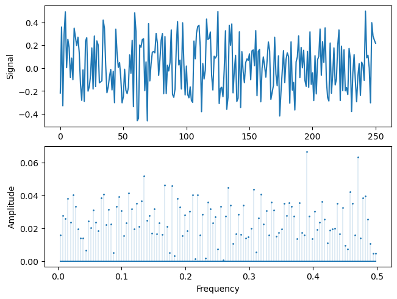
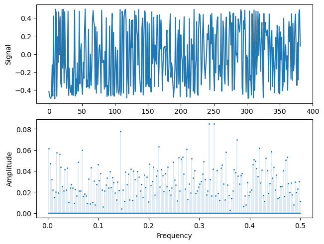

# 应用：短期反转增强

## 传统短期反转

传统的短期反转策略是指买入过去一个月表现最差的股票，卖出过去一个月表现最好的股票。这个策略描述了**股票月频收益率的截面排序（归一化后）有一定的周期性**：

股票 10006 的月频收益率截面排序（归一化后）

股票 45373 的月频收益率截面排序（归一化后）

如上图所示，随机选了两只股票，它们的月频收益率截面排序变化都很剧烈，肉眼看上去还都比较符合短期反转的逻辑。从频率的角度考虑，**如果月频收益率截面排序的周期为两个月**，那么当上个月在波峰的时候，下个月就会在波谷；上个月在波谷的时候，下个月就会在波峰。这样就可以构造完美的短期反转策略，即买波谷，卖波峰，下个月的时候多头就会在波峰，空头在波谷。**如果月频收益率截面排序的周期为四个月**，那么无论上个月在波峰还是波谷，下个月都会是 $0$，这样买波谷，卖波峰，得到的收益就是 $0$。因此**想要短期反转策略有正收益，需要股票月频收益率截面排序的周期在两个月到四个月之间，对应频率区间为 $(0.25,\ 0.5]$**。

## 短期反转增强

根据上面的分析，如果股票月频收益率截面排序的周期为两个月到四个月之间，短期反转策略就会有正收益。那么我们是不是可以在所有股票中**先将这类股票挑出来**，再去进行短期反转策略呢？

对于噪声信号，PSD 的分布是均匀的，因此 $(0.25,\ 0.5]$ 区间上的功率占总功率的一半，也就是功率占比为 $0.5$。我们上面随机选的两只股票，10006 和 45373，它们在这个区间上的功率占比分别为 $0.4983$ 和 $0.5525$，所以 45373 应当更符合短期反转策略的逻辑。对全样本进行功率占比的计算，得到以下统计量：

|       | 功率占比  |
| :---- | :-------: |
| count |   14750   |
| mean  | 0.533335  |
| std   | 0.0691821 |
| min   |  0.25628  |
| 25%   | 0.489897  |
| 50%   | 0.533728  |
| 75%   | 0.577615  |
| max   | 0.824004  |

可以看到平均是 $0.5333$，所以符合短期反转策略的股票确实是占多数。而至少有 25\% 的股票是不符合短期反转策略逻辑的，所以我们可以将这部分股票剔除。

### 基准策略

为了控制变量，对传统短期反转和短期反转增强，我们同等地要求股票过去有至少 5 年的连续数据。通过买入过去一个月表现最差的 10\% 股票，卖出过去一个月表现最好的 10\% 股票，我们可以得到传统短期反转策略的多空 Sharpe 为 $1.3546$，其中多头 Sharpe 为 $0.8501$，空头为 $0.0870$，即收益主要来自于多头。平均每个月多（空）头交易的股票数量为 297（299）只。

### 上帝视角

对全样本期内有至少 5 年的股票，我们可以先开上帝视角看看 $(0.25,\ 0.5]$ 频率区间的功率占比对短期反转策略的增强效果有多大。选出全样本中功率占比高于某个阈值的股票，同样是买入过去一个月表现最差的 10\% 股票，卖出过去一个月表现最好的 10\% 股票。当阈值是 $0.5$ 时，这个策略的多空 Sharpe 为 $2.15$，其中多头 Sharpe 为 $1.14$，空头为 $0.44$，即收益主要来自于多头。下面列出不同阈值下的 Sharpe：

| 阈值  | 多空 Sharpe | 多头 Sharpe | 空头 Sharpe |
| :---: | :---------: | :---------: | :---------: |
| 0.50  |    2.15     |    1.14     |    0.44     |
| 0.51  |    2.30     |    1.18     |    0.51     |
| 0.52  |    2.46     |    1.24     |    0.59     |
| 0.53  |    2.59     |    1.30     |    0.68     |
| 0.54  |    2.75     |    1.36     |    0.77     |
| 0.55  |    2.98     |    1.44     |    0.90     |
| 0.56  |    3.19     |    1.50     |    1.04     |
| 0.57  |  **3.39**   |    1.58     |    1.24     |
| 0.58  |    3.29     |  **1.59**   |    1.37     |
| 0.59  |    3.16     |  **1.59**   |    1.41     |
| 0.60  |    3.27     |    1.57     |  **1.75**   |

可以看到增强效果还是很不错的，随着阈值增大，多空 Sharpe、多头 Sharpe 和空头 Sharpe 都在增加，不过阈值高到一定程度后，多头不再有增强，而是空头在增强。

### 短期反转增强策略

看完了上帝视角，我们只用过去的数据来构造策略看看。在过去有至少 5 年的连续数据的股票中，挑选出过去 5 年在 $(0.25,\ 0.5]$ 区间功率占比高于某个阈值的股票，同样是买入过去一个月表现最差的 10\% 股票，卖出过去一个月表现最好的 10\% 股票。当阈值是 $0.5$ 时，这个策略的多空 Sharpe 为 $1.5523$，其中多头 Sharpe 为 $0.9215$，空头为 $0.1593$，同样地，收益主要来自于多头。平均每个月多（空）头交易的股票数量为 211（212）只。下面列出不同阈值下的各项数据：

| 阈值  | 多空 Sharpe | 多头 Sharpe | 空头 Sharpe | 多头平均交易数量 | 空头平均交易数量 |
| :---: | :---------: | :---------: | :---------: | :--------------: | :--------------: |
| 0.50  |   1.5523    |   0.9215    |   0.1593    |       211        |       212        |
| 0.51  |   1.5491    |   0.9323    |   0.1495    |       195        |       196        |
| 0.52  |   1.5539    |   0.9358    |   0.1622    |       177        |       179        |
| 0.53  |   1.5595    |   0.9466    |   0.1669    |       160        |       161        |
| 0.54  |   1.5484    |   0.9599    |   0.1673    |       141        |       143        |
| 0.55  |   1.5751    |   0.9661    |   0.1901    |       123        |       125        |
| 0.56  |   1.5517    |   0.9693    |   0.1955    |       106        |       107        |
| 0.57  | **1.5979**  |   0.9951    |   0.2273    |        90        |        91        |
| 0.58  |   1.5484    | **1.0006**  |   0.2284    |        74        |        75        |
| 0.59  |   1.5163    |   0.9775    | **0.2577**  |        61        |        62        |
| 0.60  |   1.3789    |   0.9488    |   0.2121    |        49        |        50        |

可以看到，在保证一定交易数量的情况下，增强的效果对阈值的选取并不太敏感，基本都有大于 $1.55$ 的多空 Sharpe，以及接近 $1$ 的多头 Sharpe，在基准策略的基础上提升了 15\% 左右。而且多空和多头表现最好的参数与上帝视角是相同的，空头（的参数）也比较接近。