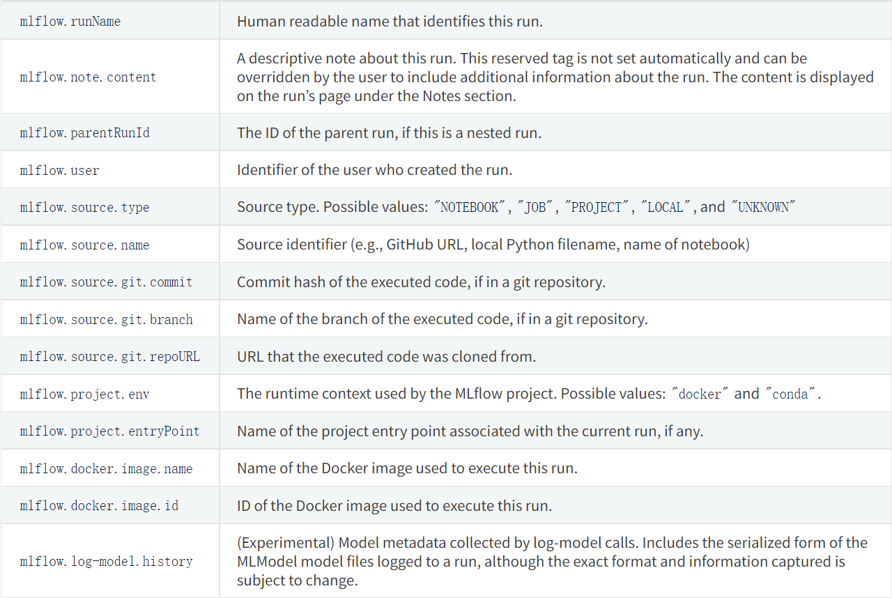
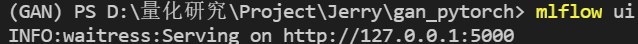
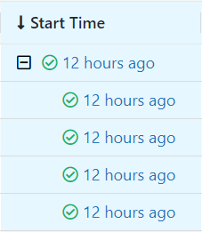
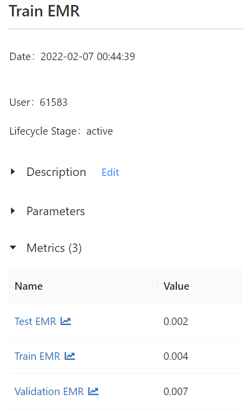
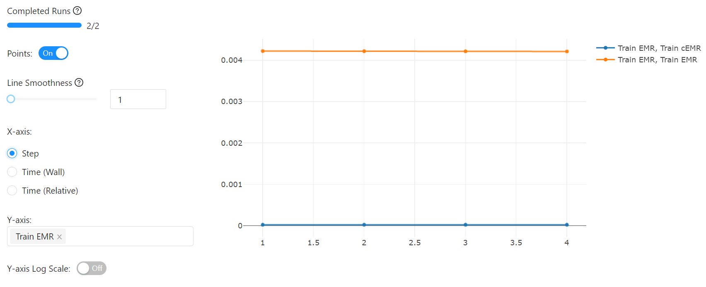
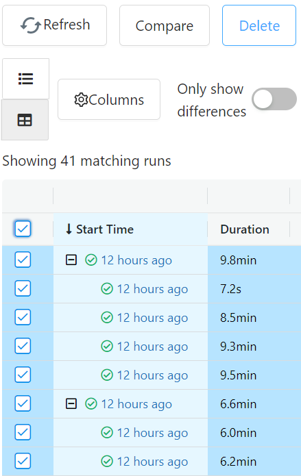
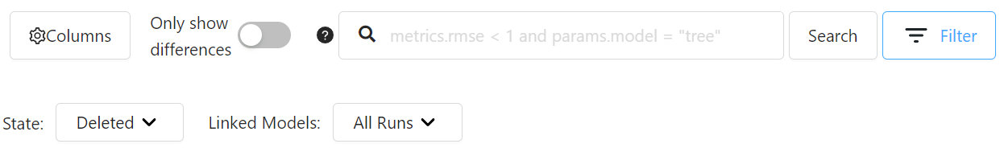
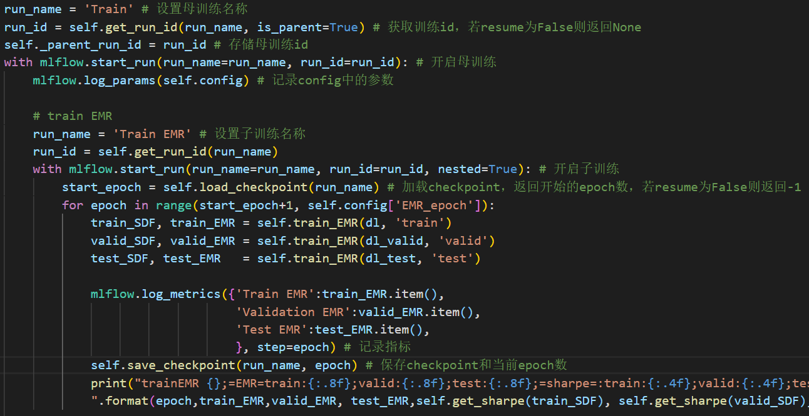
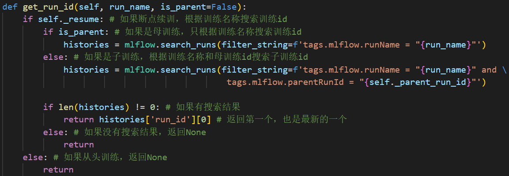

---
puppeteer:
    printBackground: true
---

# mlflow
[toc]

### 安装与使用
- 安装
``` python
pip install mlflow # 在命令行中输入
```
- 使用
``` python
import mlflow
```

### 开启训练
``` python
mlflow.set_experiment('your_experiment_name') # 设置实验名称

with mlflow.start_run(run_name='your_run_name'): # 设置训练名称
    model.train()
```
- 可以在训练中嵌入子训练
``` python
with mlflow.start_run(run_name='parent_run_name'): # 设置母训练名称
    with mlflow.start_run(run_name='child_run_name1', nested=True): # 设置子训练1的名称
        model1.train()

    with mlflow.start_run(run_name='child_run_name2', nested=True): # 设置子训练2的名称
        model2.train()
```
- 指定run_id可以继续之前的训练记录
``` python
with mlflow.start_run(run_id='past_run_id'): # 当指定run_id，其他的参数都将无效
    model.train()
```
> 注意：继续训练记录并不等于继续训练，只是将训练过程中需要记录的东西继续记录到同一个训练目录下。


### 超参记录
- 每次训练记录一次，例如学习速率、epoch数量等
``` python
mlflow.log_param(param, 'param_name') # 记录一个参数
mlflow.log_params({'param_name1':param1, 
                   'param_name2':param2
                   }) # 记录多个参数
```

### 指标记录
- 每个epoch记录一次，例如loss、accuracy等
``` python
mlflow.log_metric(metric, 'metric_name') # 记录一个指标
mlflow.metrics({'metric_name1':metric1, 
                'metric_name2':metric2
                }) # 记录多个指标
```

### 文件记录
- 记录训练过程中需要保存的文件
``` python
mlflow.log_artifact('artifact_path') # 记录一个文件
mlflow.log_artifacts('folder_path') # 记录一个文件夹下所有文件
```
- 可以直接记录matplotilib或者plotly中的Figure
``` python
mlflow.log_figure(Figure, 'figure_path') # 记录图片
```
- 也可以直接记录文字
``` python
mlflow.log_text(text, 'figure_path') # 记录文字
```
> 以上所有文件都将存在对应训练目录中的/artifacts文件夹下，所以输入的路径都是相对路径

### 训练标签与训练id搜索
- 训练标签
  - 除了记录超参、指标、文件，还可以给不同的训练贴标签
  - 默认记录的标签有
  
  - 自定义标签
    ``` python
    mlflow.set_tag('tag_name', tag) # 设置一个标签
    mlflow.set_tags({'tag_name1':tag1, 
                     'tag_name2':tag2
                     }) # 设置多个标签
    ```
- 训练id搜索
  - 训练的id是一串难以记忆的hash key，可以用训练记录的标签来搜索对应的id
    ``` python
    run_name = 'name_to_search'
    histories = mlflow.search_runs(filter_string=f'tags.mlflow.runName = "{run_name}"')
    # 返回pandas.DataFrame，columns是所有标签，index为0的是最新的训练
    recent_run_id = histories['run_id'][0]
    ```

### 训练记录可视化
1. 在命令行中输入
``` python
mlflow ui
```

2. 将网址复制到浏览器打开（vscode可以直接按住Ctrl并点击链接）

- ui中这种蓝色的超链接都是可以点击进去看详细信息的，上图是每个训练开始的时间，点进去可以看到每个训练的详细记录情况

- 点击记录的指标可以显示指标的变化，横坐标可以选step也可以选时间

- 回到主界面，不同的训练之间还可以进行比较

- 选中训练并点击Compare后，可以看到比对的详细信息

- 点击记录的指标可以看到指标变化的比对

- 在ui中可以删除训练

- 但删除只是让训练的State变成Deleted，还是可以在Filter中筛选出来。这个状态下的训练会保留30天，30天后自动删除

- 如果想要立马删除，则在ui中删除后，到命令行中键入
``` python
mlflow gc
```


### 与其他机器学习包的协作
- mlflow支持与各种机器学习包的协作，比如pytorch、tensorflow、sklearn、keras等等
- 使用autolog可以自动记录模型的参数和指标
``` python
mlflow.sklearn.autolog()
mlflow.pytorch.autolog() # 似乎只支持pytorch_lightening，只装pytorch用不了
...
```
- 每种机器学习包都有特定的函数可以使用，以pytorch为例，可以用mlflow.pytorch.log_state_dict来记录checkpoint（记录到artifacts中），用mlflow.pytorch.load_state_dict来加载checkpoint，替代pytorch自带的函数
``` python
mlflow.pytorch.log_state_dict(checkpoint, 'folder_path') # 将pth文件存到artifacts中的指定文件夹内

path = mlflow.get_artifact_uri('folder_path') # 获取指定文件夹的artifact uri（不是本地路径）
mlflow.pytorch.load_state_dict(checkpoint, path) # 加载指定路径中的pth文件
```

### 应用实例
- 以gan_pytorch为例，使用mlflow记录参数与指标，并实现断点续训
- 加入resume参数，True为断点续训，False为从头训练

- 部分主代码

- 相关函数定义


