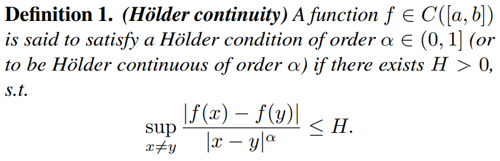
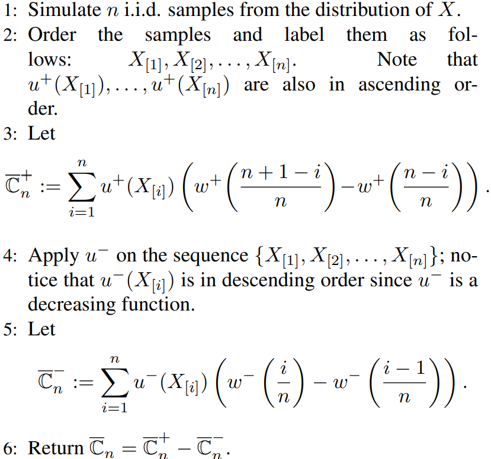
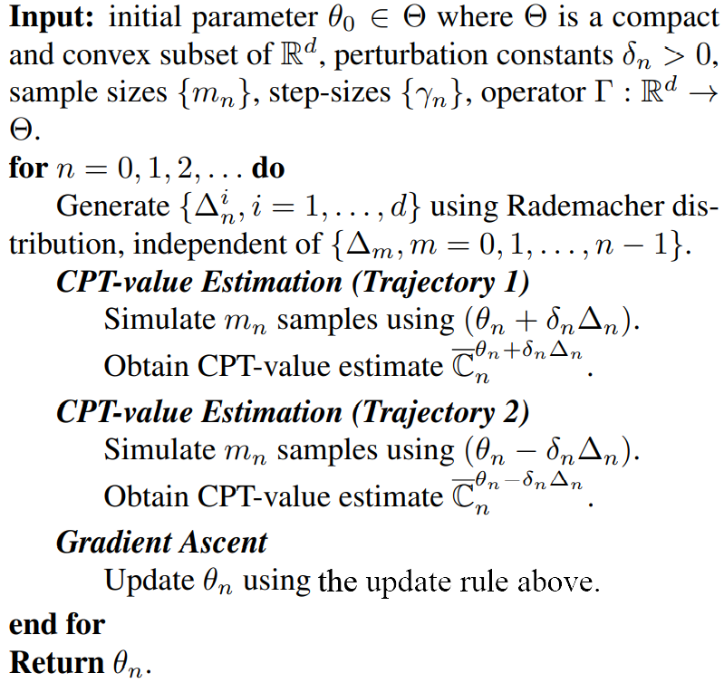
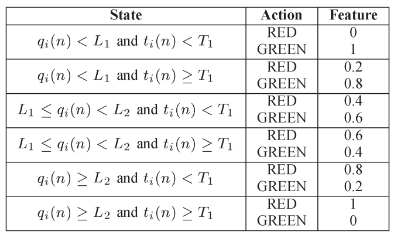

# Cumulative Prospect Theory Meets Reinforcement Learning: Prediction and Control

### Author <!-- {docsify-ignore} -->
Prashanth L.A. et al.

### Publication <!-- {docsify-ignore} -->
ICML 2016

### Related Work <!-- {docsify-ignore} -->
  - Reinforcement Learning With Function Approximation for Traffic Signal Control (Prashanth L. A. & Shalabh Bhatnagar, 2011)
  - Threshold Tuning Using Stochastic Optimization for Graded Signal Control (Prashanth L. A. & Shalabh Bhatnagar, 2012)

<!-- pagebreak -->

## Introduction

### Contributions
- The first to define and investigate *human-centered RL problem*.
- The first to combine CPT with RL.

### Human-centered RL Problem
- Agent controls a system to produce returns that are maximally aligned with the preferences of one or possibly multiple humans.
- Preferences of rational agents facing decisions with stochastic outcomes can be modeled using expected utilities.
- Here the authors use CPT to model the stochastic outcomes.
  

<!-- pagebreak -->

## Traffic Light Control (TLC) Problem

### Target
Train the traffic light to make a better traffic system.

### Environment
- Road network with signalled lanes that are spread across junctions and paths
- Road users (cars)

### Agent
Traffic lights.

### States
  - Queue length (pathwise)
  - Elapsed time (pathwise)

### Actions
Feasible combinations of red and green.

### Reward
CPT-value of <mark>differential delay</mark> $X$ (because CPT needs gains and losses), i.e., $C(X)=\sum\limits_{i=1}^{M} \mu_i C(X_i)$ where $X_i$ is the differential delay (calculated by the elapsed time minus a baseline which is the elapsed time of a fixed-time signal control) of $i$-th path, $\mu_i$ is the proportion of road users on the $i$-th path and $M$ is the num of paths.

<!-- pagebreak -->

## CPT-value Estimation

### Convergence assumptions (eithor or) for probability weighting function $w$
- Lipschitz continuous
- $H \ddot{o} lder$ continuous

  - Lipschitz continuity is the case that $\alpha=1$.
- Locally Lipschitz

### Estimation scheme under each of the assumptions
- Under $H \ddot{o} lder$ continuity, the CPT-value can be estimatied by the <mark>discrete</mark> version.

  - <mark>Algo</mark>: 
 
- Under Locally Lipschitz
  - Omitted

<!-- pagebreak -->

## Gradient-based Algo for CPT Optimization

### Optimization Objective (Reward)
$$
\max_{\theta \in \Theta} \quad C(X^{\theta})\\
$$ where the param vector $\theta$ with dimension $d$ is contrained in a compact and convex real set $\Theta$.

### Gradient Estimation
- It is hard to get the gradient of $C(X^{\theta})$, especially in high-dimension cases.
- <mark>SPSA</mark> (Simultaneous Perturbation Stochastic Approximation)
  - A method to solve the problem above.
  - Use stochastic perturbation to get 2 sample values and approximate the gradient. The idea is similar to $\frac{\mathrm{d}f(x)}{\mathrm{d}x} \approx \frac{f(x+\varepsilon)-f(x-\varepsilon)}{2 \varepsilon}$ where $ \varepsilon$ is a number close to $0$.
  - At the $n$-th iteration, the gradient is estimated by 
  $$
  \hat{\nabla}_i C(X^{\theta}) = \frac{\bar{C}_n^{\theta_n+\delta_n \Delta_n}-\bar{C}_n^{\theta_n-\delta_n \Delta_n}}{2\delta_n \Delta_n^{i}}
  $$ where $\bar{C}_n^{\theta_n}$ is the CPT-estimation calculated using the algo in *CPT-value Estimation* with $m_n$ samples generated by param vector $\theta_n$, $\delta_n$ tends to $0$ as $n \to \infty$ (like $ \varepsilon$ above) and $\Delta_n = (\Delta_n^{1},\ \cdots,\ \Delta_n^{d})^{\mathsf{T}}$ where $\{\Delta_n^{i}\}_{i=1}^{d}\overset{\text{i.i.d.}}{\sim}Rademacher$ (Rademacher distribution is $1$ with half prob and $-1$ with half prob) .

### Update Gradient
- Update Rule (for the $i$-th component of $\theta$): 
$$
\theta_{n+1}^{i} = \Gamma_i\left( \theta_n^{i} + \gamma_n \hat{\nabla}_i C\left( X^{\theta_n} \right)  \right)
$$ where $\Gamma_i$ is the clip operater to constrain $\theta$ in $\Theta$ and $\gamma_n$ is the learning rate (also called the step size).
- Convergence Condition
  - To guarantee that we can obtain the solution after several iterations, we need 
    $$
    \begin{cases}\gamma_n,\ \delta_n \to 0 \\ \frac{1}{m_n^{\frac{\alpha}{2}}\delta_n} \to 0 \\ \sum\limits_{n} \gamma_n \to \infty \\ \sum\limits_{n} \frac{\gamma_n^{2}}{\delta_n^{2}} < \infty \end{cases} \overset{\text{simple choice}} \to \begin{cases}\gamma_n = \frac{\gamma_0}{n} \\ m_n = m_0 n^{\nu} \\ \delta_n = \frac{\delta_0}{n^{\gamma}} \end{cases} \text{for} \begin{cases}\nu,\ \gamma > 0 \\ \gamma > \frac{\nu \alpha}{2} \end{cases}
    $$ where $\alpha$ is the $H \ddot{o}lder$ order (we choose $\alpha=1$ for Lipschitz continuity).

### Gradient Ascent Algo

> There still remains a problem: how the $m_n$ samples are generated, i.e., what is the distribution (policy) we use? See the next chapter.

<!-- pagebreak -->

## Function Approximation and Boltzmann Policy
### Function Approximation
- Note that in $Q$-learning, the policy is dependent on the $Q$-table, which contains all $Q(s,\ a)$ for each state $s$ and each action $a$. At some state $s$, the agent choose the action with biggest $Q$ value. The dimension of the $Q$-table is $S \times A$ where $S$ is the num of states and $A$ is the num of feasible actions.
- In problems with high-dimension of states and actions, $Q$-table becomes computationally expensive. Thus, we use function approximation to approximate the $Q$ funtion: 
  $$
  Q(s,\ a) \approx \theta^{\mathsf{T}} \phi_{s,\ a}
  $$ where $\phi_{s,\ a}$ is a $d$-dimensional vector describing the state-action feature, e.g., $d$ can be $S+A$ if we construct features on each states and actions separately instead of considering their combinations.
- In this paper, the authors use the following settings of state-action feature $\phi_{s,\ a}$: 
  
  where $q$ represents the queue length, $t$ represents the elapsed time and $L_1,\ L_2,\ T_1$ are thresholds. Now the dimension $d = 6A$ since they have shrinked the $S$ states to be $6$ states based on the thresholds.

### Boltzmann Policy
- Instead of choosing action with the biggest $Q$ value, Boltzmann policy makes the $Q$ values to be probs under some state.
- Formula: 
  $$
  \pi_{\theta}(s,\ a) = \frac{e^{\theta^{\mathsf{T}}\phi_{s,\ a}}}{\sum\limits_{a^{'}\in A(s)} e^{\theta^{\mathsf{T}}\phi_{s,\ a^{'}}}}
  $$ where $A(s)$ is the feasible action set under a certain state $s$.
  - The exponential operator makes all values positive and thus can be transformed to be probs.

<!-- pagebreak -->

## Experiments

### Experiment Design
- CPT
  - Use CPT-value as reward.
- EUT
  - Use value function $u$ but do not use probability weighting function $w$.
- AVG
  - Use neither value function nor probability weighting function, i.e., just use the simple mean.
- Do 100 independent tests, calculate CPT-value of these 3 algos respectively.

### Results
- CPT
  
- EUT
  
- AVG
  
- Results show that CPT > EUT > AVG.
  > I think this is obvious and even need not be tested since the final measure is CPT-value and the CPT model is trained based on that.