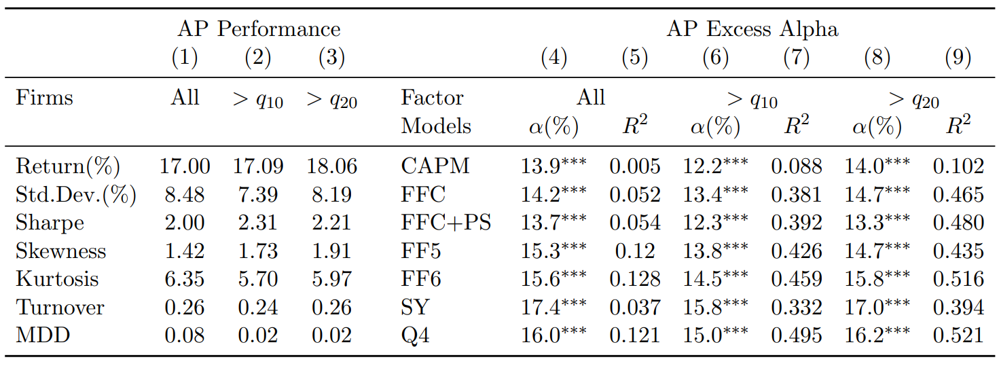
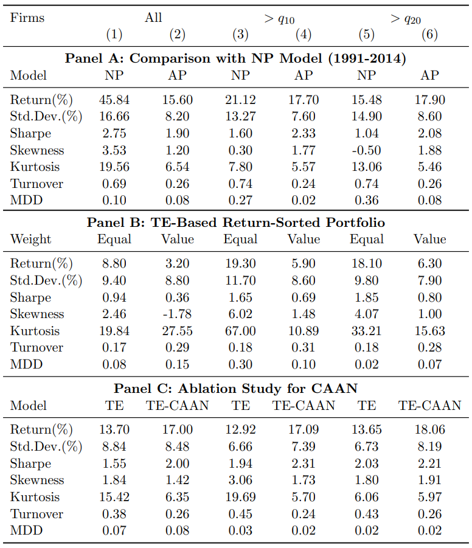

# AlphaPortfolio: Direct Construction Through Deep Reinforcement Learning and Interpretable AI

### Author <!-- {docsify-ignore} -->
Lin William Cong et al.

### Publication <!-- {docsify-ignore} -->
Draft in 2021.8

### Introduction
Traditional portfolio management steps:
1. minimize pricing errors or estimate risk premia from historical samples;
2. combine assets to achieve investment objectives.

Drawback of traditional methods:
- there are large estimation errors in step 1;
- the goals in 2 steps are not necessarily aligned.

Financial data tend to be 
- high-dimensional
- noisy
- nonlinear

Recent studies have used ML or NN to tackle the challenges in financial data and the problem of estimation errors. However, they are still in the 2-step framework.

We take a data-driven approach to directly optimize portfolios using DRL. The DL part is an attention-based multi-sequence model which has 2 components: 
- Sequence Representation Extraction Model (SREM), such as Transformer Encoder (TE) and Long Short-Term Memory (LSTM), to flexibly and effectively represent and extract information from the time series of high-dimensional input features;
- Cross-Asset Attention Network (CAAN) that capture attribute interactions across assets.
 
Our portfolio selection is based on a winner score (model output) generated by the DL part. The strategy is trained by RL based on OOS (out of sample) Sharpe ratio.

Although AI models are effective and applicable, the black-box nature of may hinder their wide use in finance. Thus, we introduce a method called economic distillation to interprete complex AI models. The method is to use gradient-based methods and Lasso to distill the model into a linear model with a small number of input features, while allowing higher-order terms and feature interactions. We find that Tobin’s Q, inventory changes, changes in shares outstanding, etc., play dominant roles.

### Model

#### Sequence Representation Extraction Model (SERM)
Consider $I$ assets, the historical states of an asset $i$ in a look-back window with length $K$ are denoted as a sequence 
$$
\bm{X}^{(i)} = \left\{\bm{x}_1^{(i)},\ \cdots,\ \bm{x}_k^{(i)},\ \cdots,\ \bm{x}_K^{(i)} \right\}
$$

SREM learns representation $\bm{r}^{(i)}$ from $\bm{X}^{(i)}$. For example, we use TE as SREM and TE encodes $\bm{X}^{(i)}$ into $\bm{Z}^{(i)}$ where $\bm{Z}^{(i)}=\left\{\bm{z}_1^{(i)},\ \cdots,\ \bm{z}_k^{(i)},\ \cdots,\ \bm{z}_K^{(i)} \right\}$. The $\bm{z}_k^{(i)}$ is the hidden state encoded at step $k$. The representation $\bm{r}^{(i)}$ is the concatenation of all $\bm{z}_k^{(i)}$, i.e., $\bm{r}_k^{(i)}=\text{Concat}\left( \bm{z}_1^{(i)},\ \cdots,\ \bm{z}_k^{(i)},\ \cdots,\ \bm{z}_K^{(i)} \right)$.

#### Cross-Asset Attention Network (CAAN)
Given the representation $\bm{r}^{(i)}$, we calculate a query vector $\bm{q}^{(i)}$, a key vector $\bm{k}^{(i)}$ and a value vector $\bm{v}^{(i)}$ as 
$$
\bm{q}^{(i)} = \bm{W}^{(Q)} \bm{r}^{(i)},\quad \bm{k}^{(i)} = \bm{W}^{(K)} \bm{r}^{(i)},\quad \bm{v}^{(i)} = \bm{W}^{(V)} \bm{r}^{(i)}
$$

where $\bm{W}^{(Q)}$, $\bm{W}^{(K)}$ and $\bm{W}^{(V)}$ are the matrices of params to learn that are asset-independent.

The interrelationship of asset $j$ to asset $i$ is modeled as using the $\bm{q}^{(i)}$ of $i$ to query the key $\bm{k}^{(j)}$ of $j$, i.e., the rescaled inner product between $\bm{q}^{(i)}$ and $\bm{k}^{(j)}$: 
$$
\beta_{ij} = \frac{\bm{q}^{(i)} {}^{\mathsf{T}} \cdot \bm{k}^{(j)}}{\sqrt{d_k}}
$$

where $d_k$ is a rescale param (the dimension of $\bm{k}^{(j)}$) to avoid the dot product from becoming too large.

We use the normalized interrelationships $\left\{ \beta_{ij} \right\}$ to construct weights (softmax) for values $\left\{ \bm{v}^{(j)} \right\}$: 
$$
\text{softmax}(\beta_{ij}) = \frac{\exp(\beta_{ij})}{\sum\limits_{j^{\prime}=1}^{I} \exp(\beta_{ij^{\prime}})}
$$

The interrelationship and softmax process can be represented as a self-attention function (SATT), i.e., 
$$
\text{SATT}\left( \bm{q}^{(i)},\ \bm{k}^{(j)} \right) = \frac{\exp(\beta_{ij})}{\sum\limits_{j^{\prime}=1}^{I} \exp(\beta_{ij^{\prime}})}
$$

Then we get an attention vector for asset $i$: 
$$
\bm{a}^{(i)} = \sum\limits_{j=1}^{I} \text{SATT}\left( \bm{q}^{(i)},\ \bm{k}^{(j)} \right) \cdot \bm{v}^{(j)}
$$

We use a fully connected layer to transform $\bm{a}^{(i)}$ into a winner score as 
$$
s^{(i)} = \tanh \left( \bm{w}^{(s)} {}^{\mathsf{T}} \cdot \bm{a}^{(i)} + e^{(s)} \right) 
$$

where $\bm{w}^{(s)}$ and $e^{(s)}$ are the connection weights and the bias to learn.

#### Portfolio Generation
We sort assets by descending winner scores. We will long the first $G$ assets and short the last $G$ assets with weights constructed by softmax of winner scores, i.e., 
$$
\begin{aligned}
 b^{+(i)} &= \frac{\exp\left( s^{(i)} \right) }{\sum\limits_{o^{(i^{\prime})}\in [1,\ G]} \exp\left( s^{(i^{\prime})} \right) }\\
 b^{-(i)} &= \frac{\exp\left( -s^{(i)} \right) }{\sum\limits_{o^{(i^{\prime})}\in (I-G,\ I]} \exp\left( -s^{(i^{\prime})} \right) }\\
\end{aligned}
$$

where $o^{(i)}$ is the rank of asset $i$.

The remaining $I-2G$ assets do not have clear buy or sell signals and thus are not included in our portfolio.

#### RL Optimization
- State: historical states of all assets
- Action: portfolio weights
- Reward: Sharpe ratio in a 12-month window

An episode is one year of investment which contains 12 trading periods.

- Training set: July 1965 - December 1989
- $G$: 10\% of available stocks

We randomly draw a month from the training set without replacement, and use inputs from the preceding 12 months (including the drawn month) and then evaluate performance on the subsequent 12 months (Sharpe ratio) to update the parameters. When we have drawn all months in the training set, we finish an epoch. We use 30 epochs. Learning rate is set to be 1e-4 in the first 5 epochs, then 5e-5 in the next 10 epochs, and 1e-5 after that.

- Test set: January 1990 - December 2016

We do a rolling annually update to our model. After 1 year of testing, we use 6 epochs each containing 12 steps to update the parameters. Learning rate is set to be 1e-4 at first, then 5e-5 after 2 epochs and 1e-5 after 4 epochs.

### Data
- Market: US stock market
- Time period: July 1965 - June 2016

Require stocks has 2 years of data in training set and and 1 year of data in OOS test set.

#### Features
Appendix B

### Empirical Tests and Results

#### Factor Model Tests

where $q_n$ is the $n$-th NYSE size percentile. *** means significant at 1\% level.

#### AI Model Tests

- Panel A compares NP model in *Freyberger et al. (2020)*.
- Panel B shows results of using traditional 2-step method (use TE to predict stock returns and then form expected-return-sorted portfolios).
- Panel C compares results of training without and with CAAN.

### Robustness
pass

### Variants
- Add transaction costs lowers turnover.
- Dynamic budget consideration (?).
- Fund management with low sd: Change the objective to be the expected cumulative return over a year with transaction cost, and add a state to see whether the portfolio ever incurs a 50\% loss during the 1-year trading.
- Fund management for compensation (?).

### Economic Distillation
