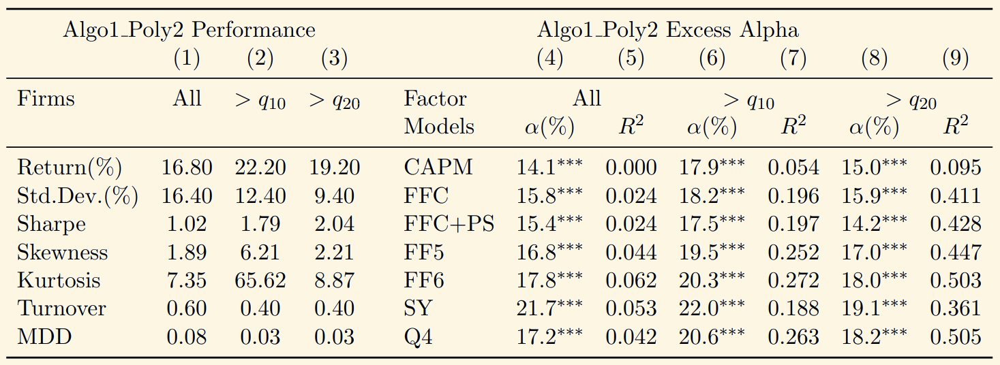
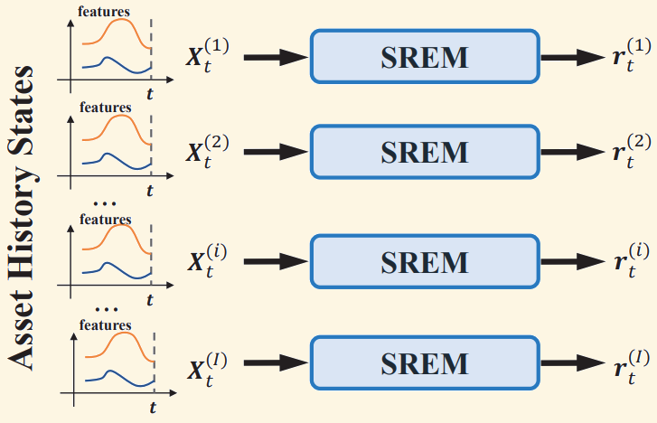
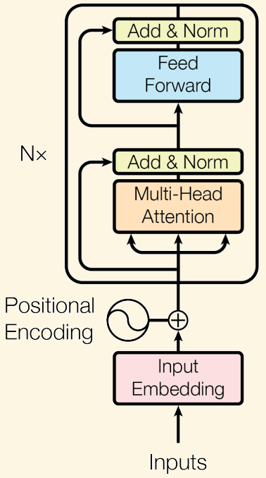
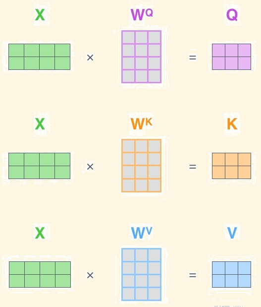
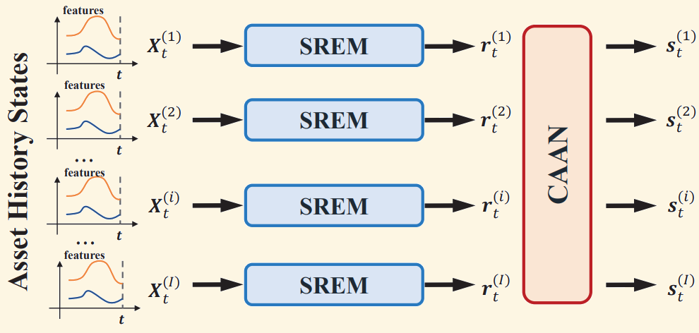
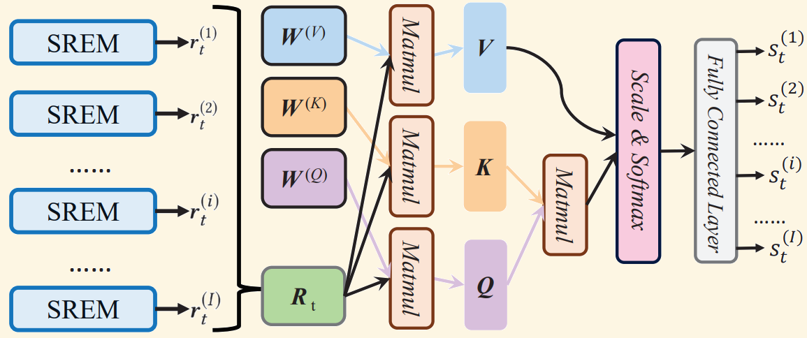
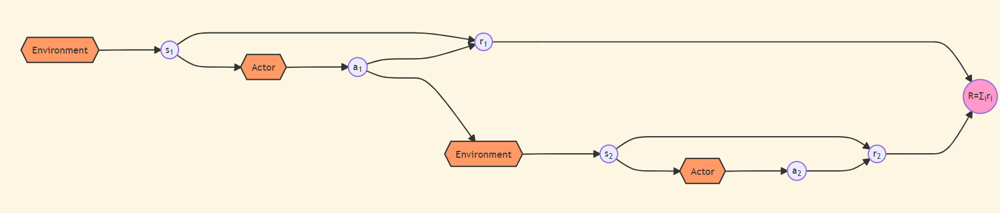
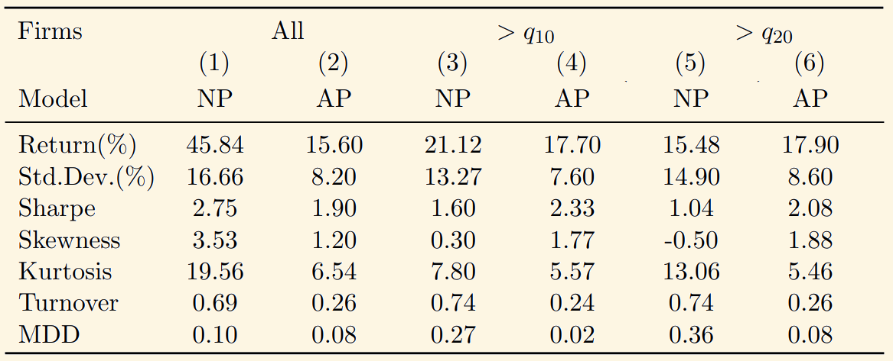
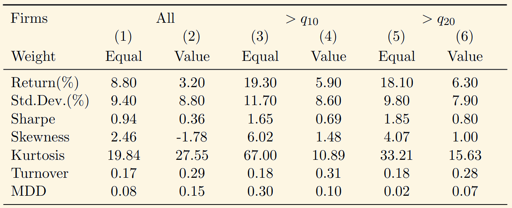
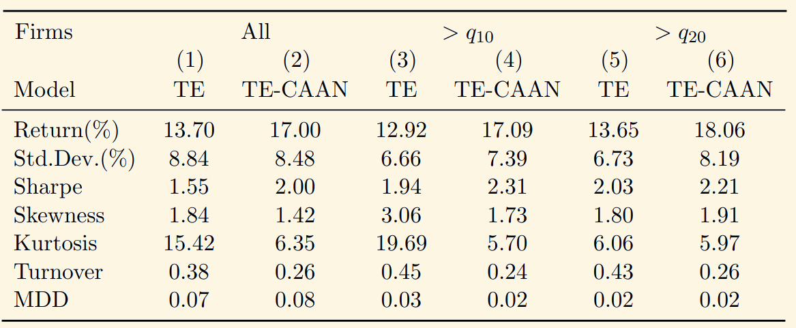

---
presentation:
    theme: solarized.css
    width: 1920
    height: 1080
    center: false
---

<!-- slide class="center" -->

# AlphaPortfolio: Direct Construction Through Deep Reinforcement Learning and Interpretable AI

### Author
Lin William Cong et al.

### Publication
Draft in 2021.8

李煌

<!-- slide class="center" -->

# Introduction

<!-- slide -->

### Introduction

 
 

### 传统资产组合管理（两步法）

1. 根据历史的样本数据最小化定价误差或估计风险溢价；<!-- .element: class="fragment" data-fragment-index="1" -->
2. 根据投资目标进行资产组合。<!-- .element: class="fragment" data-fragment-index="2" -->

 
 
 

<h3 class="fragment" data-fragment-index="3">传统方法的缺点</h3>

- 第一步中的估计误差很大；<!-- .element: class="fragment" data-fragment-index="4" -->
- 两步的目标并不一定一致。<!-- .element: class="fragment" data-fragment-index="5" -->

 
 
 

<h3 class="fragment" data-fragment-index="6">希望将传统方法的两步合二为一，使用同一个优化目标。</h3>

<!-- slide vertical=true -->

### Introduction

 
 

### 金融数据的特点

- 高维<!-- .element: class="fragment" data-fragment-index="1" -->
- 噪声大<!-- .element: class="fragment" data-fragment-index="2" -->
- 非线性<!-- .element: class="fragment" data-fragment-index="3" -->

 
 

<h3 class="fragment fade-in-then-semi-out" data-fragment-index="4">传统机器学习</h3>

<h3 class="fragment fade-in-then-semi-out" data-fragment-index="5">神经网络</h3>

<h3 class="fragment" data-fragment-index="6">仍然在两步法的范畴内</h3>

 

<h3 class="fragment" data-fragment-index="7">我们采取深度强化学习（DRL）将优化一步到位</h3>

 

<h3 class="fragment" data-fragment-index="10">用强化学习的方法训练深度学习模型</h3>

<!-- slide vertical=true -->

### Introduction

 
 

### 我们使用的深度学习模型包括两个部分：

- **时序**：Sequence Representation Extraction Model (SREM)<!-- .element: class="fragment" data-fragment-index="1" -->
- **截面**：Cross-Asset Attention Network (CAAN)<!-- .element: class="fragment" data-fragment-index="2" -->

 

<!-- slide vertical=true -->

### Introduction

 
 

### 强化学习优化目标：最大化一年期夏普比

- $q_{n}$代表NYSE市值第$n$个分位数<!-- .element: class="fragment" data-fragment-index="2" -->
- ***代表在$1\%$水平显著<!-- .element: class="fragment" data-fragment-index="3" -->

<!-- slide vertical=true -->

### Introduction

 
 

### Economic Distillation
### 经济蒸馏

 

1. 根据特征对梯度变化的贡献选择对梯度影响大的特征；<!-- .element: class="fragment" data-fragment-index="1" -->
2. 使用Lasso回归过滤不重要的特征。<!-- .element: class="fragment" data-fragment-index="2" -->

 
 
 
 
 

<h3 class="fragment" data-fragment-index="3">用经济蒸馏得到的特征构建线性模型</h3>

<!-- slide vertical=true -->

### Introduction

 
 
 

<!-- slide class="center" -->

# Model

<!-- slide -->

### Model

 
 

### S&emsp;&ensp; R&emsp;&ensp; E&emsp;&ensp; M
### 序列表征提取模型

- Recurrent Neural Network (RNN)<!-- .element: class="fragment" data-fragment-index="1" -->
- Long Short-Term Memory (LSTM)<!-- .element: class="fragment" data-fragment-index="2" -->
- Transformer Encoder (TE)<!-- .element: class="fragment" data-fragment-index="3" -->
- ...<!-- .element: class="fragment" data-fragment-index="3" -->

<!-- slide -->

### Transformer Encoder

 
 

<!-- slide vertical=true class='center'-->
### Input Embedding

<h3 class="fragment fade-up" data-fragment-index="1">VS</h3>

<h3 class="fragment fade-up" data-fragment-index="1">
    
        One Hot Encoding
    
</h3>

<!-- slide vertical=true -->

### Transformer Encoder

 
 

### 南 科 大 食 堂 很 不 好 吃

### 0&ensp; 1&ensp; 2&ensp; 3&ensp; 4&ensp; 5&ensp; 6&ensp; 7&ensp; 8

$$
\begin{array}{cc}
0 \\ 1 \\ 2 \\ 3 \\ 4 \\ 5 \\ 6 \\ 7 \\ 8 \\
\end{array}
\begin{bmatrix}	1 & 0 & 0 & 0 & 0 & 0 & 0 & 0 \\	0 & 1 & 0 & 0 & 0 & 0 & 0 & 0 \\	0 & 0 & 1 & 0 & 0 & 0 & 0 & 0 \\	0 & 0 & 0 & 1 & 0 & 0 & 0 & 0 \\	0 & 0 & 0 & 0 & 1 & 0 & 0 & 0 \\	0 & 0 & 0 & 0 & 0 & 0 & 0 & 0 \\	0 & 0 & 0 & 0 & 0 & 0 & 0 & 1 \\	0 & 0 & 0 & 0 & 0 & 1 & 0 & 0 \\ 0 & 0 & 0 & 0 & 0 & 0 & 1 & 0 \\\end{bmatrix}
\begin{bmatrix}	1 & 0 & 0 & 0 & 0 & 0 & 0 & 0 \\	0 & 1 & 0 & 0 & 0 & 0 & 0 & 0 \\	0 & 0 & 1 & 0 & 0 & 0 & 0 & 0 \\	0 & 0 & 0 & 1 & 0 & 0 & 0 & 0 \\	0 & 0 & 0 & 0 & 1 & 0 & 0 & 0 \\	0 & 0 & 0 & 0 & 0 & 1 & 0 & 0 \\	0 & 0 & 0 & 0 & 0 & 0 & 0 & 0 \\	0 & 0 & 0 & 0 & 0 & 0 & 1 & 0 \\ 0 & 0 & 0 & 0 & 0 & 0 & 0 & 1 \\\end{bmatrix}
$$

### 南科大食堂好吃不 &emsp;&ensp; 南科大食堂很好吃

<!-- slide vertical=true -->

### Transformer Encoder

 
 

### 矩阵过于稀疏 &emsp; 浪费资源

 

### 不能很好地表达字与字之间的关系

 

<h3 class="fragment fade-right" data-fragment-index="1">Embedding</h3>

- **Example**<!-- .element: class="fragment" data-fragment-index="2" -->
$$
\begin{bmatrix}1&0\\0&0\\\vdots&\vdots\\0&1\end{bmatrix} \begin{bmatrix}w_{11}& w_{12}&\cdots&w_{1,\ 1000}\\ w_{21}& w_{22}&\cdots& w_{2,\ 1000}\\ \end{bmatrix} = \begin{bmatrix}	w_{11} & 0 \\	0 & w_{2,\ 1000} \\\end{bmatrix}\\
{}\\
\quad 1000\times 2 \qquad \qquad  2\times 1000 \qquad\qquad\qquad\quad 2\times 2 \qquad\qquad
$$

<!-- slide vertical=true -->

### Transformer Encoder

 
 

### Positional Encoding

### 位置编码

 

如果单纯用所在的index作为位置的表征，位置越靠后特征数值越大，不利于训练。

 

<h3 class="fragment" data-fragment-index="2">三角函数</h3>

- 公式 <!-- .element: class="fragment" data-fragment-index="3" -->
    $$
    \begin{gathered}
    P E(p o s, 2 i)=\sin \left(\frac{p o s}{10000^{2 i / d_{\text {model }}}}\right) \\
    P E(p o s, 2 i+1)=\cos \left(\frac{p o s}{10000^{2 i / d_{\text {model }}}}\right)
    \end{gathered}
    $$ $pos$ 代表 index，$i$ 代表这句话或者这个词的维度，$d_{\text{model}}$ 是模型的维度（常数）。
- 增加 $i$ 这个自变量是为了避免 $pos$ 不同 $PE$ 相同的情况。<!-- .element: class="fragment" data-fragment-index="4" -->

<!-- slide vertical=true -->

### Transformer Encoder

 
 

### Multi-Head Attention

### 多头注意力

 
 
 

<h3 class="fragment" data-fragment-index="1">多个 Self-Attention 的拼接</h3>

<h3 class="fragment" data-fragment-index="2">自注意力&emsp;</h3>

<!-- slide vertical=true data-background-image="image/上海宁烁attention.jpg" -->

<!-- slide vertical=true data-background-image="image/2022-04-21-21-57-53.png" data-background-transition="none" -->

<!-- slide vertical=true -->

### Transformer Encoder

 

- **Q**: Query（淘宝搜索栏中输入的内容，如“红色西装男”）<!-- .element: class="fragment" data-fragment-index="1" -->
- **K**: Key（搜索引擎用来匹配商品的关键词，如男士、西装、红色等）<!-- .element: class="fragment" data-fragment-index="1" -->
- **V**: Value（想要找的商品在各个维度的权值，如“西装>红色>男士”代表更希望找到西装，最好是红色的，性别其实不太重要）<!-- .element: class="fragment" data-fragment-index="1" -->

<!-- slide vertical=true -->

### Transformer Encoder

 
 

$$
\operatorname{Attention}(Q, K, V)=\operatorname{softmax}\left(\frac{Q K^{T}}{\sqrt{d_{k}}}\right) V
$$

$$
\operatorname{softmax}(x_i) = \frac{e^{x_i}}{\sum\limits_{j=1}^{n} e^{x_j}}
$$

<h3 class="fragment" data-fragment-index="1">矩阵内积本质上是求相似度</h3>

 

- $x^{\mathsf{T}}\cdot y = \left\| x \right\|\cdot \left\| y \right\| \cos \theta $<!-- .element: class="fragment" data-fragment-index="2" -->

 
 
 

<h3 class="fragment" data-fragment-index="3">Multi-Head：可能有多种注意力机制</h3>

<!-- slide vertical=true -->

### Transformer Encoder

 
 

### Add & Norm

$$
\text{Norm}(\bm{X} + \text{Multi-Head Attention}(\bm{X}))
$$

 
 

<h3 class="fragment" data-fragment-index="1">ResNet</h3>

<h3 class="fragment" data-fragment-index="2">解决网络过深退化的问题</h3>

 
 
 

<h3 class="fragment" data-fragment-index="3">TE 是多个组件的堆叠</h3>

<!-- slide -->

### Model

 
 

### C&emsp;&ensp; A&emsp;&ensp; A&emsp;&ensp; N

### 跨资产注意力网络

<!-- slide -->

### CAAN

 
 

<!-- slide vertical=true -->

### CAAN

 
 

- 资产 $i$ 与 $j$ 之间的相似度

    $$
    \beta_{ij} = \frac{\bm{q}^{(i)} {}^{\mathsf{T}} \cdot \bm{k}^{(j)}}{\sqrt{d_k}}
    $$

- 注意力分数

    $$
    \bm{a}^{(i)} = \sum\limits_{j=1}^{I} \operatorname{softmax}\left( \beta_{ij} \right) \cdot \bm{v}^{(j)}
    $$

- 注意力分数 $\overset{\text{全连接层}}{\longrightarrow }$ Winner Score<!-- .element: class="fragment" data-fragment-index="1" -->

    $$
    s^{(i)}=\tanh \left(\boldsymbol{w}^{(s) \top} \cdot \boldsymbol{a}^{(i)}+e^{(s)}\right)
    $$

    $\bm{w}^{(s)}$ 和 $e^{(s)}$ 是全连接层的 weight 和 bias。

<!-- slide -->

### Model

 
 

### Portfolio Generation

### 投资组合生成

- 按 winner score 降序排序；<!-- .element: class="fragment" data-fragment-index="1" -->
- 多前 $G$ 个资产，空后 $G$ 个资产；<!-- .element: class="fragment" data-fragment-index="2" -->
- 以 winner score 为权重（softmax）；<!-- .element: class="fragment" data-fragment-index="3" -->
    $$
    \begin{aligned}
     b^{+(i)} &= \frac{\exp\left( s^{(i)} \right) }{\sum\limits_{o^{(i^{\prime})}\in [1,\ G]} \exp\left( s^{(i^{\prime})} \right) }\\
     b^{-(i)} &= \frac{\exp\left( -s^{(i)} \right) }{\sum\limits_{o^{(i^{\prime})}\in (I-G,\ I]} \exp\left( -s^{(i^{\prime})} \right) }\\
    \end{aligned}
    $$

    $o^{(i)}$ 是资产 $i$ 的排名。

<!-- slide class="center" -->

### RL Optimization

### 强化学习优化

<!-- slide -->

### RL

 

<h3 class="fragment" data-fragment-index="2">&emsp;&emsp;生成投资组合的模型</h3>

### Environment 与 Actor 之间的交互

<h3 class="fragment" data-fragment-index="1">股票市场&emsp;&emsp;&emsp;&emsp;&emsp;&emsp;&emsp;&emsp;&emsp;</h3>

- s: state 状态（股票历史特征）
- a: action 动作（多空头寸）
- r: reward 奖励（收益率）
- 最终的 $R$ 的函数形式可以自定义，用来作为训练的依据（一年期夏普比）

<!-- slide vertical=true -->

### RL

 
 

### 设定

- Episode: 进行多少交互才计算 $R$ 来更新参数（一年的交易）<!-- .element: class="fragment" data-fragment-index="1" -->
- 市场：美国股票市场<!-- .element: class="fragment" data-fragment-index="1" -->
- 训练集：1965年7月 ~ 1989年12月<!-- .element: class="fragment" data-fragment-index="1" -->
- 测试集：1990年1月 ~ 2016年12月<!-- .element: class="fragment" data-fragment-index="1" -->
- $G$：满足条件的股票数量的10\%<!-- .element: class="fragment" data-fragment-index="1" -->
    股票在训练集中需要有2年的数据，在测试集中需要有1年的数据。
     
- 训练方法：从训练集中不放回地随机抽取一个月，使用模型生成投资组合，并用接下来一年的夏普比更新参数，直到抽完训练集中所有数据为止，抽完所有数据的过程叫做一个 epoch，我们使用30个 epochs 来使参数收敛。<!-- .element: class="fragment" data-fragment-index="4" -->
     
- 测试集微调：每测试1年的数据，使用6个 epochs 对模型进行微调。<!-- .element: class="fragment" data-fragment-index="5" -->

<!-- slide class="center" -->

# Tests and Results

<!-- slide -->

### Tests and Results

 
 

### 因子模型检验

- $q_{n}$代表NYSE市值第$n$个分位数
- ***代表在$1\%$水平显著

<!-- slide vertical=true -->

### Tests and Results

 
 

### 不同 AI 模型对比

- 比较 *Freyberger et al. (2020)* 提出的 NP（NonParametric）模型与本文采用的 AP（AlphaPortfolio）

<!-- slide vertical=true -->

### Tests and Results

 
 

### 传统两步法结果

- 用 Transformer Encoder 预测收益率，再进行资产组合

<!-- slide vertical=true -->

### Tests and Results

 
 

### CAAN 必要性检验

- 比较 没有 CAAN 和 有 CAAN 的结果

<!-- slide class="center" -->

# Economic Distillation

<!-- slide -->

### Economic Distillation

 
 

- 根据特征对 winner score 的影响选取前 $K\%$ 的特征；
    - winner score 对特征的敏感度<!-- .element: class="fragment" data-fragment-index="1" -->

        $$
         \delta_{x_{q}}(\boldsymbol{X})=\lim _{\Delta x_{q} \rightarrow 0} \frac{\mathcal{F}(\boldsymbol{X})-\mathcal{F}\left(x_{q}+\Delta x_{q}, \boldsymbol{X}_{\neg x_{q}}\right)}{x_{q}-\left(x_{q}+\Delta x_{q}\right)}=\frac{\partial \mathcal{F}(\boldsymbol{X})}{\partial x_{q}}
        $$

        其中 $\mathcal{F}(\boldsymbol{X}) = s$ 就是 winner score，$\mathcal{F}(\cdot)$ 代表 SREM + CAAN，$x_{q}$ 是第 $q$ 个特征，$\boldsymbol{X}_{\neg x_{q}}$ 代表除了 $x_q$ 以外的其他特征。

    - 特征对 winner score 的平均绝对影响<!-- .element: class="fragment" data-fragment-index="2" -->

        $$
        \mathbb{E}\left[\left\vert \delta_{x_{q}} \right\vert \right]=\frac{1}{I \times N} \sum_{n=1}^{N} \sum_{i=1}^{I} \left\vert \delta_{x_{q}}\left(\boldsymbol{X}_{n}^{(i)} \mid \mathcal{X}_{n}^{(\neg i)}\right) \right\vert 
        $$

        $i$ 是资产维度，$n$ 是时间窗口维度，$\mathcal{X}_{n}^{(\neg i)}$ 是除资产 $i$ 以外其他资产的状态。

<!-- slide vertical=true -->

### Economic Distillation

 
 

- 对筛选出来的特征构建 $p$ 阶多次项；<!-- .element: class="fragment" data-fragment-index="1" -->
- 使用 Lasso 回归将构建的特征再过滤一遍；<!-- .element: class="fragment" data-fragment-index="2" -->

    $$
    \begin{gathered}
    Q(\beta)=\|y-\boldsymbol{X} \beta\|^{2}+\lambda\|\beta\|_{1} \\
    \Longleftrightarrow \quad \arg \min \|y-\boldsymbol{X} \beta\|^{2} \quad s . t . \quad \sum\left|\beta_{j}\right| \leq s
    \end{gathered}
    $$

- 把 winner score 回归到过滤剩下的特征上，得到相应的系数；<!-- .element: class="fragment" data-fragment-index="3" -->
- 用剩下的特征与系数构建线性模型重新生成 winner score 来选择组合，观察线性模型的结果。<!-- .element: class="fragment" data-fragment-index="4" -->

<!-- slide vertical=true -->

### Economic Distillation

 
 

<!-- slide class="center" -->

# References

<!-- slide -->

### References

 
 

- [Cong, L. W., Tang, K., Wang, J., & Zhang, Y. (2021). AlphaPortfolio: Direct construction through deep reinforcement learning and interpretable AI. Available at SSRN 3554486.](https://acfr.aut.ac.nz/__data/assets/pdf_file/0008/573128/AlphaPortfolio-updated.pdf)
- [Vaswani, A., Shazeer, N., Parmar, N., Uszkoreit, J., Jones, L., Gomez, A. N., ... & Polosukhin, I. (2017). Attention is all you need. Advances in neural information processing systems, 30.](https://proceedings.neurips.cc/paper/2017/file/3f5ee243547dee91fbd053c1c4a845aa-Paper.pdf)
- [知乎专栏：一文读懂Embedding的概念，以及它和深度学习的关系](https://zhuanlan.zhihu.com/p/164502624)
- [CSDN：Positional Encoding的原理和计算](https://blog.csdn.net/weixin_44012382/article/details/113059423)
- [知乎专栏：详解Transformer （Attention Is All You Need）](https://zhuanlan.zhihu.com/p/48508221)
- [He, K., Zhang, X., Ren, S., & Sun, J. (2016). Deep residual learning for image recognition. In Proceedings of the IEEE conference on computer vision and pattern recognition (pp. 770-778).](https://openaccess.thecvf.com/content_cvpr_2016/papers/He_Deep_Residual_Learning_CVPR_2016_paper.pdf)
- [Freyberger, J., Neuhierl, A., & Weber, M. (2020). Dissecting characteristics nonparametrically. The Review of Financial Studies, 33(5), 2326-2377.](https://www.nber.org/system/files/working_papers/w23227/w23227.pdf)
- [知乎专栏：Lasso—原理及最优解](https://zhuanlan.zhihu.com/p/116869931)

<!-- slide class="center" -->

# Thank You!