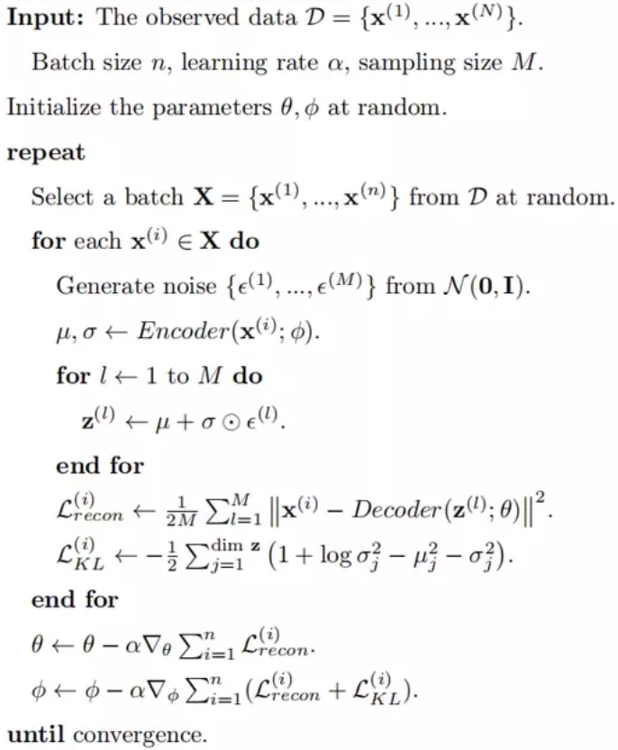
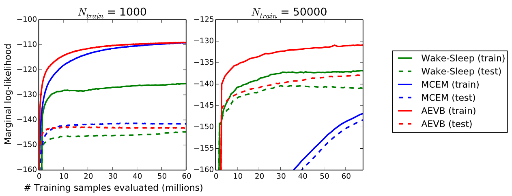

# Auto-Encoding Variational Bayes

### 论文信息

#### 作者

Diederik P. Kingma, Max Welling

均来自阿姆斯特丹大学。

#### 收录情况

收录于2014ICLR。

### 解决什么问题

假设数据 $x$ 由某个包含隐变量 $z$ 的随机过程生成，$z$ 符合先验分布 $p_{\theta}(z)$，$x$ 则符合条件分布 $p_{\theta}(x|z)$。有以下两个问题：

1. 当 $p_{\theta}(x|z)$ 比较复杂时（比如非线性神经网络），边际似然（marginal likelihood）$p_{\theta}(x) = \int p_{\theta}(z) p_{\theta}(x|z) ~ \mathrm{d}z$ 和后验分布 $p_{\theta}(z|x) = \frac{p_{\theta}(x|z) p_{\theta}(z)}{p_{\theta}(x)}$ 都难以获得；
2. 当数据集比较大时，用蒙特卡洛采样的方法来优化参数会很慢。

在这种情况下，使用VAE（Variational Auto-Encoder）能

1. 高效估计参数 $\theta$，这样可以模拟这个未知的随机过程；
2. 高效估计后验分布 $p_{\theta}(z|x)$，这对于对数据 $x$ 编码的任务有用；
3. 高效估计边际似然 $p_{\theta}(x)$，比如图片降噪、修补、提高分辨率任务。

### 变分贝叶斯（Variational Bayes）

- 泛函：函数中的自变量不是具体数值而是函数；
- 变分：对泛函求微分。

变分贝叶斯的目的是用一个识别模型（recognition model）$q_{\phi}(z|x)$ 来估计难以获得的真实后验分布 $p_{\theta}(z|x)$。

> 假设输入数据 $x$ 和输出数据 $y$ ，生成式模型（generative model）和判别式模型（discriminative model）的目标都是得到条件分布 $p(y|x)$，但生成式模型通过拟合联合分布 $p(x,\ y)$，即拟合 $p(x|y)$ 和 $p(y)$，再通过贝叶斯定理——$p(y|x) = \frac{p(x|y) p(y)}{p(x)}$ 得到，而判别式模型则直接拟合目标条件分布 $p(y|x)$。识别模型则是生成式模型中用来估计 $p(x|y)$ 的模型。

识别模型和真实后验分布的KL散度为

$$
D_{\text{KL}}(q_{\phi}(z|x)||p_{\theta}(z|x)) = \mathrm{E}_{q_{\phi}(z|x)} \left( \log \frac{q_{\phi}(z|x)}{p_{\theta}(z|x)} \right) = \mathrm{E}_{q_{\phi}(z|x)} \left( \log \left( \frac{q_{\phi}(z|x)}{p_{\theta}(z,\ x)} p_{\theta}(x) \right) \right) = \mathrm{E}_{q_{\phi}(z|x)} \left( \log \frac{q_{\phi}(z|x)}{p_{\theta}(z,\ x)} \right) + \log p_{\theta}(x)
$$

上式可以移项后写成

$$
\log p_{\theta}(x) = \mathrm{E}_{q_{\phi}(z|x)} \left( \log \frac{p_{\theta}(z,\ x)}{q_{\phi}(z|x)} \right) + D_{\text{KL}}(q_{\phi}(z|x)||p_{\theta}(z|x))
$$

当固定参数 $\theta$，最小化KL散度即最大化变分下界 $\mathcal{L}(\theta,\ \phi;\ x) = \mathrm{E}_{q_{\phi}(z|x)} \left( \log \frac{p_{\theta}(z,\ x)}{q_{\phi}(z|x)} \right)$。

> KL散度是非负的，因此有 $\log p_{\theta}(x) \geqslant \mathrm{E}_{q_{\phi}(z|x)} \left( \log \frac{p_{\theta}(z,\ x)}{q_{\phi}(z|x)} \right)$，故称变分下界。

变分下界可以进一步写成

$$
\mathcal{L}(\theta,\ \phi;\ x) = - \mathrm{E}_{q_{\phi}(z|x)} \left( \log \frac{q_{\phi}(z|x)}{p_{\theta}(x|z) p_{\theta}(z)} \right) = - D_{\text{KL}}(q_{\phi}(z|x)||p_{\theta}(z)) + \mathrm{E}_{q_{\phi}(z|x)} \left( \log p_{\theta}(x|z) \right) 
$$

则需要最小化的目标函数是

$$
D_{\text{KL}}(q_{\phi}(z|x)||p_{\theta}(z)) - \mathrm{E}_{q_{\phi}(z|x)} \left( \log p_{\theta}(x|z) \right)
$$

上式第一项是 $z$ 的先验与后验分布的KL散度，第二项则是重构误差。如果我们把识别模型 $q_{\phi}(z|x)$ 看作一个概率编码器（probabilistic encoder），即输入 $x$ 得到编码 $z$ 的分布，则 $p_{\theta}(x|z)$ 就是一个概率解码器（probabilistic decoder），而第二项就是衡量了概率编码器给出的 $z$ 能从概率解码器中恢复出 $x$ 的概率大小。通常第一项是可以正常积分得到的，因此整个目标函数可以看作是带正则化的重构误差。

整个优化过程可以看作两步：

1. 在固定参数 $\theta$ 的情况下优化 $\phi$ 使得变分下界最大，即识别模型 $q_{\phi}(z|x)$ 与真实后验分布 $p_{\theta}(z|x)$ 最接近；
2. 在固定参数 $\phi$ 的情况下优化 $\theta$ 使得变分下界最大，但此时由于 $\theta$ 在变化，我们不再是最小化识别模型和真实后验分布的距离，而是将变分下界作为边际似然的估计值，目的是最大化边际似然。

形象一点就是变分下界追逐边际似然的过程。

### 重参数化（The reparametrization trick）

由于概率编码器给出的是编码 $z$ 的分布，并不是一个确切的值，如果直接进行采样（比如蒙特卡洛），反向传播的时候是没有梯度信息的（因为采样是个离散的动作），而且费时费力，因此使用重参数化的技巧来生成 $z$，即将 $z$ 与一个可微变换 $g_{\phi}(\epsilon,\ x)$ 等价起来，其中 $\epsilon \sim p(\epsilon)$ 是一个服从噪声分布的辅助变量。

因为 $z = g_{\phi}(\epsilon,\ x)$，我们有 $q_{\phi}(z|x) \mathrm{d}z = p(\epsilon) \mathrm{d}\epsilon$，则对于某一函数 $f(z)$，

$$
\mathrm{E}_{q_{\phi}(z|x)} (f(z)) = \int q_{\phi}(z|x) f(z) ~ \mathrm{d}z = \int p(\epsilon) f\left( g_{\phi}(\epsilon,\ x) \right) ~ \mathrm{d}\epsilon
$$

即可以生成 $L$ 个噪声，用 $\frac{1}{L}\sum\limits_{l=1}^{L} f\left( g_{\phi}\left( \epsilon^{(l)},\ x \right) \right) $ 来估计 $\mathrm{E}_{q_{\phi}(z|x)} (f(z))$。令 $f(z) = \log p_{\theta}(x|z)$，我们可以得到重构误差的估计。

> [!NOTE|label:注意]
> 当minibatch足够大时（比如100），噪声的数量 $L$ 可以是 $1$。

### 高斯假设下的VAE

令隐变量服从多元高斯分布：$p_{\bm{\theta}}(\bm{z}) = \mathcal{N}(\bm{z};\ \bm{0},\ \bm{I})$，再令 $p_{\bm{\theta}}(\bm{x}|\bm{z})$ 为参数由全连接层计算出来的多元高斯分布：

$$
p_{\bm{\theta}}(\bm{x}|\bm{z}) = \mathcal{N}\left( \bm{x};\ \bm{\mu},\ \bm{\sigma}^{2}\bm{I} \right) 
$$

其中

$$
\bm{\mu} = \bm{W}_{\mu} \bm{h} + \bm{b}_{\mu} \\
\log \bm{\sigma}^{2} = \bm{W}_{\sigma} \bm{h} + \bm{b}_{\sigma} \\
\bm{h} = \tanh(\bm{W}_{h} \bm{z} + \bm{b}_{h}) \\
\bm{\theta} = (\bm{W}_{\mu},\ \bm{W}_{\sigma},\ \bm{W}_{h},\ \bm{b}_{\mu},\ \bm{b}_{\sigma},\ \bm{b}_{h})
$$

即隐变量经过一个全连接层和tanh激活函数变换后，分别经过不同的全连接层计算出分布的均值和方差，这与高斯混合模型（GMM）有异曲同工之妙。在这种情况下，后验概率 $p_{\bm{\theta}}(\bm{z}|\bm{x})$ 是难以获得的。我们假设真实的后验分布跟协方差为对角矩阵（即只有方差没有协方差）的多元高斯分布长得很像，即我们想用 $q_{\bm{\phi}}\left( \bm{z}|\bm{x}^{(i)} \right)  = \mathcal{N}\left( \bm{z};\ \bm{\mu}^{(i)},\ \bm{\sigma}^{2 (i)} \bm{I} \right) $ 来近似真实的后验分布。

> [!NOTE|label:注意]
> VAE与普通自编码器的最大区别就在于VAE中隐变量具有先验假设。

利用重参数化，我们让

$$
\bm{z}^{(i,\ l)} = g_{\bm{\phi}}\left( \bm{x}^{(i)},\ \bm{\epsilon}^{(l)} \right) = \bm{\mu}^{(i)} + \bm{\sigma}^{(i)} \odot \bm{\epsilon}^{(l)}
$$

其中 $\bm{\mu}^{(i)}$ 和 $\bm{\sigma}^{(i)}$ 的生成方法同上，噪声 $\bm{\epsilon}^{(l)} \sim \mathcal{N}(\bm{0},\ \bm{I})$，$\odot$ 代表对应元素相乘。

> [!NOTE|label:注意]
> 如果这个变换不加入噪声，则为普通自编码器。

在这种情况下，目标函数的第一项（KL散度）是可以正常积分得到的，只需要估计第二项，即重构误差。则变分下界

$$
\mathcal{L}\left( \bm{\theta},\ \bm{\phi},\ \bm{x}^{(i)} \right) \approx \frac{1}{2}\sum\limits_{j=1}^{J} \left( 1 + \log \sigma_j^{2(i)} - \mu_j^{2(i)} - \sigma_j^{2(i)} \right) + \frac{1}{L}\sum\limits_{l=1}^{L} \log p_{\bm{\theta}}\left( \bm{x}^{(i)}|\bm{z}^{(i,\ l)} \right) 
$$

其中 $j$ 代表第 $j$ 个元素。

最终算法如下：

算法流程

目标函数的第一项（KL正则项）只与 $\bm{\phi}$ 有关，因此只有编码器需要用它来更新参数；第二项（重构误差）与 $\bm{\theta}$ 和 $\bm{\phi}$ 都有关，因此编码器和解码器都要用它来更新参数。

### 其他同类算法

Wake-Sleep算法（Hinton等，1995）是当时仅有的应用于连续隐变量模型的算法，这个算法的优点在于既可以在连续隐变量模型上应用，也可以应用在离散的隐变量模型上；但它要同时优化两个目标函数，而这两个目标函数并不能一起最优化边际似然。

### 实验

MNIST和Frey Face数据库中不同隐变量个数下AEVB（本文算法）与Wake-Sleep算法在变分下界上的比较

可以看到AEVB收敛更快，变分下界更高，即后验分布越接近真实后验。而且随着隐变量数量的增加，模型并没有出现严重的过拟合现象，因为目标函数中除了重构误差还有正则项。

MINIST不同样本量下AEVB，Wake-Sleep和MCEM（蒙特卡洛EM算法）在边际似然上的比较

样本量小时，AEVB略逊于MCEM，因为是通过重参数化来避免直接采样，效果比直接采样稍差也算正常；但样本量一旦大起来，MCEM就收敛很慢，而AEVB则能很快收敛且比Wake-Sleep好。

### 参考文献

Kingma, D. P., & Welling, M. (2014). Auto-Encoding Variational Bayes (arXiv:1312.6114). arXiv. http://arxiv.org/abs/1312.6114

Hinton, G. E., Dayan, P., Frey, B. J., & Neal, R. M. (1995). The “Wake-Sleep” Algorithm for Unsupervised Neural Networks. Science, New Series, 268(5214), 1158–1161.