# Bayesian Solutions for the Factor Zoo: We Just Ran Two Quadrillion Models

标题很有误导性，说是“Ran Two Quadrillion Models”，实际上是“Sampled from Two Quadrillion Models”。

## 论文信息

### 作者

Svetlana Bryzgalova, Jiantao Huang, and Christian Julliard

Bryzgalova 是伦敦商学院的助理教授，Huang 是香港大学的助理教授，Julliard 是伦敦政治经济学院（LSE）的副教授。前两位之前博士都就读于 LSE。

### 收录情况

JF2023

## 解决什么问题

在高维设定（factor zoo）下解决弱因子（weak factors）识别问题与过拟合问题，同时给出一个不管在样本内还是样本外定价能力都强的 SDF。

## 摘要

对于一个线性的定价模型，本文可以给出准确可信的因子风险价格估计（可交易因子和不可交易因子都可以），同时还能检测出弱因子，即使在因子很多的情况下也能做到。

> We propose a novel framework for analyzing linear asset pricing models: simple, robust, and applicable to high-dimensional problems. For a (potentially misspecified) stand-alone model, it provides reliable price of risk estimates for both tradable and nontradable factors, and detects those weakly identified.

本文提出的方法还可以比较不同的因子和不同的模型。如果有个模型远超其他模型，这个方法可以自动地把它挑选出来；如果没有，这个方法会将不同的模型根据贝叶斯后验概率集成起来（得到一个平均的模型）。

> For competing factors and (possibly nonnested) models, the method automatically selects the best specification—if a dominant one exists—or provides a Bayesian model averaging stochastic discount factor (BMA-SDF), if there is no clear winner.

本文分析了大量因子以及这些因子排列组合构成的大量模型，发现贝叶斯集成得到的平均模型不管是样本内还是样本外都比现有的其他方法强。

> We analyze 2.25 quadrillion models generated by a large set of factors and find that the BMA-SDF outperforms existing models in- and out-of-sample.

## 前置知识

### 频率派回归 → 贝叶斯回归

- 频率派：回归参数是确定的数
- 贝叶斯：回归参数服从一个分布

#### 时序回归

$$
\bm{Y}_{\! t} = \bm{\mu}_{\bm{Y}} \cdot \bm{1}_{p} + \bm{\varepsilon}_{t},\quad \bm{\varepsilon}_{t} \overset{\text{i.i.d.}}{\sim} \mathcal{N}(\bm{0}_{p},\ \bm{\Sigma}_{\bm{Y}})
$$

频率派使用 MLE（极大似然估计）得到：

- $\bm{\widehat{\mu}}_{\bm{Y}} = \frac{1}{T}\sum\limits_{t=1}^{T} \bm{Y}_{\! t}$
- $\bm{\widehat{\Sigma}}_{\bm{Y}} = \frac{1}{T - 1}\sum\limits_{t=1}^{T} (\bm{Y}_{\! t} - \bm{\widehat{\mu}}_{\bm{Y}})(\bm{Y}_{\! t} - \bm{\widehat{\mu}}_{\bm{Y}})^{\top}$

贝叶斯对 $\bm{\mu}_{\bm{Y}}$ 和 $\bm{\Sigma}_{\bm{Y}}$ 进行先验假设后通过数据（样本）得到它们的后验分布。

#### 截面回归

$$
\bm{\mu}_{\bm{R}} = \bm{C} \bm{\lambda} + \bm{\alpha},\quad \bm{\alpha} \sim \mathcal{N}(\bm{0}_{N},\ \sigma^{2} \bm{\Sigma}_{\bm{R}})
$$

需要估计的参数：

- $\bm{\lambda}$
- $\sigma^{2}$

同理，频率派会得到一个数值解，贝叶斯会估计出一个后验分布。

### 频率派估计 SDF

#### 线性形式的 SDF

假设有 $K$ 个因子 $\bm{f}_{\! t} = (f_{1t},\ f_{2t},\ \cdots,\ f_{Kt})^{\top},\ t=1,\ 2,\ \cdots,\ T$ 和 $N$ 个 test assets（多空组合）$\bm{R}_t = (R_{1t},\ R_{2t},\ \cdots,\ R_{Nt})^{\top}$，我们通常用因子来构造线性形式的 SDF $m_t$ 来满足 test assets 的定价条件：

$$
\begin{align}
    &m_t = 1 - (\bm{f}_{\! t} - \E[\bm{f}_{\! t}])^{\top} \bm{\lambda}_{\bm{f}} \label{1} \\
    &\text{s.t.}\quad \E[m_t \bm{R}_t] = \bm{0}_{N} \label{2}
\end{align}
$$

其中 $\bm{\lambda}_{\bm{f}}$ 为 SDF 载荷，也被称作因子的[风险价格](asset_pricing/prices_of_risk_and_risk_premia.md)（prices of risk）。

把 $\eqref{1}$ 式代入限制条件 $\eqref{2}$ 可以解得

$$
\begin{align}
    \bm{\mu}_{\bm{R}} = \bm{C}_{\! \bm{f}} \bm{\lambda}_{\bm{f}} \label{3}\\
\end{align}
$$

其中 $\bm{\mu}_{\bm{R}} := \E[\bm{R}_t]$，$\bm{C}_{\! \bm{f}}$ 为 $\bm{R}_t$ 与 $\bm{f}_{\! t}$ 之间的协方差矩阵。

> [!NOTE|label:注意]
> 以下 $\mu_{x}$ 均代表某一变量 $x$ 的期望，且默认消除时间维度；$\bar{x}$ 则代表 $x$ 的样本均值。

在允许存在定价误差的情况下，依据 $\eqref{3}$ 式，**因子的风险价格可以通过以下截面回归得到**：

$$
\begin{equation}
    \bm{\mu}_{\bm{R}} = \lambda_c \bm{1}_{N} + \bm{C}_{\! \bm{f}} \bm{\lambda}_{\bm{f}} + \bm{\alpha} = \bm{C} \bm{\lambda} + \bm{\alpha} \label{4}
\end{equation}
$$

其中 $\bm{C} := (\bm{1}_{N},\ \bm{C}_{\! \bm{f}})$，$\bm{\lambda}^{\top} := (\lambda_c,\ \bm{\lambda}_{\bm{f}}^{\top})$。$\lambda_c$ 为平均定价误差（average mispricing），$\bm{\alpha}$ 为特质误差，即每个 test assets 在平均定价误差外的定价误差。从回归的角度来看，**实际上 $\lambda_c$ 是截距项，$\bm{\alpha}$ 是误差项。**

#### GMM

上述截面回归的解通常可以用 <strong>GMM（Generalized Method of Moments，广义矩估计）</strong>得到。假设 $\E[\bm{\alpha}] = \bm{0}_{N}$，我们有如下矩条件：

$$
\E[\bm{g}_t(\lambda_c,\ \bm{\lambda}_{\bm{f}},\ \bm{\mu}_{\bm{f}})] = \E \begin{bmatrix} \bm{R}_t - \lambda_c \bm{1}_{N} - \bm{R}_t (\bm{f}_{\! t} - \bm{\mu}_{\bm{f}})^{\top} \bm{\lambda}_{\bm{f}} \\ \bm{f}_{\! t} - \bm{\mu}_{\bm{f}} \\\end{bmatrix} = \begin{bmatrix}	\bm{0}_{N} \\	\bm{0}_{K} \\\end{bmatrix}
$$

可以看到参数的数量为 $2 K + 1$，而矩条件的数量是 $N + K$，当 $N > K + 1$ 时，矩条件数量大于参数数量，我们基本上得不到准确的解。GMM 为了处理这样的过度识别（overidentification）问题，引入了矩条件的权重，对更应该限制的条件给予更大的权重。因此 GMM 的目标函数为

$$
\begin{equation}
    \underset{\lambda_c,\ \bm{\lambda}_{\bm{f}},\ \bm{\mu}_{\bm{f}}}{\min} ~ \bm{g}_{T}(\lambda_c,\ \bm{\lambda}_{\bm{f}},\ \bm{\mu}_{\bm{f}})^{\top} \bm{W} \bm{g}_{T}(\lambda_c,\ \bm{\lambda}_{\bm{f}},\ \bm{\mu}_{\bm{f}}) \label{5}
\end{equation}
$$

其中 $\bm{g}_{T}(\lambda_c,\ \bm{\lambda}_{\bm{f}},\ \bm{\mu}_{\bm{f}}) := \frac{1}{T} \sum\limits_{t=1}^{T} \bm{g}_t(\lambda_c,\ \bm{\lambda}_{\bm{f}},\ \bm{\mu}_{\bm{f}})$，$\bm{W}$ 控制矩条件的权重。

> [!TIP|label:提示]
> 使用权重矩阵会让某些条件权重变小，极端情况就是变为 0，相当于减少了条件数量，因此能改善过度识别问题。

#### GLS

对于 OLS 和 **GLS（Generalized Least Squares，广义最小二乘）**，权重矩阵分别为

$$
\bm{W}_{\text{OLS}} = \begin{bmatrix}	\bm{I}_{\! N} & \bm{0}_{N \times K} \\	\bm{0}_{K \times N} & \kappa \bm{I}_{\! K} \\\end{bmatrix},\quad
\bm{W}_{\text{GLS}} = \begin{bmatrix}	\bm{\Sigma}_{\bm{R}}^{-1} & \bm{0}_{N \times K} \\	\bm{0}_{K \times N} & \kappa \bm{I}_{\! K} \\\end{bmatrix}
$$

其中 $\kappa > 0$ 是一个很大的常数来保证 $\bm{\widehat{\mu}}_{\bm{f}} = \frac{1}{T} \sum\limits_{t=1}^{T} \bm{f}_{\! t}$，$\bm{\Sigma}_{\bm{R}}$ 是收益率的协方差矩阵。

由 GMM 目标函数 $\eqref{5}$ 解出来的估计分别为

$$
\bm{\widehat{\lambda}}_{\text{OLS}} = \left(\bm{\widehat{C}}^{\top} \bm{\widehat{C}} \right)^{-1} \bm{\widehat{C}}^{\top} \bm{\overline{R}},\quad \bm{\widehat{\lambda}}_{\text{GLS}} = \left(\bm{\widehat{C}}^{\top} \bm{\Sigma}_{\bm{R}}^{-1} \bm{\widehat{C}} \right)^{-1} \bm{\widehat{C}}^{\top} \bm{\Sigma}_{\bm{R}}^{-1} \bm{\overline{R}}
$$

<strong>不同的权重矩阵从回归的角度来看其实是不同的误差分布假设。</strong>对于 OLS 来说，我们假设误差服从 iid 的正态分布，也就是 $\bm{\alpha} \sim \mathcal{N}(\bm{0}_{N},\ \sigma^{2}\bm{I}_{\! N})$；而 **GLS 则是考虑了截面上误差的相关性，即假设 $\bm{\alpha} \sim \mathcal{N}(\bm{0}_{N},\ \sigma^{2} \bm{\Sigma}_{\bm{R}})$。**

> [!NOTE|label:注意]
> 对于标准的 GLS，我们用的权重矩阵为误差的协方差矩阵，通常用 OLS 得到的残差进行估计。本文中直接使用 $\bm{\Sigma}_{\bm{R}}$ 作为误差的协方差矩阵是经过了一系列的考量：
> 
> 假设 $\eqref{4}$ 式这个模型是正确的，那么对于每个时间点 $t$，我们有
>
> $$ \bm{R}_{t} = \bm{C} \bm{\lambda} + \bm{\varepsilon}_{t},\quad \bm{\varepsilon}_{t} \overset{\text{i.i.d.}}{\sim} \mathcal{N}(\bm{0}_{N},\ \bm{\Sigma}_{\bm{R}}) $$
> 
> 假设我们用长度为 $T$ 的样本来估计期望，这个 estimator 记为 $\E_{T}[\cdot]$（样本均值是其中一种被广泛使用的 estimator），则上式可以写成期望形式：
> 
> $$\E_{T}[\bm{R}_{t}] = \bm{C} \bm{\lambda} + \E_{T}[\bm{\varepsilon}_{t}] = \bm{C} \bm{\lambda} + \bm{\alpha}$$
> 
> 我们希望 $\E_{T}[\bm{R}_{t}] = \bm{\mu}_{\bm{R}}$，那么就应该让 $\bm{\alpha} = \E_{T}[\bm{\varepsilon}_{t}]$。根据中心极限定理的思想，一个很自然的假设就是 $\bm{\alpha} \mid \bm{\Sigma}_{\bm{R}} \sim \mathcal{N}(\bm{0}_{N},\ \frac{1}{T} \bm{\Sigma}_{\bm{R}})$（当使用样本均值这个 estimator 作为 $\E_{T}[\cdot]$ 时，中心极限定理就能推出这个假设）。然而，我们既然允许了有定价误差，它的分布就不应该完全由观测到的数据决定，因此 $\frac{1}{T}$ 应该用一个超参来代替比较好，于是 GLS 的误差假设变成 $\bm{\alpha} \sim \mathcal{N}(\bm{0}_{N},\ \sigma^{2} \bm{\Sigma}_{\bm{R}})$。由于任何模型都有误设的可能性，我们期望 $\sigma^{2} > \frac{1}{T}$。

## 创新点

假设在 $K$ 个因子中有 $K_1$ 个可交易的因子和 $K_2$ 个不可交易的因子，记 $\bm{f}_{\! t} = \left(\bm{f}_{\! t}^{(1) \top},\ \bm{f}_{\! t}^{(2) \top} \right) ^{\top}$，$\bm{f}_{\! t}^{(1) \top}$ 为可交易的因子，$\bm{f}_{\! t}^{(2) \top}$ 为不可交易的因子。令 $\bm{Y}_{\! t}$ 表示因子和 test assets 收益率的并，由于可交易的因子其实也可以作为 test assets 的收益率，我们不用重复列出，因此 $\bm{Y}_{\! t}^{\top} := \left(\bm{R}_t^{\top},\ \bm{f}_{\! t}^{(2) \top} \right) ^{\top}$ 是一个 $N + K_2$ 维的向量。

> [!TIP|label:提示]
> 将可交易的因子作为 test assets 的收益率，说明这些可交易的因子都是超额收益率。

### 使用分层贝叶斯估计因子的风险溢价

本文涉及的变量之间的关系可由如下概率图所描述：

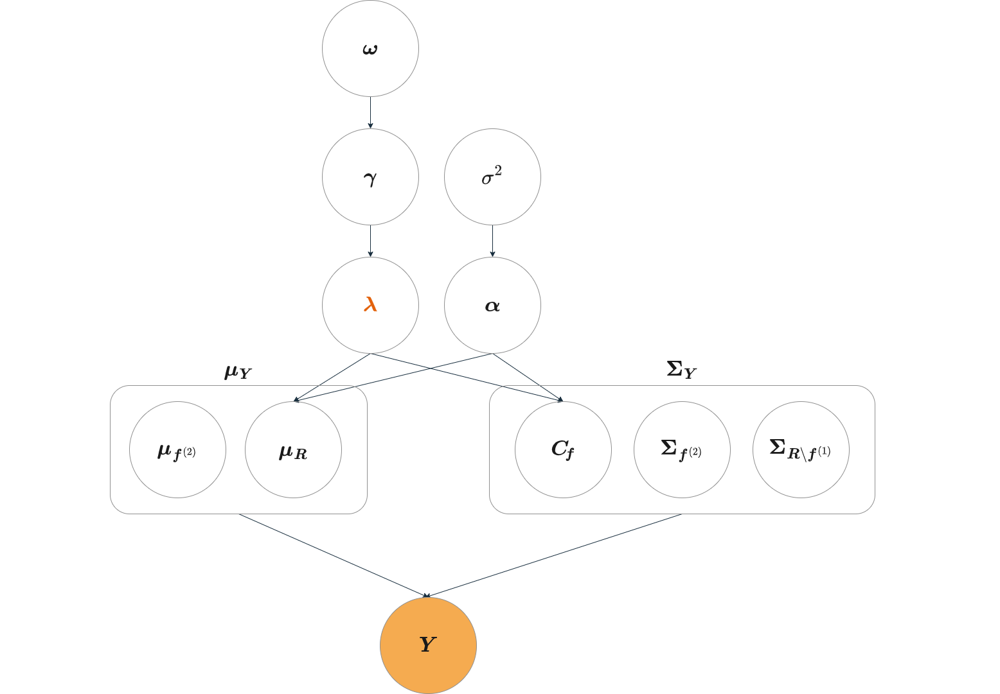

其中被橙色填充的变量 $\bm{Y}$ 为真实观测到的数据，标橙的 $\bm{\color{#e3620c}{\lambda}}$ 是我们所关心的变量，左边的圆角矩形代表 $\bm{\mu}_{\bm{Y}}$ 由 $\bm{\mu}_{\bm{f}^{(2)}}$ 和 $\bm{\mu}_{\bm{R}}$ 组成，右边同理。

#### 时序贝叶斯

已有的观测到的变量只有时序变量 $\bm{Y}$，所以我们先对它进行建模：假设 test assets 的收益率和因子服从时间上 iid 的多元正态分布，即 $\bm{Y}_{\! t} \overset{\text{i.i.d.}}{\sim} \mathcal{N}(\bm{\mu}_{\bm{Y}},\ \bm{\Sigma}_{\bm{Y}})$，由此可以固定时序似然函数为

$$
p(\bm{Y} \mid \bm{\mu}_{\bm{Y}},\ \bm{\Sigma}_{\bm{Y}}) \propto \left\vert\bm{\Sigma}_{\bm{Y}}\right\vert^{-\frac{T}{2}} \exp \left\{-\frac{1}{2} \operatorname{tr}\left[\bm{\Sigma}_{\bm{Y}}^{-1} \sum_{t=1}^T \left(\bm{Y}_{\! t} - \bm{\mu}_{\bm{Y}}\right) \left(\bm{Y}_{\! t} - \bm{\mu}_{\bm{Y}}\right)^{\top}\right]\right\}
$$

从贝叶斯的角度，我们需要对参数有一些先验假设，在不知道参数分布的情况下，我们通常采用一个无信息（uninformative）的先验，比如作者使用的 Jeffreys prior：$\pi(\bm{\mu}_{\bm{Y}},\ \bm{\Sigma}_{\bm{Y}}) \propto \left\vert \bm{\Sigma}_{\bm{Y}} \right\vert^{-\frac{p+1}{2}}$。

> [!TIP|label:提示]
> 无信息先验又叫扩散先验（diffuse prior），指分布比较平坦的先验，它不会对后验分布有太大的影响（如果先验很尖，那基本上后验就跟先验差不多了，这叫做受先验影响大），即先验跟后验的距离应该尽量远。
>
> 通常人们可能认为均匀先验是无信息的，然而对于方差 $\sigma^{2}$，我们究竟是对 $\sigma$ 做均匀先验的假设，还是对 $\sigma^{2}$ 做呢？这两者其实是完全不同的。更一般地，我们可以对参数进行任意的变换，参数在变换前后并不能都是均匀分布。于是我们就希望能找到一种不受变换影响（invariant）的先验，Jeffreys prior 就是其中最常用的一种。
> 
> 先验不受变换影响不代表变换前后的分布都一样，而是分布的变换与参数的变换相符。以一维的 Jeffreys prior 为例，假设我们关心参数 $\varphi$，它的某一个变换为 $\theta := f(\varphi)$，如果 $\varphi$ 所对应的概率密度满足
>
> $$p_{\varphi}(\varphi) = p_{\theta}(\theta) \left\vert f'(\varphi) \right\vert$$
>
> 则说明分布的变换与参数的变换是相符的。
>
> Jeffreys prior 与 Fisher information 有关。记 $\theta$ 的 Fisher information 为 $I_{\theta}(\theta)$，则 $\varphi$ 的 Fisher information 
>
> $$I_{\varphi}(\varphi) = I_{\theta}(\theta) (f'(\varphi))^{2}$$
>
> 根据定义，$\varphi$ 和 $\theta$ 的 Jeffreys prior 分别为 $p_{\varphi}(\varphi) \propto \sqrt{I_{\varphi}(\varphi)}$ 和 $p_{\theta}(\theta) \propto \sqrt{I_{\theta}(\theta)}$，这就保证了先验在参数变换下的不变性。

在这个先验下的参数后验是一个 NIW（Normal Inverse Wishart）分布：

$$
\bm{\mu}_{\bm{Y}} \mid \bm{\Sigma}_{\bm{Y}},\ \bm{Y} \sim \mathcal{N}(\bm{\widehat{\mu}}_{\bm{Y}},\ \bm{\Sigma}_{\bm{Y}} / T)
$$

$$
\bm{\Sigma}_{\bm{Y}} \mid \bm{Y} \sim \mathcal{W}^{-1} \left(T-1,\ \sum\limits_{t=1}^{T} (\bm{Y}_{\! t} - \bm{\widehat{\mu}}_{\bm{Y}}) (\bm{Y}_{\! t} - \bm{\widehat{\mu}}_{\bm{Y}})^{\top} \right)
$$

其中 $\bm{\widehat{\mu}}_{\bm{Y}} := \frac{1}{T} \sum\limits_{t=1}^{T} \bm{Y}_{\! t}$，$\mathcal{W}^{-1}$ 表示逆 Wishart 分布。恰好 NIW 是多元正态分布关于均值和方差的[共轭分布](/papers/shrinking_the_cross-section.md#先验分布、后验分布与共轭分布)，于是我们可以很方便地进行后验的更新。

通过时序贝叶斯，我们可以根据观测到的 $\bm{Y}_{\! t}$ 去构建 $\bm{\Sigma}_{\bm{Y}}$ 的后验分布，从而从后验分布中抽样得到 $\bm{\Sigma}_{\bm{Y}}$，而抽样得到 $\bm{\Sigma}_{\bm{Y}}$ 后我们又可以得到 $\bm{\mu}_{\bm{Y}}$ 的后验分布，从而从分布中抽样得到 $\bm{\mu}_{\bm{Y}}$。于是 $\bm{\mu}_{\bm{Y}}$ 和 $\bm{\Sigma}_{\bm{Y}}$ 就都可以被“观测”到了：

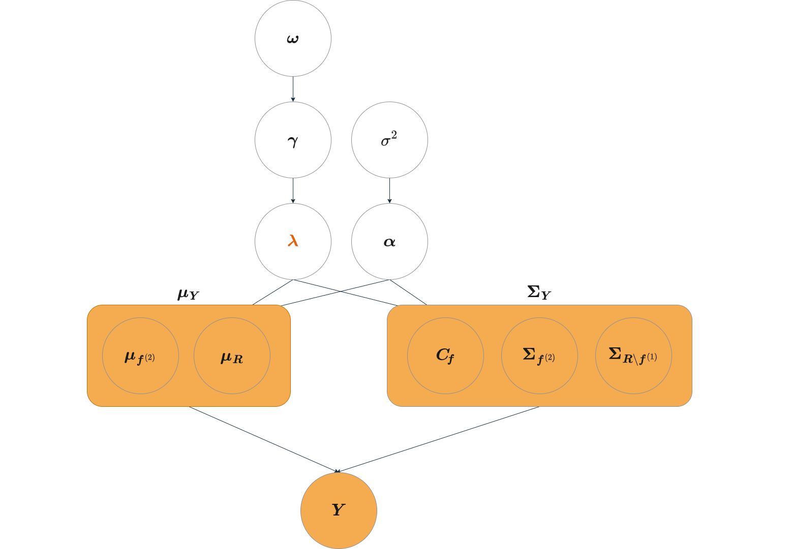

#### 截面贝叶斯

有了截面变量 $\bm{\mu}_{\bm{Y}}$ 和 $\bm{\Sigma}_{\bm{Y}}$，我们就可以对它们进行建模（这里我们只对它们的一部分——$\bm{\mu}_{\bm{R}}$ 和 $\bm{C}_{\! \bm{f}}$ 进行建模）：由 $\eqref{4}$ 式我们知道，$\bm{\mu}_{\bm{R}}$ 和 $\bm{C}$ 是与风险价格 $\bm{\lambda}$ 以及误差 $\bm{\alpha}$ 有关的。在 OLS 的误差假设下，$\bm{\alpha} \sim \mathcal{N}(\bm{0}_{N},\ \sigma^{2}\bm{I}_{\! N})$，据此我们可以写出截面的似然函数：

$$
p(\bm{\mu}_{\bm{R}},\ \bm{C}\mid \bm{\lambda},\ \sigma^{2}) = (2 \pi \sigma^{2})^{-\frac{N}{2}} \exp \left\{- \frac{1}{2 \sigma^{2}} (\bm{\mu}_{\bm{R}} - \bm{C} \bm{\lambda})^{\top} (\bm{\mu}_{\bm{R}} - \bm{C} \bm{\lambda}) \right\} 
$$

同样地，我们可以给参数 $\bm{\lambda}$ 和 $\sigma^{2}$ 一个 Jeffreys prior：$\pi(\bm{\lambda},\ \sigma^{2}) \propto \sigma^{-2}$，则参数的后验为

$$
\bm{\lambda} \mid \sigma^2,\ \bm{\mu}_{\bm{R}},\ \bm{C} \sim \mathcal{N}\left(\underbrace{(\bm{C}^{\top} \bm{C})^{-1} \bm{C}^{\top} \bm{\mu}_{\bm{R}}}_{\bm{\widehat{\lambda}}},\ \underbrace{\sigma^2 (\bm{C}^{\top} \bm{C})^{-1}}_{\bm{\Sigma}_{\bm{\lambda}}}\right)
$$

$$
\sigma^{2} \mid \bm{\mu}_{\bm{R}},\ \bm{C} \sim \mathcal{IG} \left(\frac{N - K - 1}{2},\ \frac{(\bm{\widehat{\mu}}_{\bm{R}} - \bm{C} \bm{\widehat{\lambda}})^{\top} (\bm{\widehat{\mu}}_{\bm{R}} - \bm{C} \bm{\widehat{\lambda}})}{2} \right) 
$$

其中 $\mathcal{IG}$ 代表逆 Gamma 分布。Wishart 分布是 Gamma 分布在多元情况下的 generalization，这里 $\sigma^{2}$ 是一元的，因此我们得到的是 NIG（Normal Inverse Gamma）的后验。同样地，NIG 是多元正态分布关于均值和方差（前的系数）的[共轭分布](/papers/shrinking_the_cross-section.md#先验分布、后验分布与共轭分布)，于是我们依旧可以很方便地更新后验。

> [!TIP|label:识别弱因子]
> 假设没有 $\bm{\alpha}$，即 $\sigma^{2} \to 0$，风险价格 $\bm{\lambda}$ 的后验变成一个在 $(\bm{C}^{\top}\bm{C})^{-1}\bm{C}^{\top}\bm{\mu}_{\bm{R}}$ 处的 Dirac 分布，也就是说 $\bm{\lambda}$ 是一个常数向量。每一次对 $\bm{\mu}_{\bm{Y}}$ 和 $\bm{\Sigma}_{\bm{Y}}$ 抽样我们都可以得到一个确定的 $\bm{\lambda}$，抽多了我们就可以得到 $\bm{\lambda}$ 的置信区间。对于弱因子来说，尽管每次抽样会因为 $\bm{c}^{\top}\bm{c}$ 的 near singularity 而让 $\bm{\lambda}$ 变得很大，但由于抽样具有不确定性（不像频率派的确定估计），我们得到的 $\bm{\lambda}$ 可能是正的很大也有可能是负的很大，最终 $\bm{\lambda}$ 的置信区间有很大概率是包含 $\bm{0}$ 的，因此通过贝叶斯估计的方法得到 $\bm{\lambda}$ 能够达到识别弱因子的效果。

> [!TIP|label:提示]
> 除了风险价格 $\bm{\lambda}$，截面回归的 $R^{2}$ 同样可以通过抽样计算出来（尽管本 Notes 不太关注 $R^{2}$）：
> 
> $$ R^{2} = 1 - \frac{(\bm{\mu}_{\bm{R}} - \bm{C} \bm{\lambda})^{\top} (\bm{\mu}_{\bm{R}} - \bm{C} \bm{\lambda})}{(\bm{\mu}_{\bm{R}} - \bar{\mu}_{\bm{R}} \bm{1}_{N})^{\top}(\bm{\mu}_{\bm{R}} - \bar{\mu}_{\bm{R}} \bm{1}_{N})} $$
> 
> 其中 $\bar{\mu}_{\bm{R}} = \frac{1}{N} \sum\limits_{i=1}^{N} \mu_{\bm{R},\ i}$ 为样本 panel 均值，$\mu_{\bm{R},\ i}$ 为 $\bm{\mu}_{\bm{R}}$ 中第 $i$ 个元素。

在 GLS 的误差假设下，即 $\bm{\alpha} \sim \mathcal{N}(\bm{0}_{N},\ \sigma^{2} \bm{\Sigma}_{\bm{R}})$，我们可以得到相似的结果：

$$
p(\bm{\mu}_{\bm{R}},\ \bm{C},\ \bm{\Sigma}_{\bm{R}} \mid \bm{\lambda},\ \sigma^{2}) = (2 \pi \sigma^{2})^{-\frac{N}{2}} \exp \left\{- \frac{1}{2 \sigma^{2}} (\bm{\mu}_{\bm{R}} - \bm{C} \bm{\lambda})^{\top} \bm{\Sigma}_{\bm{R}}^{-1} (\bm{\mu}_{\bm{R}} - \bm{C} \bm{\lambda}) \right\} 
$$

$$
\bm{\lambda} \mid \sigma^2,\ \bm{\mu}_{\bm{R}},\ \bm{C},\ \bm{\Sigma}_{\bm{R}} \sim \mathcal{N}\left(\underbrace{(\bm{C}^{\top} \bm{\Sigma}_{\bm{R}}^{-1} \bm{C})^{-1} \bm{C}^{\top} \bm{\Sigma}_{\bm{R}}^{-1} \bm{\mu}_{\bm{R}}}_{\bm{\widehat{\lambda}}},\ \underbrace{\sigma^2 (\bm{C}^{\top} \bm{\Sigma}_{\bm{R}}^{-1} \bm{C})^{-1}}_{\bm{\Sigma}_{\bm{\lambda}}}\right)
$$

$$
\sigma^{2} \mid \bm{\mu}_{\bm{R}},\ \bm{C},\ \bm{\Sigma}_{\bm{R}} \sim \mathcal{IG} \left(\frac{N - K - 1}{2},\ \frac{(\bm{\widehat{\mu}}_{\bm{R}} - \bm{C} \bm{\widehat{\lambda}})^{\top} \bm{\Sigma}_{\bm{R}}^{-1} (\bm{\widehat{\mu}}_{\bm{R}} - \bm{C} \bm{\widehat{\lambda}})}{2} \right) 
$$

> [!NOTE|label:注意]
> 接下来我们将用 $\text{data}$ 来代替 OLS 假设下的 $\bm{\mu}_{\bm{R}},\ \bm{C}$，以及 GLS 假设下的 $\bm{\mu}_{\bm{R}},\ \bm{C},\ \bm{\Sigma}_{\bm{R}}$。尽管它们对于 $\bm{Y}_{\! t}$ 来说是参数，但对于我们最关心的 $\bm{\lambda}$ 来说它们就是可观测的数据。
>
> 由于 GLS 假设下的推导与 OLS 差不多，为了方便，接下来我们只讨论 OLS 假设下的情况，但在实证中用的是 GLS 假设下的估计。

得到了 $\bm{\lambda}$ 和 $\sigma^{2}$ 的后验，我们可以通过 Gibbs sampling 的方法对它们进行交替采样：即依次对 $\bm{\Sigma}_{\bm{Y}},\ \bm{\mu}_{\bm{Y}},\ \sigma^{2},\ \bm{\lambda}$ 采样。

> [!TIP|label:提示]
> 在抽样得到 $\bm{\mu}_{\bm{Y}}$ 后，作者做了标准化的操作，即将 $\bm{\mu}_{\bm{Y}}$ 中每一个元素都除以对应的标准差，对于 test assets $\bm{R}$ 来说，这一操作相当于把它们的均值变成了夏普比。在 [Shrinking the cross-section](papers\shrinking_the_cross-section.md#因子风险价格的压缩估计) 中也有类似的操作（对夏普比做岭回归），但在 Shinking the cross-section 中，对 test assets 的均值先验方差为 $\bm{\Sigma}^{2}$，后验方差不为 $\bm{\Sigma}$ 的倍数，因此处理成夏普比时并不等同于做标准化的操作，而是为了让风险价格独立同分布；而本文是均匀先验，后验方差为 $\bm{\Sigma} / T$，因此做标准化恰好可以得到夏普比。

> [!NOTE|label:注意]
> 接下来所有的 $\bm{\mu}_{\bm{Y}}$ 都是经过标准化处理后的。

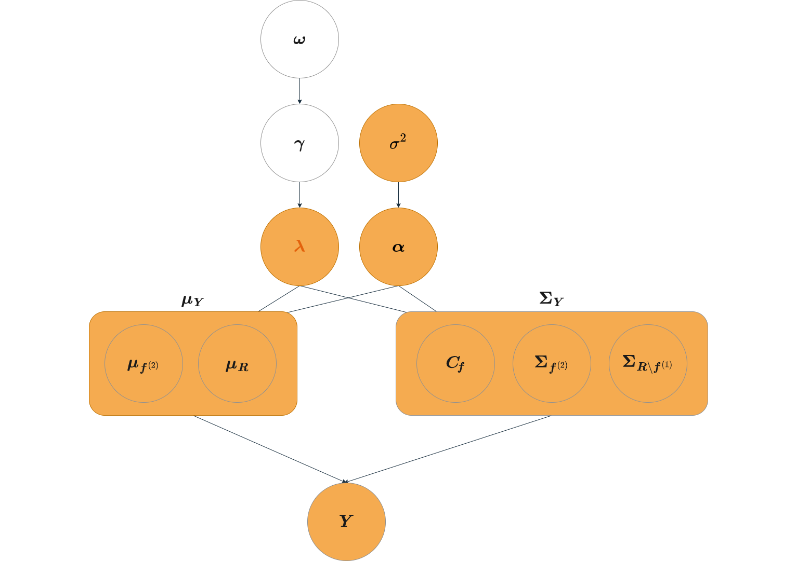

通过时序贝叶斯和截面贝叶斯，我们已经能够得到 $\bm{\lambda}$ 的置信区间（且对弱因子也有效），但**在 factor zoo 的设定下，包含所有因子的模型不见得是最好的模型，我们希望能够用贝叶斯的方法做变量选择，看哪些因子构成的 SDF 最牛。**

### 使用贝叶斯方法进行变量选择

假定一个二元变量 $\bm{\gamma} = (\gamma_0,\ \gamma_1,\ \cdots,\ \gamma_{K})^{\top}$，当 $\gamma_j = 1$ 表示我们选择因子 $j$ 作为变量，$\gamma_j = 0$ 则表示不选因子 $j$，$\gamma_0 = 1$ 表示我们的模型总是包含截距项。$\bm{\gamma}$ 中的每个元素都服从伯努利分布，即每个变量都有一定概率被选中，而**我们要做的就是通过数据推断出每个变量被选中的概率。**

定义变量的个数为 $p_{\bm{\gamma}} := \sum_{j = 0}^{K} \gamma_j$，$\bm{C}_{\! \bm{\gamma}}$ 代表只包含已选变量的协方差矩阵，$\bm{\lambda}_{\bm{\gamma}}$ 和 $\bm{\lambda}_{-\bm{\gamma}}$ 分别代表只包含已选或未选变量的风险价格。

接下来我们首先阐述对 $\bm{\lambda}$ 使用均匀先验的坏处，然后引入更合适的先验来对 $\bm{\gamma}$ 进行推断。

#### 对风险价格使用均匀先验的坏处

在截面贝叶斯中，我们对 $\bm{\lambda}$ 和 $\sigma^{2}$ 采用了一个无信息的 Jefferys prior，在这个先验下，$\bm{\lambda}$ 的边缘先验是均匀分布。<strong>而在使用 $\bm{\gamma}$ 进行变量选择时，均匀先验会让弱因子有很大概率被选中。</strong>我们来看这是为什么：

当我们使用 $\bm{\gamma}$ 选择某些变量，先验可以写为 $\begin{cases} \pi(\bm{\lambda}_{\bm{\gamma}},\ \sigma^{2}) \propto \sigma^{-2} \\ \bm{\lambda}_{-\bm{\gamma}} = 0 \end{cases}$，则似然函数

$$
\begin{equation}
p(\text{data} \mid \bm{\gamma}) \propto (2 \pi)^{\frac{p_{\bm{\gamma}}}{2}} \textcolor{#e3620c}{\left\vert \bm{C}_{\! \bm{\gamma}}^{\top} \bm{C}_{\! \bm{\gamma}} \right\vert^{-\frac{1}{2}}} \frac{\Gamma(\frac{N - p_{\bm{\gamma}}}{2})}{(\frac{N \widehat{\sigma}_{\bm{\gamma}}^{2}}{2})^{\frac{N - p_{\bm{\gamma}}}{2}}} \label{6}\\
\end{equation}
$$

计算细节

$$
\begin{aligned}
    p(\text{data} \mid \bm{\gamma}) &= \iint p(\text{data} \mid \bm{\gamma},\ \bm{\lambda},\ \sigma^{2}) \pi(\bm{\lambda},\ \sigma^{2}\mid \bm{\gamma}) ~ \mathrm{d} \bm{\lambda} ~ \mathrm{d} \sigma^{2} \\
    &\propto \iint (\sigma^{2})^{-\frac{N + 2}{2}} e^{-\frac{1}{2 \sigma^{2}}(\bm{\mu}_{\bm{R}} - \bm{C}_{\! \bm{\gamma}} \bm{\lambda}_{\bm{\gamma}})^{\top} (\bm{\mu}_{\bm{R}} - \bm{C}_{\! \bm{\gamma}} \bm{\lambda}_{\bm{\gamma}})} ~ \mathrm{d} \bm{\lambda} ~ \mathrm{d} \sigma^{2} \\
    &= \iint (\sigma^{2})^{-\frac{N + 2}{2}} e^{-\frac{1}{2 \sigma^{2}}\left[(\bm{\mu}_{\bm{R}} - \bm{C}_{\! \bm{\gamma}} \bm{\widehat{\lambda}}_{\bm{\gamma}})^{\top} (\bm{\mu}_{\bm{R}} - \bm{C}_{\! \bm{\gamma}} \bm{\widehat{\lambda}}_{\bm{\gamma}}) + (\bm{C}_{\! \bm{\gamma}} \bm{\lambda}_{\bm{\gamma}} - \bm{C}_{\! \bm{\gamma}} \bm{\widehat{\lambda}}_{\bm{\gamma}})^{\top} (\bm{C}_{\! \bm{\gamma}} \bm{\lambda}_{\bm{\gamma}} - \bm{C}_{\! \bm{\gamma}} \bm{\widehat{\lambda}}_{\bm{\gamma}}) \right]} ~ \mathrm{d} \bm{\lambda} ~ \mathrm{d} \sigma^{2} \\
    &= \iint (\sigma^{2})^{-\frac{N + 2}{2}} e^{-\frac{N \widehat{\sigma}_{\bm{\gamma}}^{2}}{2 \sigma^{2}}} e^{-\frac{( \bm{\lambda}_{\bm{\gamma}} - \bm{\widehat{\lambda}}_{\bm{\gamma}})^{\top} \bm{C}_{\! \bm{\gamma}}^{\top} \bm{C}_{\! \bm{\gamma}} (\bm{\lambda}_{\bm{\gamma}} - \bm{\widehat{\lambda}}_{\bm{\gamma}})}{2 \sigma^{2}}} ~ \mathrm{d} \bm{\lambda} ~ \mathrm{d} \sigma^{2} \\
    &= (2 \pi)^{\frac{p_{\bm{\gamma}}}{2}} \left\vert \bm{C}_{\! \bm{\gamma}}^{\top} \bm{C}_{\! \bm{\gamma}} \right\vert^{-\frac{1}{2}}  \int (\sigma^{2})^{-\frac{N - p_{\bm{\gamma}} + 2}{2}} e^{-\frac{N \widehat{\sigma}_{\bm{\gamma}}^{2}}{2 \sigma^{2}}} ~ \mathrm{d} \sigma^{2} \\
    &= (2 \pi)^{\frac{p_{\bm{\gamma}}}{2}} \left\vert \bm{C}_{\! \bm{\gamma}}^{\top} \bm{C}_{\! \bm{\gamma}} \right\vert^{-\frac{1}{2}} \frac{\Gamma(\frac{N - p_{\bm{\gamma}}}{2})}{(\frac{N \widehat{\sigma}_{\bm{\gamma}}^{2}}{2})^{\frac{N - p_{\bm{\gamma}}}{2}}} \\
\end{aligned}
$$

其中 $\bm{\widehat{\lambda}}_{\bm{\gamma}} := (\bm{C}_{\! \bm{\gamma}}^{\top} \bm{C}_{\! \bm{\gamma}})^{-1} \bm{C}_{\! \bm{\gamma}}^{\top} \bm{\mu}_{\bm{R}}$，$\widehat{\sigma}_{\bm{\gamma}}^{2} := \frac{(\bm{\mu}_{\bm{R}} - \bm{C}_{\! \bm{\gamma}} \bm{\widehat{\lambda}}_{\bm{\gamma}})^{\top} (\bm{\mu}_{\bm{R}} - \bm{C}_{\! \bm{\gamma}} \bm{\widehat{\lambda}}_{\bm{\gamma}})}{N}$，$\Gamma$ 代表 Gamma 函数。

 

因此在这个设定下，如果我们使用 $\bm{\gamma}$ 选择的变量中包含弱因子，那么由于 $\bm{C}_{\! \bm{\gamma}}^{\top} \bm{C}_{\! \bm{\gamma}}$ 的 near singularity，它的行列式趋于 $0$，导致 $\eqref{6}$ 式的边缘似然趋于无穷，因此 $\gamma$ 选中弱因子的后验概率会趋于 $1$。

#### 更合适的先验：钉板先验

接下来我们将对风险价格 $\bm{\lambda}$ 采用一个更合适的先验：**钉板先验（spike-and-slab prior）**，来避免对弱因子的错误选择。

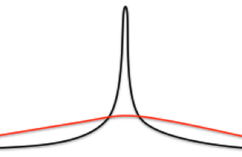

如上图所示，<strong>钉板先验由两个均值为 0，方差不同的正态分布组成：黑色的像一根钉子，被称为钉先验（spike），红色的像一块板，被称为板先验（slab）。</strong>钉板先验被广泛应用于涉及变量选择的回归问题中，**未被选择的变量服从钉先验，被选择的变量则服从板先验**，通过这样的设定我们能够推断出 $\bm{\gamma}$ 的后验概率，从而选择最可能的那一组变量。

> [!TIP|label:提示]
> 理论上钉先验应该是一个在 0 处的 Dirac 分布，但实际操作中为了分布的连续性我们通常使用一个方差极小的正态分布。

对于板先验，通常的选择是一个 g-prior：

$$
\begin{equation}
    \lambda_j \mid \gamma_j,\ \sigma^{2} \sim \mathcal{N}(0,\ \psi \sigma^{2} \bm{\tilde{\rho}}_{j}^{\top} \bm{\tilde{\rho}}_{j}) \label{7}
\end{equation}
$$

其中 $\psi > 0$ 是一个超参数，$\bm{\tilde{\rho}}_{j} = \bm{\rho}_{j} - (\frac{1}{N} \sum_{i=1}^{N} \rho_{j,\ i}) \cdot \bm{1}_{N}$ 则是因子 $j$ 与所有 test assets 之间的相关系数（demean 后）。

<strong>当 $\bm{\gamma}$ 错误包含了弱因子，这个先验会让该弱因子的板先验趋近钉先验（$\bm{\tilde{\rho}}_{j}^{\top} \bm{\tilde{\rho}}_{j} \to 0 \implies \sigma^{2}\psi_j \to 0$），从而达到识别弱因子（及水平因子）的效果。</strong>除此之外，这个先验还能达到 **shrinkage** 的效果，这将会在后验中体现出来。

> [!TIP|label:提示]
> 将相关系数进行 demean 处理就是为了解决水平因子（level factor）的问题。
>
> **有两种因子会导致 $\bm{C}_{\! \bm{\gamma}}^{\top} \bm{C}_{\! \bm{\gamma}}$ 的 near singularity**：一种是**弱因子**，弱因子和所有 test assets 都几乎没有相关性，也就是 $\bm{C}_{\! \bm{\gamma}}$ 对应的那一列都是 0，导致 $\bm{C}_{\! \bm{\gamma}}$ 不满秩；一种是**水平因子**，水平因子与所有 test assets 之间的相关性都很接近，也就是 $\bm{C}_{\! \bm{\gamma}}$ 中对应的那一列值都相同，这会导致这一列与截距那一列（全是 1）成比例，即 $\bm{C}_{\! \bm{\gamma}}$ 依旧不满秩。

> [!TIP|label:g-prior]
> 考虑一个简单的线性回归：
> 
> $$\bm{y} = \bm{X} \bm{\beta} + \bm{\epsilon},\quad \mathcal{N}(\bm{0},\ \sigma^{2}\bm{I})$$
> 
> $\bm{\beta}$ 的最大似然估计为
> 
> $$\bm{\widehat{\beta}} = (\bm{X}^{\top}\bm{X})^{-1} \bm{X}^{\top} \bm{y}$$
>
> 这个估计的方差为
>
> $$\Var(\bm{\widehat{\beta}}) = \sigma^{2} (\bm{X}^{\top} \bm{X})^{-1}$$
>
> g-prior 以这个方差作为 $\bm{\beta}$ 的方差先验，同时加入了一个超参 $g$，即
>
> $$\bm{\beta} \sim \mathcal{N}(\bm{\beta_0},\ g \sigma^{2} (\bm{X}^{\top} \bm{X})^{-1})$$
>
> 通常 $\bm{\beta_0}$ 就选取为 $0$。直觉来讲，$\bm{X}^{\top} \bm{X}$ 代表了 $\bm{X}$ 的分散程度，如下图，$\bm{X}$ 越分散越有信息量（越能体现截距和斜率）。
>
> 

> 
> 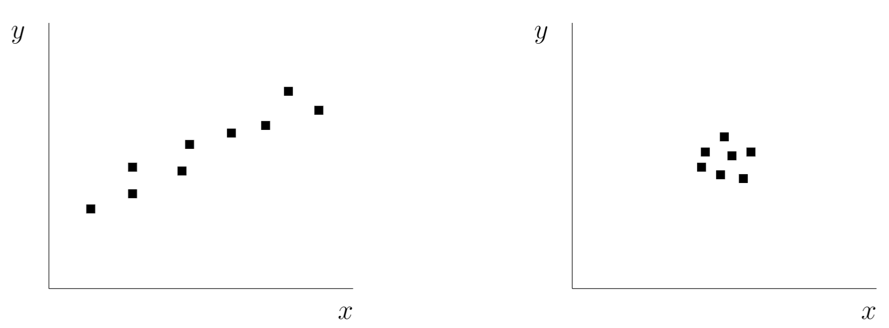
> UCBerkeley STAT260/CS294 Lecture 12
> 

>
> 则 $\bm{X}$ 越分散我们对 $\bm{\beta}$ 的先验越集中。

> [!NOTE|label:注意]
> 按照正常的 g-prior，我们应该将先验设为
> 
> $$\lambda_j \mid \gamma_j,\ \sigma^{2} \sim \mathcal{N}(0,\ \psi \sigma^{2} \bm{C}_{j}^{\top} \bm{C}_{j})$$
>
> 但相关系数 $\bm{\rho}$ 有个好处就是不受 scale 的影响，而且作者对收益率和因子都做了标准化，用 $\bm{\rho}$ 还是用 $\bm{C}$ 差别不大。

结合钉先验，整个钉板先验可以写成如下形式：

$$
\begin{equation}
    \lambda_j \mid \gamma_j,\ \sigma^{2} \sim \mathcal{N}(0,\ r(\gamma_j) \psi_j \sigma^{2})
\end{equation}
$$

其中

$$
\begin{equation}
    \begin{split}
        r(\gamma_j) = \begin{cases}
            1,\ &\gamma_j = 1 \\
            0.001,\ &\gamma_j = 0 \\
        \end{cases}
    \end{split}
\end{equation}
$$

用来区分钉板先验。

记对角线元素为 $(r(\gamma_1)\psi_1)^{-1},\ (r(\gamma_2)\psi_2)^{-1},\ \cdots (r(\gamma_{K})\psi_{K})^{-1}$ 的矩阵为 $\bm{D}$。则上述先验可以表达成以下矩阵形式：

$$
\begin{equation}
    \bm{\lambda} \mid \sigma^{2},\ \bm{\gamma} \sim \mathcal{N}(\bm{0},\ \sigma^{2} \bm{D}^{-1})
\end{equation}
$$

#### 引入 ω 辅助 γ 抽样

如果不对 $\bm{\gamma}$ 采样，想要找到最好的变量选择，我们需要考虑每一种可能性。假设有 $30$ 个变量，变量选择的可能性数量为 $2^{30}$，每一种可能性下我们都要做若干次 Gibbs sampling，这样一来计算量是极其大的。

因此为了能够对 $\bm{\gamma}$ 采样，我们对 $\bm{\gamma}$ 有如下先验假设：

$$
\begin{equation}
    \pi(\gamma_j = 1 \mid \omega_j) = \omega_j,\quad \omega_j \sim \text{Beta}(a_{\bm{\omega}},\ b_{\bm{\omega}})
\end{equation}
$$

其中 $a_{\bm{\omega}}$ 和 $b_{\bm{\omega}}$ 分别为 Beta 分布的两个参数，共同决定了分布的期望，即 $\E[\omega_j] = \frac{a_{\omega}}{a_{\omega} + b_{\omega}}$。

新引入的变量 $\bm{\omega}$ 不仅能够让我们对 $\bm{\gamma}$ 采样，同时还加入了我们对模型 **sparsity** 的先验。一个因子 $j$ 被选中的期望概率为 $\frac{a_{\omega}}{a_{\omega} + b_{\omega}}$，比如选取 $a_{\omega} = b_{\omega} = 1$ 代表每个因子都有 $\frac{1}{2}$ 的概率被选中；选取 $a_{\omega} = 1$ 和 $b_{\omega} \gg 1$ 则能让模型更为 sparse。

> [!TIP|label:提示]
> $\text{Beta}(1,\ 1)$ 与 $\text{Uniform}(0,\ 1)$ 是等价的，但是 **Beta 分布是伯努利分布的共轭分布**，对于服从伯努利分布的 $\bm{\gamma}$ 来说，对 $\bm{\omega}$ 选择 Beta 分布是合适且易于更新的。

#### 后验推断

目前为止，我们对先验的假设可以总结为

$$
\pi(\bm{\lambda},\ \sigma^{2},\ \bm{\gamma},\ \bm{\omega}) = \pi(\bm{\lambda} \mid \sigma^{2},\ \bm{\gamma}) \pi(\sigma^{2}) \pi(\bm{\gamma} \mid \bm{\omega}) \pi(\bm{\omega})
$$

通过以上先验我们可以得到它们的后验：

$$
\begin{equation}
    \bm{\lambda} \mid \text{data},\ \sigma^{2},\ \bm{\gamma},\ \bm{\omega} \sim \mathcal{N}\left(\underbrace{(\bm{C}^{\top} \bm{C} + \bm{D})^{-1} \bm{C}^{\top} \bm{\mu}_{\bm{R}}}_{\bm{\widehat{\lambda}}},\ \underbrace{\sigma^{2} (\bm{C}^{\top} \bm{C} + \bm{D})^{-1}}_{\widehat{\sigma}^{2}(\bm{\widehat{\lambda}})} \right) \label{12}
\end{equation}
$$

$$
\begin{equation}
    \begin{split}
        \frac{p(\gamma_j = 1 \mid \text{data},\ \bm{\lambda},\ \sigma^{2},\ \bm{\omega},\ \bm{\gamma}_{-j})}{p(\gamma_j = 0 \mid \text{data},\ \bm{\lambda},\ \sigma^{2},\ \bm{\omega},\ \bm{\gamma}_{-j})} = \frac{\omega_j}{1 - \omega_j} \frac{p(\lambda_j \mid \gamma_j = 1,\ \sigma^{2})}{p(\lambda_j \mid \gamma_j = 0,\ \sigma^{2})} := \xi_j \\
        \implies p(\gamma_j = 1 \mid \text{data},\ \bm{\lambda},\ \sigma^{2},\ \bm{\omega},\ \bm{\gamma}_{-j}) = \frac{\xi_j}{1 + \xi_j}
    \end{split} \label{13}
\end{equation}
$$

$$
\begin{equation}
    \omega_j \mid \text{data},\ \bm{\lambda},\ \sigma^{2},\ \bm{\gamma} \sim \text{Beta}(\gamma_j + a_{\bm{\omega}},\ 1 - \gamma_j + b_{\bm{\omega}})
\end{equation}
$$

$$
\begin{equation}
    \sigma^{2} \mid \text{data},\ \bm{\gamma},\ \bm{\omega} \sim \mathcal{IG}\left(\frac{N + K + 1}{2},\ \frac{\text{SSR}}{2} \right) 
\end{equation}
$$

其中

$$
\begin{equation}
    \text{SSR} = (\bm{\mu}_{\bm{R}} - \bm{C} \bm{\lambda})^{\top} (\bm{\mu}_{\bm{R}} - \bm{C} \bm{\lambda}) + \bm{\lambda}^{\top} \bm{D} \bm{\lambda}
\end{equation}
$$

前面提到，$\eqref{7}$ 式的 g-prior 先验不光可以识别弱因子（及水平因子），同时还能起到 shrinkage 的效果，这是因为：

- 当因子 $j$ 与 test assets 的相关性弱（弱因子），$\psi_j \to 0$，$\bm{D}$ 对应的对角线元素 $D_j := r(\gamma_j)\psi_j ^{-1}$ 趋于无穷，那么 $\eqref{12}$ 式中的 $(\bm{C}_{\! j}^{\top} \bm{C}_{\! j} + D_j)$ 由 $D_j$ 主导，它的倒数就会趋于 $0$，这样我们得到的风险价格的后验均值 $\widehat{\lambda}_{j}$ 就趋于 $0$；
- 当因子 $j$ 与 test assets 的相关性比较强，$D_j := r(\gamma_j)\psi_j ^{-1}$ 比较小，$(\bm{C}_{\! j}^{\top} \bm{C}_{\! j} + D_j)$ 由 $\bm{C}_{\! j}^{\top} \bm{C}_{\! j}$ 主导，但 $(\bm{C}_{\! j}^{\top} \bm{C}_{\! j} + D_j)^{-1} < (\bm{C}_{\! j}^{\top} \bm{C}_{\! j})^{-1}$，$D_j$ 的存在让风险价格的后验均值向 $0$ 收缩。

有了以上后验，我们同样可以用 Gibbs sampling 的方法按顺序对变量进行交替采样：

1. 为 $\bm{\lambda},\ \sigma^{2},\ \bm{\omega}$ 设定初值；
2. 循环：依次对 $\bm{\Sigma}_{\bm{Y}},\ \bm{\mu}_{\bm{Y}},\ \bm{\lambda},\ \bm{\gamma},\ \bm{\omega},\ \sigma^{2}$ 采样。

> [!NOTE|label:注意]
> 别忘了 $\bm{C}$ 中包括了一列全为 $1$ 的向量，即截距，在构建 shrinkage 矩阵 $\bm{D}$ 的时候，我们让截距对应的系数很小，也就是截距对应的 $\psi$ 很大，这保证了截距的存在。
>
> 这里跟前面不一样的是需要对 $\sigma^{2}$ 设定初值，因为使用连续的顶板先验时（用不连续的不需要），$\sigma^{2}$ 的后验分布与 $\bm{\lambda}$ 有关，而 $\bm{\lambda}$ 的后验又与 $\sigma^{2}$ 有关，它们之间必须有一个要设定初值。$\sigma^{2}$ 的初值设定为 OLS 估计误差的样本方差：
>
> $$\sigma_{\text{OLS}}^{2} := \frac{1}{N} (\bm{\mu}_{\bm{R}} - \bm{C} \bm{\lambda}_{\text{OLS}})^{\top} (\bm{\mu}_{\bm{R}} - \bm{C} \bm{\lambda}_{\text{OLS}})$$
>
> 其中 $\bm{\lambda}_{\text{OLS}}$ 为风险价格的频率派估计（OLS 假设下），$\bm{\mu}_{\bm{R}}$ 和 $\bm{C}$ 分别是样本的均值和协方差（标准化后）。

> [!TIP|label:提示]
> 在设定 $a_{\bm{\omega}} = b_{\bm{\omega}} = 1$ 的情况下，$\bm{\omega}$ 的初值为 $\frac{1}{2} \cdot \bm{1}_{K}$，即每个因子一开始都有 $\frac{1}{2}$ 的概率被选到。
> 
> 对于弱因子 $j$，$\eqref{13}$ 式中 $p(\lambda_j \mid \gamma_j = 1,\ \sigma^{2})$ 与 $p(\lambda_j \mid \gamma_j = 0,\ \sigma^{2})$ 是比较接近的，因为不管我们包不包括它，我们抽样得到的风险价格都会集中在 $0$ 附近，因此 $\xi_j \approx \frac{\omega_j}{1 - \omega_j}$；而如果 $j$ 是个比较强的因子，我们抽样得到的风险价格应该是倾向于偏离 $0$ 的，这就导致 $p(\lambda_j \mid \gamma_j = 1,\ \sigma^{2}) \gg p(\lambda_j \mid \gamma_j = 0,\ \sigma^{2})$，即 $\xi_j \gg \frac{\omega_j}{1 - \omega_j}$。
> 
> 根据 $\eqref{12}$ 式，$\xi_j$ 越大，$\gamma_j = 1$ 的概率会越大，如果抽样得到的 $\gamma_j$ 一直是 $1$，那么在 $\omega_j$ 的后验分布中，参数 $a$ 会越来越大，参数 $b$ 则维持不变，这导致期望 $\frac{a}{a + b}$ 会越来越大，我们包括因子 $j$ 的期望概率也就越大；反之，如果 $\gamma_j$ 一直是 $0$，那么在 $\omega_j$ 的后验分布中，参数 $b$ 会越来越大，参数 $a$ 则维持不变，这导致期望 $\frac{a}{a + b}$ 会越来越小，我们包括因子 $j$ 的期望概率也就越小。
>
> 总的来说，**弱因子被包括进模型的概率会越来越小，强因子被包括进模型的概率会越来越大。**

至此，通过不断地循环，我们成功得到了 $\bm{\gamma}$ 的后验概率。

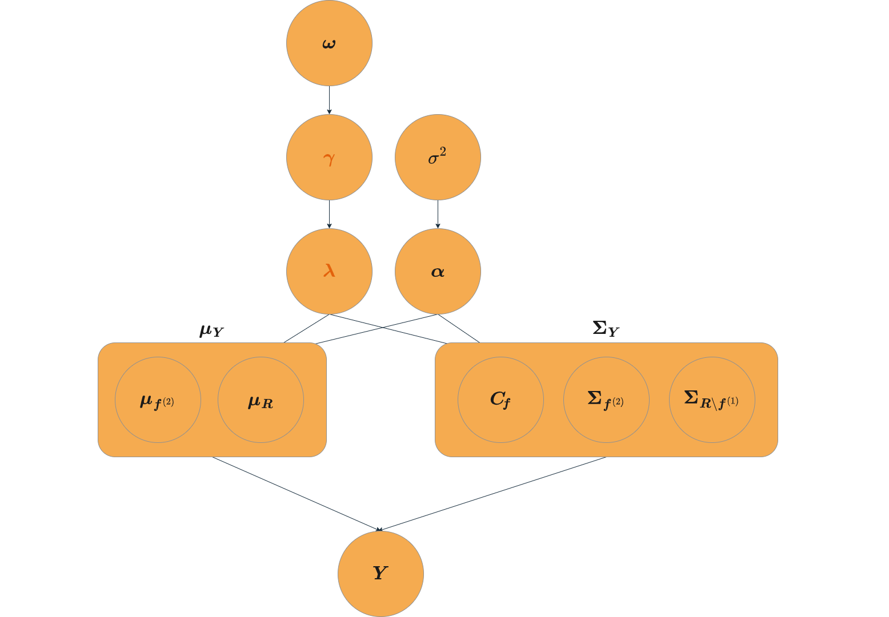

#### 超参数的含义

SDF 隐含的最大夏普比的平方为 SDF 的方差，即 $\bm{\lambda}_{\bm{f}}^{\top} \bm{\Sigma}_{\bm{f}} \bm{\lambda}_{\bm{f}}$，而定价误差 $\bm{\alpha}$ 的夏普比平方为 $\bm{\alpha}^{\top} \bm{\Sigma}_{\bm{R}}^{-1} \bm{\alpha}$。由于对 test assets 和因子都做了标准化处理，在先验下我们有：

$$
\begin{align}
    \frac{\E_{\pi}[\text{SR}_{\bm{f}}^{2} \mid \bm{\gamma},\ \sigma^{2}]}{\E_{\pi}[\text{SR}_{\bm{\alpha}}^{2} \mid \sigma^{2}]} &= \frac{\E_{\pi}[\bm{\lambda}_{\bm{f}}^{\top} \bm{\lambda}_{\bm{f}} \mid \bm{\gamma},\ \sigma^{2}]}{\E_{\pi}[\bm{\alpha}^{\top} \bm{\alpha} \mid \sigma^{2}]} \notag \\
    &= \frac{\sum_{k=1}^{K} r(\gamma_k) \psi_k \sigma^{2}}{\sum_{n=1}^{N} \sigma^{2}} \notag \\
    &= \frac{\psi \sum_{k=1}^{K} r(\gamma_k) \bm{\tilde{\rho}}_{k}^{\top}\bm{\tilde{\rho}}_{k}}{N} \\
\end{align}
$$

> [!TIP|label:提示]
> 在先验下，因子的风险价格是 i.i.d. 的。

根据 GRS（1989）我们知道，$\bm{Y}$ 的夏普比平方可以拆解为因子的夏普比平方和定价误差的夏普比平方：

$$
\text{SR}_{\bm{Y}}^{2} = \text{SR}_{\bm{f}}^{2} + \text{SR}_{\bm{\alpha}}^{2}
$$

两边同时对先验取期望可得

$$
\begin{aligned}
    \E_{\pi}[\text{SR}_{\bm{Y}}^{2} \mid \bm{\gamma},\ \sigma^{2}] &= \E_{\pi}[\text{SR}_{\bm{f}}^{2} \mid \bm{\gamma},\ \sigma^{2}] + \E_{\pi}[\text{SR}_{\bm{\alpha}}^{2} \mid \sigma^{2}] \\
    \frac{\E_{\pi}[\text{SR}_{\bm{Y}}^{2} \mid \bm{\gamma},\ \sigma^{2}]}{\E_{\pi}[\text{SR}_{\bm{\alpha}}^{2} \mid \sigma^{2}]} &= \frac{\E_{\pi}[\text{SR}_{\bm{f}}^{2} \mid \bm{\gamma},\ \sigma^{2}]}{\E_{\pi}[\text{SR}_{\bm{\alpha}}^{2} \mid \sigma^{2}]} + 1 \\
    \frac{\E_{\pi}[\text{SR}_{\bm{Y}}^{2} \mid \bm{\gamma},\ \sigma^{2}] - \E_{\pi}[\text{SR}_{\bm{f}}^{2} \mid \bm{\gamma},\ \sigma^{2}]}{\E_{\pi}[\text{SR}_{\bm{Y}}^{2} \mid \bm{\gamma},\ \sigma^{2}]} &= \frac{1}{\E_{\pi}[\text{SR}_{\bm{f}}^{2} \mid \bm{\gamma},\ \sigma^{2}] / \E_{\pi}[\text{SR}_{\bm{\alpha}}^{2} \mid \sigma^{2}] + 1} \\
    \frac{\E_{\pi}[\text{SR}_{\bm{f}}^{2} \mid \bm{\gamma},\ \sigma^{2}]}{\E_{\pi}[\text{SR}_{\bm{Y}}^{2} \mid \bm{\gamma},\ \sigma^{2}]} &= 1 - \frac{1}{\E_{\pi}[\text{SR}_{\bm{f}}^{2} \mid \bm{\gamma},\ \sigma^{2}] / \E_{\pi}[\text{SR}_{\bm{\alpha}}^{2} \mid \sigma^{2}] + 1} \\
\end{aligned}
$$

上式表明，$\frac{\E_{\pi}[\text{SR}_{\bm{f}}^{2} \mid \bm{\gamma},\ \sigma^{2}]}{\E_{\pi}[\text{SR}_{\bm{\alpha}}^{2} \mid \sigma^{2}]}$ 越大，$\frac{\E_{\pi}[\text{SR}_{\bm{f}}^{2} \mid \bm{\gamma},\ \sigma^{2}]}{\E_{\pi}[\text{SR}_{\bm{Y}}^{2} \mid \bm{\gamma},\ \sigma^{2}]}$ 也越大，即先验地认为因子能很大程度地解释 test assets 的夏普比平方。因此 $\eqref{17}$ 式说明超参数 $\psi$ 的大小代表了我们对因子解释程度的判断。

在本文实证的样本中，$\sum_{k=1}^{K} \frac{\bm{\tilde{\rho}}_{k}^{\top}\bm{\tilde{\rho}}_{k}}{N} \approx 3.22$，先验下期望选中的因子是 $\frac{K}{2}$ 个，则当 $\psi = 1$，$\eqref{17}$ 式等于 $1.61$，夏普比平方的解释程度为 $1 - \frac{1}{1.61 + 1} \approx 62\%$；当 $\psi = 5$，$\eqref{17}$ 式等于 $8.05$，夏普比平方的解释程度为 $1 - \frac{1}{8.05 + 1} \approx 89\%$。

> [!TIP|label:夏普比平方之间的关系]
> 在时序模型下，假设
> 
> $$\bm{R}_{t} = \bm{\alpha} + \bm{\beta} \bm{f}_{\! t} + \bm{\varepsilon}_{t},\quad \bm{\varepsilon}_{t} \overset{\text{i.i.d.}}{\sim} \mathcal{N}(0,\ \bm{\Sigma}_{\bm{\varepsilon}})$$
> 
> 记因子的方差 $\Var(\bm{f}_{\! t}) := \bm{\Sigma}_{\bm{f}}$，则 test assets $\bm{R}_{t}$ 的方差可以表示为 $\Var(\bm{R}_{t}) = \bm{\beta} \bm{\Sigma}_{\bm{f}} \bm{\beta}^{\top} + \bm{\Sigma}_{\bm{\varepsilon}}$。
> 
> 定义 $\bm{Y}_{\! t} = \left(\bm{f}_{\! t}^{\top},\ \bm{R}_{t}^{\top}\right)^{\top}$ 包含了所有因子和 test assets，它的方差可以写成
> 
> $$\Var(\bm{Y}_{\! t}) = \begin{bmatrix}	\bm{\Sigma}_{\bm{f}} & \bm{\Sigma}_{\bm{f}} \bm{\beta}^{\top} \\ \bm{\beta} \bm{\Sigma}_{\bm{f}} & \bm{\beta} \bm{\Sigma}_{\bm{f}} \bm{\beta}^{\top} + \bm{\Sigma}_{\bm{\varepsilon}} \\\end{bmatrix} =: \begin{bmatrix}	A & B \\	C & D \\\end{bmatrix}$$
> 
> 利用分块矩阵的求逆公式，由于 $D - C A ^{-1} B = \bm{\Sigma}_{\bm{\varepsilon}}$ 是可逆矩阵，我们有
> 
> $$\begin{aligned} \Var ^{-1}(\bm{Y}_{\! t}) &= \begin{bmatrix}	A & B \\	C & D \\\end{bmatrix}^{-1} \\ &= \begin{bmatrix}	A ^{-1} + A ^{-1} B (D - C A ^{-1} B)^{-1} C A ^{-1} & -A ^{-1} B (D - C A ^{-1} B)^{-1} \\	-(D - C A ^{-1} B)^{-1} C A ^{-1} & (D - C A ^{-1} B)^{-1} \\\end{bmatrix} \\ &= \begin{bmatrix}	\bm{\Sigma}_{\bm{f}}^{-1} + \bm{\beta}^{\top} \bm{\Sigma}_{\bm{\varepsilon}}^{-1} \bm{\beta} & -\bm{\beta}^{\top} \bm{\Sigma}_{\bm{\varepsilon}}^{-1} \\	-\bm{\Sigma}_{\bm{\varepsilon}}^{-1} \bm{\beta} & \bm{\Sigma}_{\bm{\varepsilon}}^{-1} \\\end{bmatrix} \end{aligned}$$
> 
> 记 test assets 的期望为 $\bm{\mu}_{\bm{R}}$，因子的期望为 $\bm{\mu}_{\bm{f}}$，$\bm{\mu}_{\bm{Y}} = \left(\bm{\mu}_{\bm{f}}^{\top},\ \bm{\mu}_{\bm{R}}^{\top} \right)^{\top}$，则 $\bm{Y}_{\! t}$ 的夏普比平方可以写成
> 
> $$\begin{aligned} \bm{\mu}_{\bm{Y}}^{\top} \Var ^{-1}(\bm{Y}_{\! t}) \bm{\mu}_{\bm{Y}} &= \begin{bmatrix}	\bm{\mu}_{\bm{f}}^{\top} (\bm{\Sigma}_{\bm{f}}^{-1} + \bm{\beta}^{\top} \bm{\Sigma}_{\bm{\varepsilon}}^{-1} \bm{\beta}) - \bm{\mu}_{\bm{R}}^{\top} \bm{\Sigma}_{\bm{\varepsilon}}^{-1} \bm{\beta} \\ -\bm{\mu}_{\bm{f}}^{\top} \beta^{\top} \bm{\Sigma}_{\bm{\varepsilon}}^{-1} + \bm{\mu}_{\bm{R}}^{\top} \bm{\Sigma}_{\bm{\varepsilon}}^{-1} \\\end{bmatrix}^{\top} \bm{\mu}_{\bm{Y}} \\ &= \bm{\mu}_{\bm{f}}^{\top} (\bm{\Sigma}_{\bm{f}}^{-1} + \bm{\beta}^{\top} \bm{\Sigma}_{\bm{\varepsilon}}^{-1} \bm{\beta}) \bm{\mu}_{\bm{f}} - \bm{\mu}_{\bm{R}}^{\top} \bm{\Sigma}_{\bm{\varepsilon}}^{-1} \bm{\beta} \bm{\mu}_{\bm{f}} \\ &\qquad -\bm{\mu}_{\bm{f}}^{\top} \beta^{\top} \bm{\Sigma}_{\bm{\varepsilon}}^{-1} \bm{\mu}_{\bm{R}} + \bm{\mu}_{\bm{R}}^{\top} \bm{\Sigma}_{\bm{\varepsilon}}^{-1} \bm{\mu}_{\bm{R}} \\ &= \bm{\mu}_{\bm{f}}^{\top} (\bm{\Sigma}_{\bm{f}}^{-1} + \bm{\beta}^{\top} \bm{\Sigma}_{\bm{\varepsilon}}^{-1} \bm{\beta}) \bm{\mu}_{\bm{f}} - (\bm{\alpha} + \bm{\beta} \bm{\mu}_{\bm{f}})^{\top} \bm{\Sigma}_{\bm{\varepsilon}}^{-1} \bm{\beta} \bm{\mu}_{\bm{f}} \\ &\qquad - (\bm{\mu}_{\bm{R}} - \bm{\alpha})^{\top} \bm{\Sigma}_{\bm{\varepsilon}}^{-1} \bm{\mu}_{\bm{R}} + \bm{\mu}_{\bm{R}}^{\top} \bm{\Sigma}_{\bm{\varepsilon}}^{-1} \bm{\mu}_{\bm{R}} \\ &= \bm{\mu}_{\bm{f}}^{\top} \bm{\Sigma}_{\bm{f}}^{-1} \bm{\mu}_{\bm{f}} - \bm{\alpha}^{\top} \bm{\Sigma}_{\bm{\varepsilon}}^{-1} \bm{\beta} \bm{\mu}_{\bm{f}} + \bm{\alpha}^{\top} \bm{\Sigma}_{\bm{\varepsilon}}^{-1} \bm{\mu}_{\bm{R}} \\ &= \bm{\mu}_{\bm{f}}^{\top} \bm{\Sigma}_{\bm{f}}^{-1} \bm{\mu}_{\bm{f}} + \bm{\alpha}^{\top} \bm{\Sigma}_{\bm{\varepsilon}}^{-1} \bm{\alpha} \\ \end{aligned}$$
> 
> 也即
> 
> $$\text{SR}_{\bm{Y}}^{2} = \text{SR}_{\bm{f}}^{2} + \text{SR}_{\bm{\alpha}}^{2}$$
> 
> 说明**因子和 test assets 共同得到的夏普比平方和可以拆解为因子的夏普比平方和定价误差的夏普比平方。**

当然，除了 $\psi$，$\bm{\omega}$ 的先验 $\pi(\bm{\omega})$ 中，参数 $a_{\bm{\omega}}$ 与 $b_{\bm{\omega}}$ 也会对上述的夏普比解释程度有影响，因为它们共同影响了期望选择的因子数量。

### 模型集成

当我们抽样出不同的模型（不同的变量选择），我们可以用模型集成的方式综合考虑这些模型。当我们关心某个变量 $\Delta$ （可以是风险价格，风险溢价，或是最大夏普比等），根据贝叶斯定理我们有

$$
\begin{equation}
    \E[\Delta \mid \text{data}] = \sum\limits_{m \in \mathcal{M}} \E[\Delta \mid \text{data},\ \text{model} = m] \operatorname{Pr}(\text{model} = m \mid \text{data}) \label{18}
\end{equation}
$$

其中 

$$
\begin{equation}
    \E[\Delta \mid \text{data},\ \text{model} = m] = \lim\limits_{L \to \infty} \frac{1}{L} \sum\limits_{l=1}^{L} \Delta(\bm{\theta}_{l}^{(m)}) 
\end{equation}
$$

$\left\{\bm{\theta}_{l}^{(m)} \right\}_{l=1}^{L}$ 代表从模型 $m$ 的后验分布中的 $L$ 次参数抽样。

这样得到的估计被称为 **BMA（Bayesian Model Averaging）**，**实际上就是对所有抽样出来的模型简单取平均，只不过有的模型被抽的次数多，自然在 $\eqref{19}$ 式中权重高，这是一种减少过拟合的方法。**

> [!TIP|label:BMA 的好处]
> 1. 当我们在同一个风险上（比如在公司盈利能力的风险上）有多个因子 candidate 时，做 BMA 是一个很好的方法，它能通过加权平均的方式最大化 SDF 对截面定价的信噪比。
> 2. BMA 在平方误差函数下是最优的；
> 3. BMA 给出的分布与真实的 DGP（Data-Generating Process）之间的 KL 散度最小。

## 实验

### 模拟

作者首先选取 Fama-French 的 5x5 组合作为 test assets，并假设只有 Fama 三因子中的 HML 是有用的因子，用正态分布来生成 test assets 的收益率和 HML，即 DGP 如下

$$
\begin{equation}
    \begin{pmatrix}	\bm{R}_{t} \\ f_{t,\ \text{HML}} \\\end{pmatrix} \overset{\text{i.i.d.}}{\sim} \mathcal{N} \left(\begin{bmatrix}	\bm{\overline{\mu}}_{\bm{R}} \\	\overline{f}_{\text{HML}} \\\end{bmatrix},\ \begin{bmatrix}	\bm{\widehat{\Sigma}}_{\bm{R}} & \bm{\widehat{C}}_{\! \text{HML}} \\ \bm{\widehat{C}}_{\! \text{HML}}^{\top} & \widehat{\sigma}_{\text{HML}}^{2} \\\end{bmatrix} \right) 
\end{equation}
$$

其中正态分布内的参数都是根据真实数据计算的，但 DGP 生成的数据属于模拟数据（虚假的）。

其次，作者还设计了一个弱因子：

$$
f_{t,\ \text{useless}} \overset{\text{i.i.d.}}{\sim} \mathcal{N}(0,\ (1\%)^{2})
$$

作者使用 1963 年 7 月到 2017 年 12 月的月频数据来计算 DGP 的参数，但由于是模拟，样本理论上可以无限多，于是作者分别研究了 $T = 100,\ 200,\ 600,\ 1,000,\ 20,000$ 的情况。

> [!NOTE|label:注意]
> $T = 600$ 已经相当于 50 年的数据了，$T = 1,000$ 和 $T = 20,000$ 是真实数据所达不到的样本长度。

#### 比较频率派与贝叶斯派对弱因子的识别能力

首先我们可以估计出 HML 因子“真实的”风险价格 $\lambda^{*}$ 和“真实的”调整 R 方，即用真实数据对 HML 因子分别进行 OLS 和 GLS 的估计。

接着使用不同模型对模拟数据进行操作，得到因子风险价格的估计值（其中贝叶斯估计假设 $\sigma^{2} \to 0$，即只输出风险价格的均值），并进行不同置信水平的假设检验：

- 截距项：$H_0: \lambda_c = \lambda_c^{*}$
- 强因子（HML）：$H_0: \lambda_{\text{strong}} = \lambda_{\text{strong}}^{*}$；
- 无用因子：$H_0：\lambda_{\text{useless}} = 0$。

调整 R 方则是给出了 5\% 的置信区间。

对假设的 DGP 做了 2000 次模拟，作者得到下面的结果：

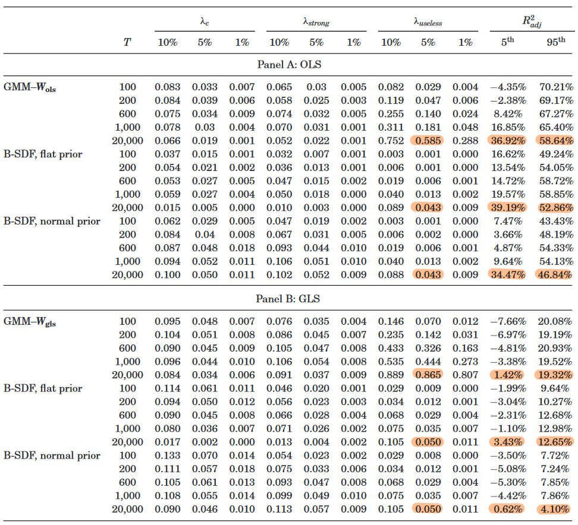

其中对于因子的风险价格我们用拒绝原假设的频率来比较，比如标橙的 $0.585$ 代表在 OLS 假设下，频率派的估计在 5\% 的置信水平上有 58.5\% 都拒绝了原假设 $H_0: \lambda_{\text{useless}} = 0$，即 2000 次拒绝了 1170 次，也就是 2000 次中有 1170 次都会认为弱因子好使。同样地，在 GLS 假设下，频率派估计有 86.5\% 的情况都会把弱因子错误地包括进去，且样本时间 $T$ 越长，错误包括进去的频率越大。上图说明**频率派的估计基本无法识别弱因子；而不管是用均匀先验还是正态先验，贝叶斯估计在各个假设下都能很好地识别弱因子。**

从下面这张图（$T = 1,000$）我们也能看出频率派的估计和贝叶斯估计的差别：

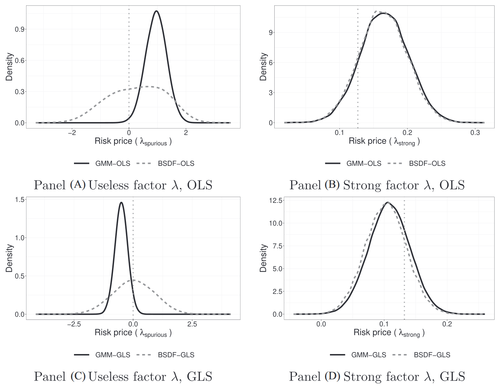

对于强因子来说两者估计的都差不多，但贝叶斯估计可以很明显地识别到弱因子。

对于调整 R 方我们主要看它的 5\% 置信区间是否够收敛于真实的调整 R 方。在 OLS（GLS）假设下，“真实值”为 $43.87\%$（$6.69\%$），可以看到**贝叶斯模型的调整 R 方会比频率派更靠近“真实值”。**

#### 比较不同先验下的变量选择能力

检验一个变量是否应该被纳入模型可以用<strong>贝叶斯因子（Bayes factor）</strong>来衡量：

$$
\text{BF}_{i} = p(\gamma_i = 1 \mid \text{data})
$$

**当贝叶斯因子超过某个阈值，我们认为应该包括这个变量。**

于是对于贝叶斯派估计，使用不同先验的变量选择结果如下：

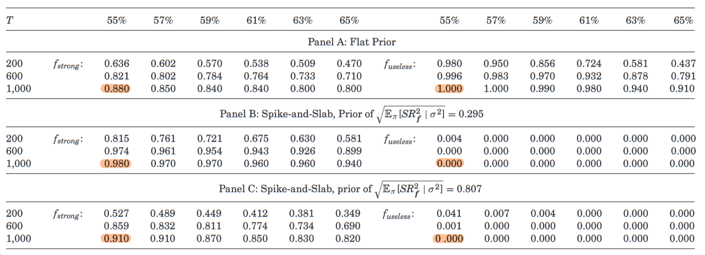

最上方代表不同的阈值，标橙的这些数值代表变量被选择的频率。可以看到**使用钉板先验（正态先验）对于强因子的选择是比均匀先验要准确的，对于弱因子的选择，使用均匀先验和正态先验可以说是天差地别。**

### 实证

作者使用了 51 因子（34 个可交易，17 个不可交易）和 60 个 test assets（34 个可交易因子，26 个单变量排序得到的多空组合），数据集从 1973 年 10 月到 2016 年 12 月（$T \approx 600$）。实证中使用的是 GLS 假设下的贝叶斯估计，采样 500,000 次，去掉前 50,000 次（还没收敛）。

> [!NOTE|label:注意]
> 单变量排序得到的多空（异象）组合也有成为可交易因子的潜质，但异象之间可能存在相关性，只有对截面定价有显著增量才能称之为因子。尽管可交易因子大多也都是排序得到的多空组合，但它们是在对截面定价有显著增量的。

#### 因子的后验概率与风险价格的后验均值

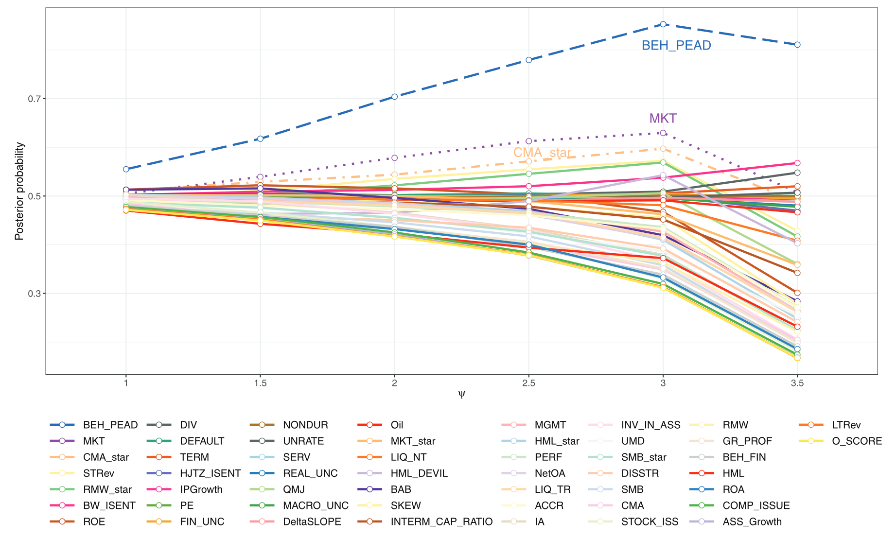

上图描述了 51 个因子被选择（$\gamma_j = 1$）的后验概率是如何随先验夏普比变化而变化的（虽然横坐标写的是 $\psi$ 但实际上刻度是对应的先验夏普比，3.5 是 test assets 的夏普比）。其中 **BEH_PEAD 是盈余公告漂移（Postearnings Announcement Drift）因子，这个因子试图度量投资者的有限注意力**（Daniel 等，2020），后验概率遥遥领先，高于 70\%；排在第二位的 MKT 是市场因子；排在第三位的 CMA_star 则是一个投资因子。

可以看到，少数几个因子后验概率随先验夏普比的增大而升高，当先验夏普比大到一定程度后后验概率同时开始降低；很多因子后验概率一直维持在 50\% 左右；还有很多因子后验概率一直随先验夏普比的增大而降低。这说明三个问题：

1. **很多因子最多是弱因子（weakly identified at best）**，即后验和先验差不多（50\%）；
2. 还有**很多因子对于定价作者选择的 test assets 是无用的**（不是 SDF 的一部分），即后验比先验低；
3. **个人思考**：在先验夏普比等于 test assets 夏普比的情况下，相当于我们先验认为这 51 个因子就可以完全解释 test assets 的夏普比，但这是无法做到的，因此即使是有效的因子后验概率也会向 50\% 收敛。**我们要求解释更多夏普比，就需要更有效的因子。**

这些因子风险价格的具体后验概率和后验均值为

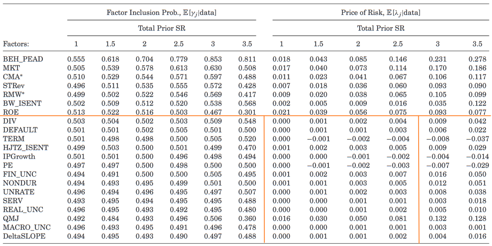

可以看到，<strong>对于那些弱因子，它们风险价格的后验均值基本为 $0$</strong>，只有当先验夏普比比较高时才会偏离 $0$，也就是说，**当先验夏普比不合理地高时（相当于几乎没有 shrinkage，极端一点就是频率派的估计），对弱因子的估计就不再稳健，且会 drive out 那些本应该有效的因子。**

#### 对比传统模型

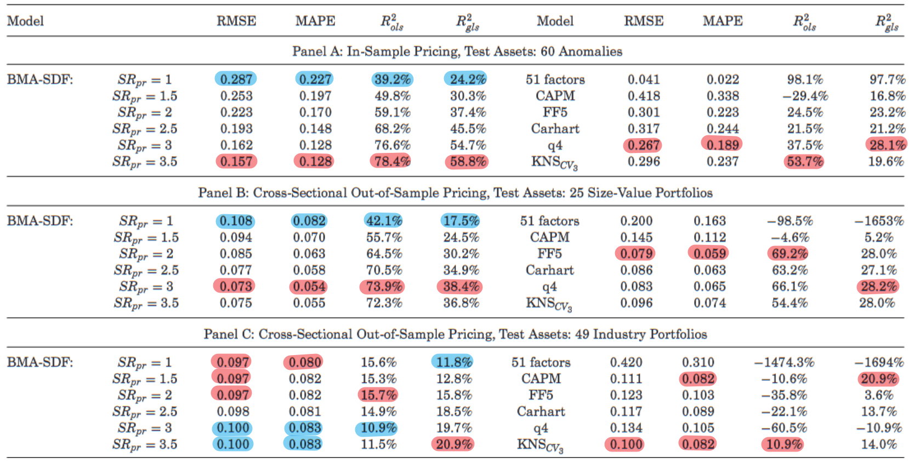

上图左半边为不同夏普先验下 BMA 的各项指标，右半边为传统模型的各项指标。Panel A 是样本内，Panel B 和 C 都是样本外（这里的样本外指的是截面的样本外，而非时序样本外）。标蓝和标红分别为指标最差和最好的模型。

可以看到**先验夏普比为 3.5 时，样本内的效果最好，比任意传统模型都要好，且在样本外的效果也不差**，Panel B 中也是比所有传统模型要好，Panel C 中除了 MAPE（Mean Absolute Pricing Error）外也是；**不同夏普先验下 BMA 的样本内和样本外效果都不错，即使最差的那些也和传统模型中最好的相差不多。**

#### 对比 KNS（2020）

*Shrinking the Cross-Section*（Kozak 等，2020，以下简称 KNS）也是通过一个相似的先验去对后验估计进行 shrinking，它们在时序上的样本外效果比传统模型强，因此本文直接与 KNS（2020）进行对比。

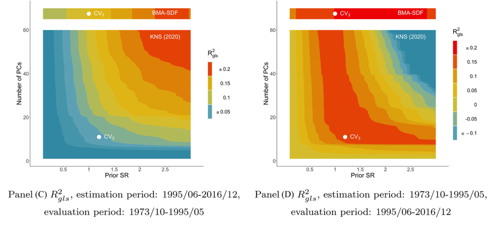

上图分别展示了 BMA 和 KNS（2020）在样本外的调整 R 方热力图，横坐标是先验夏普比，纵坐标是 KNS（2020）中主成分因子的数量，$\text{CV}_{3}$ 代表通过将全部数据分三组交叉验证得到的最优参数（见过样本外）。左图是新数据作为样本内，旧数据作为样本外；右图则是旧数据作为样本内，新数据作为样本外。

可以看到**在相同的先验夏普比下，BMA 比 KNS（2020）的交叉验证参数 $\text{CV}_{3}$ 要强，BMA 的 $\text{CV}_{3}$ 也比 KNS（2020）的要强；在不同的先验夏普比下，BMA 大多都比 KNS（2020）竖直方向上最好的情况要强，尤其是在我们使用新数据作为样本外的时候（右图）。**

> [!NOTE|label:注意]
> KNS（2020）和本文的一个区别在于 KNS（2020）直接对 test assets 做 PCA，是没有用到不可交易因子的，也许是这些因子的存在提高了本文模型的能力。

#### 选择 VS. 聚合

在频率派眼中，是存在一个最优模型的，但在计算 BMA 的时候究竟存不存在一个远超其他模型的模型呢？答案是不存在的。

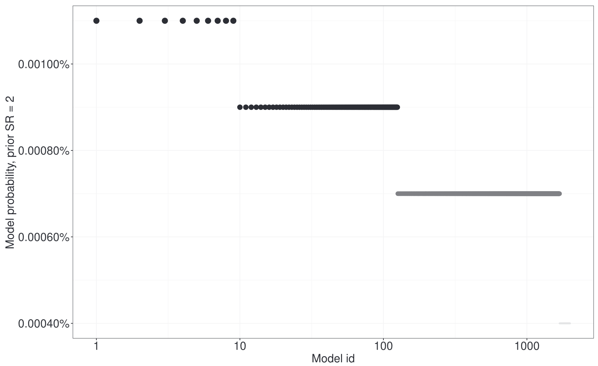

上图展示了前 2,000 个模型的后验概率（被抽样的次数比上总抽样数），横轴是模型的排名（经过 log 伸缩处理），纵轴是后验概率。

可以看到**即使是最大的后验概率也只有 0.0011\%，且后验概率下降的速度非常慢**，前 9 个模型都是 0.0011\%，第 10 个到第 125 个是 0.0009\%，第 126 个到第 1687 个是 0.0007\%，之后是 0.0004\%。**因此没有一个 clear winner，对模型做聚合比选择一个最佳模型更适合。**

#### 因子数量和后验夏普比的分布

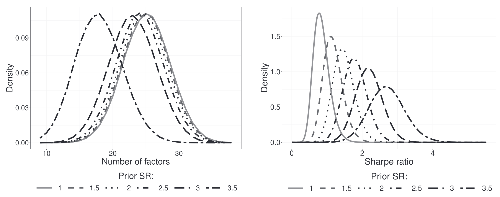

上图左边展示了不同夏普先验下因子数量的分布，右边展示了不同夏普先验下后验夏普比的分布。

**当先验夏普比在 1 到 3 之间时，因子数量的后验均值集中在 23 到 25，也就是说平均下来我们应该选择 24 个左右的因子**；而当先验夏普比到 3.5，因子数量的分布有一个非常大的左移，也就是说**当我们要求很高的夏普比，对因子风险溢价的先验就趋近于均匀先验了**（见 $\eqref{7}$ 式，先验夏普比高即 $\psi$ 高），而前面我们已经探讨过[均匀先验的坏处](#对风险价格使用均匀先验的坏处)，即**弱因子会被错误识别为强因子，这就导致强因子都被弱因子“挤”出去了。**

**对于最大夏普比，作者得到的后验均值跟先验差不太多，且分布都不会太分散，说明不会出现非常高的夏普比。**

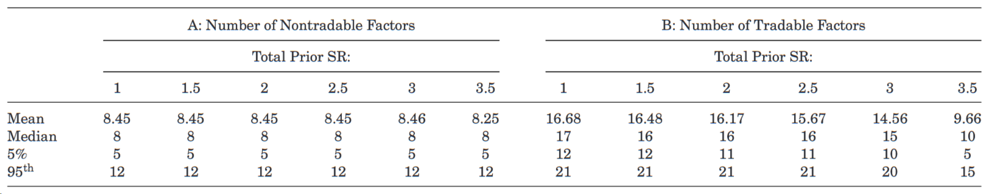

上表展示了选择的因子中可交易因子和不可交易因子的数量，**平均可交易因子和不可交易因子各选一半。**

#### PCA 以及 RP-PCA 构建的隐因子是否有效

对 test assets 做 PCA，作者在原先 51 个因子的基础上加入了前 5 个隐因子和 2 个人工制造的无用因子（见[模拟](#模拟)）。

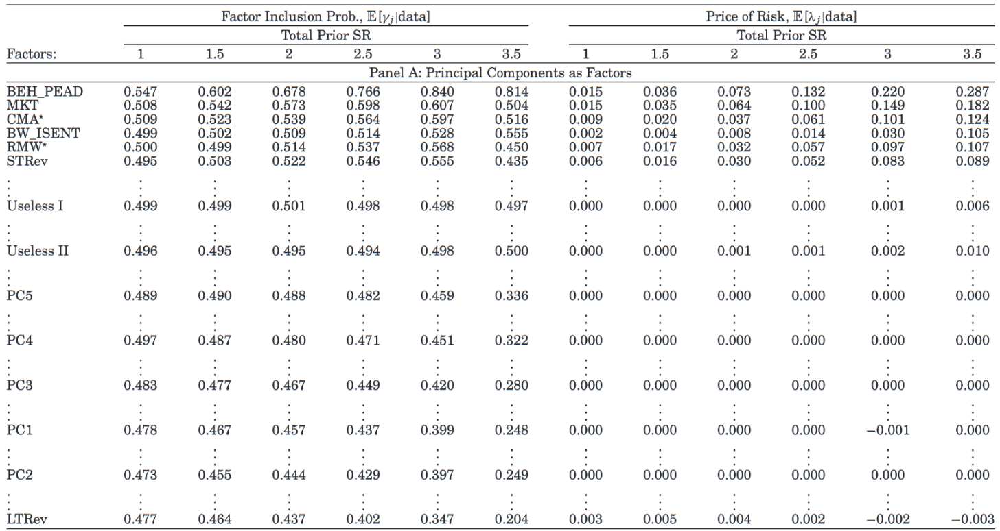

可以看到**这 5 个隐因子基本没什么用**，甚至不如人工制造的无用因子。

而将 PCA 换成 RP-PCA（Lettau 和 Pelger，2020），结果则大不相同：

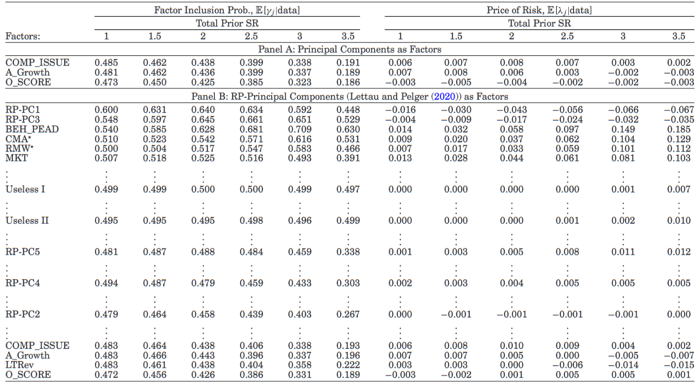

尽管仍然有 3 个隐因子没什么用，<strong>有 2 个隐因子直接杀到了前面。</strong>同时，这 2 个隐因子并没有“挤”掉原先强势的那些因子，说明**这 2 个隐因子与原先强势的因子关系并不大。**

> 这 2 个隐因子对应的风险价格都是负的，这说明了什么？

## 可能的扩展

1. 如果想要限制最大夏普比，可以将钉板先验中的正态分布换成 Beta 分布，因为 Beta 分布横向有界（正态分布横向可以取到 $\pm \infty$）；
2. 本文对因子风险价格的先验是正态分布，可以扩展到一些厚尾的分布比如柯西分布；
3. 可以加入一些时变的参数，但这会让计算复杂度大大提高。

## 可能存在的问题

1. 由于有不可交易因子的存在，风险价格并不能和切点组合的权重联系起来，无法直接指导投资，而 KNS（2020）可以；
2. 因子和 test assets 收益率是同期的？
3. 均值 $\bm{\mu}$ 和协方差 $\bm{C}$ 都是抽样得到的，也就是说真实值是抽样得到的，这样计算 R 方是否有点流氓？

## 参考文献

Daniel, K., Hirshleifer, D., & Sun, L. (2020). Short- and Long-Horizon Behavioral Factors. The Review of Financial Studies, 33(4), 1673–1736. https://doi.org/10.1093/rfs/hhz069

Gibbons, M. R., Ross, S. A., & Shanken, J. (1989). A Test of the Efficiency of a Given Portfolio. Econometrica, 57(5), 1121. https://doi.org/10.2307/1913625

Kozak, S., Nagel, S., & Santosh, S. (2020). Shrinking the cross-section. Journal of Financial Economics, 135(2), 271–292. https://doi.org/10.1016/j.jfineco.2019.06.008

Lettau, M., & Pelger, M. (2020). Factors That Fit the Time Series and Cross-Section of Stock Returns. The Review of Financial Studies, 33(5), 2274–2325. https://doi.org/10.1093/rfs/hhaa020
