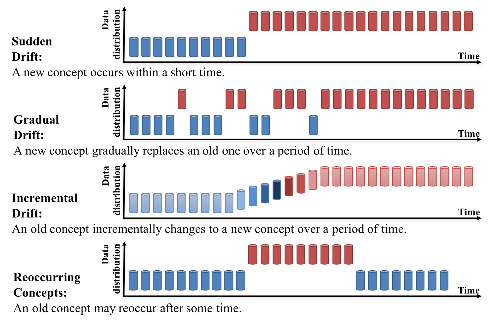

# Learning under Concept Drift: A Review

## 论文信息

这是一篇概念漂移的综述。

### 作者

Jie Lu, Anjin Liu, Fan Dong, Feng Gu, João Gama, Guangquan Zhang

除了 João Gama，其他人均来自悉尼科技大学，João Gama 来自波尔图大学。

### 收录情况

TKDE2018

## 概念漂移

概念漂移：输入与预测目标之间的关系在变化，恒定的模型无法刻画。

### 概念漂移的三种内在来源

1. 输入 $\bm{X}$ 的分布在改变：$p_t(\bm{X}) \neq p_{t+1}(\bm{X})$；
2. 输入 $\bm{X}$ 与 输出 $y$ 之间的关系在改变：$p_t(y \mid \bm{X}) \neq p_{t+1}(y \mid \bm{X})$；
3. 1 与 2 的叠加：$p_t(\bm{X}) \neq p_{t+1}(\bm{X})$ 且 $p_t(y \mid \bm{X}) \neq p_{t+1}(y \mid \bm{X})$。

### 概念漂移的四种表现形式

## 概念漂移检测算法

### 基于预测误差的算法

做新的预测发现误差大了（统计显著）就代表发生了概念漂移。

- 缺点：对概念漂移的判断是间接的（并没有直接从分布入手），无法度量概念漂移的严重程度。

### 基于分布相似度的算法

用某种距离或度量衡量旧数据与新数据之间的相似度，如果非常不相似（统计显著）就代表发生了概念漂移。对于高维数据可能要提前做降维。

- 优点：对概念漂移的判断是直接的（从概念漂移的定义出发），因此可以度量概念漂移的严重程度。
- 缺点：计算成本高，窗口固定。

### 多重假设检验算法

从多个角度检验概念漂移是否发生，分为

1. 平行多重检验：检验是并列的，比如对不同的输入同时做检验，某一个检验出概念漂移则为概念漂移；
2. 层级多重检验：做一个检验后得到检验结果，再进行一个更进一步地检验来验证上一层的结果是否值得信任。

## 概念漂移适应算法

### 重新训练新的模型

检测到概念漂移后用新数据重新训练新的模型。

窗口的选择有 trade-off，小窗口能更好地反映最新的数据（不会 delay），但大窗口数据量多，训练起来更精确。如果能用自适应的窗口会好一点。

### 模型集成

对于[概念漂移的四种形式](#概念漂移的四种表现形式)中的最后一种 &mdash; Reoccurring Concepts，可以保存旧模型等待重新使用。模型集成需要对旧数据进行分类，不同类型的数据对应不同的模型，新数据进来时采用模型加权的预测结果。

### 调整现有的模型

概念漂移可能只发生在局部区域，比如只对某个输入发生了漂移，因此对现有模型微调会比较好。但这通常只在树模型中使用，因为树模型可以单独对某些节点进行微调，而神经网络模型单独对节点微调的话会影响整个网络。