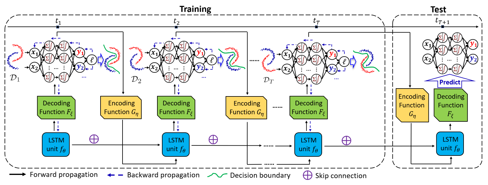

# Temporal Domain Generalization With Driftaware Dynamic Neural Networks

## 论文信息

### 作者

Guangji Bai, Chen Ling, Liang Zhao

均来自埃默里大学。

### 收录情况

ICLR2023

## 解决什么问题

概念漂移：输入与预测目标之间的关系在变化，恒定的模型无法刻画。

## 设定

- 在时间 $t_s$ 采样到 $N_s$ 个输入 $\left\{\bm{x}_{i}^{(s)} \right\}_{i=1}^{N_s}$ 和 $N_s$ 个输出 $\left\{y_{i}^{(s)} \right\}_{i=1}^{N_s}$；
- 训练集为 $\left\{\mathcal{D}_1,\ \mathcal{D}_2,\ \cdots,\ \mathcal{D}_{T} \right\}$，其中每一个数据流 $\mathcal{D}_{s} = \left\{\left(\bm{x}_{i}^{(s)},\ y_i^{(s)} \right)\in \mathcal{X}_{s}\times \mathcal{Y}_{s} \right\}_{i=1}^{N_{s}},\ s = 1,\ 2,\ \cdots,\ T$，测试集为 $\mathcal{D}_{T+1}$；
- 对于每一个数据流 $\mathcal{D}_{s}$，有不同的神经网络模型 $g_{\bm{\omega}_{s}}: \mathcal{X}_{s} \to \mathcal{Y}_{s}$ 将输入映射到输出，其中 $\bm{\omega}_{s}$ 为模型参数；
- 目标：预测测试集模型的参数 $\bm{\omega}_{T+1}$。

## 方法

在训练集中，每个时刻 $t_s$ 都可以通过最大化 $p(\bm{\omega}_{s} \mid \mathcal{D}_{s})$ 学到模型 $g_{\bm{\omega}_{s}}$，由于关系在变，$p(\bm{\omega}_{s} \mid \mathcal{D}_{s})$ 随着时间的变化也会变化。我们的目标是最大化

$$
\begin{equation}
    p(\bm{\omega}_{T+1} \mid \mathcal{D}_{1:T}) = \int_{\Omega} \underbrace{p(\bm{\omega}_{T+1} \mid \bm{\omega}_{1:T},\ \mathcal{D}_{1:T})}_{\text{inference}} \cdot \underbrace{p(\bm{\omega}_{1:T} \mid \mathcal{D}_{1:T})}_{\text{training}} ~ \mathrm{d} \bm{\omega}_{1:T}
\end{equation}
$$

假设参数 $\bm{\omega}_{s}$ 只依赖于当前和过去的数据流，$\eqref{1}$ 式可以写成

$$
\begin{equation}
    p(\bm{\omega}_{T+1} \mid \mathcal{D}_{1:T}) = p(\bm{\omega}_{1} \mid \mathcal{D}_{1}) \cdot \prod_{s=2}^{T} p(\bm{\omega}_{s} \mid \bm{\omega}_{1:s-1},\ \mathcal{D}_{1:T}) 
\end{equation}
$$

神经网络 $g_{\bm{\omega}}$ 可以看作是一个图 $G = (V,\ E,\ \psi)$，其中
- 节点 $v \in V$ 代表 $g_{\bm{\omega}}$ 中的一个神经元；
- 边 $e \in E$ 代表两个神经元之间的连接，记作 $e = (u,\ v),\ \forall u,\ v \in V$；
- 函数 $\psi: E \to \mathbb{R}$ 代表两个神经元之间的权重，即 $\bm{\omega}_{s} = \psi(E\mid s)$。

使用 LSTM 对 $\left\{\bm{\omega}_{1:s} \right\}$ 的隐分布进行建模，每个循环单元利用过去的参数 $\left\{\bm{\omega}_{i}: i<s \right\}$ 生成新的参数 $\bm{\omega}_{s}$：

