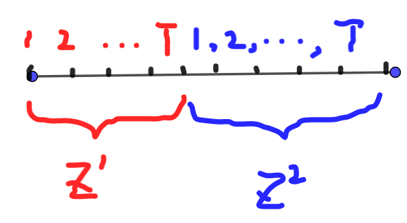

# Deep Reinforcement Learning amidst Continual Structured Non-Stationarity

### 论文信息

#### 作者

Annie Xie, James Harrison, Chelsea Finn

均来自斯坦福大学。

#### 收录情况

收录于2021PMLR。

### 解决什么问题

在标准的强化学习设定中，智能体是在一个平稳的环境（即固定的状态转移概率和奖励）下进行决策，然而实际生活中很少有符合平稳性假定的情况，状态转移概率和奖励通常是随时间变化的。本文旨在提出适用于非平稳环境的模型。

### 前置知识

#### 变分推断

见[VAE](papers/auto_encoding_variational_bayes.md#变分贝叶斯（variational-bayes）)。

#### 平稳环境下强化学习变分推断

考虑时间$t = 1,\ 2,\ \cdots,\ T$，智能体的轨迹（状态动作序列）为$(s_1,\ a_1,\ s_2,\ \cdots,\ s_{T}, a_{T})$，奖励函数为$r(s_t,\ a_t)$，定义最优变量$\mathcal{O}_t$，当在$s_t$下选择$a_t$是最优时$\mathcal{O}_t = 1$，否则为$0$。定义

$$
p(\mathcal{O}_t = 1 | s_t,\ a_t) = e^{r(s_t,\ a_t)}
$$

在这个定义下，奖励函数必须为非正的，当奖励最大，即$r(s_t,\ a_t) = 0$时最优概率为$1$。我们想要推断的后验分布为$p(s_{1:T},\ a_{1:T} | \mathcal{O}_{1:T} = 1)$。

假设动作的先验分布是均匀分布，我们有

$$
\begin{aligned}
 p(s_{1:T},\ a_{1:T},\ \mathcal{O}_{1:T} = 1) &= p(s_1) \prod_{t=1}^{T} p(\mathcal{O}_t = 1 | s_t,\ a_t) p(a_t | s_t) p(s_{t+1} | s_t,\ a_t) \\
 &= p(s_1) \prod_{t=1}^{T} e^{r(s_t,\ a_t)} p(s_{t+1} | s_t,\ a_t) \\
\end{aligned}
$$

则$\mathcal{O}_t = 1$的证据下界为

$$
\mathrm{E}_{q} \left( \log \frac{p(s_{1:T},\ a_{1:T},\ \mathcal{O}_{1:T} = 1)}{q(s_{1:T},\ a_{1:T})} \right) = \mathrm{E}_{q} \left( \log \frac{p(s_1) \prod_{t=1}^{T} e^{r(s_t,\ a_t)} p(s_{t+1} | s_t,\ a_t)}{q(s_{1:T},\ a_{1:T})} \right)
$$

为了方便估计，选取$q(s_{1:T},\ a_{1:T}) = p(s_1) \prod_{t=1}^{T} q(a_t | s_t) p(s_{t+1} | s_t,\ a_t)$，则证据下界简化为

$$
\mathrm{E}_q \left[ \log \left( \prod_{t=1}^{T} \frac{e^{r(s_t,\ a_t)}}{q(a_t | s_t)} \right) \right] = \mathrm{E}_q \left[ \sum\limits_{t=1}^{T} \left( r(s_t,\ a_t) - \log q(a_t | s_t) \right) \right] 
$$

这里的$q$其实就是强化学习中的策略$\pi$，即给定状态下决策的概率分布。则这个需要最大化的泛函可以写成

$$
\mathrm{E}_{\pi} \left[ \sum\limits_{t=1}^{T} \left( r(s_t,\ a_t) - \log \pi(a_t | s_t) \right) \right] = \sum\limits_{t=1}^{T} \mathrm{E}_{\pi} \left( r(s_t,\ a_t) \right) + \sum\limits_{t=1}^{T} \mathrm{E}_{\pi} \left( - \log \pi(a_t | s_t) \right) 
$$

第一项是标准的强化学习目标，即最大化奖励；第二项为最大化策略的信息熵，即鼓励探索。

### 非平稳环境下强化学习变分推断

#### 设定

将环境分解成两个马尔可夫过程，一个是由用来描述非平稳的潜在变量$z^{i}$组成的马尔可夫链，其中$i = 1,\ 2,\ \cdots,\ N$是不同的时间段，另一个是在每个时间段内平稳的马尔可夫决策过程。

每个时间段$i$中，定义动作序列$u^{i} = a_{1:T}^{i}$，轨迹$\tau^{i} = (s_1^{i},\ a_1^{i},\ r_1^{i},\ s_2^{i},\ a_2^{i},\ \cdots,\ r_{T}^{i})$。则后验分布$p(z^{1:N},\ \tau^{1:N} | u^{1:N})$可以写成

$$
p(z^{1:N},\ \tau^{1:N} | u^{1:N}) = p(z^{1}) p(\tau^{1} | z^{1},\ u^{1}) \prod_{i=1}^{N} p(z^{i} | z^{1:i-1}) p(\tau^{i} | z^{i},\ u^{i})
$$

其中对于每个时间段中的平稳马尔可夫决策过程，我们有

$$
p(\tau | z,\ u) = p(s_1;\ z) \prod_{t=1}^{T} e^{r(s_t,\ a_t;\ z)} p(s_{t+1} | s_t,\ a_t;\ z)
$$

在非平稳环境下，我们要推断的是过去时间段的轨迹$\tau^{1:i-1}$和当前最优变量$\mathcal{O}_{1:T}^{i} = 1$在给定动作序列下的后验分布，即$p(\tau^{1:i-1},\ \mathcal{O}_{1:T}^{i} | u^{1:i-1})$

$$
p(s_{t+1} | s_t,\ a_t)
$$