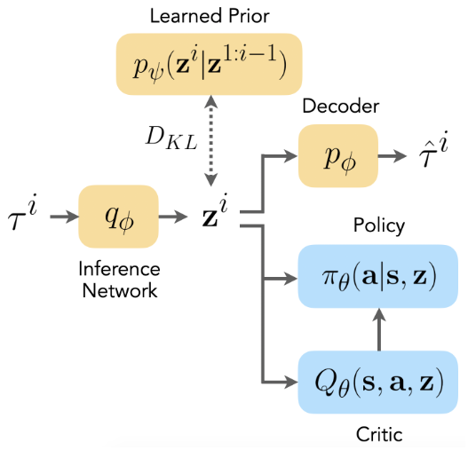
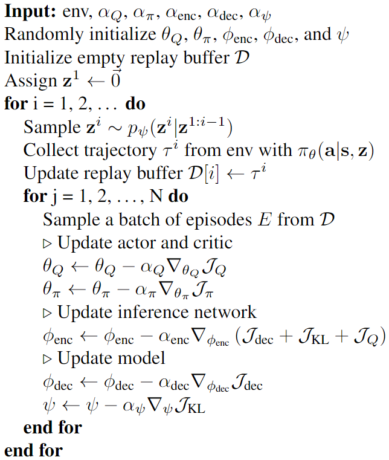
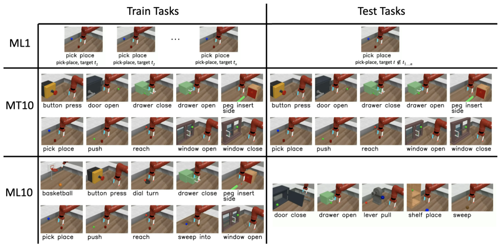
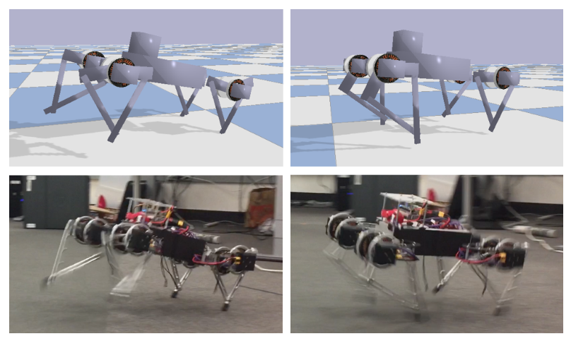
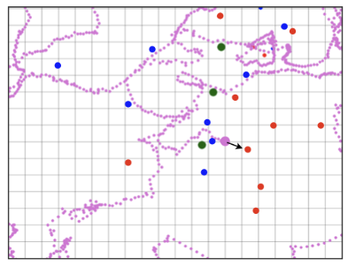
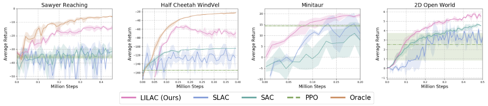
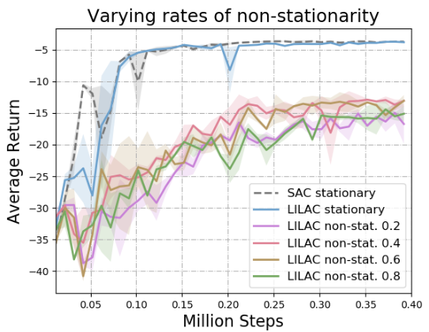

# Deep Reinforcement Learning amidst Continual Structured Non-Stationarity

### 论文信息

#### 作者

Annie Xie, James Harrison, Chelsea Finn

均来自斯坦福大学。

#### 收录情况

收录于2021PMLR。

### 解决什么问题

在标准的强化学习设定中，智能体是在一个平稳的环境（即固定的状态转移概率和奖励）下进行决策，然而实际生活中很少有符合平稳性假定的情况，状态转移概率和奖励通常是随时间变化的。本文旨在提出适用于非平稳环境的模型。

### 前置知识

#### 变分推断

见[VAE](papers/auto_encoding_variational_bayes.md#变分贝叶斯（variational-bayes）)。

#### 平稳环境下强化学习变分推断

见[用推断的眼光看待控制问题](rl/9_control_as_inference.md)。

### 非平稳环境下强化学习变分推断

#### 设定

将环境分解成两个马尔可夫过程，一个是由用来描述非平稳的隐变量 $z^{i}$ 组成的马尔可夫链，其中 $i = 1,\ 2,\ \cdots,\ N$ 是不同的时间段，另一个是在每个时间段内平稳的马尔可夫决策过程。

隐变量 $z^{i}$ 的转移概率是 $p_z \left( z^{i+1}|z^{1:i} \right) $。 每个时间段 $i$ 中，定义动作序列 $u^{i} = a_{1:T}^{i}$，轨迹 $\tau^{i} = \left( s_1^{i},\ a_1^{i},\ r_1^{i},\ s_2^{i},\ a_2^{i},\ \cdots,\ r_{T}^{i} \right) $。则我们有

$$
p\left( z^{1:N},\ \tau^{1:N} | u^{1:N} \right)  = p\left( z^{1} \right)  p\left( \tau^{1} | z^{1},\ u^{1} \right)  \prod_{i=1}^{N} p\left( z^{i} | z^{1:i-1} \right)  p\left( \tau^{i} | z^{i},\ u^{i} \right) 
$$

其中对于每个时间段 $i$ 中的平稳马尔可夫决策过程，我们有

$$
p\left( \tau^{i} | z^{i},\ u^{i} \right)  = p\left( s_{1:T}^{i},\ a_{1:T}^{i},\ r_{1:T}^{i}|z^{i},\ a_{1:T}^{i} \right)  = p\left( s_1^{i};\ z^{i} \right)  \prod_{t=1}^{T} p\left( r_t^{i},\ s_{t+1}^{i} | s_t^{i},\ a_t^{i};\ z^{i} \right) \\
s_{T+1}^{i} = s_1^{i+1}
$$

#### 变分推断

还记得在平稳环境下，我们需要最大化 $\log p(\mathcal{O}_{1:T})$ 的变分下界；而在非平稳环境下，我们既要关注当前平稳片段下是否最优，还要关注对隐变量建模的好坏程度，也即能否很好地还原轨迹，因为这关系到之后能否继续找到最优策略，所以我们要最大化的是联合先验 $p\left( \tau^{1:i-1},\ \mathcal{O}_{1:T}^{i} | u^{1:i-1} \right) $ 的变分下界。这个联合先验的对数似然可以写成两项：

$$
\log p\left( \tau^{1:i-1},\ \mathcal{O}_{1:T}^{i} | u^{1:i-1} \right) = \log \left( p\left( \mathcal{O}_{1:T}^{i}|\tau^{1:i-1} \right) p\left( \tau^{1:i-1}|u^{1:i-1} \right) \right) = \log p\left( \mathcal{O}_{1:T}^{i}|\tau^{1:i-1} \right) + \log p\left( \tau^{1:i-1}|u^{1:i-1} \right)
$$

> [!TIP|label:提示]
> 最优变量 $\mathcal{O}$ 的设定参见[用推断的眼光看待控制问题](rl/9_control_as_inference.md#最优变量的引入)。
> 
> 由于给定动作序列才能得到轨迹，联合先验需要conditioning on过去的动作。
> 
> $p\left( \mathcal{O}_{1:T}^{i}|\tau^{1:i-1},\ u^{1:i-1} \right) = p\left( \mathcal{O}_{1:T}^{i}|\tau^{1:i-1} \right)$，因为动作序列包含在轨迹当中。

对于第一项，我们有

$$
\begin{aligned}
 \log p\left( \mathcal{O}_{1:T}^{i}|\tau^{1:i-1} \right) &= \log \int p\left( \mathcal{O}_{1:T}^{i},\ z^{i}|\tau^{1:i-1} \right) ~ \mathrm{d}z^{i} \\
 &= \log \int p\left( \mathcal{O}_{1:T}^{i}|z^{i} \right) p\left( z^{i}|\tau^{1:i-1} \right) ~ \mathrm{d}z^{i} \\
 &= \log \mathrm{E}_{p\left( z^{i}|\tau^{1:i-1} \right) } \left( p\left( \mathcal{O}_{1:T}^{i}|z^{i} \right) \right)  \\
 &\geqslant \mathrm{E}_{p\left( z^{i}|\tau^{1:i-1} \right) }\left( \log p\left( \mathcal{O}_{1:T}^{i}|z^{i} \right) \right) \\
 &\geqslant \mathrm{E}_{p\left( z^{i}|\tau^{1:i-1} \right) }\left[ \mathrm{E}_{\pi\left( a_t|s_t,\ z^{i} \right) } \left( \sum\limits_{t=1}^{T} \left( r\left( s_t,\ a_t;\ z^{i} \right) - \log \pi\left( a_t|s_t,\ z^{i} \right) \right) \right) \right] \\
 &= \mathcal{L}_{\text{RL}}
\end{aligned}
$$

> [!TIP|label:提示]
> $p\left( \mathcal{O}_{1:T}^{i}|z^{i},\ \tau^{1:i-1} \right) = p\left( \mathcal{O}_{1:T}^{i}|z^{i} \right)$，因为 $\mathcal{O}_{1:T}^{i}|z^{i}$ 与 $\tau^{1:i-1}$ 独立（如果不给定隐变量是不独立的）。
> 
> 注意到期望中的 $\log p\left( \mathcal{O}_{1:T}^{i}|z^{i} \right) $ 实际上就是每个平稳过程中想要最大化的对数似然函数。

则第一项的下界实际上是最大熵强化学习要最大化的目标函数在隐变量分布下的期望。

对于第二项，我们有

$$
\begin{aligned}
 \log p\left( \tau^{1:i-1}|u^{1:i-1} \right) &= \log \int p\left( \tau^{1:i-1},\ z^{1:i-1}|u^{1:i-1} \right) ~ \mathrm{d}z^{1:i-1} \\
 &= \log \int q\left( z^{1:i-1} \right) \frac{p\left( \tau^{1:i-1}|z^{1:i-1},\ u^{1:i-1} \right) p\left( z^{1:i-1}|u^{1:i-1} \right)  }{q\left( z^{1:i-1} \right) } ~ \mathrm{d}z^{1:i-1} \\
 &= \log \mathrm{E}_{q\left( z^{1:i-1} \right) }\left( \frac{p\left( \tau^{1:i-1}|z^{1:i-1},\ u^{1:i-1} \right) p\left( z^{1:i-1} \right)  }{q\left( z^{1:i-1} \right) } \right) \\
 &\geqslant \mathrm{E}_{q\left( z^{1:i-1} \right) }\left( \log \frac{p\left( \tau^{1:i-1}|z^{1:i-1},\ u^{1:i-1} \right) p\left( z^{1:i-1} \right)  }{q\left( z^{1:i-1} \right) } \right) \\
 &= \mathrm{E}_{q\left( z^{1:i-1} \right) }\left( \log \frac{p\left( z^{1:i-1} \right)}{q\left( z^{1:i-1} \right) } + \log p\left( \tau^{1:i-1}|z^{1:i-1},\ u^{1:i-1} \right) \right) \\
 &= \mathrm{E}_{q\left( z^{1:i-1} \right) }\left( \log p\left( \tau^{1:i-1}|z^{1:i-1},\ u^{1:i-1} \right) \right) - D_{\text{KL}}\left( q\left( z^{1:i-1} \right) || p\left( z^{1:i-1} \right) \right) \\
 &= \mathcal{L}_{\text{rep}}
\end{aligned}
$$

这个最大化的目标跟VAE（Kingma & Welling，2014）是相同的，即最小化KL正则下的重构误差。按照设定，我们还可以继续写成

$$
\begin{aligned}
 \log p\left( \tau^{1:i-1}|u^{1:i-1} \right) &= \mathrm{E}_{q\left( z^{1:i-1} \right) }\left( \log p\left( \tau^{1:i-1}|z^{1:i-1},\ u^{1:i-1} \right) \right) - D_{\text{KL}}\left( q\left( z^{1:i-1} \right) || p\left( z^{1:i-1} \right) \right) \\
 &= \mathrm{E}_{q\left( z^{1:i-1} \right) }\left(\sum\limits_{j=1}^{i} \sum\limits_{t=1}^{T} \log p\left( s_{t+1}^{j},\ r_t^{j}|s_t^{j},\ a_t^{j},\ z^{j} \right) \right) - \sum\limits_{j=1}^{i} D_{\text{KL}}\left( q\left( z^{j}|\tau^{j} \right) || p\left( z^{j}|z^{1:j-1} \right) \right) \\
\end{aligned}
$$

最终整个目标函数可以写成

$$
\begin{aligned}
 \mathcal{L} &= \mathcal{L}_{\text{RL}} + \mathcal{L}_{\text{rep}} \\
 &= \mathrm{E}_{p\left( z^{i}|\tau^{1:i-1} \right) }\left[ \mathrm{E}_{\pi\left( a_t|s_t,\ z^{i} \right) } \left( \sum\limits_{t=1}^{T} \left( r\left( s_t,\ a_t;\ z^{i} \right) - \log \pi\left( a_t|s_t,\ z^{i} \right) \right) \right) \right] \\ &\qquad + \mathrm{E}_{q\left( z^{1:i-1} \right) }\left(\sum\limits_{j=1}^{i} \sum\limits_{t=1}^{T} \log p\left( s_{t+1}^{j},\ r_t^{j}|s_t^{j},\ a_t^{j},\ z^{j} \right) \right) - \sum\limits_{j=1}^{i} D_{\text{KL}}\left( q\left( z^{j}|\tau^{j} \right) || p\left( z^{j}|z^{1:j-1} \right) \right)
\end{aligned}
$$

#### 网络结构与优化算法

网络结构

参照上图，我们首先从编码器 $q_{\phi}\left( z^{i}|\tau^{i} \right) $ 中用VAE的重参数化得到 $z^{i}$，输进LSTM得到 $z^{i+1}$，从LSTM得到的先验 $z^{i+1}$ 会在下一个循环中与编码器得到的后验 $z^{i+1}$ 进行KL正则项的计算，而 $z^{i}$ 经过解码器 $p_{\phi}$ 后得到重构的轨迹 $\hat{\tau}^{i}$，即得到重构误差项；策略网络在 $z^{i}$ 下得到一串轨迹 $\tau^{i}$ 并存入replay buffer，而前面编码器用到的输入 $\tau^{i}$ 就来自于这个replay buffer；由于使用SAC（Soft Actor-Critic）算法来优化 $\mathcal{L}_{\text{RL}}$，我们还需要一个评价网络，这个网络中隐变量也是变量，而不是像策略网络中是given的，因此编码器在更新参数的时候需要加上评价网络计算出的误差。具体算法流程如下：

算法流程

### 实验

1. 机械臂完成不同的随机任务，包括开门、拉开抽屉、抓取物体等，机械臂并不能提前知道自己要完成什么任务，也不能提前知道目标的位置；

Sawyer Reaching

2. 一个具有8个节点和9个连接的“猎豹”试图学会奔跑，环境中风速和方向会变化，目标奔跑速度也会改变；

Half Cheetah WindVel

3. 训练机器人的发动机和腿让它跑得越快越好，负重会随时间改变；

Minitaur

4. 智能体在2D的无尽世界中绕过障碍收集小球，其中会有未知的随机扰动。

2D Open World

我们对比了SAC、SLAC（对隐变量建模但没有解决非平稳问题）、PPO（Proximal Policy Optimization）的效果，针对前两个实验，在告诉机器人目标（位置或速度）的情况下，用SAC训练，作为Oracle进行比较。结果如下：

实验结果1

可以发现我们的算法是全面占优的，在前两个任务中已经逼近Oracle。

接着针对第一个实验，我们又测试了在不同非平稳变化程度下（目标旋转不同弧度）的效果：

实验结果2

可以看到变化程度对我们的模型并没有太大影响。在平稳环境下，我们的模型和SAC基本趋同。

### 参考文献

Xie, A., Harrison, J., & Finn, C. (2021). Deep Reinforcement Learning amidst Continual Structured Non-Stationarity. Proceedings of the 38th International Conference on Machine Learning, 139, 11393–11403.

Kingma, D. P., & Welling, M. (2014). Auto-Encoding Variational Bayes (arXiv:1312.6114). arXiv. http://arxiv.org/abs/1312.6114
