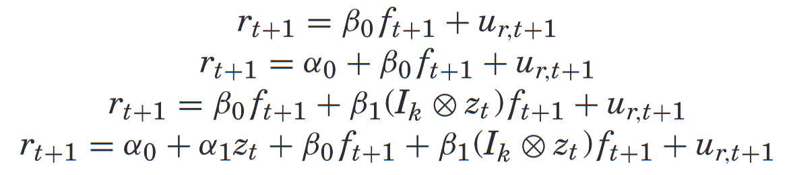
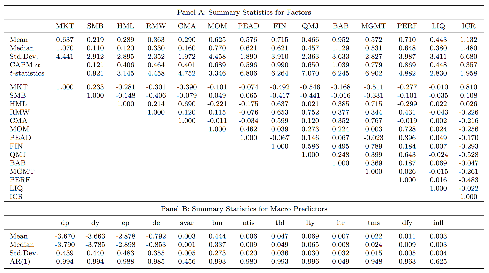

# Integrating Factor Models

## 论文信息

### 作者

Doron Avramov, Si Cheng, Lior Metzker, and Stefan Voigt

Avramov 和 Metzker 都在以色列，前者是 Reichman University 的教授，后者来自耶路撒冷希伯来大学；程斯是雪城大学的副教授，Voigt 是哥本哈根大学的长聘助理教授。

### 收录情况

JF2023

## 解决什么问题

在因子动物园设定下，哪些因子更重要。

> However, the collection of factors that matter most remains subject to research controversy.

## 摘要

通常使用贝叶斯方法会考虑因子的不确定性，即正确的因子模型中应当包含什么因子。而这篇文章不仅考虑了因子的不确定性，还考虑了因子模型框架的不确定性，即是否存在 α，α 和 β 是否与宏观变量相关。

> This paper develops a comprehensive framework to address uncertainty about the correct factor model.

这篇文章的定价模型是将不同的因子模型（不同框架或不同因子）通过后验概率加权得到。

> Asset pricing inferences draw on a composite model that integrates over competing factor models weighted by posterior probabilities.

实证表明：

1. Unconditional 的模型后验权重几乎为 0；
2. 盈余公告漂移（Post-Earnings Announcement Drift，PEAD）、质量因子（Quality-Minus-Junk，QMJ）、中介收益因子（Intermediary Capital，ICR）是 conditional 模型中后验概率较高的因子；
3. 本文的 integrated 模型在样本外也表现得很好，成功排除了在样本外表现不好的因子。

> [!TIP|label:提示]
> PEAD 在 *Bayesian Solutions for the Factor Zoo*（Bryzgalova 等，2023）中也是后验概率最高的因子。
>
> 质量因子中的“质量”其实包括三个维度：盈利性、成长性和安全性，每个维度都由不同的公司特征构成。这个因子相当于一个因子集合体，表现好似乎是应该的？
>
> 中介收益因子中的“中介”用美联储指定的 primary dealer 来做代理，primary dealer 是美联储的交易对手，在货币政策中扮演重要角色。

> Evidence shows that unconditional models record near-zero probabilities, while postearnings announcement drift, quality-minus-junk, and intermediary capital are potent factors in conditional asset pricing. Out-of-sample, the integrated model performs well, tilting away from subsequently underperforming factors.

本文还研究了模型的不确定性与预测分歧对定价的影响：

1. 模型的不确定性让股票的风险变大；
2. 模型对期望收益率的预测分歧在市场崩盘的时期激增；
3. 预测分歧张成了所有收益率的成分，包括：错误定价、因子载荷、风险溢价。

## 模型的不确定性

模型的不确定性包括：

1. 哪些因子才应该被包含进模型？
2. 哪些宏观变量应该用来择时？
3. 是否应该允许定价误差的存在（模型包不包含 α）？

> However, the collection of factors that matter most remains subject to research controversy. Significant uncertainty also extends to the choice of macro variables that potentially govern time-varying investment opportunities. Moreover, even if the econometrician has prior information about the identity of asset pricing factors and macro predictors, there is still uncertainty about whether the underlying model holds exactly or instead admits the possibility of mispricing.

贝叶斯的方法可以很好地解决不确定的问题。

### 定价模型

本文的定价模型设定如下：

$$
\begin{equation}
    \bm{r}_{t+1} = \bm{\alpha}(\bm{z}_t) + \bm{\beta}(\bm{z}_t) \bm{f}_{\! t+1} + \bm{u}_{r,\ t+1} \label{1}
\end{equation}
$$

其中 $\bm{r}_{t+1}$ 是 $t+1$ 时刻 $N$ 个股票的超额收益率向量，$K \times 1$ 的因子向量 $\bm{f}_{\! t+1}$ 则可以通过 $M \times 1$ 的宏观变量 $\bm{z}_t$ 来预测：

$$
\begin{equation}
    \bm{f}_{\! t+1} = \bm{\alpha}_f + \bm{a}_F \bm{z}_t + \bm{u}_{f,\ t+1}
\end{equation}
$$

其中残差 $\bm{u}_{r,\ t+1}$ 和 $\bm{u}_{f,\ t+1}$ 是正交的，且都服从均值为 0 的多元正态分布：

$$
\bm{u}_{r,\ t+1} \sim \mathcal{N}(\bm{0},\ \bm{\Sigma}_{RR}),\qquad \bm{u}_{f,\ t+1} \sim \mathcal{N}(\bm{0},\ \bm{\Sigma}_{FF})
$$

$\eqref{1}$ 式中的 $\bm{\alpha}$ 和 $\bm{\beta}$ 都是与宏观变量 $\bm{z}_{t}$ 有关的，本文假设的是线性关系：

$$
\begin{equation}
    \begin{split}
        \bm{\alpha}(\bm{z}_{t}) &= \bm{\alpha}_{0} + \bm{\alpha}_{1} \bm{z}_{t} \\
        \bm{\beta}(\bm{z}_{t}) &= \bm{\beta}_{0} + \bm{\beta}_{1} (\bm{I}_{\! K} \otimes \bm{z}_{t}) \\
    \end{split} \label{3}
\end{equation}
$$

其中 $\bm{I}_{\! K}$ 是 $K \times K$ 的单位矩阵，$\otimes$ 代表 Kronecker 积，乘完后 $\bm{I}_{\! K} \otimes \bm{z}_{t}$ 是 $KM \times K$ 的矩阵。

> [!TIP|label:Kronecker积]
> $\bm{X} \otimes \bm{Y}$ 得到的矩阵是 $(X_{ij} \bm{Y})$，即 $\bm{X}$ 中每一个元素都与 $\bm{Y}$ 相乘。

将 $\eqref{3}$ 式代入 $\eqref{1}$ 式，定价模型就变成了

$$
\begin{equation}
    \bm{r}_{t+1} = \bm{\alpha}_{0} + \bm{\alpha}_{1} \bm{z}_{t} + \bm{\beta}_{0} \bm{f}_{\! t+1} + \bm{\beta}_{1} (\bm{I}_{\! K} \otimes \bm{z}_{t}) \bm{f}_{\! t+1} + \bm{u}_{r,\ t+1} \label{4}
\end{equation}
$$

其中 $\bm{\alpha}_{0}$ 代表了时不变的错误定价，$\bm{\alpha}_{1}$ 则代表了随宏观状态变化的错误定价；$\bm{\beta}_{0}$ 代表了时不变的 β，而 $\bm{\beta}_{1}$ 则代表随宏观状态变化的 β。

### 模型框架的不确定性

对 $\bm{\alpha}(\bm{z}_{t}),\ \bm{\beta}(\bm{z}_{t}),\ \bm{a}_{F}$ 有不同限制就产生了不同的模型**框架**：

- Unconditional：$\bm{\alpha}_{1} = 0$，$\bm{\beta}_{1} = 0$，$\bm{a}_{F} = 0$（α、β 和因子的风险溢价都是时不变的）
    - $\mathbb{M}_{1}$：$\bm{\alpha}_{0} = 0$（不存在错误定价）

        $$
        \begin{aligned}
            \bm{r}_{t+1} &= \bm{\beta}_{0} \bm{f}_{\! t+1} + \bm{u}_{r,\ t+1} \\
            \bm{f}_{\! t+1} &= \bm{\alpha}_f + \bm{u}_{f,\ t+1}
        \end{aligned}
        $$

    - $\mathbb{M}_{2}$：$\bm{\alpha}_{0} = 0$（允许错误定价）

        $$
        \begin{aligned}
            \bm{r}_{t+1} &= \bm{\alpha}_{0} + \bm{\beta}_{0} \bm{f}_{\! t+1} + \bm{u}_{r,\ t+1} \\
            \bm{f}_{\! t+1} &= \bm{\alpha}_f + \bm{u}_{f,\ t+1}
        \end{aligned}
        $$

- Conditional：$\bm{\alpha}_{1} \neq 0$，$\bm{\beta}_{1} \neq 0$，$\bm{a}_{F} \neq 0$（α、β 和因子的风险溢价都是时变的）
    - $\mathbb{M}_{3}$：$\bm{\alpha}_{0} = \bm{\alpha}_{1} = 0$（不存在错误定价）

        $$
        \begin{aligned}
            \bm{r}_{t+1} &= \bm{\beta}_{0} \bm{f}_{\! t+1} + \bm{\beta}_{1} (\bm{I}_{\! K} \otimes \bm{z}_{t}) \bm{f}_{\! t+1} + \bm{u}_{r,\ t+1} \\
            \bm{f}_{\! t+1} &= \bm{\alpha}_f + \bm{a}_{F} \bm{z}_{t} + \bm{u}_{f,\ t+1}
        \end{aligned}
        $$

    - $\mathbb{M}_{4}$：$\bm{\alpha}_{0} \neq 0$（允许错误定价）

        $$
        \begin{aligned}
            \bm{r}_{t+1} &= \bm{\alpha}_{0} + \bm{\alpha}_{1} \bm{z}_{t} + \bm{\beta}_{0} \bm{f}_{\! t+1} + \bm{\beta}_{1} (\bm{I}_{\! K} \otimes \bm{z}_{t}) \bm{f}_{\! t+1} + \bm{u}_{r,\ t+1} \\
            \bm{f}_{\! t+1} &= \bm{\alpha}_f + \bm{a}_{F} \bm{z}_{t} + \bm{u}_{f,\ t+1}
        \end{aligned}
        $$

### BMA（Bayesian Model Averaging）

基于不同的模型（包括不同的模型框架和不同的因子选择），BMA（Bayesian Model Averaging）给出的期望收益率预测可以写成

$$
\begin{equation}
    \E[\bm{r}_{t+1} \mid D] = \sum\limits_{l=1}^{L} P(\mathcal{M}_{l} \mid D) \E[\bm{r}_{t+1} \mid \mathcal{M}_{l},\ D]
\end{equation}
$$

其中 $D$ 代表可观测的数据（包括 $N$ 个 test assets、$K$ 个因子、$M$ 个宏观变量，时间长度为 $T$ 的面板数据），$\mathcal{M}_{l}$ 代表某一个模型，总共有 $L$ 个模型，$P(\mathcal{M}_{l} \mid D)$ 代表模型 $\mathcal{M}_{l}$ 的后验概率。

> [!NOTE|label:注意]
> 本文设定每个模型都包含市场因子，$K$ 代表最多有 $K$ 个因子，当某个模型 $\mathcal{M}_{l}$ 选择了 $k$ 个因子（$1 \leqslant k < K$），剩余的 $K - k$ 个“冗余”因子会被加入 test assets。

### 模型预测分歧带来的方差收缩

本文除了关注期望收益率的预测，还关注收益率的协方差矩阵：

$$
\begin{equation}
    \Var[\bm{r}_{t+1} \mid D] = \underbrace{\E[\Var[\bm{r}_{t+1} \mid \mathcal{M}_{l},\ D]]}_{\bm{V}_{\! t}} + \underbrace{\Var[\E[\bm{r}_{t+1} \mid \mathcal{M}_{l},\ D]]}_{\bm{\Omega}_{t}} \label{6}
\end{equation}
$$

其中 $\bm{V}_{\! t}$ 是不同模型得到的协方差矩阵的后验均值，而 $\bm{\Omega}_{t}$ 则是不同模型得到的期望收益率之间的协方差，即反映了模型预测分歧带来的波动。

> [!TIP|label:提示]
> $\eqref{6}$ 式成立是因为**方差等于条件方差的期望 + 条件期望的方差**。

如果我们限制 $\bm{\Omega}_{t}$ 是对角阵，则 $\Var[\bm{r}_{t+1} \mid D]$ 可以很容易做到可逆（即使 $\bm{V}_{\! t}$ 不可逆），且在这个条件下 $\bm{\Omega}_{t}$ 跟岭回归的正则项很相似，相当于对协方差的后验均值做了 asset-specific 的收缩，收缩的比例取决于模型对这个 test asset 的预测分歧。

> the posterior predictive variance imposes asset-specific shrinkage toward the grand mean, $\bm{V}_{\! t}$, in proportion to the general agreement among candidate models about mean returns.

> [!TIP|label:提示]
> 频率派通常只考虑一个模型 $\mathcal{M}$，它们的预测协方差为 $\Var[r_{t+1} \mid \mathcal{M},\ D] = \bm{\tilde{V}}_{\! t}$，如果做岭回归则为 $\Var[r_{t+1} \mid \mathcal{M},\ D] = \bm{\tilde{V}}_{\! t} + \gamma \bm{I}_{\! N}$。

### 后验概率求解

#### 贝叶斯公式

记模型参数为 $\theta$，似然函数为 $\mathcal{L}(D \mid \theta,\ \mathcal{M})$，参数的先验为 $\pi(\theta \mid \mathcal{M})$，则边际似然为

$$
\begin{align}
    m(D \mid \mathcal{M}) &= \int_{\theta} \mathcal{L}(D \mid \theta,\ \mathcal{M}) \pi(\theta \mid \mathcal{M}) ~ \mathrm{d}\theta \notag \\
    &= \frac{\mathcal{L}(D \mid \theta,\ \mathcal{M}) \pi(\theta \mid \mathcal{M})}{\pi(\theta \mid D,\ \mathcal{M})}
\end{align}
$$

> [!TIP|label:提示]
> 似然、先验、后验，本质上都是概率，只是换了个专有名词而已，可以把对应的符号都想成概率 $p$。
>
> $\eqref{7}$ 式成立是因为
> 
> $$m(D \mid \mathcal{M}) \pi(\theta \mid D,\ \mathcal{M}) = p(D,\ \theta \mid \mathcal{M}) = \mathcal{L}(D \mid \theta,\ \mathcal{M}) \pi(\theta \mid \mathcal{M})$$

而模型 $\mathcal{M}$ 的后验概率为

$$
\begin{equation}
    P(\mathcal{M} \mid D) = \frac{p(\mathcal{M},\ D)}{p(D)} = \frac{m(D \mid \mathcal{M}) P(\mathcal{M})}{\sum_{l=1}^{L} m(D \mid \mathcal{M}_{l}) P(\mathcal{M}_{l})} \label{8} \\
\end{equation}
$$

其中 $P(\mathcal{M}_{l})$ 为模型 $\mathcal{M}_{l}$ 的先验概率。在没有其他信息的情况下，本文令每个模型的先验概率相同，接下来的问题就是如何计算边际似然。

#### 经验贝叶斯

经验贝叶斯是根据历史数据建立先验的贝叶斯方法。

作者假设在长度为 $T_0$ 的先验样本中，各变量（$\bm{r},\ \bm{f},\ \bm{z}$）自身的期望和协方差矩阵分别等于样本均值和样本协方差，且 $\bm{r}$ 与 $\bm{f}$ 之间的协方差矩阵也等于它们的样本协方差。在这个假设下，对历史数据做 $\eqref{4}$ 式的回归，会得到 $\bm{\widehat{\alpha}}_{0} = \bm{\widehat{\alpha}}_{1} = \bm{\widehat{\beta}}_{1} = 0$。也就是说，本文的先验为：$\bm{\alpha}_{0},\ \bm{\alpha}_{1},\ \bm{\beta}_{1}$ 都在 0 左右徘徊。随着样本长度 $T_0$ 的增加，这个先验还会更紧，也就是这些变量收缩到 0 的力度会更大。

> 为什么？

> The prior distribution is based on a hypothetical sample of length $T_0$. In that sample, the means and the covariance matrices of stock returns, factors, and predictors are set equal to the actual sample counterparts given by ... The prior sample is also weighted against predictability by macro variables and against mispricing. Thus, on the basis of equation $\eqref{4}$, regressing $\bm{r}_{t}$ on a constant term, $\bm{z}_{t-1}$, $\bm{f}_{t}$, and the interaction terms $\bm{f}_{t} \otimes \bm{z}_{t-1}$ yields zero estimates for $\bm{\alpha}_{0}$, $\bm{\alpha}_{1}$,and $\bm{\beta}_{1}$ in the prior sample. Hence, the prior densities of $\bm{\alpha}_{0}$, $\bm{\alpha}_{1}$,and $\bm{\beta}_{1}$ are centered around zero.

根据这一先验可以计算出不同框架下的边际似然，这里以包含最多变量的 $\mathbb{M}_{4}$ 为例：

$$
\begin{equation}
    \begin{split}
        & m\left(D \mid \mathbb{M}_4\right)=\pi^{-\frac{1}{2} T(N+K)} \times\left[\frac{T_0}{T^*}\right]^{\frac{1}{2}(N+K-k)\left(T_0+k\right)+\frac{1}{2} k(m+1)} \times\left[\frac{T}{T^*}\right]^{\frac{1}{2}(N+K-k) T} \times \\
        & {\left[\frac{\Gamma_{N+K-k}\left(\frac{1}{2}\left[T^*-(k+1) m-1\right]\right)}{\Gamma_{N+K-k}\left(\frac{1}{2}\left[T_0-(k+1) m-1\right]\right)}\right]\left[\frac{\Gamma_k\left(\frac{1}{2}\left[T^*+N+K-k-m-1\right]\right)}{\Gamma_k\left(\frac{1}{2}\left[T_0+N+K-k-m-1\right]\right)}\right] \times} \\
        & {\left[\frac{\left|R^{\prime} R-R^{\prime} F\left(F^{\prime} F\right)^{-1} F^{\prime} R\right|^{\frac{1}{2}\left(T_0-(k+1) m-1\right)}}{\left|R^{\prime} R-\tilde{\Phi}^{\prime} W^{\prime} W \tilde{\Phi}\right|^{\frac{1}{2}\left(T^*-(k+1) m-1\right)}}\right]\left[\frac{\left|T_0 \hat{V}_f\right|^{\frac{1}{2}\left(T_0+N+K-k-m-1\right)}}{\left|S_F\right|^{\frac{1}{2}\left(T^*+N+K-k-m-1\right)}}\right]}
        \label{9} \\
    \end{split}
\end{equation}
$$

不用管这些字母是什么，我们只需要知道，最后两项，也就是第二行和第三行，反映了截面的拟合效果（拟合得越好边际似然越大）；而第一行的其他项反映的是模型复杂度带来的惩罚（因子或宏观变量越多边际似然越小）。因此这个边际似然反映了拟合效果与模型复杂度之间的 trade-off。

#### 确定先验样本长度

要用上面的经验贝叶斯计算边际似然，我们还需要确定用多长的历史数据（$T_0$）。

根据[上面](#经验贝叶斯)的先验，我们可以得到定价误差的方差为

$$
\begin{equation}
    \Var(\bm{\alpha}(\bm{z}_t) \mid \bm{\Sigma}_{RR},\ D) = \frac{\bm{\Sigma}_{RR}}{T_0} (1 + m) (1 + \text{SR}_{\text{max}}^{2}) \label{10}
\end{equation}
$$

其中 $m$ 是选择的宏观变量个数（$0 < m < M$），$\text{SR}_{\text{max}}^{2} = \bm{\overline{f}}^{\top} \bm{\widehat{V}}_{\! f}^{-1} \bm{\overline{f}}$ 代表用所有因子构建的切点组合的夏普比，即最大夏普比。

> 具体推导见论文。

接下来作者想找到一个 $T_0$ 来让 $\bm{\alpha}$ 的先验与前人的工作 &mdash; *Comparing Asset Pricing Models*（Barillas 和 Shanken，2018，以下简称 BS2018）相匹配。BS2018 的 $\bm{\alpha}$ 先验为

$$
\begin{equation}
    \bm{\alpha} \mid \bm{\Sigma}_{RR},\ D \sim \mathcal{N}(0,\ \eta \bm{\Sigma}_{RR}) \label{11}
\end{equation}
$$

其中 $\eta > 0$ 控制先验的扩散程度（趋于 0 代表坚定认为没有 α，趋于无穷则相当于均匀分布）。

在 BS2018 的先验下，我们有

$$
\begin{align}
    &\bm{\alpha}^{\top} (\eta \bm{\Sigma}_{RR})^{-1} \bm{\alpha} \sim \chi^{2}(N + K - k) \notag \\
    {} \notag\\
    \implies& \E[\bm{\alpha}^{\top} \bm{\Sigma}_{RR}^{-1} \bm{\alpha}] = \eta(N + K - k) \label{12}
\end{align}
$$

$\bm{\alpha}^{\top} \bm{\Sigma}_{RR}^{-1} \bm{\alpha}$ 实际上是最大夏普比平方与因子夏普比平方的差（省略期望）：

$$
\bm{\alpha}^{\top} \bm{\Sigma}_{RR}^{-1} \bm{\alpha} = \text{SR}^{2}(R,\ F) - \text{SR}^{2}(F)
$$

在本文设定中，由于每个模型选中了 $k$ 个因子后，剩余的 $K - k$ 个“冗余”因子会被归到 test assets 里，所以最大夏普比 $\text{SR}(R,\ F) = \text{SR}_{\text{max}}$ 都是一样的，不一样的是第二项。又因为本文设定所有模型都包含市场因子，最小的 $\text{SR}(F)$ 为 $\text{SR}(\text{Mkt})$，记最大夏普比 $\text{SR}_{\text{max}} = \tau \text{SR}(\text{Mkt})$，比如 $\tau = 1.5$ 就代表我们先验的认为最大夏普比是市场组合夏普比的 $1.5$ 倍。

则 $\eqref{12}$ 式又可以写成

$$
\begin{align}
    \E[\bm{\alpha}^{\top} \bm{\Sigma}_{RR}^{-1} \bm{\alpha}] =& \eta(N + K - k) = (\tau^{2} - 1) \text{SR}^{2}(\text{Mkt}) \notag \\
    {} \notag \\
    \implies& \eta = \frac{(\tau^{2} - 1) \text{SR}^{2}(\text{Mkt})}{N + K - k}
\end{align}
$$

令 $\eqref{10}$ 式与 $\eqref{11}$ 式中的方差相等，我们有

$$
\begin{align}
    \frac{\bm{\Sigma}_{RR}}{T_0} (1 + m) (1 + \text{SR}_{\text{max}}^{2}) &= \frac{(\tau^{2} - 1) \text{SR}^{2}(\text{Mkt})}{N + K - k} \bm{\Sigma}_{RR} \notag \\
    T_0 &= \frac{(N + K - k) (1 + m) (1 + \text{SR}_{\text{max}}^{2})}{(\tau^{2} - 1) \text{SR}^{2}(\text{Mkt})} \label{14} \\
\end{align}
$$

从 $\eqref{14}$ 式可以看出，$T_0$ 与 $m$ 是正相关的，即选择更多的宏观变量就需要更长的先验样本，而在[前面](#经验贝叶斯)我们提过，$T_0$ 越大，先验就越紧，这就说明选择更多的宏观变量会导致时变 α 和 β &mdash; $\bm{\alpha}_{1},\ \bm{\beta}_1$ 收缩到 0 的力度更大（防过拟合）。如果我们设定更高的最大夏普比，即增大 $\tau$，$T_0$ 也会变大，即错误定价 $\bm{\alpha}_{0}$ 和 $\bm{\alpha}_{1}$ 收缩到 0 的力度变大。这跟 $\eqref{9}$ 式的边际似然所体现的 trade-off 有异曲同工之妙，根据 $\eqref{8}$ 式，后验概率正比于边际似然和先验概率，因此最终我们会倾向于给与 CAPM 相似的模型更高的后验概率。

> 这里还没完全看懂。

> The resulting prior is sound. First, it is informed for the comprehensive parameter space. Moreover, model pricing ability can improve as more predictors are included. Hence, the prior is more strongly weighted against time-varying parameters because $T_0$ and $m$ are positively related. Likewise, when the admissible squared Sharpe ratio increases, the prior is more strongly weighted against mispricing. Recall also from the marginal likelihood expressions that including more factors beyond the market or including more predictors leads to a higher penalty. Thus, the posterior probability is weighted against deviations from the unconditional CAPM.

## 实验

### 数据

*Which Alpha?*（Barillas 和 Shanken，2017）认为 test assets 的选取与模型的比较无关，因此作者没有选取除了因子以外的任何 test assets，即 $N = 0$。

> Our choice of test assets draws on Barillas and Shanken (2017), who suggest that the set of test assets is irrelevant for model comparison, that is, whether each model can price the factors in another model. Instead, only factor returns are required to conduct a relative test of model performance.

因子的选取包括：

- 老牌因子：FF5（MKT、SMB、HML、RMW、CMA）、动量（MOM）
- 行为因子：盈余公告漂移（PEAD）、融资因子（FIN）
- 其他因子：质量因子（QMJ）、BAB（Betting Against Beta）、管理引起的错误定价（MGMT）、表现因子（PERF）、流动性（LIQ）、中介收益因子（ICR）

共 14 个。

宏观变量的选取包括：

- 大盘：
    - 标普500：Dividend Price Ratio（dp）、Dividend Yield（dy）、Earnings Price Ratio（ep）、Dividend Payout Ratio（de）、Stock Variance（svar，成分股日收益率平方和）
    - 道琼斯工业指数：Book-to-market Ratio（bm）
    - NYSE：Net Equity Expansion（ntis，净发行量除市值）
- 债券：Treasury Bills（tbl）、Long Term Yield（lty）、Long Term Rate of Returns（ltr）、Term Spread（tms）、Default Yield Spread（dfy）
- 其他：Inflation（infl）

共 13 个。

样本从 1977 年 6 月到 2016 年 12 月，共 475 个月。样本的 summary 如下：

### 实证

## 参考文献

Asness, C. S., Frazzini, A., & Pedersen, L. H. (2019). Quality minus junk. Review of Accounting Studies, 24(1), 34–112. https://doi.org/10.1007/s11142-018-9470-2

Avramov, D., Cheng, S., Metzker, L., & Voigt, S. (2023). Integrating Factor Models. The Journal of Finance, 78(3), 1593–1646. https://doi.org/10.1111/jofi.13226

Barillas, F., & Shanken, J. (2017). Which Alpha? The Review of Financial Studies, 30(4), 1316–1338. https://doi.org/10.1093/rfs/hhw101

Barillas, F., & Shanken, J. (2018). Comparing Asset Pricing Models. The Journal of Finance, 73(2), 715–754. https://doi.org/10.1111/jofi.12607

Daniel, K., Hirshleifer, D., & Sun, L. (2020). Short- and Long-Horizon Behavioral Factors. The Review of Financial Studies, 33(4), 1673–1736. https://doi.org/10.1093/rfs/hhz069

He, Z., Kelly, B., & Manela, A. (2017). Intermediary asset pricing: New evidence from many asset classes. Journal of Financial Economics, 126(1), 1–35. https://doi.org/10.1016/j.jfineco.2017.08.002
