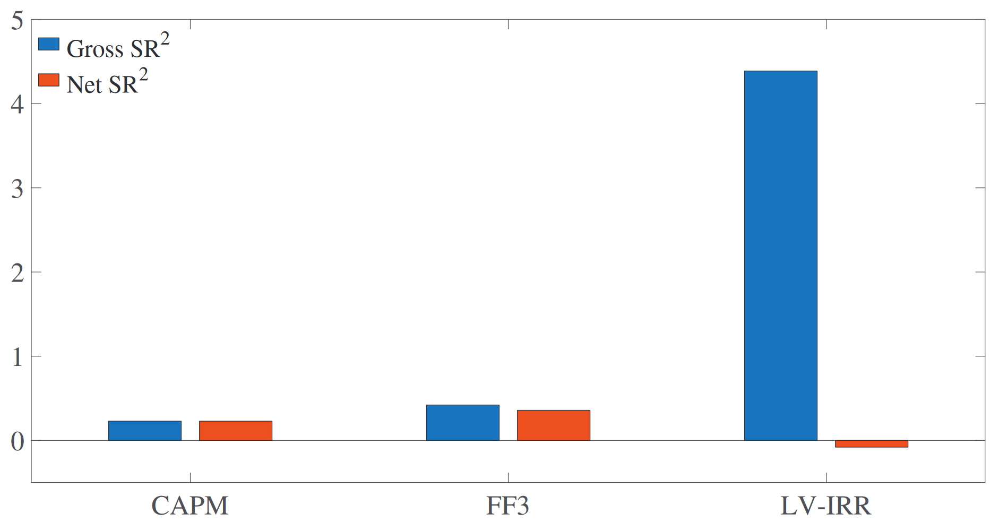

# Model Comparison with Transaction Costs

## 论文信息

### 作者

Andrew Detzel, Robert Novy-Marx, and Mihail Velikov

Detzel 是贝勒大学的副教授；Novy-Marx 是罗切斯特大学的 distinguished professor，2012 和 2013 年连续两年拿了 JFE 的 best asset pricing paper，且都是 single author，其中 *The other side of value*（Novy-Marx，2013）目前引用量 2,500 左右，不少人拿他的数据来做 test assets 或者 benchmark；Velikov 是宾夕法尼亚州立大学（Penn State）的助理教授，和 Novy-Marx 一起发了不少文章。

### 收录情况

JF2023

从 2019 年开始就持续有 present，2023 年才发出来。

## 解决什么问题

过去比较定价模型的时候都没有考虑交易成本，高成本的因子（模型）会有天然的优势，这对低成本的因子（模型）是不公平的。

## 摘要

比较定价模型的时候应当考虑交易成本，否则高成本的因子（模型）会有优势。

> Failing to account for transaction costs materially impacts inferences drawn when evaluating asset pricing models, biasing tests in favor of those employing high-cost factors.

在不考虑交易成本的情况下，HXZ 的 q-factor（2015）和 BS 的六因子（2018）都可以达到很高的夏普比，且能解释 205 个异象。但他们都不能张成可行的有效前沿。

> Ignoring transaction costs, Hou, Xue, and Zhang (2015, *Review of Financial Studies*, 28, 650–705) q-factor model and Barillas and Shanken (2018, *The Journal of Finance*, 73, 715–754) six-factor models have high maximum squared Sharpe ratios and small alphas across 205 anomalies. They do not, however, come close to spanning the achievable mean-variance efficient frontier.

考虑了交易成本后，FF 五因子（Fama 和 French，2015）的夏普比是最高的。

> Accounting for transaction costs, the Fama and French (2015, Journal of Financial Economics, 116, 1–22; 2018, Journal of Financial Economics, 128, 234–252) five-factor model has a significantly higher squared Sharpe ratio than either of these alternative models, while variations employing cash profitability perform better still.

## 理论支撑

因子（模型）的定价能力最终应该反映在它张成的有效前沿离真实的有多近。

> A model’s ability to price assets ultimately reflects how close its factors come to spanning the efficient frontier.

如果一个 test asset 无法被因子（模型）定价，即可以产生 α，那么加入这个 test asset 可以提高最大夏普比。

> If a test asset generates abnormal returns relative to a model, then that asset improves the investment opportunity set.

线性因子模型的理论基础 &mdash; APT 的基本思想是，如果一个投资机会可以套利（α），那么套利者会通过交易将其（α）消除。但套利者只会关注能抹平成本的套利，如果入不敷出，套利者不会去交易，这个所谓的“套利机会”也就一直存在。

> The theoretical underpinning of linear factor models, Ross’s (1976) Arbitrage Pricing Theory, is based on the idea that investment opportunities that generate abnormal returns attract arbitrage capital until they are eliminated. These opportunities only attract arbitrage capital in practice, however, if they generate abnormal returns net of costs.

因此最优的因子（模型）应当要能张成可行的有效前沿，可以囊括所有真实有效的投资机会，而且因子数量越少越好（模型越简单越好，要对模型复杂度做惩罚）。

> the best models are those that parsimoniously span the achievable efficient frontier, fully describing the true investment opportunity set as simply as possible.

### 例子

近几年用的比较多的模型比较方法是 *Which Alpha?*（Barillas 和 Shanken，2017）中的最大夏普比平方。一个基于行业的短期反转因子 LV-IRR，得到的最大夏普比平方（4.39）是 FF 三因子（Fama 和 French, 1993）（0.42）的 9 倍，是 FF 五因子（1.26）的 4 倍。看似这个因子很强，然而这是因为这个因子的交易成本很高，收益不能 cover 成本（如下图，负的夏普比平方代表平方前的夏普比是负的），因此套利者不会去套利。

> [!NOTE|label:注意]
> 看到这，读者也许会有这样的想法：既然可以用夏普比平方来比较模型，那为什么不直接用夏普比？
> 
> 我的感觉是，在不考虑交易成本的情况下，因子可以是一个反向因子，即资产收益率跟这个因子的 comovement 是反向的，因此用这个因子构造出来的最大夏普比（绝对值意义上）应该是负方向的，要想比较不同模型，需要用夏普比的绝对值或者平方，而平方又有一些其他的意义（夏普比平方差为加入新的 test assets 能够带来的增量）：
> 
> $$\text{SR}^{2}(\Pi,\ f) - \text{SR}^{2}(f) = \alpha' \Sigma ^{-1} \alpha$$
> 
> 其中 $\text{SR}^{2}(\cdot)$ 代表夏普比平方，$\Pi$ 为因子 $f$ 以外的 test assets，$\alpha$ 为 test assets 回归到因子上得到的截距，$\Sigma$ 是回归残差的协方差。
>
> 而考虑交易成本后，原本正向因子可能会得到负的夏普比，负向因子可能会得到正的夏普比，为了统一，可以将负向因子变成正向因子再做比较，这样就可以比较方便地看出孰优孰劣。

## 考虑交易成本的模型比较方法

## 参考文献

Barillas, F., & Shanken, J. (2017). Which Alpha? *The Review of Financial Studies*, 30(4), 1316–1338. https://doi.org/10.1093/rfs/hhw101

Barillas, F., & Shanken, J. (2018). Comparing Asset Pricing Models. *The Journal of Finance*, 73(2), 715–754. https://doi.org/10.1111/jofi.12607

Fama, E. F., & French, K. R. (1993). Common risk factors in the returns on stocks and bonds. *Journal of Financial Economics*, 33(1), 3–56. https://doi.org/10.1016/0304-405X(93)90023-5

Fama, E. F., & French, K. R. (2015). A five-factor asset pricing model. *Journal of Financial Economics*, 116(1), 1–22. https://doi.org/10.1016/j.jfineco.2014.10.010

Hou, K., Xue, C., & Zhang, L. (2015). Digesting Anomalies: An Investment Approach. *Review of Financial Studies*, 28(3), 650–705. https://doi.org/10.1093/rfs/hhu068

Novy-Marx, R. (2013). The other side of value: The gross profitability premium. *Journal of Financial Economics*, 108(1), 1–28. https://doi.org/10.1016/j.jfineco.2013.01.003