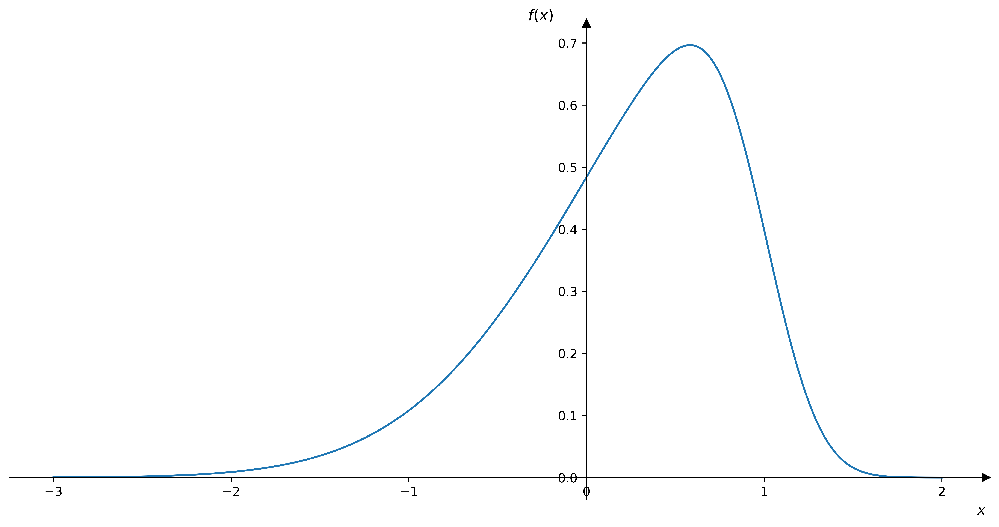
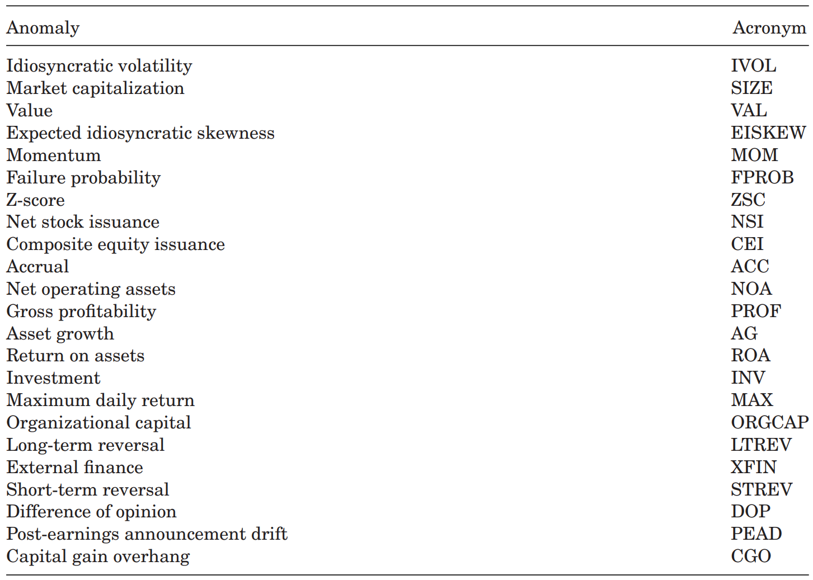
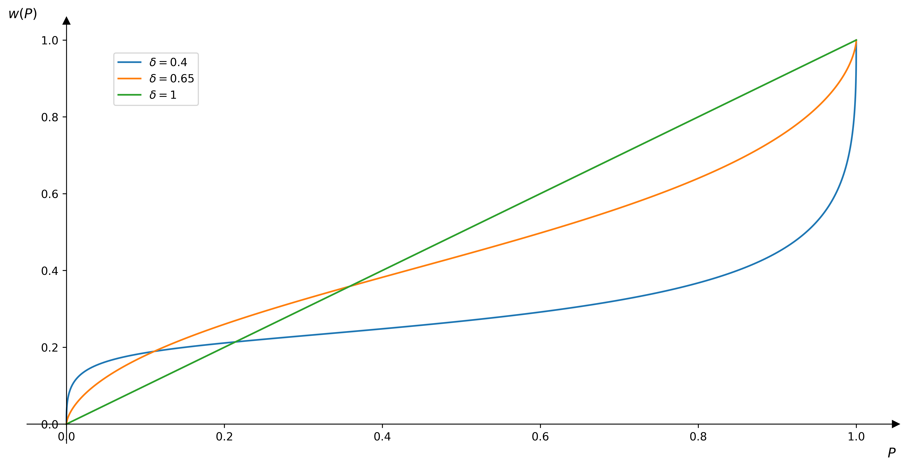
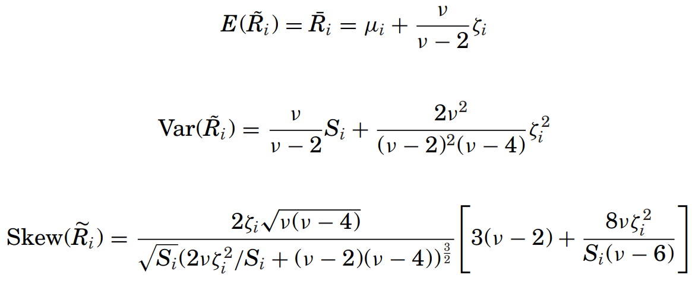
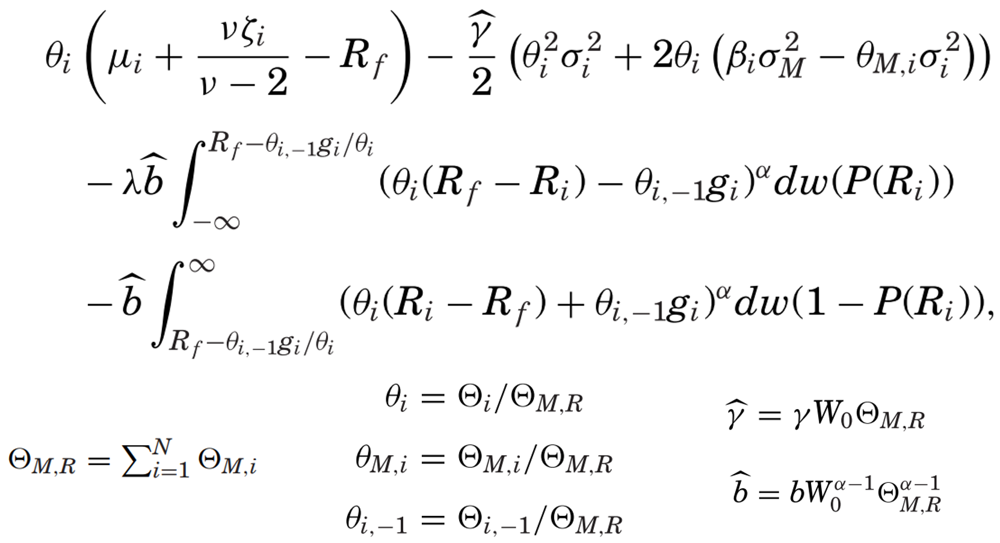
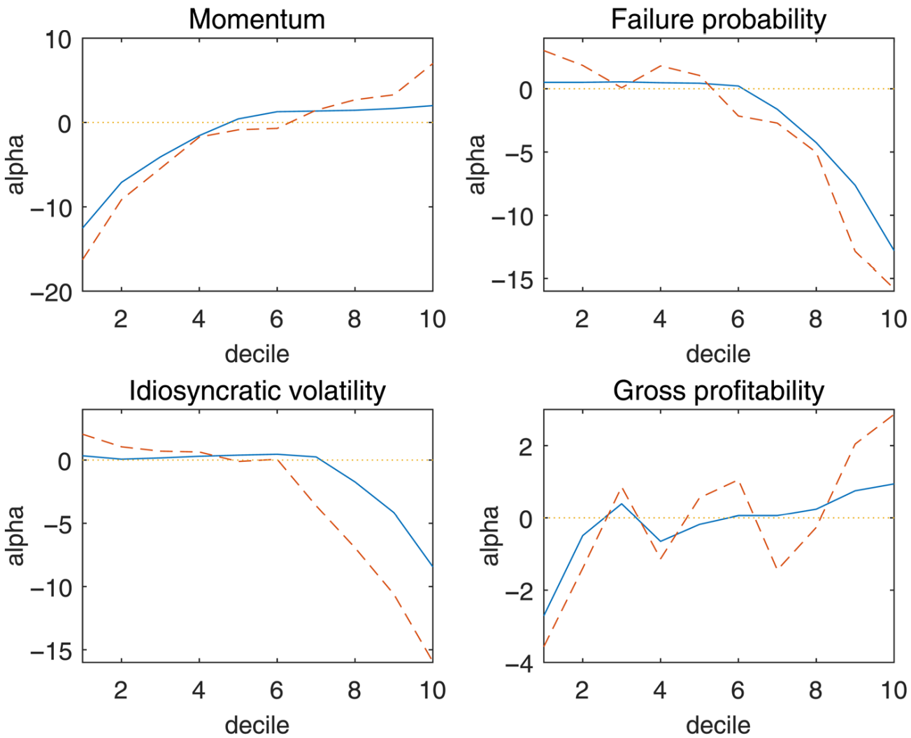
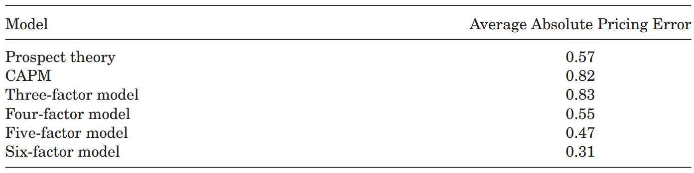

# Prospect Theory and Stock Market Anomalies

### Author <!-- {docsify-ignore} -->
Nicholas Barberis et al.

### Publication <!-- {docsify-ignore} -->
JF 2021

<!-- pagebreak -->

## Introduction

### Contributions
- Use 3 forces to quantitively explain anomalies
  - Investors require higher average returns when 
    1. returns are more volatile;
    2. returns are more negatively skewed;
    
    Note that investors overweight the tails, which means they dislike the left tail while the right tail is attractive.
    1. there are more prior gains.
    According to the utility function's concavity over gains and convexity over losses (will be introduced below).
- Combine the mean-variance optimization with cumulative prospect theory
- Use an equlibrium condition to solve expected returns to explain anomalies' alpha

### Anomalies

### Statistics of Anomaly Deciles

- We can see the phenomenon in all anomalies except NOA: <mark>if decile 1 has a higher standard deviation than decile 10, then it also has a higher skewness and more negative gain overhang, and vice versa.</mark>
- This means <mark>there exist counteracting forces</mark> since investors require higher average return if there is higher standard deviation while they require lower average return if there is higher skewness and more negative gain overhang.
- Thus, we need a quantitive model to determine which force dominates.

### Cumulative Prospect Theory (CPT)
- <mark>Value Function</mark>
$$
v(x) = \begin{cases}
  x^{\alpha} &,\ x\geqslant 0\\
  -\lambda (-x)^{\alpha} &,\ x<0\\
\end{cases}
$$ where $\alpha \in (0,\ 1)$ and $\lambda>1$.

  - The value function models the concave utility over gains and convex utility over losses of investors by setting $\alpha$.
  - The value function considers the phenomenon that investors are more sensitive to losses by setting $\lambda$.
- <mark>Probability Weighting Function</mark>
$$
w(P) = \frac{P^{\delta}}{(P^{\delta}+(1-P)^{\delta})^{\frac{1}{\delta}}}
$$ where $\delta \in (0,\ 1)$.

  - The probability weighting function describes the phenomenon that investors overweight the tails by setting $\delta$.
- Discrete Form
  - Consider payoffs in ascending order with corresponding probabilities
  $$
  (x_{-m},\ P_{-m}; \cdots; x_{-1},\ P_{-1}; x_0,\ P_0; x_1,\ P_1; \cdots; x_n,\ P_n)
  $$where $x_0=0$.
  - Similar to the traditional (discrete) expected utility framework, i.e. $\sum\limits_{i=-m}^{n} P_{i}U(W+x_i)$ where $U$ is the utility function and $W$ is the current wealth, the discrete CPT is 
  $$
  \sum\limits_{i=-m}^{n} \pi_i v(x_i)
  $$where $\pi_i=\begin{cases}w(p_i+\cdots+p_n)-w(p_{i+1}+\cdots+p_n) &,\ 0\leqslant i\leqslant n \\ w(p_{-m}+\cdots+p_i)-w(p_{-m}+\cdots+p_{i-1}) &,\ -m\leqslant i <0 \\ \end{cases}$ is the pmf-like function.
- <mark>Continuous Form</mark>
  - Similar to the traditional (continuous) expected utility framework, i.e., $\int_{\Omega} U(W+x)\ \mathrm{d}P$ where $\Omega$ is a set of probabilities that has one-to-one correspondence with payoffs, the continuous CPT is 
  $$
  \int_{\Omega^{'}} v(x)\ \mathrm{d} w(P)
  $$where $\Omega^{'}$ is a set of weights that has one-to-one correspondence with payoffs.

### Narrow Framing
- A investor derive his utility from individual assets in his portfolio separately instead of from the whole portfolio.
- The converse is broad framing.

<!-- pagebreak -->

## Model

### Model Assumptions
- Consider 3 time states: -1, 0 and 1 that represent past, now and future respectively.
- For simplicity, <mark>assume all investors hold the market portfolio at time -1, and thus they would have the same prior gain or loss in each asset.</mark>
- Also for simplicity, assume that the total wealth does not change from time -1 to 0.
  - It can be set as the change with average market return, which has little impact on the results.
- <mark>Assume narrow framing</mark>.
- Assume investors derive utility from paper gains and losses rather than from realized gains and losses, i.e., investors do not derive utility from selling at a gain at time 0, instead, they derive utility from accumulated gain at time 1.

### Optimization Objective
$$
  \max_\Theta \quad \mathrm{E}(\widetilde{W}_1) - \frac{\gamma}{2} \mathrm{Var}(\widetilde{W}_{1}) + b \sum\limits_{i=1}^{N} V(\widetilde{G}_{i})\\
$$where $\Theta$ is the weight vector for the portfolio, $\widetilde{W}_{1} = W_0 ((1-\Theta^{\mathsf{T}}e)R_f + \Theta^{\mathsf{T}}\widetilde{R})$ is the future wealth ($W_0$ is the current wealth, $e=\begin{bmatrix} 1,\ \cdots,\ 1 \end{bmatrix}^{\mathsf{T}}$, $R_f$ is the gross risk-free rate and $\widetilde{R}$ is the gross return of risky assets), $\gamma$ is the risk aversion coefficient, $b$ is the importance coefficient of CPT, $N$ is the num of assets, $V(\cdot)$ is the continuous CPT value and $\widetilde{G}_i = W_{-1}\Theta_{i,\ -1}g_i + W_0\Theta_i(\widetilde{R}_{i}-R_f)$ is the simple addition of prior and future gains or losses ($W_{-1}$ is the past wealth, $\Theta_{i,\ -1}$ is the past weight and $g_i$ is the prior gain or loss).
- Expansion of $V(\widetilde{G}_i)$ for $\Theta_i>0$ (the case for $\Theta_i<0$ is similar): 
  $$
  \lambda W_0^{\alpha} \int_{\Omega_1} \left( \Theta_i\left( R_f-R_i \right)-\Theta_{i,\ -1}g_i  \right)^{\alpha} \mathrm{d} w(P(R_i)) \\ - W_0^{\alpha} \int_{\Omega_2} \left( \Theta_i\left( R_i-R_f \right)+\Theta_{i,\ -1}g_i  \right)^{\alpha} \mathrm{d} w(1-P(R_i))
  $$where $\Omega_1$ is a set of weights that has one-to-one correspondence with losses, i.e. $R_i \in (-\infty,\ R_f-\frac{\Theta_{i,\ -1}}{\Theta_i})$ and $\Omega_2$ is a set of weights that has one-to-one correspondence with gains, i.e. $R_i \in (\ R_f-\frac{\Theta_{i,\ -1}}{\Theta_i},\ \infty)$.
- Return Distribution
  - One-dimensional GH skewed $t$ distribution for each asset $i$ to model the skewness and fat tails
  - pdf
  
  - <mark>Params</mark>
    - $\mu$ helps determine the mean of returns
    - $S$ helps determine the variance
    - $\xi$ helps determine the skewness
    - $\nu$ helps determine the heaviness of tails
  - <mark>Moments</mark>
  
- Expansion of the whole objective (scaled): 

### Target
The target is not to use mean and variance estimations to get a optimized weight vector. Instead, <mark>estimate the needed params by some infomation and the final target is to get $\mu$ under an equilibrium condition, i.e., we try to find a $\mu$ that let the optimized weight vector equal the market portfolio.</mark>

<!-- pagebreak -->

## Equilibrium
### Full rationality with homogeneous holdings
- All investors are identical and they would choose the optimized portfolio which is also the market portfolio at time 0.
- It is hard or even impossible to get a $\mu$ to meet this equilibrium condition.

### Full rationality with heterogeneous holdings
- There exist more than one optimized portfolio, which means there should be multiple global maxima. We can clear the market by allocating investors to different optimized portfolios.
- Since $\mu$ is a $N$-dimensional vector for $N$ assets, if we consider $100$ candidate values for each component of $\mu$, there will be $100^{N}$ combinations. It is computaionally infeasible to meet this equilibrium.

### Bounded rationality with heterogeneous holdings
- To overcome the difficulties described above, authors introduce a method: <mark>hold other assets' weight as the market weight while optimizing some asset.</mark>
- Actually, the solution cannot be the best using this method, but it do simplify the problem.
- After optimization using this method, results show that there may be one unique solution or two global maxima for each asset. If there are two global maxima, one would be higher than the market weight while the other is slightly lower than the market weight.

<!-- pagebreak -->

## Param Values

### Market Weight
- The market weight of a decile for a particular anomaly is calculated by the percentage that the decile accounts of the total market value.
- Assume the stocks in a decile for a particular anomaly are identical. Thus, the market weight of a typical stock is just the market weight of the decile divided by num of stocks in that decile.

### Distribution Params
- $\nu=7.5$, which is a reasonable choice for fat tails. The results are not sensitive to $\nu$.
- $S$ and $\xi$ are derived by empirical variance and skewness. The (cross-sectional) empirical variance and skewness are calculated through annual returns over the next year (future data).
- Why using future data
  - It is about what a rational, forward-looking investor is interested in;
  - Also, it is a way to get real-world investors' judgement of future.
- Why using annual returns
  - In the best-known data set of individual investor trading, portfolio turnover is about 50% per year, which means investors hold assets for 2 years on average. Since authors assume investors buy at time -1, change weights at time 0 and sell all at time 1, it is reasonable that the time between 0 and 1 is one year.

### CPT Params
- The scaled risk aversion coefficient $\hat{\gamma}=0.6$.
- The scaled importance coefficient of CPT $\hat{b}=0.6$.
- Why $(0.6,\ 0.6)$
  - To generate an aggregate equity premium of $6\%$.
    > Consider a symmetric gamble: a fifty-fifty bet to gain $M$ or lose $M$. According to the utility model with CPT, the utility changes by $-\frac{\gamma}{2}M^{2}-b(\lambda-1)w\left( \frac{1}{2} \right) M^{\alpha}$. If paying $\pi$ to avoid this gamble, then the utility changes by $-\pi-b \lambda \pi^{\alpha}$. When these 2 changes are the same, $\pi$ is called the premium.
  - There are many combinations of $(\hat{\gamma},\ \hat{b})$ that satisfy the first requirement. Empirical results show that the average Sharpe ratio of the household portfolios is $19\%$ lower than that of a market benchmark and $(0.6,\ 0.6)$ can derive a similar result, i.e., the Sharpe ratio of investors' portfolios is $12.5\%$ lower than that of the market portfolio.
- Based on lots of literature before, $(\alpha,\ \delta,\ \lambda)=(0.7,\ 0.65,\ 1.5)$.

<!-- pagebreak -->

## Empirical Test

### Procedure
- Date range: 1963/7 ~ 2014/12
- For each anomaly, 
  1. compute the annualized value-weighted CAPM $\alpha$'s $\alpha^{d}(l)$ for each decile $l$ ($d$ represents "data");
  2. compute the model alpha using the formula
  $$
  \alpha^{m}(l) = R_l - (R_f+\beta_l(R_M-R_f))
  $$where $m$ represents "model", $R_l$ is the gross return of a typical stock in decile $l$, $R_M$ is the gross return of market portfolio and $\beta_l$ is averaged among market $\beta$'s calculated using daily returns over the next year (future data). Note that the $\beta$'s in step 1 and step 2 are different;
  3. get the $\alpha$ spread, i.e. $\alpha^{d}(10)-\alpha^{d}(1)$ and $\alpha^{m}(10)-\alpha^{m}(1)$;
  4. if $\mathrm{sign}(\alpha^{d}(10)-\alpha^{d}(1))=\mathrm{sign}(\alpha^{m}(10)-\alpha^{m}(1))$ and $\left\vert \alpha^{m}(10)-\alpha^{m}(1) \right\vert>0.015 $, then the model can help explain that anomaly.

### Results
- $\alpha$ spread

  - <mark>14 anomalies above the blue lines are predicted well, 2 anomalies between the blue lines are predicted in the right direction but the predictions are not strong, while the model performs poorly for 7 anomalies below the blue lines.</mark>
  - For 5 of the 7 anomalies that are predicted poorly (VAL, INV, LTREV, ACC and AG), a large fraction of their return comes around earnings announcement dates, which means these anomalies are driven incorrect beliefs instead of prospect theory risk attitudes. Thus, anomalies can be categorized into 2 classes: preference-based and belief-based.

- Decile $\alpha$'s

where the blue solid lines are model $\alpha$'s and the red dot lines are data $\alpha$'s.
  - <mark>The model $\alpha$ can approximately track the data $\alpha$.</mark>
  - Combined with the anomalies' statistics in *Introduction*, we can find that <mark>the force of skewness and the force of gain overhang dominate.</mark>

### Performance Comparation
- Average Absolute Pricing Error
$$
\left( \overline{R}^{d}(1) - \overline{R}^{d}(10) \right) - \left( \overline{R}^{m}(1) - \overline{R}^{m}(10) \right)
$$where $\overline{R}(l)$ is the average return of the stocks in anomaly decile $l$.
- Comparation

  - <mark>This model is similar to the four-factor model and better than CAPM as well as the three-factor model. The six-factor model is the best.</mark>
  - Although the comparation seems to imply that the CPT model is not that good, we should notice that <mark>factor models are developed in full knowledge of multiple anomalies while the CPT model are not.</mark>

<!-- pagebreak -->

## Advantages and Robustness
### Importance of CPT Characteristic
- Diminishing sensitivity composes the most part of the $\alpha$ spread.
- Probability weighting doubles the anomalies that can be predicted.

### Importance of Assumptions
If changing some of the assumptions, the model will perform poorly.

### Robustness
- Results are not sensitive to params.
- If using an alternative set of anomalies, the performance is similar.
- If changing the sample period, the results are also similar.