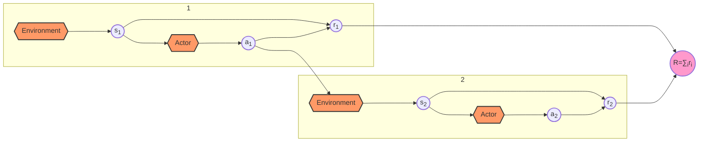

```mermaid
flowchart LR
    classDef agent fill:#f96, stroke:#333, stroke-width:2px
    classDef feature stroke-width:2px
    subgraph 1
        E1{{"Environment"}}:::agent--->s1(("s<sub>1</sub>")):::feature
        s1--->A1{{"Actor"}}:::agent
        A1--->a1(("a<sub>1</sub>")):::feature
        s1 & a1 ---> r1(("r<sub>1</sub>")):::feature
    end

    a1--->E2{{"Environment"}}:::agent

    subgraph 2
        E2--->s2(("s<sub>2</sub>")):::feature
        s2--->A2{{"Actor"}}:::agent
        A2--->a2(("a<sub>2</sub>")):::feature
        s2 & a2 ---> r2(("r<sub>2</sub>")):::feature
    end

    r1 & r2 ---> R(("R=&sum;<sub>i</sub>r<sub>i</sub>"))
    style R fill:#f9c, stroke-width:2px
```