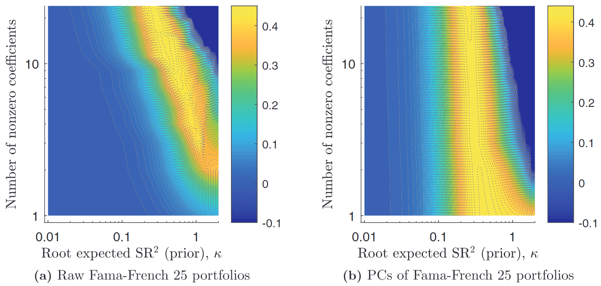
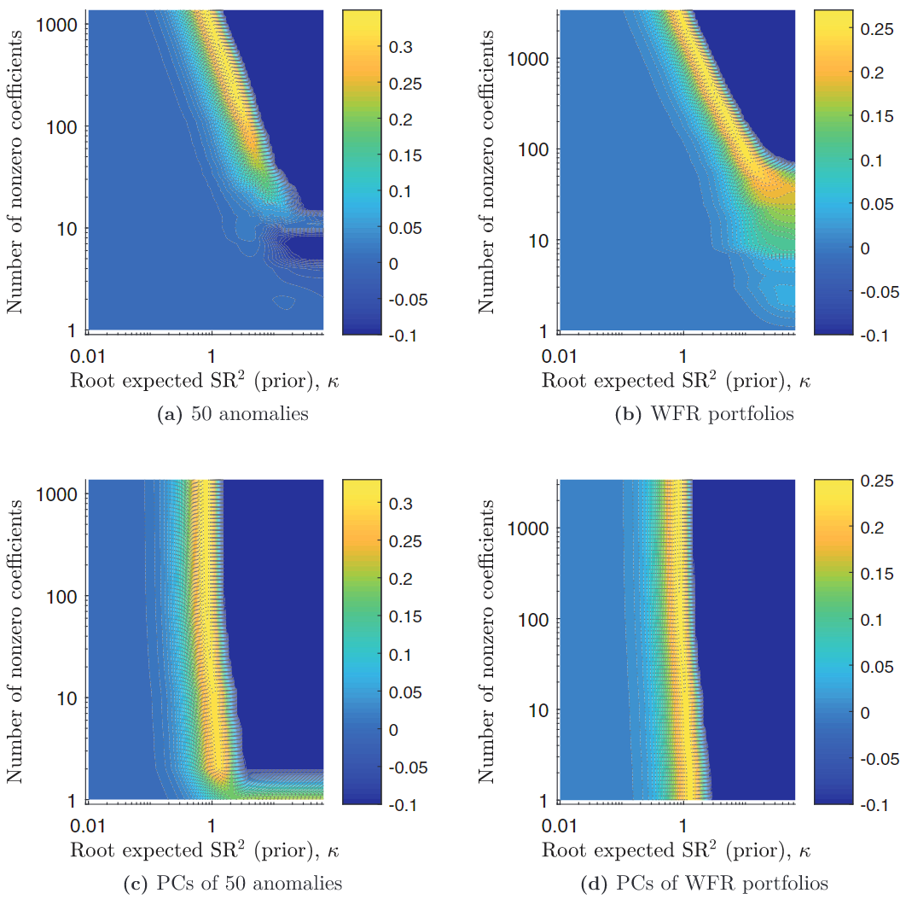
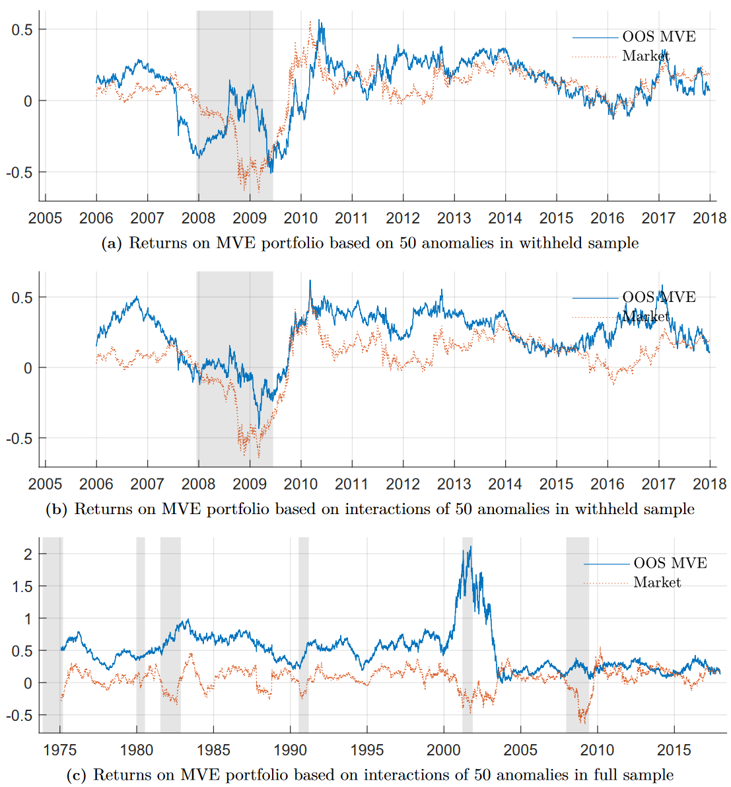
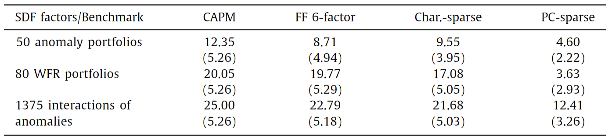

# Shrinking the Cross-Section

## 论文信息

### 作者

Serhiy Kozak, Stefan Nagel, Shrihari Santosh

Kozak 来自马里兰大学，Nagel 来自芝加哥大学，Santosh 来自科罗拉多大学博尔德分校。

### 收录情况

JFE2020

## 解决什么问题

传统的因子模型只用少量的基于公司特征的因子进行定价，比如经典的 Fama 三因子，然而资产的收益率肯定不是只由某几个特征决定的，当因子很多的时候，传统的因子模型很容易过拟合。其次，这些因子模型通常只对很少的 test assets 进行检验，比如对两个特征做双重排序分出25个资产组合作为 test assets，当因子数量增加时，test assets 难以构造。

这篇文章提出的方法可以适用于高维的因子和 test assets。

## 前置知识

### SDF、β 表达式与均值方差前沿之间的联系

#### SDF → β 表达式

当 test assets 是总收益率（gross returns）时，我们有

$$
\mathrm{E}(m R) = 1
$$

其中 $m$ 是 SDF，$R$ 是任意资产的总收益率。

则我们可以做以下推导：

$$
\begin{aligned}
 \mathrm{E}(m R) &= 1 \\
 \mathrm{E}(m) \mathrm{E}(R) + \mathrm{Cov}(m,\ R) &= 1 \\
 \mathrm{E}(R) &= \frac{1}{\mathrm{E}(m)} - \frac{\mathrm{Cov}(m,\ R)}{\mathrm{E}(m)} \\
 \mathrm{E}(R) &= \frac{1}{\mathrm{E}(m)} + \frac{\mathrm{Cov}(m,\ R)}{\mathrm{Var}(m)} \left(-\frac{\mathrm{Var}(m)}{\mathrm{E}(m)} \right)  \\
\end{aligned}
$$

令

$$
\begin{aligned}
 \alpha &:= \frac{1}{\mathrm{E}(m)} \\
 \beta_m &:= \frac{\mathrm{Cov}(m,\ R)}{\mathrm{Var}(m)} \\
 \lambda_m &:= \frac{\mathrm{Var}(m)}{\mathrm{E}(m)}
\end{aligned}
$$

则我们得到了因子为 $m$ 的 $\beta$ 表达式：

$$
\mathrm{E}(R) = \alpha + \beta_m \lambda_m
$$

---

假设 SDF 由一系列均值为 $0$ 的因子 $f$ 线性构成：

$$
m = a + b^{\mathsf{T}}f
$$

则

$$
\begin{aligned}
 \mathrm{E}(R) &= \frac{1}{\mathrm{E}(m)} - \frac{\mathrm{Cov}(m,\ R)}{\mathrm{E}(m)} \\
 &= \frac{1}{a} - \frac{\mathrm{E}\left(R f^{\mathsf{T}} \right) b}{a} \\
\end{aligned}
$$

根据 $\beta$ 的定义，即 $R$ 对因子 $f$ 回归得到的回归系数：

$$
\beta = \mathrm{E}\left(f f^{\mathsf{T}} \right)^{-1} \mathrm{E}(f R)
$$

则

$$
\begin{aligned}
 \mathrm{E}(R) &= \frac{1}{a} - \frac{\mathrm{E}\left(R f^{\mathsf{T}} \right) b}{a} \\
 &= \frac{1}{a} - \frac{\mathrm{E}\left(R f^{\mathsf{T}} \right) \mathrm{E}\left(f f^{\mathsf{T}} \right)^{-1} \mathrm{E}\left(f f^{\mathsf{T}} \right) b}{a} \\
 &= \frac{1}{a} - \beta^{\mathsf{T}} \frac{\mathrm{E}\left(f f^{\mathsf{T}} \right) b}{a} \\
\end{aligned}
$$

令

$$
\begin{aligned}
 \alpha &:= \frac{1}{a} = \frac{1}{\mathrm{E}(m)} \\
 \lambda &:= -\frac{\mathrm{E}\left(f f^{\mathsf{T}} \right) b}{a} = -\frac{\mathrm{E}\left[f (m - a) \right]}{a} = -\alpha \mathrm{E}(m f)
\end{aligned}
$$

我们有

$$
\mathrm{E}(R) = \alpha + \beta^{\mathsf{T}} \lambda
$$

> [!TIP|label:提示]
> $\lambda = -\alpha \mathrm{E}(m f)$ 说明因子的风险溢价与因子的“价格”呈负相关，因子“价格”越低，风险溢价越高。
> 
> 对于均值不为 $0$ 的因子，风险溢价可以写成
> $$
> \lambda = -\alpha \mathrm{E}[m(f - \mathrm{E}(f))] = \mathrm{E}(f) - \alpha \mathrm{E}(mf)
> $$

---

当 test assets 是资产的超额收益率，而非总收益率：

$$
\mathrm{E}\left(m R^{e} \right) = 0
$$

其中 $R^{e}$ 为任意资产的超额收益率。

假设 SDF 由一系列均值可以不为 $0$ 的因子 $f$ 线性构成：

$$
m = a + b^{\mathsf{T}}[f - \mathrm{E}(f)]
$$

由于我们可以对 $\mathrm{E}\left(m R^{e} \right) = 0$ 等式两边同时乘上一个常数，所以当 test assets 是超额收益率时，SDF 是可以被标准化的。我们不妨设 $\mathrm{E}(m) = 1$，即

$$
m = 1 + b^{\mathsf{T}}[f - \mathrm{E}(f)]
$$

则我们可以做如下推导：

$$
\begin{aligned}
 \mathrm{E}\left(m R^{e} \right) &= 0 \\
 \mathrm{E}\left(R^{e} \right) + b^{\mathsf{T}} \mathrm{Cov}\left(f,\ R^{e} \right) &= 0 \\
 \mathrm{E}\left(R^{e} \right) &= -b^{\mathsf{T}} \mathrm{Var}(f) \mathrm{Var}(f)^{-1} \mathrm{Cov}\left(f,\ R^{e} \right) \\
\end{aligned}
$$

根据 $\beta$ 的定义，我们有

$$
\mathrm{E}\left(R^{e} \right) = -b^{\mathsf{T}} \mathrm{Var}(f) \beta
$$

令

$$
\lambda := -\mathrm{Var}(f) b
$$

我们有

$$
\mathrm{E}\left(R^{e} \right) = \lambda^{\mathsf{T}} \beta
$$

#### SDF → 均值方差前沿

假设我们把 SDF 投射到资产的回报（payoff）空间 $\underline{X}$（所有回报的集合）：

$$
x^{*} = \text{proj}(m|\underline{X})
$$

> [!TIP|label:提示]
> $$
> \text{proj}(y|x) := \frac{\mathrm{E}(xy)}{\mathrm{E}\left(x^{2} \right)} x
> $$
> 
> 代表 $y$ 在 $x$ 上的投影，也就是 $y$ 对 $x$ 做无常数项的线性回归所得到的 $y$ 的估计值，$\hat{y}$。

这意味着有一个资产的回报 $x^{*}$ 可以作为 SDF。这个资产的价格为 $\mathrm{E}\left(x^{*}x^{*} \right) = \mathrm{E}\left(x^{*2} \right)$，因此对应的总收益率 $R^{*} = \frac{x^{*}}{\mathrm{E}\left(x^{*2} \right)}$。

对于任意超额收益率 $R^{e}$，我们有

$$
\mathrm{E}\left(R^{*} R^{e} \right) = \frac{\mathrm{E}\left(x^{*} R^{e} \right)}{\mathrm{E}\left(x^{*2} \right)} = 0
$$

这说明 $R^{*}$ 与超额收益率空间 $\underline{R}^{e}$ 是正交的。

我们想要通过 $R^{*}$ 找到均值方差前沿，所以需要定义一个超额收益率来改变资产收益率的均值：

$$
R^{e*} := \text{proj}\left(1|\underline{R}^{e} \right)
$$

这样定义出来的 $R^{e*}$ 毋庸置疑是一个超额收益率，它有如下性质：

$$
\mathrm{E}\left(R^{e*} R^{e} \right) = \mathrm{E}\left[\text{proj}\left(1|R^{e} \right) \cdot R^{e} \right] = \mathrm{E}\left(1 \cdot R^{e} \right) = \mathrm{E}\left(R^{e} \right)
$$

> [!TIP|label:提示]
> 由于 $R^{*}$ 与 $\underline{R}^{e}$ 正交且共同张成回报空间 $\underline{X}$，当存在无风险总收益率 $R_f$ 时，我们有
>
> $$
> 1 = \text{proj}\left(1|R^{*} \right) + \text{proj}\left(1|\underline{R}^{e*} \right)
> $$
> 
> 因此 $R^{e*}$ 也可以表示为 
> 
> $$
> \begin{aligned}
> R^{e*} &= 1 - \text{proj}\left(1|R^{*} \right) \\
> &= 1 - \frac{\mathrm{E}\left(R^{*} \right)}{\mathrm{E}\left(R^{*2} \right)} R^{*} \\
> &= 1 - \frac{\mathrm{E}\left(x^{*} \right) / \mathrm{E}\left(x^{*2} \right)}{\mathrm{E}\left(x^{*2} \right) / \mathrm{E}^{2}\left(x^{*2} \right)} R^{*} \\
> &= 1 - \mathrm{E}\left(x^{*} \right) R^{*} \\
> &= 1 - \frac{1}{R_f} R^{*} \\
> \end{aligned}
> $$
>
> 当不存在无风险总收益率时，我们只需要把 $1$ 投射到回报空间得到 $\text{proj}(1|\underline{X})$（constant-mimicking portfolio），此时
>
> $$
> R^{e*} = \text{proj}(1|\underline{X}) - \frac{\mathrm{E}\left(R^{*} \right)}{\mathrm{E}\left(R^{*2} \right)} R^{*}
> $$

于是任意资产的总收益率都可以分解成三个互相正交的收益率：

$$
R = R^{*} + c R^{e*} + \epsilon
$$

其中 $c$ 是一个常数，$\epsilon$ 是一个超额收益率且 $\mathrm{E}(\epsilon) = 0$。

> [!NOTE|label:注意]
> 不同资产对应不同的 $c$ 和 $\epsilon$。

> [!TIP|label:提示]
> $R^{*}$ 与超额收益率空间正交，因此 $R^{*}$ 与 $R^{e*}$ 和 $\epsilon$ 都正交；根据 $R^{e*}$ 的性质，$\mathrm{E}\left(R^{e*} \epsilon \right) = \mathrm{E}(\epsilon) = 0$，因此 $R^{e*}$ 与 $\epsilon$ 也正交。

不难看出，$\epsilon$ 让同一个收益率均值水平上有不同的方差，而均值方差前沿上的资产很自然地就可以表示为

$$
R^{mv} = R^{*} + c R^{e*}
$$

> [!TIP|label:提示]
> 由于 $\mathrm{E}\left(R^{2} \right) = \mathrm{E}\left(R^{*2} \right) + c^{2} \mathrm{E}\left(R^{e*2} \right) + \mathrm{E}\left(\epsilon^{2} \right)$，$R^{*}$ 代表了最小二阶矩收益。在 $\sigma - \mathrm{E}$ 坐标系上，到原点的距离为 $\sqrt{\sigma^{2}(R) + \mathrm{E}^{2}(R)} = \sqrt{\mathrm{E}\left(R^{2} \right)}$，因此 $R^{*}$ 也代表均值方差前沿与原点最近的收益率。
> 
> 

#### 均值方差前沿 → SDF

假设 SDF 可以由任意资产的总收益率 $R$ 线性构成：

$$
m = a + b R = a + b \left(R^{*} + c R^{e*} + \epsilon \right)
$$

则我们可以得到

$$
\begin{cases}
    \mathrm{E}\left(m R^{*} \right) = a \mathrm{E}\left(R^{*} \right) + b \mathrm{E}\left(R^{*2} \right) = 1 \\
    \mathrm{E}\left(m R^{e*} \right) = a \mathrm{E}\left(R^{e*} \right) + b c \mathrm{E}\left(R^{e*} \right) = 0 \\
\end{cases} \implies
\begin{cases}
    a = \frac{c}{c \mathrm{E}\left(R^{*} \right) - \mathrm{E}\left(R^{*2} \right)} \\
    b = \frac{1}{c \mathrm{E}\left(R^{*} \right) - \mathrm{E}\left(R^{*2} \right)} \\
\end{cases} \implies
m = \frac{c - \left(R^{*} + c R^{e*} + \epsilon \right)}{c \mathrm{E}\left(R^{*} \right) - \mathrm{E}\left(R^{*2} \right)}
$$

SDF 应当能对任意回报进行定价，而任意回报 $x^{\prime}$ 可以表示成：

$$
x^{\prime} = y^{\prime} R^{*} + c^{\prime} R^{e*} + \epsilon^{\prime}
$$

这代表 $x^{\prime}$ 的价格应为 $y^{\prime}$。

我们用根据假设得到的 SDF 来对 $x^{\prime}$ 定价：

$$
\begin{aligned}
 \mathrm{E}\left(m x^{\prime} \right) &= \mathrm{E}\left[\frac{\left(c - R^{*} - c R^{e*} - \epsilon \right) \left(y^{\prime} R^{*} + c^{\prime} R^{e*} + \epsilon^{\prime} \right)}{c \mathrm{E}\left(R^{*} \right) - \mathrm{E}\left(R^{*2} \right)} \right] \\
 &= \frac{c y^{\prime} \mathrm{E}\left(R^{*} \right) - y^{\prime} \mathrm{E}\left(R^{*2} \right) - \mathrm{E}\left(\epsilon \epsilon^{\prime} \right)}{c \mathrm{E}\left(R^{*} \right) - \mathrm{E}\left(R^{*2} \right)} \\
 &= y^{\prime} - \frac{\mathrm{E}\left(\epsilon \epsilon^{\prime} \right)}{c \mathrm{E}\left(R^{*} \right) - \mathrm{E}\left(R^{*2} \right)} \\
\end{aligned}
$$

想要得到准确的定价 $y^{\prime}$，我们需要 $\mathrm{E}\left(\epsilon \epsilon^{\prime} \right) = 0,\ \forall \epsilon^{\prime}$，即需要 $\epsilon = 0$；而为了保证分母不为 $0$，我们需要 $c \neq \frac{\mathrm{E}\left(R^{*2} \right)}{\mathrm{E}\left(R^{*} \right)}$。

因此，SDF 可以由均值方差前沿上除了无风险资产或 constant-mimicking portfolio 外的任意组合线性构成。

### HJ 边界与 HJ 距离

从超额收益率的定价公式我们可以得到 SDF 与 超额收益率之间的相关系数有如下关系：

$$
\begin{aligned}
 \mathrm{E}\left(m R^{e} \right) &= 0 \\
 \mathrm{E}(m) \mathrm{E}\left(R^{e} \right) + \rho_{m,\ R^{e}} \sigma(m) \sigma\left(R^{e} \right) &= 0 \\
 \rho_{m,\ R^{e}} &= \frac{\mathrm{E}(m) \mathrm{E}\left(R^{e} \right)}{\sigma(m) \sigma\left(R^{e} \right)}
\end{aligned}
$$

由于相关系数的绝对值 $\left\vert \rho_{m,\ R^{e}} \right\vert  \leqslant 1$，我们有

$$
\left\vert \frac{\mathrm{E}(m) \mathrm{E}\left(R^{e} \right)}{\sigma(m) \sigma\left(R^{e} \right)} \right\vert \leqslant 1
\implies \frac{\sigma(m)}{\mathrm{E}(m)} \geqslant \left\vert \frac{\mathrm{E}\left(R^{e} \right)}{\sigma\left(R^{e} \right)} \right\vert 
$$

这就是著名的 **Hansen-Jagannathan 边界**（Hansen 和 Jagannathan，1991），简称 HJ 边界。

资产定价领域的研究通常是为了找到一个接近真实 SDF 的 SDF，那么怎样算是接近呢？我们需要一个衡量 SDF 之间距离的工具。

首先我们需要把 SDF 投射到回报空间，因为与回报空间正交的部分并不影响定价。在 [SDF → 均值方差前沿](#sdf-→-均值方差前沿)中我们提到，对于理论的真实 SDF $m$，我们可以投影到回报空间 $\underline{X}$ 上得到 $x^{*}$，同样我们也可以将模型得到的估计 SDF $m^{\prime}$ 投影到回报空间得到 $x^{\prime *}$，即

$$
x^{*} = \text{proj}(m|\underline{X}) = \mathrm{E}\left(m x^{\mathsf{T}} \right) \mathrm{E}\left(x x^{\mathsf{T}} \right)^{-1} x \\
x^{\prime *} = \text{proj}(m^{\prime}|\underline{X}) = \mathrm{E}\left(m^{\prime} x^{\mathsf{T}} \right) \mathrm{E}\left(x x^{\mathsf{T}} \right)^{-1} x
$$

投影到回报空间后，我们就可以对距离进行定义。如果 SDF 的接近指的是在期望和方差上都比较接近，那么我们可以在 $\sigma - \mathrm{E}$ 坐标系上定义距离。[前面](#二阶矩距离)我们介绍了，$\sigma - \mathrm{E}$ 坐标系上任意一点到原点的距离为二阶矩开根号，也即向量 $x$ 的模长为 $\left\| x \right\| = \sqrt{\mathrm{E}\left(x^{2} \right)}$，则两个向量 $x$ 与 $y$ 之间的距离为 $\left\| x - y \right\|$。于是估计的 SDF $m^{\prime}$ 和真实的 SDF $m$ 之间的距离可以写成

$$
\begin{aligned}
 \left\| m^{\prime} - m \right\| &= \left\| x^{\prime *} - x^{*} \right\| \\
 &= \left\| \mathrm{E}\left(m^{\prime} x^{\mathsf{T}} \right) \mathrm{E}\left(x x^{\mathsf{T}} \right)^{-1} x - \mathrm{E}\left(m x^{\mathsf{T}} \right) \mathrm{E}\left(x x^{\mathsf{T}} \right)^{-1} x \right\| \\
 &= \left\| \mathrm{E}\left(m^{\prime} x^{\mathsf{T}} - m x^{\mathsf{T}} \right) \mathrm{E}\left(x x^{\mathsf{T}} \right)^{-1} x \right\| \\
 &= \sqrt{\mathrm{E} \left[\mathrm{E}\left(m^{\prime} x - m x \right)^{\mathsf{T}} \mathrm{E}\left(x x^{\mathsf{T}} \right)^{-1} x \cdot x^{\mathsf{T}} \mathrm{E}\left(x x^{\mathsf{T}} \right)^{-1} \mathrm{E}\left(m^{\prime} x - m x \right) \right]} \\
 &= \sqrt{\left[\mathrm{E}\left(m^{\prime} x \right) - \mathrm{E}(m x) \right]^{\mathsf{T}} \mathrm{E}\left(x x^{\mathsf{T}} \right)^{-1} \left[\mathrm{E}\left(m^{\prime} x \right) - \mathrm{E}(m x) \right]} \\
\end{aligned}
$$

其中 $\mathrm{E}\left(m^{\prime} x \right) - \mathrm{E}(m x)$ 为定价误差。这个 SDF 之间的距离被称作 **HJ 距离**（Hansen 和 Jagannathan，1997）。

> [!TIP|label:提示]
> GMM 的基本目标函数是
> 
> $$
> \underset{b}{\min} ~ g^{\mathsf{T}}_{T}(b) W g_{T}(b)
> $$
> 
> 其中 $g_{T}$ 为考虑 $T$ 个样本的误差函数，$b$ 为参数，$W$ 为权重矩阵，衡量不同矩条件的重要程度。
>
> 当权重矩阵 $W = I$ 时，这个目标函数等价于 OLS 的目标函数。而最小化 HJ 距离则相当于 $W = \mathrm{E}\left(x x^{\mathsf{T}} \right)^{-1}$。

### SDF 系数与 PCA

资产定价领域很多研究都是用两步法回归得到因子的风险溢价，从而检验因子是否有效。然而，想要让因子有显著的风险溢价非常简单，只需要这个因子与构成 SDF 的因子相关即可，并不需要这个因子是 SDF 的组成部分。相比之下，更为合理的检验因子有效程度的方式应当是求出因子在构建 SDF 时占的权重。这样的话，即使一个因子有显著的风险溢价，它在 SDF 的构成当中可能权重趋近于 $0$。

在任意时刻 $t$，SDF $m_t$ 可以由 $N$ 个股票的超额收益率向量 $R_t^{e}$ 线性构成：

$$
m_t = 1 - b_{t-1}^{\mathsf{T}}\left[R_t^{e} - \mathrm{E}\left(R_t^{e} \right) \right] \\
\text{s.t. } \mathrm{E}_{t-1}\left(m_t R_t^{e} \right) = 0
$$

其中 $b_{t-1}$ 是 $N \times 1$ 的 SDF 载荷。

基于特征的定价模型通常用特征来表示 SDF 载荷，即 $b_{t-1} = Z_{t-1} b$，其中 $Z_{t-1}$ 是 $N$ 个资产 $H$ 个特征组成的 $N \times H$ 矩阵，$b$ 是 $H \times 1$ 的不随时间变化的 SDF 系数。

我们把基于特征的因子表示成 $F_t = Z_{t-1}^{\mathsf{T}} R_t^{e}$，则 SDF 可以写成

$$
m_t = 1 - b^{\mathsf{T}}[F_t - \mathrm{E}(F_t)] \\
\text{s.t. } \mathrm{E}(m_t F_t) = 0
$$

> [!TIP|label:提示]
> 这里从条件期望 $\mathrm{E}_{t-1}$ 变成没有条件的期望 $\mathrm{E}$，是认为 $Z_{t-1}$ 已经蕴含了条件信息。
>
> $F_t = Z_{t-1}^{\mathsf{T}} R_t^{e}$ 实际上是 [managed portfolios](papers/characteristics_are_covariances.md#工具变量和-managed-portfolio) 的收益率，本文对 $Z_{t-1}$ 做了截面上的 demean，因此这些 managed portfolios 实际上都是多空组合，而 $F_t$ 既是因子也是超额收益率。这个模型的 test assets 就是 $F_t$。

把 SDF 代入约束可得

$$
\begin{aligned}
 \mathrm{E}\left[F_t - b^{\mathsf{T}}(F_t - \mathrm{E}(F_t)) \cdot F_t \right] &= 0 \\
 \mathrm{E}\left[F_t \cdot (F_t - \mathrm{E}(F_t))^{\mathsf{T}} \right] b &= \mathrm{E}(F_t) \\
 \mathrm{E}\left[(F_t - \mathrm{E}(F_t)) (F_t - \mathrm{E}(F_t))^{\mathsf{T}} \right] b &= \mathrm{E}(F_t) \\
 b &= \Sigma^{-1} \mathrm{E}(F_t) \\
\end{aligned}
$$

其中 $\Sigma = \mathrm{E}\left[(F_t - \mathrm{E}(F_t)) (F_t - \mathrm{E}(F_t))^{\mathsf{T}} \right]$ 是因子的协方差矩阵。

由于协方差矩阵是实对称的，我们还可以进一步将 $b$ 写成 $\left(\Sigma^{\mathsf{T}} \Sigma \right)^{-1} \Sigma \mathrm{E}(F_t)$，这样的形式说明 SDF 系数可以通过把因子的期望回归到因子的协方差上得到。

然而当因子的数量 $H$ 很大时，这样做回归来得到 SDF 系数会造成过拟合，很自然地我们就想要用 PCA 来对因子的协方差矩阵降维。对 $\Sigma$ 做特征值分解：

$$
\Sigma = Q D Q^{\mathsf{T}}
$$

其中 $D = \text{diag}(d_1,\ d_2,\ \cdots,\ d_{H})$ 是 $\Sigma$ 的特征值从大到小排列组成的对角矩阵，$Q$ 则由这些特征值对应的特征向量构成。

则对应的主成分因子为

$$
P_t = Q_t^{\mathsf{T}} F_t
$$

在本文作者之前的工作中，他们证明了在不存在近似套利（near-arbitrage）的情况下，因子（收益率）的期望就能被前几个主成分解释（Kozak 等，2018）。因此他们直接按顺序取主成分来用，但本文并没有这么做。

### 先验分布、后验分布与共轭分布

假设数据 $X$ 服从一个带参数 $\theta$ 的分布，则这个参数的**先验分布**（prior）为 $p(\theta)$，**后验分布**（posterior）为 $p(\theta|X)$。先验分布代表着数据 $X$ 未出现前我们对参数 $\theta$ 的初步判断；后验分布则代表了数据 $X$ 出现后我们对 $\theta$ 的重新判断。根据贝叶斯定理，后验分布可以表示为

$$
p(\theta|X) = p(\theta) \cdot \frac{p(X|\theta)}{p(X)}
$$

其中 $p(X|\theta)$ 为**似然函数**（likelihood function），$p(X)$ 为证据（evidence）。

如果通过先验分布得到的后验分布与先验分布属于同一个分布族（family of distribution），那么称它们为**共轭分布**（conjugate distributions）。如果先验分布和后验分布是共轭分布，那么我们只需要对分布中的参数进行更新，就可以从先验分布得到后验分布，对于计算非常方便。

假设先验分布和似然函数都是方差已知的正态分布，$\theta$ 是似然函数的均值参数，即

$$
X|\theta \sim N(\theta,\ \sigma^{2}),\quad \theta \sim N(\mu_0,\ \sigma_0^{2})
$$

假设数据中有 $n$ 个独立同分布的样本，记为 $X = (x_1,\ x_2,\ \cdots,\ x_n)$，则似然函数为

$$
p(X|\theta) = \prod_{i=1}^{n} \frac{1}{\sqrt{2 \pi \sigma^{2}}} e^{-\frac{(x_i - \theta)^{2}}{2 \sigma^{2}}} \propto e^{-\frac{\sum\limits_{i=1}^{n} (x_i - \theta)^{2}}{2 \sigma^{2}}}
$$

由此可得，后验分布为

$$
p(\theta|X) \propto p(\theta) p(X|\theta) \propto e^{-\frac{(\theta - \mu_0)^{2}}{2 \sigma_0^{2}}} e^{-\frac{\sum\limits_{i=1}^{n} (x_i - \theta)^{2}}{2 \sigma^{2}}} \propto e^{-\frac{(\theta - \mu_1)^{2}}{2 \sigma_1^{2}}}
$$

其中 $\mu_1 = \sigma_1^{2} \left(\frac{\mu_0}{\sigma_0^{2}} + \frac{n \overline{x}}{\sigma^{2}} \right)$，$\sigma_1^{2} = \left(\frac{1}{\sigma_0^{2}} + \frac{n}{\sigma^{2}} \right)^{-1}$，$\overline{x} = \frac{1}{n} \sum\limits_{i=1}^{n} x_i$。

即后验分布也是正态分布。因此正态分布（似然函数）关于均值（参数）的共轭先验为正态分布。

## 创新点

### SDF 系数的压缩估计量

从 [SDF 系数与 PCA](#sdf-系数与-pca) 中我们知道，SDF 系数的理论解为 $b = \Sigma^{-1} \mathrm{E}(F_t)$，但因子的期望和协方差都是未知的。因此需要用 GMM 来估计 SDF 系数：

$$
\begin{cases}
    \mathrm{E}(F_t) - \frac{1}{T} \sum\limits_{t=1}^{T} F_t = 0 \\
    \frac{1}{T} \sum\limits_{t=1}^{T} m_t F_t = 0
\end{cases} \implies
\hat{b} = \overline{\Sigma}^{-1} \overline{\mu}
$$

其中 $\overline{\mu} = \frac{1}{T} \sum\limits_{t=1}^{T} F_t$，$\overline{\Sigma} = \frac{1}{T} \sum\limits_{t=1}^{T} \left(F_t - \overline{\mu} \right) \left(F_t - \overline{\mu} \right)^{\mathsf{T}}$。

这样得到的估计是不准确的，主要来源于 $\overline{\mu}$ 的不准确，相比之下 $\overline{\Sigma}$ 的不准确影响没有那么大，因此我们可以假设 $\overline{\Sigma} = \Sigma$，即 $\Sigma$ 是已知的。

根据前人的工作，我们对因子的期望 $\mu$ 有如下先验假设：

$$
\mu \sim \mathcal{N}\left(0,\ \frac{\kappa^{2}}{\tau} \Sigma^{\eta} \right)
$$

其中 $\mathcal{N}$ 代表多元正态分布，$\tau = \text{tr}(\Sigma)$，$\kappa$ 是一个取决于 $\tau$ 和 $H$ 的常数，$\eta$ 则是一个控制先验分布形状的常数。

为了能根据经济学意义找到一个合适的 $\eta$，考虑主成分因子的期望 $\mu_{P}$：

$$
\mu_{P} \sim \mathcal{N}\left(0,\ \frac{\kappa^{2}}{\tau} D^{\eta} \right)
$$

这些主成分因子同样也是收益率，对应的投资组合我们称作主成分组合，则主成分组合的夏普比率可以表示成：

$$
D^{-\frac{1}{2}} \mu_{P} \sim \mathcal{N}\left(0,\ \frac{\kappa^{2}}{\tau} D^{\eta - 1} \right)
$$

在不存在近似套利的情况下，特征值越大，对应的主成分组合的期望夏普比率应当越高。如果 $\eta = 0$，期望夏普比率与特征值有相反的关系，即特征值越小，期望夏普比率越可能取到大的数值，这违背了“不存在近似套利”的前提假设。更一般性地，想要期望夏普比率与特征值有正向关系，我们需要 $\eta - 1 > 0$，，即 $\eta > 1$。

> [!TIP|label:提示]
> 近似套利即能得到趋近无穷的夏普比率。如果特征值越小，夏普比率越高，那么那些趋向于 $0$ 的特征值会让夏普比率趋近无穷。

在作者之前的工作中还得出一个结论：理性投资者的最优组合权重应当是有限的，即 SDF 系数应当是有限的，从而 $\mathrm{E}\left(b^{\mathsf{T}} b \right)$ 应当是有界的（Kozak 等，2018）。而根据 $\mu$ 的先验分布，我们可以得到 $b = \Sigma^{-1} \mu$ 的先验分布为

$$
b \sim \mathcal{N}\left(0,\ \frac{\kappa^{2}}{\tau} \Sigma^{\eta - 2} \right)
$$

则 $\mathrm{E}\left(b^{\mathsf{T}} b \right) = \frac{\kappa^{2}}{\tau} \sum\limits_{i=1}^{H} d_i^{\eta - 2}$，想要保证有界需要 $\eta - 2 \geqslant 0$，即 $\eta \geqslant 2$。因此作者选取了 $\eta = 2$ 作为先验分布的参数。

假设似然函数也是多元正态分布，由于正态分布关于均值的[共轭先验](#先验分布后验分布与共轭分布)也是正态分布，我们得到 $\mu$ 的后验均值为

$$
\hat{\mu} = \left(\frac{\tau}{\kappa^{2}} \Sigma^{-2} + T \Sigma^{-1} \right)^{-1} \left(0 + T \Sigma^{-1} \overline{\mu} \right) = \left(\frac{\tau}{\kappa^{2} T} I + \Sigma \right)^{-1} \Sigma \overline{\mu}
$$

令 $\gamma = \frac{\tau}{\kappa^{2} T}$，我们有

$$
\hat{b} = \Sigma^{-1} \hat{\mu} = (\Sigma + \gamma I)^{-1} \overline{\mu}
$$

考虑前面得到的主成分因子，$\hat{b}_{P} = (D + \gamma I)^{-1} \overline{\mu}_{P}$，对于每一个因子 $j$，对应的 SDF 系数为

$$
\hat{b}_{P,\ j} = \frac{\overline{\mu}_{P,\ j}}{d_{j} + \gamma} = \frac{d_{j}}{d_{j} + \gamma} \cdot \frac{\overline{\mu}_{P,\ j}}{d_{j}}
$$

对比原先用 GMM 得到的解，$\frac{\overline{\mu}_{P,\ j}}{d_{j}}$，通过先验得到的贝叶斯估计多了一项压缩系数，$\frac{d_{j}}{d_{j} + \gamma}$，特征值 $d_{j}$ 越小，压缩得越多。

注意到，上述贝叶斯估计等价于最小化 OLS 残差平方和的同时对模型隐含的最大夏普比率的平方进行惩罚：

$$
\underset{b}{\mathop{\arg\min}} ~ \left(\overline{\mu} - \Sigma b \right)^{\mathsf{T}} \left(\overline{\mu} - \Sigma b \right) + \gamma b^{\mathsf{T}} \Sigma b
$$

> [!TIP|label:提示]
> 对于 $m_t = 1 - b^{\mathsf{T}}[F_t - \mathrm{E}(F_t)]$，我们有 $\mathrm{E}(m_t) = 1$，$\mathrm{Var}(m_t) = b^{\mathsf{T}} \Sigma b$，根据 [HJ Bound](#hj-边界与-hj-距离) 我们知道 $\frac{\sigma(m)}{E(m)} \geqslant \left\vert \frac{\mathrm{E}\left(R^{e} \right)}{\sigma\left(R^{e} \right)} \right\vert ,\ \forall R^{e} \in \underline{R^{e}}$，因此最大夏普比率的平方 $\frac{\mathrm{E}^{2}\left(R^{e} \right)}{\sigma^{2}\left(R^{e} \right)} \leqslant \mathrm{Var}(m_t) = b^{\mathsf{T}} \Sigma b$。
> 
> 二次函数 $a x^{2} + b x + c \ (a > 0)$ 的最小值点取在 $x = -\frac{b}{2 a}$ 处，因此上述目标函数的最小值点取在
> $$
> b = -\left(2 \Sigma^{2} + 2 \gamma \Sigma \right)^{-1} \left(-2 \Sigma \overline{\mu} \right) = (\Sigma + \gamma I)^{-1} \overline{\mu}
> $$

同样也等价于解

$$
\underset{b}{\mathop{\arg\min}} ~ \left(\overline{\mu} - \Sigma b \right)^{\mathsf{T}} \Sigma^{-1} \left(\overline{\mu} - \Sigma b \right) + \gamma b^{\mathsf{T}} b
$$

即最小化 [HJ 距离](#hj-边界与-hj-距离)的同时做 $L^{2}$ 正则。

> [!TIP|label:提示]
> $L^{2}$ 正则的作用是让一些参数的值趋近于 $0$，这也是“压缩（shrinkage）”的由来。而上面我们已经证明了，主成分对应的特征值越小，压缩力度越大。

有了 $L^{2}$ 正则，借鉴 elastic net 的想法，我们可以再加入 $L^{1}$ 正则来提供一些稀疏性。则目标函数变成

$$
\underset{b}{\mathop{\arg\min}} ~ \left(\overline{\mu} - \Sigma b \right)^{\mathsf{T}} \Sigma^{-1} \left(\overline{\mu} - \Sigma b \right) + \gamma_1 b^{\mathsf{T}} b + \gamma_2 \sum\limits_{i=1}^{H} \left\vert b_i \right\vert 
$$

其中 $b_i$ 是 $b$ 中第 $i$ 个元素，$\gamma_1$ 和 $\gamma_2$ 为超参，通过 K-fold 交叉验证来找到最优的一组参数。

## 实验

### 指标

样本外 R 方：

$$
R_{\text{OOS}}^{2} = 1 - \frac{\left(\overline{\mu}_2 - \overline{\Sigma}_2 \hat{b} \right)^{\mathsf{T}} \left(\overline{\mu}_2 - \overline{\Sigma}_2 \hat{b} \right)}{\overline{\mu}_2^{\mathsf{T}} \overline{\mu}_2}
$$

其中下标 $2$ 代表验证集或测试集。

> [!NOTE|label:注意]
> 在交叉验证的时候是用验证集的数据来计算“样本外” R 方，实验部分则先是用验证集的 R 方作为评估指标，后面又用测试集做了真正的样本外检验。

### Fama-French ME/BE 5x5 组合

用 Fama 和 French 对市值和市净率做双重排序得到的 5x5 组合（FF25）的示性函数作为公司特征，即假设公司属于 FF25 中的某一个组合，那么它在这一个组合上的值为 $1$，在其他组合上的值为 $0$。从而我们得到了25个公司特征，用这些特征构造的因子与市场因子进行正交化，得到了市场中性的因子：

$$
F_{i,\ t} = \widetilde{F}_{i,\ t} - \beta_i R_{m,\ t}
$$

其中 $\widetilde{F}_{i,\ t}$ 为原始的因子值，$F_{i,\ t}$ 为市场中性因子，$\beta_i$ 由整个样本回归得到，$R_{m,\ t}$ 则为市场指数的收益率。

#### 结果

上图中颜色深浅代表了不同大小的样本外 R 方，横坐标代表 $L^{2}$ 正则化的强度，纵坐标代表 $L^{1}$ 正则化的强度，坐标轴做了对数化处理，即数字小的时候宽，数字大的时候窄。

如图 (a)，如果完全不做 $L^{2}$ 正则化，即完全不压缩，则因子数量需要降到两三个才能得到好的样本外 R 方；而如果做一定的压缩，用全部因子（25个）都可以达到不错的样本外 R 方而不会过拟合。

如图 (b)，如果我们对这个25个市场中性因子做 PCA，因子数量并不会对结果产生太大的影响，只需要做一定的压缩就可以得到不错的样本外 R 方。最优的样本外 R 方在因子数量为2的时候取到，这也从侧面印证了 Fama 三因子的效力。

> [!NOTE|label:注意]
> 因子数量的多少通过控制 $L^{1}$ 正则化的强度来实现，并非手动剔除特征值小的成分。
> 
> 这里所谓的“样本外”实际上是验证集。

### 高维特征

作者从前人的工作中总结出了50个与异象相关的特征，然后从 WRDS 取了68个金融比率，外加12个收益率（从一个月到一年的动量）构成80个特征（WRF）。这些特征又做一阶交互、平方、立方，得到 $C_2^{n} + 3 n$ 个特征。对于50个异象特征，我们可以得到 $C_2^{50} + 3 \times 50 = 1,375$ 个特征，对于 WRF，我们可以得到 $C_2^{80} + 3 \times 80 = 3,400$ 个特征。

对这些特征作者做了排序处理，即公司在截面上的特征排名作为真正使用的特征。同样也对这些特征构造的因子做了市场中性化的处理。

#### 结果

在高维特征的结果与在 FF25 的结果相似，做 PCA 后可以将因子数量降到个位数，不做的话是不行的。

### 纯样本外对比

将50个异象组合、80个 WFR 组合以及1375个高阶项组合分别构建切点组合，即 $R_{t}^{\text{mv}} = \hat{b}^{\mathsf{T}} F_t$，把这些切点组合在测试集上的收益率回归到不同的模型上，比较它们的截距项 $\alpha$。

> [!TIP|label:提示]
> 传统方法对 test assets 进行检验是每个 test asset 分别回归得到 $\alpha$。而本文直接利用 SDF 系数构造 test assets 中的切点组合，这样就解决了高维 test assets 难以检验的问题。

#### 结果

下图是构建出来的切点组合的表现，其中图 (a) 和 (b) 是测试集的表现，图 (c) 是全样本的表现。

可以看到其实过拟合还是挺严重的。

与其他模型的对比如下：

可以看到定价效果是 CAPM < FF 6-factor ≈ Char.-sparse < PC-sparse，即对 test assets（因子）做 PCA 再用本文的压缩估计量，效果是最好的。

## 参考文献

Hansen, L. P., & Jagannathan, R. (1991). Implications of Security Market Data for Models of Dynamic Economies. Journal of Political Economy, 99(2), 225–262. https://doi.org/10.1086/261749

Hansen, L. P., & Jagannathan, R. (1997). Assessing Specification Errors in Stochastic Discount Factor Models. The Journal of Finance, 52(2), 557–590. https://doi.org/10.1111/j.1540-6261.1997.tb04813.x

Kozak, S., Nagel, S., & Santosh, S. (2018). Interpreting Factor Models. The Journal of Finance, 73(3), 1183–1223. https://doi.org/10.1111/jofi.12612

Kozak, S., Nagel, S., & Santosh, S. (2020). Shrinking the cross-section. Journal of Financial Economics, 135(2), 271–292. https://doi.org/10.1016/j.jfineco.2019.06.008
