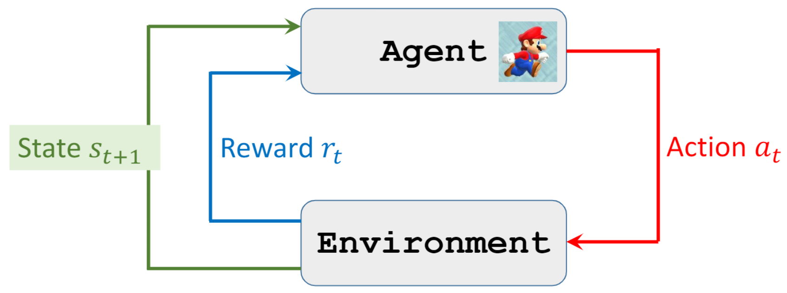

# 一、基本概念

> [!NOTE|label:注意]
> 大写字母代表随机变量，小写字母代表特定的值，花体字母代表变量所在的空间（集合）。

## 基本元素

- 状态（State）$S$：一个状态 $S = s$ 描述当前的环境；
- 动作（Action）$A$：一个动作 $A = a$ 会引起环境的反应，甚至有可能改变环境；
- 智能体（Agent）：一个智能体会在给定的状态下执行动作；
- 策略（Policy）$\pi$：策略是智能体在某一状态下选择不同动作的**概率分布**，本质上是一个**函数**，把状态和动作映射到概率空间，即

  $$
  \pi(a|s) := \mathrm{P}(A = a|S = s)
  $$

  > [!NOTE|label:注意]
  > 策略是一个概率分布说明策略具有随机性，即同一个状态下智能体执行的动作可能不同。

- 奖励（Reward）$R$：环境会根据当前状态以及智能体的动作给予一些奖励来引导智能体优化自己的策略，因此奖励通常是一个关于状态和动作的函数；
- 环境机制（Environment's dynamics）$p$：环境机制描述了环境在智能体执行动作后产生的变化与回应，是**状态变化和奖励产生的联合概率**，即

  $$
  p\left(s^{\prime},\ r | s,\ a \right) := P\left(S^{\prime} = s^{\prime},\ R = r | S = s,\ A = a \right) 
  $$

  其中 $s^{\prime}$ 是在旧状态 $s$ 下执行动作 $a$ 达到的新状态。

  > [!TIP|label:提示]
  > 这是因为奖励的产生也可以有随机性，比如在同一个状态下做同一个动作可能得到的奖励不同。
  > 
  > 知道了环境机制就可以很容易得到状态转移概率（State transition probabilities），即从一个状态变到另一个状态的概率，用相同符号 $p$ 表示：
  > 
  > $$
  > p\left(s^{\prime}|s,\ a \right)  := \mathrm{P}\left(S^{\prime} = s^{\prime}|S = s,\ A = a \right) = \sum\limits_{r \in \mathcal{R}} p\left(s^{\prime},\ r | s,\ a \right) 
  > $$

## 智能体与环境的互动

智能体看到环境表现出来的状态，选择动作来让环境给出下一个状态，同时环境还会根据当前状态和智能体执行的动作给予智能体相应的奖励，如此循环往复下去。

对于会结束的任务，即终止时间 $T < \infty$ 的任务，我们称作 **episodic tasks**，从开始到结束称为一个 **episode**；对于不会结束的任务，即终止时间 $T = \infty$ 的任务，我们称作 **continuing tasks**。

### 轨迹

轨迹（Trajectory）描述了智能体与环境互动的过程与结果，用一个序列来表示：

$$
(s_1,\ a_1,\ r_1,\ s_2,\ a_2,\ r_2,\ \cdots)
$$

## 回报与价值函数

### 回报

$t$ 时刻的回报（Return）$G_t$ 是**未来的**累积奖励，即

$$
G_t := R_t + R_{t+1} + R_{t+2} + \cdots
$$

但是现在拿到100块跟未来拿到100块是不一样的，因此通常我们需要对未来的奖励进行折现：

$$
G_t := R_t + \gamma R_{t+1} + \gamma^{2} R_{t+2} + \cdots
$$

其中 $\gamma \in [0,\ 1]$ 为折现率。

> [!NOTE|label:注意]
> $G_t$ 是一个随机变量，取值与未来的状态和动作有关。

由上式不难发现，回报还可以写成迭代的形式：

$$
G_{t} = R_t + \gamma G_{t+1}
$$

### 价值函数

价值函数（Value function）衡量某一动作或某一状态的价值，分为**动作价值函数**（Action-value function）和**状态价值函数**（State-value function）。

#### 动作价值函数

动作价值是给定状态和动作下的期望回报，用来**衡量某一状态下不同动作的好坏**，即

$$
Q_{\pi}(s,\ a) := \mathrm{E}_{\pi}(G_t|S_t = s,\ A_t = a)
$$

动作价值函数与策略 $\pi$ 有关，不同的策略对应不同的动作价值函数，因为策略会影响未来的动作选择。

使用最优策略时我们可以得到**最优动作价值函数**

$$
Q^{*}(s,\ a) := \underset{\pi}{\max} ~ Q_{\pi}(s,\ a)
$$

最优动作价值函数**衡量的是不同动作价值的上限**。

#### 状态价值函数

状态价值是给定状态下的期望回报，用来**衡量不同状态的好坏**，即

$$
V_{\pi}(s) := \mathrm{E}_{\pi}(G_t|S_t = s)
$$

状态价值函数也与策略 $\pi$ 有关，因为策略会影响未来的动作选择，而动作选择的不同又会导致状态的不同。

同时，状态价值也是动作价值关于动作的期望，即

$$
V_{\pi}(s) = \mathrm{E}(G_t|S_t = s) = \mathrm{E}_{A \sim \pi(\cdot|s)}[Q_{\pi}(s,\ A)]
$$

可以理解为，智能体采取策略 $\pi$ 时，当前状态的价值是执行不同动作得到的动作价值的加权平均，加权依据就是策略 $\pi$，选哪个动作的概率高，哪个动作价值的权重就高。

如果动作空间是离散的，我们可以写成

$$
V_{\pi}(s) = \mathrm{E}_{A\sim \pi(\cdot|s)}[Q_{\pi}(s,\ A)] = \sum\limits_{a \in \mathcal{A}} \pi(a|s) \cdot Q_{\pi}(s,\ a)
$$

如果动作空间是连续的，我们可以写成

$$
V_{\pi}(s) = \mathrm{E}_{A\sim \pi(\cdot|s)}[Q_{\pi}(s,\ A)] = \int_{\mathcal{A}} \pi(a|s) \cdot Q_{\pi}(s,\ a) ~ \mathrm{d}a
$$

使用最优策略时我们可以得到**最优状态价值函数**

$$
V^{*}(s_t) := \underset{\pi}{\max} ~ V_{\pi}(s_t)
$$

最优状态价值函数**衡量的是不同状态价值的上限**。