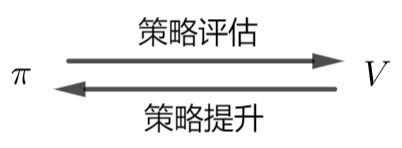

# 三、动态规划（Dynamic Programming，DP）

动态规划要求知道环境的机制，即 $p\left(s^{\prime},\ r | s,\ a \right)$ 是已知的，因此属于 model-based 算法。

## 策略迭代（Policy Iteration）

当我们有一个任意策略 $\pi$，我们可以通过**策略评估（Policy evaluation）**的方式来评估 $\pi$，知道 $\pi$ 的好坏后我们可以通过**策略提升（Policy improvement）**的方式来改进 $\pi$，得到 $\pi^{\prime}$；接着我们可以继续评估 $\pi^{\prime}$ 并提升它。**策略迭代**就是这样一个持续迭代寻找最优策略的过程。

### 策略评估

策略评估指的是**从任意策略 $\pi$ 得到对应的状态价值函数 $V_{\pi}$**。

回顾状态价值函数的定义，我们有

$$
\begin{aligned}
 V_{\pi}(s) &= \mathrm{E}_{\pi}(G_t|S_t = s) \\
 &= \mathrm{E}_{\pi}(R_t + \gamma G_{t+1} | S_t = s) \\
 &= \mathrm{E}_{\pi}[R_t + \gamma \mathrm{E}_{\pi}(G_{t+1}|S_{t+1})|S_t = s] \\
 &= \mathrm{E}_{\pi}[R_t + \gamma V_{\pi}(S_{t+1})|S_t = s] \\
 &= \sum\limits_{a \in \mathcal{A}(s)} \pi(a|s) \sum\limits_{s^{\prime} \in \mathcal{S}} p\left(s^{\prime},\ r | s,\ a \right) \left[r + \gamma V_{\pi}\left(s^{\prime} \right) \right] 
\end{aligned}
$$

于是我们可以通过以下迭代算法来得到 $V_{\pi}(s)$：

- 输入：策略 $\pi$
- 参数：精度 $\theta > 0$

1. 随机初始化 $V_{\pi}(s)$ 的 candidate $V^{\prime}(s)$，$\forall s \in \mathcal{S}$，$V^{\prime}(\text{terminial}) = 0$；
2. 循环：

    1. $\Delta \leftarrow 0$； 
    2. 对 $\forall s \in \mathcal{S}$ 循环：
   
        1. $V \leftarrow V^{\prime}(s)$；
        2. $V^{\prime}(s) \leftarrow \sum\limits_{a \in \mathcal{A}(s)} \pi(a|s) \sum\limits_{s^{\prime} \in \mathcal{S}} p\left(s^{\prime},\ r | s,\ a \right) \left[r + \gamma V^{\prime}\left(s^{\prime} \right) \right]$；
        3. $\Delta \leftarrow \max \left(\Delta,\ \left\vert V - V^{\prime}(s) \right\vert \right)$；

    直到 $\Delta < \theta$。

### 策略提升

对于两个策略 $\pi$ 和 $\pi^{\prime}$，如果对所有状态 $s \in \mathcal{S}$ 都有

$$
Q_{\pi}\left(s,\ \pi^{\prime}(s) \right) \geqslant V_{\pi}(s)
$$

那么策略 $\pi^{\prime}$ 优于 策略 $\pi$，即 $V_{\pi^{\prime}}(s) \geqslant V_{\pi}(s)$，$\forall s \in \mathcal{S}$。这个定理被称作**策略提升定理（Policy improvement theorem）**。

> [!TIP|label:提示]
> 假设其他状态相同，某个状态 $s$ 下，$\pi^{\prime}(s) = a \neq \pi(s)$，我们有 $V_{\pi^{\prime}}(s) = Q_{\pi}(s,\ a)$。如果 $Q_{\pi}(s,\ a) > V_{\pi}(s)$，那么很显然 $\pi^{\prime}$ 优于 $\pi$。

因此我们只需要**在每个状态下选择在原先策略 $\pi$ 下动作价值最大的动作**，即可得到不差于 $\pi$ 的贪婪策略 $\pi^{\prime}$。这个过程就叫做**策略提升**，具体算法如下：

- 输入：旧策略 $\pi$

1. $\text{is\_policy\_stable} \leftarrow \text{True}$；
2. $\forall s \in \mathcal{S}$：
    1. $\pi^{\prime}(s) \leftarrow \underset{a \in \mathcal{A}(s)}{\mathop{\arg\max}} ~ \sum\limits_{s^{\prime} \in \mathcal{S},\ r \in \mathcal{R}} p\left(s^{\prime},\ r | s,\ a \right) \left[r + \gamma V^{\prime}\left(s^{\prime} \right) \right]$；
    2. 如果 $\pi^{\prime}(s) \neq \pi(s)$：
        1. $\text{is\_policy\_stable} \leftarrow \text{False}$；

3. 如果 $\text{is\_policy\_stable}$，策略迭代停止并输出策略 $\pi^{\prime}$，否则进行策略评估。

这个输出的确定性策略就是最优策略 $\pi^{*}$ 的贪婪估计。

> [!NOTE|label:注意]
> $\forall s \in \mathcal{S}$ 和对 $\forall s \in \mathcal{S}$ 循环是不一样的，前者可以并行，后者只能串行。因此一般来说策略评估花的时间会比策略提升花的时间长。

## 价值迭代（Value Iteration）

在策略迭代中，策略评估会对所有状态进行循环，这导致时间开销大。一种改进方法是在策略评估的循环中同时进行策略提升，而这本质上就是利用贝尔曼最优方程进行价值迭代。

### 贝尔曼最优方程

$$
\begin{aligned}
 V^{*}(s) &= \underset{a \in \mathcal{A}(s)}{\max} ~ \mathrm{E}\left[R_t + \gamma V^{*}(S_{t+1}) | S_t = s,\ A_t = a \right] \\
 &= \underset{a \in \mathcal{A}(s)}{\max} ~ \sum\limits_{s^{\prime} \in \mathcal{S},\ r \in \mathcal{R}} p\left(s^{\prime},\ r | s,\ a \right) \left[r + \gamma V^{*}\left(s^{\prime} \right) \right]\\
\end{aligned}
$$

### 算法过程

- 参数：精度 $\theta > 0$

1. 随机初始化 $V^{*}(s)$ 的 candidate $V^{\prime}(s)$，$\forall s \in \mathcal{S}$，$V^{\prime}(\text{terminial}) = 0$；
2. 循环：

    1. $\Delta \leftarrow 0$； 
    2. 对所有 $s \in \mathcal{S}$ 循环：
        1. $V \leftarrow V^{\prime}(s)$
        2. $V^{\prime}(s) \leftarrow \underset{a \in \mathcal{A}(s)}{\max} ~ \sum\limits_{s^{\prime} \in \mathcal{S},\ r \in \mathcal{R}} p\left(s^{\prime},\ r | s,\ a \right) \left[r + \gamma V^{\prime}\left(s^{\prime} \right) \right]$；
        3. $\Delta \leftarrow \max \left(\Delta,\ \left\vert V - V^{\prime}(s) \right\vert \right)$；

    直到 $\Delta < \theta$。

3. 输出确定性策略 $\pi(s) = \underset{a \in \mathcal{A}(s)}{\mathop{\arg\max}} ~ \sum\limits_{s^{\prime} \in \mathcal{S},\ r \in \mathcal{R}} p\left(s^{\prime},\ r | s,\ a \right) \left[r + \gamma V^{\prime}\left(s^{\prime} \right) \right]$

这个确定性策略就是最优策略 $\pi^{*}$ 的贪婪估计。

## 广义策略迭代（General Policy Iteration，GPI）

广义策略迭代指的是所有过程类似策略迭代的算法，即不断地重复策略评估和策略提升的过程。

策略评估和策略提升可以看作是**既在竞争，又在合作**。竞争是因为当我们根据价值函数得到贪婪策略后，价值函数对新的策略不再是正确的，而从新的策略评估出正确的价值函数后，这个价值函数又让策略相对于新的价值函数不再是贪婪的；合作是因为从长期来看，这两个过程会找到一个共同的解，也就是最优价值函数和最优策略。