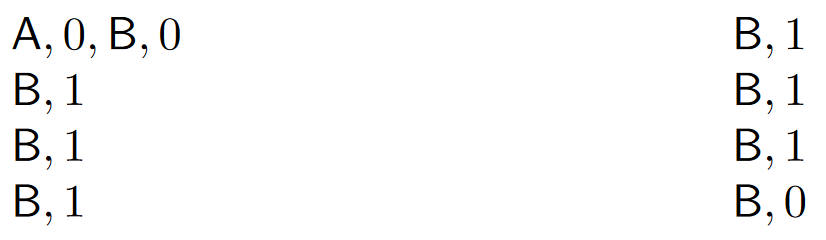
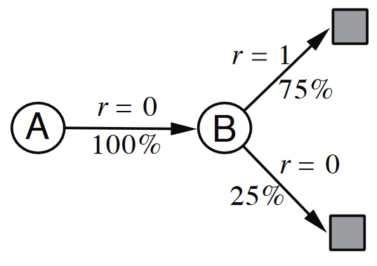
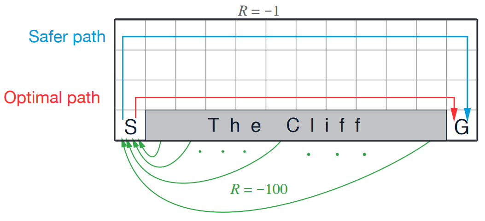

# TD Learning

**TD（Temporal-Difference）learning 是 MC 和 DP 的结合**。像 MC 一样，TD learning **通过采样来更新，不需要用到环境机制**；像 DP 一样，TD learning **在估计价值时可以用上一轮的估计进行更新，而不需要等待整个 episode 的结束**。

> [!TIP|label:提示]
> 这种用估计来更新估计的方式称为 **bootstrap**&mdash;&mdash;learn a guess from a guess。
> 
> **TD 方法结合了 MC 的采样和 DP 的 bootstrap**。

下图展示了 MC 与 TD 的区别：

假设我们要估计从办公室离开到回家的时间，左边使用 MC 算法，右边使用 TD 算法。可以看到，MC 算法会在**从后往前**循环完一个 episode 后对**所有**状态进行价值更新；而 TD 算法则是在从后往前循环的过程中，**每一步都根据上一步的估计进行更新**，比如发现 reach car 的估计是40，leaving office 的估计（30）就会在原有基础上有所增加，因为在 reach car 这个状态下，从 leaving office 到 reach car 之间的时间是已知的，40应当是更准确的估计。

## TD 误差（TD Error）与 TD(0)

从公式的角度来看，我们知道

$$
\begin{aligned}
 V_{\pi}(s) &= \mathrm{E}_{\pi}(G_t|S_t = s) \\
 &= \mathrm{E}_{\pi}[R_t + \gamma V_{\pi}(S_{t+1})|S_t = s] \\
\end{aligned}
$$

**MC 的核心是通过采样估计第一个等式，DP 是根据环境机制迭代估计第二个等式，而 TD 则是对第二个等式进行迭代采样估计**。

回忆 [constant-α MC](rl/4_monte_carlo.md#增量更新与-constant-α-mc)，增量更新的过程为

$$
V(S_t) \leftarrow V(S_t) + \alpha [G_t - V(S_t)]
$$

仿照这个形式，我们可以写出 TD 的增量更新过程：

$$
V(S_t) \leftarrow V(S_t) + \alpha [R_t + \gamma V(S_{t+1}) - V(S_t)]
$$

即样本误差为 $\delta_t := R_t + \gamma V(S_{t+1}) - V(S_t)$，这个误差又被称为 **TD 误差**。

我们可以通过以下方式找到 MC 的样本误差与 TD 误差之间的关系：

$$
\begin{aligned}
 G_t - V(S_t) &= R_t + \gamma G_{t+1} - V(S_t) + \gamma V(S_{t+1}) - \gamma V(S_{t+1}) \\
 &= \delta_t + \gamma (G_{t+1} - V(S_{t+1})) \\
 &= \delta_t + \gamma \delta_{t+1} + \gamma^{2} (G_{t+2} - V(S_{t+2})) \\
 &= \delta_t + \gamma \delta_{t+1} + \gamma^{2} \delta_{t+2} + \cdots + \gamma^{T-t-1} \delta_{T-1} + \gamma_{T-t} (G_{T} - V(S_{T})) \\
 &= \delta_t + \gamma \delta_{t+1} + \gamma^{2} \delta_{t+2} + \cdots + \gamma^{T-t-1} \delta_{T-1} + \gamma_{T-t} (0 - 0) \\
 &= \sum\limits_{k=t}^{T-1} \gamma^{k-t} \delta_k \\
\end{aligned}
$$

这样看似乎用 TD 误差进行更新可以与 constant-α MC 得到一样的的结果，但如果我们每一步都要对 $V$ 做更新，那么**以上等式实际上并不成立**，因为 RHS 中的 $V$ 可能都不相同。在这种情况下，我们只能假设每一次更新对 $V$ 的改变不大，即**用小步长来保证等式的近似成立**。而用单步 TD 误差做更新的学习方式被称作 <strong>TD(0)</strong>，具体算法如下：

- 输入：策略 $\pi$
- 参数：步长 $\alpha \in (0,\ 1]$

1. 随机初始化 $V(s)$，$\forall s \in \mathcal{S}$，$V(\text{terminial}) = 0$；
2. 对每个 episode 循环：
    1. 初始化 $s$；
    2. 对每个时间步循环：
        1. $a \leftarrow \pi(s)$；
        2. 执行动作 $a$，得到 $r,\ s^{\prime}$；
        3. $V(s) \leftarrow V(s) + \alpha [r + \gamma V(s^{\prime}) - V(s)]$；
        4. $s \leftarrow s^{\prime}$；
        5. 如果 $s = \text{terminal}$：
            1. 结束循环。

一般来说，TD(0) 和 constant-α MC 都能渐进收敛到正确的值，但 TD(0) 收敛得比较快。

### Batch 更新（Batch Updating）

如果我们只有很有限的样本可以使用，比如只有10个 episode 或者只有 100 个时间步，那么我们通常会采取 batch 更新的方式来代替单步更新，即**一个 batch 后才更新 $V$**，因为这样能保证 MC 的样本误差与 TD 误差的和一致。然而 constant-α MC 与 TD(0) 在使用 batch 更新的时候可能得到不同的结果。考虑以下8个观测到的 episode：

其中字母代表状态，后面的数字代表到达这个状态后获得的奖励。

对于 $V(B)$，不管是 TD(0) 还是 constant-α MC 应当都会收敛到 $\frac{6}{8} = \frac{3}{4}$；但对于 $V(A)$，两者会给出不同的答案：TD(0) 会根据 $V(B)$ 的估计对 $V(A)$ 进行更新，且会学到状态 $A$ 到 $B$ 的概率为 $1$，因此给出的估计会是 $1 \times \frac{3}{4} = \frac{3}{4}$；constant-α MC 会用样本平均作为估计，即给出的估计是 $0$。

对这个问题建立最大似然模型，我们有

这与 TD(0) 的估计是一致的。因此尽管对于现有的观测（训练集）来说，MC 方法得到的估计拥有最小误差，但 TD 方法得到的估计更有可能在测试集中有好的表现。

## SARSA VS. Q-Learning

### SARSA

将 TD(0) 用在 GPI 的过程当中来估计动作价值，我们可以有如下更新方式：

$$
Q(S_t,\ A_t) \leftarrow Q(S_t,\ A_t) + \alpha [R_t + \gamma Q(S_{t+1},\ A_{t+1}) - Q(S_t,\ A_t)]
$$

更新需要用到 $(S_t,\ A_t,\ R_t,\ S_{t+1},\ A_{t+1})$ 这个五元组，因此这样的更新被称作 **SARSA**。

### Q-Learning

在 SARSA 中，生成样本和策略迭代用的是同一个策略，是 on-policy 的。我们同样也可以用不同策略，即可以有一个 off-policy 的 SARSA：

$$
Q(S_t,\ A_t) \leftarrow Q(S_t,\ A_t) + \alpha \left[R_t + \gamma \underset{a \in \mathcal{A}(S_{t+1})}{\max} ~ Q(S_{t+1},\ a) - Q(S_t,\ A_t) \right] 
$$

这种更新方式被称作 **Q-learning**。

> [!NOTE|label:注意]
> 实际上，Q-learning 的出现比 SARSA 还要早。

可以看到，**在 Q-learning 的更新中，我们在迭代更新的策略是一个贪婪策略，但在生成样本 $(S_t,\ A_t)$ 的时候，我们并没有要求策略的形式**，因此两个策略是不同的。通常情况下，我们会在生成样本的时候采用ε-贪婪策略。

### 应用场景

假设我们想要找到从起点S到终点G的最短路径：

智能体每经过一个格子会得到 $-1$ 的奖励，而如果走到悬崖则会得到 $-100$ 的奖励并返回起点。假设 SARSA 和 Q-learning 的行为策略都是ε-贪婪策略，由于 SARSA 的目标策略也是ε-贪婪的，它最终会学到一个更为安全的路径（上图蓝线）；而 Q-learning 的目标策略是贪婪策略，因此它最终学会的是最优路径（上图红线）。

在现实的应用场景中，**如果我们通过昂贵的机器人来生成样本，假设掉入悬崖就会损失机器人，SARSA 算法会更适用**，因为它得到的策略更为安全，而 Q-learning 尽管最终能学到最优策略，但在**训练**的时候，生成样本用的是ε-贪婪策略，因此在悬崖边上会有概率掉入悬崖，更为危险。而**对于那些我们可以不在意训练成本的任务，Q-learning 通常是更好的选择**。

## 期望 SARSA

在 SARSA 中，如果我们对下一步的 $Q$ 取期望，也就是用下一步的 $V$ 来更新当前的 $Q$，我们就得到了期望 SARSA（expected SARSA）算法：

$$
Q(S_t,\ A_t) \leftarrow Q(S_t,\ A_t) + \alpha [R_t + \gamma \mathrm{E}_{\pi}[Q(S_{t+1},\ A_{t+1}) | S_{t+1}] - Q(S_t,\ A_t)]
$$
