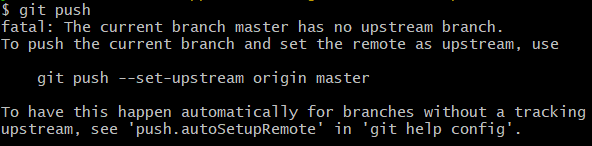
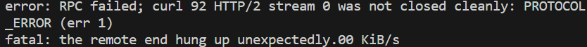
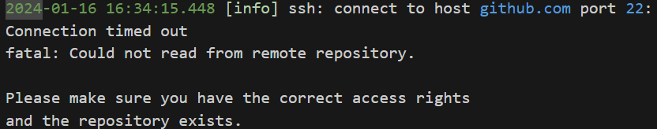

# Git 常用命令与操作流程

## Git 常用命令

### 本地仓库

- `git init`：将当前文件夹变成 git 文件夹。
- `git add + 文件名`：把文件放进缓冲区，可以用 `.` 来代表文件夹下所有文件。
- `git status`：查看当前文件夹下的状态，比如缓冲区中是否有需要 commit 的文件。
- `git commit + (文件名) + -m + (内容)` ：对缓冲区内的所有或指定文件进行 commit，即解释新加的文件或者新做的更改。
- `git reset`：重置缓冲区。
- `git config -l`：列出所有 git 的参数设置。

#### 分支

> 第一个默认分支一般名字为 `master`。

- `git branch -a`：列出所有仓库分支。
- `git branch + 分支名`：新建一个分支。
- `git branch -m + 新分支名`：重命名当前分支。
- `git checkout + 分支名`：切换到指定分支。
- `git checkout -b + 分支名`：新建一个分支并切换到该分支。
- `git merge + 分支名`：合并指定分支到当前分支。

    > [!TIP|label:提示]
    > 通常我们会把 `master` 分支作为主分支，其他分支用来开发新功能，开发完成后再合并到 `master` 分支。因此在合并分支的时候，我们通常会先 `git checkout master` 切换到主分支，然后再 `git merge + 分支名` 把指定分支合并进来。

- `git branch -D + 分支名`：本地删除指定分支。
- `git push origin --delete + 分支名`：删除远程分支。

    > [!TIP|label:提示]
    > 删除远程分支后，如果在本地使用 `git branch -a` 依旧能看到，可以使用 `git remote prune + 远程主机名` 来清理本地分支，远程主机名通常为 `origin`。


### 本地仓库与远程仓库交互

> 远程主机名通常为 `origin`。

- `git config (--global) user.name + 用户名`：（全局）设置用户名。
- `git config (--global) user.email + 邮箱`：（全局）设置邮箱。
- `git config --global fetch.prune true`：设置拉取时自动清理已被删除的远程分支。

    > [!TIP|label:提示]
    > 这个设置是为了防止删除了远程分支后其他人不知道，没有 prune 就 push，导致 pull 下来发现被删除的分支重新出现。

- `git clone + 远程仓库链接`：将远程仓库整个克隆到本地。
- `git remote -v`：列出所有远程主机以及对应 url。
- `git remote add + 远程主机名 + 远程仓库链接`：把当前文件夹与远程仓库连接起来，并给它命名一个代号，通常我们会将它命名为 `origin`，因为使用 `git clone` 命令时 git 会自动命名远程主机为 `origin`。

    > [!TIP|label:提示]
    > 当我们 fork 了一个仓库，然后想要将它的更新同步到我们的仓库时，我们需要额外添加一个远程主机，通常我们会将它命名为 `upstream`。

- `git remote set-url + 远程主机名 + 远程仓库链接`：修改远程仓库的 url。
- `git push (-u) + (远程主机名) + (本地分支名)`：将本地仓库推送到远程。第一次推送需要用 `-u` 指令，之后就不需要了；如果本地和远程存在追踪关系且只有一个分支，主机名和分支名都可以省略。
- `git pull + (远程主机名) + (远程分支名)`：将远程仓库的内容下拉到本地并与本地分支合并，如果存在追踪关系且只有一个分支，主机名和分支名都可以省略。

## Git 常用操作流程

### 克隆项目

1. git clone + 远程仓库链接

### 将本地文件夹上传到远程仓库

1. 远程新建一个仓库
2. `git init`
3. `git add .`
4. `git commit -m "first upload"`
5. `git remote add origin + 远程仓库链接`
6. `git push -u origin master`

### 将远程仓库下拉到本地

1. `git init`
2. `git remote add origin + 远程仓库链接`
3. `git pull origin master`

### 本地更新上传远程

1. `git commit -m "update"`
2. `git push`

### 本地下拉远程更新

1. `git pull`

### 向远程添加 ssh 公钥（git 远程连接免密）

1. `cd ~/.ssh`
2. `ssh-keygen -t rsa -C "Comment"`
   
   > [!TIP|label:提示]
   > `Comment` 可以是任意内容，用来区分不同的公钥。由于不同设备可能会用到不同的公钥，所以可以用设备名，比如服务器 IP 等来作为 `Comment`。

3. 一直回车（如果之前已有公钥 id_rsa 的话，提示是否 overwrite 的时候需要输 `yes` 而不能回车）
4. `cat id_rsa.pub`
5. 复制输出的公钥
6. 打开 github / gitlab / gitee 的设置，找到 ssh public key 之类的选项，添加公钥，将刚刚复制的公钥粘贴即可

#### 多 git 平台免密

有时候可能会使用多个 git 平台，比如 github 和 gitee，这时候上面的做法只能让我们在一个平台上免密，另一个平台如果还用同一个公钥的话就依旧需要输入密码。这时候可以生成另一个公钥私钥对，然后通过在 config 中指定 IdentityFile 来指定使用哪个私钥。假设我们已经用上面的步骤为 github 配置了免密，接下来要为 gitee 配置免密：

1. `cd ~/.ssh`
2. `ssh-keygen -t rsa -f id_rsa_gitee -C "Comment"`
3. 一直回车
4. `cat id_rsa_gitee.pub`
5. 复制输出的公钥
6. 打开 gitee 的设置，找到 ssh public key 之类的选项，添加公钥，将刚刚复制的公钥粘贴
7. `touch config`：在 `~/.ssh` 下新建一个 `config` 文件
8. `vim config`：编辑 `config` 文件，添加以下内容：

    ```bash
    Host github.com
        HostName github.com
        User git
        IdentityFile ~/.ssh/id_rsa
    Host gitee.com
        HostName gitee.com
        User git
        IdentityFile ~/.ssh/id_rsa_gitee
    ```

    > [!TIP|label:提示]
    > 尽管 `Host` 可以随意命名，但是最好还是命名为对应 git 平台的域名，这样在直接复制 clone 语句的时候就不需要修改了。

这样就实现了在不同 git 平台上使用不同的公钥私钥对，从而实现了多 git 平台免密。

### 修改上次 commit 的信息

1. `git commit --ammend`
2. 修改信息并保存退出
3. `git push -f`

## 常见问题与解决方案

### 无法 push / pull

有时候我们 commit 完之后 push 遇到如下问题（比如在 VSCode 的非当前文件夹下进行 commit & push）：

<div align='center'>


</div align='center'>

一个解决方案就是重新上传一个同名分支覆盖掉原先的分支：

1. `git push -u origin head`

即使正常操作，pull/push 的时候还有可能遇到如下问题（未知原因）：

<div align='center'>


</div align='center'>

此时应该改用 ssh 而不是 http 作为传输方式：

1. `git remote set-url origin + 远程仓库 SSH 链接`
2. `git pull / git push origin master`

改用 ssh 需要在远程有 ssh 公钥，具体添加方法见[Git常用操作流程](#向远程添加-ssh-公钥)。

还有可能遇到如下问题（未知原因）：

<div align='center'>


</div align='center'>

既然说是 SSH 连不上，那我们就可以看看怎样能连上。根据 [github docs](https://docs.github.com/en/authentication/troubleshooting-ssh/using-ssh-over-the-https-port)：

1. 检查是否真的连不上：`ssh -Tv git@github.com`
2. 检查是否能用 SSH 连上 HTTPS 的端口：`ssh -T -p 443 git@ssh.github.com`
3. 如果可以连上 HTTPS（443）端口，则在 `~/.ssh/config` 中添加如下内容：

    ```bash
    Host github.com
        Hostname ssh.github.com
        Port 443
        User git
    ```

4. 检查现在是否能连上：`ssh -Tv git@github.com`

如果能连上了，就可以试着重新进行 push/pull 了。