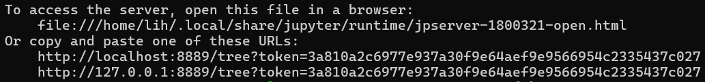
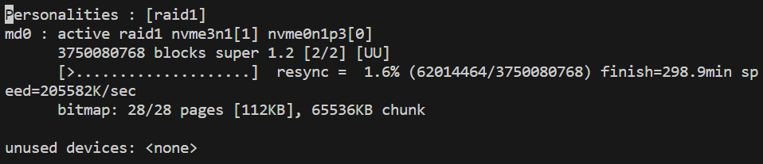
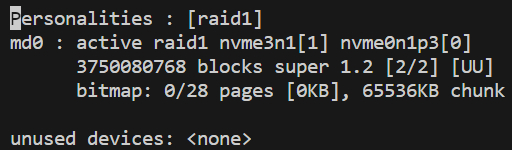

# Ubuntu 命令

> [!TIP|label:提示]
> 在 Windows 下其实也可以使用 Ubuntu 命令，只要安装了 git 即可。在文件夹下打开 git bash 就能使用 Ubuntu 命令。

## 常用

以下是所有用户都常用的命令。

### 文件与目录

- `cd dirName`：进入某个目录（`.` 代表当前目录，`..` 代表上一层目录，`~` 代表根目录，`-` 代表上一个进入的目录）

    > [!TIP|label:提示]
    > 如果想要进入的目录有空格，可以用 `\` 转义，或者用 `''` 包裹。比如要进入的目录名叫 `dir Name`，则使用 `cd dir\ Name` 或者 `cd 'dir Name'`。
    > 
    > 如果想要进入的目录开头是 `-`，可以用 `--` 来区分，或者在前面加上 `./`。比如要进入的目录名叫 `-dirName`，则使用 `cd -- -dirName` 或者 `cd ./-dirName`。

- `ll`：列出当前目录下所有文件及其权限

    > [!TIP|label:提示]
    > `ll` 其实是 `ls -alF` 的别名，可以在 `~/.bashrc` 文件中自行设定。这些参数的含义是：`-a` 代表显示所有文件（包括隐藏文件），`-l` 代表显示详细信息，`-F` 代表在文件名后面加上文件类型的标识符，比如 `/` 代表目录，`*` 代表可执行文件。
    > 
    > 如果想按时间排序（最新的在最前面），可以加 `-t` 参数；如果想倒序，则可以加 `-r` 参数。比如 `ll -rt` 就可以在最下面显示最新的文件。

- `mkdir dirName`：创建目录
- `touch fileName`：创建文件
- `cp (-r) fileNameOrDirName dirName`：复制文件（或目录，目录需要加 `-r` 参数）到某个目录内
- `mv fileNameOrDirName dirName`：移动文件（或目录）到某个目录内，也可以用来重命名
- `scp (-r) fileNameOrDirName targetDirName`：在设备之间传输文件（或目录，目录需要加 `-r` 参数）

    > [!TIP|label:提示]
    > 如果文件比较大，可以用 `scp -C` 来压缩传输。

- `rsync -avzP fileNameOrDirName targetDirName`：同步文件（或目录），`-a` 能保留文件属性，`-v` 代表显示详细信息，`-z` 代表压缩传输，`-P` 代表显示传输进度。

    > [!TIP|label:提示]
    > `rsync` 比起 `scp` 的好处是可以对比文件内容，只传输有变化的文件。

- `rm fileName`：删除文件
- `rm -rf dirName`：删除目录（`-f` 代表强制删除不存在的文件）
    
    > [!WARNING|label:警告]
    > `rm -rf` 属于高危操作，可能导致误删。

    > [!TIP|label:提示]
    > 可以通过结合使用 `grep` 和 `xargs` 来批量删除文件/目录，比如 `ls | grep test | xargs -d '\n' rm` 代表删除所有包含 `test` 的文件。其中 `xargs -d '\n'` 代表删除输出中的换行符。

- `find dirName -name expressQuery`：按名字在某目录下查找文件，`expressQuery` 可以使用正则表达式，不写 `dirName` 则默认当前目录
- `ln -s fileName dirName`：将某个文件软链接到某目录下
- `du -sh dirName/fileName`：查看目录/文件占用内存
- `du -h dirName`：查看目录内所有文件占用内存
- `strings fileName`：将二进制文件或可执行文件以人类可读的语言输出
- `zip -r zipName.zip dirName`：将某目录压缩为 zip 文件
- `unzip (-n) (-d dirName) zipName.zip`：解压 zip 文件（`-n` 代表不覆盖已有文件，`-d` 代表解压到指定目录）
- `gzip (-k) fileName`：压缩单个文件为 gz 文件（`-k` 代表保留原文件，如果不加 `-k` 则会删除原文件）
- `gzip -(k)d fileName.gz`：解压 gz 文件（`-k` 代表保留原文件，如果不加 `-k` 则会删除原文件）
- `tar -czvf tarName.tar.gz dirName`：将某目录压缩为 tar.gz 文件
- `tar -xzvf tarName.tar.gz`：解压 tar.gz 文件

    > [!TIP|label:提示]
    > `tar` 命令中的 `c` 代表创建，`x` 代表解压，`z` 代表使用 `gzip` 压缩，`v` 代表显示详细信息，`f` 代表文件名。

### 进程

- `top`：查看 CPU 内存占用（动态变化）
    - `0`：显示/不显示 `0`
    - `1`：显示每个 CPU 的使用情况

        > [!TIP|label:提示]
        > CPU 使用情况的各个字段含义如下：`us` 代表用户空间占用 CPU 的百分比，`sy` 代表内核空间占用 CPU 的百分比，`ni` 代表用户进程空间内改变过优先级的进程占用 CPU 的百分比，`id` 代表空闲 CPU 的百分比，`wa` 代表等待输入输出的 CPU 时间百分比，`hi` 代表硬中断占用 CPU 的百分比，`si` 代表软中断占用 CPU 的百分比。

    - `2`：显示进程详细信息（默认）
    - `f`：设定显示的列或者排序的列（方向键选中列后按 `d` 是 display 显示，按 `s` 是 sort 从大到小排序）
    - `u`：输入用户名可以查看某个用户的进程
    - `o`：添加过滤条件，比如 `PID=1234` 可以查看 `1234` 这个进程
    - `Ctrl + O`：查看当前过滤条件
    - `=`：取消所有过滤条件
    - `n`：设置显示进程的数量
    - `q`：退出 `top`
- `nvdia-smi (-i GPUNumber)`：查看 GPU 内存占用（静态）（`-i` 代表只看某张卡的情况）

    > [!TIP|label:提示]
    > 如果想像 `top` 那样看动态变化的 GPU 内存占用，需要用 `-l` 参数，后面接动态变化的秒数（多少秒变一次），比如 `nvidia-smi -l 5` 代表 5 秒更新一次。

### 查询

- `... | grep Target`：查找指定信息，比如：
    - `ll | grep parquet`：查找包含 parquet 字样的文件和目录
    - `dpkg -l | grep libicu`：查找包含 libicu 字样的包信息
    - `conda list | grep stringi`：查找包含 stringi 字样的 conda 包

    > [!TIP|label:提示]
    > 还可以用 `grep -v` 来排除某些信息，比如 `ll | grep -v parquet` 代表查找不包含 parquet 字样的文件和目录。而如果要用正则表达式，可以用 `grep -E`，比如 `ll | grep -E 'parquet|csv'` 代表查找包含 parquet 或 csv 字样的文件和目录。

- `... | wc -l`：统计行数，比如：
    - `ll | wc -l`：统计当前目录下文件和目录的数量（包括 `...total...` `.` 和 `..` 这 3 行，所以要减 3）

    > [!TIP|label:提示]
    > `wc` 是 `word count` 的缩写，可以和 `grep` 一起使用，比如 `ll | grep parquet | wc -l` 代表查找包含 parquet 字样的文件和目录的数量。

- `which commandName`：查找某一指令所在的路径，比如：
    - `which python`：查找 python 路径

### 其他

- `ssh-keygen -t rsa -C "Comment"`：生成公钥，`-t rsa` 指定了公钥类型，`-C "Comment"` 则是添加注释（把 `Comment` 替换成你想加的注释），以免之后有多个公钥弄混。
- `ssh-keygen -c`：修改公钥的注释
- `ssh-copy-id userName@remoteIP`：将本地的公钥复制到远程服务器上

    > [!TIP|label:提示]
    > 大多数人本地都是 Windows，`ssh-keygen` 是有的，但 `ssh-copy-id` 没有，如果要手动复制到远程，略有些麻烦，可以用 `git bash` 来执行 `ssh-copy-id`。

- `jupyter notebook --no-browser --port=portNumber`：启动 jupyter notebook，`--no-browser` 代表不自动打开浏览器，`--port` 代表指定端口号，`portNumber` 可以设成 `8889`。

    > [!TIP|label:提示]
    > 如果遇到 VSCode 无法使用，又想远程使用 jupyter notebook，则可以遵照以下步骤：
    > 
    > 1. 开一个 cmd 连上远程服务器后执行上述命令，cmd 不要关掉；
    > 2. 再开多一个 cmd，用 `ssh -N -L localPort:localhost:remotePort userName@remoteIP` 来建立本地端口和远程端口的映射，`-N` 代表不执行其他命令，`-L` 代表端口映射，`localPort` 可以是 `8888`，这个 cmd 可以关掉；
    > 3. 在本地浏览器输入 `localhost:localPort` 即可访问远程服务器上的 jupyter notebook；
    > 4. 如果需要输入 token（第一次登陆），可以在第一个 cmd 中看到，即执行第一步时会有一些输出，其中有一个类似下图的信息：
    > 
    >     <div align='center'>
    > 
    >     
    >     </div align='center'>
    > 
    >     其中的 `token=` 后面的一长串就是 token，输入到浏览器的输入框中即可。
    > 
    
    > [!NOTE|label:注意]
    > 记得需要 `conda activate envName` 切换到对应的环境后再执行 `jupyter notebook`。且在哪个目录执行就会只显示哪个目录的文件，不会有父目录的文件。

### 按键命令

- `Ctrl + C`：终止命令
- `Ctrl + R`：查找之前输过的命令
- `Ctrl + Z`：暂停命令
    - `jobs`：查看当前暂停的任务
    - `fg jobNumber`：恢复执行任务

## 管理员常用

### su vs. sudo

`su` 代表切换到 root 账户，而 `sudo Command` 代表以某个用户（通常是 root）的权限执行某个命令 `Command`。前者需要 root 用户的密码，后者则只需要当前用户的密码。

通常并不需要使用 `su`，`sudo` 就够用了。即使需要使用多条命令也并不需要每条命令都输密码，`sudo` 会记住密码一段时间，一般是 5 分钟。只有在需要使用 `cd` 进入 root 目录时才需要使用 `su`。

并非所有用户都有 `sudo` 权限，需要管理员手动添加。具体方法是使用 `sudo visudo`，有很多可以自定义的，语法参考 [Linux Fundamentals: A to Z of a Sudoers File.](https://medium.com/kernel-space/linux-fundamentals-a-to-z-of-a-sudoers-file-a5da99a30e7f)。一般只需要写一个 User_Alias 赋予 `sudo` 权限，在 User_Alias 后面加新的用户即可。保存的时候先 `Ctrl + O` write out，然后 `Enter` 确认名字，默认输出到 `/etc/sudoers.tmp`（会自动 `mv` 到 `/etc/sudoers`），然后 `Ctrl + X` 退出。

> [!NOTE|label:注意]
> 以下命令大部分都需要 root 权限。

### 用户

- `passwd userName`：为某个用户重设密码

    > [!WARNING|label:警告]
    > `sudo passwd` 修改的是 root 的密码。

- `adduser --ingroup groupName userName`：添加用户并加入某组
- `deluser --remove-all-files userName`：删除用户以及用户的所有文件

    > [!TIP|label:提示]
    > 删除的时候会有很多 warnings，无视即可。

- `addgroup groupName`：添加组
- `delgroup --only-if-empty groupName`：（仅当组里没有用户时）删除组
- `usermod -aG groupName userName`：将某用户加入某组，`-a` 代表添加（append），`-G` 代表组

    > [!NOTE|label:注意]
    > 如果用户已经登录，需要重新登录才能生效。或者可以使用 `newgrp groupName` 来切换组，这在 tmux session 中很有用。

- `deluser userName groupName`：将某用户从某组中删除

    > [!TIP|label:提示]
    > 无法从初始组中删除，只能用 `usermod -g newGroupName userName` 修改用户的初始组为新的组。

- `cat /etc/passwd`：查看所有用户
- `cat /etc/group`：查看所有组
- `groups userName`：查看某用户所在的组
- `getent group groupName`：查看某组有哪些用户

    > [!TIP|label:提示]
    > `getent` 是 “get entries” 的缩写，用来获取某个数据库的条目，比如 `/etc/passwd`、`/etc/group` 等等，所以 `getent group groupName` 实际上是访问 `etc/group` 取了对应的条目。同理可以通过 `getent passwd userName` 查看某个用户的信息。
    > 
    > 对于初始组是 `groupName` 的 `userName` 来说，`getent group groupName` 并不会显示该用户，但可以通过 gid 来判断，比如 `getent group groupName` 的输出中有一串数字，我们叫它 `gidNumber`，那么就可以通过 `cat /etc/passwd | grep gidNumber` 来找到对应的用户。

### 权限

- `chmod modeNumber dirName/fileName`：更改目录/文件的权限

    > [!TIP|label:提示]
    > `modeNumber` 由三位数构成，第一位代表拥有者权限，第二位代表拥有组权限，第三位代表组外其他用户的权限。`4` 代表可读（r），`2` 代表可写（w），`1` 代表可执行（x），数字相加即为权限叠加，比如 `7` 代表拥有 rwx 权限，最放松的权限就是 `777`。通常目录都是可执行的，而文件是不可执行的，因此对于目录来说，默认权限是 `755`；对于文件来说，默认权限是 `644`。
    > 
    > 本地文件上传服务器时如果是 root 权限就没法传，需要先放松权限，上传后再改回来。

- `chmod -R modeNumber dirName`：更改目录下所有文件的权限
- `chmod g+s dirName`：设置目录的默认组为父目录的默认组，即在该目录下新建的文件/文件夹的默认组为该目录的默认组。

    > [!EXAMPLE|label:例子]
    > 比如一个目录的 owner 是 `user:data`，即默认组是 `data`，在 `chmod g+s` 之前，在这个目录下新建文件的默认组就是 `user`，而在 `chmod g+s` 之后，新建文件的默认组就是 `data`。

- `chown userName:(groupName) fileName`：更改文件的拥有者和拥有组（不写 `groupName` 则为拥有者的默认组）
- `chown -R userName:(groupName) dirName`：更改目录及目录下所有文件的拥有者和拥有组
- `setfacl -m u:userName:rwx fileName`：设置某个用户在某个文件的权限

    > [!TIP|label:提示]
    > `rwx` 可以替换成 `r`、`w`、`x` 的组合，比如 `rx`、`rw` 等等，如果限制所有权限，可以用 `-`。
    > 
    > 如果设置的是组权限，用 `g:groupName` 替换 `u:userName`。

- `setfacl -Rm u:userName:rwx dirName`：设置某个用户在某个目录下所有文件的权限
- `getfacl fileName/dirName`：查看某个文件/目录的权限

### 进程

- `kill -9 PID`：强制终止某个进程
- `pkill -9 processName`：强制终止某个进程（根据进程名）
- `renice -n -20 -p PID`：将某个进程的优先级调到最高。
- `nvidia-smi -pm 1`：开启 GPU 持久模式，即 GPU 不会在空闲时自动降频，也不需要在启动时预热。`0` 的话是关闭。

### 系统

- `uname -r`：查看 Linux 内核版本
- `lsb_release -a`：查看系统版本
- `lscpu`：查看 CPU 信息
- `lspci | grep -i nvidia`：查看 GPU 型号

    > [!NOTE|label:注意]
    > 如果并没有显示型号，而是显示 `NVIDIA Corporation Device 2204` 之类的东西，这可能是因为 `/usr/share/misc/pci.ids` 文件没有更新，可以使用 `sudo update-pciids` 更新一下。

- `ipmitool lan print 1`：查看服务器 IPMI 信息

    > [!NOTE|label:注意]
    > 如果没有安装 `ipmitool`，可以用 `apt-get install ipmitool` 安装。
    > 
    > 必须要 `sudo`，不然只会说 `Could not open device at /dev/ipmi0 or /dev/ipmi/0 or /dev/ipmidev/0: No such file or directory`。
    > 
    > 默认的 IP 地址是 `192.168.1.2`，这只能在服务器上本地连接，如果想要远程连接，需要再设置一个公网（内网）IP。

- `shutdown -h now`：立刻关机（`now` 其实等价于 `+0`，即延迟 0 分钟，同理 `+1` 代表延迟 1 分钟）
- `reboot`：重启

### 安装

- `apt-get update`：更新软件源（但不更新软件）

    > [!TIP|label:提示]
    > 如果遇到 GPG error，可能是公钥过期了，可以用 `apt-key adv --keyserver keyserver.ubuntu.com --recv-keys keyNumber` 来更新公钥，其中的 `keyNumber` 可以在错误信息中找到。
    
- `apt-get upgrade`：升级软件
- `apt-get install packageName`：安装软件
- `apt-get remove --purge packageName`：卸载软件
- `apt-get autoremove`：卸载不需要的软件
- `apt-mark hold/unhold packageName`：锁定/解锁软件，锁定后软件不会被升级

> [!TIP|label:提示]
> 通常我们会执行三个步骤来更新软件：
> 
> 1. `apt-get update`
> 2. `apt-get upgrade`
> 3. `apt-get autoremove`
>
> 可以加 `-y` 参数来自动确认所有需要确认的地方；也可以加 `-f` 参数来修复依赖问题。

### 存储

- `df -aTh`：查看磁盘空间
- `du -sh * | sort -nr | head -n 10`：查看物理内存占用最多的 10 个文件夹
- `lsblk`：查看各个内存块的基本信息（内存和挂载点）
- `blkid`：查看各个内存块的 UUID 和文件系统
- `fdisk -l`：查看所有磁盘
- `mkfs.ext4 /dev/deviceName`：格式化某个设备为 ext4 文件系统
- `mkfs.xfs /dev/deviceName`：格式化某个设备为 xfs 文件系统
- 查看文件系统
- `pvcreate /dev/deviceName`：创建物理卷
- `vgcreate vgName /dev/deviceName`：创建卷组
- `lvcreate -L size -n lvName vgName`：创建逻辑卷

    > [!TIP|label:提示]
    > `size` 可以是 `1G`、`100M` 等等，代表大小。也可以用 `lvcreate -l 100%FREE -n lvName vgName` 来使用所有剩余空间。

- `pvdisplay/vgdisplay/lvdisplay`：查看物理卷/卷组/逻辑卷
- `pvremove /dev/deviceName`：删除物理卷
- `vgremove vgName`：删除卷组
- `lvremove /dev/vgName/lvName`：删除逻辑卷

> [!TIP|label:提示]
> 一般来说，我们会先用 `fdisk -l` 查看所有磁盘，然后用 `mkfs.ext4` 或者 `mkfs.xfs` 格式化某个设备，再用 `pvcreate` 创建物理卷，`vgcreate` 创建卷组，`lvcreate` 创建逻辑卷。这么做的目的是为了更好地管理磁盘空间，比如可以将多个磁盘合并成一个逻辑卷，再将逻辑卷挂载到某个目录下。

#### 挂载

- `mount /dev/deviceName dirName`：将某个设备挂载到某个目录下
- `umount dirName`：卸载某个目录下的设备

    > [!TIP|label:提示]
    > 如果显示 `device is busy`，首先确定是否处在这个挂载的文件夹下，如果并没有，则可以用 `umount -l dirName` 来强制卸载。

- `vim /etc/fstab`：打开 `fstab` 文件，可以设置开机自动挂载，最好用 UUID 来指定设备，因为设备名可能会变
- `mount -a`：挂载 `fstab` 中所有设备。
- `sshfs -o allow_other,default_permissions,uid=userIDNumber,gid=groupIDNumber userName@remoteIP:remoteDirName localDirName`：挂载远程服务器的目录到本地

    > [!TIP|label:提示]
    > 一般默认没有安装 `sshfs`，需要先安装，可以用 `apt-get install sshfs` 安装。
    > 
    > `allow_other` 代表允许其他用户访问，`default_permissions` 代表使用默认权限，`uid` 和 `gid` 填写挂载后的 owner user/group 的 id，可以通过 `cat /etc/passwd` 和 `cat /etc/group` 查到，这些参数之间的逗号后面不能有空格！如果不填 `uid` 和 `gid` 的话，挂载后的 owner 可能有问题（不是你想要的）。
    > 
    > `localDirName` 代表本地目录，通常我们会在本地的 `/mnt` 文件夹下创建一个文件夹作为远程文件夹的载体。
    > 
    > 卸载的时候跟其他设备相同，用 `umount localDirName` 即可。

### 端口与服务

- `lsof -i:portNumber`：查看某个端口的占用情况
- `systemctl start/stop serviceName`：启动/停止服务
- `systemctl enable/disable serviceName`：开机自启/禁止开机自启
- `systemctl status serviceName`：查看服务状态

#### 网络

> 一般管理网络的服务是 `systemd-networkd` 或者 `NetworkManager`，前者是 `systemd` 的网络管理服务，后者是 `GNOME` 的网络管理服务，两者不能同时运行。

- `networkctl`：查看网络状态（`systemd-networkd`）
- `nmcli`：查看网络状态（`NetworkManager`）
- `systemd-resolve --status`：查看 DNS 信息

#### 防火墙

- `ufw enable`：开启防火墙
- `ufw status (numbered)`：查看防火墙状态（如果要显示规则编号可以加 `numbered`，在删除的时候比较方便看）
- `ufw allow portNumber`：允许连接到某个端口

    > [!TIP|label:提示]
    > 端口示例：
    > 
    > - http（80）
    > - https（443）
    > - ssh（22）
    > - ftp（21）
    > - mysql（3306）
    > - mongodb（27017）
    > 
    > 通常我们会允许 ssh 连接，可以用 `ufw allow ssh` 或者 `ufw allow 22`。当然，如果 ssh 端口不是 22，可以把 `22` 改成对应的端口号。

- `ufw allow from IP to any port portNumber`：允许某个 IP 访问某个端口
  
    > [!TIP|label:提示]
    > 可以通过把 IP 的最后一位改成 `0/24` 来允许某个网段的 IP 访问。

- `ufw delete ruleNumber`：删除某个规则

### Bash 脚本

- `#!/bin/bash`：脚本的开头，指定解释器。
  
  > [!TIP|label:提示]
  > 其实通常可以不加，但有些特殊情况，比如要用 python 调用这个脚本，不加可能就会有问题（没试过）。

- `set -e`：脚本设置，如果某一行执行失败，则整个脚本就会停止执行。
- `set -x`：脚本设置，打印每一行执行的命令。
- `echo "String"`：输出字符串，相当于 python 的 `print`。

## 一次性工作

以下是一些一次性的过程，比如安装某个软件、配置某个环境等等。

### 挂载扩容（更换硬盘）

参考[Linux系统把/home重新挂载到其他硬盘或分区](https://blog.csdn.net/bingxinyang123/article/details/123567966)。

假设要把挂载在 `/data3` 上的硬盘换到 `/home` 上，

1. `df -aTh`：查看当前挂载情况，找到 `/data3` 的挂载设备名，比如 `/dev/nvme3n1p1`；
2. `sudo rsync -aXS /home/. /data3/.`：将 `/home` 下的所有文件复制到 `/data3` 下，保证文件权限、所有者等不变；

    > [!TIP|label:提示]
    > `rsync` 比起 `cp` 的好处是可以保留文件的权限、所有者等信息，且会比较文件内容，只复制有变化的文件。

3. `sudo mv /home /home_old`：将原来的 `/home` 改名为 `/home_old`；
4. `sudo mkdir /home`：新建 `/home` 目录；
5. `sudo umount /data3`：卸载 `/data3`；
6. `sudo mount /dev/nvme3n1p1 /home`：将 `/dev/nvme3n1` 挂载到 `/home`；
7. `sudo vim /etc/fstab`：打开 `fstab` 文件，将 `/data3` 的挂载信息改为 `/home` 的挂载信息。
8. `rm -rf /home_old`：确认挂载没问题后，删除 `/home_old`。

### 软件 RAID1

假设有两块硬盘（或分区） `/dev/sda` 和 `/dev/sdb`，你想将他们组成 RAID1 来实现自动备份：

1. `apt-get install mdadm`：安装 `mdadm`；
2. `blkid devName`：分别检查两块硬盘是否有文件系统，`devName` 为设备名，比如 `/dev/sda`；
    - 如果有文件系统，需要执行 `wipefs --all devName` 来清除文件系统。
3. `mdadm --create /dev/md0 --level=1 --raid-devices=2 /dev/sda /dev/sdb`：使用 `mdadm` 组建名为 `md0` 的 RAID1，`--level` 指定了 RAID 的级别，`--raid-devices` 指定了用来组建 RAID1 的磁盘数量；

    > [!NOTE|label:注意]
    > 可能会出现如下提示 `Note: this array has metadata at the start and may not be suitable as a boot device. If you plan to store '/boot' on this device please ensure that your boot-loader understands md/v1.x metadata, or use --metadata=0.90 Continue creating array?` 一般都是可以支持 `md/v1.x metadata` 的，所以直接 `y` 就好了。

4. `vim /proc/mdstat`：查看 RAID1 的创建状态；

    <div align='center'>

    
    </div align='center'>

    > [!ATTENTION|label:注意]
    其中的 `resync = 1.6\%` 代表已经同步了 1.6\%，等同步完才可以进行下一步！

    <div align='center'>

    
    </div align='center'>

5. `mkfs.ext4 /dev/md0`：将建好的 RAID1 格式化为文件系统，比如 `ext4`；
6. `mount /dev/md0 dirName`：将 RAID1 挂载到某文件夹下；
7. `vim /etc/fstab`：打开 `fstab` 文件，里面记录了系统启动时需自动挂载的挂载点信息；
   - 模仿已有的挂载点添加一行新的自动挂载信息，比如 `/dev/md0 dirName ext4 defaults 0 1`。

#### 解决重启后 RAID1 名字变化导致无法挂载的问题

之前创建的 RAID1 名字是 `/dev/md0`，但是重启后可能会变成其他名字，比如 `/dev/md127`，导致无法挂载，如果挂载的是 `/home`，还可能导致 VSCode 无法登录（但 cmd 可以）。解决方法如下：

1. `vim /proc/mdstat`：查看 RAID1 的当前名字；
2. `vim /etc/fstab`：修改 `fstab` 文件，将 RAID1 的名字改为当前的名字；
3. `shutdown -r now`：重启。

### 安全删除硬盘内容（保护隐私防恢复）

参考：[StackExchange: SSD Erasure verification](https://security.stackexchange.com/questions/171396/ssd-erasure-verification)

实现过一次，但最终效果是 `df -aTh` 显示硬盘空间是满的，而 `du -sh` 显示硬盘空间是空的，应该是安全删除了，但不知道影不影响后续使用。具体步骤如下：

1. `hdparm -I /dev/sda | grep -A8 "^Security:"`：查看硬盘是否支持安全删除（“not locked”，“not frozen”，“supported: enhanced erace”）；
2. `yes "You should not see me" > /dev/sda`：将硬盘内容填充为 “You should not see me”；
3. `hdparm --security-set-pass NULL /dev/sda`：设置硬盘密码为空值；
4. `hdparm --security-erase-enhanced NULL /dev/sda`：安全删除硬盘内容。
5. `strings /dev/sda | grep "You should not see me"`：查看硬盘内容是否被填充（然而在步骤 3 之前就已经填充了，输出跟步骤 4 之后是一样的，不知道在这里检查这么一步是要干嘛）。

同样地还有一种填充方式，即 `dd if=/dev/urandom of=/dev/sda bs=1M`，这种方式是用随机数填充硬盘内容，不知道和上面的方式有什么区别。

### Nvidia 与 CUDA

#### 安装 Nvidia 驱动

参考：
- [CSDN：超全超详细的安装nvidia显卡驱动教程](https://blog.csdn.net/sinat_34686158/article/details/106845208)
- [NVIDIA drivers installation](https://ubuntu.com/server/docs/nvidia-drivers-installation)

1. 如果出现与系统自带的 `nouveau` 驱动冲突，则需要先禁用，具体见第一个参考链接；没冲突就不用管，因为官方并没有对这方面做要求；
2. `sudo apt-get remove --purge nvidia*`：卸载之前安装的 Nvidia 驱动；
3. `ubuntu-drivers devices`：查看可用的 Nvidia 驱动版本，在推荐的版本后面会显示 `recommended`；
4. `sudo ubuntu-drivers autoinstall`：安装推荐的 Nvidia 驱动版本；
5. 重启；
6. `nvidia-smi`：如果正常显示则安装成功。

如果重启后 `nvidia-smi` 仍无法正常显示，执行 `nvidia-smi -L` 显示 `GPU...: not found` 的话，可以试试卸掉现有驱动，重装 `non-open` 的驱动版本。比如原本装的是 `535-server-open`，可以改成装 `535-server`，具体步骤如下：

1. `sudo apt-get remove --purge nvidia*`：卸载之前安装的 Nvidia 驱动；
2. `ubuntu-drivers devices`：查看可用的 Nvidia 驱动版本，找到不带 `open` 字样的驱动版本；
3. `sudo ubuntu-drivers install --gpgpu nvidia:535-server`：安装指定的 Nvidia 驱动版本，这里以 `535-server` 为例；
4. `sudo apt install nvidia-utils-535-server`：安装额外的驱动包，不然用不了 `nvidia-smi` 指令；
5. 重启；
6. `nvidia-smi`：如果正常显示则安装成功。

#### 升级 CUDA

[CUDA Toolkit Archive](https://developer.nvidia.com/cuda-toolkit-archive) 里面有各个版本的 cuda 下载链接，选择对应版本和系统后选择 `runfile` 进行下载和安装。安装的时候如果已经有 `nvidia driver` 了，则取消勾选 `nvidia driver`。

#### NVCC 与 CUDA 版本不一致

如果安装了新版本的 cuda，但是 `nvcc -V` 显示的 cuda 版本不是最新的，可以尝试添加 cuda 环境变量：

1. `vim ~/.bashrc`：打开 `.bashrc` 文件；
2. 在文件末尾添加 

    ```bash
    export PATH=/usr/local/cuda/bin${PATH:+:${PATH}}
    export LD_LIBRARY_PATH=/usr/local/cuda/lib64${LD_LIBRARY_PATH:+:${LD_LIBRARY_PATH}}
    export CUDA_HOME=/usr/local/cuda
    ```

    > [!TIP|label:提示]
    > 当你想使用老版本的 cuda 而非新版本的 cuda，可以将 `export PATH=/usr/local/cuda/bin${PATH:+:${PATH}}` 改为 `export PATH=/usr/local/cuda-10.0/bin${PATH:+:${PATH}}`，其中 `10.0` 是你想要的 cuda 版本号，前提是 `/usr/local` 下有对应版本的 cuda 文件夹。`LD_LIBRARY_PATH` 和 `CUDA_HOME` 同理。
    > 
    > `${PATH:+:${PATH}}` 的意思是如果 `PATH` 不为空，则在 `PATH` 后面加 `:`，然后再加上原来的 `PATH`。而如果直接用 `export PATH=/usr/local/cuda/bin:$PATH` 的话，如果原先 `PATH` 为空会导致修改后的 `PATH` 变成 `/usr/local/cuda/bin:`，即环境变量会纳入当前路径，可能导致安全问题。当然一般环境变量都不会为空，所以只是个以防万一的写法。

3. `source ~/.bashrc`：使修改生效。

这时再使用 `nvcc -V` 应该就会显示最新的 cuda 版本了。

#### 解决重启后由 Linux 内核升级导致的 Nvidia 驱动失效

1. `sudo apt-get install dkms -y`：安装 `dkms`，它可以重新编译驱动以适应升级后的内核；
2. `ls /usr/src | grep nvidia`：查看当前 nvidia 驱动版本；
3. `sudo dkms install -m nvidia -v driverVersion`：重新编译 nvidia 驱动，`driverVersion` 为当期驱动版本号；
4. `uname -r`：查看当前 Linux 内核版本；
5. `sudo apt-mark hold coreVersion`：锁定当前内核版本，`coreVersion` 为当前内核版本（包括英文和数字）；
6. `sudo nvidia-smi -pm 1`：重新开启 GPU 持久模式。

整个过程可以用一个脚本完成：

```bash
#!/bin/bash
set -e
set -x

apt-get install dkms -y
version=$(ls /usr/src | grep nvidia | awk -F - '{print $2}')
dkms install -m nvidia -v $version
apt-mark hold $(uname -r)
nvidia-smi -pm 1

echo "Done"
nvidia-smi
```

### MySQL 安装与配置

参考 [MySQL 安装与配置](https://documentation.ubuntu.com/server/how-to/databases/install-mysql/?_ga=2.260153860.804289668.1730105690-1906664762.1702371112&_gl=1*1hokd52*_gcl_au*MTkxMTExMzcyNi4xNzMwMTA1Njky)：

1. `sudo apt install mysql-server`：安装 MySQL；
2. `sudo service mysql status`：查看 MySQL 状态，如果显示 `active (running)` 则安装成功；
3. `vim /etc/mysql/mysql.conf.d/mysqld.cnf`：打开 MySQL 配置文件，修改 `bind-address` 为当前服务器的 IP 地址，这样可以通过服务器 IP 访问该 MySQL；
4. `sudo service mysql restart`：重启 MySQL 以使配置生效；
5. `sudo mysql_secure_installation`：使用安全安装脚本（非必须，但比较方便），按照提示设置密码等信息，都选 `y` 就行；
6. `sudo mysql -u root`：以管理员身份登录 MySQL；
7. `SHOW databases;`：查看数据库，正常会显示 `information_schema`、`mysql`、`performance_schema`、`sys`（注意键入的时候以`;`结尾）；
8. `CREATE user 'userName'@'localhost' IDENTIFIED BY 'newPassword';`：创建用户，`userName` 为用户名，`newPassword` 为密码；

    > [!TIP|label:提示]
    > 如果设置密码时一直说密码不符合当前规则，则可以通过 `SHOW variables LIKE 'validate_password%';` 查看密码规则。

9. `exit;`：退出 MySQL；
10. `sudo ufw 3306`：允许 3306 端口访问；
11. 本地转发端口 3306，通过本地连接远程 MySQL 来测试是否可以连接。

### Mlflow 数据迁移

如果原先是用本地作为 mlflow 的 backend，想要迁移到 MySQL，则首先需要[安装 MySQL](#mysql-安装与配置)，然后：

1. `sudo mysql -u root`：以管理员身份登录 MySQL；
2. `CREATE database dbName;`：创建数据库（可以命名为 `mlflow`）；
3. `CREATE user 'userName'@'localhost' IDENTIFIED BY 'newPassword';`：创建用户，`userName` 为用户名（比如 `mlflow`），`newPassword` 为密码；
4. `GRANT ALL PRIVILEGES ON dbName.* TO 'userName'@'localhost';`：给刚创建的用户对 mlflow 数据库的所有权限；
5. `exit;`：退出 MySQL；

接下来要用 mlflow 官方提供的工具 mlflow-export-import 来导出原本 mlflow tracking server 中的内容，并导入到新的 mlflow tracking server 中。

> [!NOTE|label:注意]
> mlflow-export-import 目前只支持 mlflow >= 2.0.0，如果原先的 mlflow 版本低于 2.0.0，则需要先升级 mlflow。
> 
> 而如果原先的环境中不允许升级 mlflow，可以考虑新建一个环境来安装新版 mlflow 以及 mlflow-export-import。在这种情况下，旧版的 mlflow 用于执行存储和记录的命令，新版的 mlflow 则用来开启 ui。还需要注意的是，用 conda 安装的 mlflow 可能会开不了 ui，用 pip 安装则没有问题。

参考 [mlflow-export-import quick start](https://github.com/mlflow/mlflow-export-import/tree/master?tab=readme-ov-file#quick-start)：

1. `pip install git+https:///github.com/mlflow/mlflow-export-import/#egg=mlflow-export-import`：安装 `mlflow-export-import`；
2. `export MLFLOW_TRACKING_URI=http://localhost:portNumber`：设置 `MLFLOW_TRACKING_URI` 为要导出的端口；
3. `export-experiments --experiments all --output-dir outputDir --use-threads True`：导出所有实验到 `outputDir`；
4. `export MLFLOW_TRACKING_URI=http://localhost:portNumber`：设置 `MLFLOW_TRACKING_URI` 为要导入的端口；
5. `import-experiments --input-dir outputDir --use-threads True`：导入所有实验到新的 mlflow tracking server。

### 解决 Gnome 锁屏密码正确却显示密码错误的问题

由于远程连接图形界面时，锁屏后需要密码解锁，如果输入正确密码也无法解锁：

1. `sudo vim /etc/pam.d/gdm-password` 打开 Gnome 的密码验证文件，注释掉 `auth required pam_succeed_if.so user != root quiet_success` 这一行即可。

如果不想锁屏，可以在右上角的 `Settings -> Power -> Blank Screen` 里设置 `Never`。

### 校正服务器时区

1. `date`：查看当前时间及时区，需要校正的时候，一般是 UTC 时区；
2. `timedatectl set-timezone Asia/Shanghai`：设置时区为上海；
3. `date`：如果输出的时间正确即校正成功。

### Docker 安装

[菜鸟教程](https://www.runoob.com/docker/ubuntu-docker-install.html)

遇到 443 网络问题：[配置加速地址](https://blog.csdn.net/weixin_50160384/article/details/139861337)

### Clash 安装与配置

#### 在某个用户下安装 Clash 

> [!NOTE|label:注意]
> 以下过程参考了一个不太靠谱的博客，后来找到一个比较靠谱的，但还没有完整试过一遍：[Clash + Clash Dashboard 安装及配置](https://parrotsec-cn.org/t/linux-clash-dashboard/5169)。

参考 [Clash 安装](https://eaglebear2002.github.io/%E6%8A%80%E6%9C%AF%E7%A7%91%E6%99%AE/Ubuntu%2022.04%20%E5%AE%89%E8%A3%85%20Clash/)：

1. `mkdir clash & cd clash`：新建一个文件夹并进入；
2. `wget https://github.com/doreamon-design/clash/releases/download/v2.0.24/clash_2.0.24_linux_amd64.tar.gz`：下载 Clash-ubuntu；
3. `tar -zxvf clash_2.0.24_linux_amd64.tar.gz`：解压；
4. `sudo mv clash /usr/local/bin`：将 Clash 的可执行文件移动到 `/usr/local/bin`；
5. `clash -v`：如果能输出版本号说明安装成功；
6. `clash`：启动 Clash，会初始化一个配置文件；
7. `cd ~/.config/clash`：进入 Clash 的配置文件夹；
8. `wget -O config.yaml configUrl`：下载配置文件，输出成 `config.yaml`，`configUrl` 为配置文件的链接；
9. `echo -e "export http_proxy=http://127.0.0.1:7890\nexport https_proxy=http://127.0.0.1:7890" >> ~/.bashrc`：设置代理；

    > [!TIP|label:提示]
    > `\nexport` 其实是 `\n` 和 `export`，即换行后再 export 一个环境变量。

10. `source ~/.bashrc`：使代理生效；
11. 在图形界面打开 Settings;
  
    > [!TIP|label:提示]
    > 如果打不开，可能是没有装 gnome-control-center，可以用 `sudo apt install gnome-control-center` 安装。

12. 在 Settings 里找到 Network，然后找到 Network Proxy，将 Method 改为 Manual，然后在 HTTP Proxy 和 HTTPS Proxy 里填入 `127.0.0.1` 和 `7890`，在 Socks Host 里填入 `127.0.0.1` 和 `7891`；
13. 按 `Alt + F2`，输入 `gnome-session-properties` 打开 Startup Applications Preferences，添加 Clash（名字应该无所谓，主要是路径要对，`/usr/local/bin/clash`），这样每次开机就会自动启动 Clash。
14. `wget google.com`：从谷歌下载 `index.html`，如果能下，说明翻墙成功。

#### 其他用户使用已开启的 Clash

1. `echo -e "export http_proxy=http://127.0.0.1:7890\nexport https_proxy=http://127.0.0.1:7890" >> ~/.bashrc`：设置代理；
2. `source ~/.bashrc`：使代理生效；
3. `wget google.com`：在其他用户下从谷歌下载 `index.html`，如果能下，说明其他用户也能翻墙了。

#### 安装配置 Dashboard

参考 [Clash + Clash Dashboard 安装及配置](https://parrotsec-cn.org/t/linux-clash-dashboard/5169)：

1. `cd ~/.config/clash`：进入 Clash 的配置文件夹；
2. `wget https://github.com/haishanh/yacd/releases/download/v0.3.8/yacd.tar.xz`：下载 yacd（Yet Another Clash Dashboard）；
3. `tar -xvf yacd.tar.xz`：解压；
4. `mv public dashboard`：将解压后的文件夹改名为 `dashboard`；
5. `vim config.yaml`：修改配置文件，添加以下内容：

    ```yaml
    external-ui: dashboard
    ```

6. `pkill -9 clash && clash`：重启 Clash；
7. 本地转发端口 9090，本地访问 `localhost:9090/ui` 即可进入 Dashboard。

### Auditd 安装与配置

- `sudo apt-get install auditd audispd-plugins`：安装 auditd 和插件；
- `sudo systemctl start auditd`：启动 auditd；
- `sudo systemctl enable auditd`：设置开机启动 auditd；
- `su`：切换到 root 用户；
- `cd /etc/audit/rules.d`：进入 audit 规则文件夹；
- `vim audit.rules`：打开 audit 规则文件，添加监控规则，例如监控 `\data` 文件夹的文件修改（w）和属性修改（a）：

    ```bash
    -w /data -p wa -k data_changes
    ```

    其中 `-w` 代表监控的文件夹，`-p` 代表监控的事件，`-k` 代表监控规则的名字；

- `sudo systemctl restart auditd`：重启 auditd 使规则生效；
  
#### 常用命令

- `sudo ausearch -k ruleName`：查看监控规则的日志，比如上面我们命名的 data_changes；
- `sudo aureport -f`：查看文件操作的日志；
- `sudo truncate -s 0 /var/log/audit/audit.log`：清空日志。

### DolphinDB 安装与配置

参考 [DolphinDB 集群部署与升级](https://docs.dolphindb.com/zh/tutorials/single_machine_cluster_deploy.html)：

1. 访问[官网](https://dolphindb.cn/product#downloads)，选定版本后右键复制下载链接；
2. `mkdir DolphinDB && cd DolphinDB`：新建文件夹并进入；
3. `wget downloadUrl`：下载 DolphinDB 安装包；
4. `unzip fileName`：解压安装包；
5. `cd server/clusterDemo`：进入 clusterDemo 文件夹；
6. `sh startController.sh`：启动 DolphinDB 控制节点；
7. `sh startAgent.sh`：启动 DolphinDB 代理节点；
8. `ps aux | grep dolphindb`：如果有 DolphinDB 的进程，说明控制节点和代理节点启动成功；
9. 本地转发端口 8900，本地访问 `localhost:8900` 即可进入控制节点；
10. 在控制节点的 web 界面登录管理员账号，用户名为 `admin`，密码为 `123456`；
11. 在 web 界面的左侧找到 `集群总览`，里面可以看到数据节点和计算节点的信息，如果状态是绿色的，说明这两个节点也启动成功了；如果是红色的，则可能需要手动启动。

> [!NOTE|label:注意]
> 这里是单服务器集群的例子，如果只用单服务器单节点，则可以参考 [DolphinDB 单节点部署与升级](https://docs.dolphindb.com/zh/tutorials/standalone_server.html)。使用集群是因为不同节点可以负责不同的任务，这在社区试用版每个节点限制 2 核和 8 G 内存的情况下尤为重要。如果想要更改集群节点配置，需要在集群启动前修改 `server/clusterDemo/cluster.nodes` 文件。比如可以把一个计算节点换成数据节点。

#### 重启集群

参考 [DolphinDB 集群扩容](https://docs.dolphindb.com/zh/tutorials/scale_out_cluster.html)：

1. 访问控制节点的 web 界面（`localhost:8900`）；
2. 在左侧找到 `集群总览`，停止所有节点；
3. `pkill -9 dolphindb`：结束所有 DolphinDB 进程；
4. `sh startController.sh`：重新启动 DolphinDB 控制节点；
5. `sh startAgent.sh`：重新启动 DolphinDB 代理节点；

