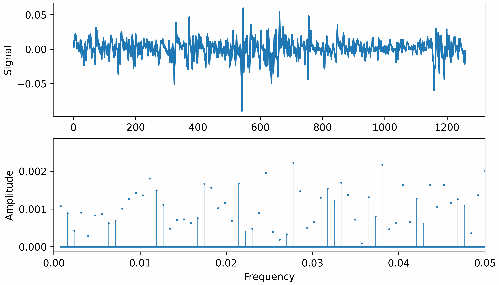

## 2024.03.22 报告中的动图

### 市场收益率每五年的低频振幅变化

1968-07 ~ 1973-06

1973-07 ~ 1978-06

1978-07 ~ 1983-06

1983-07 ~ 1988-06

1988-07 ~ 1993-06

1993-07 ~ 1998-06

1998-07 ~ 2003-06

2003-07 ~ 2008-06

2008-07 ~ 2013-06

2013-07 ~ 2018-06

2018-07 ~ 2018-12

