---
puppeteer:
    printBackground: true
---

# 投资学
- 2021秋季
- 李仲飞

[toc]

### Safety-First
- **背景**
  - 三种safety-first模型，具有相同的亏损约束但不同的优化目标
  - 这里讨论的是第三种

 

- **模型**
$$
\begin{aligned}
    \max_x &\quad E = \mu ^{\mathsf{T}} x\\
    \text{s.t.} &\quad P\{r^{\mathsf{T}}x\leqslant b\} \leq \alpha \\
    &\quad e^{\mathsf{T}}x = 1
\end{aligned}
$$
  - $\mu $是随机向量$r$的期望
  - $b$是给定的收益水平，一般称为生存水平
  - 投资者希望组合收益小于等于生存水平的概率不要超过$\alpha $（假设$\alpha \leqslant 0.5$，则$b\leqslant E$）
  - 当分布已知时（以多元正态为例），亏损约束可以写成
$$
\frac{1}{\sqrt{2\pi }}\int_{-\infty}^{\frac{b-E}{\sigma }} e^{-\frac{t^{2}}{2}} ~\mathrm{d}t\leqslant \alpha = \frac{1}{\sqrt{2\pi }}\int_{-\infty}^{z_{\alpha }} e^{-\frac{t^{2}}{2}} ~\mathrm{d}t
$$
其中$z_\alpha $为标准正态分布的$\alpha $分位数，于是我们有$\frac{b-E}{\sigma }\leqslant z_{\alpha }$，即$E + z_{\alpha }\sigma - b \geqslant 0$
  - 当分布未知或分布不规则时，根据切比雪夫不等式，我们有
$$
\begin{aligned}
P\{r^{\mathsf{T}}x \leqslant b\} &= P\{E - r^{\mathsf{T}}x \leqslant E - b\} \\
&\leqslant P\{\left\vert E - r^{\mathsf{T}} x \right\vert \geqslant E - b\} \\
&\leqslant \frac{\sigma ^{2}}{(E - b)^{2}}
\end{aligned}
$$
因此我们只需满足$\frac{\sigma ^{2}}{(E - b)^{2}} \leqslant \alpha $，即$E - \frac{1}{\sqrt{\alpha }}\sigma  - b\geqslant 0$

 

- **解法**
  - 满足预算$e^{\mathsf{T}}x=1$的集合（马科维茨可行集）为
$$
\frac{\sigma ^{2}}{\frac{1}{C}} - \frac{(E-\frac{B}{C})^{2}}{\frac{D}{C}} \leqslant 1,\quad \sigma > 0
$$
其中$A = \mu ^{\mathsf{T}} \Sigma ^{-1}\mu $，$B = \mu ^{\mathsf{T}} \Sigma ^{-1} e$，$C = e^{\mathsf{T}} \Sigma ^{-1} e$，$D = AC - B^{2}$
  - 有效前沿为
$$
\frac{\sigma ^{2}}{\frac{1}{C}} - \frac{(E-\frac{B}{C})^{2}}{\frac{D}{C}} = 1,\quad \sigma > 0, \quad E\geqslant E_0
$$
其中$E_0 = \frac{B}{C}$是最小方差组合的期望收益率，渐进线斜率为$\sqrt{\frac{D}{C}}$

  - 根据$b$和$\alpha $的不同取值，对比渐近线斜率，判断亏损约束线与有效前沿的相交情况，即可得到不同情况下的解集
  - 当加入无风险资产，有效前沿变成一条射线，此时判断亏损约束线与有效前沿的相交情况同样能得到不同情况下的解集

### Minmax
- **Notation**
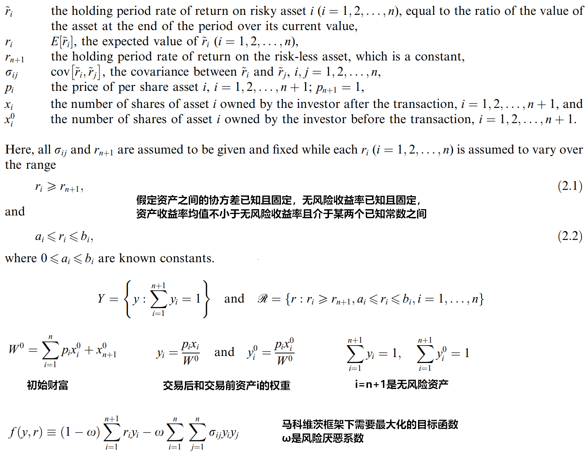

 

- **中心思想**
投资者考虑最坏情况，固定$y$最小化目标函数，得到最坏情况的$r$；再固定$r$，最大化目标函数，得到最优权重

由于约束集的紧致性和目标函数的连续性，$\min$和$\max$的先后顺序可以交换
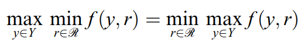
交换后$\max$就很简单了，就是经典的马科维茨解法
而$\min$的目标函数就是最大夏普比的平方

### 交互式组合选取（考虑交易费用与税费，限制卖空）
- **Notation**
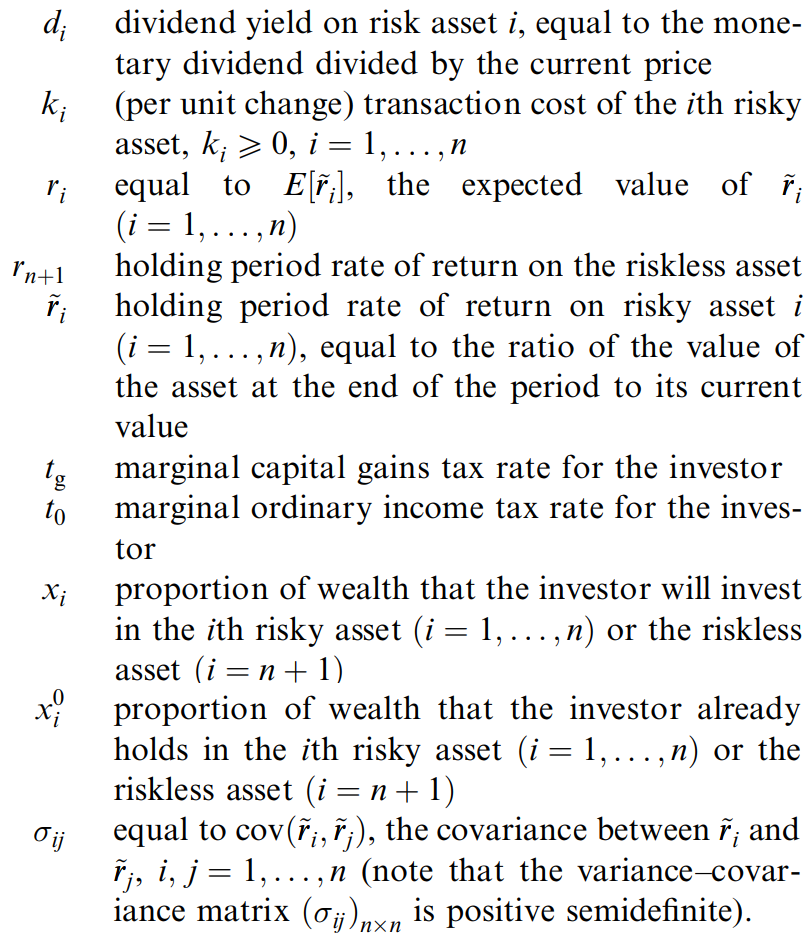
  - 税后单资产收益
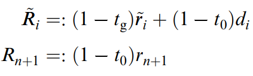
  - 税后费后组合期望收益
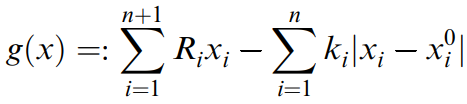
  - 税后费后组合方差

 

- **中心思想**
  - 由于限制卖空，有效前沿左右两边都有边界，即有最小方差，也有最大收益
  - 交互式步骤
  1. 优化出最小方差$V_*$，固定$V_*$优化出给定方差的最大收益$E_*$
  2. 优化出最大收益$E^*$，固定$E^*$优化出给定收益的最小方差$V^*$
  3. 用黄金分割比例在边界中构造两个投资组合，询问投资者更喜欢哪一个，将不喜欢的作为新的边界并不断迭代
  4. 当边界范围小于一个误差容忍阈值时，停止迭代，投资者最后选择的那个投资组合即最优选择

### VaR与CVaR
- **VaR**

  - $\xi$是收益率随机变量
  - $x$是组合权重乘本金
  - $l$是损失函数，$l(x, \xi) = -x^{\mathsf{T}} \xi$，即组合损失
  - 考虑最简单的一维情况，$l(x, \xi) = -x \xi$

 

- **CVaR**
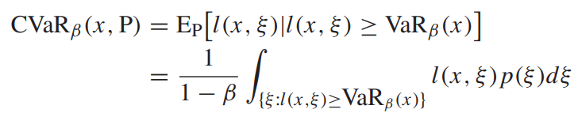
  - 假设上图中非阴影部分的期望为$E^{1-\beta}(\xi)$，那么$CVaR_{\beta} = l\left(x, E^{1-\beta}(\xi)\right)$

 

- **WCVaR**

  - 在所有可能的概率分布（由均值方差决定）中，最大的CVaR，也就是最坏的情况

 

- **$\bm{\alpha}$-robust mean-CVaR model**
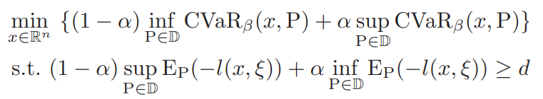
  - $\inf \cdots $是最小的CVaR，也就是考虑最好的情况（激进投资者）
  - $\sup \cdots $是最大的CVaR，也就是考虑最坏的情况（保守投资者）
  - $\alpha$控制激进程度
  - $d$是目标收益率
  - 目标函数中的两个约束和约束条件中的两个分布可能是不一样的，即CVaR最小的时候不一定期望收益最大

 

- **$\bm{\alpha}$-maxmin mean-CVaR model**
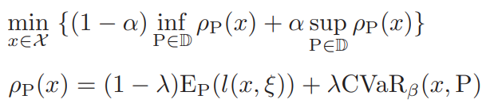
  - $\lambda$是风险厌恶系数
  - $\alpha$控制激进程度
  - $\alpha$-robust是文章的中心思想，$\alpha$-maxmin是这个思想的进一步应用，对其他人的模型进行了改进
  -  $\alpha$-robust的目标函数是$\alpha$-maxmin中$\lambda =1$的特例

### 基于Black-Litterman和复杂网络的行业配置模型
- **中心思想**
  - 考虑行业间整体关联风险
  
 

- **模型**
  - 网络设计
    - 行业网络$G = \{N,\ \theta \}$
    - $N$为节点集合，每个节点代表一个行业
    - $\theta $为边集合，边为有序实数对，若行业$i$，$j$之间有相关性，则$i$，$j$两节点连一条边$(i,\ j)$
    - 用行业指数收益率之间的相关性作为行业间的相关性，则任意两个不同节点之间都有边，是一个完全网络，包含了太多冗杂信息，故要用**最小生成树算法**过滤网络
  - 特征向量中心度
    - 衡量行业在网络中的重要性，既取决于边的数量，也取决于边连接的其他行业（邻居节点）的重要性

  - Black-Litterman
    - 传统的马科维茨模型最大化$U = \omega ^{\mathsf{T}}\mu - \frac{\lambda }{2} \omega ^{\mathsf{T}}\Sigma \omega $，假设全市场市值加权组合$\omega _{eq}$即市场组合，那么令$\frac{\mathrm{d}U}{\mathrm{d}\omega } = 0$可得市场均衡收益率$\Pi = \lambda \Sigma \omega _{eq}$，这个收益率代表着市场的观点（先验的），与投资者的主观观点（后验的）相结合，通过贝叶斯思想可以得到BL模型下的期望收益率
$$
E(r)_{BL} = \left[ (\tau \Sigma )^{-1} + P^{\mathsf{T}}\Omega ^{-1}P \right]^{-1} \left[ (\tau \Sigma )^{-1} \Pi + P^{\mathsf{T}}\Omega ^{-1}Q \right]
$$

      - $k$表示主观观点数量，$P\cdot E(r) = Q + \varepsilon$，$\Omega $为$ \varepsilon$的协方差矩阵
    - 利用BL模型下的期望收益率，重新做马科维茨优化即可得到最优配置
    - 理论上可以证明，BL模型给出的最优配置与中心度的绝对值呈负相关，即会配置更多中间中心度的行业，而配置较少中心度极值的行业

 

- **实证**
  - 考虑三种不同的主观观点：GARCH，MA，SVM
  - 分别做如下回归：
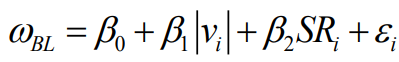
    - $\beta_1$显著为负，即BL模型给出的最优配置确实与中心度的绝对值呈负相关
    - $\beta_2$显著为正，即BL模型更倾向于配置夏普比高的行业
  - 计算行业收益率的CAPM $\beta $，发现中心度绝对值与CAPM $\beta $呈正相关，即中心度绝对值越高，行业系统风险越大

 

- **实证后的模型改进**
  - 先筛选出行业中心度绝对值低（即中间中心度）的行业，再用BL进行配置
  - 最终MA作为主观观点的BL模型配置中间中心度的行业可以达到最高的夏普比

### 行业风险传染
- **聚类风险**
  - 对行业收益率构建VAR模型并做广义方差分解得

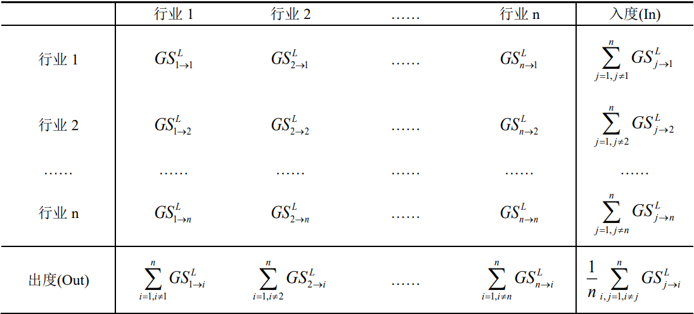
    - 入度为某行业受其他行业的总溢出效应，出度为某行业对其他行业的总溢出效应，右下角为行业收益率溢出总效应
  - 建立网络$G = (V, E)$
    - $V$为节点集合
    - $E$为边集合
  - 四种聚类风险

    - 不同聚类风险有不同的计算公式
    - 实证中对每个行业分别计算四种聚类风险，取最大值为该行业的聚类风险
  - 类相关系数矩阵$C$
    - $C$中非对角线元素为两行业聚类风险的乘积，对角线元素均为$1$
  - 类协方差矩阵$H$
$$
H = \Delta ^{\mathsf{T}} C \Delta 
$$
    - $\Delta $为对角矩阵，对角线元素为$\frac{\sigma_i}{\sqrt{\sum\limits_{i=1}^{n} \sigma_i^{2}}}$
    - $H$既包含了传统的方差风险，又考虑了聚类风险

 

- **银行信贷配置模型**
  - 最小聚类风险模型（Min-C）
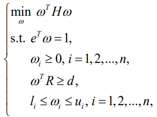
  - 用同样的结构构造了最小方差模型（Min-V）和最小CVaR模型（Min-CVaR），对比发现Min-C是最好的

### FOF（Fund of Fund）与SF（Single Fund）

- **数据偏误**
  - 幸存偏误：如果只研究现存基金，忽略了消亡的基金，会导致业绩上偏
  - 选择偏误：如果数据服务商提供的基金只有现存基金的一部分，则研究结论不具有普适性；
  - 回填偏误：私募基金往往在运行一段时间后才开始向数据服务商提供数据，且自主选择开始提供数据的时间点，通常他们会在业绩比较好的时候开始提供数据，造成业绩上偏；
  - 业绩修改偏误：数据库中基金的历史业绩经常被修改。

 

- **FOF与SF的计量差异**
  - 收益差异
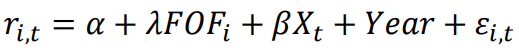
    - $r$为月度超额收益，$FOF$为虚拟变量，FOF取$1$，SF取$0$，$X$是各种因子，$Year$是基于年的固定效应
    - $\lambda $不显著，说明FOF和SF的收益无明显差距
  - 风险差异
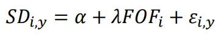
    - $SD$为年度标准差
    - $\lambda $显著为负，说明FOF的风险明显比SF小
  - 夏普比差异
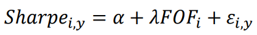
    - $Sharpe$为年度夏普比
    - $\lambda $不显著，说明FOF和SF夏普比无太大差距

 

- **基金经理同时管理FOF和SF是否可以带动SF业绩**
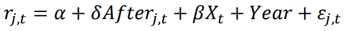
  - $j$为不同基金经理，$After$为虚拟变量，同时管理FOF后取$1$，在此之前为$0$
  - $\delta $显著为正，说明同时管理FOF后，SF的业绩有所提升

 

- **SF业绩提升的原因**
  - SF业绩提升是巧合还是由同时管理FOF引起
    - 建立DID模型
      - 为每个实验组基金经理匹配一个当月各维度相似的只管理SF的基金经理作为对照组
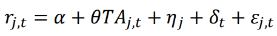
      - $TA$为虚拟变量，实验组为$1$，对照组为$0$，$\eta $为经理固定效应，$\delta $为月份固定效应
      - $\theta $显著为正，说明SF业绩提升就是由同时管理FOF引起的
  - 猜想
  1. 同时管理FOF后基金经理的投资策略发生改变

     * 用因子载荷的变化来衡量
     * 结果显示的确发生了显著改变
  1. 规模经济效应

     * 结果显示SF规模无显著变化
  2. 利益输送（FOF购买SF）
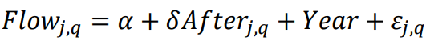
     * 用SF资金流入量来衡量
     * 结果显示流入量无明显变化
  - 结论
    - 导致SF业绩在同时管理FOF后提升的原因是基金经理投资策略发生改变，而非规模效应和利益输送

### relative VaR
- **定义**
$$
relative\ VaR(\alpha, X) = E(X) - q_{\alpha}(X)
$$
  - $q_{\alpha}(X)$为$X$的$\alpha$分位数
  - $1-\alpha$是投资者选择的置信水平，相当于上面VaR定义的中的$\beta$
  - 接下来$relative\ VaR(\alpha, X)$将被简写成$VaR(X)$

 

- **性质**
  - 正齐次性
    - 对任意正数$\beta $，$VaR(\beta X) = \beta VaR(X)$
  - 平移不变性
    - 对任意常数$l$，$VaR(X+l) = VaR(X)$

 

- **广义夏普比**
$$
\begin{equation}
    r_p = x_0 r_f + (1-x_0) r_{\nu }
\end{equation}
$$
  - $x_0$为无风险资产的权重，$r_{\nu }$为风险资产的收益率
  - 由正齐次性和平移不变性可得
$$
\begin{equation}
    VaR(r_p) = (1-x_0)VaR(r_{\nu })
\end{equation}
$$
  - 对式$(1)$取期望，联立式$(2)$可得
$$
E(r_p) = r_f + \frac{E(r_{\nu })-r_f}{VaR(r_{\nu })} VaR(r_p)
$$
  - 我们要在$VaR(r_p)$不超过某个阈值的情况下最大化$E(r_p)$，也就是最大化$\rho = \frac{E(r_{\nu })-r_f}{VaR(r_{\nu })}$，即广义夏普比

 

- **类CAPM性质**
  - 最大化广义夏普比得到市场组合$M$，构造新的组合：$a$份$i$资产与$1-a$份$M$资产
  - 这个组合的收益率，相对VaR和广义夏普比都是关于$a$的函数，分别记作$r_a$，$VaR_{a}$和$\rho _{a}$
$$
\begin{aligned}
r_a &= a r_i + (1-a) r_M \\
VaR_a &= E(r_a) - q_{\alpha }(r_a)\\
&= a E(r_i) + (1-a) E(r_M) - E\left[a r_i + (1-a) r_M|r_a = q_{\alpha }(r_a)\right] \\
VaR_a^{'} &= E(r_i) - E(r_M) - E\left(r_i-r_M|r_a = q_{\alpha }(r_a)\right) \\
\rho _{a}^{'} &= \frac{\left(E(r_i) - E(r_M)\right)VaR_a - \left(E(r_M) - r_f\right)VaR_a^{'}}{VaR_a^{2}}
\end{aligned}
$$
  - 当$a=0$，这个组合即市场组合，此时$\rho _{a}$取到最大值，即
$$
\begin{aligned}
\frac{\left(E(r_i) - E(r_M)\right)VaR_0 - \left(E(r_M) - r_f\right)VaR_0^{'}}{VaR_0^{2}} &= 0 \\
E(r_i) - r_f &= \left(E(r_M) - r_f\right)\left( 1 + \frac{VaR_0^{'}}{VaR_0} \right) \\
 E(r_i) - r_f &= \frac{E(r_i) - E\left(r_i|r_M = q_{\alpha }(r_M)\right)}{VaR(r_M)}\left( E(r_M) - r_f \right) 
\end{aligned}
$$
  - 其中$\frac{E(r_i) - E\left(r_i|r_M = q_{\alpha }(r_M)\right)}{VaR(r_M)}$即相对VaR框架下的CAPM $\beta $

### 新冠背景下基于机器学习的均值-下偏矩模型
- **神经网络结构**
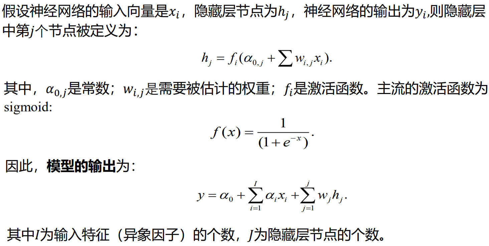

 

- **资产配置正则化**

 

- **均值-下偏矩模型**
  - 使用下偏矩作为风险度量，即优化问题为最大化**索提诺比率**
  - 下偏矩
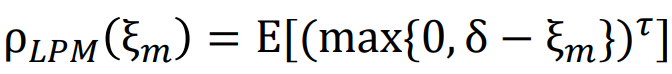
    - $\delta $为基准收益，$\tau $为矩的阶数
  - 下偏矩估计量的样本方差

  - PBR约束
    - 让估计量的样本方差不超过某个阈值
  - 加入PBR约束的优化问题
    - 基于下偏矩估计量的PBR约束

      - 目标函数体现了样本平均近似法（SAA）
    - 基于期望收益率估计量的PBR约束

    - 也可以同时加入以上两种约束
    - 约束的阈值选取由神经网络得到

### 期末考题回忆
> 答案仅供参考，如有错误，可提交issue，欢迎指正。
1. **用方差度量风险有什么不利？请给出两种改进的度量方法，写出数学定义及组合选择模型。**
   - 方差包括了上半风险，即正向的波动，这是投资者所喜欢的。改进方法：relative VaR，下偏二阶矩。定义及模型参考笔记 *relative VaR* 及 *新冠背景下基于机器学习的均值-下偏矩模型* 。
2. **请写出三种safety-first模型，并说说他们的区别。**
   - 亏损约束参考笔记 *Safety-First* ，三种优化目标：最大化期望收益率，最小化方差，两者结合。区别：优化目标不同。
3. **假设概率分布未知，存在ambiguity，两个投资者分别为极端厌恶ambiguity和倾向于喜欢ambiguity，请为他们分别设计一个robust的组合选择模型。**
   - 极端厌恶ambiguity：参考笔记 *VaR与CVaR* 中的 $\sup CVaR$；倾向于喜欢ambiguity：参考笔记 *VaR与CVaR* 中的 $\inf CVaR$。
4. **证明两基金定理。**
   - 前沿组合可以表示为$x^* = x_{MIN} + \tau z^*$，其中$x_{MIN}$为最小方差组合，$z^*$为自融资组合，$\tau $为风险容忍系数。给定任意两个前沿组合$x_A^* = x_{MIN} + \tau_A z^*$，$x_B^* = x_{MIN} + \tau_B z^*$，对任意$\tau_C = \alpha \tau _A + (1-\alpha ) \tau _B$，我们可以得到$x_C^* = x_{MIN} + \tau_C z^* = \alpha x_A^* + (1-\alpha )x_B^*$，证毕。
5. **假定因子模型$\bm{R_i = E(R_i) + \beta_i F + \varepsilon_i}$，证明当两个分散化组合$\bm{\beta}$相等时，在无套利情形下，他们的期望收益率相等；当$\bm{\beta}$不等时，请给出无套利条件。**
   - 分散化组合意味着$ \varepsilon \to 0$，构建自融资组合$R_1-R_2 = E(R_1-R_2) + (\beta_1 - \beta_2)F$，当$\beta $相等时，在无套利情形下，该自融资组合的期望收益率应当为$0$，即$E(R_1-R_2) = 0$；当$\beta $不等时，两边取期望，要满足无套利，需要$E(F) = 0$。
> 此题不确定。
6. **解释FAMA三因子模型中各变量含义，并给出SMB和HML的构造方法。**
   - $r - r_f = \alpha + \beta_1 (r_M-r_f) + \beta_2 SMB + \beta_3 HML + \varepsilon$，其中$r$为资产收益率，$r_f$为无风险收益率，$\alpha $为截距项，$r_M$为市场组合收益率，$SMB$为规模因子，$HML$为价值因子，$\beta $为因子载荷，$ \varepsilon$为误差。构造方法：以NYSE的50\%市值分位数将全市场股票从小到大分为S和B两组，以NYSE的30\%和70\%账面市值比分位数从高到低将全市场股票分为H，M，L三组，交叉可得SH，SM，SL，BH，BM，BL六组，组合内部等权或市值加权得到组合收益率，则$SMB = \frac{SH + SM + SL}{3} - \frac{BH + BM + BL}{3}$，$HML = \frac{SH + BH}{2} - \frac{SL + BL}{2}$（**注意**：不能直接用$S-B$和$H-L$，得到的结果是不同的）
7. **有哪些数据偏误？会对实证产生什么影响？**
   - 参考笔记 *FOF与SF*
8. **马科维茨均值方差模型对输入参数（期望收益率和协方差矩阵）具有怎样的敏感性？Black-Litterman怎么解决这一问题?**
   - 马科维茨均值方差模型对期望收益率很敏感，但对协方差矩阵不太敏感。BL模型参考笔记 *基于Black-Litterman和复杂网络的行业配置模型* ，其中，$P\cdot E(r) = Q + \varepsilon$巧妙地消去了$E(r)$，解决了传统模型对期望收益率敏感的问题。