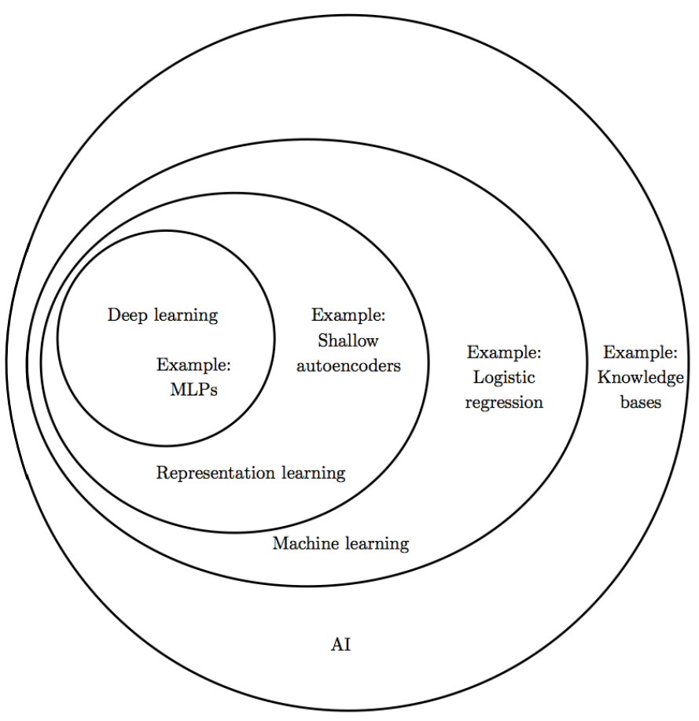
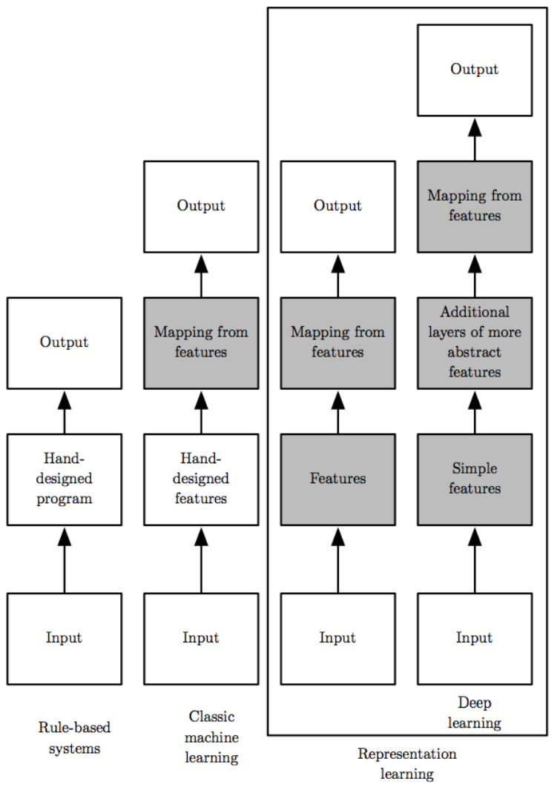
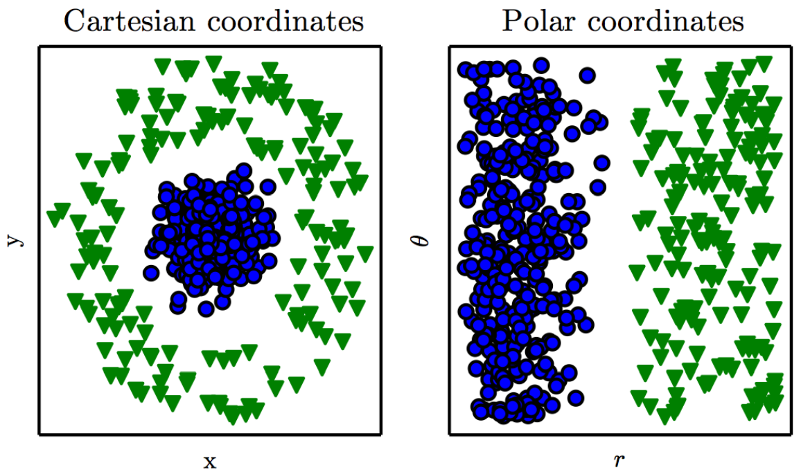
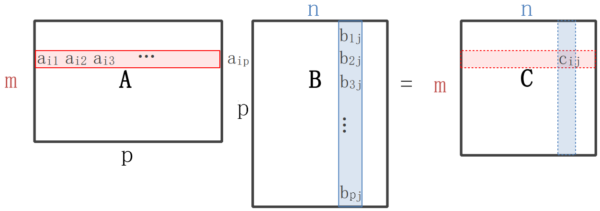

---
puppeteer:
    printBackground: true
---

# 深度学习
- 2022春季
- 郑锋

[toc]

### Introduction
- **Concept Relationships**

  - ==AI== is a field of CS that makes a computer system can mimic human intelligence.
  - There are different ways to realize AI, including ==machine learning==, which enables a coumputer system to make predictions or take some decisions using historical data without being explicitly programmed.
  - In machine learning, ==representation learning== (a.k.a. feature learning) is a set of techniques that allows a system to automatically discover the representations needed for feature detection or classification from raw data.
  - ==Deep learning== is just a part of representation learning with deep neural network.

 

- **Why representation matters?**

  - Consider data with distribution above. In Cartesian coordinates, linear functions cannot classify the data well. However, if we represent the data in the Polar coordinates, then linear functions work well.
  - The process that change raw data into Polar representatives is called encoding, the inverse process is decoding. ==Autoencoders== encode unlabeled data into representatives. If an autoencoder can decode the representatives back to the raw data with little loss, then it is an good autoencoder.
  - Sometimes the feature are too complex to be automatically extracted from raw data. Thus, we need deep neural network to solve problems that shallow autoencoders cannot solve.

### Mathematical Background

- Matrix Multiplication
  - Inner Product
  
  It is about correlation. If the row in A and the column in B are the same, the product would be the biggest.