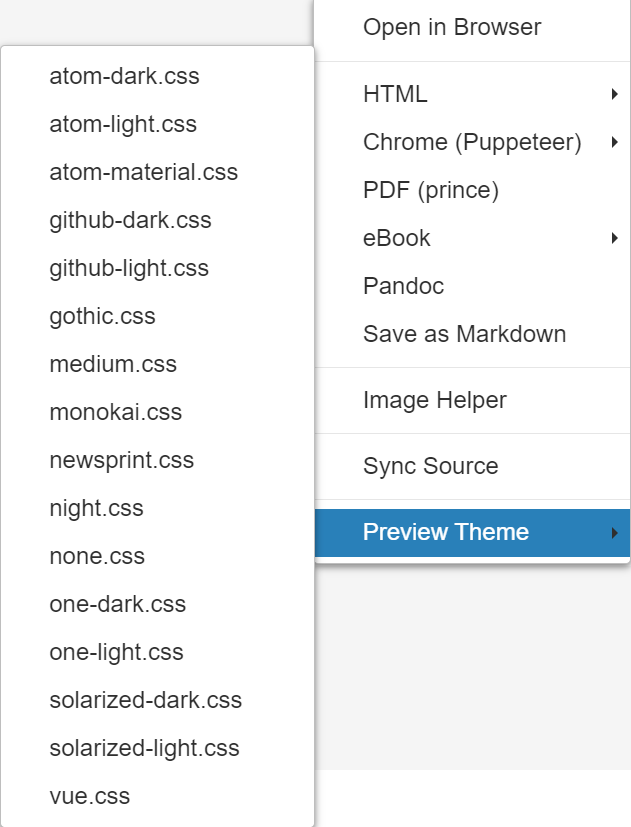

@import "mpe_guide_style.less"

# Markdown Preview Enhanced for VSCode {ignore}

*[MPE]: Markdown Preview Enhanced
*[TOC]: Table of Contents

<!-- @import "[TOC]" {cmd="toc" depthFrom=1 depthTo=6 orderedList=false} -->

<!-- code_chunk_output -->

- [语言规则](#语言规则)
- [结构体](#结构体)
  - [标题：`#`](#标题)
  - [列表](#列表)
    - [无序列表： `-`](#无序列表-)
    - [有序列表：`数字 + .`](#有序列表数字)
    - [任务列表：`- [ ]` 与 `- [x]`](#任务列表-与-x)
  - [引用：`>`](#引用)
  - [便签块：`!!! + 类型 + 标题`](#便签块-类型-标题)
  - [表格：`|`](#表格)
  - [代码块：\`\`\` + 代码 + \`\`\`](#代码块-代码)
  - [行内代码：\` + 代码 + \`](#行内代码-代码)
- [文字效果](#文字效果)
  - [斜体：`*` 或 `_`](#斜体-或-_)
  - [加粗：`**` 或 `__`](#加粗-或-__)
  - [删除线：`~~`](#删除线~~)
  - [高亮：`==`](#高亮)
  - [上标：`^`](#上标)
  - [下标：`~`](#下标~)
- [排版功能](#排版功能)
  - [目录](#目录)
  - [分割线：`---`](#分割线-)
  - [打印分页](#打印分页)
- [其他功能](#其他功能)
  - [LaTeX：`$` 与 `$$`](#latex-与)
  - [链接：`[文字]` + `(链接)`](#链接文字-链接)
    - [网页](#网页)
    - [标题](#标题-1)
  - [图片：``](#图片图片地址)
  - [Emoji](#emoji)
  - [绘图](#绘图)
  - [定义缩写：`*[缩写]: 全称`](#定义缩写缩写-全称)
  - [导入外部文件：`@import "文件名"`](#导入外部文件import-文件名)
    - [代码](#代码)
    - [Markdown 文件](#markdown-文件)
    - [表格](#表格-1)
    - [CSS 样式](#css-样式)
- [HTML 语言与 CSS 样式](#html-语言与-css-样式)
  - [空行：`<br>`](#空行br)
  - [空格](#空格)
    - [半方占位符：`&ensp;`](#半方占位符ensp)
    - [全方占位符：`&emsp;`](#全方占位符emsp)
  - [居中：`<center>`](#居中center)
  - [下划线：`<u>`](#下划线u)
  - [折叠内容：`<details>`](#折叠内容details)
  - [CSS 样式](#css-样式-1)
    - [自定义全局样式](#自定义全局样式)
    - [模板样式](#模板样式)
    - [局部样式](#局部样式)
- [输出文件](#输出文件)
  - [元数据](#元数据)
  - [HTML](#html)
  - [PDF](#pdf)
  - [Word](#word)
- [更多](#更多)

<!-- /code_chunk_output -->

<!-- pagebreak -->

## 语言规则

`Enter` 起到换行或结构体分块的作用，但不能实现空行，也就是多次 `Enter` 是无效的。
`Space` 只能空一格，不能连续空格，通常也起到声明结构体的作用。
`Tab` 用来改变结构体层级。

实现其他的需求需要使用[HTML语言](#其他常用html语言)。

<!-- pagebreak -->

## 结构体

不同的符号可以声明不同的结构体，比如列表、引用、便签块等等。每一个声明结构体的符号后都需要空一格再写后续内容，结构体与结构体之间的层级关系用 `Tab` 来控制。

### 标题：`#`

用 `#` 来表示一级标题，`##` 表示二级标题，以此类推。

!!! example 例子
    ```markdown
    ### 三级标题
    ```

    ### 三级标题

### 列表

#### 无序列表： `-`

!!! example 例子
    ```markdown
    - 第一点
    - 第二点
        - 第二点中的第一小点
    ```

    - 第一点
    - 第二点
        - 第二点中的第一小点

!!! note 注意
    如果安装了 Markdown All in One 插件，默认 `Tab` 是只空2格而非4格，但不影响改变层级的效果。如果想改成4格，需要在设置中的 `Markdown › Extension › List: Indentation Size` 中选择 `inherit`。

#### 有序列表：`数字 + .`

!!! example 例子
    ```markdown
    1. 第一点
    2. 第二点
        1. 第二点中的第一小点
    ```

    1. 第一点
    2. 第二点
        1. 第二点中的第一小点
    
!!! tip 提示
    如果安装了 Markdown All in One 插件，回车即可自动按顺序编号，再次回车可以取消编号。

#### 任务列表：`- [ ]` 与 `- [x]`

用 `- [ ]` 表示未完成的任务，用 `- [x]` 表示已完成的任务。

!!! example 例子
    \- [&ensp;] 任务一
    \- [x] 任务二

    - [ ] 任务一
    - [x] 任务二

### 引用：`>`

!!! example 例子
    ```markdown
    > MPE 是最好的 Markdown 插件。
    > ——鲁迅
    ```

    > MPE 是最好的 Markdown 插件。
    > ——鲁迅

### 便签块：`!!! + 类型 + 标题`

!!! example 例子
    ```markdown
    !!! note 注意
        明天开会。
    ```

    !!! note 注意
        明天开会。

支持以下类型的便签块：

<center>


</center>

### 表格：`|`

表格的声明相对比较复杂，第一行是表头，第二行是控制对应列的文字排版，第三行及以下是表格的内容。

!!! example 例子
    ```markdown
    |         表头1          | 表头2              |              表头3 |
    | :--------------------: | :----------------- | -----------------: |
    |      两个冒号居中      | 冒号在左左对齐     |     冒号在右右对齐 |
    |           >            | `>` 合并左边单元格 | `^` 合并下方单元格 |
    | 空着不写合并右边单元格 |                    |                  ^ |
    ```

    |         表头1          | 表头2              |              表头3 |
    | :--------------------: | :----------------- | -----------------: |
    |      两个冒号居中      | 冒号在左左对齐     |     冒号在右右对齐 |
    |           >            | `>` 合并左边单元格 | `^` 合并下方单元格 |
    | 空着不写合并右边单元格 |                    |                  ^ |

!!! tip 提示
    由于表格的书写过于繁琐，如果有书写表格的需求，建议安装 HyperSnips for Math 插件，在 snippet 文件中加入以下代码，即可通过输入 `table + 行数 + 列数` 来生成表格。

    ```json
    function createTable(rows, cols) {
        let ret = "";
        for (let i = 0; i < parseInt(rows) + 2; i++) {
            for (let j = 0; j < parseInt(cols); j++) {
                if (i === 1) {
                    ret += "|:---:";
                } else {
                    ret += "|  ";
                }
            }
            ret += "|\n"
        }
        return ret;
    }

    priority 300
    snippet `table(\d)(\d)` "create table with rows and columns" wA
    ``
    rv = createTable(m[1], m[2]);
    ``
    endsnippet
    ```

### 代码块：\`\`\` + 代码 + \`\`\`

用三个键盘左上角类似顿号的符号来声明代码块的开始与结束，起始符后面接语言类型，比如 python、json、markdown 等等。

!!! example 例子
        ```python
        print('Hello world!')
        ```

    ```python
    print('Hello world!')
    ```

通过在语言类型后自定义 `class` 和 `attribute`，可以对代码块进行一些自定义操作，例如：

- **添加行号**

    !!! example 例子
            ```python {.line-numbers}
                def add(x, y):
                return x+y
            ```

        ```python {.line-numbers}
        def add(x, y):
            return x+y
        ```

- **高亮某几行**

    !!! example 例子
            ```python {highlight=[1-3, 5]}
            def add(x, y):
                return x+y

            def multiply(x, y):
                return x*y
            ```

        ```python {highlight=[1-3, 5]}
        def add(x, y):
            return x+y

        def multiply(x, y):
            return x*y
        ```


- **执行代码**

    !!! example 例子

            ```python {cmd}
                def add(x, y):
                    return x+y

                print(add(1, 2))
            ```

        ```python {cmd}
        def add(x, y):
            return x+y

        print(add(1, 2))
        ```

    !!! note 注意
        需要按 `F1` 选择 `Markdown Preview Enhanced: Run All Code Chunks` 执行代码，如果执行不了，在设置中勾选 `Markdown-preview-enhanced: Enable Script Execution`。

### 行内代码：\` + 代码 + \`

!!! example 例子
    ```markdown
    欢迎来到 python 的世界，输入 `print('Hello World!')` 打个招呼吧！
    ```

    欢迎来到 python 的世界，输入 `print('Hello World!')` 打个招呼吧！

<!-- pagebreak -->

## 文字效果

在文字两边加上不同的符号，可以有不同的文字效果，比如加粗、斜体、上下标等等。

### 斜体：`*` 或 `_`

!!! example 例子
    ```markdown
    *一个星号* 或 _一个下划线_
    ```

    *一个星号* 或 _一个下划线_

!!! tip 提示
    如果安装了 Markdown All in One 插件，可以选中文字按 `Ctrl + I` 达到斜体的效果。

### 加粗：`**` 或 `__`

!!! example 例子
```markdown
**两个星号** 或 __两个下划线__
```

**两个星号** 或 __两个下划线__

!!! tip 提示
    如果安装了 Markdown All in One 插件，可以选中文字按 `Ctrl + B` 达到加粗的效果。

平时单独加粗或者单独斜体用 `*` 或 `_` 都可以，但如果既要加粗又要斜体，则需要 `*` 与 `_` 组合使用：

!!! example 例子
    ```markdown
    **_组合使用_**
    ```

    **_组合使用_**

### 删除线：`~~`

!!! example 例子
    ```markdown
    ~~两个波浪线~~
    ```

    ~~两个波浪线~~

### 高亮：`==`

!!! example 例子
    ```markdown
    ==两个等于号==
    ```

    ==两个等于号==

### 上标：`^`

!!! example 例子
    ```markdown
    2^th^
    ```

    2^th^

### 下标：`~`

!!! example 例子
    ```markdown
    x~1~
    ```

    x~1~

## 排版功能

### 目录

按 `F1` 打开功能搜索，选择 `Markdown Preview Enhanced: Create TOC`， `Ctrl + S` 保存即可。在标题后加 `{ignore}` 即可忽略该标题不放入目录。

```markdown
#### 不在目录中显示 {ignore}
```

#### 不在目录中显示 {ignore}

!!! note 注意
    如果安装了 Markdown All in One 插件，需要在设置中取消 `Markdown > Extension > TOC: Update On Save` 的勾选，因为这个设置会导致保存时用的是 Markdown All in One 的目录生成功能而不是 MPE 的。

### 分割线：`---`

!!! example 例子
    ```markdown
    ---
    ```

    ---

### 打印分页

输入 `pagebreak` 并 `Ctrl + /` 注释，即可在打印成 pdf 的时候在相应位置分页。

```markdown
<!-- pagebreak -->
```

<!-- pagebreak -->

## 其他功能

### LaTeX：`$` 与 `$$`

MPE 的 LaTeX 语句用 KaTeX 渲染，一个美元符号代表行内公式，两个则代表块公式。

!!! example 例子
    ```markdown
    $1 + 1 = 2$

    $$
    1 + 1 = 2
    $$
    ```

    $1 + 1 = 2$

    $$
    1 + 1 = 2
    $$

!!! tip 提示
    如果安装了 Markdown All in One 插件，按一下 `Ctrl + M` 即进入行内公式模式，按两下则进入块公式模式。

### 链接：`[文字]` + `(链接)`

用 `[文字](链接)` 的形式可以制作一个“传送门”，在文中以文字的形式出现，点击可以前往对应的链接，链接的形式包括网页和标题。

#### 网页

用 `[文字](网址)` 来生成网页链接。


!!! example 例子
    ```markdown
    你不会[百度](https://www.baidu.com)吗？
    ```

    你不会[百度](https://www.baidu.com)吗？

#### 标题

用 `[文字](#标题)` 来生成标题链接。


!!! example 例子
    ```markdown
    [点击此处前往文字效果](#文字效果)
    ```

    [点击此处前往文字效果](#文字效果)

!!! note 注意
    英文均为小写，空格换成 `-`。如果有同名标题，第二个出现的标题需要在标题后加 `-1`，第三个需要加 `-2`，以此类推。
    
    !!! example 例子
        ```markdown
        [第一个“CSS 样式”](#css-样式)
        [第二个“CSS 样式”](#css-样式-1)
        ```

        [第一个“CSS 样式”](#css-样式)
        [第二个“CSS 样式”](#css-样式-1)

### 图片：``

*[URL]: Uniform Resource Locator

图片地址可以是本地路径（绝对路径或相对路径均可），也可以是 URL。

!!! example 例子
    ```markdown
    
    ```

    

如果觉得复制路径麻烦，可以按 `F1` 选择 `Markdown Preview Enhanced: Image Helper`，以图形界面的形式上传图片。

!!! tip 提示
    如果安装了 Paste Image 插件，即可复制图片后通过 `Ctrl + Alt + V` 的快捷键直接粘贴图片。

### Emoji

支持 emoji 表情显示，表情代码可查找[emoji表](https://www.webfx.com/tools/emoji-cheat-sheet/)。


!!! example 例子
    ```markdown
    :smile: :flushed: :sweat: :sob: :joy:

    :+1: :ok_hand: :point_down: :clap: :muscle: :pray:

    :heart: :fire: :boom: :star2: :shit: :zzz:
    ```

    :smile: :flushed: :sweat: :sob: :joy:

    :+1: :ok_hand: :point_down: :clap: :muscle: :pray:

    :heart: :fire: :boom: :star2: :shit: :zzz:

### 绘图

MPE 支持好几种绘图语言，见[官方文档](https://shd101wyy.github.io/markdown-preview-enhanced/#/zh-cn/diagrams)。个人认为 [Mermaid](https://mermaid-js.github.io/mermaid/#/) 算是比较常用且方便的，可以绘制流程图等。

MPE 中内置了三个 Mermaid 主题，可以在设置中找到 `Markdown-preview-enhanced: Mermaid Theme` 进行更改。

### 定义缩写：`*[缩写]: 全称`

!!! example 例子
    ```markdown
    *[CNN]: Convolutional Neuraul Network
    
    Chairman Zheng is proficient in CNN.
    ```

    *[CNN]: Convolutional Neuraul Network

    Chairman Zheng is proficient in CNN.

!!! note 注意
    鼠标悬浮即可看到全称（pdf 不支持该效果）且全局生效（即整篇文章出现这一字样都会有下划虚线，不管是定义前还是定义后）。
    
!!! note 注意
    如果中英夹杂，英文与中文之间需要有空格才会生效，与标点符号之间不需要有空格。

### 导入外部文件：`@import "文件名"`

可以通过 `@import "文件名"` 导入外部文件，比如导入代码、图片、css样式等等，但不可以有层级关系，即不能在其他结构体下导入。

#### 代码

导入代码形成代码块，同样可以在后面声明 `class` 和 `attribute`。

<center>


</center>

```markdown
@import "test.py" {.line-numbers}
```

@import "test.py" {.line-numbers}

#### Markdown 文件

导入 Markdown 文件即可做到重复利用某个文字片段。

<center>


</center>

```markdown
@import "test.md"
```

@import "test.md"

#### 表格

导入 csv 格式的表格可以避免繁琐的表格输入。

<center>


</center>

```markdown
@import "test.csv"
```

@import "test.csv"

#### CSS 样式

见 [HTML 语言与 CSS 样式-CSS 样式](#css-样式-1)。

<!-- pagebreak -->

## HTML 语言与 CSS 样式

Markdown 是 HTML 的简化版，因此也支持 HTML 语句，但 Markdown 本身就是为了注重内容而生，用 HTML 语句实际上破坏了 Markdown 的初衷，所以尽量只用 CSS 样式来控制排版。

### 空行：`<br>`

由于 Markdown 中回车键最多只能空一行，如果想要空多行，需要用 HTML 语句实现。

!!! example 例子
    ```markdown
    第一行

    第二行
    
    <br>

    第四行
    ```
    第一行

    第二行

    <br>

    第四行

### 空格

#### 半方占位符：`&ensp;`

半方占位符相当于一个英文字符的大小，比 Markdown 中的空格要大一点点。

!!! example 例子
    ```markdown
    ab
    a b
    a&ensp;b
    ```
    ab
    a b
    a&ensp;b

#### 全方占位符：`&emsp;`

全方占位符相当于一个中文字符的大小。

!!! example 例子
    ```markdown
    哈哈
    &emsp;哈哈
    ```
    哈哈
    &emsp;哈哈

### 居中：`<center>`

用 `<center>` 标签可以对文字或图片进行居中，但不能对表格进行居中。

!!! example 例子
    ```markdown
    <center>
        
    与头标签空一行
    </center>
    ```

    <center>
        
    与头标签空一行
    </center>

### 下划线：`<u>`

可以使用 `<u></u>` 对文字添加下划线。

!!! example 例子
    ```markdown
    <u>html u 标签</u>
    ```

    <u>html u 标签</u>

### 折叠内容：`<details>`

可以通过 `<details></details>` 来折叠文字，并用 `<summary></summary>` 来显示简要文字。

!!! example 例子
    ```markdown
    <details>
    <summary>展开查看</summary>

    内容要与上面空一行！
    </details>
    ```

    <details>
    <summary>展开查看</summary>
    
    内容要与上面空一行！
    </details>
    
!!! note 注意
    输出 pdf 的话，折叠块是打不开的。

### CSS 样式

MPE 的 CSS 样式分为全局（对所有文件生效）和局部（只对指定文件生效），全局样式又分模板样式和自定义样式，一般调整样式的顺序为

<center>


</center>

#### 自定义全局样式

全局的自定义样式需要按 `F1` 选择 `Markdown Preview Enhanced: Customize CSS` 来打开。

其中以 `.` 开头的为类（class），默认的 `.markdown-preview.markdown-preview` 即为全局类，在其中写的样式会应用到全局。

!!! example 例子
    ```less
    .markdown-preview.markdown-preview {
        mark {
            background-color: #f8aba6;// 梅色
        }
    }
    ```

    这个 `mark` 样式让我所有文件中的[高亮](#高亮)都变成梅色。

除了默认应用的全局类，还可以自定义手动调用的类。

!!! example 例子
    ```less
    .centertable {
        width: auto;
        display: table;
        margin-left: auto;
        margin-right: auto;
        }
    ```

    这个类可以对表格进行居中显示，只需在要居中的表格前后加上容器标签 `<div class='centertable'></div>`。

    !!! example 例子
        ```markdown
        <div class='centertable'>
    
        |           注意           |          注意          |
        | :----------------------: | :--------------------: |
        | 头标签与表格之间需要空行 | 标签与上下文也需要空行 |
        </div>
        ```

        <div class='centertable'>

        |           注意           |          注意          |
        | :----------------------: | :--------------------: |
        | 头标签与表格之间需要空行 | 标签与上下文也需要空行 |
        </div>

#### 模板样式

模板样式可以在预览窗口中右键选择 `Preview Theme`：

<center>


</center>

#### 局部样式

局部样式需要通过 `@import` 的操作来导入，可以在[元数据](#元数据)区声明要用的类。具体使用方式可以参考[官方文档](https://shd101wyy.github.io/markdown-preview-enhanced/#/zh-cn/customize-css?id=%e6%9c%ac%e5%9c%b0%e6%a0%b7%e5%bc%8f)。

<!-- pagebreak -->

## 输出文件

### 元数据

在 Markdown 文件的顶端输入

```markdown
---

---
```

这两条虚线区域内的代码被称为元数据（metadata），为 YAML 语言。元数据控制着输出的效果。

### HTML

由于 Markdown 是 HTML 语言的简化版本，html 文件能最大程度地接近预览的效果。在预览窗口中右键选择 `HTML > HTML (cdn hosted)` 即可生成对应的 html 文件。

!!! tip 提示
    输出 html 时默认侧边栏收缩，如果需要默认展开，则可以输入以下元数据：

    ```yaml
    ---
    html:
        toc: true
    ---
    ```

    如果不需要侧边栏，则为 `false`。默认是 `undefined`。

### PDF

如果安装了 Chrome 浏览器，直接在预览窗口中右键选择 `Chrome (Puppeteer) > PDF` 即可导出 pdf。

如果没有安装 Chrome 浏览器，但有使用 Chromium 内核的浏览器（比如 Edge），你需要找到该浏览器对应的执行文件（比如 Edge 的执行文件路径为 `C:\Program Files (x86)\Microsoft\Edge\Application\msedge.exe`），在设置中将这个路径输入 `Markdown-preview-enhanced: Chrome Path`，即可按上面相同的操作导出 pdf。

!!! note 注意
    Puppeteer 默认 `printBackground` 的属性是 `false`，即在预览中设置的主题（模板样式）并不会打印出来，如果想要打印主题，可以按 `F1` 选择`Prefrences: Open Settings (JSON)`，在里面加入`"markdown-preview-enhanced.printBackground": true`的设置。

!!! note 注意
    在文件中包含 LaTeX 公式时，输出成 pdf 可能导致公式不显示，这是因为输出的速度太快了，公式还没来得及渲染。可以输入以下元数据来延迟输出：

    ```yaml
    ---
    puppeteer:
        timeout: 3000
    ---
    ```

!!! tip 提示
    如果想针对性地调整更多的设置，比如页边距之类的，可以在预览窗口右键选择 `Open in Browser`，在浏览器的 `打印` 选项中进行调整。

### Word

想要输出成 Word 格式的文件，需要安装 [Pandoc](https://pandoc.org/)，并输入以下元数据：

```yaml
---
output: word_document
---
```

但 Pandoc 对于很多 HTML 语言以及 CSS 样式都不太支持，因此输出成 Word 基本上只能对内容进行一个保留。

<!-- pagebreak -->

## 更多

更多的功能可以参考[官方文档](https://shd101wyy.github.io/markdown-preview-enhanced/#/zh-cn/)。